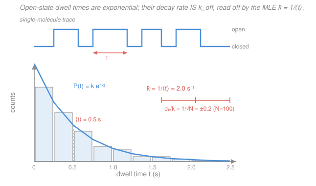

# Biophysics · Lesson 4.6: Single-molecule statistical inference

> ⏱ ~15 min · Module 4: Motors, kinetics, and membrane potentials · Builds on: [4.5 Excitable membranes and the action potential](04-05-excitable-membranes-action-potential.md), [`prob-stat-refresher` syllabus](../../prob-stat-refresher/syllabus.md) · Unlocks: **course finale** — bridges to [`systems-biology` syllabus](../../systems-biology/syllabus.md)

## Why this matters

Everything in this course has run one direction: physics *predicts a distribution*. A rate $k$ gives exponential waiting times; a random walk gives a Gaussian spread; counting rare events gives Poisson statistics. But the experiment runs the other way. You clamp a single ion channel and watch it *blink* — open, closed, open — a jagged stochastic trace with no rate constant written on it anywhere. Your job is to run the arrow **backward**: turn that noisy trace into a number, $k_{\text{off}}$ or $K_d$, **with an honest error bar**. That inversion — physics forward, statistics back — is the entire modern quantitative-biology workflow, and it's how this course ends: not with another prediction, but with the discipline of extracting truth from noise.

## The idea

Watch a channel sit in its open state. It doesn't "know" how long it's been open — at every instant it has the *same* chance per unit time of snapping shut. That memoryless "constant chance per unit time" is the defining property of a **Poisson process**, and it forces the time you wait — the **dwell time** — to be **exponentially distributed**. Long dwells are rare, short ones common, and the whole distribution decays at exactly the closing rate.

So here's the trick that feels like magic the first time: **histogram the open-dwell times, and the decay rate of that histogram is literally $k_{\text{off}}$** — the same $k_{\text{off}}$ from mass-action kinetics in [4.1](04-01-reaction-kinetics-mass-action.md), now read straight off single molecules. No test tube, no concentration, no bulk average — one molecule, watched long enough, hands you the rate constant.

But a histogram wastes information (which bins? how wide?). The cleaner move is **maximum likelihood**: ask "what rate makes the data I actually saw most probable?" For exponential dwells the answer is embarrassingly simple — **the rate is one over the mean dwell time**. And because every rate estimate is built from a finite pile of $N$ events, it comes with irreducible Poisson jitter: the fractional error is $1/\sqrt{N}$. Want the rate to 10%? Collect ~100 events. Want 1%? You need ~$10^4$. You cannot beat $1/\sqrt N$ — it's the counting statistics of the universe.

## The formal version

**Dwell times are exponential.** A state that leaves at constant rate $k$ (units: $\text{s}^{-1}$) has dwell time $t$ drawn from the probability density

$$P(t) = k\,e^{-kt}, \qquad t \ge 0.$$

*In words: the chance of still waiting decays exponentially, and the decay constant is the rate you want.* The mean dwell is $\langle t\rangle = \int_0^\infty t\,k e^{-kt}\,dt = 1/k$ — a state that closes at $2\ \text{s}^{-1}$ stays open half a second on average. The companion fact (same physics, counting instead of timing): the **number** of events in a fixed window $T$ is Poisson with mean $kT$. Exponential waiting times and Poisson counts are two faces of one process — see [`prob-stat-refresher` syllabus](../../prob-stat-refresher/syllabus.md) (memorylessness of the exponential).

**Maximum likelihood estimate (MLE).** You observe $N$ dwell times $\{t_1,\dots,t_N\}$. Treat them as independent draws and write the probability of *this exact dataset* as a function of the unknown rate — the **likelihood**:

$$L(k) = \prod_{i=1}^{N} k\,e^{-k t_i}.$$

*In words: how probable is what I saw, if the rate were $k$?* Maximize it. Products are ugly, so maximize the log (same maximizer, since $\log$ is monotone):

$$\ln L(k) = N\ln k - k\sum_i t_i, \qquad \frac{d\ln L}{dk} = \frac{N}{k} - \sum_i t_i = 0.$$

Solving gives the estimator

$$\boxed{\;\hat k = \frac{N}{\sum_i t_i} = \frac{1}{\langle t\rangle}\;}$$

*In words: the best-fit rate is just $N$ events divided by the total time spent waiting — one over the mean dwell.* Bin-free, assumption-clean, and it needs no histogram at all.

**The error bar ($1/\sqrt N$).** An estimate you can't put an error bar on is not a measurement. The spread of $\hat k$ over hypothetical repeats comes from the curvature of $\ln L$ (the Fisher information $I = N/k^2$), giving $\operatorname{Var}(\hat k) = k^2/N$, i.e.

$$\frac{\sigma_k}{k} = \frac{1}{\sqrt N}.$$

*In words: the fractional uncertainty in the rate is one over the square root of the number of events.* This is not a property of your apparatus — it is **Poisson counting statistics**, the same $\sqrt N$ that governs shot noise and the CLT from Module 1.2. Ten events buys you ~30%; a hundred buys 10%; a million buys 0.1%. Precision is *bought with events*, and the exchange rate is brutally fixed.

**Model comparison — one exponential or two?** Sometimes the histogram won't fit a single exponential: the log-plot bends, hinting the "open" state is secretly *two* states (a hidden conformation) with rates $k_1, k_2$. A two-exponential model $P(t) = a\,k_1 e^{-k_1 t} + (1-a)\,k_2 e^{-k_2 t}$ has **three** free parameters instead of one, so it *always* fits at least as well — more knobs never hurt the fit. The honest question is whether the improvement beats the cost of the extra knobs. Score each model by

$$\text{AIC} = 2p - 2\ln \hat L, \qquad \text{BIC} = p\ln N - 2\ln\hat L,$$

where $p$ is the number of parameters and $\hat L$ the maximized likelihood. *In words: reward fit ($\ln\hat L$ up), penalize complexity ($p$ up); pick the smaller score.* Lower wins. This is the guardrail against **over-fitting noise** into a story about hidden states that isn't there.

## Picture

The trace up top is the raw data — every "open" segment has a width $\tau$. Drop all those widths into a histogram (bottom) and they pile up into an exponential whose decay rate is $\hat k = 1/\langle t\rangle = 2.0\ \text{s}^{-1}$. The coral error bar says: with $N=100$ events, that rate is good to $\pm 0.2\ \text{s}^{-1}$ (10%), no better.

## Worked examples

**Example 1 (read the rate off five dwells).** A channel's open dwells (seconds) are measured as $\{0.3,\ 0.7,\ 0.5,\ 1.2,\ 0.3\}$. Estimate $k_{\text{off}}$ and its uncertainty.

The MLE needs only two numbers, $N$ and the total time:

$$\sum_i t_i = 0.3+0.7+0.5+1.2+0.3 = 3.0\ \text{s}, \qquad N = 5,$$
$$\hat k = \frac{N}{\sum t_i} = \frac{5}{3.0} \approx 1.67\ \text{s}^{-1}, \qquad \langle t\rangle = \frac{1}{\hat k} = 0.6\ \text{s}.$$

Error bar: $\sigma_k/k = 1/\sqrt5 \approx 0.45$, so $\sigma_k \approx 0.45 \times 1.67 \approx 0.75\ \text{s}^{-1}$, i.e.

$$k_{\text{off}} = 1.7 \pm 0.7\ \text{s}^{-1}.$$

That $\pm 45\%$ is a warning label: **five events is not a measurement**, it's a hint. The number is real; the error bar is honest about how little you can conclude.

**Example 2 (how long must you watch?).** You want $k_{\text{off}}$ to $5\%$ so you can tell it apart from a mutant channel that closes 15% faster. How many open dwells do you need, and roughly how long is the experiment if $\langle t\rangle \approx 0.5\ \text{s}$?

Set the fractional error to the target:

$$\frac{1}{\sqrt N} = 0.05 \;\Longrightarrow\; \sqrt N = 20 \;\Longrightarrow\; N = 400.$$

Each open dwell averages $0.5\ \text{s}$, and (roughly) the channel spends a comparable time closed between openings, so budget $\sim 1\ \text{s}$ of trace per event: about $400\ \text{s} \approx 7$ minutes of clean recording. Doubling the precision to $2.5\%$ would demand $N=1600$ — **four times** the data for twice the precision. That quadratic price is the tax $1/\sqrt N$ charges, and it's why single-molecule papers report hundreds to thousands of events.

## Watch out

- **You might think a finer histogram gives a better rate.** It doesn't — binning throws away information and the choice of bin width is arbitrary. The MLE $\hat k = N/\sum t_i$ uses every dwell exactly and needs no bins at all. Histogram to *look* at the data (is it really one exponential?), fit by likelihood to *measure* it.
- **You might think a better microscope beats the $1/\sqrt N$ error.** No instrument beats counting statistics. If your rate has a $1/\sqrt N$ error bar, the only cure is more events — sharper optics reduce *other* noise, not this. The $\sqrt N$ wall is Poisson, not engineering.
- **You might think a two-exponential fit "explaining more variance" means two states are real.** Extra parameters always fit better. Only if the likelihood gain clears the AIC/BIC complexity penalty should you believe the hidden state — otherwise you've fit noise and invented biology that isn't there.

## One-liner

> Exponential dwells hand you the rate as $\hat k = 1/\langle t\rangle$, Poisson counting caps your precision at $1/\sqrt N$, and AIC/BIC stops you from over-fitting noise into fictional states — physics predicts the distribution, statistics inverts it with an error bar.

## Problems

**P1 (🟢)** A motor protein's "paused" state is recorded over $N = 64$ pauses with total paused time $\sum t_i = 40\ \text{s}$. Give the MLE rate of leaving the pause, the mean pause duration, and the fractional error on the rate.

**P2 (🟡)** You measured $k_{\text{off}}$ to $\pm 20\%$ from 25 events. Your reviewer wants it to $\pm 4\%$. How many total events must you collect, and by what factor must you extend the recording?

**P3 (🔴, optional)** Fitting a dwell-time set of $N = 500$ events, a single-exponential model ($p=1$) gives $\ln\hat L = -820$; a double-exponential model ($p=3$) gives $\ln\hat L = -816$. Using AIC and BIC, decide which model to report. Do they agree?

Solutions

**P1** Same two numbers as always:

$$\hat k = \frac{N}{\sum t_i} = \frac{64}{40} = 1.6\ \text{s}^{-1}, \qquad \langle t\rangle = \frac{1}{\hat k} = 0.625\ \text{s},$$
$$\frac{\sigma_k}{k} = \frac{1}{\sqrt N} = \frac{1}{\sqrt{64}} = \frac18 = 12.5\%.$$

So the leaving rate is $1.6 \pm 0.2\ \text{s}^{-1}$.

*Check.* Units: $\hat k$ is (count)/(seconds) $= \text{s}^{-1}$ ✓, and $\langle t\rangle = 1/\hat k$ is in seconds ✓. Sixty-four events sits right at the "$\sim 100$ for 10%" rule of thumb, and indeed we land near 12% — consistent. ✓

**P2** Precision scales as $1/\sqrt N$, so $\sigma_k/k = 0.20$ implies the current count is $N_1 = (1/0.20)^2 = 25$ ✓ (matches the stated 25 events — good self-check). For $\pm 4\%$:

$$N_2 = \left(\frac{1}{0.04}\right)^2 = 25^2 = 625.$$

Extension factor $= N_2/N_1 = 625/25 = 25\times$.

*Check.* Precision improved by a factor of 5 (from 20% to 4%), and cost scales as the *square* of precision, so $5^2 = 25\times$ the data. The quadratic tax again. ✓

**P3** Compute each score (lower wins). The likelihood *improved* by $\Delta\ln\hat L = (-816)-(-820) = +4$ for two extra parameters ($\Delta p = 2$).

$$\text{AIC} = 2p - 2\ln\hat L:\qquad \text{AIC}_1 = 2(1) - 2(-820) = 1642, \quad \text{AIC}_2 = 2(3) - 2(-816) = 1638.$$

AIC prefers the **two-exponential** model ($1638 < 1642$, $\Delta = 4$).

$$\text{BIC} = p\ln N - 2\ln\hat L, \quad \ln N = \ln 500 \approx 6.21:$$
$$\text{BIC}_1 = 1(6.21) + 1640 = 1646.2, \qquad \text{BIC}_2 = 3(6.21) + 1632 = 1650.6.$$

BIC prefers the **single-exponential** model ($1646.2 < 1650.6$).

They **disagree**: BIC's stiffer penalty ($\ln N \approx 6.2$ per parameter vs AIC's flat $2$) judges the modest fit gain not worth two extra knobs, while AIC is more permissive. The honest report: the evidence for a hidden second state is **weak** — a likelihood gain of only 4 for 2 parameters is right at the edge, so you'd report the single exponential and flag the two-state possibility as unconfirmed pending more events. When the criteria split, you haven't earned the complex model.

*Check.* AIC penalizes 2 per parameter; the fit gain was exactly $2\times$ that boundary, so AIC barely tips toward the complex model — consistent with "borderline." BIC's penalty grows with $N$, correctly demanding *more* evidence from *more* data before adding parameters. ✓

## Flashback

**From Lesson 4.1 (Reaction kinetics and mass action):** Your dwell-time analysis just gave the unbinding rate of a ligand from its receptor as $k_{\text{off}} = 2\ \text{s}^{-1}$. A separate equilibrium titration gives the dissociation constant $K_d = 1\ \mu\text{M}$. Find the on-rate $k_{\text{on}}$, and state whether it is plausibly diffusion-limited.

Solution

At equilibrium, mass action ties the three constants by $K_d = k_{\text{off}}/k_{\text{on}}$, so

$$k_{\text{on}} = \frac{k_{\text{off}}}{K_d} = \frac{2\ \text{s}^{-1}}{1\times 10^{-6}\ \text{M}} = 2\times 10^{6}\ \text{M}^{-1}\text{s}^{-1}.$$

The diffusion-limited ceiling for a small ligand finding a protein target is $\sim 10^{8}$–$10^{9}\ \text{M}^{-1}\text{s}^{-1}$. Our $2\times 10^{6}$ sits comfortably *below* that ceiling — physically allowed, and typical of binding that requires a specific orientation or a small conformational gate rather than a bare collision.

*Check.* Units: $(\text{s}^{-1})/(\text{M}) = \text{M}^{-1}\text{s}^{-1}$, correct for a bimolecular on-rate ✓. And the beautiful point of the whole module: single-molecule **kinetics** ($k_{\text{off}}$, read off dwell times) plus bulk **equilibrium** ($K_d$) together pin down $k_{\text{on}}$, which neither measurement gives alone. ✓

## Connections

- **Backward:** the dwell-time decay rate *is* the $k_{\text{off}}$ of mass-action kinetics ([4.1](04-01-reaction-kinetics-mass-action.md)), and the blinking open/closed trace is a single-molecule view of the two-state gating whose *ensemble* average gave the Boltzmann $P_{\text{open}}(V)$ curve in [4.5](04-05-excitable-membranes-action-potential.md). One molecule in time = many molecules at once — ergodicity, made visible. It also closes Module 1: the exponential/Gaussian/Poisson shapes being inverted here are exactly the distributions the $k_BT$-ruler random walk predicted forward.
- **Forward:** [`systems-biology` syllabus](../../systems-biology/syllabus.md) is built on parameters *with error bars* — every rate constant in a gene-network or signaling model is an inferred number like $\hat k \pm k/\sqrt N$, and models are chosen by the same AIC/BIC logic that decides one exponential vs two.
- **Sideways (probability & statistics):** maximum likelihood, the exponential–Poisson duality, and the $1/\sqrt N$ error bar are the core of [`prob-stat-refresher` syllabus](../../prob-stat-refresher/syllabus.md) (estimation, the CLT, sampling distributions) — this lesson is that machinery applied to a channel instead of a coin.
