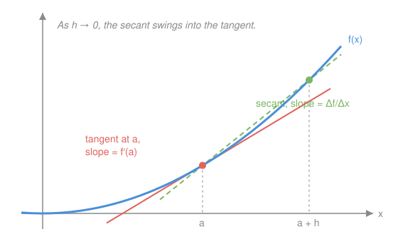

# Calculus Refresher · Lesson 1.1: The derivative as sensitivity

> ⏱ ~15 min · Module 1: Differentiation · Builds on: nothing (course start) · Unlocks: 1.2 (differentiation rules)

## Why this matters

Almost every quantitative statement you'll meet downstream is a derivative wearing a costume: velocity in mechanics, marginal cost in economics, an electric field as the slope of a potential. Being able to read $f'(a)$ instantly as *"how hard the output responds when I nudge the input"* — not just "slope" — is the reflex this whole course is built on.

## The idea

Take any smooth curve and zoom in on a point. Keep zooming. Eventually the curve is indistinguishable from a straight line — that line's slope is the derivative there. So the derivative answers a practical question: **if I change the input a tiny bit, how many times bigger is the change in output?** If $f'(a) = 3$, nudging $x$ by a hair moves $f(x)$ by three hairs. Negative derivative: output moves the other way. Zero: the output momentarily doesn't care.

## The formal version

$$f'(a) = \lim_{h \to 0} \frac{f(a+h) - f(a)}{h}$$

In words: measure the average rate of change over a shrinking interval $[a, a+h]$, and take the trend as the interval collapses. The fraction is the slope of a **secant** line (through two points on the curve); the limit is the slope of the **tangent** (touching at one). Here $h$ is the nudge size, and the limit exists only when the left and right nudges agree — that's what "differentiable at $a$" means.

## Picture

## Worked examples

**Example 1 (mechanical).** $f(x) = x^2$ at $a = 3$:

$$f'(3) = \lim_{h\to 0}\frac{(3+h)^2 - 9}{h} = \lim_{h\to 0}\frac{6h + h^2}{h} = \lim_{h\to 0}\,(6 + h) = 6.$$

Note the move: the raw fraction is $\frac{0}{0}$-shaped, but algebra cancels the $h$ *before* we take the limit. That cancellation is the entire trick behind every derivative formula you memorized.

**Example 2 (why you'd care).** A factory's cost of producing $q$ units is $C(q) = 400 + 20q - 0.05q^2$ (in dollars, for modest $q$). The **marginal cost** is $C'(q) = 20 - 0.1q$. At $q = 100$: $C'(100) = 10$, meaning the 101st unit costs *about* 10 dollars to make — even though the *average* cost so far is $C(100)/100 = \$19$. Decisions ("should I make one more?") run on the derivative, not the average. This distinction is half of microeconomics.

## Watch out

- You might think $f'$ is a number — it's a **function**: a whole new curve reporting the sensitivity at every point. $f'(a)$ is that function evaluated at $a$.
- You might think "continuous" implies "differentiable." No: $|x|$ is continuous at $0$ but has no derivative there (the zoom never becomes a single straight line — it stays a corner).
- Units matter: if $f$ is dollars and $x$ is units produced, $f'$ is **dollars per unit**. Saying the units of a derivative out loud is the fastest error-check you own.

## One-liner

> Zoom in far enough and every smooth curve is a line; the derivative is that line's slope — the local exchange rate between input and output.

## Problems

**P1 (🟢)** Using the limit definition (no rules yet), compute $f'(2)$ for $f(x) = x^2 - 3x$.

**P2 (🟡)** A ball's height is $s(t) = 20t - 5t^2$ meters after $t$ seconds. Without computing anything first: what should the velocity be at the peak? Now compute $s'(t)$, find when it's zero, and check the peak height.

**P3 (🔴, optional)** Show that $f(x) = |x|$ is not differentiable at $0$ by computing the limit of $\frac{f(0+h)-f(0)}{h}$ separately for $h \to 0^+$ and $h \to 0^-$.

Solutions

**P1** $\frac{f(2+h)-f(2)}{h} = \frac{(4+4h+h^2) - 3(2+h) - (4-6)}{h} = \frac{4+4h+h^2-6-3h+2}{h} = \frac{h + h^2}{h} = 1 + h \to \boxed{1}$.

**P2** At the peak the ball is momentarily neither rising nor falling, so velocity must be $0$ — the output (height) momentarily doesn't respond to the input (time). $s'(t) = 20 - 10t = 0$ at $t = 2$ s; peak height $s(2) = 40 - 20 = 20$ m.

**P3** For $h > 0$: $\frac{|h| - 0}{h} = \frac{h}{h} = 1$. For $h < 0$: $\frac{|h|}{h} = \frac{-h}{h} = -1$. The one-sided limits are $1$ and $-1$; they disagree, so the two-sided limit doesn't exist and $f'(0)$ is undefined. Geometrically: zooming in on the corner never produces a single line.

## Flashback

*(None — course start. From Lesson 1.3 onward, one retrieval problem from earlier material appears here.)*

## Connections

- **Forward:** Lesson 1.2 turns Example 1's algebra into reusable rules so you never touch the limit definition again (until `real-analysis`, where you'll prove it behaves).
- **Sideways (econ):** "marginal anything" in `micro-refresher` = derivative of the total. Example 2 is the prototype.
- **Sideways (physics):** velocity and acceleration in `mechanics-refresher` are $s'(t)$ and $s''(t)$; P2 is your first kinematics problem.
