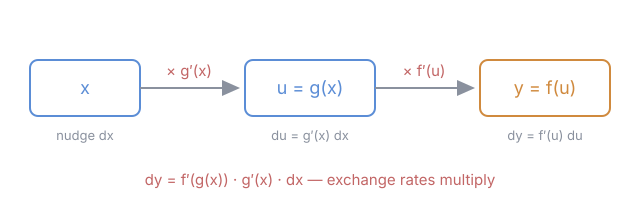

# Calculus Refresher · Lesson 1.2: The rules, and why the chain rule is the big one

> ⏱ ~15 min · Module 1: Differentiation · Builds on: [1.1 The derivative as sensitivity](01-01-derivative-as-sensitivity.md) · Unlocks: 1.3 (linearization)

## Why this matters

Nobody computes derivatives from the limit definition — you did it once in 1.1 so you'd know what the rules are *for*, and now the rules take over. Of them, the chain rule is the one that earns its keep forever: it powers implicit differentiation (today), $u$-substitution (lesson 2.3's technique cousin), related rates in mechanics, and — under the name *backpropagation* — every neural network you've ever heard of. Real functions are built by composing simple ones, so the rule for compositions is the rule for everything.

## The idea

Lesson 1.1 said the derivative is a local **exchange rate**: $f'(a)$ tells you how many output-hairs you get per input-hair. The rules are just bookkeeping for how exchange rates combine when functions combine:

- **Sums:** sensitivities add. Nudge the input; each term responds independently.
- **Products:** each factor takes a turn. Nudge $x$, and $f \cdot g$ changes partly because $f$ moved (while $g$ held still) and partly because $g$ moved (while $f$ held still). Total: $f'g + fg'$.
- **Compositions:** sensitivities **multiply**. If dollars→euros converts at rate $g'$ and euros→yen at rate $f'$, then dollars→yen converts at rate $f' \cdot g'$. A chain of conversions multiplies its rates — that's the chain rule, and it's why it's the big one: composition is how complicated functions are actually assembled.

## The formal version

Let $f$ and $g$ be differentiable, $c$ a constant.

$$(cf)' = cf', \qquad (f+g)' = f' + g'$$

**Product rule:** $\;(fg)' = f'g + fg'$. In words: total change is $f$'s contribution while $g$ holds still, plus $g$'s while $f$ holds still.

**Quotient rule:** $\;\left(\dfrac{f}{g}\right)' = \dfrac{f'g - fg'}{g^2}$. In words: like the product rule but the denominator's motion counts *against* you — and it's not really a new rule (P3 has you derive it from product + chain).

**Chain rule:** if $y = f(g(x))$, then

$$\frac{dy}{dx} = f'(g(x)) \cdot g'(x), \qquad \text{equivalently} \qquad \frac{dy}{dx} = \frac{dy}{du}\cdot\frac{du}{dx} \text{ where } u = g(x).$$

In words: the outer function's sensitivity — evaluated at the inner function's *value*, not at $x$ — times the inner function's sensitivity. Exchange rates multiply.

**Implicit differentiation** isn't a new rule either: given an equation relating $x$ and $y$, treat $y$ as an unnamed function $y(x)$ and differentiate both sides. Every $y$-term picks up a factor $y'$ — *by the chain rule* — and you solve for $y'$ algebraically.

## Picture

## Worked examples

**Example 1 (mechanical — reading a composition).** Differentiate $\sin(x^2)$ and $\sin^2 x$. (Taking $\frac{d}{dx}\sin x = \cos x$ as known — the standard [derivative table](../reference.md#derivatives-of-the-standard-functions) is on the course reference card.) They look like siblings but compose in opposite orders. For $\sin(x^2)$: outer $= \sin(\square)$, inner $= x^2$, so the derivative is $\cos(x^2) \cdot 2x$. For $\sin^2 x = (\sin x)^2$: outer $= \square^2$, inner $= \sin x$, so it's $2\sin x \cdot \cos x$. The skill being trained: before touching a pencil, say out loud what the outer and inner functions are. Every chain-rule error is a misread of that anatomy.

**Example 2 (why you'd care — implicit differentiation).** Most relationships in physics and economics arrive as *equations*, not formulas: constraint surfaces, indifference curves, gas laws. You can't "solve for $y$" — and you don't need to. Take the circle $x^2 + y^2 = 25$ and find the tangent slope at $(3, 4)$. Differentiate both sides, remembering $y$ is secretly $y(x)$:

$$2x + 2y\,\frac{dy}{dx} = 0 \quad\Longrightarrow\quad \frac{dy}{dx} = -\frac{x}{y}.$$

The $2y \cdot \frac{dy}{dx}$ term **is** the chain rule: outer $\square^2$, inner $y(x)$. At $(3,4)$: slope $= -3/4$. Sanity check: the radius to $(3,4)$ has slope $4/3$, and $(-3/4)(4/3) = -1$ — tangent perpendicular to radius, exactly as geometry demands.

## Watch out

- You might think $(fg)' = f'g'$. One counterexample kills it: $x \cdot x = x^2$ has derivative $2x$, but $f'g' = 1 \cdot 1 = 1$. The product rule's "each factor takes a turn" is not optional.
- In $f'(g(x))$, you might evaluate the outer derivative at $x$. It's evaluated at the *inner value*: $\frac{d}{dx}\sin(x^2) = \cos(x^2)\cdot 2x$, never $\cos(x)\cdot 2x$. The outer function only ever saw $x^2$; its sensitivity must be measured where it lives.
- In implicit differentiation, you might write $\frac{d}{dx}(y^2) = 2y$. That drops the chain: $y$ depends on $x$, so $\frac{d}{dx}(y^2) = 2y\,y'$. Forgetting the $y'$ is the single most common implicit-differentiation error.

## One-liner

> Sensitivities through a chain of functions multiply — every other rule is bookkeeping, and implicit differentiation is just the chain rule refusing to be stopped by an equals sign.

## Problems

**P1 (🟢)** Differentiate $f(x) = x^2 \sin(3x)$.

**P2 (🟡)** A cart of mass $m = 2$ kg has velocity $v(t) = 4t$ m/s. Its kinetic energy is $K = \tfrac{1}{2}mv^2$. Use the chain rule ($\frac{dK}{dt} = \frac{dK}{dv}\cdot\frac{dv}{dt}$) to find the rate of energy gain at $t = 3$ s, then verify by writing $K$ directly as a function of $t$ and differentiating. What are the units?

**P3 (🔴, optional)** Derive the quotient rule: write $\dfrac{f}{g} = f \cdot \big(g(x)\big)^{-1}$ and differentiate using only the product rule and the chain rule.

Solutions

**P1** Product rule with a chain inside the second factor. $f' = \underbrace{2x}_{(x^2)'}\sin(3x) + x^2 \underbrace{\cos(3x)\cdot 3}_{(\sin 3x)'} = \boxed{2x\sin 3x + 3x^2\cos 3x}$. The $\cdot 3$ is the inner derivative of $3x$ — the piece the chain rule exists to catch.

**P2** Chain route: $\frac{dK}{dv} = mv$ and $\frac{dv}{dt} = 4$, so $\frac{dK}{dt} = mv \cdot 4$. At $t = 3$: $v = 12$, so $\frac{dK}{dt} = 2 \cdot 12 \cdot 4 = 96$. Direct route: $K(t) = \tfrac12 \cdot 2 \cdot (4t)^2 = 16t^2$, so $K'(t) = 32t = 96$ at $t=3$. Same answer, as it must be. Units: joules per second $=$ **watts** — this is the power being delivered to the cart. (Saying the units out loud is still your fastest error check.)

**P3** $\dfrac{f}{g} = f \cdot g^{-1}$ where $g^{-1}$ means $(g(x))^{-1}$, a composition: outer $\square^{-1}$, inner $g$. By the chain rule, $\frac{d}{dx}\,g^{-1} = -g^{-2}\cdot g'$. Now the product rule:

$$\left(\frac{f}{g}\right)' = f' g^{-1} + f \cdot(-g^{-2} g') = \frac{f'}{g} - \frac{f g'}{g^2} = \frac{f'g - fg'}{g^2}. \checkmark$$

Moral: the quotient rule is not a fourth fact to memorize — it's product + chain wearing a disguise.

## Flashback

**From Lesson 1.1 (The derivative as sensitivity):** Using the limit definition — no rules — compute $f'(1)$ for $f(x) = \dfrac{1}{x}$. Then interpret the sign and size of your answer in one sentence, in the "nudge" language of 1.1.

Solution

$$f'(1) = \lim_{h\to 0}\frac{\frac{1}{1+h} - 1}{h} = \lim_{h\to 0}\frac{\frac{1 - (1+h)}{1+h}}{h} = \lim_{h\to 0}\frac{-h}{h(1+h)} = \lim_{h\to 0}\frac{-1}{1+h} = -1.$$

Same move as always: algebra cancels the $h$ before the limit. Interpretation: near $x = 1$, nudging the input up by a hair moves the output *down* by exactly one hair — a one-for-one trade in the opposite direction. (Rules check: $f'(x) = -x^{-2}$, so $f'(1) = -1$. ✓)

## Connections

- **Backward:** every rule here is the [1.1](01-01-derivative-as-sensitivity.md) limit-definition algebra done once, in general, so you never repeat it. You'll prove they're legitimate in `real-analysis`.
- **Forward:** Lesson 1.3 (linearization) explains *why* the chain rule multiplies: near a point every function is its tangent line, and composing the linear maps $dy = f'\,du$ and $du = g'\,dx$ multiplies the slopes.
- **Sideways (physics):** P2 is the general pattern of **related rates** in `mechanics-refresher` — a quantity depends on time only through some intermediate variable, and the chain rule threads the dependency: $\frac{dK}{dt} = \frac{dK}{dv}\frac{dv}{dt}$. The same identity in disguise, $a = \frac{dv}{dt} = v\frac{dv}{dx}$, is how energy conservation gets derived from $F = ma$.
