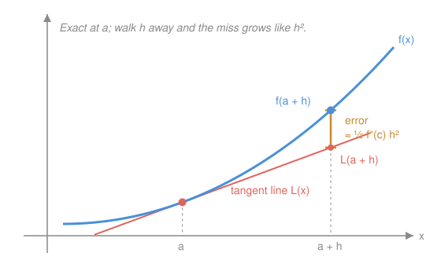

# Calculus Refresher · Lesson 1.3: Linearization and Taylor's idea

> ⏱ ~15 min · Module 1: Differentiation · Builds on: [1.1](01-01-derivative-as-sensitivity.md), 1.2 (differentiation rules) · Unlocks: 1.4 (optimization), Module 3 (Taylor series)

## Why this matters

Almost nothing in applied math is computed exactly — it's approximated by polynomials. Your calculator evaluates $\sin$, physicists turn pendulums into harmonic oscillators, economists turn "5% growth" into doubling times, all by the same move: near a known point, swap the real function for a polynomial. The professional-grade version of the move isn't the swap itself — it's knowing **how wrong you are**. This lesson gives you both.

## The idea

Lesson 1.1 said: zoom in on a smooth curve and it becomes a line. Linearization runs that statement *forward*. If you know $f(a)$ and $f'(a)$, you can predict $f$ nearby without ever evaluating it: start at the known value and walk along the tangent. That prediction fails as you move away — not because the tangent is a bad line, but because the curve *bends* away from every line. How fast it bends is the second derivative, so $f''$ controls the error.

Taylor's idea is to keep going: a tangent line matches $f$'s value and slope at $a$; add a quadratic term to also match the bend; a cubic to match how the bend changes; and so on. Each derivative you match pushes the leftover error up to a higher power of the step size $h$ — and high powers of small numbers are *very* small. That's the whole game: match more, miss less.

## The formal version

**Linear approximation** of $f$ at $a$:

$$L(x) = f(a) + f'(a)\,(x - a)$$

In words: known value, plus sensitivity times how far you've moved. This is the tangent line from 1.1, now used as a stand-in for $f$.

**Taylor polynomial** of degree $n$ at $a$ (writing $f^{(k)}$ for the $k$-th derivative):

$$T_n(x) = \sum_{k=0}^{n} \frac{f^{(k)}(a)}{k!}\,(x-a)^k = f(a) + f'(a)(x-a) + \frac{f''(a)}{2}(x-a)^2 + \cdots$$

In words: the one degree-$n$ polynomial whose value and first $n$ derivatives at $a$ all agree with $f$'s. Note $T_1 = L$ — linearization is just the $n=1$ case.

**The error term** (Lagrange form): if $f$ is smooth enough, then for some $c$ between $a$ and $x$,

$$f(x) - T_n(x) = \frac{f^{(n+1)}(c)}{(n+1)!}\,(x-a)^{n+1}.$$

In words: the error is exactly what the *next* Taylor term would be, except the derivative is evaluated at a mystery point $c$ nearby. You never find $c$ — you bound $|f^{(n+1)}|$ over the interval and get a worst-case error. For $n=1$, with $h = x - a$:

$$f(a+h) - L(a+h) = \tfrac{1}{2}f''(c)\,h^2$$

— curvature times half the nudge squared. Two consequences worth memorizing: halving $h$ **quarters** the error, and the *sign* of $f''$ tells you which side you miss on ($f'' > 0$: curve above tangent, so $L$ underestimates).

## Picture

Here $f'' > 0$: the curve bends up away from the tangent on *both* sides, and the amber gap — the error — grows like $h^2$.

## Worked examples

**Example 1 (mechanical).** Estimate $\sqrt{104}$. Take $f(x) = \sqrt{x}$, $a = 100$: $f(100) = 10$, $f'(x) = \frac{1}{2\sqrt{x}}$ so $f'(100) = 0.05$. Then

$$\sqrt{104} \approx L(104) = 10 + 0.05 \cdot 4 = 10.2.$$

How wrong? $f''(x) = -\frac{1}{4x^{3/2}}$, and on $[100, 104]$ its magnitude is largest at $x=100$: $|f''| \le \frac{1}{4000}$. So $|\text{error}| \le \frac{1}{2}\cdot\frac{1}{4000}\cdot 4^2 = 0.002$. The truth: $\sqrt{104} = 10.19804$, error $0.00196$ — the bound is nearly exact, and the sign was predictable: $f'' < 0$ (concave), so the tangent sits *above* the curve and overestimates.

**Example 2 (why you'd care).** The small-angle approximation. Taylor for $\sin\theta$ at $0$: $f(0)=0$, $f'(0)=1$, $f''(0)=0$, so $T_2(\theta) = \theta$ — the humble line $\sin\theta \approx \theta$ is secretly a degree-2 Taylor polynomial. The $n=2$ error term uses $f'''(c) = -\cos c$, so

$$|\sin\theta - \theta| \le \frac{|\theta|^3}{6}.$$

At $\theta = 10° = 0.1745$ rad: error at most $0.000886$, about $0.5\%$ of $\theta$. This one line is why a pendulum is "simple harmonic": the true restoring force $\propto \sin\theta$ gets replaced by $\propto \theta$, turning an unsolvable equation into a solvable one — with a certificate that the swap costs half a percent at $10°$. Module 3's boss problem finishes this story.

## Watch out

- You might think the error formula *gives you the error* — it doesn't, because $c$ is unknown. It gives a **guarantee**: take the worst $|f^{(n+1)}|$ on the interval and you have a ceiling the true error never exceeds.
- You might think the tangent's error grows linearly with distance — it grows like $h^2$. That's why linearization is spectacular very close to $a$ and garbage far away: at $10\times$ the distance, expect $100\times$ the miss.
- Everything is anchored to $a$. $L$ and $T_n$ are cheap *near the center you built them at* — estimating $\ln(2)$ from a tangent at $x=1$ is asking a local model a global question. Re-center; don't stretch.

## One-liner

> The tangent line is a function's best local impersonation, and the second derivative is the critic: the impersonation fails by about $\tfrac{1}{2}f''h^2$ — quarter the error every time you halve the step.

## Problems

**P1 (🟢)** Linearize $f(x) = \ln x$ at $a = 1$ and estimate $\ln(1.1)$. Before checking the true value: does your estimate overshoot or undershoot, and how do you know? Then bound the error with the $\tfrac{1}{2}f''(c)h^2$ term.

**P2 (🟡)** Find $T_2(x)$ for $\cos x$ at $a = 0$ and estimate $\cos(0.2)$. Bound the error with the Lagrange term. (The true error is far smaller than your bound — can you see why?)

**P3 (🔴, optional)** A firm's profit $\pi(q)$ is maximized at $q^*$, where $\pi'(q^*) = 0$ and $\pi''(q^*) = -2$ (dollars per unit²). Use a second-order Taylor expansion around $q^*$ to estimate the profit lost by producing $q^* + h$ instead of $q^*$. What does this say about the cost of *small* mistakes near an optimum?

Solutions

**P1** $f(1) = 0$, $f'(x) = 1/x$ so $f'(1) = 1$: $L(x) = 0 + 1\cdot(x-1) = x - 1$, giving $\ln(1.1) \approx 0.1$. Overshoot: $f''(x) = -1/x^2 < 0$, so $\ln$ is concave and the tangent lies above the curve. Error bound: on $[1, 1.1]$, $|f''| \le 1$ (worst at $x=1$), so $|\text{error}| \le \tfrac{1}{2}\cdot 1 \cdot (0.1)^2 = 0.005$. Truth: $\ln(1.1) = 0.09531$, actual error $0.00469$ — under the ceiling, and on the predicted side.

**P2** At $0$: $\cos 0 = 1$, $(\cos)' = -\sin \to 0$, $(\cos)'' = -\cos \to -1$. So $T_2(x) = 1 - \frac{x^2}{2}$ and $\cos(0.2) \approx 1 - 0.02 = 0.98$. Lagrange bound with $n=2$: $|f'''(c)| = |\sin c| \le 1$, so $|\text{error}| \le \frac{(0.2)^3}{6} \approx 0.00133$. Truth: $\cos(0.2) = 0.980067$, actual error $6.7\times 10^{-5}$ — twenty times better than the bound. Why: $\cos$'s $x^3$ coefficient is zero, so $T_2 = T_3$ and the *real* first correction is the $x^4$ term, $\frac{(0.2)^4}{24} = 6.7\times 10^{-5}$. Matching an extra derivative for free is a running theme of even/odd functions; Module 3 exploits it constantly.

**P3** Expand around $q^*$ with step $h$: $\pi(q^* + h) \approx \pi(q^*) + \pi'(q^*)\,h + \tfrac{1}{2}\pi''(q^*)\,h^2 = \pi(q^*) + 0 - h^2$. Lost profit $\approx h^2$ dollars. The linear term is dead at an optimum — that's what being an optimum *means* — so small errors cost only second-order money: misjudging optimal output by $h$ costs $\sim h^2$, e.g. a 1-unit mistake costs \$1, a 0.1-unit mistake costs a penny. Flat-topped hills forgive small missteps. Lesson 1.4 turns this expansion into the second-derivative test, and Boss problem 1 asks you to interpret $\pi''$ exactly this way.

## Flashback

**From Lesson 1.2 (The rules, and why the chain rule is the big one):** Differentiate $g(x) = \ln(\cos x)$ and evaluate $g'(\pi/4)$.

Solution

Chain rule, outside-in: $\ln(u)$ with $u = \cos x$ gives $g'(x) = \frac{1}{\cos x}\cdot(-\sin x) = -\tan x$. At $\pi/4$: $g'(\pi/4) = -\tan(\pi/4) = -1$. (Worth noticing: this derivative is the reason $\int \tan x\,dx = -\ln|\cos x| + C$ — you'll cash that in come Module 2.)

## Connections

- **Backward:** [1.1](01-01-derivative-as-sensitivity.md) *defined* the derivative as "the slope of the line the curve becomes under zoom" — linearization is that same sentence used as a prediction tool. 1.2's rules are what let you actually produce the $f'(a)$ and $f''(a)$ you feed into $L$ and $T_2$.
- **Forward (1.4):** at a critical point the linear term of Taylor vanishes, so the quadratic term rules — P3 *is* the second-derivative test in embryo.
- **Forward (Module 3):** let $n \to \infty$ in $T_n$ and ask when the error term dies: that's the Taylor *series*, lesson 3.2, and the small-angle pendulum boss problem.
- **Sideways (physics):** $\sin\theta \approx \theta$ (Example 2) is the standard entry move of `mechanics-refresher` — pendulums, optics, any "linearize about equilibrium" argument.
- **Sideways (econ):** $\ln(1+r) \approx r$ is the same linearization at work in `micro-refresher`: it's why elasticities are log-derivatives and why money at $r\%$ doubles in roughly $70/r$ years.
