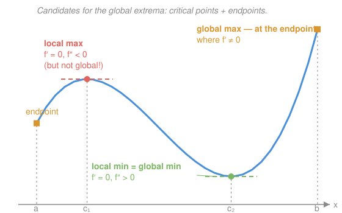

# Calculus Refresher · Lesson 1.4: Optimization

> ⏱ ~15 min · Module 1: Differentiation · Builds on: 1.2 (differentiation rules), 1.3 (linearization & Taylor) · Unlocks: Boss problem 1, and 4.2 (Lagrange multipliers)

## Why this matters

"Best" is the most common word in applied math. Cheapest route, maximum profit, minimum energy, most likely parameter — every one of these is the same problem: find where a function tops out or bottoms out. Calculus turns that search from "check everywhere" into "check a short list." Nature runs on it too: a hanging chain, a soap bubble, a planet's orbit are all solutions to some minimization. This lesson is the single-variable version of a move you'll repeat in micro, mechanics, and statistics for the rest of the roadmap.

## The idea

Stand on a smooth hilltop. Whichever direction you step, you go *down* — so at the very top, the ground must be momentarily flat. If the slope were even slightly positive, you could walk uphill and do better, so you weren't at the top. That's the whole theorem: **an interior max or min can only happen where $f' = 0$** (or where $f'$ doesn't exist — a peak can also be a sharp ridge).

But flat ground isn't proof of a summit: it could be a valley floor, or just a ledge on a slope ($x^3$ at $0$). So the flatness condition only produces **candidates**. To sort them, look at the *bend*: if the curve is bending downward there ($f'' < 0$), the flat spot is a cap — a local max; bending upward, a cup — a local min.

And "local" is doing real work in that sentence. A local max is the best *in its neighborhood*; the true best over a whole interval might instead sit at an **endpoint**, where the derivative never has to be zero because you're not allowed to step past the boundary. Hence the ritual: collect candidates, evaluate, compare.

## The formal version

**Critical point.** $c$ is a critical point of $f$ if $f'(c) = 0$ or $f'(c)$ doesn't exist. In words: everywhere the "walk uphill" argument breaks down.

**Fermat's theorem.** If $f$ has a local max or min at an interior point $c$ and $f'(c)$ exists, then $f'(c) = 0$. In words: interior extrema hide only at critical points — so the candidate list is short.

**Second-derivative test.** Suppose $f'(c) = 0$. Then
$$f''(c) < 0 \;\Rightarrow\; \text{local max}, \qquad f''(c) > 0 \;\Rightarrow\; \text{local min}, \qquad f''(c) = 0 \;\Rightarrow\; \text{no information.}$$
This is Lesson 1.3 in disguise: with the linear term dead, Taylor says $f(c+h) \approx f(c) + \tfrac{1}{2}f''(c)\,h^2$, and $h^2 > 0$ always — so the sign of $f''(c)$ alone decides whether nearby points sit below or above $f(c)$.

**Global recipe (closed interval $[a,b]$).** A continuous $f$ on $[a,b]$ *must* attain a global max and min (Extreme Value Theorem). They live on the candidate list: critical points inside $(a,b)$, plus $a$ and $b$. Evaluate $f$ at each; largest and smallest win. No second-derivative test needed for this — the tournament settles it.

## Picture

Both flat points are genuine local extrema — the second derivative's sign tells you which is which — yet the *global* max is at $b$, where the curve is still climbing when the domain runs out. Sorting the flat points is not the same job as finding the winner.

## Worked examples

**Example 1 (mechanical).** Find all extrema of $f(x) = x^3 - 6x^2 + 9x + 2$ on $[0, 5]$.

Critical points: $f'(x) = 3x^2 - 12x + 9 = 3(x-1)(x-3) = 0$ at $x = 1, 3$. Classify: $f''(x) = 6x - 12$, so $f''(1) = -6 < 0$ (local max, $f(1) = 6$) and $f''(3) = 6 > 0$ (local min, $f(3) = 2$). Now the global tournament: $f(0) = 2$, $f(1) = 6$, $f(3) = 2$, $f(5) = 22$. Global max $22$ at $x=5$ — the endpoint beats the local max. Global min $2$, attained *twice*: at $x = 3$ and at the endpoint $x = 0$. Ties are allowed; "the" minimum is a value, not necessarily one point.

**Example 2 (why you'd care).** A firm faces demand $p(q) = 100 - 2q$ (price falls as it floods the market) and cost $C(q) = 20q + 50$. Profit is
$$\pi(q) = \underbrace{(100 - 2q)q}_{\text{revenue}} - (20q + 50) = -2q^2 + 80q - 50.$$
Set $\pi'(q) = -4q + 80 = 0$: $q^* = 20$, and $\pi'' = -4 < 0$ confirms a max. Profit $\pi(20) = 750$ at price $p(20) = 60$. The economist's phrasing: $\pi' = 0$ says **marginal revenue equals marginal cost** ($MR = 100 - 4q = 20 = MC$ at $q^*$) — produce until the next unit stops paying for itself. And $\pi'' < 0$ is the *second-order condition*: marginal profit is falling through zero, so you're crossing from "worth it" to "not worth it," not the reverse. Every profit-maximization problem in `micro-refresher` is this computation wearing a suit.

## Watch out

- You might think $f'(c) = 0$ *means* extremum. No — it means *candidate*. $f(x) = x^3$ has $f'(0) = 0$ and keeps right on climbing; the flat spot is a ledge, not a peak.
- You might think checking critical points is enough. On a closed interval, endpoints are silent candidates — they can win without ever satisfying $f' = 0$ (see the Picture). Also silent: points where $f'$ doesn't exist, like the corner of $|x|$.
- You might think $f''(c) = 0$ implies an inflection or "flat extremum." It implies *nothing* — the test just abstains ($x^4$ has a min at $0$, $-x^4$ a max, $x^3$ neither; all have $f''(0)=0$). Fall back to checking the sign of $f'$ on each side.

## One-liner

> At an interior best the derivative has nothing left to point at: $f' = 0$ writes the shortlist, the sign of $f''$ sorts it, and endpoints get on the ballot for free.

## Problems

**P1 (🟢)** Find and classify the critical points of $f(x) = x^3 - 3x$ on $[0, 3]$, then find the global max and min on that interval.

**P2 (🟡)** A mass $m$ hangs from a spring with stiffness $k$; with $x$ the spring's extension, the system's potential energy is $U(x) = \tfrac{1}{2}kx^2 - mgx$. Find the extension that minimizes $U$, verify it's a minimum, and interpret the equation $U'(x) = 0$ physically.

**P3 (🔴, optional)** Classify both critical points of $f(x) = x^4 - 4x^3$. (One of them will expose the second-derivative test's blind spot — finish the job anyway.)

Solutions

**P1** $f'(x) = 3x^2 - 3 = 3(x-1)(x+1) = 0$ at $x = \pm 1$; only $x = 1$ lies in $[0,3]$ — always check domain membership before classifying. $f''(x) = 6x$, so $f''(1) = 6 > 0$: local min, $f(1) = -2$. Tournament: $f(0) = 0$, $f(1) = -2$, $f(3) = 27 - 9 = 18$. **Global max $18$ at $x = 3$ (endpoint); global min $-2$ at $x = 1$.**

**P2** $U'(x) = kx - mg = 0$ gives $x^* = \dfrac{mg}{k}$. $U''(x) = k > 0$ (a spring constant is positive), so this is a minimum — in fact global, since $U$ is an upward parabola. Physically, $-U'(x)$ is the net force, so $U' = 0$ says $kx = mg$: the spring's upward pull exactly balances the weight. **Equilibrium is where potential energy is stationary**, and $U'' > 0$ (restoring force grows as you displace) is what makes it a *stable* equilibrium. This is the master pattern of `mechanics-refresher`.

**P3** $f'(x) = 4x^3 - 12x^2 = 4x^2(x - 3) = 0$ at $x = 0, 3$. $f''(x) = 12x^2 - 24x = 12x(x-2)$. At $x = 3$: $f''(3) = 36 > 0$, local min, $f(3) = 81 - 108 = -27$. At $x = 0$: $f''(0) = 0$ — the test abstains. Check the sign of $f'$ instead: $4x^2 \ge 0$ always, and $(x - 3) < 0$ on both sides of $0$, so $f' < 0$ just left *and* just right of $0$. The function is decreasing straight through the flat spot: **$x = 0$ is neither a max nor a min** — a horizontal pause on the way down.

## Flashback

**From Lesson 1.3 (Linearization and Taylor's idea):** Use the linearization of $f(x) = \sqrt{x}$ at $x = 25$ to estimate $\sqrt{26}$. Then use the sign of $f''$ to decide — without a calculator — whether your estimate is too high or too low.

Solution

$f'(x) = \frac{1}{2\sqrt{x}}$, so $f'(25) = \frac{1}{10}$ and $L(x) = 5 + \frac{x - 25}{10}$, giving $\sqrt{26} \approx 5.1$. Since $f''(x) = -\frac{1}{4}x^{-3/2} < 0$, the curve is concave down, so the tangent line sits *above* the curve: $5.1$ is an **overestimate**. (True value $\approx 5.0990$.) Same idea as this lesson's second-derivative test: the sign of $f''$ tells you which side of the linear story the truth is on.

## Connections

- **Backward:** the rules from 1.2 do all the differentiation here, and the second-derivative test is 1.3's Taylor expansion with the linear term switched off — classification by the $\tfrac{1}{2}f''(c)h^2$ term.
- **Forward:** Lesson 4.2 replays this in several variables — the gradient replaces $f'$, the Hessian replaces $f''$, and constraints bring in Lagrange multipliers, which handle "endpoints" that are curves instead of points.
- **Sideways (econ):** in `micro-refresher`, first-order condition = $MR = MC$, second-order condition = $\pi'' < 0$. Profit maximization is this lesson wearing a suit (see Example 2); Boss problem 1 adds a parameter.
- **Sideways (physics):** stable equilibrium in `mechanics-refresher` is a potential-energy minimum — P2 is the prototype, and $U'' > 0$ vs $U'' < 0$ is stability vs a ball balanced on a hilltop.
