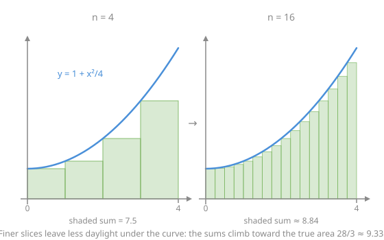

# Calculus Refresher · Lesson 2.1: The integral as accumulation, and the FTC

> ⏱ ~15 min · Module 2: Integration · Builds on: [1.1 The derivative as sensitivity](01-01-derivative-as-sensitivity.md) · Unlocks: 2.2 (integration techniques)

## Why this matters

Half of applied math is adding up infinitely many tiny contributions: distance from a velocity that keeps changing, total cost from a marginal cost that shifts with quantity, probability from a density. The integral is that adding-up machine — and the Fundamental Theorem of Calculus (FTC) is the astonishing shortcut that says you almost never have to actually do the adding. It converts "sum a million slices" into "find one antiderivative," which is why Module 1 was worth the effort.

## The idea

Your car's odometer and speedometer report the same trip in two languages. The speedometer is the derivative story (rate right now); the odometer is the integral story (total accumulated so far). If you only had speedometer readings, you could still rebuild the odometer: assume the speed was roughly constant for each little stretch of time, multiply rate × duration for each stretch, add them up. Shrink the stretches and the estimate sharpens toward the truth.

That's the whole construction. The integral $\int_a^b f(x)\,dx$ is "chop $[a,b]$ into slivers, multiply the height $f$ by the sliver width, add, and take the limit of finer and finer chopping." And the FTC is the observation that this laborious process secretly *undoes differentiation* — accumulation and rate-taking are inverse operations, just like the odometer and speedometer describe one trip.

## The formal version

**The Riemann sum and the integral.** Partition $[a,b]$ into $n$ pieces of width $\Delta x = \frac{b-a}{n}$, pick a sample point $x_i^*$ in each, and form

$$\sum_{i=1}^{n} f(x_i^*)\,\Delta x \;\longrightarrow\; \int_a^b f(x)\,dx \quad \text{as } n \to \infty.$$

In words: the integral is the limit of "height × width, summed." Where $f < 0$ the products are negative, so the integral computes **signed area** — area below the axis counts against you.

**FTC, Part I.** Define the accumulation function $F(x) = \int_a^x f(t)\,dt$ (note: $x$ sits in the limit; $t$ is a dummy variable doing the accumulating). Then

$$F'(x) = f(x).$$

In words: an accumulation grows at exactly the rate of the thing being accumulated — the odometer's derivative is the speedometer.

**FTC, Part II.** If $F$ is *any* antiderivative of $f$ (that is, $F' = f$), then

$$\int_a^b f(x)\,dx = F(b) - F(a).$$

In words: to total up all the little changes, you only need the accumulated quantity at the two ends. This is the computational payoff — one antiderivative replaces the infinite sum.

## Picture

The figure runs the construction on $f(x) = 1 + \frac{x^2}{4}$ over $[0,4]$: with 4 rectangles the sum is $7.5$; with 16 it's $\approx 8.84$; the limit — which FTC II computes instantly as $\left[x + \frac{x^3}{12}\right]_0^4 = \frac{28}{3} \approx 9.33$ — is the area itself.

## Worked examples

**Example 1 (mechanical).** $\displaystyle\int_0^2 x^2\,dx$. An antiderivative of $x^2$ is $\frac{x^3}{3}$ (check: its derivative is $x^2$). So

$$\int_0^2 x^2\,dx = \left[\frac{x^3}{3}\right]_0^2 = \frac{8}{3} - 0 = \frac{8}{3}.$$

That's the exact area under the parabola — no rectangles were harmed. Notice the workflow you'll use forever: *find antiderivative, evaluate at ends, subtract.*

**Example 2 (why you'd care — and why "signed" matters).** A ball is thrown with velocity $v(t) = 6 - 2t$ m/s. Over $[0,4]$ seconds, its **displacement** is

$$\int_0^4 (6-2t)\,dt = \left[6t - t^2\right]_0^4 = 24 - 16 = 8 \text{ m}.$$

But the ball turns around when $v = 0$, at $t = 3$. The **distance traveled** needs the pieces separately: $\int_0^3 (6-2t)\,dt = 18 - 9 = 9$ m forward, then $\int_3^4 (6-2t)\,dt = (24-16)-(18-9) = -1$ m — one meter *backward*, counted negatively by the signed integral. Distance $= 9 + 1 = 10$ m, displacement $= 9 - 1 = 8$ m. The integral answered the displacement question automatically; the distance question required you to notice the sign change. Physics cares about both, and mixing them up is the classic exam wound.

## Watch out

- You might think $\int_a^b f\,dx$ and an antiderivative are the same kind of object. They're not: the definite integral is a **number**; an antiderivative is a **function** (a whole family of them, hence $+C$). FTC II is the bridge between them.
- You might think area is always positive — but the integral's area is *signed*. If a problem says "area enclosed," you must find where $f$ crosses zero and handle pieces separately, as in Example 2.
- You might think the $t$ in $F(x) = \int_a^x f(t)\,dt$ is sloppy notation. It's load-bearing: $x$ is where accumulation *stops*, $t$ is the variable doing the sweeping. Writing $\int_a^x f(x)\,dx$ invites you to differentiate the wrong thing. And when the upper limit is itself a function, FTC I picks up a chain rule: $\frac{d}{dx}\int_a^{g(x)} f(t)\,dt = f(g(x))\,g'(x)$.

## One-liner

> The integral totals infinitely many rate × width slivers, and the FTC says the total equals the antiderivative's change between the endpoints — accumulation is differentiation run backwards.

## Problems

**P1 (🟢)** Evaluate $\displaystyle\int_1^3 \left(3x^2 - 4x + 1\right)dx$.

**P2 (🟡)** Let $g(x) = \displaystyle\int_0^x \cos(t^2)\,dt$ (no closed form exists — you don't need one).
(a) Find $g'(x)$.  (b) Find $\dfrac{d}{dx}\displaystyle\int_0^{x^3} \cos(t^2)\,dt$.

**P3 (🔴, optional)** A tank drains at the rate $r(t) = 200\,e^{-t/10}$ liters per minute.
(a) How much water drains in the first 10 minutes?
(b) The tank holds 2200 L. Explain, using the accumulation picture, why the tank *never* fully empties.

Solutions

**P1** Antiderivative: $x^3 - 2x^2 + x$. Evaluate:

$$\left[x^3 - 2x^2 + x\right]_1^3 = (27 - 18 + 3) - (1 - 2 + 1) = 12 - 0 = 12.$$

**P2** (a) FTC I directly: $g'(x) = \cos(x^2)$ — the integrand evaluated at the upper limit. (b) The upper limit is $x^3$, so chain rule wraps the FTC:

$$\frac{d}{dx}\int_0^{x^3} \cos(t^2)\,dt = \cos\!\big((x^3)^2\big)\cdot 3x^2 = 3x^2 \cos(x^6).$$

**P3** (a) An antiderivative of $200e^{-t/10}$ is $-2000\,e^{-t/10}$ (check: derivative is $-2000 \cdot(-\tfrac{1}{10})e^{-t/10} = 200e^{-t/10}$). So

$$\int_0^{10} 200e^{-t/10}\,dt = \left[-2000e^{-t/10}\right]_0^{10} = -2000e^{-1} + 2000 = 2000\left(1 - \tfrac{1}{e}\right) \approx 1264 \text{ L}.$$

(b) The total ever drained by time $T$ is $2000(1 - e^{-T/10})$, which *increases forever but never reaches* $2000$ L. Since $2000 < 2200$, the accumulated outflow can never equal the tank's contents: the drain rate dies off too fast. (An infinite amount of time, a finite total — Lesson 2.3 makes this precise as an improper integral.)

## Flashback

**From Lesson 1.4 (Optimization):** Find and classify all extrema of $f(x) = x^3 - 3x$ on the interval $[-2, 3]$ — local classification via the second derivative, then the global max and min on the interval.

Solution

$f'(x) = 3x^2 - 3 = 0$ at $x = \pm 1$ (both inside the interval). $f''(x) = 6x$: at $x = -1$, $f'' = -6 < 0$ → **local max**, $f(-1) = -1 + 3 = 2$; at $x = 1$, $f'' = 6 > 0$ → **local min**, $f(1) = 1 - 3 = -2$. Now the endpoints: $f(-2) = -8 + 6 = -2$ and $f(3) = 27 - 9 = 18$.

Global max: $\boxed{18}$ at $x = 3$ (an endpoint — the interior local max loses). Global min: $-2$, attained **twice**, at $x = 1$ and $x = -2$. Ties are legal; forgetting endpoints is not.

## Connections

- **Backward:** FTC I is [Lesson 1.1](01-01-derivative-as-sensitivity.md) in reverse — the derivative of "total so far" is "rate right now." Every antiderivative you'll guess comes from the rules of [1.2](01-02-differentiation-rules.md) read backwards.
- **Forward:** [2.2](02-02-integration-techniques.md) builds the toolkit for actually *finding* antiderivatives when guessing fails; 2.3 pushes the limits of integration to infinity (P3 was a preview).
- **Sideways (econ):** total cost is the integral of marginal cost; consumer surplus is an area under a demand curve. In `micro-refresher`, "integrate the margin to get the total" is the standing move.
- **Sideways (physics):** Example 2 is the kinematics dictionary — velocity integrates to displacement, acceleration to velocity. `mechanics-refresher` uses it in the first week.
