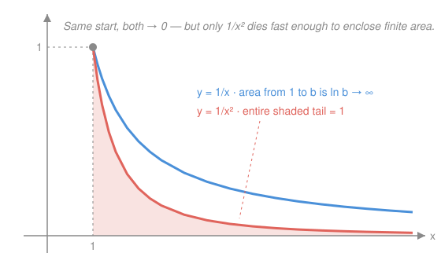

# Calculus Refresher · Lesson 2.3: Improper integrals and integrals as models

> ⏱ ~15 min · Module 2: Integration · Builds on: [2.1 The integral as accumulation](02-01-integral-as-accumulation.md), [2.2 Techniques that matter](02-02-integration-techniques.md) · Unlocks: Module 3 (series)

## Why this matters

Real questions rarely stop at a tidy endpoint: how much energy to escape Earth's gravity *entirely*? What's a payment stream worth if it continues *forever*? Probability densities live on infinite ranges and must still total exactly 1. All of these are integrals with $\infty$ in a limit — and the surprise that makes them useful is that **an infinite region can enclose a finite total**, provided the integrand dies fast enough. Knowing *when* it does is the skill.

## The idea

Compare $\frac{1}{x}$ and $\frac{1}{x^2}$ for $x \geq 1$. Both start at the same height, both decay to zero, and their graphs look like siblings. But total up the area under each, out to infinity, and they part ways completely: the area under $\frac{1}{x^2}$ is exactly $1$ — finite, done, you could paint it — while the area under $\frac{1}{x}$ grows without bound, just very slowly (it's $\ln b$ out to $b$, and $\ln$ crawls to infinity).

So "the function goes to zero" is **not enough** for a finite total. What matters is *how fast* it dies. The boundary case sits at $\frac{1}{x}$: decay faster and the tail's total is finite; decay at $\frac{1}{x}$ or slower and it isn't. There's no plugging-in-$\infty$ trick that captures this honestly — the definition is a limit, and the limit is where the answer lives.

## The formal version

**Infinite limits of integration.** Define

$$\int_a^\infty f(x)\,dx = \lim_{b \to \infty} \int_a^b f(x)\,dx.$$

In words: integrate out to a finite fence $b$, then push the fence to infinity; if the running total settles to a number, the integral **converges** to it — otherwise it **diverges**. (For $\int_{-\infty}^{\infty}$, split at any point and require *both* halves to converge.)

**Unbounded integrands.** If $f$ blows up at an endpoint (like $\frac{1}{\sqrt{x}}$ at $0$), the same move: $\int_0^1 f = \lim_{c \to 0^+} \int_c^1 f$.

**The p-test (the benchmark family).**

$$\int_1^\infty \frac{dx}{x^p} \text{ converges} \iff p > 1, \qquad \int_0^1 \frac{dx}{x^p} \text{ converges} \iff p < 1.$$

In words: at infinity you need decay *faster* than $\frac{1}{x}$; near a blow-up point you need a spike *milder* than $\frac{1}{x}$. Same function, opposite verdicts at its two bad ends.

**Comparison.** If $0 \leq f(x) \leq g(x)$ and $\int_a^\infty g$ converges, then $\int_a^\infty f$ converges too (and diverging minorants force divergence). In words: trapped under a finite roof, you're finite; sitting above an infinite floor, you're infinite. This is how you handle integrands with no elementary antiderivative — compare them to a $p$-benchmark instead of integrating.

## Picture

## Worked examples

**Example 1 (mechanical — the dichotomy computed).**

$$\int_1^\infty \frac{dx}{x^2} = \lim_{b\to\infty}\left[-\frac{1}{x}\right]_1^b = \lim_{b\to\infty}\left(1 - \frac{1}{b}\right) = 1,$$

$$\int_1^\infty \frac{dx}{x} = \lim_{b\to\infty}\Big[\ln x\Big]_1^b = \lim_{b\to\infty} \ln b = \infty \quad (\text{diverges}).$$

Both computations are FTC + one limit — the entire subject in miniature.

**Example 2 (why you'd care — a perpetuity's price).** A bond pays a continuous stream of 1,000 dollars per year, forever, and future money is discounted at rate $r = 5\%$ per year. Its present value is the accumulated, discounted stream:

$$PV = \int_0^\infty 1000\,e^{-0.05t}\,dt = \lim_{b\to\infty}\left[-\frac{1000}{0.05}e^{-0.05t}\right]_0^b = \frac{1000}{0.05} = \$20{,}000.$$

An *infinite* stream of payments, a *finite* fair price — exactly the $\frac{1}{x^2}$ phenomenon, delivered by exponential decay (which beats every power of $x$). This integral is the continuous-time version of the perpetuity formula $PV = \frac{c}{r}$ that anchors asset pricing in `micro-refresher` and beyond.

## Watch out

- You might think "the integrand $\to 0$, so the integral converges." The harmonic ghost $\frac{1}{x}$ is the standing counterexample — decay isn't enough, *speed* of decay is everything.
- You might think you can just "plug in $\infty$." It often gives the right answer for clean decaying functions, but it's an abbreviation for a limit — and it lies when the limit doesn't exist ($\int_0^\infty \cos x\,dx$ oscillates forever; there's nothing to plug in).
- You might think $\int_{-\infty}^{\infty} x\,dx = 0$ "by symmetry." The definition requires both halves to converge separately, and each is infinite — the integral diverges. Symmetric cancellation of two infinities is not convergence.

## One-liner

> An infinite region has a finite total exactly when the integrand dies faster than $\frac{1}{x}$ — always compute the fence-limit, never plug in $\infty$ on faith.

## Problems

**P1 (🟢)** Determine whether $\displaystyle\int_2^\infty \frac{3}{x^4}\,dx$ converges, and evaluate it if so.

**P2 (🟡)** Evaluate $\displaystyle\int_0^\infty x\,e^{-x^2}\,dx$. (A 2.2 technique gets you the antiderivative; then handle the limit honestly.)

**P3 (🔴, optional)** Near Earth's surface gravity pulls with force $mg$, but at distance $r$ from Earth's center the force is $F(r) = \frac{mgR^2}{r^2}$, where $R$ is Earth's radius. 
(a) Show the work needed to lift a mass $m$ from the surface to *infinity* is finite, and equals $mgR$.
(b) Use (a) and kinetic energy $\frac{1}{2}mv^2$ to find escape velocity, with $g = 9.8\ \mathrm{m/s^2}$, $R = 6.37\times 10^6$ m.

Solutions

**P1** The integrand is a $p = 4 > 1$ power, so it converges. Compute:

$$\int_2^\infty 3x^{-4}\,dx = \lim_{b\to\infty}\left[-x^{-3}\right]_2^b = \lim_{b\to\infty}\left(-\frac{1}{b^3} + \frac{1}{8}\right) = \frac{1}{8}.$$

**P2** Substitution ($u = x^2$, $du = 2x\,dx$, so $x\,dx = \tfrac{1}{2}du$) — the inner function's derivative is right there, as 2.2 trained you to spot:

$$\int_0^\infty x\,e^{-x^2}\,dx = \lim_{b\to\infty}\left[-\frac{1}{2}e^{-x^2}\right]_0^b = \lim_{b\to\infty}\left(-\frac{1}{2}e^{-b^2} + \frac{1}{2}\right) = \frac{1}{2}.$$

(This integrand is the skeleton of the Gaussian density — `prob-stat-refresher` will normalize it into the bell curve, whose infinite tails must integrate to 1 for probability to make sense.)

**P3** (a) Work is force integrated over distance (density → total, the slicing move):

$$W = \int_R^\infty \frac{mgR^2}{r^2}\,dr = mgR^2 \lim_{b\to\infty}\left[-\frac{1}{r}\right]_R^b = mgR^2 \cdot \frac{1}{R} = mgR.$$

Finite — because gravity is a $p=2$ tail. That finiteness is *why escape is possible at all*: an infinite climb costs only finite energy.

(b) Give the mass kinetic energy equal to the full climb: $\frac{1}{2}mv^2 = mgR$, so $v = \sqrt{2gR}$ — independent of $m$. Numerically: $v = \sqrt{2 \times 9.8 \times 6.37\times 10^6} = \sqrt{1.249\times 10^8} \approx 1.12\times 10^4$ m/s $\approx 11.2$ km/s. (If gravity decayed like $\frac{1}{r}$ instead, the integral would diverge and nothing could ever leave.)

## Flashback

**From Lesson 2.2 (Techniques that matter):** Evaluate $\displaystyle\int x\,e^{3x}\,dx$ — first say which technique the checklist picks, and why it's *not* the other one.

Solution

Substitution finds nothing: the inner function $3x$ has derivative $3$, which doesn't soak up the loose factor $x$. It's a genuine product with a factor ($x$) that dies under differentiation → **parts**. Take $u = x$, $dv = e^{3x}dx$, so $du = dx$, $v = \frac{1}{3}e^{3x}$:

$$\int x\,e^{3x}\,dx = \frac{x}{3}e^{3x} - \frac{1}{3}\int e^{3x}\,dx = \frac{x}{3}e^{3x} - \frac{1}{9}e^{3x} + C.$$

Check: $\frac{d}{dx}\left(\frac{x}{3}e^{3x} - \frac{1}{9}e^{3x}\right) = \frac{1}{3}e^{3x} + x e^{3x} - \frac{1}{3}e^{3x} = x\,e^{3x}$. ✓

## Connections

- **Backward:** the fence-limit is just [2.1](02-01-integral-as-accumulation.md)'s accumulation function watched as its endpoint runs away; the antiderivatives come from [2.2](02-02-integration-techniques.md). (2.2's expected-value boundary term "vanishing at $\infty$" is now a theorem, not a wave of the hand.)
- **Forward:** Module 3's series convergence is this lesson discretized — $\sum \frac{1}{n^p}$ obeys the same $p > 1$ law, via the integral test.
- **Sideways (probability):** every density on an infinite range — exponential, Gaussian — is an improper integral required to equal 1 (P2 is the Gaussian's core). `prob-stat-refresher` starts here.
- **Sideways (physics/econ):** P3's escape energy and Example 2's perpetuity are the same mathematics wearing different uniforms: a $\frac{1}{r^2}$ tail and an $e^{-rt}$ tail, both finite for the same reason.
