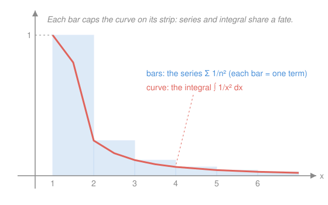

# Calculus Refresher · Lesson 3.1: Convergence and how to test it

> ⏱ ~15 min · Module 3: Series · Builds on: [2.3 Improper integrals and integrals as models](02-03-improper-integrals-and-models.md) · Unlocks: 3.2 (power series)

## Why this matters

A series is an infinite sum, and the first question about any infinite sum is whether it's even a number. It's the same question Module 2 asked about infinite regions — does adding forever settle on a finite total, or run away? You need the answer before you can trust anything built on top: a Taylor series is only a function where it converges, a perpetuity is only a price if its payments sum, a probability is only a probability if its terms total 1. The skill isn't running one test — it's looking at $\sum a_n$ and knowing *which* test cracks it on the first try.

## The idea

An infinite sum $a_1 + a_2 + a_3 + \cdots$ means: add the first term, then the first two, then the first three, and watch where those **partial sums** head. If they home in on a number, the series **converges** to it; if they wander off, it **diverges**.

Two shapes are so common they're the rulers everyone else is measured against. **Geometric** — each term a fixed multiple $r$ of the last ($1, r, r^2, \dots$) — converges exactly when $|r| < 1$, because the terms shrink like a decaying exponential. **p-series** — terms $1/n^p$ — is the discrete twin of 2.3's improper integral $\int 1/x^p\,dx$, and obeys the *same* law: converge when $p > 1$.

One trap dominates the subject: the terms shrinking to zero is **necessary but not sufficient**. The harmonic series $\sum 1/n$ has terms marching to zero and still diverges — the same "harmonic ghost" that made $\int 1/x\,dx$ blow up in 2.3. Zero-limit terms buy you a ticket; they don't guarantee arrival.

## The formal version

**Geometric series.**

$$\sum_{n=0}^{\infty} a r^{n} = \frac{a}{1-r} \quad\text{for } |r| < 1, \qquad \text{diverges for } |r| \geq 1.$$

In words: a constant-ratio sum collapses to first-term-over-(one-minus-ratio), but only if each step shrinks the term. Here $a$ is the first term and $r$ the common ratio $a_{n+1}/a_n$.

**p-series.** $\displaystyle\sum_{n=1}^{\infty} \frac{1}{n^{p}}$ converges $\iff p > 1$. In words: same threshold as the improper-integral p-test — you need decay *faster* than $1/n$.

**n-th-term test (the free first glance).** If $a_n \not\to 0$, then $\sum a_n$ diverges. In words: if the terms don't even die, the sum can't settle. Warning: the converse fails — $a_n \to 0$ proves nothing (harmonic).

**Integral test (why the p-law is one law, not two).** If $f$ is positive, decreasing, and continuous with $f(n) = a_n$, then $\sum_{n=1}^\infty a_n$ and $\int_1^\infty f(x)\,dx$ **converge or diverge together**. In words: the series is the staircase, the integral is the ramp underneath; each bounds the other, so they share a fate. Apply it to $f = 1/x^p$ and 2.3's p-test *becomes* the p-series law.

**Comparison / limit comparison.** If $0 \le a_n \le b_n$ and $\sum b_n$ converges, so does $\sum a_n$ (and a diverging floor drags $\sum a_n$ down with it). The clean version: if $\lim_{n\to\infty} a_n/b_n = L$ with $0 < L < \infty$, then $\sum a_n$ and $\sum b_n$ do the same thing. In words: a messy term that *behaves like* a benchmark shares the benchmark's verdict.

**Ratio test (for factorials and exponentials).** Let $L = \lim_{n\to\infty}\left|\dfrac{a_{n+1}}{a_n}\right|$. Then $\sum a_n$ **converges if $L < 1$**, **diverges if $L > 1$**, and the test is **inconclusive if $L = 1$**. In words: if each term is eventually a fixed fraction of the last, the sum is essentially geometric with ratio $L$ — so $L<1$ wins. Reach for this the instant you see $n!$ or $c^n$.

## Picture

Each bar is one term $1/n^2$; the red curve is $1/x^2$. Because the terms decrease, every bar caps the curve across its strip, so $\sum_{n\ge1}\frac1{n^2}$ and $\int_1^\infty \frac{dx}{x^2}$ trap each other — the p-series law of 3.1 and the improper-integral p-test of 2.3 are literally the same picture at two resolutions.

## Worked examples

**Example 1 (mechanical — pick the ruler, read the verdict).**

- $\sum_{n=1}^\infty \left(\tfrac{2}{5}\right)^n$: geometric, $r = \tfrac25$, $|r|<1$ → converges. Sum (starting at $n=1$, so first term $a=\tfrac25$): $\dfrac{2/5}{1-2/5} = \dfrac{2/5}{3/5} = \dfrac23$.
- $\sum_{n=1}^\infty \dfrac{1}{n^{3}}$: p-series, $p = 3 > 1$ → converges.
- $\sum_{n=1}^\infty \dfrac{1}{\sqrt{n}}$: p-series, $p = \tfrac12 \le 1$ → diverges.
- $\sum_{n=1}^\infty \dfrac{n}{n+1}$: terms $\to 1 \ne 0$ → n-th-term test kills it, diverges. (No harder test needed — always glance here first.)

**Example 2 (why you'd care — the ratio test on $e$'s series).** The number $e$ is $\sum_{n=0}^\infty \frac{1}{n!}$. Does it converge?

$$L = \lim_{n\to\infty}\frac{a_{n+1}}{a_n} = \lim_{n\to\infty}\frac{1/(n+1)!}{1/n!} = \lim_{n\to\infty}\frac{n!}{(n+1)!} = \lim_{n\to\infty}\frac{1}{n+1} = 0 < 1.$$

Converges — decisively, since the ratio races to $0$: factorials crush any fixed benchmark, which is exactly why the exponential series converges everywhere and will define $e^x$ in [3.2](03-02-power-and-taylor-series.md). No comparison series is even needed; the ratio test reads the factorial's mind.

## Watch out

- You might think "$a_n \to 0$, so it converges." That's the single most common error in the subject. It's necessary, never sufficient — $\sum 1/n$ is the standing counterexample. Zero-limit terms only clear you to run a real test.
- You might think the ratio test settles everything. When $L = 1$ it says *nothing* — and every p-series gives $L=1$ (e.g. $\frac{n^2}{(n+1)^2}\to1$), so the ratio test can't tell $\sum1/n$ from $\sum1/n^2$. Powers of $n$ are comparison/p-series work, not ratio work.
- You might plug the wrong first term into $\frac{a}{1-r}$. The formula wants $a=$ the *actual first term of your sum*; a series starting at $n=1$ has $a=r$, not $1$. Write out the first term before dividing.

## One-liner

> Terms-to-zero is the entry fee, not the prize — then match the series to its ruler: $r^n$→geometric, $1/n^p$→p-series, $n!$ or $c^n$→ratio, messy→compare.

## Problems

**P1 (🟢)** Evaluate $\displaystyle\sum_{n=1}^{\infty}\frac{2}{3^{n}}$, or show it diverges.

**P2 (🟡)** Use the ratio test to decide whether $\displaystyle\sum_{n=1}^{\infty}\frac{n}{2^{n}}$ converges.

**P3 (🔴, optional)** Decide whether $\displaystyle\sum_{n=1}^{\infty}\frac{1}{\sqrt{n^{2}+1}}$ converges. (A raw p-series glance is misleading here — find the right benchmark.)

Solutions

**P1** Geometric with ratio $r = \tfrac13$; since $|r| < 1$ it converges. The sum starts at $n=1$, so the first term is $a = \tfrac{2}{3}$:

$$\sum_{n=1}^{\infty}\frac{2}{3^{n}} = \frac{a}{1-r} = \frac{2/3}{1 - 1/3} = \frac{2/3}{2/3} = 1.$$

Verify by partial sums: $\tfrac23 + \tfrac29 + \tfrac{2}{27} + \cdots = 0.667 + 0.222 + 0.074 + 0.025 + \cdots$, and the running total $0.667, 0.889, 0.963, 0.988, \dots$ visibly climbs toward $1$. ✓

**P2** Terms $a_n = n/2^n$ (positive), so

$$L = \lim_{n\to\infty}\frac{a_{n+1}}{a_n} = \lim_{n\to\infty}\frac{(n+1)/2^{n+1}}{n/2^{n}} = \lim_{n\to\infty}\frac{n+1}{2n} = \frac{1}{2} < 1.$$

$L < 1$, so the series **converges**. (The extra factor $n$ is no match for the halving $2^n$ — the same exponential-beats-power reflex that will set the *radius* of convergence for power series in [3.2](03-02-power-and-taylor-series.md), where $L<1$ becomes the condition defining where a series is a function.)

Verify: partial sums $0.5, 1.0, 1.375, 1.625, 1.781, 1.875, \dots$ settle toward $2$ (the exact value is $2$) — a finite limit, consistent with convergence. ✓

**P3** As $n\to\infty$, $\sqrt{n^2+1}\approx n$, so $a_n$ behaves like $1/n$ — the divergent harmonic benchmark, not a convergent $p>1$ one. Limit comparison with $b_n = 1/n$:

$$\lim_{n\to\infty}\frac{a_n}{b_n} = \lim_{n\to\infty}\frac{1/\sqrt{n^2+1}}{1/n} = \lim_{n\to\infty}\frac{n}{\sqrt{n^2+1}} = \lim_{n\to\infty}\frac{1}{\sqrt{1+1/n^2}} = 1.$$

The limit is $1$ (finite and positive), so $\sum a_n$ shares $\sum \frac1n$'s fate: it **diverges**.

Verify the benchmark choice by bounding directly: $\sqrt{n^2+1} \le \sqrt{n^2 + n^2} = n\sqrt2$ for $n\ge1$, so $\frac{1}{\sqrt{n^2+1}} \ge \frac{1}{n\sqrt2}$, and $\sum \frac{1}{n\sqrt2} = \frac{1}{\sqrt2}\sum\frac1n$ diverges — a diverging floor drags $\sum a_n$ down with it. ✓

## Flashback

**From Lesson 2.3 (Improper integrals and integrals as models):** Does $\displaystyle\int_{1}^{\infty}\frac{dx}{x^{2}+x}$ converge? Decide by comparison first, then get the exact value to check.

Solution

**Comparison verdict.** For $x \ge 1$, $x^2 + x > x^2$, so $\frac{1}{x^2+x} < \frac{1}{x^2}$. Since $\int_1^\infty \frac{dx}{x^2}$ is a $p=2>1$ convergent benchmark, the smaller integrand converges too.

**Exact value (check).** Partial fractions: $\frac{1}{x^2+x} = \frac{1}{x(x+1)} = \frac{1}{x} - \frac{1}{x+1}$, so

$$\int_1^b \frac{dx}{x^2+x} = \Big[\ln x - \ln(x+1)\Big]_1^b = \ln\frac{b}{b+1} - \ln\frac{1}{2} \xrightarrow[b\to\infty]{} \ln 1 + \ln 2 = \ln 2.$$

Finite ($\approx 0.693$), confirming the comparison verdict — and note the discrete cousin $\sum \frac{1}{n^2+n}$ converges for the identical reason, capped by $\sum 1/n^2$. ✓

## Connections

- **Backward:** the p-series law is [2.3](02-03-improper-integrals-and-models.md)'s improper-integral p-test, transferred by the integral test — the staircase-and-ramp picture makes them one theorem. Partial sums are just [2.1](02-01-integral-as-accumulation.md)'s accumulation, sampled at integers.
- **Forward:** [3.2](03-02-power-and-taylor-series.md) runs the ratio test on $\sum c_n x^n$ with $x$ carried along; the condition $L<1$ becomes the *radius of convergence*, the interval where a power series is an honest function.
- **Sideways (probability):** a discrete distribution's probabilities must form a *convergent* series summing to $1$ — geometric (waiting-time) and Poisson ($\sum \lambda^n/n!$, an $e^\lambda$ series by Example 2's logic) distributions are convergence tests wearing statistics uniforms; `prob-stat-refresher` leans on this.
