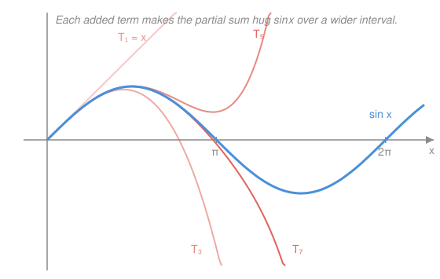

# Calculus Refresher · Lesson 3.2: Power series and Taylor series

> ⏱ ~15 min · Module 3: Series · Builds on: [3.1 Convergence and how to test it](03-01-series-convergence-tests.md), [1.3 Linearization and Taylor's idea](01-03-linearization-and-taylor.md) · Unlocks: Module 4 (multivariable calculus)

## Why this matters

Your calculator has no idea how to "take a sine." It adds up a polynomial. So does every physics engine, every $e^x$ in a spreadsheet, every $\ln(1+r)$ in a bond pricer. The trick behind all of it: many functions *are* infinite polynomials in disguise, and once you know the disguise you can differentiate, integrate, and substitute them as easily as $x^2$. Lesson 1.3 built a Taylor *polynomial* — a finite stand-in good near one point. This lesson lets the polynomial run forever and asks when it stops being an approximation and becomes an *equality*.

## The idea

Take the Taylor polynomials $T_n$ from 1.3 and don't stop. Each new term matched one more derivative and shrank the error on a wider interval (that's the picture below: $\sin x$'s partial sums hug the true curve over a longer and longer stretch). Push $n \to \infty$ and, for the friendly functions, the error is squeezed to zero everywhere it matters — the infinite sum doesn't just approximate $f$, it *equals* it.

That infinite sum is a **power series**: a polynomial with infinitely many terms, $c_0 + c_1 x + c_2 x^2 + \cdots$. The one whose coefficients come from $f$'s derivatives is $f$'s **Taylor series**. The headline you should carry out of here:

> A Taylor **polynomial** is a Taylor **series** cut off after finitely many terms. Lesson 1.3 was one snapshot of this lesson's movie.

The only new worry is *where* the infinite sum makes sense. An infinite polynomial can blow up if $x$ is too big — so each power series comes with a **radius of convergence**, a window around the center inside which it behaves and outside which it's garbage. Finding that window is a job for 3.1's ratio test.

## The formal version

**Power series.** A series of the form

$$\sum_{n=0}^{\infty} c_n (x - a)^n = c_0 + c_1(x-a) + c_2(x-a)^2 + \cdots,$$

with **center** $a$ and **coefficients** $c_n$. In words: a polynomial of infinite degree, built in powers of the displacement $x - a$ from the center.

**Radius of convergence.** There is a number $R \in [0, \infty]$ such that the series converges for $|x - a| < R$ and diverges for $|x - a| > R$. In words: it works strictly inside a window of half-width $R$ around $a$, and fails outside (the two endpoints are a separate, case-by-case question). You find $R$ with the ratio test from 3.1: converges when

$$\lim_{n\to\infty}\left|\frac{c_{n+1}(x-a)^{n+1}}{c_n(x-a)^{n}}\right| = |x-a|\lim_{n\to\infty}\left|\frac{c_{n+1}}{c_n}\right| < 1.$$

**Taylor series** of $f$ at $a$ (Maclaurin = the special case $a=0$):

$$f(x) = \sum_{n=0}^{\infty} \frac{f^{(n)}(a)}{n!}(x-a)^n.$$

In words: the coefficients are $f$'s derivatives at the center, scaled by $1/n!$ — the infinite continuation of 1.3's $T_n$. This holds wherever the error term from 1.3 dies as $n \to \infty$, which is exactly inside the radius $R$.

**The library — memorize these five.** Every other series is built from them.

$$e^x = \sum_{n=0}^{\infty}\frac{x^n}{n!} = 1 + x + \frac{x^2}{2!} + \cdots \quad (R=\infty)$$

$$\sin x = \sum_{n=0}^{\infty}\frac{(-1)^n x^{2n+1}}{(2n+1)!} = x - \frac{x^3}{3!} + \frac{x^5}{5!} - \cdots \quad (R=\infty)$$

$$\cos x = \sum_{n=0}^{\infty}\frac{(-1)^n x^{2n}}{(2n)!} = 1 - \frac{x^2}{2!} + \frac{x^4}{4!} - \cdots \quad (R=\infty)$$

$$\frac{1}{1-x} = \sum_{n=0}^{\infty} x^n = 1 + x + x^2 + \cdots \quad (|x| < 1)$$

$$\ln(1+x) = \sum_{n=1}^{\infty}\frac{(-1)^{n-1} x^n}{n} = x - \frac{x^2}{2} + \frac{x^3}{3} - \cdots \quad (|x| < 1)$$

**Manipulate them like polynomials.** Inside the radius, a power series can be **substituted into, differentiated, and integrated term-by-term**, and the result is the correct series for the new function. In words: you almost never compute derivatives to get a Taylor series — you algebra your way from one in the library. (Note $\sin$ and $\cos$ are termwise derivatives of each other, and $\sin$ has only odd powers because it's odd — the even-derivative matching for free that 1.3 flagged.)

## Picture

The blue curve is the true $\sin x$; each red partial sum tracks it longer before peeling away. That "peeling away" happens further out with every term — the visual signature of convergence.

## Worked examples

**Example 1 (mechanical — the two radii).** *How wide is each window?* Ratio test on the coefficients.

For $e^x$, $c_n = 1/n!$:

$$|x|\lim_{n\to\infty}\left|\frac{c_{n+1}}{c_n}\right| = |x|\lim_{n\to\infty}\frac{n!}{(n+1)!} = |x|\lim_{n\to\infty}\frac{1}{n+1} = 0 < 1 \text{ for every } x,$$

so $R = \infty$ — the $e^x$ series converges everywhere, because $n!$ crushes any fixed power of $x$. For the geometric series $\frac{1}{1-x}$, $c_n = 1$:

$$|x|\lim_{n\to\infty}\left|\frac{1}{1}\right| = |x| < 1 \iff |x| < 1,$$

so $R = 1$. Same test, opposite verdicts — the factorial is the whole difference.

**Example 2 (why you'd care — get a new series for free).** *Where does the $\ln(1+x)$ series even come from?* Integrate a geometric series. Start from the library with $x \mapsto -t$:

$$\frac{1}{1+t} = \frac{1}{1-(-t)} = \sum_{n=0}^{\infty}(-t)^n = 1 - t + t^2 - t^3 + \cdots \quad (|t|<1).$$

Now integrate both sides from $0$ to $x$, term-by-term (legal inside $R=1$). The left side is $\ln(1+x)$; the right side integrates power-by-power:

$$\ln(1+x) = \int_0^x \frac{dt}{1+t} = x - \frac{x^2}{2} + \frac{x^3}{3} - \frac{x^4}{4} + \cdots = \sum_{n=1}^{\infty}\frac{(-1)^{n-1}x^n}{n}.$$

No derivatives of $\ln$ computed, no factorials chased — one substitution and one integral turned a geometric series into the logarithm's. This is the entire working style of the subject. (At $x=1$ this even gives $\ln 2 = 1 - \tfrac12 + \tfrac13 - \cdots$, the alternating harmonic sum from 3.1.)

## Watch out

- You might think a Taylor series always equals its function. It equals $f$ **only inside the radius**, and even convergence isn't automatic equality in pathological cases — but for the library five, "converges" and "equals $f$" coincide on $(a-R, a+R)$.
- You might think a bigger radius means a better approximation. $R$ tells you *where* the series works, not *how fast* it closes in. Near the center, few terms suffice; near the edge of the window, convergence can crawl (watch $\ln(1+x)$ limp toward $\ln 2$ at $x=1$).
- You might reach for the derivative formula $f^{(n)}(a)/n!$ every time. Almost never do that — substitute, differentiate, or integrate a library series instead. Computing the 7th derivative of $e^{-x^2}$ by hand is a self-inflicted wound.

## One-liner

> A power series is a polynomial of infinite degree that equals its function inside a radius $R$ — memorize five of them and manipulate the rest into existence by substituting, differentiating, and integrating term-by-term.

## Problems

**P1 (🟢)** Find the Maclaurin series of $f(x) = e^{-x^2}$ by substitution into the library, write out its first three nonzero terms, and state its radius of convergence. (This integrand is the Gaussian bell curve — the reason it has *no* elementary antiderivative is that you can only integrate it as this series, term-by-term.)

**P2 (🟡)** Derive the Maclaurin series of $\arctan x$ by writing $\frac{1}{1+x^2}$ as a geometric series and integrating term-by-term. What is its radius of convergence?

**P3 (🔴, optional)** Start from the $e^x$ series and substitute $x = i\theta$ (with $i^2 = -1$). Group the real and imaginary terms and identify each group as a library series, thereby proving **Euler's formula** $e^{i\theta} = \cos\theta + i\sin\theta$. Then evaluate $e^{i\pi}$.

Solutions

**P1** Take $e^u = \sum_{n=0}^\infty u^n/n!$ (valid for all $u$) and substitute $u = -x^2$:

$$e^{-x^2} = \sum_{n=0}^{\infty}\frac{(-x^2)^n}{n!} = \sum_{n=0}^{\infty}\frac{(-1)^n x^{2n}}{n!} = 1 - x^2 + \frac{x^4}{2} - \cdots$$

Since the $e^u$ series has $R = \infty$ and $u = -x^2$ is finite for every finite $x$, the radius is $R = \infty$.

*Verify:* differentiate the series termwise — $\frac{d}{dx}\left(1 - x^2 + \frac{x^4}{2} - \cdots\right) = -2x + 2x^3 - \cdots = -2x(1 - x^2 + \cdots)$, which is $-2x\,e^{-x^2}$. That matches the chain-rule derivative of $e^{-x^2}$ directly. ✓

**P2** With $x \mapsto -x^2$ in the geometric series,

$$\frac{1}{1+x^2} = \frac{1}{1-(-x^2)} = \sum_{n=0}^{\infty}(-x^2)^n = 1 - x^2 + x^4 - x^6 + \cdots \quad (|x^2| < 1, \text{ i.e. } |x|<1).$$

Since $\frac{d}{dx}\arctan x = \frac{1}{1+x^2}$, integrate from $0$ to $x$ term-by-term (and $\arctan 0 = 0$):

$$\arctan x = \int_0^x \frac{dt}{1+t^2} = x - \frac{x^3}{3} + \frac{x^5}{5} - \frac{x^7}{7} + \cdots = \sum_{n=0}^{\infty}\frac{(-1)^n x^{2n+1}}{2n+1}.$$

The geometric parent needs $|x| < 1$, and integrating doesn't change the radius, so $R = 1$.

*Verify:* differentiate the result termwise — $1 - x^2 + x^4 - x^6 + \cdots$, exactly the $\frac{1}{1+x^2}$ series we started from. ✓ (At $x=1$, this is the Leibniz formula $\frac{\pi}{4} = 1 - \tfrac13 + \tfrac15 - \cdots$, a boundary case that converges slowly — see the second "Watch out.")

**P3** Substitute $x = i\theta$ into $e^x = \sum_{n=0}^\infty x^n/n!$. The powers of $i$ cycle with period 4: $i^0=1,\ i^1=i,\ i^2=-1,\ i^3=-i$. Split the sum by even and odd $n$:

$$e^{i\theta} = \underbrace{\left(1 - \frac{\theta^2}{2!} + \frac{\theta^4}{4!} - \cdots\right)}_{\text{even powers, real}} + i\underbrace{\left(\theta - \frac{\theta^3}{3!} + \frac{\theta^5}{5!} - \cdots\right)}_{\text{odd powers, imaginary}}.$$

The even group ($n = 2k$ gives $i^{2k} = (-1)^k$) is exactly the $\cos\theta$ series; the odd group ($n = 2k+1$ gives $i^{2k+1} = i(-1)^k$) is exactly the $\sin\theta$ series. Hence

$$e^{i\theta} = \cos\theta + i\sin\theta.$$

At $\theta = \pi$: $e^{i\pi} = \cos\pi + i\sin\pi = -1 + 0 = -1$, i.e. $e^{i\pi} + 1 = 0$.

*Verify:* the three library series ($e^x, \cos x, \sin x$) all have $R=\infty$, so rearranging into even/odd groups is legal for every $\theta$; and setting $\theta = 0$ gives $e^0 = \cos 0 + i\sin 0 = 1$. ✓

## Flashback

**From Lesson 1.3 (Linearization and Taylor's idea):** Estimate $\sqrt[3]{8.1}$ using the linear approximation of $f(x) = x^{1/3}$ at $a = 8$. Say whether it over- or undershoots before checking, then bound the error with the $\tfrac{1}{2}f''(c)h^2$ term.

Solution

$f(8) = 2$, $f'(x) = \frac{1}{3}x^{-2/3}$ so $f'(8) = \frac{1}{3}\cdot\frac{1}{4} = \frac{1}{12}$. With $h = 0.1$:

$$\sqrt[3]{8.1} \approx L(8.1) = 2 + \frac{1}{12}(0.1) = 2.008\overline{3}.$$

Overshoot: $f''(x) = -\frac{2}{9}x^{-5/3} < 0$, so $f$ is concave and the tangent sits above the curve. Error bound: $|f''(8)| = \frac{2}{9}\cdot 8^{-5/3} = \frac{2}{9}\cdot\frac{1}{32} = \frac{1}{144}$ (largest on $[8, 8.1]$), so

$$|\text{error}| \le \tfrac{1}{2}\cdot\tfrac{1}{144}\cdot(0.1)^2 \approx 3.5\times 10^{-5}.$$

*Verify:* the true value is $\sqrt[3]{8.1} = 2.0082988\ldots$, so the actual error is $3.4\times 10^{-5}$ — under the ceiling and on the predicted (over) side. ✓ This is 3.2 in embryo: $L$ is the degree-1 truncation of the Taylor series of $x^{1/3}$ centered at $8$.

## Connections

- **Backward:** this is [1.3](01-03-linearization-and-taylor.md) with the brakes off — $T_n$ becomes $T_\infty$, and 1.3's Lagrange error term dying as $n\to\infty$ is precisely what "the series equals $f$ inside $R$" means. The convergence machinery is [3.1](03-01-series-convergence-tests.md)'s ratio test, now applied with $x$ riding along in each term.
- **Forward (Module 4):** power series in several variables underlie the multivariable Taylor expansion — the Hessian in [4.2](04-02-multivariable-optimization-lagrange.md)'s second-derivative test is the quadratic term of a two-variable Taylor series, the exact analogue of 1.3's $\tfrac12 f''h^2$.
- **Sideways (physics):** the small-angle $\sin\theta \approx \theta$ pendulum is just the degree-1 truncation of the $\sin$ series here; keeping the $-\theta^3/6$ term is the first anharmonic correction. Euler's formula (P3) is the algebraic backbone of every wave, AC circuit, and quantum phase in `mechanics-refresher` and beyond.
- **Sideways (econ/prob):** $\ln(1+x) \approx x - \tfrac{x^2}{2}$ refines the log-return approximation from `micro-refresher`, and P1's $e^{-x^2}$ series is how the Gaussian's un-integrable bell curve gets integrated in `prob-stat-refresher` — term-by-term, exactly as advertised.
