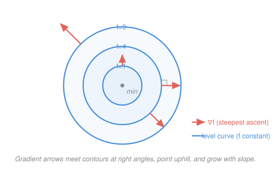

# Calculus Refresher · Lesson 4.1: Partial derivatives and the gradient

> ⏱ ~15 min · Module 4: Multivariable calculus · Builds on: [1.2 The rules, and why the chain rule is the big one](01-02-differentiation-rules.md) · Unlocks: 4.2 (multivariable optimization & Lagrange)

## Why this matters

Almost nothing real depends on one variable. Output depends on labor *and* capital; a temperature field depends on all three coordinates; utility depends on every good in the basket. To do calculus on these you need a derivative that answers a sharper question than "how fast does it change?" — namely "change *in which direction*, and which direction changes it fastest?" The gradient answers both at once. It is the single object behind steepest-descent training of every machine-learning model, the "force points downhill in potential" of physics, and the tangency condition at the heart of consumer choice — all of which are downstream of this one lesson.

## The idea

Stand on a hillside. The height of the ground is a function $f(x,y)$ of your east–west and north–south position. Two natural questions:

- **How steep is it if I walk due east?** Freeze your north–south coordinate, walk east, watch the height change. That single-variable slope is the **partial derivative** $f_x$ — an ordinary 1.1 derivative in which every other variable is held still, a spectator.
- **Which way is uphill, and how steep is the steepest way?** Package the east-steepness and the north-steepness into one vector, $\nabla f = (f_x, f_y)$. Remarkably, this bookkeeping vector *is* the answer: it points in the direction of steepest ascent, and its length is that steepest slope.

That is the whole lesson. Partials are just single-variable derivatives with the other inputs frozen; the gradient staples them into a vector that happens to know where "uphill" is.

## The formal version

**Partial derivatives.** For $f(x,y)$,

$$f_x = \frac{\partial f}{\partial x} = \lim_{h\to 0}\frac{f(x+h,\,y) - f(x,y)}{h},\qquad f_y = \frac{\partial f}{\partial y} = \lim_{h\to 0}\frac{f(x,\,y+h) - f(x,y)}{h}.$$

In words: differentiate with respect to one variable while treating every other variable as a constant — all the 1.2 rules apply unchanged, you just hold the spectators fixed. (The curly $\partial$ signals "there are other variables I'm freezing.")

**The gradient** is the vector of partials:

$$\nabla f = \left(f_x,\, f_y\right).$$

In words: collect the per-axis sensitivities into one arrow; that arrow lives in the *input* plane, not on the graph.

**Directional derivative.** For a **unit** vector $\mathbf u$ (so $|\mathbf u| = 1$), the rate of change of $f$ as you step in direction $\mathbf u$ is

$$D_{\mathbf u} f = \nabla f \cdot \mathbf u .$$

In words: the slope in direction $\mathbf u$ is the gradient's shadow (dot product) onto that direction. The unit-length requirement is not optional — it is what makes "per step of length 1" meaningful.

**The two headline facts.** Since $\nabla f \cdot \mathbf u = |\nabla f|\cos\theta$ with $\theta$ the angle between $\nabla f$ and $\mathbf u$:

1. $\cos\theta$ is largest ($=1$) when $\mathbf u$ points *along* $\nabla f$. So **$\nabla f$ points in the direction of steepest ascent, and $|\nabla f|$ is that steepest slope.** (The steepest *descent* is $-\nabla f$; the ML optimizer's whole job.)
2. Along a **level set** (a contour $f = \text{const}$) the value doesn't change, so $D_{\mathbf u} f = 0$ there, which forces $\nabla f \cdot \mathbf u = 0$: **$\nabla f$ is perpendicular to the level curve through the point.**

**Local linear model (tangent plane).** Just as [1.3](01-03-linearization-and-taylor.md) replaced a curve by its tangent line, the gradient replaces a surface by its tangent plane near a base point $\mathbf a$:

$$f(\mathbf x) \approx f(\mathbf a) + \nabla f(\mathbf a)\cdot(\mathbf x - \mathbf a).$$

In words: near $\mathbf a$, $f$ is well approximated by "start at $f(\mathbf a)$, then add each way you moved times how sensitive $f$ is in that way." It is 1.3's $f(a) + f'(a)(x-a)$ with a dot product doing the work of the single slope.

## Picture

## Worked examples

**Example 1 (mechanical — freeze the spectator).** Let $f(x,y) = x^2 y^3$.

- For $f_x$, treat $y^3$ as a constant multiplier: $f_x = 2x\,y^3$.
- For $f_y$, treat $x^2$ as a constant multiplier: $f_y = x^2\cdot 3y^2 = 3x^2 y^2$.

So $\nabla f = (2xy^3,\; 3x^2y^2)$. At the point $(1,2)$: $\nabla f = (2\cdot1\cdot8,\; 3\cdot1\cdot4) = (16,\,12)$. Reading it off: at $(1,2)$, $f$ rises fastest heading in direction $(16,12)$, and the steepest slope there is $|\nabla f| = \sqrt{16^2+12^2} = \sqrt{400} = 20$.

**Example 2 (why you'd care — which way to hike).** A hill has height $f(x,y) = 100 - x^2 - 2y^2$. You stand at $(1,1)$ (height $97$).

$$\nabla f = (-2x,\,-4y),\qquad \nabla f(1,1) = (-2,\,-4).$$

*Steepest way up:* head in direction $(-2,-4)$, i.e. the unit vector $\tfrac{1}{\sqrt{20}}(-2,-4) = \tfrac{1}{\sqrt5}(-1,-2)$ — back toward the summit at the origin, sensible for a dome. The steepest slope is $|\nabla f| = \sqrt{20} = 2\sqrt5 \approx 4.47$.

*Walking due east*, $\mathbf u = (1,0)$: $D_{\mathbf u}f = (-2,-4)\cdot(1,0) = -2$. Negative — east is downhill here, dropping 2 units of height per unit step. The *sign* of a directional derivative is a compass for up versus down.

## Watch out

- You might think $\mathbf u$ can be any vector in $D_{\mathbf u}f = \nabla f\cdot\mathbf u$. It must be a **unit** vector; otherwise you've scaled the rate by $|\mathbf u|$ and the "per unit distance" meaning is gone. Always normalize the given direction first — divide by its length.
- You might picture $\nabla f$ as an arrow lying *on the surface*, tilted up the hill in 3-D. It doesn't: $\nabla f$ lives flat in the $(x,y)$ **input plane** and only tells you which compass heading is steepest. The steepness itself is the separate number $|\nabla f|$.
- You might expect $\nabla f$ to point *along* a contour. It points **across** it, at a right angle — value can't change along a level curve, so the direction of maximum change must leave it perpendicularly.

## One-liner

> The gradient is the vector of frozen-spectator slopes; it points straight uphill, its length is the steepest slope, and it always crosses the contours at a right angle.

## Problems

**P1 (🟢)** Compute $\nabla f$ for $f(x,y) = x^2 y + \sin(xy)$.

**P2 (🟡)** For $f(x,y) = x^2 y$ at the point $(1,2)$: (a) find the directional derivative in the direction of the vector $(3,4)$; (b) give the direction of steepest ascent and the steepest slope. (Watch the unit-vector requirement in (a).)

**P3 (🔴, optional — econ bridge)** For the Cobb–Douglas utility $U(x,y) = x^{1/2}y^{1/2}$: (a) find the marginal utilities $U_x, U_y$ as partials; (b) show the marginal rate of substitution $\text{MRS} = U_x/U_y = y/x$; (c) confirm by implicit differentiation (the [1.2](01-02-differentiation-rules.md) move) that the indifference curve $U = c$ has slope $\dfrac{dy}{dx} = -\dfrac{y}{x}$ — so the MRS is exactly the magnitude of the indifference curve's slope, and $\nabla U$ is perpendicular to it.

Solutions

**P1** Differentiate each term, freezing the other variable; the $\sin(xy)$ term needs the chain rule from [1.2](01-02-differentiation-rules.md) with inner function $xy$.

- $f_x$: from $x^2 y$ get $2xy$; from $\sin(xy)$ get $\cos(xy)\cdot\frac{\partial}{\partial x}(xy) = \cos(xy)\cdot y$. So $f_x = 2xy + y\cos(xy)$.
- $f_y$: from $x^2 y$ get $x^2$; from $\sin(xy)$ get $\cos(xy)\cdot\frac{\partial}{\partial y}(xy) = \cos(xy)\cdot x$. So $f_y = x^2 + x\cos(xy)$.

$$\nabla f = \big(\,2xy + y\cos(xy),\;\; x^2 + x\cos(xy)\,\big).$$

Verification (re-derive the chain factor): $\frac{\partial}{\partial x}\sin(xy)$ has inner $xy$ whose $x$-partial is $y$ — matches. At $(0,0)$ as a spot check: $f_x = 0 + 0\cdot\cos 0 = 0$, $f_y = 0 + 0 = 0$, and indeed $f$ is flat at the origin since $x^2y$ and $\sin(xy)$ each start with a zero factor. ✓

**P2** First $\nabla f$. With $f = x^2 y$: $f_x = 2xy$, $f_y = x^2$, so $\nabla f = (2xy,\,x^2)$. At $(1,2)$: $\nabla f = (4,\,1)$.

(a) The given direction $(3,4)$ has length $\sqrt{3^2+4^2} = 5$, so the **unit** vector is $\mathbf u = \big(\tfrac35, \tfrac45\big)$. Then

$$D_{\mathbf u}f = \nabla f\cdot\mathbf u = 4\cdot\tfrac35 + 1\cdot\tfrac45 = \tfrac{12}{5} + \tfrac{4}{5} = \tfrac{16}{5} = 3.2.$$

(Skipping normalization would give $4\cdot3 + 1\cdot4 = 16$ — five times too big, because $(3,4)$ is five units long. This is the whole point of the unit-vector rule.)

(b) Steepest ascent points along $\nabla f = (4,1)$; as a unit vector, $\tfrac{1}{\sqrt{17}}(4,1)$. The steepest slope is $|\nabla f| = \sqrt{4^2+1^2} = \sqrt{17}\approx 4.12$.

Verification: $3.2 < \sqrt{17}$, as it must be — the directional derivative in *any* direction can't exceed the steepest slope $|\nabla f|$, and it equals it only when you walk straight along the gradient. ✓

**P3** (a) Hold the other good constant and differentiate:

$$U_x = \tfrac12 x^{-1/2} y^{1/2},\qquad U_y = \tfrac12 x^{1/2} y^{-1/2}.$$

These are the marginal utilities — extra satisfaction per extra unit of each good.

(b) The ratio's constants and half-powers cancel cleanly:

$$\text{MRS} = \frac{U_x}{U_y} = \frac{x^{-1/2} y^{1/2}}{x^{1/2} y^{-1/2}} = x^{-1}y^{1} = \frac{y}{x}.$$

(c) Indifference curve $x^{1/2}y^{1/2} = c$. Treat $y$ as $y(x)$ and differentiate both sides — every $y$-term picks up a $y'$ by the chain rule:

$$\tfrac12 x^{-1/2}y^{1/2} + x^{1/2}\cdot\tfrac12 y^{-1/2}\,y' = 0 \;\Longrightarrow\; y' = -\frac{\tfrac12 x^{-1/2}y^{1/2}}{\tfrac12 x^{1/2}y^{-1/2}} = -\frac{U_x}{U_y} = -\frac{y}{x}.$$

So the slope of the indifference curve is $-\text{MRS}$, and the gradient $\nabla U = (U_x, U_y)$ — perpendicular to that level curve — is the direction of fastest utility gain.

Verification: the implicit-derivative result $y' = -U_x/U_y$ is the general "level curve slope $=$ minus the partials' ratio" fact, and here it reproduces $-y/x$ from (b) independently. ✓ (This tangency is exactly what [4.2](04-02-multivariable-optimization-lagrange.md) turns into the consumer's optimum, where MRS meets the price ratio via a Lagrange multiplier.)

## Flashback

**From Lesson 1.2 (The rules, and why the chain rule is the big one):** Differentiate $g(x) = \sin\!\big(\sqrt{x^2+1}\big)$. Name the layers before you compute.

Solution

Three nested layers: outer $\sin(\square)$, middle $\sqrt{\square}$, inner $x^2+1$. The chain rule multiplies the three sensitivities, each evaluated at the value flowing into it:

$$g'(x) = \cos\!\big(\sqrt{x^2+1}\big)\cdot \frac{1}{2\sqrt{x^2+1}}\cdot 2x = \frac{x\,\cos\!\big(\sqrt{x^2+1}\big)}{\sqrt{x^2+1}}.$$

Check the anatomy: $\frac{d}{dx}\sqrt{u} = \frac{1}{2\sqrt u}\cdot u'$ with $u = x^2+1$, $u' = 2x$, and the $2$'s cancel — exactly the 1.2 pattern of sensitivities multiplying down a chain. (Foreshadow: the multivariable chain rule in 4.2 threads this same idea through *several* intermediate variables at once.) ✓

## Connections

- **Backward:** each partial is a [1.1/1.2](01-02-differentiation-rules.md) single-variable derivative with the other inputs frozen — no new differentiation rules, only new bookkeeping. The tangent-plane model is [1.3](01-03-linearization-and-taylor.md)'s linearization with a dot product replacing the single slope.
- **Forward:** [4.2](04-02-multivariable-optimization-lagrange.md) finds maxima/minima by setting $\nabla f = \mathbf 0$ (nothing points uphill) and, under a constraint $g = c$, aligning $\nabla f$ with $\nabla g$ — the Lagrange condition, which is just "both gradients perpendicular to the same constraint curve." [5.1](05-01-vector-fields-div-curl.md) then studies $\nabla f$ as a full vector field.
- **Sideways (economics):** P3's $\text{MRS} = U_x/U_y$ as the indifference-curve slope is the consumer-theory reading of level-set perpendicularity; the constrained-optimum where MRS equals the price ratio is the Lagrange multiplier of [4.2](04-02-multivariable-optimization-lagrange.md) — the same tangency the physicist calls "force is minus the gradient of potential."
