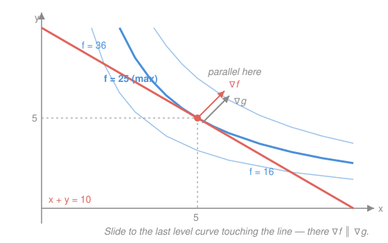

# Calculus Refresher · Lesson 4.2: Multivariable optimization and Lagrange

> ⏱ ~15 min · Module 4: Multivariable calculus · Builds on: [4.1 Partial derivatives and the gradient](04-01-partial-derivatives-and-gradient.md), [1.4 Optimization](01-04-optimization.md) · Unlocks: 4.3 (multiple integrals)

## Why this matters

"Best" almost never comes alone — it comes chained to a constraint. Maximize utility *on a budget*. Minimize energy *at fixed volume*. Find the closest point *on a surface*. The unconstrained half of this lesson generalizes [1.4](01-04-optimization.md) — $f'=0$ becomes $\nabla f = \mathbf 0$, the second-derivative test grows a matrix — but the real prize is the constrained half. Lagrange multipliers turn "optimize while tied to a curve" into a system of equations, and hand you a bonus: the multiplier $\lambda$ is a *price* — how much your best-possible outcome would improve if the constraint loosened by one unit. That number is the beating heart of microeconomics and of every shadow-price argument in optimization.

## The idea

**Unconstrained.** Stand on a landscape $f(x,y)$. At a peak or a basin, the ground is flat in *every* direction at once — walk any way and you don't gain to first order. Flat-in-every-direction means both partials vanish: $\nabla f = \mathbf 0$. But 2D has a trap 1D never had — the **saddle**, flat at a point yet rising along one axis and falling along another (a mountain pass). So $\nabla f = \mathbf 0$ only nominates candidates; to sort them you must read the *bend in every direction*, which is what the Hessian does.

**Constrained.** Now you're not free to roam — you must stay on a fence, the curve $g(x,y)=c$. Walk along it and watch $f$. You keep climbing until the fence runs *tangent* to a level curve of $f$; one more step and you'd slide back down. At that tangent spot, moving along the fence changes $f$ by nothing to first order — so $f$'s uphill direction $\nabla f$ has **no component along the fence**. But $\nabla g$ is *also* perpendicular to the fence (gradients point across their own level curves, [4.1](04-01-partial-derivatives-and-gradient.md)). Two vectors perpendicular to the same curve must be parallel:
$$\nabla f = \lambda\,\nabla g.$$
That $\lambda$ isn't bookkeeping. Loosen the fence by one unit of $c$ and your best value rises by exactly $\lambda$ — the constraint's **shadow price**.

## The formal version

Let $f(x,y)$ be the objective and write its partials $f_x,f_y$ and second partials $f_{xx},f_{yy},f_{xy}$.

**Critical points (unconstrained).** An interior extremum needs
$$\nabla f = (f_x, f_y) = \mathbf 0.$$
In words: no uphill direction, so all first-order gain is used up.

**Second-derivative (Hessian) test.** At a critical point define the discriminant
$$D = f_{xx}\,f_{yy} - f_{xy}^{\,2}.$$
Then
$$D>0,\ f_{xx}>0 \Rightarrow \text{local min}; \quad D>0,\ f_{xx}<0 \Rightarrow \text{local max};$$
$$D<0 \Rightarrow \text{saddle}; \quad D=0 \Rightarrow \text{inconclusive}.$$
In words: $D>0$ means the surface bends the same way along both axes (a cup or a cap, and $f_{xx}$'s sign says which); $D<0$ means it bends up one way and down the other — a saddle; $D=0$ the test abstains, exactly as $f''=0$ did in [1.4](01-04-optimization.md). ($D$ is the determinant of the Hessian matrix $\begin{pmatrix} f_{xx} & f_{xy}\\ f_{xy} & f_{yy}\end{pmatrix}$; the cross term $f_{xy}^2$ is the new ingredient, penalizing twist.)

**Lagrange multipliers (constrained).** To optimize $f$ subject to $g(x,y)=c$, solve the system
$$\nabla f = \lambda\,\nabla g, \qquad g(x,y)=c.$$
That's three scalar equations ($f_x=\lambda g_x$, $f_y=\lambda g_y$, and the constraint) in three unknowns $x,y,\lambda$. In words: find where a level curve of $f$ kisses the constraint curve tangentially. Compare $f$ at every solution to pick the max or min.

**The multiplier is a shadow price.** If $f^*(c)$ is the optimal value as a function of the constraint level $c$, then
$$\lambda = \frac{d f^*}{dc}.$$
In words: $\lambda$ is the marginal value of the constraint — the rate at which the best-attainable $f$ improves per unit you relax $c$.

## Picture

Slide outward through the level curves $f=xy$. The line $x+y=10$ never reaches $f=36$ (unattainable), *crosses* $f=16$ (attainable but beatable), and just barely **touches** $f=25$ at $(5,5)$ — the highest level curve still in contact. Contact is tangency, and tangency is exactly $\nabla f \parallel \nabla g$: at $(5,5)$, $\nabla f=(y,x)=(5,5)$ and $\nabla g=(1,1)$ point the same way, with $\lambda=5$.

## Worked examples

**Example 1 (mechanical — the Hessian test, including a saddle).** Classify the critical points of $f(x,y)=x^3-3x+y^2$.

$\nabla f = (3x^2-3,\ 2y)=\mathbf 0$ gives $x=\pm 1$, $y=0$ — two critical points, $(1,0)$ and $(-1,0)$. Second partials: $f_{xx}=6x$, $f_{yy}=2$, $f_{xy}=0$, so $D=12x$.
- At $(1,0)$: $D=12>0$ and $f_{xx}=6>0$ → **local min**, value $f=1-3+0=-2$.
- At $(-1,0)$: $D=-12<0$ → **saddle** (rising in $y$, falling in $x$ — the 2D-only case that has no 1D analogue).

**Example 2 (why you'd care — Lagrange as a distance, with a shadow price).** Find the point on the line $x+2y=10$ closest to the origin.

Minimize squared distance $f=x^2+y^2$ subject to $g=x+2y=10$ (squaring avoids the square root and moves the minimum nowhere). Lagrange:
$$\nabla f=(2x,2y)=\lambda(1,2)=\lambda\nabla g \ \Rightarrow\ 2x=\lambda,\ 2y=2\lambda \Rightarrow y=2x.$$
Feed into the constraint: $x+2(2x)=10 \Rightarrow x=2,\ y=4$. Closest point $(2,4)$, distance $\sqrt{2^2+4^2}=\sqrt{20}=2\sqrt5$, and $\lambda=2x=4$. Geometrically the level curves of $f$ are circles, and the smallest circle touching the line does so where the line is tangent — perpendicular from the origin, exactly what "closest" means.

Read $\lambda$ as a shadow price: with the constraint at level $c$ (line $x+2y=c$) the minimum value is $f^*(c)=c^2/5$, so $\dfrac{df^*}{dc}=\dfrac{2c}{5}\Big|_{c=10}=4=\lambda$. ✓ Push the line one unit farther out and the squared distance grows by about $4$.

## Watch out

- You might think $D>0$ alone settles max vs. min. It doesn't — $D>0$ only rules out a saddle; you still read $f_{xx}$'s sign (positive → cup → min). And when $D=0$ the test is silent, just like $f''=0$ in [1.4](01-04-optimization.md).
- You might think $\nabla f=\lambda\nabla g$ is enough. It's *two* equations; without the constraint $g=c$ as the third, you have more unknowns than equations and $\lambda$ floats free. Always solve the full system, then compare $f$ across solutions to know which is max and which is min — Lagrange finds tangencies, it doesn't label them.
- You might think the sign or size of $\lambda$ is arbitrary. It's a rate with units: $[\lambda]=[f]/[c]$. In Example 2 that's (squared length) per (unit of $c$); in a budget problem it's utils per dollar. A tiny $\lambda$ means the constraint barely binds; a large one means relaxing it pays handsomely.

## One-liner

> Unconstrained: $\nabla f=\mathbf 0$ shortlists, the Hessian sign sorts (watch for saddles); constrained: push to the level curve tangent to the fence, where $\nabla f=\lambda\nabla g$ and $\lambda$ is the price of the fence.

## Problems

**P1 (🟢)** Find and classify every critical point of $f(x,y)=x^2+xy+y^2-4x$ using the Hessian test.

**P2 (🟡)** Use Lagrange multipliers to maximize $f=xy$ subject to $x+y=10$. Report $\lambda$ and verify it equals $\dfrac{df^*}{dc}$ by re-solving with the constraint at a general level $c$.

**P3 (🔴, optional — micro bridge)** A consumer has utility $U(x,y)=x^{1/2}y^{1/2}$ over quantities of two goods, prices $p_x=2$ and $p_y=4$ dollars, and income $m=80$ dollars, so the budget is $2x+4y=80$. Maximize $U$ with Lagrange, find the optimal bundle, and compute $\lambda$. Interpret $\lambda$ as the marginal utility of income (the budget's shadow price), and read the two Lagrange equations as the "equal bang-per-buck" rule.

Solutions

**P1** $\nabla f=(2x+y-4,\ x+2y)=\mathbf 0$. From $f_y=0$: $x=-2y$. Sub into $f_x=0$: $2(-2y)+y-4=0 \Rightarrow -3y=4 \Rightarrow y=-\tfrac43,\ x=\tfrac83$. One critical point $\left(\tfrac83,-\tfrac43\right)$. Second partials: $f_{xx}=2$, $f_{yy}=2$, $f_{xy}=1$, so $D=2\cdot2-1^2=3>0$ with $f_{xx}=2>0$ → **local min** (in fact global — $f$ is an upward paraboloid). Value $f=\tfrac{64}{9}+\left(\tfrac83\right)\left(-\tfrac43\right)+\tfrac{16}{9}-4\cdot\tfrac83=\tfrac{64-32+16}{9}-\tfrac{96}{9}=-\tfrac{48}{9}=-\tfrac{16}{3}$.
*Verify:* $f_x=2\cdot\tfrac83-\tfrac43-4=\tfrac{16-4-12}{3}=0$ ✓ and $f_y=\tfrac83-\tfrac83=0$ ✓.

**P2** $\nabla f=(y,x)=\lambda(1,1)=\lambda\nabla g \Rightarrow y=\lambda,\ x=\lambda \Rightarrow x=y$. Constraint $2x=10 \Rightarrow x=y=5$, $f^*=25$, and $\lambda=5$. General level: max $xy$ on $x+y=c$ gives $x=y=c/2$, so $f^*(c)=c^2/4$ and $\dfrac{df^*}{dc}=\dfrac{c}{2}\Big|_{c=10}=5=\lambda$. ✓ (This is the Picture's optimum — the line tangent to the hyperbola $xy=25$.)
*Verify:* $(5,5)$ satisfies $x+y=10$, and $\nabla f=(5,5)=5(1,1)=\lambda\nabla g$. ✓

**P3** $\nabla U=\left(\tfrac12 x^{-1/2}y^{1/2},\ \tfrac12 x^{1/2}y^{-1/2}\right)=\lambda(p_x,p_y)=\lambda(2,4)$. Divide the two equations: $\dfrac{U_x}{U_y}=\dfrac{y}{x}=\dfrac{p_x}{p_y}=\dfrac{2}{4} \Rightarrow y=\tfrac{x}{2}$, i.e. $p_x x=p_y y$ (spend equally on each good). Budget $2x+4y=80$ with $4y=2x$ gives $2x+2x=80 \Rightarrow x^*=20,\ y^*=10$. Utility $U^*=\sqrt{20\cdot10}=\sqrt{200}=10\sqrt2\approx14.14$.

Multiplier from either equation: $\lambda=\dfrac{U_x}{p_x}=\dfrac{\tfrac12\sqrt{y/x}}{2}=\dfrac{\tfrac12\sqrt{10/20}}{2}=\dfrac{\tfrac12\cdot\tfrac{1}{\sqrt2}}{2}=\dfrac{1}{4\sqrt2}\approx0.177$ utils per dollar. This is the **marginal utility of income**: one extra dollar of budget buys about $0.177$ more utils at the optimum — the budget's shadow price. Cross-check via the value function $U^*(m)=\dfrac{m}{2\sqrt{p_xp_y}}=\dfrac{m}{4\sqrt2}$, so $\dfrac{dU^*}{dm}=\dfrac{1}{4\sqrt2}=\lambda$. ✓ Finally, $\nabla U=\lambda\nabla g$ read component-wise says $\dfrac{U_x}{p_x}=\dfrac{U_y}{p_y}=\lambda$: the **equal-marginal-utility-per-dollar** ("bang for buck") condition — at the optimum, the last dollar spent on either good delivers the same extra utility, else you'd reallocate.
*Verify:* budget $2(20)+4(10)=80$ ✓; bang-per-buck $U_x/p_x=\tfrac12\sqrt{10/20}/2=0.177$ and $U_y/p_y=\tfrac12\sqrt{20/10}/4=\tfrac12\sqrt2/4=0.177$ — equal. ✓

## Flashback

**From Lesson 1.4 (Optimization):** A rectangular animal pen is built against a straight barn wall, so only *three* sides need fencing. You have 40 m of fence. Find the dimensions maximizing the enclosed area, and confirm with the second-derivative test.

Solution

Let $x$ be each of the two sides perpendicular to the wall and $y$ the side parallel to it. Fence used: $2x+y=40$, so $y=40-2x$. Area $A(x)=x(40-2x)=40x-2x^2$. Then $A'(x)=40-4x=0 \Rightarrow x=10$, hence $y=20$, $A=200\ \text{m}^2$. $A''(x)=-4<0$ → maximum. *Verify:* fence used $2(10)+20=40$ ✓. (This is a constraint optimization in single-variable disguise — the fence budget is the constraint; Lagrange would give the same answer with $\lambda=\tfrac{dA^*}{d(\text{fence})}$, the marginal area per extra meter of fence.)

## Connections

- **Backward:** this is [1.4](01-04-optimization.md) in two variables — $\nabla f=\mathbf 0$ replaces $f'=0$, the Hessian discriminant $D$ replaces $f''$ (with the saddle as the genuinely new case), and the gradient's "perpendicular to level curves" fact from [4.1](04-01-partial-derivatives-and-gradient.md) is what makes Lagrange's tangency argument work.
- **Forward:** [4.3](04-03-multiple-integrals.md) integrates over the same 2D regions; and constrained critical points reappear whenever a system settles into equilibrium subject to a conservation law.
- **Sideways (econ):** P3 *is* consumer theory — $\nabla U=\lambda\nabla g$ is the tangency of an indifference curve to the budget line, $\lambda$ is the marginal utility of income, and the component equations are the bang-per-buck rule. This is the machinery behind Boss problem 4 and every constrained-optimization result in `micro-refresher`. The bridge to name: **Lagrange multiplier ↔ constrained utility maximization ↔ shadow price of the budget**.
- **Sideways (physics):** minimizing energy at fixed volume, or action under a constraint, runs the identical $\nabla f=\lambda\nabla g$ — the multiplier there carries units of pressure or force, the physical shadow price of the constraint.
