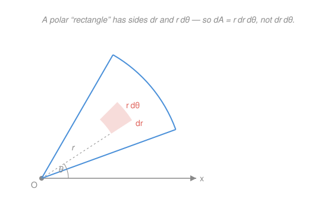

# Calculus Refresher · Lesson 4.3: Multiple integrals

> ⏱ ~15 min · Module 4: Multivariable calculus · Builds on: [2.1 The integral as accumulation, and the FTC](02-01-integral-as-accumulation.md), [4.1 Partial derivatives and the gradient](04-01-partial-derivatives-and-gradient.md) · Unlocks: Module 5 (vector calculus)

## Why this matters

Mass of a plate with varying density, the total charge in a region, the probability that two random variables both land in some zone, the volume under a surface — all of these are "add up a density over a 2D or 3D region." A single integral (2.1) slices a region into strips and sums; a multiple integral does the same move **twice** (or three times), once per dimension. The one genuinely new skill is bookkeeping: describing a curved region with limits, and choosing a coordinate system in which the region and the integrand both become simple. Get that right and Module 5's flux and circulation integrals are just this with a vector field riding along.

## The idea

Go back to 2.1's picture: to integrate $f(x)$ over $[a,b]$ you chop the interval into slivers, weigh each by $f$, and add. To integrate $f(x,y)$ over a flat region $D$, chop $D$ into tiny tiles of area $dA$, weigh each by $f(x,y)$, and add — the answer is the signed volume trapped between the surface $z=f(x,y)$ and the floor.

The trick that makes it computable is **do one dimension at a time**. Freeze $x$ and integrate along the vertical line of $D$ above it — that gives you the area of one thin slice as a function of $x$. Then integrate those slice-areas over $x$. Two ordinary single integrals, nested. That's an **iterated integral**, and Fubini's theorem is the promise that the nesting order doesn't change the answer (for the well-behaved integrands you'll meet).

The only place it gets subtle: when $D$ isn't a rectangle, the inner integral's limits **depend on the outer variable** — the vertical slice through $D$ starts and ends at whatever curves bound $D$ at that $x$. And sometimes the region is a disk or a wedge, where $x$–$y$ strips are ugly but polar slices are trivial. Switching coordinates is the second half of the lesson.

## The formal version

**Iterated integral (Fubini).** For a region $D = \{\,a \le x \le b,\ g_1(x) \le y \le g_2(x)\,\}$,

$$\iint_D f(x,y)\,dA = \int_a^b \left( \int_{g_1(x)}^{g_2(x)} f(x,y)\,dy \right) dx.$$

In words: integrate the **inner** variable ($y$) first, treating $x$ as a constant, between the curves that bound $D$; that produces a function of $x$ alone, which you then integrate over $x$. The inner limits are functions; the outer limits are numbers. Describing $D$ the other way ($c \le y \le d$, $h_1(y) \le x \le h_2(y)$) gives the reversed order $\int_c^d \int_{h_1}^{h_2} \,dx\,dy$ — Fubini says both yield the same total.

**Change of variables (the Jacobian).** If $x = x(u,v),\ y = y(u,v)$ maps a region cleanly onto $D$, then

$$dA = \left| \frac{\partial(x,y)}{\partial(u,v)} \right| du\,dv, \qquad \frac{\partial(x,y)}{\partial(u,v)} = \det\begin{pmatrix} \partial x/\partial u & \partial x/\partial v \\ \partial y/\partial u & \partial y/\partial v \end{pmatrix}.$$

In words: a coordinate change stretches area, and the Jacobian determinant is exactly the local area-stretch factor — the multivariable heir of the $\frac{dx}{du}$ in [2.2's $u$-substitution](02-02-integration-techniques.md). (There it was one derivative; here it's a determinant of partials, because area in 2D is set by how a little square gets sheared.)

**Polar coordinates.** With $x = r\cos\theta,\ y = r\sin\theta$, the Jacobian is

$$\frac{\partial(x,y)}{\partial(r,\theta)} = \det\begin{pmatrix} \cos\theta & -r\sin\theta \\ \sin\theta & \ \ r\cos\theta \end{pmatrix} = r(\cos^2\theta + \sin^2\theta) = r, \qquad \boxed{dA = r\,dr\,d\theta}.$$

In words: the extra $r$ isn't a rule to memorize — it's geometry. A little polar tile spans $dr$ radially and swings through angle $d\theta$; the arc it sweeps has length $r\,d\theta$ (bigger radius, longer arc). Sides $dr$ by $r\,d\theta$ give area $r\,dr\,d\theta$. Forgetting the $r$ is the single most common polar mistake.

**In 3D**, the same logic gives **cylindrical** $dV = r\,dr\,d\theta\,dz$ (polar in the plane, $z$ untouched) and **spherical** $dV = \rho^2\sin\phi\,d\rho\,d\phi\,d\theta$ (here $\rho$ is distance from the origin, $\phi$ the angle down from the $z$-axis, $\theta$ the angle around it) — each factor again the Jacobian measuring how that coordinate box stretches into real volume.

## Picture

## Worked examples

**Example 1 (mechanical — a non-rectangular region, both orders).** Evaluate $\displaystyle\iint_D x\,dA$ where $D$ is the triangle with vertices $(0,0),(1,0),(1,1)$ — i.e. $0 \le y \le x$, $0 \le x \le 1$.

*Vertical strips (integrate $y$ first).* At a fixed $x$, the strip runs from $y=0$ up to the line $y=x$:

$$\int_0^1 \int_0^x x\,dy\,dx = \int_0^1 x\big[y\big]_0^x\,dx = \int_0^1 x^2\,dx = \tfrac{1}{3}.$$

*Horizontal strips (integrate $x$ first), as a Fubini check.* Now describe $D$ as $0 \le y \le 1$, $y \le x \le 1$:

$$\int_0^1 \int_y^1 x\,dx\,dy = \int_0^1 \left[\tfrac{x^2}{2}\right]_y^1 dy = \int_0^1 \left(\tfrac{1}{2} - \tfrac{y^2}{2}\right) dy = \tfrac{1}{2} - \tfrac{1}{6} = \tfrac{1}{3}.\ \checkmark$$

Same answer, as promised — the two orders are just two ways to sweep the same tiles.

**Example 2 (why you'd care — polar cracks the Gaussian).** The integral $\displaystyle I = \int_{-\infty}^{\infty} e^{-x^2}\,dx$ has **no elementary antiderivative** (2.2's checklist comes up empty), yet it's the backbone of the normal distribution and must have a value. The move: compute $I^2$ as a double integral and switch to polar.

$$I^2 = \left(\int_{-\infty}^\infty e^{-x^2}dx\right)\!\left(\int_{-\infty}^\infty e^{-y^2}dy\right) = \iint_{\mathbb{R}^2} e^{-(x^2+y^2)}\,dA.$$

Over the whole plane, polar is native: $x^2+y^2 = r^2$, the region is $0 \le r < \infty$, $0 \le \theta \le 2\pi$, and $dA = r\,dr\,d\theta$. That stray $r$ is exactly the factor that makes the radial integral a [2.2 substitution](02-02-integration-techniques.md) ($u = r^2$):

$$I^2 = \int_0^{2\pi}\!\!\int_0^\infty e^{-r^2}\,r\,dr\,d\theta = \int_0^{2\pi} \left[-\tfrac{1}{2}e^{-r^2}\right]_0^\infty d\theta = \int_0^{2\pi} \tfrac{1}{2}\,d\theta = \pi.$$

So $I = \sqrt{\pi}$. In Cartesian coordinates this integral is hopeless; the Jacobian's $r$ hands you the antiderivative for free. That's the whole reason to switch coordinates.

## Watch out

- You might think the inner limits can be numbers. For a non-rectangular region the **inner** limits must be functions of the outer variable (and the **outer** limits must be pure constants). An answer with the outer variable still in it means you nested the limits backwards.
- You might think $dA = dr\,d\theta$ in polar. It's $r\,dr\,d\theta$ — the Jacobian is not optional. The same trap in 3D: spherical carries $\rho^2\sin\phi$, not $1$.
- You might think swapping the order is cosmetic. It's often the whole game: $\int_0^1\int_x^1 e^{-y^2}\,dy\,dx$ is impossible inner-first (no antiderivative for $e^{-y^2}$) but trivial after you redraw the region and flip (P3). When an inner integral stalls, redraw $D$ and reverse before reaching for anything fancier.

## One-liner

> A multiple integral is 2.1's slicing done once per dimension; pick the order or the coordinate system that makes the region and the integrand simple — and in polar the area element carries a Jacobian factor $r$ because a polar tile's arc side is $r\,d\theta$.

## Problems

**P1 (🟢)** Evaluate $\displaystyle\iint_D (x + 2y)\,dA$ where $D$ is the triangle bounded by $y=0$, $y=x$, and $x=2$.

**P2 (🟡)** Evaluate $\displaystyle\iint_D e^{-(x^2+y^2)}\,dA$ where $D$ is the disk $x^2+y^2 \le R^2$. Then take $R \to \infty$ and confirm it reproduces Example 2's $I^2 = \pi$.

**P3 (🔴, optional)** The integral $\displaystyle\int_0^1 \int_x^1 e^{-y^2}\,dy\,dx$ cannot be done in the order written. Reverse the order of integration and evaluate it.

Solutions

**P1** The triangle has vertices $(0,0),(2,0),(2,2)$; as vertical strips, $0 \le x \le 2$ and $0 \le y \le x$:

$$\int_0^2 \int_0^x (x+2y)\,dy\,dx = \int_0^2 \Big[xy + y^2\Big]_0^x dx = \int_0^2 (x^2 + x^2)\,dx = \int_0^2 2x^2\,dx = \frac{2 \cdot 2^3}{3} = \frac{16}{3}.$$

Verify by reversing the order ($0 \le y \le 2$, $y \le x \le 2$):
$$\int_0^2\!\!\int_y^2 (x+2y)\,dx\,dy = \int_0^2\left[\tfrac{x^2}{2} + 2yx\right]_y^2 dy = \int_0^2\!\left(2 + 4y - \tfrac{5}{2}y^2\right)dy = \Big[2y + 2y^2 - \tfrac{5}{6}y^3\Big]_0^2 = 4 + 8 - \tfrac{40}{6} = \tfrac{16}{3}.\ \checkmark$$

**P2** Polar: the disk is $0 \le r \le R$, $0 \le \theta \le 2\pi$, and $dA = r\,dr\,d\theta$. With $u = r^2$ ($du = 2r\,dr$):

$$\iint_D e^{-(x^2+y^2)}\,dA = \int_0^{2\pi}\!\!\int_0^R e^{-r^2}\,r\,dr\,d\theta = \int_0^{2\pi}\left[-\tfrac{1}{2}e^{-r^2}\right]_0^R d\theta = 2\pi \cdot \tfrac{1}{2}\big(1 - e^{-R^2}\big) = \pi\big(1 - e^{-R^2}\big).$$

Sanity check the extremes: at $R=0$ the disk is a point and the value is $0$ ✓; as $R \to \infty$, $e^{-R^2} \to 0$, so the integral $\to \pi$ — exactly $I^2$ from Example 2, confirming $I = \int_{-\infty}^\infty e^{-x^2}dx = \sqrt{\pi}$. ✓ (The finite disk is the honest version; letting the fence run to infinity is the [improper-integral limit of 2.3](02-03-improper-integrals-and-models.md) in two dimensions.)

**P3** The region is $0 \le x \le 1$, $x \le y \le 1$ — i.e. the triangle $\{0 \le x \le y \le 1\}$. Redescribe it with $y$ outer: $0 \le y \le 1$ and $0 \le x \le y$. Now the inner variable is $x$, and $e^{-y^2}$ is constant in $x$:

$$\int_0^1\!\!\int_0^y e^{-y^2}\,dx\,dy = \int_0^1 e^{-y^2}\big[x\big]_0^y\,dy = \int_0^1 y\,e^{-y^2}\,dy.$$

The reversal *manufactured* a factor $y$ — the length of the horizontal strip — which is precisely the derivative-of-the-inner-block that a [2.2 substitution](02-02-integration-techniques.md) needs. With $u = y^2$:

$$\int_0^1 y\,e^{-y^2}\,dy = \left[-\tfrac{1}{2}e^{-y^2}\right]_0^1 = \tfrac{1}{2}\big(1 - e^{-1}\big) \approx 0.316.$$

Verify the region is unchanged: both descriptions are the set of points with $0 \le x \le y \le 1$ — the triangle with vertices $(0,0),(0,1),(1,1)$ — so Fubini guarantees the two orders agree; only one of them is computable. $\checkmark$

## Flashback

**From Lesson 2.2 (Techniques that matter):** Evaluate $\displaystyle\int x\,\sqrt{x^2+1}\,dx$ — name the technique first, then execute.

Solution

The checklist's substitution question fires: the inner block $x^2+1$ has derivative $2x$, and an $x$ is sitting right there as a factor (off only by the constant $2$). **Substitution**, $u = x^2 + 1$, $du = 2x\,dx$, so $x\,dx = \tfrac{1}{2}\,du$:

$$\int x\sqrt{x^2+1}\,dx = \tfrac{1}{2}\int u^{1/2}\,du = \tfrac{1}{2}\cdot\tfrac{2}{3}u^{3/2} + C = \tfrac{1}{3}(x^2+1)^{3/2} + C.$$

Check: $\frac{d}{dx}\left[\tfrac{1}{3}(x^2+1)^{3/2}\right] = \tfrac{1}{3}\cdot\tfrac{3}{2}(x^2+1)^{1/2}\cdot 2x = x\sqrt{x^2+1}$. ✓ (This "spot the inner derivative" reflex is exactly what generalizes into the Jacobian: substitution is a change of variables, and in higher dimensions the constant $\tfrac{1}{2}$ becomes a determinant of partials.)

## Connections

- **Backward:** the whole subject is [2.1](02-01-integral-as-accumulation.md)'s slice-and-sum performed once per dimension, and the change-of-variables Jacobian is [2.2](02-02-integration-techniques.md)'s $u$-substitution grown a determinant. The partial derivatives filling that determinant are [4.1](04-01-partial-derivatives-and-gradient.md).
- **Forward:** Module 5's line and surface integrals, flux, and the Green/Stokes/divergence theorems are multiple integrals with a vector field integrated over the region — this lesson is the integration machinery those theorems run on.
- **Sideways (probability):** Example 2 and P2 compute the normalizing constant of the Gaussian; a joint density $f(x,y)$ integrates over a region to give $P((X,Y)\in D)$, and marginals are inner integrals — `prob-stat-refresher` is multiple integration wearing a probability hat.
- **Sideways (physics):** center of mass, moment of inertia, and total charge/field are all $\iint$ or $\iiint$ of a density; spherical coordinates are how every central-force and electrostatics volume gets integrated in `mechanics-refresher`.
