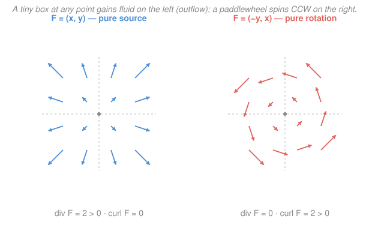

# Calculus Refresher · Lesson 5.1: Vector fields, div, and curl

> ⏱ ~15 min · Module 5: Vector calculus · Builds on: [4.1 Partial derivatives and the gradient](04-01-partial-derivatives-and-gradient.md) · Unlocks: 5.2 (line integrals and flux)

## Why this matters

Every flowing thing in physics is a vector field: fluid velocity, the electric and magnetic fields, heat flux, gravity. Two numbers extracted from such a field run all of classical field theory — **divergence** (are there sources here?) and **curl** (is there rotation here?). Gauss's law is a statement about divergence; Faraday's and Ampère's laws are statements about curl. Before you can compute with them you need to *see* them: glance at a field of arrows and call the sign of div and curl by eye. That is the entire skill of this lesson.

## The idea

A **vector field** $\mathbf F$ pins an arrow to every point of the plane (or of space): at $(x,y)$ it hands you a vector $\mathbf F(x,y)$. Picture wind on a weather map, or the current in a river.

Drop two tiny instruments into that flow:

- A **tiny box.** Watch whether more fluid streams *out* of it than *in*. Net outflow means a source is hiding inside; net inflow means a sink. That imbalance, per unit area, is the **divergence**. Positive = source, negative = sink, zero = whatever flows in flows right back out.
- A **tiny paddlewheel.** Does the flow spin it? A river that's faster on one side than the other will turn a paddlewheel even while every streamline runs dead straight. That spin rate is the **curl**. Positive = counterclockwise, negative = clockwise, zero = no net twist.

Crucially these are *local* and *independent*. A flow can gush outward without spinning (a source), spin without gushing (a whirlpool), do both, or do neither. Your job is to read each sign separately.

## The formal version

A planar field is $\mathbf F(x,y) = \big(P(x,y),\, Q(x,y)\big)$ — $P$ is the horizontal component, $Q$ the vertical. In space, $\mathbf F=(P,Q,R)$. Recall the **del operator** from [4.1](04-01-partial-derivatives-and-gradient.md), $\nabla = \left(\partial_x,\, \partial_y,\, \partial_z\right)$, which turned a scalar $f$ into the gradient $\nabla f$. Feed it a *vector* field two new ways.

**Divergence** (dot the operator into the field):

$$\operatorname{div}\mathbf F = \nabla\cdot\mathbf F = P_x + Q_y \;(+\,R_z).$$

In words: each component is differentiated along *its own* axis, then summed — the net outflow density at the point. Notice it returns a single number (a scalar).

**Curl** (cross the operator into the field). In 2D it collapses to one number, the amount your paddlewheel spins:

$$\operatorname{curl}\mathbf F = \nabla\times\mathbf F = Q_x - P_y \quad(\text{2D scalar}).$$

In words: how fast the vertical component grows as you walk right, minus how fast the horizontal component grows as you walk up — a mismatch that tips the paddlewheel. In 3D curl is itself a vector, the determinant

$$\nabla\times\mathbf F = \big(R_y - Q_z,\; P_z - R_x,\; Q_x - P_y\big),$$

whose $z$-component is exactly the 2D formula (the planar spin points out of the plane).

**Two identities you will lean on constantly:**

$$\operatorname{curl}(\nabla f) = \mathbf 0, \qquad \operatorname{div}(\operatorname{curl}\mathbf F) = 0.$$

In words: a gradient field never spins, and a curl field never sources. Both are just the statement that mixed partials commute ($f_{xy}=f_{yx}$) — write either out and watch the terms cancel in pairs. The first gives a free test: **if $\operatorname{curl}\mathbf F \neq 0$, then $\mathbf F$ cannot be any $\nabla f$.**

## Picture

## Worked examples

**Example 1 (mechanical — spin without curved streamlines).** Take the horizontal shear $\mathbf F = (y,\, 0)$: every arrow points right, longer the higher you are. So $P=y,\ Q=0$.

$$\operatorname{div}\mathbf F = P_x + Q_y = 0 + 0 = 0, \qquad \operatorname{curl}\mathbf F = Q_x - P_y = 0 - 1 = -1.$$

Zero divergence (nothing is created), but curl $-1$: a paddlewheel spins **clockwise**, because the faster flow up top shoves its top harder than the slower flow below shoves its bottom. Straight streamlines, real rotation — curl sees the *shear*, not the curve of the path.

**Example 2 (why you'd care — an ideal fluid at a corner).** A fluid rounding a corner near a stagnation point has velocity $\mathbf F = (x,\, -y)$. Then $P=x,\ Q=-y$, so

$$\operatorname{div}\mathbf F = P_x + Q_y = 1 + (-1) = 0, \qquad \operatorname{curl}\mathbf F = Q_x - P_y = 0 - 0 = 0.$$

Both zero. Divergence-free means **incompressible** — no fluid is manufactured, so what pours in one face of any box pours out another (water, not steam). Curl-free means **irrotational** — no eddies. A flow that is both is the idealized "potential flow" of aerodynamics, and by the identity above being curl-free lets it be written as $\mathbf F = \nabla\phi$ for a velocity potential $\phi$ — the same $\nabla$ machine from [4.1](04-01-partial-derivatives-and-gradient.md), now running the fluid.

## Watch out

- You might think divergence is "$P_x + Q_x$" — differentiate everything by $x$. **No:** each component is differentiated along its *matching* axis, $P_x + Q_y$. Curl is the crossed pair, $Q_x - P_y$. Mixing them up is the single most common error here.
- You might think a field needs visibly *looping* arrows to have curl. Example 1's dead-straight shear has curl $-1$. Curl measures the paddlewheel's spin from differential speed, not whether streamlines bend.
- You might think curl is always a number. In 2D it is (the out-of-plane component), but in 3D it's a full vector. Don't hand a 3D field back a scalar, and don't forget a planar field's curl secretly points along $\hat{\mathbf z}$.

## One-liner

> Divergence $P_x+Q_y$ asks whether a tiny box gains fluid; curl $Q_x-P_y$ asks whether a tiny paddlewheel spins — two independent signs you read straight off the arrows.

## Problems

**P1 (🟢)** For $\mathbf F = (x^2 y,\; x y^2)$, compute $\operatorname{div}\mathbf F$ and $\operatorname{curl}\mathbf F$. At the point $(1,-1)$, is it locally a source or a sink?

**P2 (🟡)** Could $\mathbf F = (2xy,\; x^2 + 3y^2)$ be the gradient $\nabla f$ of some scalar function? Apply the curl test; if it passes, find such an $f$.

**P3 (🔴, optional — E&M bridge)** The electric field of a point charge at the origin is the inverse-square radial field $\mathbf F = \dfrac{(x,y,z)}{(x^2+y^2+z^2)^{3/2}}$. Show $\operatorname{div}\mathbf F = 0$ everywhere except the origin. (This is the calculus behind "field lines only begin or end on charges" — and the loophole at the origin is exactly the enclosed charge in Gauss's law.)

Solutions

**P1** Here $P = x^2 y$ and $Q = x y^2$.

$$\operatorname{div}\mathbf F = P_x + Q_y = 2xy + 2xy = 4xy, \qquad \operatorname{curl}\mathbf F = Q_x - P_y = y^2 - x^2.$$

At $(1,-1)$: $\operatorname{div} = 4(1)(-1) = -4 < 0$, so the flow is locally a **sink** (net inflow). (Curl there is $(-1)^2-1^2 = 0$: no spin at that point.)

*Verification:* $P_x = \frac{\partial}{\partial x}(x^2y) = 2xy$ and $Q_y = \frac{\partial}{\partial y}(xy^2) = 2xy$ ✓; $Q_x = \frac{\partial}{\partial x}(xy^2) = y^2$ and $P_y = \frac{\partial}{\partial y}(x^2y) = x^2$, giving $Q_x - P_y = y^2 - x^2$ ✓.

**P2** Curl test first: $P = 2xy,\ Q = x^2 + 3y^2$, so

$$\operatorname{curl}\mathbf F = Q_x - P_y = 2x - 2x = 0.$$

It passes, so a potential $f$ can exist. Reconstruct it. From $f_x = 2xy$, integrate in $x$: $f = x^2 y + g(y)$, with $g$ an unknown function of $y$ alone. Differentiate in $y$ and match $Q$:

$$f_y = x^2 + g'(y) \stackrel{!}{=} x^2 + 3y^2 \;\Rightarrow\; g'(y) = 3y^2 \;\Rightarrow\; g(y) = y^3.$$

So $f = x^2 y + y^3$ (plus any constant).

*Verification:* $\nabla f = (f_x, f_y) = (2xy,\; x^2 + 3y^2) = \mathbf F$ ✓. (The curl test was guaranteed to pass by $\operatorname{curl}(\nabla f)=\mathbf 0$ — that identity is exactly what makes it a valid screen.)

**P3** Let $r = (x^2+y^2+z^2)^{1/2}$, so $\mathbf F = (x r^{-3},\, y r^{-3},\, z r^{-3})$ and $P = x r^{-3}$. Using $\dfrac{\partial r}{\partial x} = \dfrac{x}{r}$ and the product rule,

$$P_x = r^{-3} + x\cdot(-3)r^{-4}\cdot\frac{x}{r} = r^{-3} - 3x^2 r^{-5}.$$

By symmetry $Q_y = r^{-3} - 3y^2 r^{-5}$ and $R_z = r^{-3} - 3z^2 r^{-5}$. Add:

$$\operatorname{div}\mathbf F = 3r^{-3} - 3(x^2+y^2+z^2)\,r^{-5} = 3r^{-3} - 3r^{2}\,r^{-5} = 3r^{-3} - 3r^{-3} = 0.$$

Valid for every $r \neq 0$; at the origin $\mathbf F$ isn't even defined (it blows up), which is where the source secretly lives.

*Verification:* the three second terms sum to $-3(x^2+y^2+z^2)r^{-5} = -3r^{-3}$, exactly cancelling the three $r^{-3}$ first terms — the inverse-square power $p=3/2$ in the exponent is precisely what makes the cancellation land at zero. ✓

## Flashback

**From Lesson 4.1 (Partial derivatives and the gradient):** For $f(x,y) = x^2 y - y^2$ at the point $P=(2,1)$: (a) give the direction of steepest ascent and the rate of climb in that direction; (b) find the directional derivative in the direction of the vector $(1,2)$.

Solution

The gradient is $\nabla f = (f_x, f_y) = (2xy,\; x^2 - 2y)$. At $(2,1)$: $\nabla f = (2\cdot2\cdot1,\; 4 - 2) = (4, 2)$.

(a) Steepest ascent points along the gradient itself, $(4,2)$, at rate $|\nabla f| = \sqrt{4^2 + 2^2} = \sqrt{20} = 2\sqrt5 \approx 4.47$.

(b) Normalize the direction: $\mathbf u = \dfrac{(1,2)}{\sqrt5}$. Then

$$D_{\mathbf u}f = \nabla f \cdot \mathbf u = \frac{(4)(1) + (2)(2)}{\sqrt5} = \frac{8}{\sqrt5} = \frac{8\sqrt5}{5} \approx 3.58.$$

*Verification:* the directional derivative $3.58$ is below the maximal rate $4.47$, as it must be — no direction can beat the gradient's own. ✓ (And $\nabla$ is the very operator we just dotted and crossed into fields above.)

## Connections

- **Backward:** div and curl are both the [4.1](04-01-partial-derivatives-and-gradient.md) operator $\nabla$ turned loose on a vector instead of a scalar — dot product gives div, cross product gives curl. The identity $\operatorname{curl}(\nabla f)=\mathbf 0$ ties the two lessons together directly.
- **Forward:** [5.2](05-02-line-integrals-and-flux.md) makes these local numbers *global* — flux integrates divergence's outflow over a region's boundary, circulation integrates curl's spin around a loop. [5.3](05-03-green-stokes-divergence.md)'s big three theorems then equate the two, boundary ↔ interior.
- **Sideways (physics):** $\operatorname{div}\mathbf E = \rho/\varepsilon_0$ (Gauss) and $\operatorname{curl}\mathbf B = \mu_0\mathbf J + \dots$ (Ampère) are two of Maxwell's four equations; P3 is Gauss's law for a point charge in disguise. In fluid dynamics, divergence-free means incompressible and curl-free means irrotational — Example 2's potential flow.
