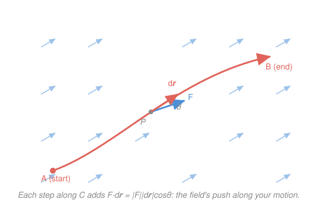

# Calculus Refresher · Lesson 5.2: Line integrals and flux

> ⏱ ~15 min · Module 5: Vector calculus · Builds on: [5.1 Vector fields, div, and curl](05-01-vector-fields-div-curl.md), [2.1 The integral as accumulation, and the FTC](02-01-integral-as-accumulation.md) · Unlocks: 5.3 (Green, Stokes, divergence theorems)

## Why this matters

The two questions you ask about any field are *how much work does it do as I move through it* and *how much of it passes through a surface*. Work done by a force along a path, circulation of a fluid around a loop, the flow rate of water through a net, electric flux through a closed surface (Gauss's law) — all of them are one of two integrals over a field. And the payoff mirrors [2.1](02-01-integral-as-accumulation.md) exactly: for the special "conservative" fields, a fundamental theorem lets you skip the integral entirely and just subtract a potential at the endpoints. Recognizing when you're in that lucky case is the whole game.

## The idea

Walk a curve $C$ through a vector field $\mathbf F$. At each little step you take a tiny displacement $d\mathbf r$ (a vector tangent to your path). The field pushes with $\mathbf F$; the *work* it does on that step is the part of $\mathbf F$ pointing along your motion, times how far you moved — the dot product $\mathbf F\cdot d\mathbf r$. Add up all the steps and you get the **line integral** $\int_C \mathbf F\cdot d\mathbf r$: total work done by the field along the whole path. Sidewind against the field and steps count negative; ride with it and they count positive.

Now the miracle. Some fields are **gradients**: $\mathbf F=\nabla f$ for a scalar "potential" $f$ (from [5.1](05-01-vector-fields-div-curl.md), these are exactly the ones with zero curl). For those, the field is just "downhill/uphill on the landscape $f$," so the work of any trip is simply the change in altitude — endpoints only, the route in between is irrelevant. That's the odometer/speedometer story from [2.1](02-01-integral-as-accumulation.md) again, promoted from a line to the plane. And a closed loop returns to the same altitude, so a conservative field does **zero** net work around any loop.

Flux is the perpendicular cousin. Instead of the field *along* your path, you measure the field *through* a surface: how much of $\mathbf F$ pierces it, added over the whole surface.

## The formal version

**Line integral of a vector field.** For a curve $C$ traced by $\mathbf r(t)=(x(t),y(t),\dots)$ with $t\in[a,b]$,

$$\int_C \mathbf F\cdot d\mathbf r \;=\; \int_a^b \mathbf F\big(\mathbf r(t)\big)\cdot \mathbf r'(t)\,dt.$$

In words: to compute it, parametrize the path, feed the position into the field, dot with the velocity $\mathbf r'(t)$, and integrate an ordinary one-variable integral. The symbol $d\mathbf r=\mathbf r'(t)\,dt$ is the tangent step. Reversing the direction of travel flips the sign: $\int_{-C}=-\int_C$.

**FTC for line integrals (the shortcut).** If $\mathbf F=\nabla f$ for some scalar field $f$, then for any path $C$ from point $A$ to point $B$,

$$\int_C \nabla f\cdot d\mathbf r \;=\; f(B)-f(A).$$

In words: this is [2.1](02-01-integral-as-accumulation.md)'s FTC Part II — $\int_a^b F'(x)\,dx=F(b)-F(a)$ — with the endpoints now *points in space* instead of numbers on a line, and $\nabla f$ playing the role of the derivative. Two consequences: the integral is **path-independent** (depends only on $A$ and $B$), and around a closed loop ($A=B$) it is **zero**. Such an $\mathbf F$ is called **conservative**.

**The test (from 5.1).** In 2D, $\mathbf F=(P,Q)$ is conservative (on a domain with no holes) exactly when the scalar curl vanishes:

$$\frac{\partial Q}{\partial x}-\frac{\partial P}{\partial y}=0.$$

In words: zero curl is the fingerprint of a gradient. Find the potential by antidifferentiating $P$ in $x$ and $Q$ in $y$ and reconciling.

**Flux.** The flux of $\mathbf F$ through a surface $S$ with unit normal $\mathbf n$ is

$$\iint_S \mathbf F\cdot\mathbf n\,dS \qquad\text{(2D version: }\oint_C \mathbf F\cdot\mathbf n\,ds\text{ through a curve).}$$

In words: at each patch, keep only the component of $\mathbf F$ piercing straight through ($\mathbf F\cdot\mathbf n$), and add over the surface. Choosing the *other* normal flips the sign, so an orientation must be fixed first.

## Picture

## Worked examples

**Example 1 (mechanical — parametrize and integrate).** Compute $\int_C \mathbf F\cdot d\mathbf r$ for $\mathbf F(x,y)=(xy,\;y^2)$ along the parabola $y=x^2$ from $(0,0)$ to $(1,1)$.

Parametrize $\mathbf r(t)=(t,\;t^2)$, $t\in[0,1]$, so $\mathbf r'(t)=(1,\;2t)$. Evaluate the field on the path: $\mathbf F(\mathbf r(t))=(t\cdot t^2,\;(t^2)^2)=(t^3,\;t^4)$. Dot with $\mathbf r'$:

$$\mathbf F\cdot\mathbf r' = t^3\cdot 1 + t^4\cdot 2t = t^3 + 2t^5.$$

$$\int_C \mathbf F\cdot d\mathbf r=\int_0^1 (t^3+2t^5)\,dt=\frac14+\frac13=\frac{7}{12}.$$

That is the entire mechanical recipe: position → field → dot with velocity → ordinary integral.

**Example 2 (why you'd care — the conservative shortcut).** A restoring force $\mathbf F(x,y)=(-x,\;-y)$ pulls everything toward the origin. Its scalar curl is $\frac{\partial(-y)}{\partial x}-\frac{\partial(-x)}{\partial y}=0-0=0$, so it's conservative. A potential $f$ needs $\nabla f=(-x,-y)$: take $f=-\tfrac12(x^2+y^2)$ (check: $f_x=-x$, $f_y=-y$ ✓). The work moving from $A=(3,0)$ to $B=(0,0)$, along *any* path, is

$$\int_C \mathbf F\cdot d\mathbf r=f(B)-f(A)=0-\left(-\tfrac{9}{2}\right)=\frac{9}{2}.$$

No parametrization, no integral — just subtract. And around any closed loop the work is $f(\text{start})-f(\text{start})=0$: the hallmark of a conservative force, and exactly why potential energy is well-defined in physics.

## Watch out

- You might think work always depends only on the endpoints. **Only for conservative fields.** For a general $\mathbf F$ (like Example 1's), a different path between the same two points gives a different answer — the whole route matters, so you must actually parametrize and integrate.
- You might think "zero curl" guarantees path-independence, full stop. It does *on a domain with no holes*. The classic trap is $\mathbf F=\left(\frac{-y}{x^2+y^2},\frac{x}{x^2+y^2}\right)$: its curl is $0$ everywhere it's defined, yet its integral around a loop enclosing the origin is $2\pi$, not $0$ — the puncture at the origin breaks the guarantee.
- You might forget to fix an orientation for flux. $\mathbf F\cdot\mathbf n$ and $\mathbf F\cdot(-\mathbf n)$ differ by a sign, so "the flux" is meaningless until you say *which way* $\mathbf n$ points (outward, upward, …). State the normal before you integrate.

## One-liner

> A line integral sums $\mathbf F\cdot d\mathbf r$, the field's push along each step; when $\mathbf F=\nabla f$ it collapses to $f(\text{end})-f(\text{start})$, so a conservative field does zero work around any loop.

## Problems

**P1 (🟢)** Compute $\displaystyle\int_C \mathbf F\cdot d\mathbf r$ for the rotation field $\mathbf F(x,y)=(-y,\;x)$ along the quarter of the unit circle from $(1,0)$ to $(0,1)$.

**P2 (🟡)** Let $\mathbf F(x,y)=(2xy+3,\;x^2+4y)$.
(a) Show $\mathbf F$ is conservative and find a potential $f$.
(b) Use the FTC shortcut to find the work from $(0,0)$ to $(1,2)$.
(c) Confirm by direct parametrization along the straight segment, and note which method you'd rather repeat.

**P3 (🔴, optional — physics)** A fluid flows with velocity field $\mathbf F(x,y,z)=(x,y,z)$ (an outward "source"). Find the **flux** $\iint_S \mathbf F\cdot\mathbf n\,dS$ through the unit sphere $S$ ($x^2+y^2+z^2=1$) with outward normal — the net rate at which fluid crosses the sphere.

Solutions

**P1** Parametrize $\mathbf r(t)=(\cos t,\;\sin t)$, $t\in[0,\tfrac{\pi}{2}]$ (this runs from $(1,0)$ to $(0,1)$). Then $\mathbf r'(t)=(-\sin t,\;\cos t)$ and $\mathbf F(\mathbf r(t))=(-\sin t,\;\cos t)$. The dot product is

$$\mathbf F\cdot\mathbf r' = (-\sin t)(-\sin t)+(\cos t)(\cos t)=\sin^2 t+\cos^2 t=1.$$

$$\int_C \mathbf F\cdot d\mathbf r=\int_0^{\pi/2} 1\,dt=\frac{\pi}{2}.$$

**Verify:** the integrand is identically $1$ (the field is everywhere tangent to the circle, pushing exactly along the motion), so the answer is just the length of the $t$-interval, $\tfrac{\pi}{2}$. ✓ *(This field is not a gradient — its scalar curl is $\tfrac{\partial x}{\partial x}-\tfrac{\partial(-y)}{\partial y}=1-(-1)=2\neq 0$ — so a full loop gives nonzero circulation $2\pi$, not $0$.)*

**P2** (a) Test: $\frac{\partial}{\partial x}(x^2+4y)-\frac{\partial}{\partial y}(2xy+3)=2x-2x=0$, so $\mathbf F$ is conservative. Build $f$: from $f_x=2xy+3$, integrate in $x$ to get $f=x^2y+3x+g(y)$. Then $f_y=x^2+g'(y)$ must equal $x^2+4y$, so $g'(y)=4y$, $g(y)=2y^2$. Thus

$$f(x,y)=x^2y+3x+2y^2.$$

(b) $\displaystyle\int_C\mathbf F\cdot d\mathbf r=f(1,2)-f(0,0)=(1\cdot2+3\cdot1+2\cdot4)-0=2+3+8=13.$

(c) Direct: segment $\mathbf r(t)=(t,2t)$, $t\in[0,1]$, $\mathbf r'=(1,2)$. Field on path: $\mathbf F=(2t\cdot2t+3,\;t^2+4\cdot2t)=(4t^2+3,\;t^2+8t)$. Dot: $(4t^2+3)+2(t^2+8t)=6t^2+16t+3$. Then

$$\int_0^1 (6t^2+16t+3)\,dt=\big[2t^3+8t^2+3t\big]_0^1=2+8+3=13.$$

**Verify:** both routes give $13$ ✓, and $\nabla f=(2xy+3,\;x^2+4y)=\mathbf F$ ✓. The shortcut was two evaluations; the direct method needed a parametrization, an expansion, and an antiderivative — you'd rather subtract a potential.

**P3** On the *unit* sphere the outward unit normal at a point $(x,y,z)$ is the position vector itself: $\mathbf n=(x,y,z)$ (it has length $\sqrt{x^2+y^2+z^2}=1$ on $S$). So

$$\mathbf F\cdot\mathbf n=(x,y,z)\cdot(x,y,z)=x^2+y^2+z^2=1\quad\text{everywhere on }S.$$

The integrand is constant $1$, so the flux is just the surface area of the unit sphere:

$$\iint_S \mathbf F\cdot\mathbf n\,dS=\iint_S 1\,dS=4\pi.$$

**Verify (divergence theorem preview, 5.3):** $\operatorname{div}\mathbf F=\frac{\partial x}{\partial x}+\frac{\partial y}{\partial y}+\frac{\partial z}{\partial z}=3$, and the enclosed volume is $\tfrac43\pi$, so $\iiint_V 3\,dV=3\cdot\tfrac43\pi=4\pi$. ✓ This is exactly the Gauss's-law calculation behind boss problem 5.

## Flashback

**From Lesson 5.1 (Vector fields, div, and curl):** For $\mathbf F(x,y,z)=(yz,\;xz,\;xy)$, compute $\operatorname{div}\mathbf F$ and $\operatorname{curl}\mathbf F$, and decide whether $\mathbf F$ is conservative.

Solution

Divergence: $\operatorname{div}\mathbf F=\frac{\partial(yz)}{\partial x}+\frac{\partial(xz)}{\partial y}+\frac{\partial(xy)}{\partial z}=0+0+0=0$.

Curl, component by component:

$$\operatorname{curl}\mathbf F=\left(\frac{\partial(xy)}{\partial y}-\frac{\partial(xz)}{\partial z},\;\;\frac{\partial(yz)}{\partial z}-\frac{\partial(xy)}{\partial x},\;\;\frac{\partial(xz)}{\partial x}-\frac{\partial(yz)}{\partial y}\right)=(x-x,\;y-y,\;z-z)=(0,0,0).$$

Curl is zero, so $\mathbf F$ is conservative. Indeed $f=xyz$ works: $\nabla f=(yz,xz,xy)=\mathbf F$ ✓. (It's also divergence-free — a rarer double property.)

## Connections

- **Backward:** the FTC for line integrals is [2.1](02-01-integral-as-accumulation.md)'s FTC Part II with endpoints promoted from numbers to points; the conservative test is precisely the "curl $=0$" condition from [5.1](05-01-vector-fields-div-curl.md), and finding a potential $f$ is antidifferentiation in two variables.
- **Forward:** [5.3](05-03-green-stokes-divergence.md) unifies both integrals here — Green's/Stokes' theorems convert a loop's line integral into a curl integral over the enclosed region, and the divergence theorem converts a closed-surface flux into a div integral over the enclosed volume (P3 is that theorem in miniature; boss problem 5 is the full verification).
- **Sideways (physics):** work $=\int_C\mathbf F\cdot d\mathbf r$, and a conservative force is one with a potential energy $U$ (where $\mathbf F=-\nabla U$), so path-independence *is* conservation of energy — Example 2 in one line. Flux is Gauss's law for electric and gravitational fields.
