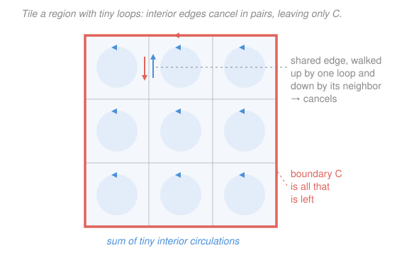

# Calculus Refresher · Lesson 5.3: The big three theorems

> ⏱ ~15 min · Module 5: Vector calculus · Builds on: [5.1 Vector fields, div, and curl](05-01-vector-fields-div-curl.md), [5.2 Line integrals and flux](05-02-line-integrals-and-flux.md) · Unlocks: mechanics, E&M, real-analysis (course complete)

## Why this matters

Green's, Stokes', and the divergence theorem are the machinery behind every conservation law in physics: they are how "what's happening inside a region" gets tied to "what's crossing its boundary." Maxwell's equations, fluid mass conservation, the work-energy theorem — all are one of these three read out loud. And every one of them is a *labor-saving device*: it lets you replace a brutal integral with an easy one by swapping a region for its edge, or an edge for its region, whichever side is simpler. This lesson is the payoff that Modules 2 and 5 were building toward, and it closes the course.

## The idea

You already know the pattern — you've met it twice.

The **Fundamental Theorem of Calculus** ([2.1](02-01-integral-as-accumulation.md)) says $\int_a^b f'(x)\,dx = f(b) - f(a)$: to total up a rate of change across an interval, you only need the values at the two *endpoints*. The interior all telescopes away. The endpoints $\{a, b\}$ are the **boundary** of the interval $[a,b]$.

The **FTC for line integrals** ([5.2](05-02-line-integrals-and-flux.md)) lifts this one dimension: $\int_C \nabla f \cdot d\mathbf r = f(B) - f(A)$. Integrate a gradient along a whole curve $C$, and again only the two endpoints survive. The boundary of a curve is its two ends.

The big three are the *same sentence*, one dimension up each time:

> **The integral of a derivative over a region equals the plain integral over that region's boundary.**

Why does the interior vanish every time? Tile the region with tiny cells. Each cell contributes its own little bit of "derivative" — a tiny circulation, or a tiny outflow. But every interior wall is shared by two neighboring cells, who push on it in *opposite* directions. Those contributions cancel in pairs. The only walls that don't get cancelled are the ones on the outer edge — the boundary. Add up the whole interior and you're left holding just the boundary. That's the entire proof idea, and it's the picture below.

## The formal version

Throughout: $\mathbf F$ is a vector field, $C$ a closed curve, $D$ a flat region, $S$ a surface, $V$ a solid, $\mathbf n$ the outward unit normal. $\oint$ and $\oiint$ mean the curve/surface is *closed*.

**Green's theorem (flat land).** For a field $\mathbf F = (P, Q)$ in the plane with $C$ the counterclockwise boundary of region $D$,

$$\oint_C \mathbf F \cdot d\mathbf r = \iint_D \left( \frac{\partial Q}{\partial x} - \frac{\partial P}{\partial y} \right) dA.$$

In words: the total circulation of $\mathbf F$ around the loop $C$ equals the integral of its (scalar) curl $Q_x - P_y$ over the region the loop encloses. Spin summed inside = swirl measured on the rim.

**Stokes' theorem (Green's, lifted into 3D).** For a surface $S$ in space with boundary curve $C$,

$$\oint_C \mathbf F \cdot d\mathbf r = \iint_S (\nabla \times \mathbf F) \cdot \mathbf n \, dS.$$

In words: the circulation around the rim $C$ equals the flux of the curl $\nabla \times \mathbf F$ through any surface that $C$ bounds. Green's theorem is exactly this when $S$ is a flat patch and $\nabla \times \mathbf F$ points straight up.

**Divergence theorem (Gauss's theorem).** For a solid $V$ with closed boundary surface $S$,

$$\oiint_S \mathbf F \cdot \mathbf n \, dS = \iiint_V (\nabla \cdot \mathbf F)\, dV.$$

In words: the net flux of $\mathbf F$ out through the closed surface equals the integral of its divergence $\nabla \cdot \mathbf F$ over the solid inside. Sources and sinks summed over the volume = what actually leaks out through the skin.

All three fit one template — **boundary integral of $\mathbf F$ = region integral of a derivative of $\mathbf F$**:

| Theorem | Boundary (plain integral) | Region (integral of a derivative) |
|---|---|---|
| FTC (2.1) | $f(b) - f(a)$, the 2 endpoints | $\int_a^b f'\,dx$ |
| Gradient thm (5.2) | $f(B) - f(A)$, curve's 2 ends | $\int_C \nabla f \cdot d\mathbf r$ |
| Green | $\oint_C \mathbf F \cdot d\mathbf r$, the loop | $\iint_D (Q_x - P_y)\,dA$ |
| Stokes | $\oint_C \mathbf F \cdot d\mathbf r$, the rim | $\iint_S (\nabla \times \mathbf F)\cdot\mathbf n\,dS$ |
| Divergence | $\oiint_S \mathbf F \cdot \mathbf n\,dS$, the skin | $\iiint_V (\nabla \cdot \mathbf F)\,dV$ |

## Picture

## Worked examples

**Example 1 (Green's theorem trades a loop for a region).** Compute the circulation of $\mathbf F = (-y,\, x)$ counterclockwise around the unit circle.

*Directly* you'd parametrize and integrate around the curve. *Green's* way: here $P = -y$, $Q = x$, so $Q_x - P_y = 1 - (-1) = 2$. Then

$$\oint_C \mathbf F \cdot d\mathbf r = \iint_D 2\,dA = 2 \cdot (\text{area of unit disk}) = 2\pi.$$

The loop integral collapsed into "twice the area." (This $\mathbf F$ has constant curl $2$ everywhere — it's rigid rotation, the swirl that [5.1](05-01-vector-fields-div-curl.md) measured.)

**Example 2 (area as a boundary integral — Green's theorem run backwards).** Choose $\mathbf F = (-y, x)$ again; since $Q_x - P_y = 2$, Green gives $\oint_C(-y\,dx + x\,dy) = \iint_D 2\,dA = 2\,(\text{Area})$. Solve for area:

$$\text{Area}(D) = \frac{1}{2}\oint_C (x\,dy - y\,dx).$$

This is a *planimeter*: it measures the area of any region using only a trip around its edge. On the ellipse $x = a\cos\theta,\; y = b\sin\theta$: $x\,dy - y\,dx = (a\cos\theta)(b\cos\theta)\,d\theta - (b\sin\theta)(-a\sin\theta)\,d\theta = ab\,d\theta$, so Area $= \frac12\int_0^{2\pi} ab\,d\theta = \pi ab$ — the ellipse-area formula, extracted from its boundary alone.

## Watch out

- **You might think Stokes needs a *specific* surface.** It doesn't — the flux of the curl is the same through *any* surface sharing the rim $C$, because both equal the one circulation $\oint_C \mathbf F\cdot d\mathbf r$. Pick the easiest cap (often a flat disk).
- **You might drop the orientation and lose a sign.** Green's needs $C$ *counterclockwise*; the divergence theorem needs the *outward* normal; Stokes needs $C$ and $\mathbf n$ matched by the right-hand rule. Flip the orientation and the whole answer flips sign.
- **You might apply the divergence theorem across a singularity.** All three assume $\mathbf F$ is smooth *throughout* the region. A field like $\mathbf F = \mathbf r / |\mathbf r|^3$ blows up at the origin — enclose that point and $\oiint \mathbf F\cdot\mathbf n\,dS \ne \iiint (\nabla\cdot\mathbf F)\,dV$ naively, because $\nabla\cdot\mathbf F$ isn't defined there. That "defect" is precisely what makes Gauss's law detect charge (P3).

## One-liner

> Every one of the big three says the same thing the FTC does — the integral of a derivative over a region is a plain integral over its boundary — so use it to trade whichever side is hard for the side that's easy.

## Problems

**P1 (🟢)** Use Green's theorem to compute the circulation $\oint_C \mathbf F \cdot d\mathbf r$ of $\mathbf F = (x^2 - y,\; x + y^2)$ counterclockwise around the unit circle. Then confirm you'd get the same number by noticing which piece of the curl actually contributes.

**P2 (🟡)** Let $\mathbf F = (xy,\, yz,\, zx)$ and let $S$ be the surface of the unit cube $0 \le x,y,z \le 1$. Use the divergence theorem to find the outward flux $\oiint_S \mathbf F \cdot \mathbf n\,dS$ with a single triple integral — then appreciate that the "honest" way would be six separate face integrals.

**P3 (🔴, the boss)** Let $\mathbf F = (x, y, z)$ and let $S$ be the unit sphere.
(a) Compute the outward flux $\oiint_S \mathbf F \cdot \mathbf n\, dS$ **directly**, using the fact that on the unit sphere the outward normal is $\mathbf n = \mathbf r = (x,y,z)$ itself.
(b) Compute the same flux via the **divergence theorem**.
(c) They match. State what **Gauss's law** of electrostatics, $\oiint_S \mathbf E \cdot \mathbf n\,dS = Q_{\text{enc}}/\varepsilon_0$, is saying in this same language.

Solutions

**P1** Here $P = x^2 - y$, $Q = x + y^2$, so $Q_x = 1$ and $P_y = -1$, giving $Q_x - P_y = 2$. Green's theorem:

$$\oint_C \mathbf F \cdot d\mathbf r = \iint_D 2\,dA = 2 \cdot \pi(1)^2 = 2\pi.$$

The confirming observation: the $x^2$ and $y^2$ pieces are gradient (conservative) parts — $x^2 = \partial_x(\tfrac{x^3}{3})$, $y^2 = \partial_y(\tfrac{y^3}{3})$ — so they contribute $0$ to any closed loop. Only the $(-y, x)$ piece, with curl $2$, survives, reproducing Example 1's $2\pi$. **Verification:** parametrize $x=\cos\theta,\,y=\sin\theta$; the closed integral of the conservative parts vanishes and $\oint(-y\,dx + x\,dy) = \int_0^{2\pi}(\sin^2\theta + \cos^2\theta)\,d\theta = 2\pi$. ✓

**P2** Divergence: $\nabla \cdot \mathbf F = \partial_x(xy) + \partial_y(yz) + \partial_z(zx) = y + z + x$. Over the unit cube,

$$\oiint_S \mathbf F \cdot \mathbf n\,dS = \iiint_V (x+y+z)\,dV = 3\iiint_V x\,dV = 3\left(\tfrac12 \cdot 1 \cdot 1\right) = \frac{3}{2},$$

using symmetry ($\iiint x = \iiint y = \iiint z = \tfrac12$ over the unit cube). **Verification (the six faces the theorem saved us from):** on $x=1$, $\mathbf F\cdot\mathbf n = P = y$, flux $\int_0^1\!\int_0^1 y\,dy\,dz = \tfrac12$; on $y=1$, $\mathbf F\cdot\mathbf n = Q = z$, flux $\tfrac12$; on $z=1$, $\mathbf F\cdot\mathbf n = R = x$, flux $\tfrac12$. On each of $x=0,\,y=0,\,z=0$ the relevant component ($xy,\,yz,\,zx$) is $0$, so flux $0$. Total $= \tfrac12+\tfrac12+\tfrac12 = \tfrac32$. ✓ One triple integral beat six double integrals.

**P3** (a) **Direct.** On the unit sphere $\mathbf n = (x,y,z)$, so $\mathbf F \cdot \mathbf n = (x,y,z)\cdot(x,y,z) = x^2 + y^2 + z^2 = 1$ (every point is at radius $1$). Therefore

$$\oiint_S \mathbf F \cdot \mathbf n\,dS = \iint_S 1\,dS = \text{surface area of unit sphere} = 4\pi.$$

(b) **Divergence theorem.** $\nabla \cdot \mathbf F = 1 + 1 + 1 = 3$, so

$$\oiint_S \mathbf F \cdot \mathbf n\,dS = \iiint_V 3\,dV = 3 \cdot \text{vol(unit ball)} = 3 \cdot \tfrac{4}{3}\pi = 4\pi.$$

(c) **Match:** both give $4\pi$. ✓ The divergence theorem says the outflow measured on the skin ($4\pi$) equals the divergence summed over the interior ($3$ per unit volume, times $\tfrac{4}{3}\pi$). **Gauss's law is this exact statement for the electric field:** flux of $\mathbf E$ out of a closed surface = (total charge inside)$/\varepsilon_0$. Because $\nabla \cdot \mathbf E = \rho/\varepsilon_0$ (charge density *is* the divergence of $\mathbf E$), the divergence theorem turns $\oiint_S \mathbf E\cdot\mathbf n\,dS = \iiint_V (\nabla\cdot\mathbf E)\,dV = \iiint_V \rho/\varepsilon_0\,dV = Q_{\text{enc}}/\varepsilon_0$. The flux through *any* surface enclosing a charge counts that charge — geometry-free — which is why Gauss's law cracks symmetric fields in one line. **Verification:** with $\mathbf F = (x,y,z) = \mathbf r$, the field is $\varepsilon_0^{-1}$ times a uniform charge cloud of density $3\varepsilon_0$; enclosed "charge" $= 3\varepsilon_0 \cdot \tfrac43\pi = 4\pi\varepsilon_0$, and $Q_{\text{enc}}/\varepsilon_0 = 4\pi$ — matching the flux. ✓

## Flashback

**From Lesson 5.2 (Line integrals and flux):** The field $\mathbf F = (2xy + y,\; x^2 + x)$ is conservative. Find a potential $f$ with $\nabla f = \mathbf F$, and use the gradient theorem to evaluate $\int_C \mathbf F \cdot d\mathbf r$ along *any* path from $(0,0)$ to $(1,2)$.

Solution

First confirm it's conservative: $P = 2xy + y$, $Q = x^2 + x$, and $P_y = 2x + 1 = Q_x$. ✓ (Same cross-partial test — it's the $Q_x - P_y = 0$ curl condition from Green's.) Build $f$: from $f_x = 2xy + y$, integrate in $x$ to get $f = x^2 y + xy + g(y)$; then $f_y = x^2 + x + g'(y)$ must equal $x^2 + x$, so $g'(y) = 0$ and $f = x^2 y + xy$. The gradient theorem (path-independence) gives

$$\int_C \mathbf F \cdot d\mathbf r = f(1,2) - f(0,0) = (1)(2) + (1)(2) - 0 = 4.$$

**Verification:** $\nabla f = (2xy + y,\; x^2 + x) = \mathbf F$ ✓, and only the endpoints entered — the same "boundary of the curve is its two ends" collapse that Green/Stokes/divergence generalize. ✓

## Connections

- **Backward:** these three *are* the FTC of [2.1](02-01-integral-as-accumulation.md) and the gradient theorem of [5.2](05-02-line-integrals-and-flux.md), one dimension up — same "boundary vs. interior" telescoping, using the div and curl built in [5.1](05-01-vector-fields-div-curl.md). Green's conservative test $Q_x - P_y = 0$ is why the [5.2](05-02-line-integrals-and-flux.md) fields were path-independent.
- **Forward (course complete):** `mechanics-refresher` uses the divergence theorem for mass/energy conservation and the work-energy theorem; `em-refresher` *is* these theorems — all four Maxwell equations are a Gauss's law (divergence) or an Ampère/Faraday law (Stokes). Real analysis rebuilds them rigorously as the generalized Stokes' theorem $\int_{\partial \Omega}\omega = \int_\Omega d\omega$ — the single line this whole table collapses into.
- **Sideways (physics):** P3 is Gauss's law in miniature; the same divergence theorem gives the continuity equation $\partial_t \rho + \nabla\cdot \mathbf J = 0$ (whatever leaves a region must have flowed out through its surface) — conservation of charge, mass, and probability all wear this one uniform.
