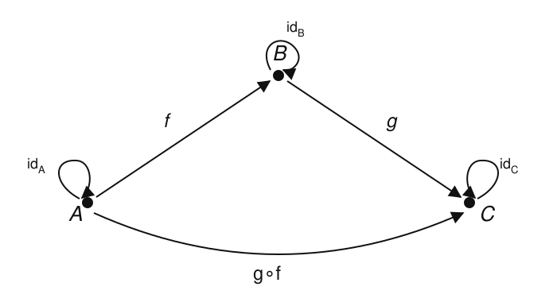

# Category Theory · Lesson 1.1: What Is a Category?

> ⏱ ~15 min · Module 1: Categories, Functors & Natural Transformations · Builds on: nothing (course start) · Unlocks: [Lesson 1.2](01-02-categories-everywhere.md)

## Why this matters

Category theory is the mathematics of *structure-preserving maps*, and it starts by taking the one thing every corner of math already has in common — you can compose two maps to get a third — and making *that* the primitive object of study. A group homomorphism followed by a group homomorphism is a group homomorphism; a continuous map after a continuous map is continuous; a database query piped into another query is a query. The moment you name this pattern, results proved once (about products, about "the free thing on a set," about the fundamental group as a functor in [algebraic-topology](../../algebraic-topology/syllabus.md)) apply *everywhere the pattern appears*. This lesson installs the one axiom system the entire subject rests on.

## The idea

Forget what your objects *are* for a moment. A **category** is a world with two kinds of things:

- **objects** — dots. Sets, or groups, or points of a space, or types in a program. What they contain is deliberately none of our business.
- **arrows** (**morphisms**) — labeled directed edges between dots. Each arrow $f$ has a definite **source** object and **target** object; we write $f : A \to B$.

Two rules of the road:

1. **You can follow arrows.** If $f : A \to B$ and $g : B \to C$ line up head-to-tail, there is a single composite arrow $g \circ f : A \to C$ — "do $f$, then $g$." (The order looks backwards; it's chosen so $g \circ f$ reads like function application $g(f(x))$.)
2. **Every object can stay put.** Each object $A$ has an **identity** arrow $\operatorname{id}_A : A \to A$ that does nothing — composing with it changes no arrow.

That's the whole picture: **a category is a typed world of composable processes** — a directed graph plus a law for stringing edges into paths, where following the "do-nothing" edge is invisible. The one subtlety that gives the theory its power: *the arrows need not be functions*. They can be $\le$ relations, group elements, proofs, cobordisms. All the definition asks is that they compose associatively and have identities.

## The formal version

**Definition (category).** A category $\mathcal{C}$ consists of:

- a collection $\operatorname{ob}(\mathcal{C})$ of **objects**;
- for each ordered pair of objects $A, B$, a collection $\operatorname{Hom}_{\mathcal{C}}(A, B)$ of **morphisms** from $A$ to $B$ (the **hom-set**), written $f : A \to B$;
- for each object $A$, an **identity** morphism $\operatorname{id}_A \in \operatorname{Hom}_{\mathcal{C}}(A, A)$;
- a **composition** rule: for all objects $A, B, C$, a function
$$\circ : \operatorname{Hom}_{\mathcal{C}}(B, C) \times \operatorname{Hom}_{\mathcal{C}}(A, B) \longrightarrow \operatorname{Hom}_{\mathcal{C}}(A, C), \qquad (g, f) \mapsto g \circ f,$$

subject to two **axioms**:

- **Associativity.** Whenever the sources and targets line up, $(h \circ g) \circ f = h \circ (g \circ f)$.
- **Identity (unit) laws.** For every $f : A \to B$, $\quad f \circ \operatorname{id}_A = f = \operatorname{id}_B \circ f.$

*In words:* objects with typed, composable arrows, where re-bracketing a chain never matters and the identity arrow is a genuine "do nothing."

Two pieces of vocabulary that recur constantly:

- The set $\operatorname{Hom}_{\mathcal{C}}(A, B)$ (also written $\mathcal{C}(A, B)$) collects *all* arrows $A \to B$. It can be empty; it usually has many elements. Composition is only defined when the target of the first arrow equals the source of the second — arrows that don't line up simply have no composite.
- **Size.** If $\operatorname{ob}(\mathcal{C})$ and all hom-sets are honest sets, $\mathcal{C}$ is **small**; $\mathbf{Set}$, whose objects form a proper class, is **large** — a bookkeeping distinction (it keeps Russell's paradox out) that we flag once and mostly ignore.

Two immediate consequences worth internalizing now:

**Identities are unique.** If $\operatorname{id}_A$ and $\operatorname{id}_A'$ both satisfy the unit laws at $A$, then $\operatorname{id}_A = \operatorname{id}_A' \circ \operatorname{id}_A = \operatorname{id}_A'$ (first the left-unit law for $\operatorname{id}_A'$, then the right-unit law for $\operatorname{id}_A$). So "the" identity is well-defined. This tiny two-step argument — *play two unit laws against each other* — is the seed of every uniqueness proof in the course.

## Picture

Three objects $A, B, C$, an arrow $f : A \to B$, an arrow $g : B \to C$, their composite $g \circ f : A \to C$ obtained by *following two arrows*, and the identity loop at each object.

Reading the picture: the bottom arc $g \circ f$ *is* the two-step path $A \to B \to C$ collapsed into a single arrow. Associativity says that for a four-object path $A \to B \to C \to D$, it doesn't matter whether you first bundle $A \to B \to C$ or $B \to C \to D$ — you get the same $A \to D$ arrow either way. The little loops are the identities; sliding along a loop before or after any arrow leaves that arrow untouched.

## Worked examples

**Example 1 (the axioms hold in $\mathbf{Set}$).** Let $\mathbf{Set}$ have **objects** all sets and **morphisms** $\operatorname{Hom}_{\mathbf{Set}}(A, B) = $ all functions $f : A \to B$. Composition is ordinary composition of functions, $(g \circ f)(x) = g(f(x))$; the identity $\operatorname{id}_A$ is the function $x \mapsto x$. Check the axioms directly:

- *Composition is well-typed.* If $f : A \to B$ and $g : B \to C$ then $g \circ f$ sends $A$ to $C$ — a function $A \to C$, as required. ✓
- *Associativity.* For $f : A \to B$, $g : B \to C$, $h : C \to D$ and any $x \in A$,
$$\big((h \circ g) \circ f\big)(x) = (h \circ g)(f(x)) = h\big(g(f(x))\big) = h\big((g \circ f)(x)\big) = \big(h \circ (g \circ f)\big)(x).$$
Equal on every input, so equal as functions. ✓ (Associativity of composition is *inherited* — it's just the fact that function evaluation nests unambiguously.)
- *Unit laws.* For $f : A \to B$ and any $x \in A$: $(f \circ \operatorname{id}_A)(x) = f(\operatorname{id}_A(x)) = f(x)$ and $(\operatorname{id}_B \circ f)(x) = \operatorname{id}_B(f(x)) = f(x)$. ✓

So $\mathbf{Set}$ is a category — the prototype. Notice we never opened up a set to look inside; the whole verification lived at the level of arrows.

**Example 2 (a directed graph that *isn't* a category, and its repair).** Take the graph with objects $\{A, B, C\}$ and *exactly* the edges $f : A \to B$ and $g : B \to C$ — nothing else. Is this a category under "paths compose"? **No, not as written**, on two counts:

1. There is no arrow $A \to A$, so no candidate for $\operatorname{id}_A$; the identity requirement fails.
2. There is no arrow $A \to C$, so the composite $g \circ f$ that *must* exist has nowhere to live; closure under composition fails.

The **repair** is forced, and it shows how composition *generates* structure. Throw in exactly what the axioms demand:

- an identity loop $\operatorname{id}_A, \operatorname{id}_B, \operatorname{id}_C$ at each object;
- the composite $g \circ f : A \to C$.

Do we need anything more? Check every new composite. $g \circ f$ paired with... nothing extends it ($C$ has only its identity outward), and precomposing with $\operatorname{id}_A$ or postcomposing with $\operatorname{id}_C$ gives $g \circ f$ back by the unit laws. Associativity is automatic: any triple of composable non-identity arrows here would need a length-3 path, and the longest path is length 2. So the **free category on the graph** has arrows $\{\operatorname{id}_A, \operatorname{id}_B, \operatorname{id}_C, f, g, g \circ f\}$ — six morphisms — and now satisfies every axiom. *A category is a graph closed under path-formation, with empty paths as identities.*

## Watch out

- **You might think** morphisms are always functions — **but** that's the abstraction we're paying for. In a poset viewed as a category (Lesson 1.2), the only arrow $A \to B$ is the *fact* $A \le B$; in $\mathbf{B}G$, the arrows are the *elements* of a group. "Morphism" means "arrow satisfying the axioms," full stop. Reasoning that secretly assumes arrows have "underlying functions" or act on "elements" will break.
- **You might think** $g \circ f$ means "do $g$, then $f$" — **but** it's the reverse: $g \circ f$ means *do $f$ first*. Blame the notation $g(f(x))$. The source of $g \circ f$ is the source of $f$; check the types, not the reading order.
- **You might think** every pair of arrows composes — **but** composition needs the target of the first to *equal* the source of the second. $\operatorname{Hom}(A,B) \times \operatorname{Hom}(B,C) \to \operatorname{Hom}(A,C)$ only; feed it a mismatched pair and there is simply no composite. And $\operatorname{Hom}(A,B)$ may be **empty** — "no arrows from $A$ to $B$" is a perfectly good state of affairs, not a defect.

## One-liner

> A category is a directed graph in which paths compose associatively and every object has a do-nothing loop — arrows, not elements, are the point.

## Problems

**P1 (🟢)** Consider the graph with two objects $A, B$ and a single non-identity arrow $f : A \to B$. Write down the *smallest* set of morphisms that makes this a category, name every composite that the axioms force to exist, and confirm that no further arrows are required.

**P2 (🟡)** Let $M$ be the set $\{n \in \mathbb{Z} : n \ge 0\}$ under *addition*, and build a category $\mathcal{C}_M$ with **one** object $\star$ whose morphisms $\star \to \star$ are the elements of $M$, with composition $m \circ n := m + n$ and $\operatorname{id}_\star := 0$. Verify the two axioms. (This is the "a monoid is a one-object category" idea you'll meet formally in Lesson 1.2 — here you just check it by hand.)

**P3 (🔴, optional)** Prove that inverses, when they exist, are unique: if $f : A \to B$ has arrows $g, g' : B \to A$ with $g \circ f = \operatorname{id}_A$, $\,f \circ g = \operatorname{id}_B$, and likewise $g' \circ f = \operatorname{id}_A$, $\,f \circ g' = \operatorname{id}_B$, then $g = g'$. Use *only* the axioms — no elements. (This lone argument underlies "unique up to unique isomorphism," the refrain of Module 2.)

Solutions

**P1** The forced morphisms are: the two identities $\operatorname{id}_A, \operatorname{id}_B$ (one per object, required) and $f$ itself — three morphisms in all, $\{\operatorname{id}_A, \operatorname{id}_B, f\}$. Now audit every composite the axioms demand. Composites of $f$: $f \circ \operatorname{id}_A = f$ and $\operatorname{id}_B \circ f = f$ by the unit laws — both already in the set, no new arrow. Composites of the identities: $\operatorname{id}_A \circ \operatorname{id}_A = \operatorname{id}_A$, likewise for $B$. There is no arrow $B \to A$, so $f$ never composes with itself and no length-2 non-identity path exists; hence nothing like "$f \circ f$" is required. Associativity is vacuous beyond identities. So $\{\operatorname{id}_A, \operatorname{id}_B, f\}$ is closed and satisfies every axiom — the smallest category on this graph. (This category has a name: it's the "walking arrow," often written $\mathbf{2}$.)

**P2** Objects: just $\star$. Morphisms: $\operatorname{Hom}(\star,\star) = M = \{0,1,2,\dots\}$, and every one has source and target $\star$, so *any* two morphisms compose. Composition is $m \circ n = m + n$, which lands in $M$ (a sum of non-negative integers is non-negative), so composition is well-typed. ✓
- *Associativity.* For $\ell, m, n \in M$: $(\ell \circ m) \circ n = (\ell + m) + n = \ell + (m + n) = \ell \circ (m \circ n)$, using associativity of integer addition. ✓
- *Unit laws.* With $\operatorname{id}_\star = 0$: for any $m \in M$, $m \circ 0 = m + 0 = m$ and $0 \circ m = 0 + m = m$. ✓

Both axioms hold, so $\mathcal{C}_M$ is a (small, one-object) category. Its arrows are numbers, not functions — exactly the point of Watch-out #1. The category's axioms are precisely the monoid axioms (associative binary operation with a two-sided unit), which is why one-object categories and monoids are the same data.

**P3** Compute $g$ two ways, sandwiching $f$ between the two candidate inverses:
$$g = g \circ \operatorname{id}_B = g \circ (f \circ g') = (g \circ f) \circ g' = \operatorname{id}_A \circ g' = g'.$$
Step by step: the first equality is the right-unit law; the second substitutes $\operatorname{id}_B = f \circ g'$ (given); the third is *associativity*; the fourth substitutes $g \circ f = \operatorname{id}_A$ (given); the last is the left-unit law. Every step is an axiom, and no element of any object was ever named — the proof is pure arrow-chasing. Hence a two-sided inverse, if it exists, is unique, and we may speak of *the* inverse $f^{-1}$. $\blacksquare$

## Connections

- **Forward:** [Lesson 1.2](01-02-categories-everywhere.md) stocks the zoo — $\mathbf{Set}, \mathbf{Grp}, \mathbf{Top}$, a poset as a category, and (generalizing P2) a monoid or group $G$ as the one-object category $\mathbf{B}G$ — then flips every arrow to build the opposite category $\mathcal{C}^{\mathrm{op}}$.
- **Forward:** the two-line uniqueness arguments here (unique identities, unique inverses in P3) are the miniature of "unique up to unique isomorphism," the engine of universal properties in Module 2.
- **Sideways (abstract algebra):** a category is a *many-object monoid* — associative composition with units, but composition only partially defined. P2 makes the slogan literal; the free-category repair in Example 2 is the same "generate everything the operation forces" move as building a free monoid on a set, which returns as free ⊣ forgetful in Module 3 and links to [abstract-algebra](../../abstract-algebra/syllabus.md).
- **Sideways (topology & types):** the same axioms govern continuous maps between spaces ([topology](../../topology/syllabus.md)) and functions between types in a programming language ([programming-languages](../../programming-languages/syllabus.md)) — one definition, checked once, that all of them instantiate.
