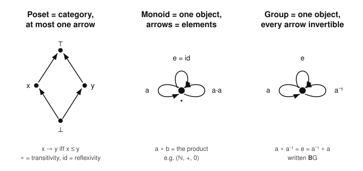

# Category Theory · Lesson 1.2: Categories Everywhere

> ⏱ ~15 min · Module 1: Categories, Functors & Natural Transformations · Builds on: [Lesson 1.1](01-01-what-is-a-category.md) · Unlocks: [Lesson 1.3](01-03-special-arrows-special-objects.md)

## Why this matters

Lesson 1.1 gave you the axioms; on their own they look like bookkeeping. The reason category theory earns its keep is that those same three rules — compose, associate, identity — are *already satisfied* by nearly every structure you know, and by structures you'd never have called "arrows-and-objects" at all. A group is a category. A partial order is a category. Once you see this, two things happen: you get a huge stockpile of examples to test every future definition against, and you get **duality** — a formal "reverse all the arrows" symmetry that hands you a second theorem free with every theorem you prove. This lesson is where the subject stops being abstract nonsense and starts being *everywhere*.

## The idea

Two moves, and the whole lesson is a variation on them.

**Move 1 — the big categories.** Take any species of mathematical object together with the maps that preserve its structure, and you almost always have a category: objects are the things, arrows are the structure-preserving maps, composition is ordinary function composition, identities are identity functions. Sets with functions. Groups with homomorphisms. Vector spaces with linear maps. Topological spaces with continuous maps. Each is a category because "preserves structure" is closed under composition and the identity preserves structure trivially. These are your reference examples forever.

**Move 2 — structure *as* a category.** This is the surprising one. Instead of collecting many objects, shrink to a *single* structure and ask what its internal anatomy looks like categorically:

- A **partial order** becomes a category with *at most one arrow* between any two objects: draw an arrow $x \to y$ precisely when $x \le y$. Transitivity ("$x\le y$ and $y\le z$ imply $x\le z$") *is* composition. Reflexivity ("$x \le x$") *is* the identity. Nothing else to check.
- A **monoid** — a set with an associative binary operation and a unit, like $(\mathbb{N},+,0)$ — becomes a category with *one object* whose *arrows are the elements themselves*. The product of two elements is the composite of two arrows. Associativity of the operation is associativity of composition; the unit is the identity arrow.
- A **group** is exactly a one-object category in which *every arrow is invertible*.

The slogan: sometimes a category is a *universe of structures*, and sometimes a single structure *is* a category. Category theory doesn't care which — the axioms are blind to the difference, which is the source of its reach.

## The formal version

**The standard large categories.** Each is specified by (objects, morphisms), with composition = function composition and identities = identity functions:

| Category | Objects | Morphisms $\operatorname{Hom}(A,B)$ |
|---|---|---|
| $\mathbf{Set}$ | sets | all functions $A\to B$ |
| $\mathbf{Grp}$ | groups | group homomorphisms |
| $\mathbf{Ab}$ | abelian groups | group homomorphisms |
| $\mathbf{Ring}$ | rings (with $1$) | ring homomorphisms |
| $\mathbf{Vect}_k$ | vector spaces over a field $k$ | $k$-linear maps |
| $\mathbf{Top}$ | topological spaces | continuous maps |

*In words:* pick your objects, let the arrows be exactly the maps that respect the objects' structure, and you have a category — because a composite of structure-preserving maps preserves structure, and identities do so trivially.

**Definition (poset as a category).** Let $(P,\le)$ be a preordered set. Define a category with object set $P$ and, for $x,y\in P$,
$$\operatorname{Hom}(x,y)=\begin{cases}\{\ast\} & \text{if } x\le y,\\[2pt] \varnothing & \text{otherwise.}\end{cases}$$
Composition of the unique arrow $x\to y$ with the unique arrow $y\to z$ is the unique arrow $x\to z$; it exists because $x\le y\le z\Rightarrow x\le z$. The identity $\operatorname{id}_x$ is the unique arrow $x\to x$, which exists because $x\le x$.

*In words:* a poset is a category where "is there an arrow?" means "$\le$?", and there's never a choice of *how* to get from $x$ to $y$ — at most one way. Associativity and unit laws are automatic because any two arrows with the same source and target are equal.

**Definition (monoid as a one-object category).** Let $(M,\cdot,e)$ be a monoid. Build a category $\mathbf{B}M$ with a single object $\star$, hom-set $\operatorname{Hom}(\star,\star)=M$, composite $g\circ f := g\cdot f$, and identity $\operatorname{id}_\star := e$. Associativity of $\circ$ is associativity of $\cdot$; the unit laws $e\cdot f=f=f\cdot e$ are the identity laws.

*In words:* forget that the elements of a monoid are "things" — treat each element as an *arrow from the one object to itself*, and multiplying elements is composing arrows. A one-object category and a monoid are the same data.

**Definition (group as a one-object groupoid).** $\mathbf{B}G$ is the one-object category of a group $G$; because every $g\in G$ has an inverse $g^{-1}$ with $g\cdot g^{-1}=e=g^{-1}\cdot g$, *every arrow of $\mathbf{B}G$ is an isomorphism*. Conversely, a one-object category in which every arrow is invertible is exactly a group.

*In words:* a group is a monoid where you can always run any arrow backwards. (A category in which every arrow is invertible is called a **groupoid**; $\mathbf{B}G$ is the one-object case.) This is the **abstract-algebra bridge**: the categorical content of "monoid" is *one object*, and of "group" is *one object, all arrows iso* — see [abstract-algebra](../../abstract-algebra/syllabus.md).

**Definition (opposite category).** For any category $\mathcal{C}$, its **opposite** $\mathcal{C}^{\mathrm{op}}$ has the *same objects*, but reverses every arrow: $\operatorname{Hom}_{\mathcal{C}^{\mathrm{op}}}(A,B):=\operatorname{Hom}_{\mathcal{C}}(B,A)$. Composition is reversed too: the $\mathcal{C}^{\mathrm{op}}$-composite $g\circ^{\mathrm{op}} f$ is defined as the $\mathcal{C}$-composite $f\circ g$. Identities are unchanged.

*In words:* $\mathcal{C}^{\mathrm{op}}$ is $\mathcal{C}$ with all arrows flipped and composition read backwards. It is again a category (the axioms are symmetric under reversal), and $(\mathcal{C}^{\mathrm{op}})^{\mathrm{op}}=\mathcal{C}$.

This last definition is the engine of **duality**. Any statement $S$ about categories has a **dual** $S^{\mathrm{op}}$, obtained by reversing every arrow and swapping the order of every composite. Because $\mathcal{C}^{\mathrm{op}}$ is a genuine category, *if $S$ holds in every category then so does $S^{\mathrm{op}}$* — apply $S$ to $\mathcal{C}^{\mathrm{op}}$ and translate back. You prove one theorem; you own two. (In Lesson 1.3, "initial" and "terminal," "mono" and "epi" will be exact duals of each other.)

## Picture

Three structures, each redrawn as a category. Left: a poset (its Hasse diagram *is* the category — arrows go up the order, at most one between any pair). Middle: a monoid collapsed to a single object whose loops are its elements, composition = the operation. Right: a group — same one-object shape, but now every loop has an inverse loop.

Read the middle and right panels literally: the dot is the *only* object, and each labeled loop is a *different arrow* $\star\to\star$. For $(\mathbb{N},+,0)$ the loops are $0,1,2,\dots$; composing the loop "$2$" after the loop "$3$" is the loop "$5$".

## Worked examples

**Example 1 (verify a poset is a category, and read off what a functor would do).** Take the divisibility order on $D=\{1,2,3,6\}$: put $a\to b$ iff $a\mid b$. The arrows are $1\to1,1\to2,1\to3,1\to6,2\to2,2\to6,3\to3,3\to6,6\to6$ (and $1\to1$ etc. are the identities). Check the category axioms: composition of $1\to2$ and $2\to6$ must be the unique arrow $1\to6$ — and indeed $1\mid2$ and $2\mid6$ give $1\mid6$, so that arrow exists; there's nothing to choose because there's at most one arrow $1\to6$. Associativity and unit laws hold *vacuously*: any two parallel arrows are equal, so any two composites that should agree automatically do.

Now, *what would a functor out of this poset be?* Looking ahead to Lesson 1.4: a functor $F$ from a poset $(P,\le)$ to a poset $(Q,\le)$ sends objects to objects and each arrow $x\to y$ to an arrow $Fx\to Fy$. But "an arrow $Fx\to Fy$ exists" means $Fx\le Fy$. So **a functor between posets is exactly a monotone (order-preserving) map**: $x\le y \Rightarrow Fx\le Fy$. Functoriality has no further content, because there's at most one arrow anywhere to preserve. That's the payoff of the poset example — it turns an intimidating word ("functor") into one you already own ("monotone map").

**Example 2 (realize $(\mathbb{N},+,0)$ as a one-object category).** The monoid is $M=(\mathbb{N},+,0)$: associative, with unit $0$. Its category $\mathbf{B}M$ has one object $\star$ and $\operatorname{Hom}(\star,\star)=\mathbb{N}$. The arrow named $n$ is "add $n$"; composing the arrow $m$ after the arrow $n$ is the arrow $m+n$:
$$m\circ n = m+n,\qquad \operatorname{id}_\star=0.$$
Associativity of $\circ$ is $(k+m)+n=k+(m+n)$; the unit laws are $0+n=n=n+0$. So $\mathbf{B}(\mathbb{N},+,0)$ is a bona fide category with countably many arrows, all sharing the single object. Note what makes it *not* a group: the arrow $1$ has no inverse — there is no $n\in\mathbb{N}$ with $1+n=0$ — so $\mathbf{B}(\mathbb{N},+,0)$ is a monoid category but not a groupoid. Swap $\mathbb{N}$ for $\mathbb{Z}$ and every arrow $n$ gains an inverse $-n$: $\mathbf{B}(\mathbb{Z},+,0)$ *is* a one-object groupoid, i.e. the group $\mathbb{Z}$.

## Watch out

- **You might think** a poset-as-category can have several arrows $x\to y$ (one "per reason" that $x\le y$) — **but** the definition puts a *single* arrow there, a bare witness that $x\le y$. Posets are precisely the categories that are "thin": at most one arrow between any ordered pair. If you ever find two distinct parallel arrows, you are not looking at a poset.
- **You might think** the object $\star$ in $\mathbf{B}M$ "is" the monoid, or "is" some element — **but** $\star$ is a featureless placeholder with no internal content; *all* the information lives in the arrows $\star\to\star$. The elements of $M$ are the morphisms, never the object.
- **You might think** $\mathcal{C}^{\mathrm{op}}$ is some exotic new category you must build by hand — **but** it's just $\mathcal{C}$ with arrows relabeled backwards; it has the identical objects and the identical *number* of arrows. E.g. $\mathbf{Set}^{\mathrm{op}}$ has all sets as objects, and one "op-arrow" $A\to B$ for each ordinary function $B\to A$. It is a perfectly legal category even though its op-arrows are not literally functions from $A$ to $B$.

## One-liner

> Reverse the arrows and a theorem becomes its own dual; shrink to one object and a monoid becomes a category — the axioms don't care whether "arrow" means *function*, *$\le$*, or *group element*.

## Problems

**P1 (🟢)** Consider the poset $(P,\le)$ with $P=\{a,b,c\}$ and relations $a\le b$, $a\le c$ (and each element $\le$ itself), with $b,c$ incomparable. (a) List every arrow of the corresponding category, marking the identities. (b) How many arrows are there total, and how many composites $g\circ f$ with $f\neq\operatorname{id}$ and $g\neq\operatorname{id}$ can you form? (c) Describe $P^{\mathrm{op}}$ as a poset — what order relation does it carry?

**P2 (🟡)** Let $M=(\mathbb{Z}/3\mathbb{Z},+,0)$ and view it as the one-object category $\mathbf{B}M$. (a) Write out the full composition table of its three arrows $0,1,2$ (i.e. the values of $m\circ n$). (b) Show every arrow is invertible and name each inverse, so $\mathbf{B}M$ is a groupoid. (c) In one sentence, contrast this with $\mathbf{B}(\mathbb{N},+,0)$ from Example 2.

**P3 (🔴, optional)** Prove the two directions of the abstract-algebra bridge as an *exact* correspondence. (a) Given a monoid $(M,\cdot,e)$, verify in full that $\mathbf{B}M$ (one object $\star$, arrows $M$, $g\circ f=g\cdot f$, $\operatorname{id}_\star=e$) satisfies all category axioms. (b) Conversely, given *any* category $\mathcal{C}$ with a single object $\star$, prove that the set $\operatorname{Hom}(\star,\star)$ with operation $\circ$ and unit $\operatorname{id}_\star$ is a monoid. Conclude that "monoid" and "one-object category" are the same data, and state the extra condition that upgrades both sides to "group."

Solutions

**P1** (a) Arrows are exactly the pairs $x\to y$ with $x\le y$:
$$\operatorname{id}_a:a\to a,\quad \operatorname{id}_b:b\to b,\quad \operatorname{id}_c:c\to c,\quad a\to b,\quad a\to c.$$
The three $\operatorname{id}$'s are the identities; $a\to b$ and $a\to c$ are the two non-identity arrows. (b) **Five** arrows total. For non-identity composites $g\circ f$ we need the target of $f$ to be the source of $g$, with both non-identity: the only non-identity arrows are $a\to b$ and $a\to c$, both with source $a$ and targets $b,c$. To compose we'd need an arrow *out of* $b$ or $c$ that is non-identity — there are none. So **zero** such composites exist. (Every composite in this category involves at least one identity.) (c) $P^{\mathrm{op}}$ reverses each arrow, so it is the poset with $b\le a$ and $c\le a$: the *reverse* (dual) order $\ge$, in which $a$ is now the top element and $b,c$ sit below it, still mutually incomparable.

**P2** (a) With $m\circ n=m+n\pmod 3$:
$$\begin{array}{c|ccc} \circ & 0 & 1 & 2\\\hline 0 & 0 & 1 & 2\\ 1 & 1 & 2 & 0\\ 2 & 2 & 0 & 1\end{array}$$
(reading row $m$, column $n$ as $m\circ n=m+n$; the table is symmetric here because $+$ is commutative). (b) The identity is $0$. Inverses: $0^{-1}=0$ (since $0+0=0$), $1^{-1}=2$ (since $1+2=0$), $2^{-1}=1$ (since $2+1=0$). Every arrow has a two-sided inverse, so $\mathbf{B}M$ is a one-object groupoid — i.e. the group $\mathbb{Z}/3\mathbb{Z}$. (c) In $\mathbf{B}(\mathbb{N},+,0)$ the arrow $1$ has *no* inverse (no natural number adds to $1$ to give $0$), so that category is a monoid but not a groupoid; here every arrow is invertible.

**P3** (a) *$\mathbf{B}M$ is a category.* Objects: $\{\star\}$. Morphisms: $\operatorname{Hom}(\star,\star)=M$; every arrow has source and target $\star$, so *every* pair $(f,g)$ is composable. **Composition well-defined:** $g\circ f:=g\cdot f\in M$, again an arrow $\star\to\star$. **Associativity:** for $f,g,h\in M$,
$$(h\circ g)\circ f=(h\cdot g)\cdot f=h\cdot(g\cdot f)=h\circ(g\circ f),$$
using associativity of $\cdot$. **Identity:** take $\operatorname{id}_\star:=e$; then $e\circ f=e\cdot f=f$ and $f\circ e=f\cdot e=f$ for all $f$, by the monoid unit laws. All axioms hold, so $\mathbf{B}M$ is a category.

(b) *A one-object category is a monoid.* Let $\mathcal{C}$ have single object $\star$ and put $N:=\operatorname{Hom}(\star,\star)$. Since every arrow goes $\star\to\star$, any two arrows are composable, so $\circ$ is a **binary operation** on $N$. It is **associative** by the category associativity axiom. The identity morphism $\operatorname{id}_\star\in N$ satisfies $\operatorname{id}_\star\circ f=f=f\circ\operatorname{id}_\star$ (category unit laws), so it is a **two-sided unit**. Hence $(N,\circ,\operatorname{id}_\star)$ is a monoid.

These constructions are mutually inverse: starting from $M$, forming $\mathbf{B}M$, then reading off $\operatorname{Hom}(\star,\star)$ returns $(M,\cdot,e)$ on the nose; starting from a one-object $\mathcal{C}$, forming its monoid, then rebuilding $\mathbf{B}(-)$ returns $\mathcal{C}$. So **monoids and one-object categories are the same data**.

*Upgrade to group.* Add the condition: *every arrow is invertible* (for each $f$ there is $f^{-1}$ with $f\circ f^{-1}=\operatorname{id}_\star=f^{-1}\circ f$). On the monoid side this says every element has a two-sided inverse — exactly the group axiom. So one-object categories in which every arrow is an isomorphism (one-object **groupoids**) are precisely groups. $\blacksquare$

## Connections

- **Backward:** this is [Lesson 1.1](01-01-what-is-a-category.md)'s three axioms cashed out — every "category" here is checked against *those* rules, and the poset case shows how associativity/unit laws can hold vacuously when hom-sets have at most one element.
- **Forward:** [Lesson 1.3](01-03-special-arrows-special-objects.md) uses the opposite category to make "initial vs. terminal" and "mono vs. epi" precise duals; [Lesson 1.4](01-04-functors.md) will reveal that a functor between posets is just a monotone map, and a functor out of $\mathbf{B}G$ is a group action (Boss problem 1). $\mathbf{Set}^{\mathrm{op}}$ resurfaces the moment we meet contravariant hom-functors in Module 2.
- **Sideways (abstract algebra):** the headline bridge — *a monoid **is** a one-object category, a group **is** a one-object groupoid* — reorganizes everything in [abstract-algebra](../../abstract-algebra/syllabus.md): homomorphisms of monoids will turn out to be functors between their $\mathbf{B}$-categories, and $G$-sets will be functors $\mathbf{B}G\to\mathbf{Set}$.
- **Sideways (topology & type theory):** $\mathbf{Top}$ is the arena for [topology](../../topology/syllabus.md) and [algebraic-topology](../../algebraic-topology/syllabus.md), where the fundamental groupoid of a space is literally a "structure-as-category"; the poset-as-category viewpoint is also how order and subtyping are modeled in [programming-languages](../../programming-languages/syllabus.md).
