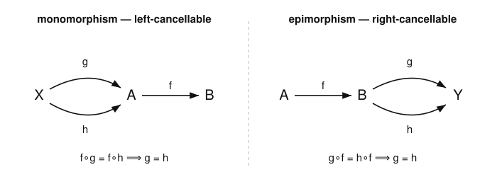
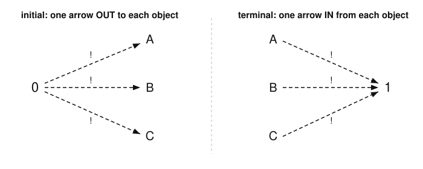

# Category Theory · Lesson 1.3: Special Arrows & Special Objects

> ⏱ ~15 min · Module 1: Categories, Functors & Natural Transformations · Builds on: [Lesson 1.2](01-02-categories-everywhere.md) · Unlocks: [Lesson 1.4 (Functors)](01-04-functors.md)

## Why this matters

In ordinary math you say two structures are "the same" with an *isomorphism*, and you probe a map by asking whether it is *injective* or *surjective* — all defined by chasing elements. But a category only knows arrows; there are no elements to poke. The bet of this lesson is that you can define "invertible," "injective," and "surjective" using arrows alone — and you can. The twist is that the arrow-only versions agree with the element versions in $\mathbf{Set}$ but *diverge* elsewhere: the inclusion $\mathbb{Z}\hookrightarrow\mathbb{Q}$ is a non-surjective epimorphism of rings. Learning to trust the arrow definition over your $\mathbf{Set}$ reflexes is the real content. And **initial** and **terminal** objects are your first universal properties — the emptiest and fullest objects in a category — which Module 2 will reveal as the template for *every* important construction.

## The idea

Three kinds of special arrow, each an arrow-only translation of something familiar.

- **Isomorphism** = *invertible*. An arrow you can undo: go across, come back, and land exactly where you started — and the same going the other way. This is category theory's word for "the same." Two objects joined by an iso are indistinguishable by any arrow-based test.
- **Monomorphism** = *left-cancellable*, the arrow version of *injective*. An injective function loses no information, so if $f$ post-composed with $g$ equals $f$ post-composed with $h$, then $g$ and $h$ were already equal — you can "cancel $f$ off the left."
- **Epimorphism** = *right-cancellable*, the arrow version of *surjective*. A surjection hits everything, so anything agreeing with something after $f$ must agree everywhere — you can "cancel $f$ off the right."

And two special objects, sitting at the extremes:

- **Initial object**: exactly *one* arrow going **out** to every object. In $\mathbf{Set}$ this is the empty set (there is a unique empty function $\varnothing\to A$).
- **Terminal object**: exactly *one* arrow coming **in** from every object. In $\mathbf{Set}$ this is any one-point set (there is a unique map $A\to\{*\}$, "crush everything").

Two big lessons ride along. First, **duality**: reverse every arrow in a category $\mathcal C$ and you get $\mathcal C^{\mathrm{op}}$ (Lesson 1.2). Under this reversal, epi *is* mono-in-the-opposite, and terminal *is* initial-in-the-opposite. Every theorem you prove about monos and initials comes with a free dual theorem about epis and terminals. Second, **the Set reflex is a trap**: in $\mathbf{Set}$, mono $=$ injective, epi $=$ surjective, iso $=$ bijective, and mono $+$ epi $=$ iso — all four clean. In $\mathbf{Ring}$, that last equation *fails*.

## The formal version

Fix a category $\mathcal C$. Write $g\circ f$ for "first $f$, then $g$," and $\operatorname{id}_A$ for the identity on $A$.

**Definition (isomorphism).** An arrow $f:A\to B$ is an **isomorphism** if there is an arrow $g:B\to A$ with
$$g\circ f=\operatorname{id}_A \qquad\text{and}\qquad f\circ g=\operatorname{id}_B.$$
Then $g$ is the **inverse** $f^{-1}$, and we write $A\cong B$.

*In words:* $f$ is an iso when some single arrow undoes it on *both* sides.

The inverse is unique, so "$f^{-1}$" is unambiguous. **Proof.** If $g$ and $g'$ both invert $f$, then
$$g=g\circ\operatorname{id}_B=g\circ(f\circ g')=(g\circ f)\circ g'=\operatorname{id}_A\circ g'=g'. \qquad\blacksquare$$
Notice the proof used only associativity and the identity laws — the category axioms, nothing about elements.

**Definition (monomorphism).** An arrow $f:A\to B$ is a **monomorphism** (mono, written $A\hookrightarrow B$) if for every object $X$ and every pair $g,h:X\to A$,
$$f\circ g=f\circ h \;\Longrightarrow\; g=h.$$

*In words:* $f$ is mono if it can be cancelled from the **left** of an equation.

**Definition (epimorphism).** An arrow $f:A\to B$ is an **epimorphism** (epi, written $A\twoheadrightarrow B$) if for every object $Y$ and every pair $g,h:B\to Y$,
$$g\circ f=h\circ f \;\Longrightarrow\; g=h.$$

*In words:* $f$ is epi if it can be cancelled from the **right**.

These two definitions are *word-for-word duals*: reverse the arrows and "left-cancellable in $\mathcal C$" becomes "right-cancellable in $\mathcal C^{\mathrm{op}}$." So **$f$ is epi in $\mathcal C$ iff $f$ is mono in $\mathcal C^{\mathrm{op}}$.**

**The Set dictionary.** In $\mathbf{Set}$: $f$ is mono $\iff$ $f$ is injective; $f$ is epi $\iff$ $f$ is surjective; $f$ is iso $\iff$ $f$ is bijective. (We prove the mono case below; the others are Problem territory or standard.)

**Definition (initial and terminal).** An object $0$ is **initial** if for every object $A$ there is *exactly one* arrow $0\to A$. An object $1$ is **terminal** if for every object $A$ there is *exactly one* arrow $A\to 1$. These are dual: $0$ is initial in $\mathcal C$ iff it is terminal in $\mathcal C^{\mathrm{op}}$.

*In words:* an initial object maps uniquely *out to* everything; a terminal object receives a unique arrow *in from* everything.

A quick census, straight from the definitions:

| Category | Initial $0$ | Terminal $1$ |
|---|---|---|
| $\mathbf{Set}$ | $\varnothing$ (unique empty function out) | any singleton $\{*\}$ (crush map in) |
| $\mathbf{Grp}$ | trivial group $\{e\}$ | trivial group $\{e\}$ |
| $\mathbf{Ring}$ (with $1$) | $\mathbb{Z}$ (forced by $1\mapsto 1$) | zero ring $\{0\}$ (where $1=0$) |

In $\mathbf{Grp}$ the *same* object is both initial and terminal — the unique homomorphism out of $\{e\}$ sends $e$ to the identity, and the unique one into $\{e\}$ crushes everything. Such an object (initial *and* terminal) is called a **zero object**. In $\mathbf{Set}$, by contrast, initial ($\varnothing$) and terminal ($\{*\}$) are genuinely different.

Initial and terminal objects are **unique up to a unique isomorphism** — the first instance of a slogan that will run the whole course (you prove it in P2).

## Picture

The two cancellation laws — cancel $f$ off the left to be mono, off the right to be epi:

The two extreme objects, defined purely by having exactly one arrow ($!$) out of, or into, each object:

## Worked examples

**Example 1 (mechanical — mono $=$ injective in $\mathbf{Set}$).** Let $f:A\to B$ be a function.

*(mono $\Rightarrow$ injective).* Suppose $f$ is mono. Take $a,a'\in A$ with $f(a)=f(a')$; we want $a=a'$. Use the one-point set $1=\{*\}$ and define two maps $g,h:1\to A$ by $g(*)=a$ and $h(*)=a'$. Then $(f\circ g)(*)=f(a)=f(a')=(f\circ h)(*)$, so $f\circ g=f\circ h$. Mono lets us cancel $f$: $g=h$, hence $a=g(*)=h(*)=a'$. So $f$ is injective.

*(injective $\Rightarrow$ mono).* Suppose $f$ is injective, and let $g,h:X\to A$ satisfy $f\circ g=f\circ h$. For each $x\in X$ we have $f(g(x))=f(h(x))$, so injectivity gives $g(x)=h(x)$. As this holds for all $x$, $g=h$. So $f$ is mono. $\blacksquare$

The maps out of the one-point set $1$ *are* the points of $A$ — the first glimpse of "elements as arrows from a terminal object," a viewpoint we'll generalize.

**Example 2 (why you'd care — a non-surjective epi, and why mono $+$ epi $\neq$ iso).** Consider the inclusion $i:\mathbb{Z}\hookrightarrow\mathbb{Q}$ in $\mathbf{Ring}$ (unital rings, homomorphisms preserving $1$). It is obviously *not surjective* — $\tfrac12$ is not hit. Yet it is an **epimorphism**.

To see it, take any ring $R$ and two homomorphisms $g,h:\mathbb{Q}\to R$ with $g\circ i=h\circ i$, i.e. $g$ and $h$ agree on every integer. We show $g=h$ on all of $\mathbb{Q}$. Let $b$ be a nonzero integer. From $b\cdot\tfrac1b=1$ and the fact that $g$ preserves products and $1$,
$$g(b)\,g\!\left(\tfrac1b\right)=g(1)=1_R,$$
so $g(b)$ is invertible in $R$ with $g(b)^{-1}=g(\tfrac1b)$. Now for any $\tfrac ab\in\mathbb{Q}$,
$$g\!\left(\tfrac ab\right)=g(a)\,g(b)^{-1}=h(a)\,h(b)^{-1}=h\!\left(\tfrac ab\right),$$
using $g(a)=h(a)$ and $g(b)=h(b)$ (both $a,b$ are integers). Hence $g=h$, so $i$ is epi.

Now the punchline. This $i$ is also **mono** (it is injective, and injective ring maps are mono by the same argument as Example 1). So $i$ is mono *and* epi — yet it is plainly **not an iso** (no ring map $\mathbb{Q}\to\mathbb{Z}$ can invert it; where would $\tfrac12$ go?). In $\mathbf{Ring}$,
$$\text{mono} + \text{epi} \;\neq\; \text{iso}.$$
The clean $\mathbf{Set}$ equation "bijective $=$ injective $+$ surjective $=$ iso" is a feature of $\mathbf{Set}$, not a law of categories.

## Watch out

- **You might think mono $+$ epi always means iso** — but that is a $\mathbf{Set}$-ism. $\mathbb{Z}\hookrightarrow\mathbb{Q}$ is a mono-epi in $\mathbf{Ring}$ that is not invertible. Being cancellable on both sides is strictly weaker than having a two-sided inverse. (Categories where the two coincide, like $\mathbf{Set}$, are called *balanced*.)
- **You might think epi means surjective** — again $\mathbb{Z}\twoheadrightarrow\mathbb{Q}$ says no in $\mathbf{Ring}$. Prove epi from the *cancellation definition*, not by checking the image. (It *does* happen to be true in $\mathbf{Set}$, $\mathbf{Grp}$, and $\mathbf{Top}$ — but for different reasons each time.)
- **You might think iso is just "bijective on underlying data"** — but an iso must have its *inverse living in the category too*. In $\mathbf{Top}$ a continuous bijection can fail to be a homeomorphism (its set-inverse need not be continuous), so it is mono, epi, bijective — and still not an iso (see P3). Isomorphism is category theory's replacement for equality: coarser than "literally the same object," yet demanding that the reverse map be a genuine arrow of $\mathcal C$.

## One-liner

> An arrow is known by what it cancels — invertible $=$ iso, left-cancellable $=$ mono, right-cancellable $=$ epi — and the two most special objects are the ones with exactly one arrow out (initial) or in (terminal).

## Problems

**P1 (🟢)** (a) Prove that in *any* category, every isomorphism is both mono and epi. (b) Let $(P,\le)$ be a poset seen as a category (one arrow $x\to y$ exactly when $x\le y$, as in Lesson 1.2). Which objects are initial, and which are terminal?

**P2 (🟡)** Prove that any two initial objects of a category are isomorphic *by a unique isomorphism*. (This is the "unique up to unique iso" slogan; the terminal case is the dual.)

**P3 (🔴, optional — bridge to [topology](../../topology/syllabus.md))** In $\mathbf{Top}$, a mono is exactly a continuous injection and an epi is exactly a continuous surjection (you may use this). Consider $f:[0,1)\to S^1$, $f(t)=(\cos 2\pi t,\ \sin 2\pi t)$, into the unit circle. Show $f$ is mono and epi but **not** an isomorphism, giving another mono-epi that is not iso.

Solutions

**P1** (a) Let $f:A\to B$ be an iso with inverse $f^{-1}:B\to A$.
*Mono:* suppose $f\circ g=f\circ h$ for $g,h:X\to A$. Compose with $f^{-1}$ on the left:
$$g=\operatorname{id}_A\circ g=(f^{-1}\circ f)\circ g=f^{-1}\circ(f\circ g)=f^{-1}\circ(f\circ h)=(f^{-1}\circ f)\circ h=h.$$
*Epi:* suppose $g\circ f=h\circ f$ for $g,h:B\to Y$. Compose with $f^{-1}$ on the right:
$$g=g\circ\operatorname{id}_B=g\circ(f\circ f^{-1})=(g\circ f)\circ f^{-1}=(h\circ f)\circ f^{-1}=h\circ(f\circ f^{-1})=h.$$
So $f$ is both mono and epi. $\blacksquare$ (Example 2 shows the *converse* fails.)

(b) In a poset-as-category there is at most one arrow between any two objects, so "exactly one arrow $x\to y$" just means $x\le y$. An **initial** object is an $x$ with $x\le y$ for *every* $y$ — a **least (bottom) element** $\bot$, if one exists. A **terminal** object is an $x$ with $y\le x$ for every $y$ — a **greatest (top) element** $\top$, if one exists. (E.g. in the divisibility poset on positive integers, $1$ is initial and there is no terminal; in a powerset ordered by $\subseteq$, $\varnothing$ is initial and the whole set is terminal.) If no bottom/top exists, the category simply has no initial/terminal object.

**P2** Let $0$ and $0'$ both be initial. Since $0$ is initial there is a *unique* arrow $u:0\to 0'$; since $0'$ is initial there is a unique arrow $v:0'\to 0$. Consider $v\circ u:0\to 0$. But $0$ is initial, so there is exactly one arrow $0\to 0$ — and $\operatorname{id}_0$ is such an arrow. Uniqueness forces
$$v\circ u=\operatorname{id}_0.$$
Symmetrically, $u\circ v:0'\to 0'$ must equal the unique arrow $0'\to 0'$, namely $\operatorname{id}_{0'}$, so $u\circ v=\operatorname{id}_{0'}$. Hence $u$ is an isomorphism with inverse $v$, so $0\cong 0'$. It is *the* unique iso because any isomorphism $0\to 0'$ is in particular *an* arrow $0\to 0'$, and initiality of $0$ says there is only one such arrow, namely $u$. $\blacksquare$ (Dualize every arrow to get the terminal statement.)

**P3** *Mono:* $f$ is injective — if $f(s)=f(t)$ then $s$ and $t$ have the same cosine and sine, so $s\equiv t\pmod 1$; since $s,t\in[0,1)$ this forces $s=t$. A continuous injection is mono in $\mathbf{Top}$.
*Epi:* $f$ is surjective — every point of $S^1$ is $(\cos\theta,\sin\theta)$ for a unique $\theta\in[0,2\pi)$, hit by $t=\theta/2\pi\in[0,1)$. A continuous surjection is epi in $\mathbf{Top}$.
*Not iso:* an iso in $\mathbf{Top}$ is a homeomorphism, so its inverse must be continuous. Here $f^{-1}:S^1\to[0,1)$ is not continuous: points just *below* the seam, approaching $f(1^-)=(1,0)$ from one side, have $f^{-1}$-values near $1$, while the point $(1,0)=f(0)$ itself has $f^{-1}$-value $0$ — a jump. (Concretely, $S^1$ is compact but $[0,1)$ is not, and a homeomorphism would preserve compactness; so no homeomorphism $S^1\to[0,1)$ can exist at all.) Thus $f$ is mono and epi but not iso. $\blacksquare$

## Flashback

**From Lesson 1.2 (a monoid as a one-object category):** Regard the monoid $M=(\mathbb{N},+,0)$ as a category $\mathbf{B}M$ with a single object $\star$, one arrow $\star\to\star$ for each natural number, composition given by addition, and $\operatorname{id}_\star=0$. **Which arrows of $\mathbf{B}M$ are isomorphisms?**

Solution

An arrow is the natural number $n$; it is an **iso** iff it has a two-sided inverse, i.e. an $m$ with $n\circ m=m\circ n=\operatorname{id}_\star$. In this category composition is $+$ and the identity is $0$, so the condition is
$$n+m=0.$$
For $n,m\in\mathbb{N}$ this forces $n=m=0$. So the **only** isomorphism in $\mathbf{B}M$ is the identity $0$.

This is the general principle: in the one-object category $\mathbf{B}M$ of a monoid $M$, the isomorphisms are exactly the **invertible elements (units)** of $M$. The monoid $(\mathbb{N},+,0)$ has only one unit, so $\mathbf{B}M$ has only the trivial iso — it is very far from being a group. (For a *group* $G$, *every* arrow of $\mathbf{B}G$ is an iso — which is precisely what makes $\mathbf{B}G$ a group rather than a bare monoid.) $\blacksquare$

## Connections

- **Backward:** the one-point set $1=\{*\}$ used in Example 1 is exactly the *terminal object* of $\mathbf{Set}$ from this lesson, and the categories $\mathbf{Set},\mathbf{Grp},\mathbf{Ring},\mathbf{Top}$, posets, and $\mathbf{B}M$ are all straight from [Lesson 1.2](01-02-categories-everywhere.md). Duality ($\mathcal C^{\mathrm{op}}$) turned every definition here into a free dual.
- **Forward:** [Lesson 1.4](01-04-functors.md) shows functors always preserve isomorphisms (though not always monos or epis), and initial/terminal objects are the seed of *universal properties* in [Lesson 2.1](02-01-universal-properties.md) — where "unique up to unique iso" (P2) becomes the standard closing move for products, limits, and free objects.
- **Sideways (abstract-algebra):** mono/epi/units for [groups and rings](../../abstract-algebra/syllabus.md) — the flashback's "isos $=$ units of the monoid," the epi $\mathbb{Z}\twoheadrightarrow\mathbb{Q}$, and $\mathbb{Z}$ as the *initial ring* (which is what pins down a ring's characteristic).
- **Sideways (topology):** in [topology](../../topology/syllabus.md) the gap between a continuous bijection and a homeomorphism (P3) is the same mono-epi-not-iso phenomenon, and the compactness argument there is the standard tool for it.
