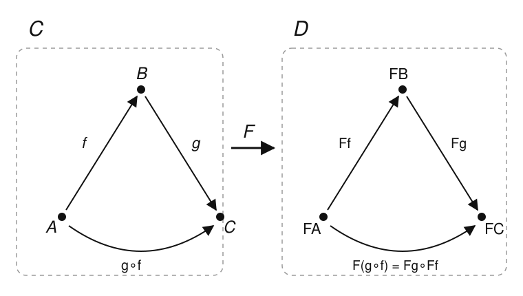

# Category Theory · Lesson 1.4: Functors

> ⏱ ~15 min · Module 1: Categories, Functors & Natural Transformations · Builds on: [Lesson 1.3](01-03-special-arrows-special-objects.md) · Unlocks: [Lesson 1.5](01-05-natural-transformations.md)

## Why this matters

You already know one category is a world unto itself — groups and their homomorphisms, spaces and their continuous maps. The action starts when you build a *bridge between worlds* that respects their internal wiring. That bridge is a **functor**, and it is the single most productive idea in the subject: it lets you take a hard topological question and ship it, structure intact, into algebra where you can compute. When someone tells you the coffee cup and the doughnut are "the same" but the sphere and the torus are not, the thing certifying it is a functor — the fundamental group $\pi_1$ — carrying spaces to groups so faithfully that *different groups force different spaces*. Every invariant you have ever met is a functor in disguise.

## The idea

A category has two kinds of stuff — objects and arrows — glued together by composition and identities. A map of categories should move both kinds of stuff *and not disturb the glue*. So a functor $F:\mathcal{C}\to\mathcal{D}$ does two things at once:

- to each object $A$ of $\mathcal{C}$ it assigns an object $FA$ of $\mathcal{D}$;
- to each arrow $f:A\to B$ it assigns an arrow $Ff:FA\to FB$ — **same shape, moved over**: the source and target come along for the ride.

And it must respect the glue: identities go to identities, and a composite goes to the composite of the images. Picture it as a rigid diagram-carrier — you hand it a triangle $A\xrightarrow{f}B\xrightarrow{g}C$ with its composite, and it hands you back the *same triangle* drawn in $\mathcal{D}$, composite still commuting.

Three examples you already own, before any formalism:

- **Forgetful.** $U:\mathbf{Grp}\to\mathbf{Set}$ takes a group to its underlying set and a homomorphism to itself-as-a-function — it just *forgets* that multiplication was ever there. Composition of homomorphisms is composition of functions, so nothing breaks.
- **Free.** $F:\mathbf{Set}\to\mathbf{Grp}$ sends a set $X$ to the free group on $X$ (all reduced words in the letters of $X$ and their inverses) and a function to the homomorphism it freely generates. This is the "add structure for free" direction, and $F$ and $U$ will turn out to be *adjoint* — the deepest relationship in the course ([Lesson 3.4](03-04-adjoint-functors.md), and the free⊣forgetful story from [abstract-algebra](../../abstract-algebra/syllabus.md)).
- **Hom.** Fix an object $A$. Then $\operatorname{Hom}(A,-)$ sends each object $B$ to the *set* of arrows $A\to B$ — turning any category into a probe that reports "what does $A$ see?" We verify below that this is a functor; it is the seed of the entire Yoneda story ([Lesson 2.2](02-02-representable-functors.md)).

## The formal version

**Definition (covariant functor).** A *functor* $F:\mathcal{C}\to\mathcal{D}$ consists of:

1. an assignment on objects, $A\mapsto FA$, and
2. an assignment on arrows, sending each $f:A\to B$ to $Ff:FA\to FB$ (so $F$ preserves source and target),

subject to two axioms:
$$F(\operatorname{id}_A)=\operatorname{id}_{FA}\quad\text{for every object }A,\qquad\qquad F(g\circ f)=Fg\circ Ff\quad\text{whenever }g\circ f\text{ is defined.}$$

*In words:* $F$ relabels objects and arrows so that identities stay identities and "do $f$ then $g$" is carried to "do $Ff$ then $Fg$." It is a homomorphism of categories.

**Definition (contravariant functor).** A *contravariant* functor $\mathcal{C}\to\mathcal{D}$ is a functor that **reverses** arrows: it sends $f:A\to B$ to $Ff:FB\to FA$ and satisfies $F(g\circ f)=Ff\circ Fg$ (order flipped). Equivalently — and this is the clean way to say it — a contravariant functor $\mathcal{C}\to\mathcal{D}$ *is* an ordinary (covariant) functor $\mathcal{C}^{\mathrm{op}}\to\mathcal{D}$.

*In words:* "contravariant" is not a new gadget — it is a covariant functor out of the opposite category (Lesson 1.2's arrow-reversal). Whenever a construction eats maps *the wrong way*, suspect $\mathcal{C}^{\mathrm{op}}$.

The canonical contravariant example is the other hom-functor, $\operatorname{Hom}(-,A):\mathcal{C}^{\mathrm{op}}\to\mathbf{Set}$: it sends $B$ to the set of arrows $B\to A$, and a map $f:B\to B'$ to *precomposition* $(-\circ f):\operatorname{Hom}(B',A)\to\operatorname{Hom}(B,A)$ — which points backward, hence contravariant.

Two facts make functors the "invariants" of the subject.

**Proposition (functors compose).** If $F:\mathcal{C}\to\mathcal{D}$ and $G:\mathcal{D}\to\mathcal{E}$ are functors, so is $G\circ F:\mathcal{C}\to\mathcal{E}$, defined by $(G\circ F)A=G(FA)$ and $(G\circ F)f=G(Ff)$.

*Proof.* Identities: $(GF)(\operatorname{id}_A)=G(F\operatorname{id}_A)=G(\operatorname{id}_{FA})=\operatorname{id}_{GFA}$. Composition: $(GF)(g\circ f)=G\big(F(g\circ f)\big)=G(Fg\circ Ff)=G(Fg)\circ G(Ff)=(GF)g\circ (GF)f$. Both used the axioms for $F$ then $G$ in turn. $\blacksquare$

**Proposition (functors preserve isomorphisms).** If $f:A\to B$ is an isomorphism in $\mathcal{C}$, then $Ff:FA\to FB$ is an isomorphism in $\mathcal{D}$, with $(Ff)^{-1}=F(f^{-1})$.

*Proof.* Let $g=f^{-1}$, so $g\circ f=\operatorname{id}_A$ and $f\circ g=\operatorname{id}_B$. Apply $F$: $Fg\circ Ff=F(g\circ f)=F\operatorname{id}_A=\operatorname{id}_{FA}$, and likewise $Ff\circ Fg=\operatorname{id}_{FB}$. So $Fg$ is a two-sided inverse of $Ff$. $\blacksquare$

*In words:* isomorphic objects have isomorphic images — **always**. Contrapositive: if $FA\not\cong FB$, then $A\not\cong B$. That is the entire logic of an invariant: to prove two spaces are genuinely different, apply a functor and show the *outputs* differ.

## Picture

$F$ carries the whole triangle from $\mathcal{C}$ to $\mathcal{D}$ — objects to objects, each arrow to an arrow with matching source and target, and the composite $g\circ f$ to $F(g\circ f)=Fg\circ Ff$. The image commutes because the source did.

## Worked examples

**Example 1 (verify functoriality of $\operatorname{Hom}(A,-)$).** Fix a category $\mathcal{C}$ and an object $A$. Define $H=\operatorname{Hom}(A,-):\mathcal{C}\to\mathbf{Set}$ by
$$HB=\operatorname{Hom}_{\mathcal{C}}(A,B)\quad(\text{a set}),\qquad Hf=(f\circ-):\operatorname{Hom}(A,B)\to\operatorname{Hom}(A,B')\ \text{ for }f:B\to B'.$$
So $H$ sends an object $B$ to all the arrows from $A$ into it, and sends a map $f:B\to B'$ to *post*composition: an arrow $\varphi:A\to B$ becomes $f\circ\varphi:A\to B'$. Check the two axioms.

*Identities.* $H(\operatorname{id}_B)$ sends $\varphi\mapsto \operatorname{id}_B\circ\varphi=\varphi$. That is the identity function on the set $\operatorname{Hom}(A,B)$, i.e. $\operatorname{id}_{HB}$. ✓

*Composition.* For $f:B\to B'$ and $g:B'\to B''$ and any $\varphi\in\operatorname{Hom}(A,B)$,
$$H(g\circ f)(\varphi)=(g\circ f)\circ\varphi=g\circ(f\circ\varphi)=Hg\big(Hf(\varphi)\big)=(Hg\circ Hf)(\varphi),$$
where the middle step is just associativity of composition in $\mathcal{C}$. Since this holds for every $\varphi$, $H(g\circ f)=Hg\circ Hf$. ✓

So $\operatorname{Hom}(A,-)$ is a genuine covariant functor to $\mathbf{Set}$ — and the one axiom did all the work is associativity. (Swap to *pre*composition and the order flips, giving the contravariant $\operatorname{Hom}(-,A)$.)

**Example 2 (covariant vs. contravariant power set).** A function $f:X\to Y$ induces *two* maps on power sets, and they go opposite ways.

- **Direct image** $P(f):PX\to PY$, $\ S\mapsto f[S]=\{f(s):s\in S\}$. This is **covariant**: $P(\operatorname{id})=\operatorname{id}$, and for $X\xrightarrow{f}Y\xrightarrow{g}Z$, the image of $S$ under "$f$ then $g$" is $g[f[S]]$, so $P(g\circ f)=P(g)\circ P(f)$. Thus $P:\mathbf{Set}\to\mathbf{Set}$ is a covariant functor.
- **Preimage** $P^{-1}(f):PY\to PX$, $\ T\mapsto f^{-1}[T]=\{x:f(x)\in T\}$. Note the *domain and codomain swapped*: it eats subsets of $Y$ and returns subsets of $X$. And preimages compose backward: $(g\circ f)^{-1}[U]=f^{-1}\big[g^{-1}[U]\big]$, i.e. $P^{-1}(g\circ f)=P^{-1}(f)\circ P^{-1}(g)$. So $P^{-1}:\mathbf{Set}^{\mathrm{op}}\to\mathbf{Set}$ is **contravariant**.

Same raw data ($f$), two functors of opposite variance — and the contravariant one is usually the better-behaved (preimage respects unions, intersections, *and* complements; direct image only respects unions). This is your first taste of a running theme: the interesting functors on "spaces" — open sets, functions on a space, cohomology — tend to be contravariant.

**Example 3 (the fundamental group is a functor — the algebraic-topology bridge).** Let $\mathbf{Top}_{*}$ be the category of *pointed* topological spaces $(X,x_0)$ with basepoint-preserving continuous maps. The fundamental group construction is a functor
$$\pi_1:\mathbf{Top}_{*}\to\mathbf{Grp}.$$
On objects: $(X,x_0)\mapsto\pi_1(X,x_0)$, the group of loops at $x_0$ up to homotopy. On arrows: a pointed continuous map $f:(X,x_0)\to(Y,y_0)$ becomes the *induced homomorphism* $f_*:\pi_1(X,x_0)\to\pi_1(Y,y_0)$, $[\gamma]\mapsto[f\circ\gamma]$ — you push a loop forward by composing with $f$. The functor axioms are exactly what make this coherent:

- $(\operatorname{id}_X)_*[\gamma]=[\operatorname{id}_X\circ\gamma]=[\gamma]$, so $(\operatorname{id}_X)_*=\operatorname{id}_{\pi_1(X,x_0)}$;
- $(g\circ f)_*[\gamma]=[(g\circ f)\circ\gamma]=[g\circ(f\circ\gamma)]=g_*\big(f_*[\gamma]\big)$, so $(g\circ f)_*=g_*\circ f_*$.

Now run the "preserves isomorphisms" proposition backward. A homeomorphism $(X,x_0)\cong(Y,y_0)$ is an isomorphism in $\mathbf{Top}_{*}$, so $\pi_1$ forces $\pi_1(X)\cong\pi_1(Y)$ as groups. Contrapositive: $\pi_1(S^1)\cong\mathbb{Z}$ but $\pi_1(S^2)\cong\{e\}$, so $S^1\not\cong S^2$ — a topological fact proved by an *algebraic* inequality. **That is why $\pi_1$, and homology $H_n:\mathbf{Top}\to\mathbf{Ab}$, are called invariants: they are functors, so they cannot tell isomorphic spaces apart, which means when they *do* differ the spaces must too.** You will meet these functors properly in [algebraic-topology](../../algebraic-topology/syllabus.md); here we have just named the machine.

## Watch out

- **"Contravariant functor" is not a separate axiom system.** You might think you need new rules for the arrow-flipping kind — but a contravariant functor $\mathcal{C}\to\mathcal{D}$ is *literally* a covariant functor $\mathcal{C}^{\mathrm{op}}\to\mathcal{D}$. Reduce every contravariance question to the opposite category and reuse everything you already proved.
- **A functor acts on arrows, not just objects.** A bare rule "$A\mapsto FA$" on objects is not a functor and carries no information about maps. The object rule alone can't detect isomorphisms — the *arrow* rule is what makes $\pi_1$ an invariant. Always specify $Ff$ and check both axioms.
- **Functors preserve isos but need not reflect them.** You might think $Ff$ being an isomorphism forces $f$ to be one — it does not. The forgetful $U:\mathbf{Top}\to\mathbf{Set}$ sends a continuous bijection that is *not* a homeomorphism to a genuine bijection (an iso in $\mathbf{Set}$), even though the original was no iso in $\mathbf{Top}$. Preservation runs one way only (P3).

## One-liner

> A functor is a homomorphism of categories — it carries objects, arrows, and the way arrows compose — and because it carries composition it carries isomorphisms, which is exactly why $\pi_1$ and homology can prove two spaces are different.

## Problems

**P1 (🟢)** Verify in full that the forgetful functor $U:\mathbf{Grp}\to\mathbf{Set}$ — underlying set on objects, "same function" on arrows — satisfies both functor axioms. Then state precisely why $U$ is *not* injective on objects (exhibit two different groups with $UG=UG'$).

**P2 (🟡)** Show that the preimage assignment $P^{-1}$ from Example 2 is *contravariant* by proving $P^{-1}(g\circ f)=P^{-1}(f)\circ P^{-1}(g)$ directly from the definition of preimage, and checking $P^{-1}(\operatorname{id}_X)=\operatorname{id}_{PX}$. Where would the argument break if you tried to make preimage *covariant* (i.e. get $P^{-1}(g)\circ P^{-1}(f)$)?

**P3 (🔴, optional)** Functors preserve isomorphisms but need not *reflect* them. (a) Give the constant functor $\Delta_d:\mathcal{C}\to\mathcal{D}$ sending every object to a fixed $d$ and every arrow to $\operatorname{id}_d$; verify it is a functor and explain why *every* arrow's image is an isomorphism regardless of the arrow. (b) Give a functor and a specific non-isomorphism whose image *is* an isomorphism, using a map that is bijective but not invertible in its own category.

Solutions

**P1** Write $U$ on objects as $G\mapsto |G|$ (the underlying set) and on arrows as $(\varphi:G\to G')\mapsto(\varphi:|G|\to|G'|)$, the *same set-function*, forgetting that it respects multiplication.

*Identities.* The identity homomorphism $\operatorname{id}_G$ is, as a function, the identity map on $|G|$. So $U(\operatorname{id}_G)=\operatorname{id}_{|G|}=\operatorname{id}_{UG}$. ✓

*Composition.* If $\varphi:G\to G'$ and $\psi:G'\to G''$ are homomorphisms, their composite $\psi\circ\varphi$ as a homomorphism is by definition the same as their composite as functions. Hence $U(\psi\circ\varphi)=\psi\circ\varphi=U\psi\circ U\varphi$. ✓

So $U$ is a functor. It is *not* injective on objects because distinct group structures can share an underlying set: take $G=(\mathbb{Z}/4,+)$ and $G'=(\mathbb{Z}/2\times\mathbb{Z}/2,+)$. Both have underlying set of size $4$; more sharply, $\mathbb{Z}/6$ and $S_3$ both have underlying set $\{1,\dots,6\}$ up to relabeling yet $UG=UG'$ can be literally equal after a bijection of underlying sets while $G\not\cong G'$ ($\mathbb{Z}/4$ is cyclic, the Klein four-group is not). The forgetting is genuine information loss — which is exactly what the free functor tries to undo.

**P2** By definition $P^{-1}(f)(T)=f^{-1}[T]=\{x\in X:f(x)\in T\}$ for $f:X\to Y$ and $T\subseteq Y$.

*Composition (contravariant).* Let $f:X\to Y$, $g:Y\to Z$, and $U\subseteq Z$. Then
$$(g\circ f)^{-1}[U]=\{x\in X:(g\circ f)(x)\in U\}=\{x:g(f(x))\in U\}=\{x:f(x)\in g^{-1}[U]\}=f^{-1}\big[g^{-1}[U]\big].$$
Reading this as functions on power sets: $P^{-1}(g\circ f)(U)=\big(P^{-1}(f)\circ P^{-1}(g)\big)(U)$ for all $U$, so $P^{-1}(g\circ f)=P^{-1}(f)\circ P^{-1}(g)$. The order flipped, which is exactly contravariance. ✓

*Identity.* $P^{-1}(\operatorname{id}_X)(S)=\operatorname{id}_X^{-1}[S]=\{x:x\in S\}=S$, so $P^{-1}(\operatorname{id}_X)=\operatorname{id}_{PX}$. ✓

*Why not covariant.* $P^{-1}(g)\circ P^{-1}(f)$ would require composing $P^{-1}(f):PY\to PX$ *after* $P^{-1}(g):PZ\to PY$ — but $P^{-1}(f)$ outputs subsets of $X$, and to feed $P^{-1}(g)$ (which needs subsets of $Y$) you'd have the arrows pointing the wrong way; the types simply don't line up. Preimage inherently pulls back along $f$, so it lives on $\mathbf{Set}^{\mathrm{op}}$.

**P3** (a) *$\Delta_d$ is a functor.* On objects every $A\mapsto d$; on arrows every $f\mapsto\operatorname{id}_d$. Identities: $\Delta_d(\operatorname{id}_A)=\operatorname{id}_d=\operatorname{id}_{\Delta_d A}$. ✓ Composition: for composable $f,g$, $\Delta_d(g\circ f)=\operatorname{id}_d=\operatorname{id}_d\circ\operatorname{id}_d=\Delta_d(g)\circ\Delta_d(f)$. ✓ Every arrow's image is $\operatorname{id}_d$, and an identity is always an isomorphism (it is its own inverse). So no matter how badly non-invertible $f$ is, $\Delta_d(f)$ is an iso — the functor has thrown away all arrow information, so it cannot possibly reflect the property of being an iso.

(b) Take $U:\mathbf{Top}\to\mathbf{Set}$ and the continuous bijection
$$f:[0,1)\to S^1,\qquad t\mapsto(\cos 2\pi t,\ \sin 2\pi t).$$
$f$ is a continuous bijection but *not* a homeomorphism (its inverse is discontinuous at the point where the circle closes up), so $f$ is **not** an isomorphism in $\mathbf{Top}$. Yet $Uf$ is the underlying bijection of sets, which *is* an isomorphism in $\mathbf{Set}$. Thus $Uf$ iso does not force $f$ iso: functors preserve isomorphisms but need not reflect them. $\blacksquare$

## Flashback

**From [Lesson 1.3](01-03-special-arrows-special-objects.md) (special arrows):** In $\mathbf{Ring}$ the inclusion $\mathbb{Z}\hookrightarrow\mathbb{Q}$ is both mono and epi yet not an iso. Show the analogous phenomenon in $\mathbf{Mon}$ (monoids and monoid homomorphisms): the inclusion $i:(\mathbb{N},+)\to(\mathbb{Z},+)$ is a monomorphism and an epimorphism, but not an isomorphism.

Solution

*Mono.* $i$ is an injective function, and injective monoid homomorphisms are monos: if $i\circ h=i\circ k$ for homomorphisms $h,k:M\to(\mathbb{N},+)$, then for every $m$, $i(h(m))=i(k(m))$, and injectivity of $i$ gives $h(m)=k(m)$, so $h=k$. ✓

*Epi.* Suppose $g,h:(\mathbb{Z},+)\to M$ are monoid homomorphisms with $g\circ i=h\circ i$, i.e. $g$ and $h$ agree on all of $\mathbb{N}$. In particular $g(1)=h(1)$, and since homomorphisms preserve $+$, $g(n)=g(1)^{+n}=h(n)$ for all $n\ge 0$ (writing the $M$-operation additively). For negatives: $g(-1)$ is a two-sided inverse of $g(1)$ in $M$ because $g(-1)+g(1)=g(0)=e=g(1)+g(-1)$. Inverses in a monoid, when they exist, are **unique**; since $g(1)=h(1)$ and $h(-1)$ is also a two-sided inverse of that same element, $g(-1)=h(-1)$. Hence $g(-n)=g(-1)^{+n}=h(-n)$ too, so $g=h$. Therefore $i$ is epi. ✓

*Not iso.* $i$ is not surjective ($-1\notin\mathbb{N}$), and it has no two-sided inverse homomorphism: any inverse would be a bijection $\mathbb{Z}\to\mathbb{N}$, impossible since $i$ itself isn't surjective. ✓

So exactly as with $\mathbb{Z}\hookrightarrow\mathbb{Q}$: *mono + epi does not imply iso* outside of $\mathbf{Set}$ — an epimorphism need not be surjective. The lesson of 1.3 stands: "iso" is strictly stronger than "mono and epi."

## Connections

- **Backward:** contravariance is powered entirely by the opposite category $\mathcal{C}^{\mathrm{op}}$ from [Lesson 1.2](01-02-categories-everywhere.md), and "functors preserve isos" leans on the mono/epi/iso distinctions from [Lesson 1.3](01-03-special-arrows-special-objects.md) — an iso is defined by having a two-sided inverse, the one property $F$ can always carry.
- **Forward:** [Lesson 1.5](01-05-natural-transformations.md) compares *two* functors $F,G:\mathcal{C}\to\mathcal{D}$ arrow-by-arrow with a natural transformation; the hom-functors verified here become the representable functors at the heart of the Yoneda lemma ([Lesson 2.2](02-02-representable-functors.md), [2.3](02-03-yoneda-lemma.md)). The free–forgetful pair previewed here is the running example of an adjunction ([Lesson 3.4](03-04-adjoint-functors.md)).
- **Sideways (algebraic topology):** $\pi_1:\mathbf{Top}_{*}\to\mathbf{Grp}$ and the homology functors $H_n:\mathbf{Top}\to\mathbf{Ab}$ are *the* reason topological invariants work — being functors, they cannot distinguish homeomorphic spaces, so any difference they detect is real ([algebraic-topology](../../algebraic-topology/syllabus.md)).
- **Sideways (abstract algebra):** forgetful and free functors between $\mathbf{Set}$, $\mathbf{Mon}$, $\mathbf{Grp}$, $\mathbf{Vect}$ formalize "underlying data" vs. "structure generated freely," and their adjunction is the categorical spine of constructions like free groups, polynomial rings, and tensor algebras ([abstract-algebra](../../abstract-algebra/syllabus.md)).
