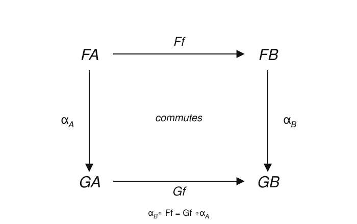

# Category Theory · Lesson 1.5: Natural Transformations

> ⏱ ~15 min · Module 1: Categories, Functors & Natural Transformations · Builds on: [Functors (1.4)](01-04-functors.md) · Unlocks: [Universal Properties (2.1)](02-01-universal-properties.md)

## Why this matters

This is the concept category theory was *invented for*. In 1945 Eilenberg and Mac Lane wanted to make one word precise — **natural** — as in "a finite-dimensional vector space is naturally isomorphic to its double dual, but only unnaturally isomorphic to its dual." To pin down "natural" they had to define natural transformations; to define those they needed functors; to define functors they needed categories. The whole three-storey building exists to support this one sentence. Once you have it, "canonical / basis-free / no arbitrary choices" stops being a feeling and becomes a theorem you can check.

## The idea

A functor $F:\mathcal{C}\to\mathcal{D}$ is one way of drawing $\mathcal{C}$ inside $\mathcal{D}$. Two functors $F,G:\mathcal{C}\to\mathcal{D}$ are two such drawings. A **natural transformation** $\alpha:F\Rightarrow G$ is a way of *sliding the first drawing onto the second* — smoothly, using no information except what the category itself provides.

Concretely: at each object $A$ it hands you one arrow $\alpha_A:FA\to GA$ (a "**component**"), nudging $FA$ over to $GA$. The word *natural* is the promise that these nudges are **uniform** — they don't secretly depend on a basis, an ordering, or any private choice. The test for uniformity is that the nudges commute with everything: whatever arrow $f:A\to B$ you follow, sliding-then-$G$ing equals $F$-ing-then-sliding.

Three examples you already half-know:

- **A scalar.** For vector spaces, "multiply every vector by $2$" is a family $\alpha_V:V\to V$, one per space, that plays nicely with every linear map. It's a natural transformation $\operatorname{Id}\Rightarrow\operatorname{Id}$.
- **Abelianization.** Sending a group to its abelianization $G\twoheadrightarrow G/[G,G]$ is one arrow per group, compatible with all homomorphisms — a natural transformation from the identity functor to the abelianization functor.
- **Determinant.** Over any commutative ring, $\det$ turns an invertible matrix into an invertible scalar. That's one map $\mathrm{GL}_n(R)\to R^\times$ per ring $R$ — and, as we'll see, it slides uniformly across all rings.

## The formal version

Fix two functors $F,G:\mathcal{C}\to\mathcal{D}$.

**Definition (natural transformation).** A natural transformation $\alpha:F\Rightarrow G$ assigns to each object $A$ of $\mathcal{C}$ an arrow of $\mathcal{D}$,
$$\alpha_A:FA\longrightarrow GA \qquad(\text{the }A\text{-component}),$$
such that for **every** arrow $f:A\to B$ in $\mathcal{C}$ the **naturality square** commutes:
$$\alpha_B\circ Ff \;=\; Gf\circ \alpha_A.$$

*In words:* one arrow per object, and no matter which arrow $f$ you take, going "down then across the bottom" equals "across the top then down." The single equation is the entire content — everything else is bookkeeping.

**Definition (natural isomorphism).** $\alpha:F\Rightarrow G$ is a **natural isomorphism**, written $F\cong G$, if every component $\alpha_A$ is an isomorphism in $\mathcal{D}$. (Problem P2 shows the inverse components then automatically assemble into a natural transformation $G\Rightarrow F$, so "$\cong$" is symmetric.)

*In words:* $F$ and $G$ are "the same functor" — matched object-by-object by invertible arrows that respect every map.

**Definition (functor category).** For categories $\mathcal{C},\mathcal{D}$, the **functor category** $[\mathcal{C},\mathcal{D}]$ has functors $\mathcal{C}\to\mathcal{D}$ as its objects and natural transformations as its arrows. Composition is *componentwise*: $(\beta\circ\alpha)_A=\beta_A\circ\alpha_A$, and the identity on $F$ has components $(\operatorname{id}_F)_A=\operatorname{id}_{FA}$.

*In words:* natural transformations are themselves the morphisms of a brand-new category, one level up. (That this really is a category — that $\beta\circ\alpha$ is again natural — is Problem P3's territory.)

**The headline example — $\det$ as a natural transformation.** Both of these are functors $\mathbf{CRing}\to\mathbf{Grp}$ (from commutative rings to groups):
$$\mathrm{GL}_n:R\mapsto \mathrm{GL}_n(R)\ (\text{invertible }n\times n\text{ matrices over }R), \qquad (-)^\times:R\mapsto R^\times\ (\text{units of }R).$$
A ring homomorphism $\varphi:R\to S$ acts on $\mathrm{GL}_n$ by applying $\varphi$ to every matrix entry, and on $(-)^\times$ by restricting to units. The determinant gives one group homomorphism per ring, $\det_R:\mathrm{GL}_n(R)\to R^\times$, and these are the components of a natural transformation $\det:\mathrm{GL}_n\Rightarrow(-)^\times$. Naturality holds because $\det$ is a fixed polynomial in the entries with integer coefficients, and ring homomorphisms commute with evaluating polynomials — the uniformity is baked in.

## Picture

The naturality square is *the* diagram of this lesson — memorize its shape.

Read it as: pick any arrow $f:A\to B$ downstairs in $\mathcal{C}$. Apply $F$ to get the top edge, apply $G$ to get the bottom edge; the components $\alpha_A,\alpha_B$ are the two vertical rails. "Commutes" = both routes from $FA$ to $GB$ agree.

## Worked examples

**Example 1 (chase the square — the double dual is natural).** Let $k$ be a field and work in $\mathbf{Vect}_k$. Write $V^*=\operatorname{Hom}_k(V,k)$ for the dual and $V^{**}=(V^*)^*$ for the double dual; the double dual is a *covariant* functor $(-)^{**}:\mathbf{Vect}_k\to\mathbf{Vect}_k$ (two contravariant steps compose to a covariant one). Compare it with $F=\operatorname{Id}$ via the evaluation map
$$\eta_V:V\to V^{**},\qquad \eta_V(v)=\operatorname{ev}_v,\quad\text{where } \operatorname{ev}_v(\varphi)=\varphi(v)\ \text{ for } \varphi\in V^*.$$
*"Plug $v$ into whatever functional you're handed."* No basis was chosen. Claim: $\eta:\operatorname{Id}\Rightarrow(-)^{**}$ is natural.

Take any linear $T:V\to W$. Recall the transpose $T^*:W^*\to V^*,\ \psi\mapsto \psi\circ T$, and $T^{**}:=(T^*)^*:V^{**}\to W^{**}$. The naturality square needs
$$\eta_W\circ T \;=\; T^{**}\circ \eta_V.$$
Chase an arbitrary $v\in V$ — both sides live in $W^{**}$, so feed them an arbitrary $\psi\in W^*$:
$$\big(\eta_W(Tv)\big)(\psi)=\operatorname{ev}_{Tv}(\psi)=\psi(Tv).$$
$$\big(T^{**}(\eta_V v)\big)(\psi)=\big(\operatorname{ev}_v\circ T^*\big)(\psi)=\operatorname{ev}_v(\psi\circ T)=(\psi\circ T)(v)=\psi(Tv).$$
The two agree for every $\psi$, hence as elements of $W^{**}$, hence for every $v$. The square commutes. $\blacksquare$ On finite-dimensional spaces every $\eta_V$ is a bijection, so this is a **natural isomorphism** $\operatorname{Id}\cong(-)^{**}$ — the basis-free identification Eilenberg and Mac Lane were after.

**Example 2 (a would-be transformation that FAILS).** The contrast: any construction that secretly picks a basis is *not* natural. Work in $\mathbf{Vect}_k$ with $F=G=\operatorname{Id}$. For each space fix a basis and define $\alpha_V:V\to V$ to be "scale the $i$-th basis vector by $i$." On $V=k^2$ with standard basis this is the matrix $\alpha_V=\left(\begin{smallmatrix}1&0\\0&2\end{smallmatrix}\right)$.

Test naturality against the swap $T:k^2\to k^2$, $T(e_1)=e_2,\ T(e_2)=e_1$ (an isomorphism, so a perfectly good arrow). Naturality of $\operatorname{Id}\Rightarrow\operatorname{Id}$ would require $\alpha_V\circ T=T\circ\alpha_V$. But:
$$(\alpha_V\circ T)(e_1)=\alpha_V(e_2)=2e_2,\qquad (T\circ\alpha_V)(e_1)=T(e_1)=e_2.$$
$2e_2\neq e_2$, so the square does **not** commute. The family fails naturality — exactly because "the $i$-th basis vector" is a private choice the swap map refuses to respect. This is the same disease that blocks a natural iso $V\cong V^*$: the standard iso needs a basis (or inner product), and no basis-dependent family can commute with all maps.

## Watch out

- **A component per object is not enough.** A natural transformation is data (the components) *plus* a law (every square commutes). Handing over a family $\{\alpha_A\}$ with no naturality check is like handing over a "function" you never checked is well-defined — Example 2 is a family that flunks the law.
- **Components must be arrows of $\mathcal{D}$.** Each $\alpha_A$ has to be a genuine morphism in the target category, not just any function. On $\mathbf{Grp}$, $g\mapsto g^{-1}$ is a fine *function* on each group but a group *homomorphism* only when the group is abelian (Problem P3) — so it fails to be a natural transformation on $\mathbf{Grp}$ before the squares even enter the picture.
- **"Isomorphic" vs. "naturally isomorphic" are different claims.** Every finite-dim $V$ *is* isomorphic to $V^*$ (equal dimension) — but not *naturally*, because no basis-free family of isos exists. Naturality is a statement about a whole functor's worth of maps at once, not about a single pair of objects.

## One-liner

> A natural transformation is one arrow per object that makes every square commute — the precise, checkable meaning of "canonical, with no arbitrary choices."

## Problems

**P1 (🟢)** Verify a naturality square for $\det:\mathrm{GL}_2\Rightarrow(-)^\times$ on the reduction homomorphism $\varphi:\mathbb{Z}\to\mathbb{Z}/2\mathbb{Z}$. Take $M=\left(\begin{smallmatrix}1&2\\3&5\end{smallmatrix}\right)\in\mathrm{GL}_2(\mathbb{Z})$ (note $\det M=-1$, a unit). Compute both routes around the square — $\det_{\mathbb{Z}/2}\big(\mathrm{GL}_2(\varphi)(M)\big)$ and $\varphi^\times\big(\det_{\mathbb{Z}}(M)\big)$ — and confirm they agree in $(\mathbb{Z}/2\mathbb{Z})^\times$.

**P2 (🟡)** Let $\alpha:F\Rightarrow G$ be a natural isomorphism, i.e. every component $\alpha_A$ is an iso in $\mathcal{D}$. Prove that the inverse components $\beta_A:=\alpha_A^{-1}:GA\to FA$ form a natural transformation $\beta:G\Rightarrow F$. (Chase the square: start from $\alpha_B\circ Ff=Gf\circ\alpha_A$ and pre-/post-compose with the inverses.)

**P3 (🔴, optional)** Consider $\iota_G(g)=g^{-1}$, one map per group. (a) Prove that $\iota:\operatorname{Id}\Rightarrow\operatorname{Id}$ is a natural transformation on the category $\mathbf{Ab}$ of abelian groups: check both that each $\iota_G$ is a homomorphism and that every naturality square commutes. (b) Show it fails on $\mathbf{Grp}$: identify precisely which requirement breaks, with a specific group.

Solutions

**P1** Left route (reduce the matrix, then take $\det$): applying $\varphi$ entrywise, $\mathrm{GL}_2(\varphi)(M)=\left(\begin{smallmatrix}1&0\\1&1\end{smallmatrix}\right)$ over $\mathbb{Z}/2$ (since $2\equiv 0$, $3\equiv 1$, $5\equiv 1$). Its determinant is $1\cdot 1-0\cdot 1=1$ in $\mathbb{Z}/2$.

Right route (take $\det$, then reduce): $\det_{\mathbb{Z}}M=1\cdot 5-2\cdot 3=-1$, and $\varphi(-1)=-1\equiv 1$ in $\mathbb{Z}/2$.

Both routes give $1\in(\mathbb{Z}/2\mathbb{Z})^\times=\{1\}$. The square commutes. ✓ (The general reason: $\det$ is the same integer-coefficient polynomial in both rings, and $\varphi$ commutes with polynomial evaluation.)

**P2** Fix any $f:A\to B$; we want $\beta_B\circ Gf=Ff\circ\beta_A$. Start from the given naturality square for $\alpha$:
$$\alpha_B\circ Ff=Gf\circ\alpha_A.$$
Post-compose both sides with $\beta_B=\alpha_B^{-1}$ on the left and pre-compose with $\beta_A=\alpha_A^{-1}$ on the right:
$$\beta_B\circ(\alpha_B\circ Ff)\circ\beta_A=\beta_B\circ(Gf\circ\alpha_A)\circ\beta_A.$$
The left side collapses via $\beta_B\alpha_B=\operatorname{id}_{FB}$ and $\alpha_A\beta_A=\operatorname{id}_{GA}$... let's do it cleanly. Left: $\underbrace{\beta_B\alpha_B}_{\operatorname{id}}\,Ff\,\beta_A=Ff\circ\beta_A$. Right: $\beta_B\,Gf\,\underbrace{\alpha_A\beta_A}_{\operatorname{id}}=\beta_B\circ Gf$. Hence $Ff\circ\beta_A=\beta_B\circ Gf$, which is exactly the naturality square for $\beta$. Since each $\beta_A$ is an arrow of $\mathcal{D}$, $\beta:G\Rightarrow F$ is a natural transformation (indeed a natural iso, inverse to $\alpha$). $\blacksquare$

**P3** (a) On $\mathbf{Ab}$: each $\iota_G(g)=g^{-1}$ is a homomorphism because $\iota_G(gh)=(gh)^{-1}=h^{-1}g^{-1}=g^{-1}h^{-1}=\iota_G(g)\iota_G(h)$, using commutativity for the middle step. Naturality: for a homomorphism $f:G\to H$ we need $\iota_H\circ f=f\circ\iota_G$, i.e. $f(g)^{-1}=f(g^{-1})$ for all $g$. That holds for *any* homomorphism (homs preserve inverses), abelian or not. So both conditions hold and $\iota$ is a natural transformation $\operatorname{Id}\Rightarrow\operatorname{Id}$ on $\mathbf{Ab}$.

(b) On $\mathbf{Grp}$ the naturality squares would still commute — the failure is earlier: a component $\iota_G$ must itself be an arrow of $\mathbf{Grp}$, i.e. a group homomorphism, and $g\mapsto g^{-1}$ is a homomorphism iff $G$ is abelian. Take $G=S_3$ and the transpositions $g=(1\,2)$, $h=(1\,3)$: then $\iota_G(gh)=(gh)^{-1}=h^{-1}g^{-1}$, whereas $\iota_G(g)\iota_G(h)=g^{-1}h^{-1}$, and $h^{-1}g^{-1}\neq g^{-1}h^{-1}$ because $S_3$ is nonabelian. So $\iota_{S_3}$ is not a morphism of $\mathbf{Grp}$, and $\iota$ is not a natural transformation there. $\blacksquare$ (Moral of the "watch out": components must live in the target category.)

## Flashback

**From Lesson 1.4 (Functors):** Define the covariant **power-set functor** $\mathcal{P}:\mathbf{Set}\to\mathbf{Set}$ on objects by $\mathcal{P}(X)=\{\text{subsets of }X\}$, and on a function $f:X\to Y$ by direct image, $\mathcal{P}(f)(S)=f[S]=\{f(s):s\in S\}$. Verify that $\mathcal{P}$ is a functor: check $\mathcal{P}(\operatorname{id}_X)=\operatorname{id}_{\mathcal{P}(X)}$ and $\mathcal{P}(g\circ f)=\mathcal{P}(g)\circ\mathcal{P}(f)$.

Solution

*Identities.* $\mathcal{P}(\operatorname{id}_X)(S)=\operatorname{id}_X[S]=\{\operatorname{id}_X(s):s\in S\}=S$ for every $S\subseteq X$, so $\mathcal{P}(\operatorname{id}_X)=\operatorname{id}_{\mathcal{P}(X)}$. ✓

*Composition.* For $f:X\to Y$, $g:Y\to Z$ and any $S\subseteq X$,
$$\mathcal{P}(g\circ f)(S)=(g\circ f)[S]=\{g(f(s)):s\in S\}.$$
On the other side,
$$\big(\mathcal{P}(g)\circ\mathcal{P}(f)\big)(S)=\mathcal{P}(g)\big(f[S]\big)=g\big[f[S]\big]=\{g(y):y\in f[S]\}=\{g(f(s)):s\in S\}.$$
The two sets are equal, so $\mathcal{P}(g\circ f)=\mathcal{P}(g)\circ\mathcal{P}(f)$. ✓ Both laws hold, so $\mathcal{P}$ is a (covariant) functor. $\blacksquare$

(Contrast with the *contravariant* preimage functor from Lesson 1.4, $f\mapsto f^{-1}[-]$, which reverses arrows: $\mathcal{P}^{-1}(g\circ f)=\mathcal{P}^{-1}(f)\circ\mathcal{P}^{-1}(g)$.)

## Connections

- **Backward:** this rests entirely on [Functors (1.4)](01-04-functors.md) — a natural transformation compares two functors, and every naturality square is built from the arrows $Ff,Gf$ that functoriality produces. The determinant example reuses the forgetful/algebraic functors from that lesson.
- **Forward:** natural transformations are the arrows of the functor category $[\mathcal{C},\mathcal{D}]$, and in [Universal Properties (2.1)](02-01-universal-properties.md) and the [Yoneda Lemma (2.3)](02-03-yoneda-lemma.md) "natural in $A$" becomes the load-bearing phrase — Yoneda is literally a statement about a set of natural transformations, $\operatorname{Nat}(\operatorname{Hom}(A,-),F)\cong F(A)$.
- **Sideways (algebraic topology):** naturality is everywhere in [algebraic-topology](../../algebraic-topology/syllabus.md). The Hurewicz map $\pi_n(X)\to H_n(X)$ and the connecting/boundary maps in a long exact sequence are natural transformations between homotopy/homology functors — "natural" meaning they **commute with the maps induced by any continuous $f:X\to Y$**, i.e. their naturality squares commute. That single fact is what lets you transport whole diagrams of spaces to diagrams of groups.
- **Sideways (algebra):** the abelianization $G\twoheadrightarrow G^{\mathrm{ab}}$ and the sign of a permutation $\mathrm{sgn}:S_n\to\{\pm1\}$ are natural transformations too — the same "one uniform map per object" pattern first met via free⊣forgetful constructions in [abstract-algebra](../../abstract-algebra/syllabus.md).
