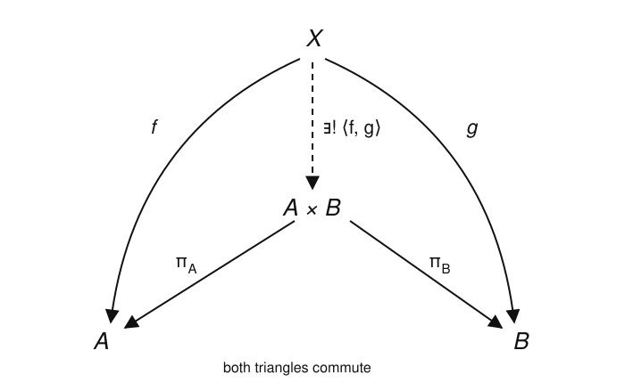

# Category Theory · Lesson 2.1: Universal Properties

> ⏱ ~15 min · Module 2: Universal Properties & the Yoneda Lemma · Builds on: [1.3 Special Arrows & Special Objects](01-03-special-arrows-special-objects.md), [1.4 Functors](01-04-functors.md), [1.5 Natural Transformations](01-05-natural-transformations.md) · Unlocks: [2.2 Representable Functors](02-02-representable-functors.md)

## Why this matters

This is the lesson where category theory earns its slogan: *don't ask what an object is, ask how it maps.* A product, a free group, a tensor product, a quotient — every one of them is normally built by hand (ordered pairs, words, cosets) and then you *prove* the construction was the right one. A universal property flips the order: you write down the single mapping property the thing must satisfy, and you get, for free, a theorem that any two objects satisfying it are the same up to one canonical isomorphism. You stop caring which set-theoretic model you built and start caring only about the property — which is exactly what lets the "same" construction reappear in $\mathbf{Grp}$, $\mathbf{Top}$, $\mathbf{Vect}$, and type theory. This is the engine room for the rest of the course: limits, colimits, adjunctions, and Yoneda are all universal properties wearing different hats.

## The idea

You already met initial and terminal objects in [Lesson 1.3](01-03-special-arrows-special-objects.md): an object $0$ is **initial** if from it there is *exactly one* arrow to every object, and $1$ is **terminal** if into it there is *exactly one* arrow from every object. That word "exactly one" — existence *and* uniqueness of a mediating arrow — is the whole idea of a universal property. Everything in this lesson is a repackaging of "initial" or "terminal" in a cleverly chosen category.

Two flavors, and the direction of the arrows is the entire distinction:

- **Mapping-in (terminal-flavored, limit-like).** You define an object $P$ by declaring how *everything maps into it*. The product $A\times B$ is the best object you can map into if you want to hand back a map to $A$ and a map to $B$ simultaneously.
- **Mapping-out (initial-flavored, colimit-like).** You define an object $P$ by declaring how *it maps out to everything*. The free monoid on a set is the best object you can map out of once you've fixed where the generators go.

"Best" always means the same thing: any competitor factors through $P$ in **one and only one** way. The competitor's data determines a unique *mediating arrow* to (or from) $P$ that reconciles everything. Insisting the mediating arrow is unique is not decoration — it is precisely the hypothesis that makes the uniqueness theorem below run.

## The formal version

**Definition (universal property of a product).** A **product** of objects $A,B$ in a category $\mathcal C$ is an object $P$ together with two morphisms $\pi_A:P\to A$ and $\pi_B:P\to B$ (the **projections**) such that: for every object $X$ and every pair of morphisms $f:X\to A$, $g:X\to B$, there exists a **unique** morphism $u:X\to P$ with
$$\pi_A\circ u = f \qquad\text{and}\qquad \pi_B\circ u = g.$$
We write $P=A\times B$ and $u=\langle f,g\rangle$.

*In words:* $A\times B$ is the object such that giving a map into it is *the same thing* as giving a map into $A$ and a map into $B$ separately — no more, no less, no choices left over.

This is a mapping-*in* property: the data $(f,g)$ lives on arrows *coming into* the picture, and $u$ is forced. Its dual — reverse every arrow — is the **coproduct** $A\sqcup B$, a mapping-*out* property with injections $\iota_A:A\to A\sqcup B$, $\iota_B:B\to A\sqcup B$; you'll meet it in [Lesson 3.1](03-01-products-coproducts.md) and prove one case in P3.

Now the payoff theorem. State it for the two atoms — initial and terminal objects — because *every* universal property is an instance.

**Theorem (uniqueness up to unique isomorphism).** In any category, a terminal object, if one exists, is unique up to a unique isomorphism: if $T$ and $T'$ are both terminal, there is exactly one isomorphism $T\to T'$, and it is compatible with all the structure. The same holds for initial objects.

*In words:* "the" terminal object is an abuse of language that's completely safe — any two candidates are not just isomorphic but *canonically* so, via an iso you didn't get to choose.

*Proof.* Suppose $T,T'$ are both terminal. Terminality of $T'$ gives a **unique** arrow $u:T\to T'$; terminality of $T$ gives a **unique** arrow $v:T'\to T$. Consider $v\circ u:T\to T$. But $T$ is terminal, so there is exactly *one* arrow $T\to T$ — and $\operatorname{id}_T$ is already one — hence $v\circ u=\operatorname{id}_T$. Symmetrically, $u\circ v=\operatorname{id}_{T'}$. So $u$ is an isomorphism, and it was the *unique* arrow $T\to T'$ to begin with. The initial case is the same proof with every arrow reversed. $\blacksquare$

That is the entire argument, and it is only two lines because the uniqueness clause did all the work: the step "$v\circ u$ must equal $\operatorname{id}_T$" is *exactly* the "exactly one arrow" hypothesis. Drop uniqueness and the proof collapses.

**The unifying view (kept light).** A universal property is a terminal or initial object *in a category of candidates*. For the product $A\times B$, build the category $\mathcal C_{/A,B}$ whose **objects** are triples $(X, f:X\to A, g:X\to B)$ — an object equipped with a map to each of $A,B$ — and whose **morphisms** $(X,f,g)\to(X',f',g')$ are arrows $h:X\to X'$ in $\mathcal C$ with $f'\circ h=f$ and $g'\circ h=g$. The product $(A\times B,\pi_A,\pi_B)$ is precisely the **terminal object** of this category: the universal property says every candidate has a *unique* morphism to it. (This $\mathcal C_{/A,B}$ is a *comma category*; we won't need the general machinery.) So the uniqueness theorem above, applied inside $\mathcal C_{/A,B}$, *is* the uniqueness of products — no new work.

Once you see this, the zoo becomes one animal — each is "the universal object with property $P$":

| Construction | Universal property | Flavor |
|---|---|---|
| empty set $\varnothing$ | one map $\varnothing\to X$ for every set $X$ | initial (mapping-out) |
| one-point set $\{*\}$ | one map $X\to\{*\}$ for every set $X$ | terminal (mapping-in) |
| free group $FS$ on a set $S$ | maps out of $FS$ = functions on generators $S$ | initial (mapping-out) |
| tensor product $V\otimes W$ | maps out of $V\otimes W$ = bilinear maps $V\times W\to Z$ | initial (mapping-out) |
| quotient group $G/N$ | maps out of $G/N$ = homs $G\to H$ killing $N$ | initial (mapping-out) |
| product $A\times B$ | maps into $A\times B$ = pairs of maps to $A$ and $B$ | terminal (mapping-in) |

## Picture

The product diagram: the competitor $X$ maps to $A$ and $B$ by whatever $f,g$ you like, and there is one — and only one — dashed arrow $\langle f,g\rangle$ down to $A\times B$ making both triangles commute.

## Worked examples

**Example 1 (mechanical — products are unique up to unique iso).** Suppose $(P,\pi_A,\pi_B)$ and $(Q,\rho_A,\rho_B)$ are *both* products of $A$ and $B$. We prove they are uniquely isomorphic, spelled out rather than quoting the theorem.

Feed $Q$'s projections into $P$'s universal property: with $X=Q$, $f=\rho_A$, $g=\rho_B$, there is a unique $u:Q\to P$ with
$$\pi_A\circ u=\rho_A,\qquad \pi_B\circ u=\rho_B.$$
Symmetrically, feed $P$'s projections into $Q$'s universal property: a unique $v:P\to Q$ with $\rho_A\circ v=\pi_A$ and $\rho_B\circ v=\pi_B$.

Now look at $v\circ u:Q\to Q$ and test it against $Q$'s *own* universal property applied to the pair $(\rho_A,\rho_B)$. Compute the components:
$$\rho_A\circ(v\circ u)=(\rho_A\circ v)\circ u=\pi_A\circ u=\rho_A,\qquad \rho_B\circ(v\circ u)=\pi_B\circ u=\rho_B.$$
So $v\circ u$ is *a* mediating map $Q\to Q$ compatible with $(\rho_A,\rho_B)$. But $\operatorname{id}_Q$ is *also* such a map ($\rho_A\circ\operatorname{id}_Q=\rho_A$, etc.). The universal property says the mediating map is **unique**, so $v\circ u=\operatorname{id}_Q$. The mirror computation gives $u\circ v=\operatorname{id}_P$. Hence $u$ is an isomorphism, it commutes with the projections, and it was the *unique* map $Q\to P$ doing so. $\blacksquare$

The moral: we never opened up what $P$ or $Q$ "is." We only used the mapping property. Any construction that satisfies it — ordered pairs $\{(a,b)\}$ in $\mathbf{Set}$, the direct product group in $\mathbf{Grp}$, the product topology in $\mathbf{Top}$ — is *the* product, canonically.

**Example 2 (why you'd care — the free monoid as an initial object).** Recall a monoid is a set with an associative binary operation and a unit; $\mathbf{Mon}$ is the category of monoids and monoid homomorphisms, with forgetful functor $U:\mathbf{Mon}\to\mathbf{Set}$ throwing away the operation ([Lesson 1.4](01-04-functors.md)). Fix a set $S$. The **free monoid** on $S$ is $FS=S^{*}$, the set of finite **words** $s_1s_2\cdots s_n$ ($n\ge 0$) in the alphabet $S$, with operation *concatenation* and unit the *empty word* $\varepsilon$. There is an insertion of generators $\eta:S\to U(FS)$, $\eta(s)=s$ (the one-letter word).

**Universal property (mapping-out).** For every monoid $M$ and every *function* $f:S\to U(M)$, there is a **unique** monoid homomorphism $\bar f:FS\to M$ with $U(\bar f)\circ\eta=f$.

*In words:* to build a homomorphism out of the free monoid you only have to say where the generators go; the values on all words are then forced.

*Existence.* A homomorphism must send $\varepsilon\mapsto e_M$ (the unit) and respect concatenation, so it has no choice but $\bar f(s_1\cdots s_n)=f(s_1)\cdots f(s_n)$ (product taken in $M$); one checks this is a well-defined homomorphism extending $f$. *Uniqueness.* Any homomorphism agreeing with $f$ on the one-letter words is forced to that same formula on every word, since every word is a product of its letters. So $\bar f$ is unique.

Repackaged as an **initial object**: form the category whose objects are pairs $(M,f:S\to UM)$ — a monoid with a chosen set-map from $S$ — and whose morphisms $(M,f)\to(M',f')$ are homomorphisms $h:M\to M'$ with $U(h)\circ f=f'$. The universal property says $(FS,\eta)$ is the **initial** object: a unique morphism *out* to every candidate. By the theorem, the free monoid is determined up to unique isomorphism — so "free monoid" names a *property*, and "words under concatenation" is merely one model realizing it.

Concretely, take $S=\{a,b\}$ and target $M=(\mathbb Z,+)$ with $f(a)=f(b)=1$. The forced homomorphism is $\bar f(\text{word})=\text{its length}$: $\bar f(abba)=1+1+1+1=4$, $\bar f(\varepsilon)=0$. It is the *only* monoid map $\{a,b\}^{*}\to\mathbb Z$ sending both letters to $1$. This "extend from generators" pattern is exactly the free side of the free⊣forgetful adjunction with [abstract-algebra](../../abstract-algebra/syllabus.md) that you'll formalize in [Lesson 3.4](03-04-adjoint-functors.md).

## Watch out

- You might think "unique up to unique isomorphism" means the object is *literally unique* — but it isn't: $\{(a,b)\}$ and $\{(b,a)\}$ are both products of $A,B$. What's unique is *the object up to a single, forced iso between any two solutions*. The novelty over ordinary "isomorphic" is the word **unique**: the comparison arrow isn't just some iso, it's *the* iso the projections pick out.
- You might think the uniqueness of the mediating arrow $u$ is a technicality you can skip — but it is the load-bearing hypothesis. Existence alone makes many objects "products"; uniqueness is what kills the extra candidates and delivers the isomorphism. Every proof in this lesson cashes in the uniqueness clause exactly once.
- You might think mapping-in and mapping-out are interchangeable — but the arrow direction *is* the definition. A product (map *in*) and a coproduct (map *out*) of the same $A,B$ are usually different objects: in $\mathbf{Set}$ the product is the Cartesian product $A\times B$, the coproduct is the disjoint union $A\sqcup B$. Terminal-flavored ≠ initial-flavored.

## One-liner

> Define a thing by the maps it must admit and insist the mediating map is unique; the thing is then pinned down up to one canonical isomorphism — you never needed its guts.

## Problems

**P1 (🟢)** Work in $\mathbf{Set}$. (a) Show that any one-element set $\{*\}$ is a terminal object. (b) Conclude, using the uniqueness theorem's two-line argument, that any two one-element sets are *uniquely* isomorphic — and say explicitly what the unique iso is.

**P2 (🟡)** Let $A\times B$ be a product with projections $\pi_A,\pi_B$, and let $h:X\to A\times B$ be *any* morphism into it. Prove the "extensionality" rule
$$h=\langle \pi_A\circ h,\ \pi_B\circ h\rangle,$$
i.e. a map into a product is completely determined by its two components. (Hint: what unique map does the universal property assign to the pair $(\pi_A\circ h,\pi_B\circ h)$?)

**P3 (🔴, optional)** In $\mathbf{Set}$, let $A\sqcup B=(\{0\}\times A)\cup(\{1\}\times B)$ with injections $\iota_A(a)=(0,a)$ and $\iota_B(b)=(1,b)$. Prove this satisfies the **coproduct** universal property: for every set $Y$ and functions $p:A\to Y$, $q:B\to Y$, there is a *unique* function $u:A\sqcup B\to Y$ with $u\circ\iota_A=p$ and $u\circ\iota_B=q$. Note which way every arrow points compared to the product, and name the flavor.

Solutions

**P1** (a) Let $T=\{*\}$ and let $X$ be any set. A function $X\to T$ must send each $x$ to the only available element $*$; there is exactly one such function, the constant map. So there is a unique arrow $X\to T$ for every $X$, i.e. $T$ is terminal.

(b) Let $T=\{*\}$ and $T'=\{\star\}$ be two one-element sets, both terminal by (a). Terminality of $T'$ gives a unique $u:T\to T'$; terminality of $T$ gives a unique $v:T'\to T$. Then $v\circ u:T\to T$ is *an* arrow $T\to T$, but terminality of $T$ says there is only one such arrow and $\operatorname{id}_T$ is it, so $v\circ u=\operatorname{id}_T$; symmetrically $u\circ v=\operatorname{id}_{T'}$. Hence $u$ is an isomorphism, and it was the *unique* arrow $T\to T'$. Explicitly $u$ is the only possible function $*\mapsto\star$ — the bijection matching the single elements. $\blacksquare$

**P2** Set $f:=\pi_A\circ h$ and $g:=\pi_B\circ h$. By the universal property of the product applied to the pair $(f,g)$, there is a *unique* morphism $u:X\to A\times B$ satisfying $\pi_A\circ u=f$ and $\pi_B\circ u=g$; by definition $u=\langle f,g\rangle=\langle\pi_A\circ h,\pi_B\circ h\rangle$. But $h$ *itself* satisfies these two equations: $\pi_A\circ h=f$ and $\pi_B\circ h=g$ by the very definition of $f,g$. Since the mediating map is unique, $h=u=\langle\pi_A\circ h,\pi_B\circ h\rangle$. $\blacksquare$ (This is why "a map into a product = a pair of maps" is a genuine bijection, not just a surjection: distinct maps into $A\times B$ have distinct component pairs.)

**P3** *Existence.* Every element of $A\sqcup B$ has exactly one of the forms $(0,a)$ or $(1,b)$ (the tags $0,1$ are disjoint), so we may define $u$ by cases without ambiguity:
$$u(0,a)=p(a),\qquad u(1,b)=q(b).$$
This is a well-defined function $A\sqcup B\to Y$, and $u(\iota_A(a))=u(0,a)=p(a)$, $u(\iota_B(b))=u(1,b)=q(b)$, so $u\circ\iota_A=p$ and $u\circ\iota_B=q$.

*Uniqueness.* Suppose $u'$ also satisfies $u'\circ\iota_A=p$ and $u'\circ\iota_B=q$. Then for every $a$, $u'(0,a)=u'(\iota_A(a))=p(a)=u(0,a)$, and for every $b$, $u'(1,b)=u'(\iota_B(b))=q(b)=u(1,b)$. Since elements of these two forms exhaust $A\sqcup B$, we get $u'=u$.

So $(A\sqcup B,\iota_A,\iota_B)$ satisfies the coproduct universal property, and by the general theorem any coproduct of $A,B$ is uniquely isomorphic to it. Every arrow is reversed relative to the product — the injections point *into* $A\sqcup B$ and the forced map $u$ points *out* of it — so this is the mapping-**out**, initial-flavored dual. $\blacksquare$

## Flashback

**From [Lesson 1.5](01-05-natural-transformations.md) (natural transformations — chase the square):** Let $F=\operatorname{id}_{\mathbf{Set}}$ be the identity functor, and let $G:\mathbf{Set}\to\mathbf{Set}$ be the "square" functor $G(X)=X\times X$ on objects and $G(f)=f\times f$ on a morphism $f$, where $(f\times f)(x,x')=(f(x),f(x'))$. For each set $X$ define the diagonal $\alpha_X:X\to X\times X$, $\alpha_X(x)=(x,x)$.

(a) Check $G$ respects one composite: $G(g\circ f)=G(g)\circ G(f)$. (b) Prove $\alpha:F\Rightarrow G$ is a natural transformation by chasing its naturality square for an arbitrary $f:X\to Y$.

Solution

(a) For $f:X\to Y$, $g:Y\to Z$ and any $(x,x')\in X\times X$,
$$\big(G(g)\circ G(f)\big)(x,x')=(g\times g)\big(f(x),f(x')\big)=\big(g(f(x)),g(f(x'))\big)=\big((g\circ f)(x),(g\circ f)(x')\big)=G(g\circ f)(x,x').$$
So $G(g\circ f)=G(g)\circ G(f)$. (And $G(\operatorname{id}_X)=\operatorname{id}_X\times\operatorname{id}_X=\operatorname{id}_{X\times X}$, so $G$ is a functor.)

(b) Naturality of $\alpha$ demands, for every $f:X\to Y$, that $G(f)\circ\alpha_X=\alpha_Y\circ F(f)$, i.e. the square with top $\alpha_X$, sides $F(f)=f$ (left) and $G(f)=f\times f$ (right), and bottom $\alpha_Y$ commutes. Chase an arbitrary $x\in X$ both ways:
$$\big(G(f)\circ\alpha_X\big)(x)=(f\times f)(x,x)=(f(x),f(x)),$$
$$\big(\alpha_Y\circ F(f)\big)(x)=\alpha_Y(f(x))=(f(x),f(x)).$$
The two agree for every $x$, so the square commutes for every $f$; hence $\alpha$ is natural. $\blacksquare$ (Each $\alpha_X$ is injective but not surjective, so this is a natural transformation that is *not* a natural isomorphism — naturality is about the squares commuting, not about the components being invertible.)

## Connections

- **Backward:** this is [Lesson 1.3](01-03-special-arrows-special-objects.md)'s initial/terminal objects with the volume turned up — every universal property is "terminal (or initial) object in a category of candidates," and the uniqueness proof is verbatim the one from 1.3. The candidate categories are assembled from the functors and naturality of [1.4](01-04-functors.md)/[1.5](01-05-natural-transformations.md).
- **Forward:** [Lesson 2.2](02-02-representable-functors.md) turns "how everything maps in/out" into the functor $\operatorname{Hom}(A,-)$ or $\operatorname{Hom}(-,A)$, and [2.3](02-03-yoneda-lemma.md)'s Yoneda lemma promotes today's slogan to a theorem: an object *is* its web of maps. [Lesson 3.1](03-01-products-coproducts.md) and the rest of Module 3 are universal properties industrialized — products, coproducts, pullbacks, limits, and adjunctions.
- **Sideways ([abstract-algebra](../../abstract-algebra/syllabus.md)):** the free monoid, free group, quotient group $G/N$, and tensor product $V\otimes W$ are *all* the same "universal object with property $P$" — the free ones initial (mapping-out from generators), the products terminal (mapping-in). The "extend a map from generators" move in Example 2 is the free⊣forgetful adjunction you'll pin down in [Lesson 3.4](03-04-adjoint-functors.md).
