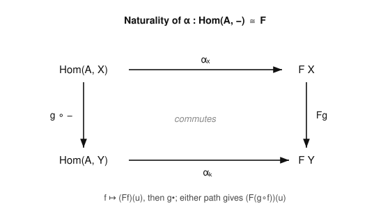
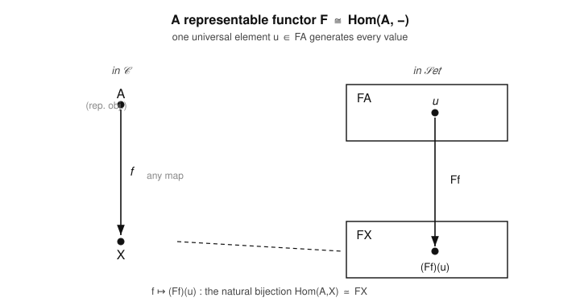

# Category Theory · Lesson 2.2: Representable Functors

> ⏱ ~15 min · Module 2: Universal Properties & the Yoneda Lemma · Builds on: [Lesson 2.1](02-01-universal-properties.md), [functors (Lesson 1.4)](01-04-functors.md) · Unlocks: [the Yoneda lemma (Lesson 2.3)](02-03-yoneda-lemma.md)

## Why this matters

In [Lesson 2.1](02-01-universal-properties.md) a universal property pinned down an object by describing all the maps into or out of it. That description *is* a functor to $\mathbf{Set}$: "the set of maps from $A$ to $X$" is a rule that eats an object $X$ and spits out a set. This lesson names the pattern. A functor is **representable** when it's secretly just "maps out of a fixed object $A$" — and recognizing that gives you $A$'s entire universal property in one line. It's the last piece of vocabulary before the Yoneda lemma (Lesson 2.3), which will say that objects and their representable functors are, for all practical purposes, *the same thing*. Nearly every "free," "underlying," or "classifying" construction you meet — in algebra, topology, or type theory — turns out to be representable, and spotting the representing object is how you find the slick definition.

## The idea

Fix an object $A$ in a category $\mathcal{C}$. The rule
$$X \ \longmapsto\ \operatorname{Hom}_{\mathcal{C}}(A, X)$$
sends each object to the *set of arrows out of $A$ into it*. From [Lesson 1.4](01-04-functors.md) this is a functor $\operatorname{Hom}_{\mathcal{C}}(A, -) : \mathcal{C} \to \mathbf{Set}$: on a morphism $g : X \to Y$ it acts by **post-composition**, $f \mapsto g \circ f$. Call any functor of this shape a **hom-functor**.

Now flip the question. You're handed some functor $F : \mathcal{C} \to \mathbf{Set}$ out in the wild — say the forgetful functor that strips a group down to its underlying set. Might it *be* a hom-functor in disguise? If you can find an object $A$ so that $F(X)$ is naturally the same set as $\operatorname{Hom}_{\mathcal{C}}(A, X)$ for every $X$, then $F$ is **representable** and $A$ **represents** it.

Here is the magic that makes this useful. If $F \cong \operatorname{Hom}(A, -)$, then in particular $F(A) \cong \operatorname{Hom}(A, A)$, and that hom-set contains a canonical element: the identity $\operatorname{id}_A$. Trace $\operatorname{id}_A$ across the isomorphism and you get one distinguished element $u \in F(A)$ — the **universal element**. It's universal because *everything else is generated from it*: for any object $X$, every element of $F(X)$ is obtained by pushing $u$ forward along a unique map $A \to X$. One element of one set encodes the whole functor. That's the same "one map to rule them all" phenomenon as a universal property — now packaged as a single natural isomorphism.

## The formal version

**Definition (representable functor).** A functor $F : \mathcal{C} \to \mathbf{Set}$ is **representable** if there is an object $A \in \mathcal{C}$ and a natural isomorphism
$$\alpha : \operatorname{Hom}_{\mathcal{C}}(A, -) \ \xrightarrow{\ \cong\ }\ F .$$
The object $A$ is a **representing object** for $F$, and the pair $(A, \alpha)$ is a **representation**. A functor $G : \mathcal{C}^{\mathrm{op}} \to \mathbf{Set}$ (a *contravariant* functor on $\mathcal{C}$) is representable when $G \cong \operatorname{Hom}_{\mathcal{C}}(-, A)$ for some $A$.

*In words:* $F$ is representable when its value $F(X)$ is, uniformly in $X$, just the set of arrows from one fixed object $A$ into $X$.

Naturality of $\alpha$ is the whole content, so unpack it. For every morphism $g : X \to Y$ the square below **commutes** — the top-right and left-bottom paths agree:

*In words:* it doesn't matter whether you translate a map $A \to X$ into an element of $F(X)$ and then apply $Fg$, or first post-compose with $g$ and translate afterward — you land on the same element of $F(Y)$.

**The universal element.** Given a representation $(A, \alpha)$, define
$$u \ :=\ \alpha_A(\operatorname{id}_A) \ \in\ F(A).$$
Chasing naturality (take $X = A$ in the square, feed in $\operatorname{id}_A$) forces a clean formula for *every* component:
$$\alpha_X(f) \ =\ (Ff)(u) \qquad \text{for all } f : A \to X. \tag{$\star$}$$

*In words:* the isomorphism is completely determined by where it sends $\operatorname{id}_A$. Once you know the single element $u$, you recover $\alpha$ everywhere by pushing $u$ forward: $f \mapsto (Ff)(u)$.

Because $\alpha_X$ is a **bijection**, $(\star)$ says exactly:

> **Universal property of $(A, u)$.** For every object $X$ and every element $x \in F(X)$, there is a *unique* morphism $f : A \to X$ with $(Ff)(u) = x$.

This is the same shape of statement as a universal property from [Lesson 2.1](02-01-universal-properties.md): a unique map characterized by what it does to one distinguished piece of data. "Representable functor" and "universal property" are two names for one idea — and the promise that this correspondence is a genuine theorem is the **Yoneda lemma**, Lesson 2.3. (We'll take $(\star)$ on faith here via the naturality chase; Yoneda proves the full dictionary.)

## Picture

The representing object $A$ sits on the left with its universal element $u \in F(A)$ on the right. Any map $f : A \to X$ in $\mathcal{C}$ is carried by the functor to a function $Ff : F(A) \to F(X)$, and $u$ rides along to $(Ff)(u) \in F(X)$. The dashed bridge is the bijection $\operatorname{Hom}(A, X) \cong F(X)$: maps out of $A$ on one side, elements of $F(X)$ on the other, matched by $f \mapsto (Ff)(u)$.

## Worked examples

**Example 1 (the forgetful functor $U : \mathbf{Grp} \to \mathbf{Set}$ is represented by $\mathbb{Z}$).** Let $U$ send a group $G$ to its underlying set and a homomorphism to itself-as-a-function. Claim: $\mathbb{Z}$ (the integers under addition) represents $U$, with universal element $1 \in \mathbb{Z}$.

*The bijection.* A group homomorphism $\varphi : \mathbb{Z} \to G$ is completely determined by $\varphi(1)$: since every integer is a sum of $\pm 1$'s, $\varphi(n) = \varphi(1)^n$ (writing $G$ multiplicatively), and *any* choice of $\varphi(1) = g \in G$ yields a valid homomorphism because $\mathbb{Z}$ is free on the one generator $1$. So
$$\Phi_G : \operatorname{Hom}_{\mathbf{Grp}}(\mathbb{Z}, G) \ \longrightarrow\ U(G), \qquad \varphi \longmapsto \varphi(1)$$
is a bijection: injective (two homs agreeing at $1$ agree everywhere) and surjective (every $g$ is hit by the hom $n \mapsto g^n$). Its inverse sends $g$ to that hom.

*Naturality.* For a homomorphism $h : G \to H$ we must check the square with $\Phi_G, \Phi_H$ on the rows and post-composition / $U(h)$ on the sides commutes. Take $\varphi : \mathbb{Z} \to G$. Going right-then-down: $\Phi_G(\varphi) = \varphi(1)$, then $U(h)$ gives $h(\varphi(1))$. Going down-then-right: post-compose to get $h \circ \varphi$, then evaluate at $1$ to get $(h \circ \varphi)(1) = h(\varphi(1))$. Equal. So $\Phi$ is a natural isomorphism and $U \cong \operatorname{Hom}_{\mathbf{Grp}}(\mathbb{Z}, -)$.

*The universal element.* Following the recipe, $u = \Phi_{\mathbb{Z}}(\operatorname{id}_{\mathbb{Z}}) = \operatorname{id}_{\mathbb{Z}}(1) = 1$. And $(\star)$ reads: every element $g$ of every group $G$ is $(U\varphi)(1) = \varphi(1)$ for a unique $\varphi : \mathbb{Z} \to G$. In plain terms: **a homomorphism out of $\mathbb{Z}$ is exactly a choice of one group element** — picking where $1$ goes. That single sentence is $\mathbb{Z}$'s universal property as the free group on one generator, recovered for free. This is the free $\dashv$ forgetful bridge to [abstract-algebra](../../abstract-algebra/syllabus.md), which reappears as a genuine adjunction in Module 3.

**Example 2 (the contravariant power set is represented by a two-element set).** Let $P : \mathbf{Set}^{\mathrm{op}} \to \mathbf{Set}$ send a set $X$ to its power set $P(X)$ (all subsets), and a function $g : X \to Y$ to the **preimage** map $Pg : P(Y) \to P(X)$, $S \mapsto g^{-1}(S)$. (Preimage runs backwards, which is why $P$ is contravariant.) Claim: $P$ is represented by the two-element set $\mathbf{2} = \{0, 1\}$, i.e. $P \cong \operatorname{Hom}_{\mathbf{Set}}(-, \mathbf{2})$.

*The bijection.* A subset $S \subseteq X$ is the same data as its **characteristic function** $\chi_S : X \to \mathbf{2}$, where $\chi_S(a) = 1$ iff $a \in S$. The passage $S \leftrightarrow \chi_S$ is a bijection
$$P(X) \ \cong\ \operatorname{Hom}_{\mathbf{Set}}(X, \mathbf{2}),$$
with inverse $g \mapsto g^{-1}(\{1\})$. Naturality (contravariant version): for $g : X \to Y$, chasing $S \subseteq Y$ one way gives the subset $g^{-1}(S) \subseteq X$; the other way sends $\chi_S$ to $\chi_S \circ g$, whose $1$-fiber is $\{a : \chi_S(g(a)) = 1\} = g^{-1}(S)$. They match.

*The universal element.* For a contravariant representation the universal element lives in $P(\mathbf{2})$ and corresponds to $\operatorname{id}_{\mathbf{2}}$; since $\operatorname{id}_{\mathbf{2}}^{-1}(\{1\}) = \{1\}$, it is the subset
$$u = \{1\} \ \subseteq\ \mathbf{2}.$$
Then $(\star)$ becomes: every subset $S \subseteq X$ is the preimage $g^{-1}(\{1\})$ of the universal subset under a *unique* map $g : X \to \mathbf{2}$ — namely $g = \chi_S$. The set $\mathbf{2}$ is the **subobject classifier** of $\mathbf{Set}$: "being a subset" is classified by mapping into two truth values, and $\{1\} = \text{true}$ is the universal subset everything pulls back from.

Two more to file away, same mechanism (a map *out* of the free structure on one generator = one element of the target):

| Forgetful functor | Represented by | Universal element |
|---|---|---|
| $U : \mathbf{Grp} \to \mathbf{Set}$ | $\mathbb{Z}$ | $1 \in \mathbb{Z}$ |
| $U : \mathbf{Ring} \to \mathbf{Set}$ | $\mathbb{Z}[x]$ | $x \in \mathbb{Z}[x]$ |
| $U : \mathbf{Vect}_k \to \mathbf{Set}$ | $k$ (as a $1$-dim space) | $1 \in k$ |

A ring homomorphism $\mathbb{Z}[x] \to R$ is a choice of where $x$ goes, i.e. one element of $R$; a linear map $k \to V$ is a choice of where $1$ goes, i.e. one vector.

## Watch out

- **A representing object is not unique on the nose — it's unique up to unique isomorphism.** Any two representing objects are canonically isomorphic (P3), so "*the* representing object" is a mild abuse. $\mathbf{2}$ could be replaced by any other two-element set; what's determined is the object *and its universal element* up to unique iso.
- **You might think "$F(A) \cong \operatorname{Hom}(A,A)$ as sets" is enough to represent $F$ — it isn't.** Representability demands a *natural* isomorphism at *every* object simultaneously, with the naturality squares commuting. A coincidence of cardinalities at one object proves nothing; the universal element $u$ and formula $(\star)$ are what tie all the components together.
- **Mind the variance.** $\operatorname{Hom}(A, -)$ is covariant (post-compose, arrows go forward); $\operatorname{Hom}(-, A)$ is contravariant (pre-compose, arrows reverse). The power-set example is contravariant precisely because $Pg$ takes preimages. Naming the wrong variance sends your universal element to the wrong hom-set.

## One-liner

> A functor is representable when it's secretly "maps out of a fixed object $A$," and its whole behavior is generated by pushing one universal element $u \in F(A)$ forward along $f \mapsto (Ff)(u)$.

## Problems

**P1 (🟢)** Show that the forgetful functor $U : \mathbf{Vect}_k \to \mathbf{Set}$ is represented by the one-dimensional space $k$. Exhibit the bijection $\operatorname{Hom}_{\mathbf{Vect}_k}(k, V) \cong U(V)$ explicitly and name the universal element $u \in U(k)$.

**P2 (🟡)** Consider $F : \mathbf{Set} \to \mathbf{Set}$ given on objects by $F(X) = X \times X$ (ordered pairs of elements) and on a function $g : X \to Y$ by $F(g)(x_1, x_2) = (g(x_1), g(x_2))$. Show $F$ is representable, find its representing object $A$, and identify the universal element $u \in F(A)$.

**P3 (🔴, optional)** Let $F : \mathbf{Ring} \to \mathbf{Set}$ send each ring $R$ to its set of **idempotents** $\{\,r \in R : r^2 = r\,\}$ (and a ring homomorphism to its restriction — first check this lands where claimed). Show $F$ is representable, and identify the representing ring and its universal element. *(Hint: mimic $\mathbb{Z}[x]$, but force the generator to be idempotent.)*

Solutions

**P1** A linear map $\varphi : k \to V$ is determined by the single vector $\varphi(1) \in V$: for any scalar $c$, linearity gives $\varphi(c) = \varphi(c \cdot 1) = c\,\varphi(1)$, so $\varphi$ is scalar multiplication of the fixed vector $\varphi(1)$. Conversely every vector $v \in V$ arises from the map $c \mapsto c v$, which is linear. Hence
$$\Phi_V : \operatorname{Hom}_{\mathbf{Vect}_k}(k, V) \to U(V), \qquad \varphi \mapsto \varphi(1)$$
is a bijection with inverse $v \mapsto (c \mapsto cv)$. Naturality: for a linear map $h : V \to W$, right-then-down sends $\varphi \mapsto \varphi(1) \mapsto h(\varphi(1))$, while down-then-right sends $\varphi \mapsto h \circ \varphi \mapsto (h\circ\varphi)(1) = h(\varphi(1))$ — equal. So $U \cong \operatorname{Hom}_{\mathbf{Vect}_k}(k, -)$. The universal element is $u = \Phi_k(\operatorname{id}_k) = \operatorname{id}_k(1) = 1 \in k$. Reading $(\star)$: every vector $v$ is $(U\varphi)(1)$ for the unique $\varphi$ scaling $1$ to $v$ — the universal property of $k$ as the free vector space on one generator.

**P2** A function out of a **two-element set** is exactly an ordered pair: fixing $A = \mathbf{2} = \{0,1\}$, a function $f : \mathbf{2} \to X$ is the data $(f(0), f(1)) \in X \times X$. So
$$\Psi_X : \operatorname{Hom}_{\mathbf{Set}}(\mathbf{2}, X) \to X \times X, \qquad f \mapsto (f(0), f(1))$$
is a bijection (a pair determines the function value-by-value, and any pair is achievable). Naturality: for $g : X \to Y$, right-then-down sends $f \mapsto (f(0), f(1)) \mapsto (g f(0), g f(1))$; down-then-right sends $f \mapsto g \circ f \mapsto ((g f)(0), (g f)(1)) = (gf(0), gf(1))$ — equal. Thus $F \cong \operatorname{Hom}_{\mathbf{Set}}(\mathbf{2}, -)$, so $F$ is represented by $A = \mathbf{2}$. The universal element is
$$u = \Psi_{\mathbf 2}(\operatorname{id}_{\mathbf 2}) = (\operatorname{id}(0), \operatorname{id}(1)) = (0, 1) \in \mathbf{2} \times \mathbf{2} = F(\mathbf 2).$$
Sanity check on $(\star)$: an arbitrary pair $(x_1, x_2) \in X \times X$ equals $(Ff)(u) = (f(0), f(1))$ for the unique $f$ with $f(0) = x_1,\, f(1) = x_2$. (More generally $X \mapsto X^n$ is represented by an $n$-element set.)

**P3** *Well-defined on morphisms.* If $r^2 = r$ in $R$ and $h : R \to S$ is a ring homomorphism, then $h(r)^2 = h(r^2) = h(r)$, so $h$ carries idempotents to idempotents and $F(h) := h|_{\text{idem}}$ makes sense; identities and composites are clearly respected, so $F$ is a functor.

*Representing ring.* Take $A = \mathbb{Z}[x]/(x^2 - x)$. A ring homomorphism $\varphi : \mathbb{Z}[x]/(x^2-x) \to R$ is a ring hom $\mathbb{Z}[x] \to R$ (a free choice of $\varphi(x) \in R$) subject to killing $x^2 - x$, i.e. subject to $\varphi(x)^2 = \varphi(x)$. So $\varphi$ is exactly a choice of an idempotent $\varphi(x) \in R$:
$$\Theta_R : \operatorname{Hom}_{\mathbf{Ring}}\!\big(\mathbb{Z}[x]/(x^2-x),\, R\big) \xrightarrow{\ \cong\ } F(R), \qquad \varphi \mapsto \varphi(x),$$
a bijection with inverse sending an idempotent $e$ to the hom $x \mapsto e$. Naturality is the same evaluate-at-$x$ chase as Example 1: for $h : R \to S$, both routes send $\varphi$ to $h(\varphi(x))$. Hence $F \cong \operatorname{Hom}_{\mathbf{Ring}}(\mathbb{Z}[x]/(x^2-x), -)$.

*Universal element.* $u = \Theta_A(\operatorname{id}_A) = \operatorname{id}_A(x) = \bar{x}$, the class of $x$ — which is idempotent in $A$ by construction ($\bar x^2 = \bar x$). Every idempotent in every ring is the image of this one universal idempotent under a unique homomorphism. $\blacksquare$

## Flashback

**From Lesson 2.1 (Universal Properties):** A **terminal object** $1$ of a category $\mathcal{C}$ is one such that for every object $X$ there is exactly one morphism $X \to 1$. Prove that if $\mathcal{C}$ has two terminal objects $1$ and $1'$, they are isomorphic *via a unique isomorphism*.

Solution

Because $1'$ is terminal, there is a unique morphism $f : 1 \to 1'$. Because $1$ is terminal, there is a unique morphism $g : 1' \to 1$. Consider the composite $g \circ f : 1 \to 1$. But $1$ is terminal, so there is only *one* morphism $1 \to 1$; the identity $\operatorname{id}_1$ is such a morphism, hence $g \circ f = \operatorname{id}_1$. Symmetrically, $f \circ g : 1' \to 1'$ must equal the unique morphism $1' \to 1'$, namely $\operatorname{id}_{1'}$. Therefore $f$ is an isomorphism with inverse $g$.

Uniqueness: any isomorphism $1 \to 1'$ is in particular a morphism $1 \to 1'$, and terminality of $1'$ says there is exactly one such morphism — so $f$ is the *only* map $1 \to 1'$, isomorphism or not. Hence $1 \cong 1'$ by a unique isomorphism. $\blacksquare$

(This is the [Lesson 2.1](02-01-universal-properties.md) uniqueness pattern in its purest form. Note the tie-in to this lesson: a terminal object represents the constant functor $X \mapsto \{*\}$, and P3's Watch-out remark that representing objects are unique up to unique iso is the very same argument run on universal elements.)

## Connections

- **Backward:** this repackages the universal properties of [Lesson 2.1](02-01-universal-properties.md) as natural isomorphisms to hom-functors ([Lesson 1.4](01-04-functors.md)); the "unique mediating map" becomes the bijectivity of $\alpha_X$, and the "distinguished data" becomes the universal element $u$.
- **Forward:** [Lesson 2.3](02-03-yoneda-lemma.md) proves the Yoneda lemma, $\operatorname{Nat}(\operatorname{Hom}(A,-), F) \cong F(A)$, which *is* the promise that $(\star)$ always holds — natural transformations out of a hom-functor are exactly elements of $F(A)$, and the universal element is the general mechanism. Representable functors are also the seed of adjunctions in Module 3: $\operatorname{Hom}(FX, Y) \cong \operatorname{Hom}(X, UY)$ says $\operatorname{Hom}(FX, -)$ is represented, in the other variable, by $UX$.
- **Sideways ([abstract-algebra](../../abstract-algebra/syllabus.md)):** "free object on one generator represents the forgetful functor" is the categorical face of $\mathbb{Z}$ (free group), $\mathbb{Z}[x]$ (free ring), and $k$ (free module) — the free $\dashv$ forgetful adjunction seen through one object. In [programming-languages](../../programming-languages/syllabus.md), the subobject classifier $\mathbf{2}$ generalizes to the type of propositions, and "representable" is how a datatype is characterized by the operations that consume or produce it.
