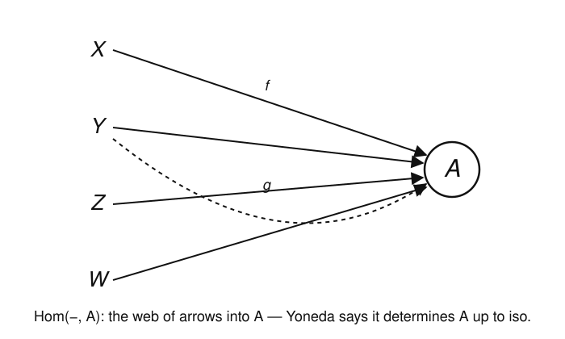
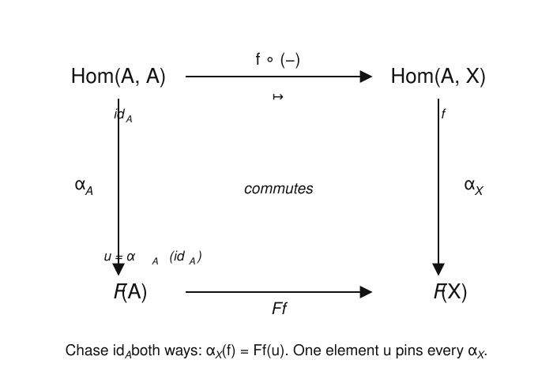

# Category Theory · Lesson 2.3: The Yoneda Lemma

> ⏱ ~15 min · Module 2: Universal Properties & the Yoneda Lemma · Builds on: [representable functors 2.2](02-02-representable-functors.md), [natural transformations 1.5](01-05-natural-transformations.md) · Unlocks: [products & coproducts 3.1](03-01-products-coproducts.md)

## Why this matters

Category theory's founding slogan is "an object is known by its maps." The Yoneda lemma is the theorem that turns that slogan into arithmetic: it computes the set of *all* natural transformations out of a hom-functor and finds it is nothing more than a single set $F(A)$. From it fall the facts you'll use every week — that representing objects are unique up to a unique iso, that a universal property pins its object down completely, that two objects with the same web of maps *are* the same object. In algebraic topology the analogous "represented" functors (cohomology, classifying spaces) are the whole game; in `programming-languages`, Yoneda is the reason a fully polymorphic function is secretly just a piece of data. It is the deepest easy theorem in mathematics: the proof is three lines of identity-chasing, and it never stops paying out.

## The idea

Fix an object $A$ and consider the covariant hom-functor $\operatorname{Hom}(A,-)$, which sends each object $X$ to the set of arrows $A\to X$ (recall from [Lesson 2.2](02-02-representable-functors.md) that a morphism $f:X\to Y$ acts by post-composition, $g\mapsto f\circ g$). Now ask: how many natural transformations $\alpha:\operatorname{Hom}(A,-)\Rightarrow F$ are there, into some other $\mathbf{Set}$-valued functor $F$?

Here is the punchline before the machinery. The set $\operatorname{Hom}(A,A)$ contains one distinguished element that every other arrow out of $A$ is built from: the identity $\operatorname{id}_A$. Every arrow $f:A\to X$ is $f\circ\operatorname{id}_A$ — it is what post-composition by $f$ *does to the identity*. Naturality forces $\alpha$ to respect post-composition, so **once you know where $\alpha$ sends $\operatorname{id}_A$, you know everything**. The whole natural transformation collapses to a single choice: one element of $F(A)$.

You have met this shape before. A group homomorphism out of $\mathbb{Z}$ is determined by where $1$ goes, because $1$ generates $\mathbb{Z}$; a linear map is determined by its values on a basis. The identity $\operatorname{id}_A$ is the "generator" of the functor $\operatorname{Hom}(A,-)$, and $F(A)$ is where it may be sent. That correspondence is the Yoneda lemma.

## The formal version

First, the object we are counting. Given functors $F,G:\mathcal{C}\to\mathbf{Set}$, write $\operatorname{Nat}(F,G)$ for the collection of natural transformations $F\Rightarrow G$ — a natural transformation being a family of functions $\alpha_X:F(X)\to G(X)$, one per object, such that for every $f:X\to Y$ the naturality square commutes: $G(f)\circ\alpha_X=\alpha_Y\circ F(f)$ (this is [Lesson 1.5](01-05-natural-transformations.md)).

**The Yoneda Lemma.** Let $\mathcal{C}$ be a locally small category, $A\in\mathcal{C}$ an object, and $F:\mathcal{C}\to\mathbf{Set}$ a functor. Then there is a bijection
$$
\operatorname{Nat}\bigl(\operatorname{Hom}_{\mathcal{C}}(A,-),\,F\bigr)\;\cong\;F(A),
\qquad
\alpha\;\longmapsto\;\alpha_A(\operatorname{id}_A),
$$
and this bijection is **natural in both $A$ and $F$**.

*In words:* a natural transformation out of the hom-functor $\operatorname{Hom}(A,-)$ is exactly the same data as one element of $F(A)$ — namely the element it names when you feed it the identity.

The inverse map is forced and worth writing down. Given an element $u\in F(A)$, define a transformation $\widehat{u}$ by
$$
\widehat{u}_X:\operatorname{Hom}(A,X)\to F(X),\qquad \widehat{u}_X(f)=F(f)(u).
$$
*In words:* "take the arrow $f:A\to X$, push $u$ forward along it." That $\alpha\mapsto\alpha_A(\operatorname{id}_A)$ and $u\mapsto\widehat{u}$ are inverse is the content of the proof below.

Two consequences we will lean on for the rest of the course.

**The Yoneda embedding.** Sending each object $A$ to the presheaf $\operatorname{Hom}(-,A)$ (the *contravariant* hom-functor: all arrows *into* $A$) defines a functor
$$
\mathcal{C}\;\hookrightarrow\;[\mathcal{C}^{\mathrm{op}},\mathbf{Set}],\qquad A\mapsto \operatorname{Hom}(-,A),
$$
and this functor is **full and faithful**: it induces a bijection $\operatorname{Hom}_{\mathcal{C}}(A,B)\cong\operatorname{Nat}\bigl(\operatorname{Hom}(-,A),\operatorname{Hom}(-,B)\bigr)$.

*In words:* an object and its web of incoming maps carry exactly the same information — no arrows are lost, none are invented. "An object is completely known by the maps into it."

**The Yoneda corollary.** If $\operatorname{Hom}(-,A)\cong\operatorname{Hom}(-,B)$ naturally, then $A\cong B$. (Equally, $\operatorname{Hom}(A,-)\cong\operatorname{Hom}(B,-)$ naturally $\Rightarrow A\cong B$.)

*In words:* objects with isomorphic webs of maps are isomorphic. This is the single fact that powers every "unique up to unique isomorphism" argument — a representing object, a product, a limit — for the rest of the subject.

## Picture

The embedding view: $A$ is surrounded by every arrow pointing at it, and Yoneda says this incoming web alone determines $A$.

The proof lives in one naturality square. Feed the identity in at the top-left and chase it both ways to $F(X)$: the two paths must agree, which pins every value of $\alpha$ to the single element $u=\alpha_A(\operatorname{id}_A)$.

## Worked examples

**Example 1 (the proof — identity-chasing).** We show the two maps are mutually inverse.

*A natural transformation is determined by $u:=\alpha_A(\operatorname{id}_A)$.* Let $\alpha:\operatorname{Hom}(A,-)\Rightarrow F$ be natural and let $f:A\to X$ be any arrow. Naturality of $\alpha$ at the morphism $f$ is the commuting square
$$
F(f)\circ \alpha_A \;=\; \alpha_X\circ \operatorname{Hom}(A,f),
$$
where $\operatorname{Hom}(A,f):\operatorname{Hom}(A,A)\to\operatorname{Hom}(A,X)$ is post-composition, $g\mapsto f\circ g$. Evaluate both sides at the element $\operatorname{id}_A\in\operatorname{Hom}(A,A)$. The right side is
$$
\alpha_X\bigl(\operatorname{Hom}(A,f)(\operatorname{id}_A)\bigr)=\alpha_X(f\circ\operatorname{id}_A)=\alpha_X(f),
$$
and the left side is $F(f)\bigl(\alpha_A(\operatorname{id}_A)\bigr)=F(f)(u)$. Therefore
$$
\boxed{\;\alpha_X(f)=F(f)(u)\;}\qquad\text{for every }f:A\to X.
$$
So $\alpha$ is completely reconstructed from the single element $u$: the map $\Phi(\alpha)=\alpha_A(\operatorname{id}_A)$ is **injective**, and any $\alpha$ equals $\widehat{u}$ for $u=\Phi(\alpha)$.

*Every $u$ arises, and $\widehat{u}$ really is natural.* Given $u\in F(A)$, define $\widehat{u}_X(f)=F(f)(u)$. Check naturality: for $h:X\to Y$ we need $F(h)\circ\widehat{u}_X=\widehat{u}_Y\circ\operatorname{Hom}(A,h)$. Evaluate at $f\in\operatorname{Hom}(A,X)$:
$$
\bigl(F(h)\circ\widehat{u}_X\bigr)(f)=F(h)\bigl(F(f)(u)\bigr)=F(h\circ f)(u),
$$
using functoriality $F(h)\circ F(f)=F(h\circ f)$; and
$$
\bigl(\widehat{u}_Y\circ\operatorname{Hom}(A,h)\bigr)(f)=\widehat{u}_Y(h\circ f)=F(h\circ f)(u).
$$
They agree, so $\widehat{u}$ is natural, giving surjectivity of $\Phi$. Finally the round trip: $\Phi(\widehat{u})=\widehat{u}_A(\operatorname{id}_A)=F(\operatorname{id}_A)(u)=\operatorname{id}_{F(A)}(u)=u$ (functors preserve identities). So $\Phi$ and $u\mapsto\widehat{u}$ are inverse bijections. $\blacksquare$

Notice what did the work: **functoriality of $F$** (twice) and the fact that $\operatorname{id}_A$ is a *universal probe*. Nothing else.

**Example 2 (full-and-faithful, and the corollary).** Apply the lemma with $F=\operatorname{Hom}(B,-)$, itself a functor $\mathcal{C}\to\mathbf{Set}$. Then $F(A)=\operatorname{Hom}(B,A)$, so Yoneda reads
$$
\operatorname{Nat}\bigl(\operatorname{Hom}(A,-),\operatorname{Hom}(B,-)\bigr)\;\cong\;\operatorname{Hom}(B,A).
$$
Unwinding the correspondence: an element $g\in\operatorname{Hom}(B,A)$ (an arrow $g:B\to A$) becomes the natural transformation $\widehat{g}_X(f)=\operatorname{Hom}(B,f)(g)=f\circ g$ — that is, **pre-composition by $g$**. So natural transformations between covariant hom-functors are exactly arrows, running backwards. This says the assignment $A\mapsto\operatorname{Hom}(A,-)$ is a full and faithful functor $\mathcal{C}^{\mathrm{op}}\hookrightarrow[\mathcal{C},\mathbf{Set}]$; dualizing (run the identical argument in $\mathcal{C}^{\mathrm{op}}$) gives the covariant embedding $A\mapsto\operatorname{Hom}(-,A)$ into presheaves, full and faithful, as stated above.

Now the **corollary**. Suppose $\theta:\operatorname{Hom}(A,-)\xrightarrow{\ \cong\ }\operatorname{Hom}(B,-)$ is a natural isomorphism. By the bijection above, $\theta$ corresponds to some $g:B\to A$ (pre-composition $\widehat{g}$), and its inverse $\theta^{-1}$ corresponds to some $h:A\to B$. Composites of natural transformations correspond to composites of arrows *in the opposite order* (pre-composition reverses direction): $\theta^{-1}\circ\theta=\operatorname{id}$ corresponds to $g\circ h$, and $\theta\circ\theta^{-1}=\operatorname{id}$ to $h\circ g$. Faithfulness — the correspondence is a bijection, and $\operatorname{id}$ on $\operatorname{Hom}(A,-)$ corresponds to $\operatorname{id}_A$ — forces
$$
g\circ h=\operatorname{id}_A,\qquad h\circ g=\operatorname{id}_B.
$$
Hence $h:A\to B$ is an isomorphism and $A\cong B$. $\blacksquare$ The same argument in $\mathcal{C}^{\mathrm{op}}$ gives the contravariant form: $\operatorname{Hom}(-,A)\cong\operatorname{Hom}(-,B)\Rightarrow A\cong B$. This is *precisely* why the object defined by a universal property is unique up to a unique isomorphism (Lesson 2.1): two representing objects have naturally isomorphic hom-functors, so Yoneda hands you the iso, and it is forced, hence unique.

## Watch out

- You might think $\operatorname{Nat}(\operatorname{Hom}(A,-),F)$ is some huge, possibly proper-class-sized thing — but Yoneda says it is *literally the set $F(A)$*. A priori a natural transformation is an unbounded family of function choices; the lemma is that they were never free choices at all. (This is also why "locally small" — hom-classes are sets — is the only hypothesis needed.)
- You might think you can build $\alpha$ by choosing $\alpha_X$ separately on each object. You cannot: the single value $\alpha_A(\operatorname{id}_A)$ dictates *all* of them via $\alpha_X(f)=F(f)(u)$. Naturality is not a mild constraint here; it is total.
- You might think "full and faithful" means the embedding is injective on objects. It need not be — but it *reflects isomorphisms* (the corollary), which is the property that matters: distinct-looking objects with the same map-web are genuinely isomorphic.
- Mind the variance. The lemma is stated for the *covariant* $\operatorname{Hom}(A,-)$ landing in $[\mathcal{C},\mathbf{Set}]$; the *embedding* is usually stated with the *contravariant* $\operatorname{Hom}(-,A)$ landing in presheaves $[\mathcal{C}^{\mathrm{op}},\mathbf{Set}]$. They are the same theorem read in $\mathcal{C}$ vs. $\mathcal{C}^{\mathrm{op}}$; keep track of which arrows you mean.

## One-liner

> A natural transformation out of $\operatorname{Hom}(A,-)$ is just an element of $F(A)$ — whatever it does to $\operatorname{id}_A$ — so an object is completely and faithfully known by its web of maps.

## Problems

**P1 (🟢)** Let $\mathcal{C}=\mathbf{Set}$ and let $F:\mathbf{Set}\to\mathbf{Set}$ be the functor $F(X)=X\times X$ (with $F(f)=f\times f$). Take $A=\{\ast\}$, a one-point set. (a) Identify $F(A)$ as a set and give $|F(A)|$. (b) Using that $\operatorname{Hom}(\{\ast\},X)\cong X$ naturally, the lemma $\operatorname{Nat}(\operatorname{Hom}(\{\ast\},-),F)\cong F(\{\ast\})$ becomes a statement about natural transformations *out of the identity functor*. Restate what it counts, and exhibit the actual natural transformation(s) it produces.

**P2 (🟡)** Prove directly that $\widehat{u}$ is natural is *not* enough on its own to get the lemma: show by an explicit computation that the assignment $u\mapsto\widehat{u}$ is **injective** without invoking $\Phi$. (Hint: if $\widehat{u}=\widehat{v}$ as natural transformations, evaluate the equal components at a cleverly chosen argument.)

**P3 (🔴, optional)** Use Yoneda to prove uniqueness of initial objects up to *unique* isomorphism. An initial object $0$ is one with $\operatorname{Hom}(0,X)$ a one-point set for every $X$ (exactly one arrow out to each object). Suppose $0$ and $0'$ are both initial. (a) Show $\operatorname{Hom}(0,-)\cong\operatorname{Hom}(0',-)$ naturally. (b) Conclude $0\cong0'$ and explain why the isomorphism is the *only* arrow $0\to0'$.

Solutions

**P1** (a) $F(A)=A\times A=\{\ast\}\times\{\ast\}$, a one-element set (the single pair $(\ast,\ast)$), so $|F(A)|=1$.

(b) For a one-point set, $\operatorname{Hom}(\{\ast\},X)$ is naturally isomorphic to $X$: a function $\{\ast\}\to X$ is the same as a choice of one element of $X$ (its value at $\ast$). So $\operatorname{Hom}(\{\ast\},-)$ is (naturally isomorphic to) the identity functor on $\mathbf{Set}$, and the lemma is saying $\operatorname{Nat}(\mathrm{Id},F)\cong F(\{\ast\})$ — the natural transformations from the identity functor to $F$ form a set of size $|F(\{\ast\})|$. Here $F(\{\ast\})=\{\ast\}\times\{\ast\}$ has exactly one element, so there is exactly one natural transformation $\mathrm{Id}\Rightarrow(X\mapsto X\times X)$ — namely the diagonal $x\mapsto(x,x)$, which indeed corresponds to the unique element $(\ast,\ast)\in F(\{\ast\})$. Both sides have size $1$. ✓

**P2** Suppose $\widehat{u}=\widehat{v}$ for $u,v\in F(A)$, meaning $\widehat{u}_X=\widehat{v}_X$ as functions for every object $X$. Take $X=A$ and evaluate both components at the single most convenient argument, $\operatorname{id}_A\in\operatorname{Hom}(A,A)$:
$$
\widehat{u}_A(\operatorname{id}_A)=F(\operatorname{id}_A)(u)=\operatorname{id}_{F(A)}(u)=u,
$$
using that $F$ preserves identities, and identically $\widehat{v}_A(\operatorname{id}_A)=v$. Since the components are equal, $u=v$. Hence $u\mapsto\widehat{u}$ is injective. $\blacksquare$ (The clever argument is just $\operatorname{id}_A$ again — it is always the right probe.)

**P3** (a) Fix any object $X$. By initiality both $\operatorname{Hom}(0,X)$ and $\operatorname{Hom}(0',X)$ are one-point sets, so there is a unique bijection $\theta_X:\operatorname{Hom}(0,X)\to\operatorname{Hom}(0',X)$ between them (the only function between two singletons). Naturality is automatic: for $f:X\to Y$, both routes around the square $\operatorname{Hom}(0,X)\to\operatorname{Hom}(0',Y)$ are functions between singletons, and any two such functions are equal. So $\theta:\operatorname{Hom}(0,-)\cong\operatorname{Hom}(0',-)$ is a natural isomorphism.

(b) By the Yoneda corollary, $0\cong0'$. Concretely, $\theta$ corresponds under Yoneda to the unique arrow $u:0'\to0$ (its inverse to the unique $v:0\to0'$), and $v\circ u,\ u\circ v$ must be the identities because on singleton hom-sets there is nothing else they could be. For uniqueness of the iso: $\operatorname{Hom}(0,0')$ is itself a one-point set (initiality of $0$), so there is exactly *one* arrow $0\to0'$ at all — it is forced to be the isomorphism. This is the "unique up to unique isomorphism" pattern in its cleanest instance. $\blacksquare$

## Flashback

**From [Lesson 2.2](02-02-representable-functors.md) (representable functors):** Show that the forgetful functor $U:\mathbf{Grp}\to\mathbf{Set}$, which sends a group to its underlying set, is **representable**, and identify both the representing object and the universal element.

Solution

Claim: $U\cong\operatorname{Hom}_{\mathbf{Grp}}(\mathbb{Z},-)$, so the representing object is $\mathbb{Z}$ (the free group on one generator).

For any group $G$, a group homomorphism $\varphi:\mathbb{Z}\to G$ is completely determined by $\varphi(1)$, since $1$ generates $\mathbb{Z}$: forced, $\varphi(n)=\varphi(1)^n$ for all $n$ (writing $G$ multiplicatively). Conversely, *any* choice of element $g\in G$ yields a well-defined homomorphism $n\mapsto g^n$ (because $\mathbb{Z}$ is free on $1$, so there is no relation to check). Hence
$$
\Psi_G:\operatorname{Hom}_{\mathbf{Grp}}(\mathbb{Z},G)\xrightarrow{\ \cong\ } U(G)=|G|,\qquad \varphi\mapsto\varphi(1),
$$
is a bijection. Naturality: for a homomorphism $h:G\to H$, post-composition sends $\varphi\mapsto h\circ\varphi$, and $(h\circ\varphi)(1)=h(\varphi(1))$ — i.e. $U(h)\circ\Psi_G=\Psi_H\circ\operatorname{Hom}(\mathbb{Z},h)$, so the square commutes. Thus $\Psi:\operatorname{Hom}(\mathbb{Z},-)\cong U$ is a natural isomorphism, and $U$ is representable.

The **universal element** is the one corresponding under Yoneda to the identity $\operatorname{id}_{\mathbb{Z}}$: it is $\Psi_{\mathbb{Z}}(\operatorname{id}_{\mathbb{Z}})=\operatorname{id}_{\mathbb{Z}}(1)=1\in U(\mathbb{Z})=\mathbb{Z}$. That is, the generator $1\in\mathbb{Z}$ is universal: every element $g$ of every group is the image of $1$ under a unique homomorphism $\mathbb{Z}\to G$. (This is the free–forgetful bridge to `abstract-algebra`, previewing the adjunction $F\dashv U$ of Module 3.)

## Connections

- **Backward:** this completes [Lesson 2.2](02-02-representable-functors.md) — a representable functor $\operatorname{Hom}(A,-)$ has, by Yoneda, its natural transformations to any $F$ counted by $F(A)$, and its representing object is unique by the corollary. It also cashes in [Lesson 1.5](01-05-natural-transformations.md): the entire proof is one naturality square evaluated at $\operatorname{id}_A$.
- **Forward:** the corollary is the uniqueness engine for [products & coproducts 3.1](03-01-products-coproducts.md) and every limit/colimit in Module 3 — each is defined by a representable universal property, so Yoneda makes it unique up to unique iso. Adjunctions (3.4) are stated as a *natural* hom-set bijection $\operatorname{Hom}(FX,Y)\cong\operatorname{Hom}(X,UY)$, and "natural" there means exactly the Yoneda-style naturality you met here.
- **Sideways (`algebraic-topology`):** representable functors are the backbone of that subject — cohomology is represented by Eilenberg–MacLane spaces, principal bundles by classifying spaces — and Yoneda is why "the representing space is unique up to homotopy." 
- **Sideways (`programming-languages`):** the Yoneda lemma says a polymorphic function `forall x. (A -> x) -> F x` is equivalent to a value of type `F A` — natural transformations out of a hom-functor *are* data. This "Yoneda trick" is a real optimization (CPS, difference lists) and a recurring idiom in typed functional programming.
