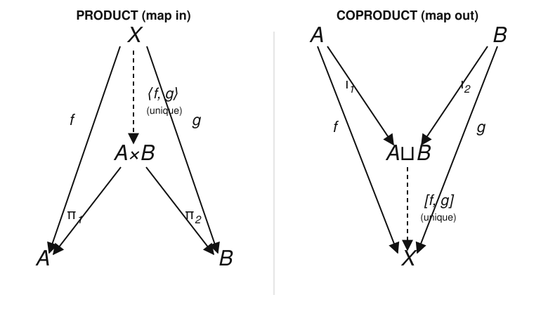

# Category Theory · Lesson 3.1: Products & Coproducts

> ⏱ ~15 min · Module 3: Limits, Colimits & Adjunctions · Builds on: [Lesson 2.1](02-01-universal-properties.md) (universal properties), [Lesson 2.3](02-03-yoneda-lemma.md) (Yoneda) · Unlocks: [Lesson 3.2](03-02-pullbacks-pushouts-equalizers.md) (pullbacks, pushouts, equalizers)

## Why this matters

You already know a dozen "product" constructions: ordered pairs $(a,b)$, the Cartesian plane $\mathbb{R}\times\mathbb{R}$, the direct product of groups, the product topology, the meet $x\wedge y$ of two elements in a lattice. You also know a dozen "sum" constructions: disjoint unions, free products of groups, direct sums of vector spaces, the join $x\vee y$. Category theory reveals these aren't a dozen coincidences — they're **two** definitions, each stated once by a universal property, instantiated everywhere. Learn the pattern here and you get products and coproducts in every category you'll ever meet *for free*, plus a proof they're unique the moment they exist. This is also your first real limit and colimit; [Lesson 3.3](03-03-limits-colimits.md) just replaces "two objects" with "any diagram."

## The idea

Forget how you'd *build* a product and ask instead what it's *for*. The pair-forming object $A\times B$ has one job: to package a map into $A$ and a map into $B$ as a single map into $A\times B$. Concretely, whenever you have a set $X$ with a function $f:X\to A$ and a function $g:X\to B$, you can bundle them into one function $x\mapsto(f(x),g(x))$ into $A\times B$ — and you can always unbundle by projecting back. That round-trip — bundle, then project and recover $f$ and $g$ — is the *entire* content of "product." It's a **mapping-in** property: $A\times B$ is characterized by how things map *into* it.

The **coproduct** is the same story with every arrow reversed — the **dual**. Instead of receiving a pair of maps *in*, it emits: $A\sqcup B$ is the object such that a map *out* of it to any target $X$ is exactly a pair of maps $A\to X$ and $B\to X$. In $\mathbf{Set}$ that's the disjoint union: to define a function on $A\sqcup B$ you say what it does on the $A$-part and on the $B$-part, independently. It's a **mapping-out** property.

Two slogans to carry through: *product = one map in splits into two; coproduct = two maps out glue into one.*

## The formal version

Fix a category $\mathcal{C}$ and two objects $A,B$.

**Definition (product).** A **product** of $A$ and $B$ is an object $A\times B$ together with two morphisms — the **projections** $\pi_1:A\times B\to A$ and $\pi_2:A\times B\to B$ — such that for every object $X$ and every pair of morphisms $f:X\to A$, $g:X\to B$, there is a **unique** morphism $\langle f,g\rangle:X\to A\times B$ with
$$\pi_1\circ\langle f,g\rangle = f \qquad\text{and}\qquad \pi_2\circ\langle f,g\rangle = g.$$

*In words:* every pair of maps out of $X$ (one to $A$, one to $B$) is the same data as a single map $X\to A\times B$; the projections undo the bundling.

**Definition (coproduct).** A **coproduct** of $A$ and $B$ is an object $A\sqcup B$ together with two morphisms — the **injections** $\iota_1:A\to A\sqcup B$ and $\iota_2:B\to A\sqcup B$ — such that for every object $X$ and every pair of morphisms $f:A\to X$, $g:B\to X$, there is a **unique** morphism $[f,g]:A\sqcup B\to X$ with
$$[f,g]\circ\iota_1 = f \qquad\text{and}\qquad [f,g]\circ\iota_2 = g.$$

*In words:* to map out of $A\sqcup B$ is exactly to choose where the $A$-part goes and where the $B$-part goes; the injections mark the two parts.

These are literally the same definition read in $\mathcal{C}$ and in $\mathcal{C}^{\mathrm{op}}$: **a coproduct in $\mathcal{C}$ is a product in $\mathcal{C}^{\mathrm{op}}$.** Reverse every arrow — projections become injections, "maps into" becomes "maps out of," $\langle f,g\rangle$ becomes $[f,g]$ — and the two definitions swap. This is duality from [Lesson 1.3](01-03-special-arrows-special-objects.md) doing real work: prove any theorem about products and you get the coproduct theorem free.

**Uniqueness.** Products and coproducts are **universal** in the sense of [Lesson 2.1](02-01-universal-properties.md), so — when they exist — they are **unique up to a unique isomorphism** compatible with the projections (resp. injections). We prove this below rather than quote it. Because the defining property is "$X$ maps into $A\times B$," it is exactly a representability statement, which is why Yoneda ([Lesson 2.3](02-03-yoneda-lemma.md)) will nail the uniqueness in one line at the end.

## Picture

Left: the product **cone**. The apex $X$ sends $f,g$ down to $A,B$; the dashed $\langle f,g\rangle$ is the one arrow through the middle making both triangles commute, and the projections $\pi_1,\pi_2$ point back out. Right: reverse every arrow. Now $A,B$ inject *up* into $A\sqcup B$, the target $X$ sits at the bottom, and the dashed $[f,g]$ is the one arrow *out* of $A\sqcup B$ making both triangles commute. Same diagram, upside down — that is what "dual" means to the eye.

## Worked examples

**Example 1 (the $\mathbf{Set}$ product satisfies the universal property).** Let $A,B$ be sets and let $A\times B=\{(a,b):a\in A,\,b\in B\}$ be the honest Cartesian product, with $\pi_1(a,b)=a$ and $\pi_2(a,b)=b$. We verify the definition — existence *and* uniqueness of the mediating map.

Take any set $X$ and functions $f:X\to A$, $g:X\to B$. *Existence:* define $\langle f,g\rangle:X\to A\times B$ by $\langle f,g\rangle(x)=(f(x),g(x))$. Then for every $x$,
$$(\pi_1\circ\langle f,g\rangle)(x)=\pi_1(f(x),g(x))=f(x),\qquad (\pi_2\circ\langle f,g\rangle)(x)=g(x),$$
so $\pi_1\circ\langle f,g\rangle=f$ and $\pi_2\circ\langle f,g\rangle=g$. *Uniqueness:* suppose $h:X\to A\times B$ also satisfies $\pi_1\circ h=f$ and $\pi_2\circ h=g$. Write $h(x)=(a_x,b_x)$. The two conditions say $a_x=\pi_1(h(x))=f(x)$ and $b_x=\pi_2(h(x))=g(x)$, so $h(x)=(f(x),g(x))=\langle f,g\rangle(x)$ for every $x$. Hence $h=\langle f,g\rangle$. $\blacksquare$

Notice we never used anything about $\mathbf{Set}$ beyond composition — the *proof* is the definition unwound. That's the point: the universal property, not the pair notation, is what "product" means.

**Example 2 (same object, split personality: finite product = coproduct in $\mathbf{Ab}$, but they diverge in $\mathbf{Grp}$ and $\mathbf{Set}$).**

*In $\mathbf{Ab}$ (abelian groups), the direct sum is both.* Let $A,B$ be abelian groups and $A\oplus B$ their direct sum: pairs $(a,b)$ with componentwise addition. As a **product** it carries $\pi_1(a,b)=a$, $\pi_2(a,b)=b$ — the $\mathbf{Set}$ argument above transports verbatim once you check $\langle f,g\rangle$ is a homomorphism (it is: it's built componentwise from homomorphisms). As a **coproduct** it carries $\iota_1(a)=(a,0)$, $\iota_2(b)=(0,b)$; given homomorphisms $f:A\to X$, $g:B\to X$ into an abelian group $X$, set
$$[f,g](a,b)=f(a)+g(b).$$
This is a homomorphism *because $X$ is abelian and $f,g$ have commuting images*, it satisfies $[f,g]\iota_1=f$ and $[f,g]\iota_2=g$, and any map out of $A\oplus B$ is forced by $[f,g](a,b)=[f,g]((a,0)+(0,b))=f(a)+g(b)$, giving uniqueness. So in $\mathbf{Ab}$ (and likewise $\mathbf{Vect}$, where it's the direct sum of vector spaces) the **finite product and coproduct are the *same object*** — a phenomenon called a *biproduct*.

*In $\mathbf{Grp}$ they split apart.* The product of groups $G\times H$ is still the componentwise one and is a genuine categorical product. But the coproduct is **not** $G\times H$ — it is the **free product** $G * H$: all finite alternating words in elements of $G$ and $H$, with no relations imposed between the two factors. Why the difference? A map out of the coproduct must accept *arbitrary* group homomorphisms $f:G\to X$, $g:H\to X$ into *any* group $X$ — including nonabelian $X$ where $f(G)$ and $g(H)$ need not commute. In $G\times H$ the images of $G$ and $H$ *always* commute (since $(g,1)(1,h)=(g,h)=(1,h)(g,1)$), so $G\times H$ can only receive commuting pairs — too few maps to be the coproduct. The free product imposes no commuting, so it can receive them all. Example: $\mathbb{Z}*\mathbb{Z}$ is the free group on two generators — infinite and nonabelian — whereas $\mathbb{Z}\times\mathbb{Z}$ is just the abelian lattice grid.

*In $\mathbf{Set}$ they also differ.* Product $=$ Cartesian product $A\times B$ (size $|A|\cdot|B|$); coproduct $=$ **disjoint union** $A\sqcup B$ (size $|A|+|B|$), with $\iota_1,\iota_2$ the inclusions and $[f,g]$ the "case split" function. Different sets entirely.

The unifying table (all forced by the *one* universal property):

| Category | Product $A\times B$ | Coproduct $A\sqcup B$ |
|---|---|---|
| $\mathbf{Set}$ | Cartesian product | disjoint union |
| $\mathbf{Grp}$ | direct product $G\times H$ | **free product** $G*H$ |
| $\mathbf{Ab}$, $\mathbf{Vect}$ | direct sum $A\oplus B$ | direct sum $A\oplus B$ (same!) |
| $\mathbf{Top}$ | product topology | disjoint-union topology |
| poset $(P,\le)$ | meet $a\wedge b$ (inf) | join $a\vee b$ (sup) |

That last row is worth pausing on — it's the bridge to lattice theory from [abstract-algebra](../../abstract-algebra/syllabus.md). In a poset viewed as a category (one arrow $a\to b$ iff $a\le b$), a map "$X\to A$ and $X\to B$" means $X\le A$ and $X\le B$, i.e. $X$ is a lower bound of $\{A,B\}$; the *universal* such — through which every lower bound factors — is the **greatest** lower bound, the meet. Dually the coproduct is the least upper bound, the join. Products literally *are* infima and coproducts *are* suprema. The product topology and disjoint-union topology in $\mathbf{Top}$ likewise fall out as the categorical product/coproduct — the same limits you'll build in [topology](../../topology/syllabus.md).

## Watch out

- **The projections are part of the data, not an afterthought.** "The product" is the *triple* $(A\times B,\pi_1,\pi_2)$. Two products are "the same" only via an iso *commuting with the projections* — an abstract iso of the underlying objects isn't enough. (This is exactly why the uniqueness theorem below is about a *unique* iso, not merely some iso.)
- **You might think coproduct always means "glue/union," so it must be bigger and simpler.** But in $\mathbf{Grp}$ the coproduct $G*H$ is the *wilder* object (free, infinite, nonabelian) while the product is tame. Which construction is "easy" flips by category; only the universal property is stable.
- **Product and coproduct coinciding is special, not the rule.** It happens in $\mathbf{Ab}$/$\mathbf{Vect}$ (finitely many factors) because those categories have a zero object and hom-sets that are abelian groups. Don't expect $A\times B\cong A\sqcup B$ in $\mathbf{Set}$ or $\mathbf{Grp}$ — you just saw it fail in both.
- **"Unique" governs the *arrow*, not just the object.** Existence of *some* map $X\to A\times B$ hitting $f,g$ is cheap; the universal property demands *exactly one*. Dropping uniqueness breaks everything downstream (it's what separates a product from a mere "object with two projections").

## One-liner

> A product turns a pair of maps *in* into one map in; a coproduct turns a pair of maps *out* into one map out — same universal property, arrows reversed — and this single idea is Cartesian products, direct sums, free products, disjoint unions, meets, and joins all at once.

## Problems

**P1 (🟢)** In $\mathbf{Set}$, take $A=\{1,2\}$ and $B=\{x\}$. (a) Write out $A\times B$ and $A\sqcup B$ explicitly and give their sizes. (b) With $X=\{p,q\}$, $f:X\to A$ sending $p\mapsto 1,q\mapsto 2$, and $g:X\to B$ (the only option), write the mediating map $\langle f,g\rangle:X\to A\times B$ and check both projection equations.

**P2 (🟡)** Prove **uniqueness up to unique isomorphism**: if $(P,\pi_1,\pi_2)$ and $(Q,\rho_1,\rho_2)$ are both products of $A$ and $B$ in a category $\mathcal{C}$, then there is a unique isomorphism $\theta:P\to Q$ with $\rho_1\circ\theta=\pi_1$ and $\rho_2\circ\theta=\pi_2$. (Then state the dual statement for coproducts — no separate proof needed.)

**P3 (🔴, optional)** In $\mathbf{Grp}$, show that the direct product $G\times H$ (with the componentwise projections) really is the categorical product, and then explain precisely why it **fails** to be the coproduct by exhibiting a pair of homomorphisms $f:G\to X$, $g:H\to X$ into some group $X$ that *cannot* factor through $G\times H$. (Hint: take $G=H=\mathbb{Z}$ and a nonabelian $X$.)

Solutions

**P1** (a) $A\times B=\{(1,x),(2,x)\}$, size $2=|A|\cdot|B|$. $A\sqcup B=\{1_A,2_A,x_B\}$ (tag by side to keep them disjoint), size $3=|A|+|B|$. (b) $\langle f,g\rangle(p)=(f(p),g(p))=(1,x)$ and $\langle f,g\rangle(q)=(2,x)$. Check: $\pi_1\langle f,g\rangle(p)=\pi_1(1,x)=1=f(p)$ and $\pi_1\langle f,g\rangle(q)=2=f(q)$, so $\pi_1\circ\langle f,g\rangle=f$; similarly $\pi_2\langle f,g\rangle(p)=x=g(p)$ and $\pi_2\langle f,g\rangle(q)=x=g(q)$, so $\pi_2\circ\langle f,g\rangle=g$. ✓

**P2** *Existence of $\theta$.* Treat $Q$ as a test object mapping into the product $P$: apply $P$'s universal property to the pair $\rho_1:Q\to A$, $\rho_2:Q\to B$ to get a unique $\theta:Q\to P$ with
$$\pi_1\circ\theta=\rho_1,\qquad \pi_2\circ\theta=\rho_2.$$
Wait — we want $\theta:P\to Q$; run it the other way. Apply $Q$'s universal property to the pair $\pi_1:P\to A$, $\pi_2:P\to B$ to get a unique $\theta:P\to Q$ with $\rho_1\circ\theta=\pi_1$ and $\rho_2\circ\theta=\pi_2$. Symmetrically apply $P$'s universal property to $\rho_1,\rho_2:Q\to A,B$ to get a unique $\varphi:Q\to P$ with $\pi_1\circ\varphi=\rho_1$ and $\pi_2\circ\varphi=\rho_2$. These $\theta,\varphi$ are the compatibility conditions demanded, and $\theta$ is unique with them by construction.

*They are mutually inverse.* Consider $\varphi\circ\theta:P\to P$. Then $\pi_1\circ(\varphi\circ\theta)=(\pi_1\circ\varphi)\circ\theta=\rho_1\circ\theta=\pi_1$, and likewise $\pi_2\circ(\varphi\circ\theta)=\pi_2$. So $\varphi\circ\theta$ is a map $P\to P$ commuting with both projections of $P$. But $\operatorname{id}_P$ *also* commutes with both projections ($\pi_i\circ\operatorname{id}_P=\pi_i$). By the **uniqueness** clause of $P$'s universal property applied to the pair $(\pi_1,\pi_2)$, there is only one such map, so $\varphi\circ\theta=\operatorname{id}_P$. The identical argument in $Q$ gives $\theta\circ\varphi=\operatorname{id}_Q$. Hence $\theta$ is an isomorphism, and it is the *unique* one commuting with the projections. $\blacksquare$

*Dual.* Reverse every arrow: any two coproducts $(P,\iota_1,\iota_2)$, $(Q,j_1,j_2)$ of $A,B$ admit a unique isomorphism $\theta:P\to Q$ with $\theta\circ\iota_1=j_1$ and $\theta\circ\iota_2=j_2$. No new proof is needed — it is the product statement read in $\mathcal{C}^{\mathrm{op}}$.

**P3** *It is the product.* Given a group $X$ with homomorphisms $f:X\to G$, $g:X\to H$, define $\langle f,g\rangle:X\to G\times H$ by $x\mapsto(f(x),g(x))$. It's a homomorphism: $\langle f,g\rangle(xy)=(f(xy),g(xy))=(f(x)f(y),g(x)g(y))=(f(x),g(x))(f(y),g(y))$ using componentwise multiplication. It satisfies $\pi_1\langle f,g\rangle=f$, $\pi_2\langle f,g\rangle=g$, and any homomorphism $h$ with $\pi_1 h=f,\pi_2 h=g$ must send $x\mapsto(f(x),g(x))$, so it's unique. Thus $(G\times H,\pi_1,\pi_2)$ is the categorical product. ✓

*It is not the coproduct.* For a coproduct we'd need: for every group $X$ and every pair $f:G\to X$, $g:H\to X$, a homomorphism $A\times B\to X$ (out of $G\times H$, with injections $\iota_1(g)=(g,1)$, $\iota_2(h)=(1,h)$) restricting to $f$ and $g$. Take $G=H=\mathbb{Z}$ and $X=S_3$ (symmetric group, nonabelian). Let $f:\mathbb{Z}\to S_3$ send $1\mapsto\sigma=(1\,2)$ and $g:\mathbb{Z}\to S_3$ send $1\mapsto\tau=(1\,3)$; both are homomorphisms since $\mathbb{Z}$ is free on one generator. Suppose some homomorphism $u:\mathbb{Z}\times\mathbb{Z}\to S_3$ had $u\circ\iota_1=f$ and $u\circ\iota_2=g$, i.e. $u(1,0)=\sigma$ and $u(0,1)=\tau$. In $\mathbb{Z}\times\mathbb{Z}$ the generators commute: $(1,0)(0,1)=(1,1)=(0,1)(1,0)$. A homomorphism preserves this, so $u(1,0)$ and $u(0,1)$ must commute in $S_3$: $\sigma\tau=\tau\sigma$. But $\sigma\tau=(1\,2)(1\,3)=(1\,3\,2)$ while $\tau\sigma=(1\,3)(1\,2)=(1\,2\,3)$ — *not equal*. Contradiction, so no such $u$ exists. The pair $(f,g)$ has no mediating map out of $G\times H$, so $G\times H$ fails the coproduct property. The coproduct is instead the free product $\mathbb{Z}*\mathbb{Z}$, where the images of the two generators are *not* forced to commute and $[f,g]$ exists. $\blacksquare$

## Flashback

**From [Lesson 2.3](02-03-yoneda-lemma.md) (the Yoneda corollary):** Let $\mathcal{C}$ be a category and $A,B$ objects. Suppose there is a natural isomorphism of *contravariant* hom-functors $\operatorname{Hom}_{\mathcal{C}}(-,A)\cong\operatorname{Hom}_{\mathcal{C}}(-,B)$. Prove $A\cong B$ in $\mathcal{C}$. Then use this to give a **one-line** reproof that any two products of a fixed pair $(A,B)$ are isomorphic. (Variant of the corollary you proved via the full Yoneda lemma — here just apply it.)

Solution

*The corollary.* Write the natural iso as $\Phi:\operatorname{Hom}(-,A)\Rightarrow\operatorname{Hom}(-,B)$ with inverse $\Psi$. Evaluate at $X=A$: $\Phi_A:\operatorname{Hom}(A,A)\to\operatorname{Hom}(A,B)$ is a bijection; let $\varphi:=\Phi_A(\operatorname{id}_A):A\to B$. Evaluate at $X=B$: let $\psi:=\Psi_B(\operatorname{id}_B):B\to A$. Naturality of $\Phi$ in the argument, applied to the morphism $\psi:B\to A$ (which the contravariant functors turn into precomposition $-\circ\psi$), gives the square condition
$$\Phi_B(\operatorname{id}_B\circ\psi)=\Phi_A(\operatorname{id}_A)\circ\psi,$$
i.e. $\Phi_B(\psi)=\varphi\circ\psi$. But $\psi=\Psi_B(\operatorname{id}_B)$ and $\Phi_B\Psi_B=\operatorname{id}$, so $\Phi_B(\psi)=\operatorname{id}_B$, whence $\varphi\circ\psi=\operatorname{id}_B$. The symmetric computation with $\Psi$ natural, applied to $\varphi$, gives $\psi\circ\varphi=\operatorname{id}_A$. Therefore $\varphi:A\to B$ is an isomorphism with inverse $\psi$, so $A\cong B$. $\blacksquare$

*One-line reproof of product uniqueness.* A product $(P,\pi_1,\pi_2)$ of $A,B$ represents the functor $X\mapsto\operatorname{Hom}(X,A)\times\operatorname{Hom}(X,B)$ — its universal property *is* the natural bijection $\operatorname{Hom}(-,P)\cong\operatorname{Hom}(-,A)\times\operatorname{Hom}(-,B)$, sending $h\mapsto(\pi_1 h,\pi_2 h)$. So any two products $P,Q$ give $\operatorname{Hom}(-,P)\cong\operatorname{Hom}(-,A)\times\operatorname{Hom}(-,B)\cong\operatorname{Hom}(-,Q)$; by the corollary, $P\cong Q$. (This recovers P2's iso, and Yoneda even guarantees it's the unique projection-respecting one, since natural isos of representables come from unique morphisms.)

## Connections

- **Backward:** this is the first *industrial-scale* payoff of [Lesson 2.1](02-01-universal-properties.md) — product and coproduct are dual universal properties, and their uniqueness-up-to-unique-iso is that lesson's theorem, reproved here two ways (directly in P2, via Yoneda in the flashback). Duality from [Lesson 1.3](01-03-special-arrows-special-objects.md) is what let one definition cover both.
- **Forward:** [Lesson 3.2](03-02-pullbacks-pushouts-equalizers.md) generalizes to products/coproducts *with constraints* (pullbacks are "products over a shared base," equalizers pin down where two maps agree), and [Lesson 3.3](03-03-limits-colimits.md) subsumes all of it: a product is the limit of a two-object diagram, a coproduct its colimit. In [Lesson 3.5](03-05-unit-counit-triangle-identities.md) you'll prove "right adjoints preserve limits," explaining *why* forgetful functors carry products of groups to products of sets.
- **Sideways (algebra & order):** meet/join in a poset and the free product of groups are the same construction as Cartesian product and disjoint union — the lattice and free-product story from [abstract-algebra](../../abstract-algebra/syllabus.md), unified. In [topology](../../topology/syllabus.md) the product and disjoint-union topologies are exactly these categorical (co)products, and the "list/coproduct of types" and sum/product types in [programming-languages](../../programming-languages/syllabus.md) are the very same pattern — a record is a product, a tagged union is a coproduct.
