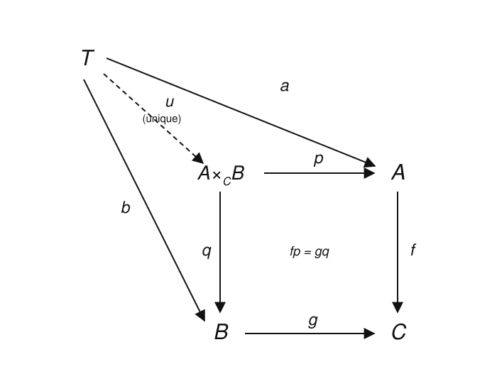
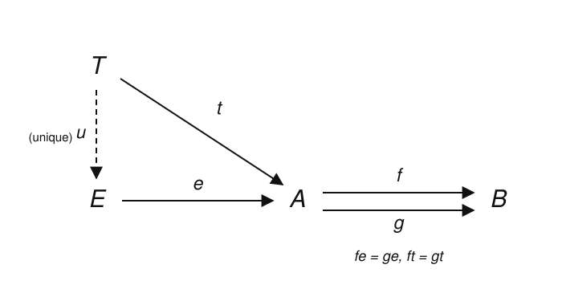

# Category Theory · Lesson 3.2: Pullbacks, Pushouts & Equalizers

> ⏱ ~15 min · Module 3: Limits, Colimits & Adjunctions · Builds on: [Lesson 3.1](03-01-products-coproducts.md) (products & coproducts) · Unlocks: [Lesson 3.3](03-03-limits-colimits.md) (limits & colimits in general)

## Why this matters

A product pairs two objects with *no strings attached*. But most of mathematics glues things together *compatibly*: the solutions of $f(x)=g(x)$, the preimage $f^{-1}(S)$, the intersection of two subspaces, the kernel of a homomorphism, two spaces sharing a common boundary, a group built by amalgamating two groups along a subgroup. Each of these is a product or coproduct with a *constraint*, and category theory captures the constraint with three constructions — the equalizer, the pullback, and its dual the pushout. Master these and you'll recognize that a preimage in $\mathbf{Set}$, a fiber product of schemes, and the Seifert–van Kampen theorem in topology are all *the same diagram*.

## The idea

Start with the **equalizer**. Given two parallel maps $f, g : A \to B$, the equalizer is the largest part of $A$ on which they *agree*. In $\mathbf{Set}$ it is literally the solution set $\{a \in A : f(a) = g(a)\}$, sitting inside $A$ via inclusion. It's a *subobject of $A$ cut out by an equation*.

Now the **pullback**. Given two maps *into a common target*, $f : A \to C$ and $g : B \to C$, the pullback is the product $A \times B$ *restricted to the pairs that land in the same place downstream*: $\{(a,b) : f(a) = g(b)\}$. Picture $C$ as a set of "colors," $f$ and $g$ as coloring $A$ and $B$; the pullback keeps exactly the same-colored pairs. That's why it's called the **fiber product** — it glues $A$ and $B$ fiber-by-fiber over $C$.

The **pushout** is the mirror image, running the arrows the other way: given $f : C \to A$ and $g : C \to B$ *out of a common source*, you form $A \sqcup B$ and then *glue* the two copies of $C$ together. In $\mathbf{Top}$ this is exactly gluing two spaces along a shared subspace; in $\mathbf{Grp}$ it is the amalgamated free product. Where the pullback *carves out*, the pushout *fuses*.

All three share one DNA: an object universal among all *compatible cones* over a small diagram. That's the thread Lesson 3.3 pulls on.

## The formal version

**Definition (equalizer).** Given parallel arrows $f, g : A \to B$ in a category $\mathcal{C}$, an **equalizer** is an object $E$ with an arrow $e : E \to A$ such that $f \circ e = g \circ e$, and which is *universal* with this property: for every $t : T \to A$ satisfying $f \circ t = g \circ t$, there is a **unique** $u : T \to E$ with $e \circ u = t$.

*In words:* $e$ is the most efficient way to map into $A$ while killing the difference between $f$ and $g$ — every other such map factors through it in exactly one way.

In $\mathbf{Set}$, take $E = \{a \in A : f(a) = g(a)\}$ with $e$ the inclusion. If $t : T \to A$ has $f(t(x)) = g(t(x))$ for all $x$, then $t(x)$ already lies in $E$, so $u := t$ (viewed as landing in $E$) is the one and only factorization. Equalizer maps are always **monic** (Problem 2), so the equalizer really is a *subobject where $f = g$*.

**Definition (pullback).** Given $f : A \to C$ and $g : B \to C$, a **pullback** is an object $P$ with arrows $p : P \to A$ and $q : P \to B$ such that $f \circ p = g \circ q$, and which is universal: for every cone $(T, a : T \to A, b : T \to B)$ with $f \circ a = g \circ b$, there is a **unique** $u : T \to P$ with $p \circ u = a$ and $q \circ u = b$. We write $P = A \times_C B$.

*In words:* $A \times_C B$ is the best object completing the commuting square below-left; any competing square factors through it uniquely.

In $\mathbf{Set}$, $A \times_C B = \{(a,b) \in A \times B : f(a) = g(b)\}$ with $p, q$ the two coordinate projections. Given $a : T \to A$, $b : T \to B$ agreeing after $f, g$, the map $u(x) = (a(x), b(x))$ lands in $A\times_C B$ (its coordinates agree over $C$) and is forced: $p\circ u = a$ and $q\circ u = b$ pin down both coordinates.

**Definition (pushout).** The **pushout** is the pullback with every arrow reversed — the construction in $\mathcal{C}^{\mathrm{op}}$. Given $f : C \to A$ and $g : C \to B$, a pushout is an object $Q$ with $i : A \to Q$, $j : B \to Q$ such that $i \circ f = j \circ g$, universal among all such cocones. We write $Q = A \sqcup_C B$.

*In words:* $A \sqcup_C B$ is $A$ and $B$ laid side by side with the two images of $C$ identified — the universal *gluing*. In $\mathbf{Set}$ it is the quotient of $A \sqcup B$ by $f(c) \sim g(c)$; in $\mathbf{Top}$, gluing spaces along a common subspace; in $\mathbf{Grp}$, the amalgamated free product $A *_C B$.

As always with universal properties, each of these objects is **unique up to a unique isomorphism** — the identical argument from [Lesson 2.1](02-01-universal-properties.md), so we won't re-run it.

## Picture

The pullback square is *the* defining diagram of the lesson: the universal commuting square $A \times_C B \to A, B \to C$, with the dashed unique mediator $u$ from any competing cone $T$.

And the equalizer, cut out of $A$ by the parallel pair $f, g : A \to B$:

## Worked examples

**Example 1 (equalizer and pullback in $\mathbf{Set}$, by hand).**

*Equalizer.* Let $A = \mathbb{R}^2$, $B = \mathbb{R}$, with $f(x,y) = x^2 + y^2$ and $g(x,y) = 1$ (the constant map). The equalizer is
$$E = \{(x,y) : x^2 + y^2 = 1\} = S^1,$$
the unit circle, included into the plane. The universal property just says: any map $t : T \to \mathbb{R}^2$ whose image satisfies $x^2+y^2 = 1$ *is* a map into $S^1$, uniquely. An equation becomes a subobject.

*Pullback.* Let $C = \{\text{red}, \text{blue}\}$, $A = \{a_1, a_2, a_3\}$ with $f(a_1)=f(a_2)=\text{red}$, $f(a_3)=\text{blue}$, and $B = \{b_1, b_2\}$ with $g(b_1)=\text{red}$, $g(b_2)=\text{blue}$. Then
$$A \times_C B = \{(a,b) : f(a) = g(b)\} = \{(a_1,b_1),\,(a_2,b_1),\,(a_3,b_2)\}.$$
The red fiber $\{a_1,a_2\}$ of $A$ pairs with the red fiber $\{b_1\}$ of $B$ (giving $2 \times 1 = 2$ pairs), the blue fibers give $1 \times 1 = 1$ pair — the fiber product is the *disjoint union of the products of matching fibers*, $2 + 1 = 3$ elements. That fiberwise picture is the reason for the name.

**Example 2 (a pullback square recovers a preimage).** Fix $f : A \to C$ and a subset $S \subseteq C$ with inclusion $\iota : S \hookrightarrow C$. Form the pullback of $f$ along $\iota$:
$$A \times_C S = \{(a, s) \in A \times S : f(a) = \iota(s) = s\}.$$
For each $a$ there is *at most one* valid $s$, namely $s = f(a)$, and it exists exactly when $f(a) \in S$. So the projection $p : A\times_C S \to A$ is injective with image $\{a : f(a) \in S\} = f^{-1}(S)$; i.e.
$$A \times_C S \;\cong\; f^{-1}(S),$$
and the pullback square exhibits the preimage as a *subobject of $A$*.

This single template specializes everywhere:
- **Intersection.** Pull back two subobjects $S \hookrightarrow C \hookleftarrow S'$: the pullback is $S \cap S'$.
- **Kernel.** In $\mathbf{Grp}$ (or $\mathbf{Ab}$, $\mathbf{Vect}$), pull a homomorphism $\varphi : A \to C$ back along the inclusion of the trivial subobject $0 \hookrightarrow C$: you get $\{a : \varphi(a) = 0\} = \ker\varphi$. A kernel is a pullback along zero.
- **Fiber over a point.** Pulling $f : A \to C$ back along a point $\{c\} \hookrightarrow C$ gives the single fiber $f^{-1}(c)$ — the origin of the word "fiber product." In algebraic geometry the *fibered product of schemes* $X \times_S Y$ is this exact universal property, and it is how base change and families of varieties are defined.

**Pushout, read off the same picture.** Reverse the arrows. Gluing two disks $D^2$ along their common boundary circle $S^1$ — i.e. the pushout of $D^2 \hookleftarrow S^1 \hookrightarrow D^2$ in $\mathbf{Top}$ — produces the sphere $S^2$. The *Seifert–van Kampen theorem* says $\pi_1$ turns this topological pushout into a **group pushout**: if $X = U \cup V$ with $U \cap V$ path-connected, then $\pi_1(X)$ is the pushout (amalgamated free product) of $\pi_1(U) \leftarrow \pi_1(U\cap V) \to \pi_1(V)$. Van Kampen *is* a pushout statement — that is the bridge to [algebraic-topology](../../algebraic-topology/syllabus.md) and to the gluing/quotient constructions of [topology](../../topology/syllabus.md).

## Watch out

- **A pullback is *not* the whole product $A \times B$.** It's the subobject of $A \times B$ cut out by $f(a) = g(b)$. Only when $C$ is terminal (a one-point set, so the condition is vacuous) does $A \times_C B = A \times B$ — the pullback over the terminal object *is* the product. Likewise the pushout over the *initial* object is the coproduct.
- **The commuting square is part of the data, not a bonus.** "$P$ is a pullback" is meaningless without naming the two projections *and* the square $f\circ p = g \circ q$. The universal object is the whole cone, not the corner object alone.
- **Pushout in $\mathbf{Grp}$ is bigger than you expect.** The amalgamated free product $A *_C B$ is *not* the set-level pushout with a group structure bolted on; it's a free-product-with-relations and is usually infinite even when $A, B$ are finite. Gluing groups is genuinely a colimit, computed by generators-and-relations, not by intersecting underlying sets.

## One-liner

> An equalizer carves out where two maps agree, a pullback carves out same-target pairs (preimages, intersections, kernels, fibers), and a pushout is the dual that glues — all three one universal cone away from a product.

## Problems

**P1 (🟢)** In $\mathbf{Set}$, let $f, g : \mathbb{Z} \to \mathbb{Z}$ be $f(n) = n^2$ and $g(n) = 4n - 3$. (a) Compute the equalizer $E \subseteq \mathbb{Z}$ explicitly. (b) Let $h : \mathbb{Z} \to \mathbb{Z}$, $h(n) = 2n$ and $k : \mathbb{Z} \to \mathbb{Z}$, $k(m) = 3m$. Compute the pullback $\mathbb{Z} \times_{\mathbb{Z}} \mathbb{Z}$ of $h$ and $k$ (over the common target $\mathbb{Z}$) as a subset of $\mathbb{Z} \times \mathbb{Z}$.

**P2 (🟡)** Prove that in any category, the arrow $e : E \to A$ out of an equalizer of $f, g : A \to B$ is a **monomorphism**. (Recall $e$ is monic iff $e\circ x = e \circ y \Rightarrow x = y$.)

**P3 (🔴, optional)** *(Pasting / kernel-as-pullback.)* Work in $\mathbf{Ab}$. Let $\varphi : A \to C$ be a homomorphism and let $0 \to C$ be the inclusion of the trivial subgroup. Prove directly from the universal property that the pullback $A \times_C 0$ is (isomorphic to) $\ker\varphi$ with its inclusion into $A$ — i.e. verify the universal property of the pullback by hand for this square, and conclude "kernels are pullbacks along $0$."

Solutions

**P1** (a) $E = \{n \in \mathbb{Z} : n^2 = 4n - 3\}$. Solve $n^2 - 4n + 3 = 0$, i.e. $(n-1)(n-3) = 0$, so $E = \{1, 3\}$, included into $\mathbb{Z}$. (Check: $1^2 = 1 = 4\cdot1-3$; $3^2 = 9 = 4\cdot3-3$. ✓)

(b) $\mathbb{Z}\times_\mathbb{Z}\mathbb{Z} = \{(n,m) : h(n) = k(m)\} = \{(n,m) : 2n = 3m\}$. Since $\gcd(2,3)=1$, $2n = 3m$ forces $3 \mid n$ and $2 \mid m$; writing $n = 3t$ gives $m = 2t$. So
$$\mathbb{Z}\times_\mathbb{Z}\mathbb{Z} = \{(3t, 2t) : t \in \mathbb{Z}\} \;\cong\; \mathbb{Z},$$
the "diagonal at slope $2/3$." (This is the fiber product realizing $2\mathbb{Z} \cap 3\mathbb{Z} = 6\mathbb{Z}$: the shared value is $2n = 6t$, ranging over $6\mathbb{Z}$.)

**P2** Suppose $x, y : T \to E$ satisfy $e \circ x = e \circ y$. Call this common composite $t := e\circ x = e\circ y : T \to A$. Because $f \circ e = g\circ e$ (defining property of the equalizer), we get
$$f \circ t = f \circ e \circ x = g \circ e \circ x = g \circ t,$$
so $t$ is a map into $A$ that equalizes $f$ and $g$. By the *universal property*, there is a **unique** $u : T \to E$ with $e \circ u = t$. But both $x$ and $y$ satisfy $e \circ x = t$ and $e \circ y = t$. Uniqueness forces $x = u = y$. Hence $e$ is monic. $\blacksquare$
(The same argument, dualized, shows a coequalizer arrow is epic; and the projections of a pullback of a mono along anything are mono — "monos are stable under pullback.")

**P3** The candidate cone is $(\ker\varphi,\ \iota : \ker\varphi \hookrightarrow A,\ 0 : \ker\varphi \to 0)$, where $0$ denotes the unique map to the trivial group. The square commutes because both composites $\ker\varphi \to C$ are the zero map: $\varphi\circ\iota = 0$ (definition of kernel) and (inclusion of $0$)$\circ 0 = 0$. Now check universality. Let $(T, a : T \to A, b : T \to 0)$ be any cone with $\varphi\circ a = (\text{incl})\circ b$. The right-hand side is $0$ (everything into $0$ then included is zero), so $\varphi\circ a = 0$, meaning $a(x) \in \ker\varphi$ for all $x \in T$. Thus $a$ factors as $\iota \circ u$ for the map $u : T \to \ker\varphi$ defined by $u(x) = a(x)$ (well-defined since $a(x)\in\ker\varphi$, and a homomorphism since $a$ is). This $u$ satisfies $\iota\circ u = a$ and $0\circ u = b$ (both maps to $0$ agree automatically — $0$ is terminal in $\mathbf{Ab}$). Uniqueness: $\iota$ is injective, so $\iota\circ u = a = \iota\circ u'$ forces $u = u'$. Therefore $\ker\varphi$ with $\iota$ satisfies the pullback universal property, so $A\times_C 0 \cong \ker\varphi$. Kernels are pullbacks along $0$. $\blacksquare$

## Flashback

**From [Lesson 3.1](03-01-products-coproducts.md) (products & coproducts):** The coproduct is the *dual* of the product, but its concrete shape depends heavily on the category. For $A = \mathbb{Z}/2$ and $B = \mathbb{Z}/3$: (a) what is their coproduct in $\mathbf{Ab}$ (abelian groups)? (b) What is their coproduct in $\mathbf{Grp}$ (all groups)? State how the two differ and why.

Solution

(a) In $\mathbf{Ab}$ the coproduct is the *direct sum*, which for finitely many factors coincides with the product: $\mathbb{Z}/2 \oplus \mathbb{Z}/3$. By CRT this is cyclic of order $6$, $\mathbb{Z}/2 \oplus \mathbb{Z}/3 \cong \mathbb{Z}/6$. The universal property: a pair of homomorphisms $\mathbb{Z}/2 \to M$, $\mathbb{Z}/3 \to M$ into an *abelian* $M$ combines into one map $\mathbb{Z}/2\oplus\mathbb{Z}/3 \to M$ by $(x,y)\mapsto \mu_1(x)+\mu_2(y)$ — commutativity of $M$ is what lets the two images be added independently.

(b) In $\mathbf{Grp}$ the coproduct is the *free product* $\mathbb{Z}/2 * \mathbb{Z}/3$ — reduced words alternating between the two factors, with no relation forcing the generators to commute. This group is *infinite* (in fact $\cong \mathrm{PSL}_2(\mathbb{Z})$, the modular group).

Why they differ: the coproduct must satisfy its universal property against *all* target groups in the category. In $\mathbf{Ab}$ every target is commutative, so the two images can be added and the coproduct stays small (order $6$). In $\mathbf{Grp}$ a target can be non-abelian, so the generators of the two factors must be kept freely non-commuting to map universally — forcing the huge free product. Same abstract definition (initial cocone over the two objects), category-dependent answer — exactly the moral of Lesson 3.1.

## Connections

- **Backward:** These are products/coproducts ([Lesson 3.1](03-01-products-coproducts.md)) *with a constraint* — pullback over a terminal object is a product, pushout over an initial object is a coproduct. The uniqueness-up-to-unique-iso machinery is [Lesson 2.1](02-01-universal-properties.md) verbatim.
- **Forward:** [Lesson 3.3](03-03-limits-colimits.md) unifies all of this: an equalizer is the limit of a parallel-pair diagram $(\bullet \rightrightarrows \bullet)$, a pullback the limit of a cospan $(\bullet \to \bullet \leftarrow \bullet)$, a pushout the colimit of a span. "Cone over a small diagram" is the single definition behind every construction in this module.
- **Sideways (algebraic topology):** The Seifert–van Kampen theorem — $\pi_1$ of a union is the pushout of the $\pi_1$'s of the pieces along their overlap — is a pushout in $\mathbf{Grp}$; see [algebraic-topology](../../algebraic-topology/syllabus.md). The fundamental group functor *sends the topological gluing pushout to a group pushout*.
- **Sideways (topology / geometry):** Gluing and quotient constructions in [topology](../../topology/syllabus.md) are pushouts in $\mathbf{Top}$; the fiber product $X\times_S Y$ of schemes is the pullback that defines base change in algebraic geometry.
