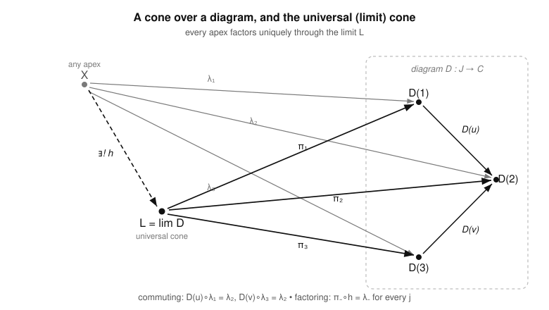

# Category Theory · Lesson 3.3: Limits & Colimits in General

> ⏱ ~15 min · Module 3: Limits, Colimits & Adjunctions · Builds on: [Lesson 3.1](03-01-products-coproducts.md), [Lesson 3.2](03-02-pullbacks-pushouts-equalizers.md) · Unlocks: [Lesson 3.4](03-04-adjoint-functors.md)

## Why this matters

You have now met products, equalizers, and pullbacks as separate constructions, each with its own universal property, each proved unique-up-to-unique-iso by the same two-line argument. That repetition is a tell: they are *one* concept wearing three costumes. This lesson names it. A **limit** is "the best object mapping into a whole diagram at once," and every gluing-free construction in mathematics — products of groups, intersections of subspaces, inverse limits of rings, the space of solutions to a system of equations — is a limit over some diagram. Once you see the pattern, a single theorem ("products + equalizers ⟹ all limits") builds every one of them, and the dual pattern (colimits) captures every quotient and gluing. This is also the exact machinery Lesson 3.5 needs to state "right adjoints preserve limits," the workhorse of the whole subject.

## The idea

Think of a **diagram** as a little wiring schematic drawn *inside* your category: some objects, some arrows between them, possibly with commuting constraints. The schematic itself is data — its *shape* — and where you plug it into $\mathcal{C}$ is a second choice. A **cone** over the diagram is an extra object $X$ (the **apex**) with one arrow down to each object of the diagram, arranged so that the legs are *compatible*: sliding an apex-leg along any arrow of the diagram lands you on the leg it should. A cone is a single object that "sees" the entire diagram consistently at once.

There are usually many cones. The **limit** is the *best* one — the cone every other cone factors through, uniquely. "Best" here is exactly "terminal in the category of cones": from any apex $X$ there is one and only one arrow to the limit that reproduces all of $X$'s legs by composition. Turn every arrow around and you get the dual story: a **cocone** sits *under* the diagram (arrows up out of each object into a shared **coapex**), and the **colimit** is the *initial* one — the best object the whole diagram maps *out* into. Products and pullbacks are limits; coproducts and pushouts are colimits. Same definition, read forwards and backwards.

## The formal version

**Definition (diagram).** Fix a small category $\mathcal{J}$, the **shape** (or **index**) category. A **diagram of shape $\mathcal{J}$ in $\mathcal{C}$** is a functor $D : \mathcal{J} \to \mathcal{C}$.

*In words:* the objects of $\mathcal{J}$ label the "slots" and its morphisms label the arrows the diagram must contain; $D$ drops that template into $\mathcal{C}$, sending slot $j$ to an object $D(j)$ and each shape-arrow $u : j \to k$ to a morphism $D(u) : D(j) \to D(k)$. Functoriality is exactly what forces the dropped-in picture to commute the way $\mathcal{J}$ says.

**Definition (cone).** A **cone over $D$ with apex $X \in \mathcal{C}$** is a family of morphisms
$$\lambda_j : X \to D(j) \quad (\text{one for each object } j \in \mathcal{J})$$
such that for *every* morphism $u : j \to k$ in $\mathcal{J}$,
$$D(u) \circ \lambda_j = \lambda_k.$$

*In words:* one leg from the apex to each object of the diagram, and following any diagram-arrow $D(u)$ after the leg into its source gives you exactly the leg into its target — the triangles commute.

**Definition (limit).** A **limit of $D$** is a cone $\big(L, (\pi_j)_{j}\big)$ that is **universal (terminal)** among cones: for any cone $\big(X, (\lambda_j)_j\big)$ there is a **unique** morphism $h : X \to L$ with
$$\pi_j \circ h = \lambda_j \quad \text{for every } j.$$
We write $L = \varprojlim D$ (also $\lim D$), and call the $\pi_j$ the **projections** (**limiting cone**).

*In words:* the limit is the one apex every other apex routes through in exactly one way — the universal property of a product, an equalizer, a pullback, all at once.

**Definition (cocone, colimit) — the dual.** A **cocone under $D$ with coapex $X$** is a family $\iota_j : D(j) \to X$ with $\iota_k \circ D(u) = \iota_j$ for every $u : j \to k$. A **colimit** $\big(C, (\iota_j)_j\big)$ is the **initial** such cocone: for any cocone $\big(X, (\mu_j)_j\big)$ there is a unique $h : C \to X$ with $h \circ \iota_j = \mu_j$. We write $C = \varinjlim D$ ($=\operatorname{colim} D$).

*In words:* flip every arrow — legs point up out of the diagram into a shared target, and the colimit is the best such target. (Precisely: a colimit of $D$ in $\mathcal{C}$ is a limit of $D^{\mathrm{op}}$ in $\mathcal{C}^{\mathrm{op}}$.)

**Uniqueness.** As with every universal property, a limit is unique up to a *unique* isomorphism commuting with the projections: two terminal cones each factor through the other, and the round trips are forced to be identities. So we say **the** limit.

### The unification

Choosing the shape $\mathcal{J}$ chooses the construction:

| shape $\mathcal{J}$ | limit over $D$ | colimit over $D$ |
|---|---|---|
| **discrete** (only identities) | product $\prod_j D(j)$ | coproduct $\coprod_j D(j)$ |
| $\;\bullet \rightrightarrows \bullet\;$ (two parallel arrows) | equalizer of $D(f), D(g)$ | coequalizer |
| $\;\bullet \to \bullet \leftarrow \bullet\;$ (cospan) | pullback $D(1)\times_{D(3)} D(2)$ | — |
| $\;\bullet \leftarrow \bullet \to \bullet\;$ (span) | — | pushout |
| **empty** $\mathcal{J}=\varnothing$ | terminal object $1$ | initial object $0$ |

A cone over a discrete diagram is just an unconstrained family of legs (no arrows to commute with) — that's the definition of a product. A cone over $\bullet \rightrightarrows \bullet$ is a leg $\lambda_1$ to the source, a leg $\lambda_2$ to the target, with $D(f)\lambda_1 = \lambda_2 = D(g)\lambda_1$; the leg $\lambda_2$ is redundant and the surviving condition $D(f)\lambda_1 = D(g)\lambda_1$ is exactly an equalizing map. And the empty diagram has *one* cone per apex $X$ (the empty family of legs), so a limit of it is an object $1$ with exactly one arrow from every $X$ — a terminal object.

**Definition ((co)completeness).** $\mathcal{C}$ is **complete** if every diagram $D : \mathcal{J} \to \mathcal{C}$ with $\mathcal{J}$ *small* has a limit; **finitely complete** if this holds for every *finite* $\mathcal{J}$. Dually, **cocomplete** / **finitely cocomplete** for colimits.

**Theorem (limits from products and equalizers).** If $\mathcal{C}$ has all (small) products and all equalizers, then $\mathcal{C}$ is complete. Restricting to finite products (equivalently: binary products and a terminal object) plus equalizers gives finite completeness.

*In words:* you never have to build a limit by hand — two ingredients suffice, and every other limit is assembled from a product and an equalizer.

*Proof sketch.* Given $D : \mathcal{J} \to \mathcal{C}$ with $\mathcal{J}$ small, form two products — one over the *objects* of $\mathcal{J}$, one over its *morphisms*:
$$P = \prod_{j \,\in\, \operatorname{ob}\mathcal{J}} D(j), \qquad Q = \prod_{(u : j \to k)} D(k),$$
the second indexed by all morphisms $u$ of $\mathcal{J}$, using the *target* $D(k)$. Define $s, t : P \to Q$ by their $u$-components: let $t$ have $u$-component the projection $\pi_k : P \to D(k)$, and let $s$ have $u$-component $D(u) \circ \pi_j : P \to D(k)$. Take the equalizer $e : E \to P$ of $s$ and $t$. Reading an "element" of $P$ as a family $(x_j)_j$ with $x_j : \star \to D(j)$, the condition $s = t$ on it says $D(u)(x_j) = x_k$ for every $u : j \to k$ — precisely the **cone condition**. So $E$ is the object of cones, and $E$ with projections $\pi_j \circ e$ is the universal cone, i.e. $\varprojlim D$. Dually, coproducts + coequalizers ⟹ cocomplete. $\blacksquare$

**The workhorse examples.** $\mathbf{Set}$, $\mathbf{Grp}$, $\mathbf{Ab}$, $\mathbf{Top}$, $\mathbf{Vect}_k$ are all **complete and cocomplete**: each has all small products (cartesian product of sets / direct product of groups / product topology) and all equalizers (the subobject where two maps agree), and dually all coproducts and coequalizers — so by the theorem, all small limits and colimits exist.

## Picture

An apex $X$ with a compatible family of legs $\lambda_j$ down onto a diagram $D : \mathcal{J} \to \mathcal{C}$ (here a cospan $D(1) \to D(2) \leftarrow D(3)$), and the universal cone $L = \varprojlim D$ with projections $\pi_j$ — every apex $X$ factors through $L$ by a unique dashed $h$.

Reading the picture: the gray cone from $X$ is *some* cone; the black cone from $L$ is *the* cone. Universality means the dashed $h : X \to L$ exists and is unique, and it reconstructs every gray leg as $\pi_j \circ h = \lambda_j$. Swap "into" for "out of" — turn all seven arrows around — and the same picture defines the colimit.

## Worked examples

**Example 1 (a pullback is a limit over the cospan shape).** Let $\mathcal{J}$ be the shape with three objects $1, 2, 3$ and exactly two non-identity arrows $u : 1 \to 3$ and $v : 2 \to 3$ (the **cospan**). A diagram $D : \mathcal{J} \to \mathcal{C}$ is precisely a pair of maps sharing a target,
$$D(1) = A \xrightarrow{\,f\,} C \xleftarrow{\,g\,} B = D(2), \qquad D(3) = C,\ \ D(u)=f,\ D(v)=g.$$
Unwind "cone with apex $X$": legs $\lambda_1 : X \to A$, $\lambda_2 : X \to B$, $\lambda_3 : X \to C$, with the commuting conditions from $u$ and $v$:
$$f \circ \lambda_1 = \lambda_3, \qquad g \circ \lambda_2 = \lambda_3.$$
The leg $\lambda_3$ is *not free* — it is forced to be $f\lambda_1$ (and simultaneously $g\lambda_2$). So the genuine data is $(\lambda_1, \lambda_2)$ subject to the single surviving equation
$$f \circ \lambda_1 = g \circ \lambda_2,$$
which is exactly a commuting square with corner $X$. The **universal** such cone is, by definition, the pullback $A \times_C B$ with its two projections. Hence
$$A \times_C B \;=\; \varprojlim\big(A \xrightarrow{f} C \xleftarrow{g} B\big).$$
This is *why* pullback diagrams draw only two projection arrows out of the corner: the third leg to $C$ is always determined, so it is suppressed. (The same collapse happened for the equalizer's redundant $\lambda_2$ above.)

**Example 2 (build that limit from a product and an equalizer, concretely in $\mathbf{Set}$).** The theorem says the cospan-limit above is assembled from a product and an equalizer. Streamlined (dropping the always-determined $C$-coordinate), the recipe is: form the product $A \times B$ with projections $p : A\times B \to A$, $q : A \times B \to B$, then take the equalizer of the two composites into $C$,
$$A \times B \;\underset{\;g\,\circ\, q\;}{\overset{\;f\,\circ\, p\;}{\rightrightarrows}}\; C.$$
In $\mathbf{Set}$ the equalizer is the subset where the two maps agree, so
$$E = \{(a,b) \in A\times B : f(a) = g(b)\} \;=\; A \times_C B,$$
recovering the pullback. Make it numeric: take
$$A = \{1,2,3\},\quad B = \{x,y\},\quad C = \{0,1\}, \qquad f(1)=0,\ f(2)=f(3)=1, \qquad g(x)=1,\ g(y)=0.$$
The product $A \times B$ has $6$ elements. Keep those with $f(a)=g(b)$:
$$\begin{aligned}
&(1,y):\ f(1)=0=g(y)\ \checkmark \qquad (2,x):\ f(2)=1=g(x)\ \checkmark \qquad (3,x):\ f(3)=1=g(x)\ \checkmark\\
&(1,x):\ 0\ne 1 \quad (2,y):\ 1\ne 0 \quad (3,y):\ 1\ne 0 \quad(\text{dropped})
\end{aligned}$$
So $\varprojlim D = \{(1,y),\,(2,x),\,(3,x)\}$ — three elements, exactly the pullback, obtained with nothing but a product and an equalizer. That is the general theorem running on the smallest interesting diagram.

## Watch out

- **You might think** a cone is just "an object with a map to each $D(j)$" — **but** the legs must *commute with the diagram's arrows*: $D(u)\circ\lambda_j = \lambda_k$ for every $u$. Drop that and you get an arbitrary family, which is only a product (the discrete case). The commuting is where equalizers and pullbacks come from.
- **You might think** you must verify the cone condition against *every* morphism of $\mathcal{J}$, including identities and composites — **but** identities are automatic ($D(\operatorname{id}_j)=\operatorname{id}$) and composites follow: if $\lambda$ commutes with $u : j\to k$ and $v : k\to \ell$, then $D(vu)\lambda_j = D(v)D(u)\lambda_j = D(v)\lambda_k = \lambda_\ell$. **Check only a generating set of arrows.**
- **You might think** "limit" is an object — **but** it is an object *plus its limiting cone* $(\pi_j)$, and it is only unique *up to unique iso*. Two different constructions (e.g. $A\times_C B$ built directly vs. via product-and-equalizer) give canonically isomorphic limits, never literally equal sets.
- **You might think** "complete" means "all limits whatsoever" — **but** it means all limits over *small* index categories (finitely complete: finite ones). A limit over a proper-class-sized diagram can genuinely fail to exist; the smallness bound is what keeps the notion honest, just like large-vs-small for $\mathbf{Set}$.
- **You might think** a limit is a colimit read upside down in the *same* $\mathcal{C}$ — **but** the dual of a limit in $\mathcal{C}$ is a limit in $\mathcal{C}^{\mathrm{op}}$, i.e. a *colimit* in $\mathcal{C}$. Products and coproducts of groups differ wildly; only the arrow-reversed *statements* correspond.

## One-liner

> A limit is the universal way to map *into* an entire diagram at once — one definition (terminal cone) that swallows products, equalizers, and pullbacks; reverse every arrow and it swallows their gluing-flavored duals.

## Problems

**P1 (🟢)** Let $\mathcal{J}$ be the discrete two-object category $\{1, 2\}$ (objects $1,2$, only identities). Write out, from the general definitions, what a cone over a diagram $D$ (with $D(1)=A$, $D(2)=B$) is, and what its limit's universal property says. Confirm you have recovered the definition of the product $A \times B$ and name the projections.

**P2 (🟡)** Take the shape $\mathcal{J} = (\,\bullet \rightrightarrows \bullet\,)$ with objects $1, 2$ and two parallel non-identity arrows $a, b : 1 \to 2$. For a diagram $D$ with $D(a) = f$, $D(b) = g : A \to B$, show that a cone with apex $X$ is the same data as a *single* map $\lambda_1 : X \to A$ satisfying $f\lambda_1 = g\lambda_1$, and conclude that $\varprojlim D$ is the equalizer of $f$ and $g$. (Explain precisely why the leg $\lambda_2$ is forced and drops out.)

**P3 (🔴, optional)** Using the product-and-equalizer construction, prove the finite case of the theorem: if $\mathcal{C}$ has binary products, a terminal object, and equalizers, then $\mathcal{C}$ has all pullbacks — and identify, for the cospan $A \xrightarrow{f} C \xleftarrow{g} B$, the equalizer diagram whose equalizer is $A\times_C B$. Then verify universality directly: given any $X$ with $f\lambda_1 = g\lambda_2$, exhibit the unique $h : X \to A\times_C B$.

Solutions

**P1** Since $\mathcal{J}$ has *no* non-identity morphisms, the cone condition "$D(u)\circ\lambda_j = \lambda_k$" is vacuous (the only $u$'s are identities, which give $\lambda_j = \lambda_j$). So a **cone with apex $X$** is simply an unconstrained pair of legs
$$\lambda_1 : X \to A, \qquad \lambda_2 : X \to B,$$
with no compatibility to satisfy — exactly "a map into $A$ and a map into $B$." The **limit** is the universal such: an object $L = A\times B$ with projections $\pi_1 : L \to A$, $\pi_2 : L \to B$ so that for every $(X,\lambda_1,\lambda_2)$ there is a unique $h : X \to A\times B$ with $\pi_1 h = \lambda_1$ and $\pi_2 h = \lambda_2$ — the definition of the **product**, with $\pi_1,\pi_2$ its projections. $\blacksquare$

**P2** A cone with apex $X$ is legs $\lambda_1 : X\to A$ and $\lambda_2 : X \to B$ obeying the condition for *both* non-identity arrows $a, b : 1\to 2$:
$$D(a)\circ\lambda_1 = \lambda_2 \quad\text{and}\quad D(b)\circ\lambda_1 = \lambda_2,\qquad\text{i.e.}\qquad f\lambda_1 = \lambda_2 = g\lambda_1.$$
Two things happen. First, $\lambda_2$ is **forced**: it must equal $f\lambda_1$, so it carries no independent information and drops out of the data. Second, equating the two expressions for $\lambda_2$ leaves the single surviving equation
$$f\circ\lambda_1 = g\circ\lambda_1.$$
Thus a cone is *exactly* a map $\lambda_1 : X\to A$ that equalizes $f$ and $g$. The universal cone is therefore the universal such map: an object $E$ with $e : E\to A$ satisfying $fe = ge$, through which every equalizing map factors uniquely — the **equalizer** $\operatorname{eq}(f,g)$. Hence $\varprojlim D = \operatorname{eq}(f,g)$. $\blacksquare$

**P3** Build the object. Form the binary product $A\times B$ with projections $p : A\times B \to A$ and $q : A\times B\to B$. Consider the two composites into $C$,
$$f\circ p,\ \ g\circ q : A\times B \rightrightarrows C,$$
and let $e : E \to A\times B$ be their equalizer, which exists by hypothesis. Set $\pi_1 = p\circ e : E\to A$ and $\pi_2 = q\circ e : E\to B$. The equalizing condition $f p e = g q e$ says exactly $f\pi_1 = g\pi_2$, so $(E,\pi_1,\pi_2)$ is a commuting square over the cospan.

*Universality.* Suppose $X$ carries $\lambda_1 : X\to A$, $\lambda_2 : X\to B$ with $f\lambda_1 = g\lambda_2$. By the product's universal property there is a unique $k : X \to A\times B$ with $pk = \lambda_1$ and $qk = \lambda_2$. Then
$$(f p)\,k = f\lambda_1 = g\lambda_2 = (g q)\,k,$$
so $k$ equalizes $fp$ and $gq$. By the equalizer's universal property there is a **unique** $h : X\to E$ with $e h = k$. Then $\pi_1 h = p e h = p k = \lambda_1$ and likewise $\pi_2 h = \lambda_2$, so $h$ reproduces the cone. Uniqueness: any $h'$ with $\pi_i h' = \lambda_i$ gives $e h'$ a map with $p(eh')=\lambda_1$, $q(eh')=\lambda_2$, so $eh' = k$ by the product's uniqueness, whence $h' = h$ by the equalizer's uniqueness (it is monic). Therefore $E = A\times_C B$, the pullback, built from a product, a terminal object's worth of finite-product machinery, and one equalizer. $\blacksquare$

## Flashback

**From Lesson 3.2 (Pullbacks, Pushouts & Equalizers):** In $\mathbf{Set}$, compute the **pushout** of the span $B \xleftarrow{f} A \xrightarrow{g} C$ where $A = \{\ast\}$, $B = \{b_1, b_2\}$, $C = \{c_1, c_2\}$, $f(\ast) = b_1$, $g(\ast) = c_1$. Give the underlying set, describe the two injections $\iota_B : B \to P$ and $\iota_C : C\to P$, and state the universal property $P$ satisfies.

Solution

The pushout of a span in $\mathbf{Set}$ is the disjoint union with the two images of $A$ glued: $P = (B \sqcup C)/\!\sim$, where $f(a) \sim g(a)$ for each $a\in A$. Here the single relation is $b_1 = f(\ast) \sim g(\ast) = c_1$, so we glue $b_1$ to $c_1$ and leave $b_2, c_2$ untouched:
$$P = \{\,[b_1] = [c_1],\ [b_2],\ [c_2]\,\}, \qquad |P| = 3.$$
The injections are the quotient maps: $\iota_B : B\to P$ sends $b_1 \mapsto [b_1]$, $b_2 \mapsto [b_2]$, and $\iota_C : C\to P$ sends $c_1 \mapsto [b_1]$ (the same class!), $c_2 \mapsto [c_2]$. By construction $\iota_B \circ f = \iota_C \circ g$ (both send $\ast$ to the glued class $[b_1]$), so $P$ is a **cocone** under the span.

**Universal property:** $P$ is the *initial* such cocone — for any set $Y$ with maps $u : B\to Y$, $v : C\to Y$ satisfying $u f = v g$ (i.e. $u(b_1) = v(c_1)$), there is a **unique** $h : P\to Y$ with $h\iota_B = u$ and $h\iota_C = v$. Explicitly $h[b_1] = u(b_1) = v(c_1)$ (well-defined precisely because $uf = vg$), $h[b_2] = u(b_2)$, $h[c_2] = v(c_2)$. This is the colimit over the span shape; geometrically it is the one-point union (wedge) of $B$ and $C$ identified along the chosen basepoints. $\blacksquare$

## Connections

- **Backward:** products ([Lesson 3.1](03-01-products-coproducts.md)) are limits over a discrete shape; equalizers and pullbacks ([Lesson 3.2](03-02-pullbacks-pushouts-equalizers.md)) are limits over $\bullet\rightrightarrows\bullet$ and the cospan. The unique-up-to-unique-iso proof from [Lesson 2.1](02-01-universal-properties.md) applies verbatim, because a limit is a terminal object in the category of cones.
- **Forward:** [Lesson 3.4](03-04-adjoint-functors.md) and [Lesson 3.5](03-05-unit-counit-triangle-identities.md) prove **right adjoints preserve limits (RAPL)** — the single most-used consequence of this lesson; you will read "the forgetful functor is a right adjoint, so the underlying set of a limit is the limit of the underlying sets" and cash it out on products, kernels, and pullbacks.
- **Sideways (topology):** the product topology, subspace/equalizer, and fiber-product (pullback) constructions are the limits of this lesson computed in $\mathbf{Top}$; inverse limits of spaces and the profinite integers are limits over more elaborate shapes. See [topology](../../topology/syllabus.md).
- **Sideways (abstract algebra):** direct products, kernels (equalizers against a zero map), and fiber products of groups/rings are all limits, and the "products + equalizers ⟹ all limits" theorem is why verifying those two suffices to know an algebraic category is complete. See [abstract-algebra](../../abstract-algebra/syllabus.md).
- **Sideways (algebraic topology):** homology and homotopy groups turn colimits of spaces (pushouts, in Mayer–Vietoris and van Kampen) into (co)limits of groups via functors — the naturality that makes those long exact sequences work is exactly (co)cones mapped by a functor. See [algebraic-topology](../../algebraic-topology/syllabus.md).
