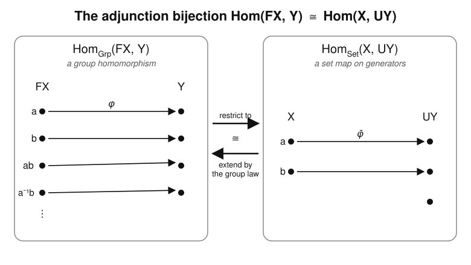

# Category Theory · Lesson 3.4: Adjoint Functors: The Central Idea

> ⏱ ~15 min · Module 3: Limits, Colimits & Adjunctions · Builds on: [Lesson 1.4](01-04-functors.md), [Lesson 1.5](01-05-natural-transformations.md), [Lesson 3.3](03-03-limits-colimits.md) · Unlocks: [Lesson 3.5](03-05-unit-counit-triangle-identities.md)

## Why this matters

If you learn one idea from this whole course, make it this one. Adjunctions are the pattern hiding behind "free" constructions, "underlying" constructions, currying a function, the product–sum duality, and — a lesson from now — every monad. Saunders Mac Lane's slogan is that *"adjoint functors arise everywhere,"* and once you can read the bijection $\operatorname{Hom}(FX,Y)\cong\operatorname{Hom}(X,UY)$ you start seeing it in places that looked unrelated: the free group on a set, the tensor–hom relationship in linear algebra, and — via the [programming-languages](../../programming-languages/syllabus.md) bridge — the fact that a two-argument function is "the same as" a function returning a function. An adjunction is the categorical word for *best approximation*: the closest solution to a problem you can't solve on the nose.

## The idea

Two categories, two functors going opposite ways:
$$
F:\mathcal{C}\to\mathcal{D},\qquad U:\mathcal{D}\to\mathcal{C}.
$$
Think of $\mathcal{C}=\mathbf{Set}$ (bare sets) and $\mathcal{D}=\mathbf{Grp}$ (groups). $U:\mathbf{Grp}\to\mathbf{Set}$ *forgets* the group structure — it hands you back the underlying set of elements. $F:\mathbf{Set}\to\mathbf{Grp}$ builds the **free group** $FX$ on a set $X$: all formal words in the letters of $X$ and their inverses, multiplied by concatenation.

Now the magic. Suppose you want a group homomorphism out of the free group, $FX\to Y$. Because *every* element of $FX$ is a product of generators, a homomorphism is **completely and freely determined by where it sends the generators** — and a generator can go anywhere in $Y$. So specifying a homomorphism $FX\to Y$ is *exactly* the same data as specifying a plain function $X\to UY$ (a choice, for each generator, of an element of $Y$). No more, no less:
$$
\{\text{group homs } FX\to Y\}\ \longleftrightarrow\ \{\text{functions } X\to UY\}.
$$

That two-way street is the entire concept. The slogan to memorize: **maps *out of* the free thing = maps *into* the underlying thing.** $F$ is called the **left adjoint** (it sits on the left of $\operatorname{Hom}$), $U$ the **right adjoint**, and we write $F\dashv U$.

## The formal version

**Definition (adjunction).** Functors $F:\mathcal{C}\to\mathcal{D}$ and $U:\mathcal{D}\to\mathcal{C}$ form an **adjunction** $F\dashv U$ ("$F$ is left adjoint to $U$") if there is a bijection
$$
\Phi_{X,Y}:\ \operatorname{Hom}_{\mathcal{D}}(FX,\,Y)\ \xrightarrow{\ \cong\ }\ \operatorname{Hom}_{\mathcal{C}}(X,\,UY)
$$
for every $X\in\mathcal{C}$ and $Y\in\mathcal{D}$, and this bijection is **natural in $X$ and $Y$**.

*In words:* a homomorphism from $FX$ into $Y$ is the same thing as a plain map from $X$ into $UY$ — reversibly, and compatibly with every arrow in sight.

The image $\Phi(f)$ of $f:FX\to Y$ is its **transpose** (or **adjunct**), written $\bar f:X\to UY$; the inverse takes $g:X\to UY$ back to $\bar g:FX\to Y$. The two are "the same map wearing different clothes."

**What "natural" means here.** $\operatorname{Hom}_{\mathcal{D}}(F-,-)$ and $\operatorname{Hom}_{\mathcal{C}}(-,U-)$ are both functors $\mathcal{C}^{\mathrm{op}}\times\mathcal{D}\to\mathbf{Set}$, and $\Phi$ is a natural isomorphism between them. Concretely, two commuting squares:

- **Naturality in $Y$:** for $h:Y\to Y'$ in $\mathcal{D}$, post-composing before or after transposing agrees —
$$
\overline{h\circ f}\ =\ Uh\circ \bar f.
$$
- **Naturality in $X$:** for $k:X'\to X$ in $\mathcal{C}$, pre-composing before or after transposing agrees —
$$
\overline{f\circ Fk}\ =\ \bar f\circ k.
$$

*In words:* it doesn't matter whether you push an arrow through the hom-set first and transpose, or transpose first and push it through — you land on the same map. That coherence is what makes the bijection a *structural* fact, not a numerical coincidence.

**Uniqueness.** Left adjoints are **unique up to natural isomorphism**: if $F\dashv U$ and $F'\dashv U$ then $F\cong F'$. (Proof sketch: $\operatorname{Hom}(FX,-)\cong\operatorname{Hom}(X,U-)\cong\operatorname{Hom}(F'X,-)$ naturally, so by the Yoneda corollary from [Lesson 2.3](02-03-yoneda-lemma.md), $FX\cong F'X$ naturally in $X$.) So "*the* free group," "*the* underlying set" are legitimately definite articles.

## Picture

A homomorphism $\varphi:FX\to Y$ (left) is a full map defined on *every* word of the free group. Its transpose $\bar\varphi:X\to UY$ (right) records only where the *generators* go. You recover $\varphi$ from $\bar\varphi$ by multiplying: $\varphi(a^{-1}b)=\bar\varphi(a)^{-1}\bar\varphi(b)$. Restrict-to-generators and extend-by-the-group-law are inverse — that is the bijection.

## Worked examples

**Example 1 (verify a hom-bijection explicitly: free monoid ⊣ forgetful).** Let $F:\mathbf{Set}\to\mathbf{Mon}$ send $X$ to the **free monoid** $X^{*}$ — finite words (lists) $x_1x_2\cdots x_n$ over the alphabet $X$, with concatenation as product and the empty word $\varepsilon$ as identity — and let $U:\mathbf{Mon}\to\mathbf{Set}$ forget. Claim: $\operatorname{Hom}_{\mathbf{Mon}}(X^{*},M)\cong\operatorname{Hom}_{\mathbf{Set}}(X,UM)$, naturally.

*Build the two directions.*
- $\Phi$ (**restrict**): given a monoid hom $\varphi:X^{*}\to M$, let $\bar\varphi:X\to UM$ be $\bar\varphi(x)=\varphi(x)$ (the letter $x$ as a one-symbol word).
- $\Psi$ (**extend**): given a function $g:X\to UM$, define $\hat g:X^{*}\to M$ by
$$
\hat g(x_1\cdots x_n)=g(x_1)\,g(x_2)\cdots g(x_n),\qquad \hat g(\varepsilon)=e_M.
$$

*Check $\hat g$ is a monoid hom.* It sends $\varepsilon\mapsto e_M$, and for words $w=x_1\cdots x_n$, $w'=y_1\cdots y_m$,
$$
\hat g(ww')=g(x_1)\cdots g(x_n)\,g(y_1)\cdots g(y_m)=\hat g(w)\,\hat g(w').\ \checkmark
$$

*Check they are mutually inverse.* $\Phi\Psi=\mathrm{id}$: $\overline{\hat g}(x)=\hat g(x)=g(x)$, so $\overline{\hat g}=g$. $\Psi\Phi=\mathrm{id}$: given $\varphi$, the map $\widehat{\bar\varphi}$ sends $x_1\cdots x_n\mapsto \bar\varphi(x_1)\cdots\bar\varphi(x_n)=\varphi(x_1)\cdots\varphi(x_n)=\varphi(x_1\cdots x_n)$ (using that $\varphi$ *is* a hom), so $\widehat{\bar\varphi}=\varphi$. Bijection established. $\blacksquare$

*Naturality in $M$ (spot-check).* For a monoid hom $h:M\to M'$, transposing $h\circ\varphi$ gives $x\mapsto h(\varphi(x))=h(\bar\varphi(x))=(Uh\circ\bar\varphi)(x)$, matching $\overline{h\circ\varphi}=Uh\circ\bar\varphi$. $\checkmark$ The reading: *a monoid homomorphism out of the free monoid on $X$ is exactly a set-function choosing an image in $M$ for each letter* — the essence of "free." This is the free⊣forgetful adjunction, the flagship bridge to [abstract-algebra](../../abstract-algebra/syllabus.md); the identical argument runs for free groups, free vector spaces (basis ⊣ underlying set), and free rings.

**Example 2 (currying is an adjunction: $(-\times A)\dashv(-)^{A}$).** Fix a set $A$. Two functors on $\mathbf{Set}$: $F=(-\times A)$ (pair with $A$) and $U=(-)^{A}$ (form the set of functions $A\to -$). The adjunction bijection is *currying*:
$$
\operatorname{Hom}(X\times A,\ Y)\ \cong\ \operatorname{Hom}\!\left(X,\ Y^{A}\right).
$$
*In words:* a function of two arguments $(x,a)$ is the same as a function of $x$ that returns a function of $a$.

The transpose in each direction:
- $f:X\times A\to Y \ \leadsto\ \bar f:X\to Y^{A}$, where $\bar f(x)=\bigl(a\mapsto f(x,a)\bigr)$. **(curry)**
- $g:X\to Y^{A}\ \leadsto\ \bar g:X\times A\to Y$, where $\bar g(x,a)=g(x)(a)$. **(uncurry)**

They undo each other: $\overline{\bar f}(x,a)=\bar f(x)(a)=f(x,a)$, and symmetrically. Here $A$ is the fixed second input, $Y^{A}$ is the "exponential" of functions into $Y$, and evaluation $Y^A\times A\to Y$ is the counit you'll meet next lesson. This is the categorical heart of the **Curry–Howard** correspondence and why type theorists write the function type $A\to Y$ as $Y^{A}$: product and exponential are adjoint, exactly as here — the bridge to [programming-languages](../../programming-languages/syllabus.md).

**A gallery worth memorizing.** Other adjunctions of the same shape:

| Left adjoint $F$ | Right adjoint $U$ | The bijection says |
|---|---|---|
| free group/monoid/module | forgetful | homs out of the free thing = maps on generators |
| discrete space $\Delta$ | underlying-set $U$ | continuous maps out of a discrete space = all set maps |
| underlying-set $U$ | indiscrete space $\nabla$ | maps into an indiscrete space = all set maps |
| $\pi_0$ (connected components) | inclusion of discrete spaces | — the "best discrete approximation" |
| $(-)\times A$ | $(-)^{A}$ | curry / uncurry |
| coproduct $\sqcup$ (left adjoint to diagonal) | diagonal $\Delta$ | maps out of a sum = a pair of maps |
| diagonal $\Delta$ | product $\times$ (right adjoint) | maps into a product = a pair of maps |

The last two rows preview next lesson's theorem: left adjoints (like $\sqcup$) build colimits, right adjoints (like $\times$) build limits.

## Watch out

- **Direction is not symmetric.** $F\dashv U$ means $F$ on the *left* inside $\operatorname{Hom}(FX,Y)$ and $U$ on the *right* inside $\operatorname{Hom}(X,UY)$. "$F$ is left adjoint to $U$" and "$U$ is right adjoint to $F$" say the same thing; "$U\dashv F$" would be a *different* (usually false) claim. Free ⊣ forgetful, never the reverse.
- **The bijection must be natural, not just a bijection.** For finite sets $\operatorname{Hom}(FX,Y)$ and $\operatorname{Hom}(X,UY)$ might happen to have the same *cardinality* by accident. An adjunction demands one *chosen* family $\Phi_{X,Y}$ commuting with all arrows — a coherent isomorphism of functors, which is far stronger.
- **"Free" is relative to a forgetful functor.** There is no absolute "free object." $FX$ is free *for the adjunction $F\dashv U$*: it solves "the most efficient way to turn the raw data $X$ into a $\mathcal{D}$-object," imposing exactly the relations forced by the axioms and no others.

## One-liner

> An adjunction $F\dashv U$ is one natural bijection $\operatorname{Hom}(FX,Y)\cong\operatorname{Hom}(X,UY)$ — "maps out of the free thing are maps into the underlying thing" — and it is the shape of nearly every canonical construction in mathematics.

## Problems

**P1 (🟢)** Let $F\dashv U$ with $F:\mathbf{Set}\to\mathbf{Mon}$ the free-monoid functor. Take $X=\{a,b\}$ and $M=(\mathbb{N},+,0)$. Using the bijection of Example 1, how many monoid homomorphisms $X^{*}\to M$ are there — is it a finite or infinite count, and why? Describe the homomorphism corresponding to the function $g(a)=2,\ g(b)=0$: what is its value on the word $aabab$?

**P2 (🟡)** Take $A=\{0,1\}$ (a two-element set), and use the currying adjunction $(-\times A)\dashv(-)^{A}$ on $\mathbf{Set}$. Let $X=\{\ast\}$ be a one-point set and $Y$ any set. Show directly that both $\operatorname{Hom}(X\times A,Y)$ and $\operatorname{Hom}(X,Y^{A})$ are in natural bijection with $Y\times Y$, and check that the transpose $\bar f(x)=(a\mapsto f(x,a))$ realizes this bijection.

**P3 (🔴, optional)** Prove that a left adjoint preserves initial objects: if $F\dashv U$ and $0$ is initial in $\mathcal{C}$, then $F0$ is initial in $\mathcal{D}$. (Recall $0$ initial means $\operatorname{Hom}_{\mathcal{C}}(0,C)$ is a one-element set for every $C$. Use the bijection at $X=0$.) This is a first taste of "left adjoints preserve colimits."

Solutions

**P1** By the adjunction, monoid homs $X^{*}\to M$ biject with set functions $\{a,b\}\to U(\mathbb{N},+,0)=\mathbb{N}$, i.e. with *pairs* $(g(a),g(b))\in\mathbb{N}\times\mathbb{N}$. So there are $|\mathbb{N}|^{2}=\aleph_0$ of them — **infinitely many**, one for each independent choice of image for the two generators (no constraint, because the generators are free). The hom for $g(a)=2,\ g(b)=0$ is $\hat g(x_1\cdots x_n)=g(x_1)+\cdots+g(x_n)$ (the product in $M$ is $+$), so it counts $2$ per $a$ and $0$ per $b$: it maps a word to $2\cdot(\#\,a\text{'s})$. On $aabab$ there are three $a$'s, giving $\hat g(aabab)=2+2+0+2+0=6$.

**P2** Elements of $X\times A$ with $X=\{\ast\}$ are $(\ast,0)$ and $(\ast,1)$, so a function $f:X\times A\to Y$ is determined by the ordered pair $\bigl(f(\ast,0),f(\ast,1)\bigr)\in Y\times Y$; this identifies $\operatorname{Hom}(X\times A,Y)\cong Y\times Y$. On the other side, $Y^{A}$ is the set of functions $\{0,1\}\to Y$, itself identified with $Y\times Y$ via $g\mapsto(g(0),g(1))$; a function $X\to Y^{A}$ is a choice of a single element of $Y^{A}$ (since $X$ is a point), so $\operatorname{Hom}(X,Y^{A})\cong Y^{A}\cong Y\times Y$. Now trace the transpose: $\bar f(\ast)=\bigl(a\mapsto f(\ast,a)\bigr)$, which under $Y^{A}\cong Y\times Y$ is the pair $\bigl(f(\ast,0),f(\ast,1)\bigr)$ — exactly the pair $f$ was identified with. So $\bar f$ is the identity on $Y\times Y$ under these identifications: the bijection is realized, and it is natural in $Y$ because post-composing with $h:Y\to Y'$ acts as $h\times h$ on both sides. $\blacksquare$

**P3** Fix any $D\in\mathcal{D}$. Apply the adjunction bijection at $X=0$:
$$
\operatorname{Hom}_{\mathcal{D}}(F0,\ D)\ \cong\ \operatorname{Hom}_{\mathcal{C}}(0,\ UD).
$$
Because $0$ is initial in $\mathcal{C}$, the right-hand set $\operatorname{Hom}_{\mathcal{C}}(0,UD)$ has exactly one element. A bijection preserves cardinality, so $\operatorname{Hom}_{\mathcal{D}}(F0,D)$ has exactly one element too — for *every* $D$. That is precisely the statement that $F0$ is initial in $\mathcal{D}$. $\blacksquare$ (Sanity check: $F0$ for free-group ⊣ forgetful is the free group on the empty set, the trivial group $\{e\}$ — indeed the initial object of $\mathbf{Grp}$.)

## Flashback

**From [Lesson 3.3](03-03-limits-colimits.md) (Limits & Colimits):** Consider the "cospan" diagram $D$ in a category $\mathcal{C}$: three objects $A,B,C$ and two arrows $f:A\to C$, $g:B\to C$ (nothing else). (a) Write down what a **cone** over $D$ with apex $W$ consists of, as a family of legs satisfying commutativity conditions. (b) Show that the leg to $C$ is *redundant* — determined by the other two — so that a cone is the same as a pair $(p:W\to A,\ q:W\to B)$ with $f\circ p=g\circ q$. (c) Conclude that $\lim D$ is exactly the **pullback** $A\times_{C}B$.

Solution

**(a)** A cone over $D$ with apex $W$ is a family of legs $\alpha_A:W\to A$, $\alpha_B:W\to B$, $\alpha_C:W\to C$ — one to each object — such that every arrow of the diagram commutes with the legs. The two arrows $f,g$ impose:
$$
f\circ\alpha_A=\alpha_C,\qquad g\circ\alpha_B=\alpha_C.
$$

**(b)** Both equations *define* $\alpha_C$ in terms of $\alpha_A,\alpha_B$: given $\alpha_A$ and $\alpha_B$, the leg $\alpha_C$ is forced to equal $f\circ\alpha_A$, and separately forced to equal $g\circ\alpha_B$. These two forced values are consistent **iff** $f\circ\alpha_A=g\circ\alpha_B$. So carrying $\alpha_C$ around is redundant: a cone is equivalent to just the pair $(p,q)=(\alpha_A,\alpha_B)$ satisfying the single equation $f\circ p=g\circ q$ (and then $\alpha_C:=f\circ p$ is recovered automatically).

**(c)** By definition $\lim D$ is the **terminal** cone: an object $P$ with legs $(p_0:P\to A,\ q_0:P\to B)$, $f p_0=g q_0$, such that every other cone $(W;p,q)$ factors through $P$ by a *unique* $u:W\to P$ with $p=p_0 u$, $q=q_0 u$. That universal property — a commuting square that every other commuting square factors through uniquely — is exactly the definition of the pullback $A\times_C B$. Hence $\lim D = A\times_C B$. $\blacksquare$

## Connections

- **Backward:** this packages [Lesson 2.2](02-02-representable-functors.md)'s representable functors and [Lesson 2.3](02-03-yoneda-lemma.md)'s Yoneda corollary — the uniqueness of left adjoints is a one-line Yoneda argument — and reuses functoriality from [Lesson 1.4](01-04-functors.md) and naturality from [Lesson 1.5](01-05-natural-transformations.md).
- **Forward:** [Lesson 3.5](03-05-unit-counit-triangle-identities.md) recasts this single bijection as a **unit** $\eta$ and **counit** $\varepsilon$ satisfying the triangle identities, and proves the workhorse theorem *right adjoints preserve limits* (RAPL) — P3 here is the left-adjoint / colimit shadow of it. [Lesson 4.1](04-01-monads.md) then builds every **monad** from an adjunction $F\dashv U$ as the endofunctor $UF$.
- **Sideways (abstract algebra):** free ⊣ forgetful is the categorical definition of *free group / free monoid / free module / polynomial ring* — see [abstract-algebra](../../abstract-algebra/syllabus.md). A presentation by generators and relations is a left adjoint applied to raw data.
- **Sideways (type theory / PL):** currying $(-\times A)\dashv(-)^{A}$ is why a function type is an exponential and underlies the **Curry–Howard** correspondence between programs and proofs — see [programming-languages](../../programming-languages/syllabus.md).
