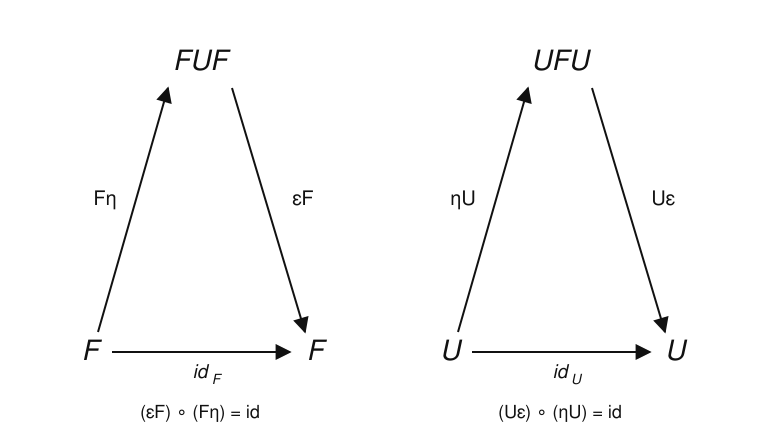

# Category Theory · Lesson 3.5: Unit, Counit & Triangle Identities

> ⏱ ~15 min · Module 3: Limits, Colimits & Adjunctions · Builds on: [3.4 Adjoint functors](03-04-adjoint-functors.md), [3.3 Limits & colimits](03-03-limits-colimits.md) · Unlocks: [4.1 Monads](04-01-monads.md)

## Why this matters

Lesson 3.4 gave you an adjunction $F \dashv U$ as a bijection of hom-sets $\operatorname{Hom}_{\mathcal D}(FX, Y) \cong \operatorname{Hom}_{\mathcal C}(X, UY)$, natural in both slots. That's clean but slippery: to *do* anything you keep transposing back and forth. This lesson repackages the same data as two natural transformations — the **unit** and **counit** — glued together by two coherence equations, the **triangle identities**. That repackaging is what powers monads (next module), and it's the form in which the single most useful theorem about adjunctions gets proved: **right adjoints preserve limits** (RAPL). RAPL is why "the underlying set of a product of groups is just the product of the sets" is a theorem you never have to check by hand again — and why so many constructions across algebra and topology commute with the forgetful functor for free.

## The idea

An adjunction $F \dashv U$ compares a "free" construction $F$ against a "forgetful" one $U$. Two canonical maps fall out with no choices:

- The **unit** $\eta_X : X \to UFX$ — *insertion of generators*. Build the free thing $FX$ on $X$, forget its structure back to a set $UFX$, and there sits a copy of your original $X$: each generator, viewed as an element. For the free monoid on $\{a,b\}$, $\eta$ sends the letter $a$ to the one-letter word $a$.
- The **counit** $\varepsilon_Y : FUY \to Y$ — *evaluation*. Take an object $Y$ that already has structure, forget it to $UY$, build the free thing $FUY$ on that, and then there's a canonical way to collapse it back onto $Y$: multiply the formal expression out. For a monoid $M$, $\varepsilon$ sends the formal word $m_1 m_2 \cdots m_n$ to the actual product in $M$.

The unit inserts; the counit evaluates. The **triangle identities** say these two are compatible: *insert generators, then evaluate, and you're back where you started.* That single sentence, drawn as two commuting triangles, contains exactly as much information as the whole natural hom-bijection — no more, no less. So an adjunction has **three faces**, and this lesson is about moving fluently between them:

1. the natural hom-bijection (Lesson 3.4),
2. unit + counit + triangle identities (this lesson),
3. a universal-arrow / initial-object property (each $\eta_X$ is the "closest approach" of $X$ to the image of $U$).

## The formal version

**Definition (unit and counit).** Given $F \dashv U$ with $F : \mathcal C \to \mathcal D$ and $U : \mathcal D \to \mathcal C$, the **unit** is a natural transformation
$$\eta : \operatorname{id}_{\mathcal C} \Rightarrow UF, \qquad \eta_X : X \to UFX,$$
and the **counit** is a natural transformation
$$\varepsilon : FU \Rightarrow \operatorname{id}_{\mathcal D}, \qquad \varepsilon_Y : FUY \to Y.$$

*In words:* $\eta$ compares "do nothing" to "go free then forget"; $\varepsilon$ compares "forget then go free" to "do nothing." They point in opposite directions because $F$ and $U$ sit on opposite sides.

You get them from the hom-bijection $\Phi_{X,Y}: \operatorname{Hom}_{\mathcal D}(FX,Y) \xrightarrow{\ \cong\ } \operatorname{Hom}_{\mathcal C}(X,UY)$ by feeding it an identity: define $\eta_X := \Phi_{X,FX}(\operatorname{id}_{FX})$ and $\varepsilon_Y := \Phi^{-1}_{UY,Y}(\operatorname{id}_{UY})$.

**Definition (triangle identities).** The unit and counit satisfy
$$(\varepsilon F) \circ (F\eta) = \operatorname{id}_F, \qquad (U\varepsilon) \circ (\eta U) = \operatorname{id}_U.$$
Here $F\eta$ and $\varepsilon F$ are **whiskerings**: $(F\eta)_X = F(\eta_X) : FX \to FUFX$ and $(\varepsilon F)_X = \varepsilon_{FX} : FUFX \to FX$; likewise $(\eta U)_Y = \eta_{UY} : UY \to UFUY$ and $(U\varepsilon)_Y = U(\varepsilon_Y) : UFUY \to UY$.

*In words:* the first says "at every $FX$: insert generators, then evaluate = do nothing"; the second says the same at every $UY$. Componentwise, $\varepsilon_{FX} \circ F(\eta_X) = \operatorname{id}_{FX}$ and $U(\varepsilon_Y) \circ \eta_{UY} = \operatorname{id}_{UY}$.

**Theorem (the three faces coincide).** The following packages of data are equivalent, each recoverable from any other:
1. a natural isomorphism $\operatorname{Hom}_{\mathcal D}(FX, Y) \cong \operatorname{Hom}_{\mathcal C}(X, UY)$;
2. natural transformations $\eta : \operatorname{id}_{\mathcal C} \Rightarrow UF$ and $\varepsilon : FU \Rightarrow \operatorname{id}_{\mathcal D}$ satisfying the two triangle identities.

The passage from (2) to (1) is explicit:
$$\Phi(g) = Ug \circ \eta_X \quad (g : FX \to Y), \qquad \Phi^{-1}(f) = \varepsilon_Y \circ Ff \quad (f : X \to UY).$$

*In words:* to transpose a map out of the free object, apply $U$ and precompose with insertion-of-generators; to transpose back, apply $F$ and postcompose with evaluation. The triangle identities are exactly what makes these two mutually inverse (proved in the worked example).

**Theorem (RAPL — right adjoints preserve limits).** If $F \dashv U$, then $U$ preserves all limits that exist in $\mathcal D$: if $\lim_j D_j$ exists then $U(\lim_j D_j) \cong \lim_j U D_j$. Dually, the left adjoint $F$ preserves all colimits.

*In words:* forgetful-type functors carry products to products, pullbacks to pullbacks, terminal objects to terminal objects — because they're right adjoints. Free-type functors carry coproducts to coproducts.

## Picture

The two triangle identities — the defining coherence of an adjunction. Left: the composite $F \xrightarrow{F\eta} FUF \xrightarrow{\varepsilon F} F$ is the identity on $F$. Right: the dual composite $U \xrightarrow{\eta U} UFU \xrightarrow{U\varepsilon} U$ is the identity on $U$.

## Worked examples

**Example 1 (derive the hom-bijection from unit + counit).** Given $\eta, \varepsilon$ with the triangle identities, define $\Phi(g) = Ug \circ \eta_X$ and $\Psi(f) = \varepsilon_Y \circ Ff$. We check $\Psi \circ \Phi = \operatorname{id}$ (the other composite is symmetric).

Take $g : FX \to Y$. Then
$$\Psi(\Phi(g)) = \varepsilon_Y \circ F(Ug \circ \eta_X) = \varepsilon_Y \circ FUg \circ F(\eta_X).$$
Now use **naturality of $\varepsilon$** at the morphism $g$. The naturality square of $\varepsilon : FU \Rightarrow \operatorname{id}$ for $g : FX \to Y$ reads $\varepsilon_Y \circ FU(g) = g \circ \varepsilon_{FX}$. Substitute:
$$\Psi(\Phi(g)) = g \circ \varepsilon_{FX} \circ F(\eta_X) = g \circ \big[(\varepsilon F)\circ(F\eta)\big]_X = g \circ \operatorname{id}_{FX} = g,$$
where the last line is precisely **triangle identity 1**. Symmetrically, $\Phi(\Psi(f)) = f$ uses naturality of $\eta$ and triangle identity 2. So $\Phi$ is a bijection — and one checks it is natural in $X$ and $Y$ because $\eta, \varepsilon$ are. This is the whole content of "the three faces coincide": the triangle identities are the naturality-plus-invertibility of the transpose.

**Example 2 (verify a triangle identity for free monoid ⊣ forgetful).** Let $F : \mathbf{Set} \to \mathbf{Mon}$ send a set $X$ to the free monoid $FX = X^* $ of finite words over $X$ (concatenation, empty word $\epsilon$ the identity), and let $U : \mathbf{Mon} \to \mathbf{Set}$ be the forgetful functor. Then:
- $\eta_X : X \to UFX = X^*$ sends a letter $x$ to the one-letter word $(x)$;
- $\varepsilon_M : FUM = (UM)^* \to M$ sends a formal word $(m_1, \dots, m_n)$ of elements of $M$ to their product $m_1 m_2 \cdots m_n$ (and $\epsilon \mapsto e$).

Check triangle identity 1, $(\varepsilon F)\circ(F\eta) = \operatorname{id}_F$, at a set $X$. Its component is $\varepsilon_{FX} \circ F(\eta_X) : X^* \to X^*$. Take a word $w = (x_1, \dots, x_n) \in X^*$.
- $F(\eta_X)$ applies $\eta_X$ letter-by-letter: $w \mapsto \big((x_1), (x_2), \dots, (x_n)\big)$ — a word *of one-letter words*, living in $(X^*)^*$.
- $\varepsilon_{FX} = \varepsilon_{X^*}$ multiplies that out in the monoid $X^* $, i.e. concatenates: $\big((x_1), \dots, (x_n)\big) \mapsto (x_1)\cdot(x_2)\cdots(x_n) = (x_1, x_2, \dots, x_n) = w.$

So the composite is the identity on $X^* $. ✓ Read aloud: *break a word into its letters (as singleton words), then concatenate them back — you recover the word.* Triangle identity 2 is even shorter: $U(\varepsilon_M) \circ \eta_{UM}$ sends $m \mapsto (m) \mapsto m$ — wrap an element as a one-letter word, then multiply it out.

**Example 3 (RAPL explains why the forgetful functor preserves products).** Why is the underlying set of $M \times N$ (product of monoids) exactly $UM \times UN$? Because $U : \mathbf{Mon} \to \mathbf{Set}$ is a **right adjoint** (to the free functor $F$), and a product is a limit. Here is the proof pattern, which is *all* of RAPL:

For any diagram $D : J \to \mathcal D$ with a limit, and any $X \in \mathcal C$,
$$
\operatorname{Hom}_{\mathcal C}\big(X,\, U(\textstyle\lim_j D_j)\big)
\;\cong\; \operatorname{Hom}_{\mathcal D}\big(FX,\, \textstyle\lim_j D_j\big)
\;\cong\; \lim_j \operatorname{Hom}_{\mathcal D}(FX, D_j)
\;\cong\; \lim_j \operatorname{Hom}_{\mathcal C}(X, U D_j)
\;\cong\; \operatorname{Hom}_{\mathcal C}\big(X,\, \textstyle\lim_j U D_j\big),
$$
naturally in $X$. Step 1 and step 3 are the adjunction; step 2 is the fact that a **representable functor $\operatorname{Hom}(FX, -)$ preserves limits** (a cone from apex $FX$ over $D$ *is* a compatible family, i.e. an element of $\lim_j \operatorname{Hom}(FX, D_j)$ — this is the universal property of $\lim$ restated); step 4 is the same fact for $\operatorname{Hom}(X,-)$ run backwards. The composite says $\operatorname{Hom}_{\mathcal C}(X, U\lim D) \cong \operatorname{Hom}_{\mathcal C}(X, \lim U D)$ naturally in $X$, so by Yoneda ([2.3](02-03-yoneda-lemma.md)) $U(\lim D) \cong \lim (UD)$.

For the product $M \times N$ (a limit over the two-object discrete diagram): $U(M \times N) \cong UM \times UN$. Concretely, the underlying set is the Cartesian product with the componentwise operation — exactly what you'd have written down, now certified by a one-line theorem rather than a hand check. The same argument gives it for $\mathbf{Grp}$, $\mathbf{Top}$ (product spaces), $\mathbf{Vect}$, and every other forgetful functor with a free left adjoint.

## Watch out

- **You might think $\eta$ and $\varepsilon$ are inverse isomorphisms** — they are not, and usually can't be (they don't even connect the same objects). $\eta_X : X \to UFX$ and $\varepsilon_Y : FUY \to Y$ live in different categories and are rarely iso. The triangle identities are *not* "$\eta$ and $\varepsilon$ cancel"; they're the weaker, whiskered statement that specific composites through $UFU$ or $FUF$ are identities. (When $\eta$ and $\varepsilon$ *are* both isos, the adjunction is an **equivalence of categories** — a special case, not the norm.)
- **You might drop the whiskering and write "$\varepsilon \circ F\eta = \operatorname{id}$" as though $\varepsilon$ were a single arrow** — but $\varepsilon F$ means "$\varepsilon$ evaluated at objects of the form $FX$," a *different* component of the same natural transformation than $\varepsilon$ alone. Getting the whiskering side right ($\varepsilon F$ vs. $U\varepsilon$, $F\eta$ vs. $\eta U$) is the whole discipline here — match a whisker to the functor whose objects the component is taken at.
- **You might expect left adjoints to preserve limits too** — they don't in general; they preserve *colimits*. The forgetful $U:\mathbf{Grp}\to\mathbf{Set}$ (a right adjoint) preserves products but *not* coproducts: the underlying set of a free product of groups is not the disjoint union of the underlying sets. RAPL is a one-directional tool; keep track of which adjoint you hold.

## One-liner

> An adjunction is a unit that inserts and a counit that evaluates, made coherent by two triangles — and because it's an adjunction, its right leg drags every limit through untouched.

## Problems

**P1 (🟢)** Free monoid ⊣ forgetful, $F \dashv U$ between $\mathbf{Set}$ and $\mathbf{Mon}$, with $\eta, \varepsilon$ as in Example 2. Let $X = \{a\}$ and $M = (\mathbb{Z}, +)$. (a) Describe the monoid $F\{a\}$ explicitly. (b) The function $f : \{a\} \to U\mathbb{Z}$ with $f(a) = 5$ has a transpose $g = \Phi^{-1}(f) = \varepsilon_{\mathbb{Z}} \circ Ff : F\{a\} \to \mathbb{Z}$. Compute $g$ on a general element and confirm it is a monoid homomorphism. (c) Check the round trip $\Phi(g) = Ug \circ \eta_{\{a\}} = f$.

**P2 (🟡)** With $\Phi(g) = Ug \circ \eta_X$ and $\Psi(f) = \varepsilon_Y \circ Ff$ as in Example 1, prove the *other* composite: for $f : X \to UY$, show $\Phi(\Psi(f)) = f$. State precisely which naturality square and which triangle identity you use, and where.

**P3 (🔴, optional)** Prove directly from the hom-bijection that a right adjoint $U$ preserves the **terminal object**: if $1$ is terminal in $\mathcal D$, then $U1$ is terminal in $\mathcal C$. (Hint: terminal = limit of the empty diagram; a terminal object $T$ is characterized by $\operatorname{Hom}(X, T)$ being a one-element set for every $X$.) Then read off the special case for free ⊣ forgetful: what is the underlying set of the terminal monoid, and does that match?

Solutions

**P1.** (a) $F\{a\} = \{a\}^*$ is the set of words in the single letter $a$: $\epsilon, a, aa, aaa, \dots$, i.e. $\{a^n : n \ge 0\}$ under concatenation ($a^m \cdot a^n = a^{m+n}$, identity $a^0 = \epsilon$). This is the free monoid on one generator, isomorphic to $(\mathbb{N}, +)$ via $a^n \mapsto n$.

(b) $Ff : \{a\}^* \to (U\mathbb{Z})^*$ applies $f$ letterwise, so the word $a^n = (a, a, \dots, a)$ maps to $(5, 5, \dots, 5)$ ($n$ copies). Then $\varepsilon_{\mathbb{Z}}$ multiplies out in $(\mathbb{Z}, +)$ — and "product" in an additive monoid is a *sum*: $(5,\dots,5) \mapsto 5 + 5 + \cdots + 5 = 5n$. So $g(a^n) = 5n$. It's a homomorphism: $g(a^m \cdot a^n) = g(a^{m+n}) = 5(m+n) = 5m + 5n = g(a^m) + g(a^n)$, and $g(\epsilon) = g(a^0) = 0$, the identity of $\mathbb{Z}$. ✓ (This $g$ is the unique monoid map sending the generator $a \mapsto 5$ — the universal property of the free monoid, which is what the adjunction *is*.)

(c) $\eta_{\{a\}} : \{a\} \to U F\{a\}$ sends $a \mapsto a^1 = a$. Then $Ug : \{a\}^* \to U\mathbb{Z} = \mathbb{Z}$ is $g$ on underlying sets, so $(Ug \circ \eta_{\{a\}})(a) = Ug(a) = g(a^1) = 5\cdot 1 = 5 = f(a)$. Since both sides are functions out of the one-element set $\{a\}$ agreeing at $a$, $\Phi(g) = f$. ✓

**P2.** Take $f : X \to UY$. Then
$$\Phi(\Psi(f)) = U(\Psi(f)) \circ \eta_X = U(\varepsilon_Y \circ Ff) \circ \eta_X = U(\varepsilon_Y) \circ UFf \circ \eta_X.$$
Apply the **naturality square of $\eta : \operatorname{id}_{\mathcal C} \Rightarrow UF$** at the morphism $f : X \to UY$. Naturality says the square with top-and-bottom $\eta_X, \eta_{UY}$ and sides $f, UF(f)$ commutes:
$$UF(f) \circ \eta_X = \eta_{UY} \circ f.$$
Substitute this for the last two factors:
$$\Phi(\Psi(f)) = U(\varepsilon_Y) \circ \eta_{UY} \circ f = \big[(U\varepsilon)\circ(\eta U)\big]_Y \circ f.$$
By **triangle identity 2**, $(U\varepsilon)\circ(\eta U) = \operatorname{id}_U$, so its component at $Y$ is $\operatorname{id}_{UY}$, giving $\Phi(\Psi(f)) = \operatorname{id}_{UY} \circ f = f$. $\blacksquare$ (So naturality of $\eta$ + triangle identity 2 gives one inverse relation, exactly mirroring Example 1's use of naturality of $\varepsilon$ + triangle identity 1 for the other.)

**P3.** Let $1$ be terminal in $\mathcal D$, so $\operatorname{Hom}_{\mathcal D}(Z, 1)$ is a one-element set for every $Z \in \mathcal D$. For any $X \in \mathcal C$, the adjunction gives a bijection
$$\operatorname{Hom}_{\mathcal C}(X, U1) \;\cong\; \operatorname{Hom}_{\mathcal D}(FX, 1).$$
The right-hand set has exactly one element (as $1$ is terminal), so the left-hand set has exactly one element too. As this holds for every $X$, the object $U1$ receives a unique arrow from each object of $\mathcal C$ — that is the definition of a terminal object. Hence $U1$ is terminal in $\mathcal C$. $\blacksquare$

This is RAPL for the empty diagram: the terminal object is $\lim$ of the empty diagram, and $U$ preserves it. Special case free ⊣ forgetful, $U : \mathbf{Mon} \to \mathbf{Set}$: the terminal monoid is the trivial monoid $\{e\}$, and its underlying set $U\{e\}$ is a one-point set — which is indeed the terminal object of $\mathbf{Set}$. Matches. ✓

## Flashback

**From Lesson 3.4 (adjunctions / currying):** In $\mathbf{Set}$, fix a set $A$ and consider the functors $(-)\times A$ and $(-)^A$ (where $C^A = \operatorname{Hom}_{\mathbf{Set}}(A, C)$ is the set of functions $A \to C$). Exhibit the **currying** bijection
$$\operatorname{Hom}_{\mathbf{Set}}(B \times A,\, C) \;\cong\; \operatorname{Hom}_{\mathbf{Set}}(B,\, C^A)$$
by writing down the map and its inverse explicitly, and state which functor is the left adjoint and which is the right adjoint.

Solution

Forward map (curry): given $h : B \times A \to C$, define $\widehat{h} : B \to C^A$ by $\widehat{h}(b) = \big(a \mapsto h(b, a)\big)$ — freeze the first argument to get a function of the second. Inverse map (uncurry): given $k : B \to C^A$, define $\check{k} : B \times A \to C$ by $\check{k}(b, a) = k(b)(a)$ — evaluate. These are mutually inverse: $\check{\widehat{h}}(b,a) = \widehat h(b)(a) = h(b,a)$, and $\widehat{\check k}(b) = (a \mapsto \check k(b,a)) = (a \mapsto k(b)(a)) = k(b)$. The bijection is natural in $B$ and $C$, so it is an adjunction
$$(-)\times A \;\dashv\; (-)^A,$$
with $(-)\times A$ the **left** adjoint and $(-)^A$ the **right** adjoint (the exponential appears on the right, receiving the map *into* it — matching the shape $\operatorname{Hom}(FB, C) \cong \operatorname{Hom}(B, UC)$ with $F = (-)\times A$, $U = (-)^A$). Its counit $\varepsilon_C : C^A \times A \to C$ is the evaluation map $(g, a) \mapsto g(a)$ — the same "evaluate" flavor as every counit. This is the categorical heart of the Curry–Howard correspondence in [programming-languages](../../programming-languages/syllabus.md): a function of two arguments is the same as a function returning a function.

## Connections

- **Backward:** this repackages the hom-bijection of [3.4](03-04-adjoint-functors.md) and leans on [Yoneda](02-03-yoneda-lemma.md) (RAPL's last step: a natural iso of representables comes from an iso of objects) and on [limits](03-03-limits-colimits.md) (RAPL is a statement about limits; the empty-diagram case recovers the terminal-object result of [2.1](02-01-universal-properties.md)).
- **Forward:** [4.1 Monads](04-01-monads.md) is *this lesson seen from one side* — the composite $T = UF$ with unit $\eta$ and multiplication $\mu = U\varepsilon F$; the monad laws are the triangle identities pushed through $U$ and $F$. The whiskering discipline you drilled here is exactly what you'll need to read $U\varepsilon F$.
- **Sideways (abstract-algebra):** free ⊣ forgetful is the running example — free monoid, free group, free vector space — and RAPL is *why* underlying sets of products, kernels, and equalizers in [abstract-algebra](../../abstract-algebra/syllabus.md) are computed setwise. The unit is "insertion of generators"; the counit is "evaluate the formal expression."
- **Sideways (programming-languages):** the currying adjunction $(-)\times A \dashv (-)^A$ (Flashback) is function types in a typed lambda calculus; its counit is `eval`. Curry–Howard reads this adjunction as a logical rule, and monads-from-adjunctions (4.1) are the monads of functional programming.
