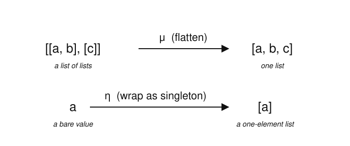
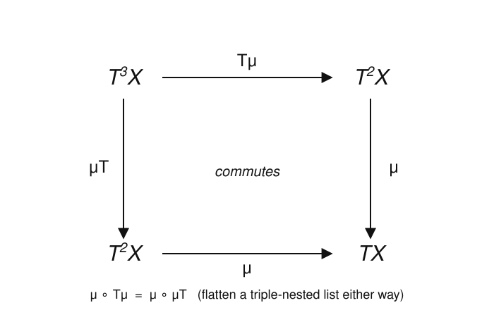

# Category Theory · Lesson 4.1: Monads

> ⏱ ~15 min · Module 4: Monads & Applications (a taste) · Builds on: [3.5 (unit, counit, triangle identities)](03-05-unit-counit-triangle-identities.md), [3.4 (adjoint functors)](03-04-adjoint-functors.md), [1.4 (functors)](01-04-functors.md), [1.5 (natural transformations)](01-05-natural-transformations.md) · Unlocks: [4.2 (algebras & monoidal categories)](04-02-algebras-monoidal-categories.md)

## Why this matters

A monad is what an adjunction looks like when you stand on one side of it and forget the other side exists. That sounds like a loss, but it's exactly the abstraction that made monads escape category theory and colonize programming: a monad packages a *notion of computation* — "a value, plus some context" — and the monad laws are precisely the rules that let you chain such computations without the bookkeeping falling apart. A list of possible results, a value that might be missing, a set of outcomes, a computation that logs as it goes: all of these are monads, and all of them come from a free⊣forgetful adjunction you've already met. This is where the machinery of Module 3 stops being scaffolding and starts paying rent.

## The idea

Think of a monad as a **wrapper** $T$ that puts a value into a context, plus two moves:

- **Wrap a bare value** — turn $a$ into the trivial context $[a]$. This is the *unit* $\eta$ ("eta").
- **Collapse a doubled context** — if you somehow end up with a *context of contexts*, flatten it back to a single context. This is the *multiplication* $\mu$ ("mu").

The running example, and the one to keep in your head: the **list** wrapper. $TX$ = "lists of elements of $X$." The unit wraps a value as a one-element list, $a \mapsto [a]$. The multiplication takes a *list of lists* and concatenates it into one list: $[[a,b],[c]] \mapsto [a,b,c]$ — that's `flatten`. The monad laws are just the two obvious sanity checks: wrapping-then-flattening does nothing, and flattening a triple-nested list gives the same answer whichever pair of brackets you dissolve first.

That's the whole concept. Everything below makes "wrapper," "flatten," and "obvious sanity checks" precise — and then reveals that *every adjunction secretly hands you one for free.*

## The formal version

**Definition (monad).** A **monad** on a category $\mathcal{C}$ is a triple $(T, \eta, \mu)$ where

- $T : \mathcal{C} \to \mathcal{C}$ is an **endofunctor** (a functor from $\mathcal{C}$ to itself),
- $\eta : \operatorname{id}_{\mathcal{C}} \Rightarrow T$ is a natural transformation, the **unit**,
- $\mu : T^2 \Rightarrow T$ is a natural transformation, the **multiplication** (here $T^2 = T \circ T$),

subject to the **monad laws**, which must hold as equalities of natural transformations $T^3 \Rightarrow T$ and $T \Rightarrow T$:

$$\mu \circ T\mu \;=\; \mu \circ \mu T \qquad\text{(associativity)},$$
$$\mu \circ T\eta \;=\; \mu \circ \eta T \;=\; \operatorname{id}_T \qquad\text{(unit laws)}.$$

*In words:* $T\mu$ and $\mu T$ are the two ways of applying $\mu$ inside a triple stack $T^3$ — flatten the inner two layers, or the outer two — and associativity says they agree. The unit laws say inserting a trivial layer with $\eta$ (either on the inside, $T\eta$, or the outside, $\eta T$) and then flattening leaves you where you started.

A note on the whiskering notation, since it trips everyone: $T\mu$ is the natural transformation whose component at $X$ is $T(\mu_X)$ (apply the functor $T$ to the morphism $\mu_X$), while $\mu T$ has component $\mu_{TX}$ (evaluate $\mu$ at the object $TX$). Same $\mu$, glued to $T$ on different sides.

**The slogan.** In the category of endofunctors $[\mathcal{C},\mathcal{C}]$, composition $\circ$ is an associative "multiplication" of objects with unit $\operatorname{id}_{\mathcal{C}}$ — a monoidal structure. A monad is exactly an **object $T$ equipped with a multiplication $\mu: T^2 \to T$ and unit $\eta: \operatorname{id} \to T$ obeying associativity and unit laws.** That is the definition of a *monoid*. Hence the famous line: **a monad is a monoid in the category of endofunctors.** (Callback to [abstract-algebra](../../abstract-algebra/syllabus.md): a monoid is a set with an associative binary operation and a unit — same axioms, one level up.)

**Where they come from.** You almost never build $\eta$ and $\mu$ by hand. You get them from an adjunction.

**Theorem (every adjunction induces a monad).** Let $F \dashv U$ be an adjunction with $F : \mathcal{C} \to \mathcal{D}$, $U : \mathcal{D} \to \mathcal{C}$, unit $\eta : \operatorname{id}_{\mathcal{C}} \Rightarrow UF$ and counit $\varepsilon : FU \Rightarrow \operatorname{id}_{\mathcal{D}}$. Then $T := UF : \mathcal{C} \to \mathcal{C}$ is a monad, with

$$\eta \;=\; \text{the adjunction unit}, \qquad \mu \;=\; U\varepsilon F \quad(\text{component } \mu_X = U(\varepsilon_{FX})).$$

*In words:* the monad's unit is the adjunction's unit unchanged; its multiplication is the counit, sandwiched between $U$ and $F$ so it becomes a map $UFUF \Rightarrow UF$, i.e. $T^2 \Rightarrow T$. And — the punchline of the whole module — **the two monad laws are the two triangle identities of Lesson 3.5 in disguise** (associativity is naturality of $\varepsilon$; the unit laws are the triangles). We prove this in Example 2 and Problem 3.

The examples all come from a free⊣forgetful adjunction, $F$ = free, $U$ = forget:

| Monad | $TX$ | $\eta_X$ | $\mu_X$ | Adjunction $F \dashv U$ |
|---|---|---|---|---|
| **List** (free monoid) | $\coprod_{n \ge 0} X^n$ | $a \mapsto [a]$ | concatenate / `flatten` | $\mathbf{Set} \rightleftarrows \mathbf{Mon}$ |
| **Powerset** | $\mathcal{P}(X)$ (all subsets) | $a \mapsto \{a\}$ | union $\bigcup$ | $\mathbf{Set} \rightleftarrows$ sup-lattices |
| **Maybe** | $X + 1$ (add a point $\bot$) | $a \mapsto a$ | merge the two $\bot$'s | $\mathbf{Set} \rightleftarrows \mathbf{Set}_*$ |

Each says the same thing: *the free structure on $X$, viewed as a plain object, is a context you can wrap into and flatten.*

## Picture

The list monad's two structure maps — wrap a value with $\eta$, flatten a list-of-lists with $\mu$:

And the associativity law as a commuting square — a triple-nested list $T^3X$ flattens to a single list $TX$, and it doesn't matter whether you dissolve the inner or the outer brackets first:

## Worked examples

**Example 1 (the list monad, laws checked by hand).** Fix a set $X$. The endofunctor $T$ sends $X$ to $TX = \coprod_{n\ge 0} X^n$, the set of finite lists over $X$, and sends a function $f: X\to Y$ to $Tf = $ "apply $f$ to each entry" (`map f`). Unit and multiplication:
$$\eta_X(a) = [a], \qquad \mu_X\big([\,\ell_1, \dots, \ell_k\,]\big) = \ell_1 \mathbin{+\!\!+} \cdots \mathbin{+\!\!+} \ell_k \quad(\text{concatenate the inner lists}).$$

*Unit laws.* Take any list $\ell = [a, b] \in TX$.
- $\eta T$ side: $\eta_{TX}(\ell) = \big[\,[a,b]\,\big]$ wraps the *whole list* as a single element; then $\mu_X\big(\big[\,[a,b]\,\big]\big) = [a,b] = \ell$. ✓
- $T\eta$ side: $T(\eta_X)(\ell) = [\,[a],[b]\,]$ wraps *each element*; then $\mu_X\big([\,[a],[b]\,]\big) = [a] \mathbin{+\!\!+} [b] = [a,b] = \ell$. ✓

Both routes are the identity, so $\mu \circ T\eta = \mu \circ \eta T = \operatorname{id}_T$.

*Associativity.* Take a triple-nested list $w = \big[\ [[a],[b,c]],\ [[d]]\ \big] \in T^3X$ (a list of two elements, each itself a list-of-lists).
- $\mu \circ T\mu$: first $T\mu = $ `map` $\mu$ over the outer list flattens each *inner* element:
$$T(\mu_X)(w) = \big[\ \mu([[a],[b,c]]),\ \mu([[d]])\ \big] = \big[\ [a,b,c],\ [d]\ \big],$$
then $\mu_X$ concatenates: $[a,b,c] \mathbin{+\!\!+} [d] = [a,b,c,d]$.
- $\mu \circ \mu T$: first $\mu T = \mu_{TX}$ concatenates the *outer* layer:
$$\mu_{TX}(w) = [[a],[b,c]] \mathbin{+\!\!+} [[d]] = \big[\ [a],[b,c],[d]\ \big],$$
then $\mu_X$ concatenates: $[a] \mathbin{+\!\!+} [b,c] \mathbin{+\!\!+} [d] = [a,b,c,d]$.

Both give $[a,b,c,d]$ — the fully flattened list. Concatenation is associative, so this is no accident; it holds for every $w$. That's $\mu \circ T\mu = \mu \circ \mu T$. This is the square in the Picture, made concrete.

**Example 2 ($T = UF$ is a monad — the unit laws from the triangle identities).** Recall the two triangle identities of an adjunction $F \dashv U$ (Lesson 3.5), holding for every object $X \in \mathcal{C}$, $Y \in \mathcal{D}$:
$$\varepsilon_{FX} \circ F(\eta_X) = \operatorname{id}_{FX} \qquad(\text{triangle 1}),$$
$$U(\varepsilon_Y) \circ \eta_{UY} = \operatorname{id}_{UY} \qquad(\text{triangle 2}).$$
With $T = UF$ and $\mu_X = U(\varepsilon_{FX})$, check the two unit laws at an object $X$.

- $(\mu \circ \eta T)_X = \mu_X \circ \eta_{TX} = U(\varepsilon_{FX}) \circ \eta_{UFX}$. This is exactly triangle 2 evaluated at $Y = FX$, so it equals $\operatorname{id}_{UFX} = \operatorname{id}_{TX}$. ✓
- $(\mu \circ T\eta)_X = \mu_X \circ T(\eta_X) = U(\varepsilon_{FX}) \circ UF(\eta_X) = U\big(\varepsilon_{FX} \circ F(\eta_X)\big) = U(\operatorname{id}_{FX}) = \operatorname{id}_{TX}$, using functoriality of $U$ to merge the two, then triangle 1. ✓

So the monad's unit laws are *literally* the adjunction's triangle identities, one whiskered by $U$ and one read off directly. (Associativity is the counit's naturality — that's Problem 3.) Specializing to $\mathbf{Set} \rightleftarrows \mathbf{Set}_*$ where $F(X) = X + 1$ adds a basepoint $\bot$ and $U$ forgets it gives the **Maybe monad** $TX = X+1$: the wrapper "a value, or nothing." This is the categorical skeleton of null-safety and exception handling — the bridge to [programming-languages](../../programming-languages/syllabus.md), where a monad is precisely the interface for sequencing effectful computations (lists = nondeterminism, Maybe = failure, and so on).

## Watch out

- **You might think $\mu : T^2 \Rightarrow T$ points the "wrong way"** — shouldn't multiplication build *up*? No: $\mu$ *collapses* a doubled context into a single one, $T^2 \to T$. It's the monoid product $m: M \times M \to M$ living one categorical level up, where "$\times$" has become functor composition. Building up is $\eta$, and even $\eta$ only inserts a *trivial* layer.
- **You might think $T\mu$ and $\mu T$ are the same map spelled two ways** — they are genuinely different morphisms ($T(\mu_X)$ vs. $\mu_{TX}$, flattening different pairs of brackets), and associativity is the *nontrivial* claim that they *agree*. If a candidate $(T,\eta,\mu)$ fails this, it isn't a monad.
- **You might think naturality is a free bonus** — it's a load-bearing axiom. $\eta$ and $\mu$ are *natural* transformations, so they commute with `map`/$Tf$ (Problem 2). Without naturality, `flatten` wouldn't cooperate with mapping a function over your data, and the laws would be about specific elements rather than the whole functor.
- **You might think a monad determines its adjunction** — many different adjunctions can induce the *same* monad (its Kleisli and Eilenberg–Moore resolutions are the extreme two; Lesson 4.2). The monad remembers the composite $UF$, not $F$ and $U$ separately.

## One-liner

> A monad is a wrapper with a way to inject a value ($\eta$) and a way to flatten nested wrappers ($\mu$) coherently — a monoid in endofunctors, and exactly what an adjunction leaves behind when you look at only one side.

## Problems

**P1 (🟢)** The **Maybe monad**. Let $TX = X + \{\bot\}$ (adjoin one fresh point $\bot$, read "nothing"). Define $\eta_X: X \to TX$ by $\eta_X(a) = a$ (the left inclusion), and $\mu_X: T^2X \to TX$, where $T^2X = X + \{\bot_1\} + \{\bot_2\}$, by $\mu_X(a) = a$ for $a\in X$ and $\mu_X(\bot_1) = \mu_X(\bot_2) = \bot$. Verify both unit laws $\mu \circ T\eta = \mu \circ \eta T = \operatorname{id}_T$ by tracking where a value $a \in X$ and the point $\bot$ each go.

**P2 (🟡)** *Naturality of `flatten`.* For the list monad, prove $\mu$ is a natural transformation $T^2 \Rightarrow T$: for every function $f : X \to Y$, the square
$$Tf \circ \mu_X \;=\; \mu_Y \circ T^2 f$$
commutes, i.e. "concatenate then map $f$" equals "map $f$ over every entry of every inner list, then concatenate." Prove it on a general list-of-lists $[\,[x_{11},\dots],\dots,[x_{k1},\dots]\,]$. (This is the [1.5](01-05-natural-transformations.md) naturality square specialized to $\mu$.)

**P3 (🔴, optional)** *Associativity from the counit.* For a general adjunction $F \dashv U$ with induced monad $T = UF$, $\mu_X = U(\varepsilon_{FX})$, prove the associativity law $\mu \circ T\mu = \mu \circ \mu T$. Show each side, evaluated at $X$, reduces to $U$ applied to one leg of the **naturality square of $\varepsilon$** taken at the morphism $\varepsilon_{FX}: FUFX \to FX$, and conclude. (This closes the loop from Example 2: all three monad laws are the adjunction's triangle identities and counit naturality.)

Solutions

**P1** Write elements of $T^2X = X + \{\bot_1\} + \{\bot_2\}$ as: $X$-values, the "inner" nothing $\bot_1$ (the $\bot$ that already sat inside the original $TX$), and the "outer" nothing $\bot_2$ (added by the second application of $T$). Recall $\mu_X$ sends $X$-values to themselves and both $\bot_1,\bot_2 \mapsto \bot$.

- $\eta T$ side: $\eta_{TX} : TX \to T^2X$ is the left inclusion, $a \mapsto a$ and $\bot \mapsto \bot_1$ (it never produces the outer $\bot_2$). Then $\mu_X$: an $X$-value $a \mapsto a \mapsto a$; the point $\bot \mapsto \bot_1 \mapsto \bot$. So $\mu \circ \eta T = \operatorname{id}_{TX}$. ✓
- $T\eta$ side: $T(\eta_X) = \eta_X + \operatorname{id}$: it applies $\eta_X$ to the "value slot" and leaves the outer point fixed. Concretely $a \mapsto \eta_X(a) = a$ and $\bot \mapsto \bot_2$. Then $\mu_X$: $a \mapsto a \mapsto a$; $\bot \mapsto \bot_2 \mapsto \bot$. So $\mu \circ T\eta = \operatorname{id}_{TX}$. ✓

Both composites fix every $X$-value and send $\bot$ back to $\bot$, hence equal $\operatorname{id}_{TX}$. (Associativity is just as quick: on $T^3X = X + \{\bot_1,\bot_2,\bot_3\}$, both $\mu\circ T\mu$ and $\mu\circ\mu T$ send $X$-values to themselves and every $\bot_i$ to $\bot$.)

**P2** Let $w = [\,\ell_1, \dots, \ell_k\,] \in T^2X$ with each $\ell_i = [x_{i1}, \dots, x_{i n_i}] \in TX$. Compute both routes.

- *Left/bottom ($Tf \circ \mu_X$):* first $\mu_X(w) = \ell_1 \mathbin{+\!\!+} \cdots \mathbin{+\!\!+} \ell_k = [x_{11}, \dots, x_{1n_1}, x_{21}, \dots, x_{k n_k}]$, one flat list. Then $Tf = $ `map f` applies $f$ entrywise:
$$Tf(\mu_X(w)) = [\,f(x_{11}), \dots, f(x_{1n_1}), f(x_{21}), \dots, f(x_{kn_k})\,].$$
- *Top/right ($\mu_Y \circ T^2 f$):* here $T^2 f = T(Tf) = $ `map (map f)` applies $f$ inside each inner list, leaving the outer structure:
$$T^2 f(w) = \big[\,[f(x_{11}),\dots,f(x_{1n_1})],\ \dots,\ [f(x_{k1}),\dots,f(x_{kn_k})]\,\big],$$
then $\mu_Y$ concatenates these:
$$\mu_Y(T^2 f(w)) = [\,f(x_{11}), \dots, f(x_{1n_1}), f(x_{21}), \dots, f(x_{kn_k})\,].$$

The two results are identical entry-for-entry (both list the $f(x_{ij})$ in the same left-to-right order, because concatenation preserves order). Since $w$ was arbitrary, $Tf \circ \mu_X = \mu_Y \circ T^2 f$, so $\mu$ is natural. $\blacksquare$

**P3** Evaluate both sides at $X$. Using $\mu_X = U(\varepsilon_{FX})$ and functoriality of $U$ and of $T = UF$:

- $(\mu \circ T\mu)_X = \mu_X \circ T(\mu_X) = U(\varepsilon_{FX}) \circ UF\big(U(\varepsilon_{FX})\big) = U\Big(\varepsilon_{FX} \circ FU(\varepsilon_{FX})\Big)$, pulling both morphisms inside one $U$.
- $(\mu \circ \mu T)_X = \mu_X \circ \mu_{TX} = U(\varepsilon_{FX}) \circ U(\varepsilon_{FUFX}) = U\Big(\varepsilon_{FX} \circ \varepsilon_{FUFX}\Big)$, since $\mu_{TX} = \mu_{UFX} = U(\varepsilon_{F(UFX)}) = U(\varepsilon_{FUFX})$.

So it suffices to show, inside $\mathcal{D}$,
$$\varepsilon_{FX} \circ FU(\varepsilon_{FX}) \;=\; \varepsilon_{FX} \circ \varepsilon_{FUFX}.$$
This is precisely the **naturality square of the counit** $\varepsilon : FU \Rightarrow \operatorname{id}_{\mathcal{D}}$, applied to the morphism $g := \varepsilon_{FX} : FUFX \to FX$. Naturality of $\varepsilon$ at a morphism $g : A \to B$ says
$$\varepsilon_B \circ FU(g) = g \circ \varepsilon_A.$$
Take $A = FUFX$, $B = FX$, $g = \varepsilon_{FX}$: the left side is $\varepsilon_{FX} \circ FU(\varepsilon_{FX})$ and the right side is $\varepsilon_{FX} \circ \varepsilon_{FUFX}$ — exactly the identity we needed. Applying $U$ to both equal morphisms gives $(\mu \circ T\mu)_X = (\mu \circ \mu T)_X$ for all $X$, i.e. $\mu \circ T\mu = \mu \circ \mu T$. $\blacksquare$

Together with Example 2, this proves the Theorem: $(UF, \eta, U\varepsilon F)$ satisfies all three monad laws, with unit laws $=$ triangle identities and associativity $=$ counit naturality.

## Flashback

**From Lesson 3.5 (right adjoints preserve limits):** The forgetful functor $U : \mathbf{Grp} \to \mathbf{Set}$ is a right adjoint (it has the free-group functor $F$ as left adjoint, $F \dashv U$). (a) Using RAPL, what is the underlying set of a product group $G \times H$, and why? (b) The coproduct in $\mathbf{Grp}$ is the *free product* $G * H$ (all reduced alternating words in $G$ and $H$). Is its underlying set the disjoint union $UG \sqcup UH$? What does your answer say about whether $U$ is a *left* adjoint?

Solution

(a) A product is a *limit*, and **right adjoints preserve limits** (RAPL). Since $U$ is a right adjoint, $U(G\times H) \cong UG \times UH$: the underlying set of the product group is the Cartesian product of the underlying sets, with multiplication componentwise. (This matches direct experience — an element of $G\times H$ is exactly a pair $(g,h)$.)

(b) No. The free product $G * H$ is enormous — its elements are arbitrarily long alternating words like $g_1 h_1 g_2 h_2 \cdots$ — vastly bigger than the disjoint union $UG \sqcup UH$. So $U$ does **not** preserve this coproduct (a colimit). A *left* adjoint would preserve colimits (LAPC, the dual of RAPL); since $U$ fails to, $U$ is not a left adjoint. It sits on the *right* of the adjunction $F \dashv U$, preserving limits but not colimits — the structural reason "underlying set of a product = product of sets" is automatic while "underlying set of a coproduct = coproduct of sets" fails.

## Connections

- **Backward:** the monad laws are the [triangle identities](03-05-unit-counit-triangle-identities.md) and the naturality of the counit (Lesson 3.5), whiskered by $U$ and $F$ — Module 4 is Module 3 cashed in. The "monoid in endofunctors" slogan reuses the monoid axioms from [abstract-algebra](../../abstract-algebra/syllabus.md), promoted one categorical level via functor composition.
- **Forward:** [Lesson 4.2](04-02-algebras-monoidal-categories.md) asks the reverse question — given a monad, which adjunctions produce it? — and finds its *algebras* (Eilenberg–Moore) and *Kleisli* category. For the list monad the algebras turn out to be exactly monoids (that's Boss problem 4), recovering $\mathbf{Mon}$ from the bare endofunctor. "Monoid in a monoidal category" is the doorway to tensor products and string diagrams there.
- **Sideways (programming-languages):** a monad is the interface for sequencing computations-with-context — `List` for nondeterminism, `Maybe`/`Option` for failure, `State` for mutable state, `IO` for effects. The unit is `return`/`pure` and $\mu$ is `join`; `flatMap`/`bind` is $\mu$ after a `map`. The monad laws are exactly what guarantees that "do-notation" refactorings are safe. See [programming-languages](../../programming-languages/syllabus.md).
