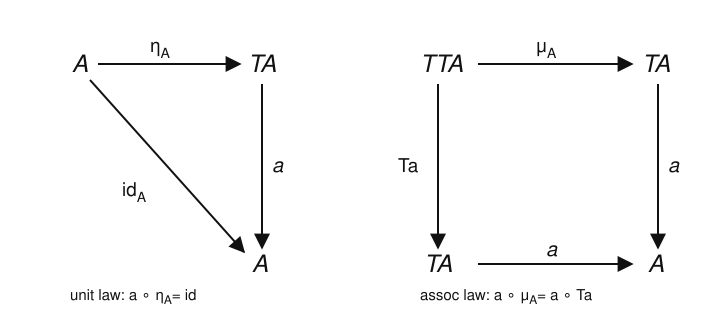
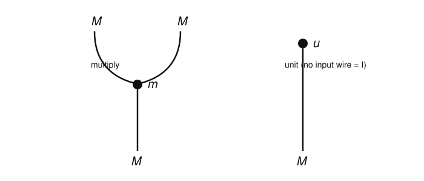

# Category Theory · Lesson 4.2: Algebras & a Taste of Monoidal Categories

> ⏱ ~15 min · Module 4: Monads & Applications (a taste) · Builds on: [4.1 Monads](04-01-monads.md), [3.1 Products & Coproducts](03-01-products-coproducts.md) · Unlocks: [4.3 Applications & Higher Categories](04-03-applications-higher-categories.md)

## Why this matters

A monad $T$ (Lesson 4.1) packages a way of *building free structure* — free monoids, free groups, wrapping a value in a list or an effect. But building structure is only half the story. The other half is: **where can you actually use it?** A $T$-algebra is an object that knows how to *consume* $T$-structure — to take a formal expression and evaluate it. The punchline of this lesson is one of the cleanest facts in the subject: for the list monad, a $T$-algebra is *exactly a monoid*. The monad remembers the algebraic structure it was distilled from, and its algebras hand it back. That "structure lives in the algebras of a monad" idea is how modern algebra, and the effect systems in functional programming (a bridge to [programming-languages](../../programming-languages/syllabus.md)), get organized.

## The idea

Think of $T$ as a machine that turns an object $A$ into *formal $T$-expressions over $A$*. For the list monad, $TA$ is the set of finite lists of elements of $A$ — think of a list $[a_1, a_2, a_3]$ as the unevaluated product $a_1 \cdot a_2 \cdot a_3$. Nobody has said what "$\cdot$" is yet; the list is just syntax.

A **$T$-algebra** supplies the semantics. It is a rule — a *structure map* $a : TA \to A$ — that evaluates any such formal expression down to a single element of $A$. Two sanity conditions make it coherent: evaluating a one-element expression should give you back that element (the **unit law**), and evaluating a nested expression should not depend on whether you flatten first or evaluate the pieces first (the **associativity law**). Those two conditions are exactly the shape of the monad's own $\eta$ and $\mu$, turned around to point *into* $A$.

Slogan: **a $T$-algebra is a place where you can evaluate $T$-structure.** For lists, "evaluating a formal product" is precisely what an associative unital operation does — so a list-algebra is a monoid.

## The formal version

Fix a monad $(T, \eta, \mu)$ on a category $\mathcal C$, where $\eta_A : A \to TA$ is the unit and $\mu_A : TTA \to TA$ the multiplication (Lesson 4.1).

**Definition (Eilenberg–Moore algebra).** A **$T$-algebra** is a pair $(A, a)$ of an object $A$ and a morphism $a : TA \to A$, the **structure map**, making these commute:
$$a \circ \eta_A = \operatorname{id}_A \qquad\text{and}\qquad a \circ \mu_A = a \circ Ta.$$

*In words:* $\eta_A$ injects $A$ as the "trivial" $T$-expressions and evaluating them changes nothing; and a doubly-wrapped element $TTA$ evaluates to the same thing whether you first collapse the outer layer with $\mu_A$ or first evaluate each inner piece with $Ta$ (recall $Ta : TTA \to TA$ is $T$ applied to the morphism $a$).

**Definition (algebra morphism).** A morphism of $T$-algebras $(A,a) \to (B,b)$ is a $\mathcal C$-morphism $f : A \to B$ with $f \circ a = b \circ Tf$. These compose, and $T$-algebras with their morphisms form the **Eilenberg–Moore category** $\mathcal C^{T}$.

**The free–forgetful pair, again.** There is a forgetful functor $\mathcal C^{T} \to \mathcal C$, $(A,a) \mapsto A$. It has a left adjoint sending $X$ to the **free $T$-algebra** $(TX, \mu_X)$ — free because $\mu_X : TTX \to TX$ automatically satisfies the two laws (they *are* two of the monad laws). This adjunction regenerates $T$, closing the loop from Lesson 4.1: every monad comes from an adjunction, and $\mathcal C^{T}$ is the "biggest" one that does.

**The Kleisli category (the computations view).** Restricting to the *free* algebras gives a leaner category $\mathcal C_T$: same objects as $\mathcal C$, but a Kleisli morphism $A \rightsquigarrow B$ is a $\mathcal C$-morphism $A \to TB$ — "a map from $A$ that produces a $B$ wrapped in $T$-structure." Identities are the units $\eta_A$, and composition threads through $\mu$. This is the mathematician's name for what a programmer calls *composing effectful functions* (`>=>` in Haskell): $\mathcal C_T$ sits inside $\mathcal C^T$ as the full subcategory of free algebras.

### A taste of monoidal categories

Where does "multiply two things" even live, categorically? In a **monoidal category** you can tensor two objects together.

**Definition (monoidal category).** A monoidal category is a category $\mathcal C$ with a bifunctor $\otimes : \mathcal C \times \mathcal C \to \mathcal C$ (the **tensor**), a **unit object** $I$, and natural isomorphisms — the **associator** $\alpha_{A,B,C} : (A\otimes B)\otimes C \xrightarrow{\ \cong\ } A\otimes(B\otimes C)$ and the **unitors** $\lambda_A : I\otimes A \xrightarrow{\cong} A$, $\rho_A : A\otimes I \xrightarrow{\cong} A$ — subject to **coherence** (Mac Lane's pentagon and triangle axioms), which guarantee that *every* way of reparenthesizing a tensor product agrees.

*In words:* a monoidal category is a category with a well-behaved "multiplication of objects" that is associative and unital *up to specified isomorphism*, not on the nose.

Examples you already know: $(\mathbf{Set}, \times, \{*\})$ — tensor is cartesian product, unit is a one-point set; $(\mathbf{Vect}_k, \otimes, k)$ — the tensor product of vector spaces, unit the ground field; $(\mathbf{Ab}, \otimes, \mathbb Z)$. A subtler one, straight from Lesson 4.1: the endofunctors $([\mathcal C, \mathcal C], \circ, \operatorname{Id})$ under composition.

**Definition (monoid object).** A **monoid object** in $(\mathcal C, \otimes, I)$ is an object $M$ with a multiplication $m : M\otimes M \to M$ and a unit $u : I \to M$ satisfying associativity ($m\circ(m\otimes \operatorname{id}) = m\circ(\operatorname{id}\otimes m)$, up to $\alpha$) and the two unit laws (up to $\lambda, \rho$).

This one definition specializes everywhere: a monoid object in $(\mathbf{Set},\times)$ is an ordinary **monoid** (worked below); in $(\mathbf{Ab},\otimes)$ it is a **ring**; in $(\mathbf{Vect}_k,\otimes)$ an associative **algebra** (the bridge to [abstract-algebra](../../abstract-algebra/syllabus.md) — monoids, rings, and algebras are one idea in three ambient categories); and in $([\mathcal C,\mathcal C],\circ,\operatorname{Id})$ it is precisely a **monad**. "Monad" literally means *monoid in the category of endofunctors*.

**String diagrams.** Monoidal categories have a graphical calculus: draw an object as a *wire*, a morphism as a *node* on wires, the tensor $\otimes$ as *side-by-side* placement, and composition as *stacking vertically*; the unit object $I$ is the empty diagram. A monoid object's multiplication $m : M\otimes M \to M$ is then two wires *merging into one*, and its unit $u : I \to M$ is a wire *born from nothing* (a cap). The monoid axioms become topological facts — you can slide nodes along wires — which is why string diagrams are the working language for tensor calculus, quantum protocols, and Feynman-style bookkeeping.

## Picture

The two commuting laws every $T$-algebra $a : TA \to A$ must satisfy — the mirror images of the monad's own unit and multiplication:

And the string-diagram calculus: a monoid's multiplication merges two strings into one; its unit is a source with no input wire.

## Worked examples

**Example 1 (a list-monad algebra is exactly a monoid — both directions).**
Let $T$ be the list monad on $\mathbf{Set}$: $TA = \coprod_{n\ge 0} A^n$ is the set of finite lists over $A$, with unit $\eta_A(x) = [x]$ and multiplication $\mu_A$ = *concatenate one level of nesting*.

*Algebra $\Rightarrow$ monoid.* Suppose $(A,a)$ is a $T$-algebra. Define $x \cdot y := a([x,y])$ and $e := a([\,])$ (evaluate the empty list). The unit law $a\circ\eta_A = \operatorname{id}$ says
$$a([x]) = x \quad\text{for all } x. \tag{$\ast$}$$
The associativity law $a\circ\mu_A = a\circ Ta$ evaluated on a list of lists $L = [L_1,\dots,L_k]$ reads
$$a\big(L_1 \,{+}\!{+}\, \cdots \,{+}\!{+}\, L_k\big) \;=\; a\big([\,a(L_1),\dots,a(L_k)\,]\big), \tag{$\dagger$}$$
"concatenate-then-evaluate = evaluate-each-then-evaluate." Now check the monoid axioms.

- *Associativity.* Apply $(\dagger)$ to $L = [\,[x,y],[z]\,]$: the left side is $a([x,y,z])$, the right is $a([\,a([x,y]),\,a([z])\,]) = a([\,(x\cdot y),\, z\,]) = (x\cdot y)\cdot z$ (using $(\ast)$ on $[z]$). So $(x\cdot y)\cdot z = a([x,y,z])$. Symmetrically, $L = [\,[x],[y,z]\,]$ gives $x\cdot(y\cdot z) = a([x,y,z])$. The two agree.
- *Identity.* Apply $(\dagger)$ to $L = [\,[\,],[x]\,]$: left side $a([x]) = x$; right side $a([\,a([\,]),\,a([x])\,]) = a([\,e,\,x\,]) = e\cdot x$. So $e\cdot x = x$, and symmetrically $x\cdot e = x$.

Hence $(A, \cdot, e)$ is a monoid. (In fact $(\dagger)$ and $(\ast)$ force $a([x_1,\dots,x_n]) = x_1\cdots x_n$, so the whole structure map *is* "take the product" — see P3.)

*Monoid $\Rightarrow$ algebra.* Conversely, let $(M,\cdot,e)$ be a monoid. Define $a : TM \to M$ by $a([x_1,\dots,x_n]) = x_1\cdots x_n$ (the empty list $\mapsto e$). Unit law: $a([x]) = x$. ✓ Associativity law: for $L = [L_1,\dots,L_k]$, both sides of $(\dagger)$ equal the product of *all* the entries across all the $L_i$ — the left by definition, the right because $a([\,a(L_1),\dots,a(L_k)\,]) = (\prod L_1)\cdots(\prod L_k)$, and associativity of $\cdot$ lets us drop the inner parentheses. ✓

The two constructions are mutually inverse, and (P2) an algebra morphism is exactly a monoid homomorphism. Therefore
$$\mathbf{Set}^{T} \;\cong\; \mathbf{Mon}.$$
The monad built to make *free* monoids has, as its algebras, *all* monoids.

**Example 2 (the monoid object in $(\mathbf{Set}, \times)$).**
Unpack the definition of a monoid object in $(\mathbf{Set},\times,\{*\})$. The data is an object $M$, a multiplication $m : M\times M \to M$, and a unit $u : \{*\} \to M$.

- $m : M\times M \to M$ is just a binary operation, $m(x,y) = x\cdot y$.
- $u : \{*\}\to M$ picks out a single element $e := u(*)$.
- Associativity $m\circ(m\times\operatorname{id}) = m\circ(\operatorname{id}\times m)$ evaluated at $(x,y,z)$ says $(x\cdot y)\cdot z = x\cdot(y\cdot z)$ (here the associator $\alpha$ is the canonical identification $(M\times M)\times M \cong M\times(M\times M)$, so it is invisible).
- The unit laws $m\circ(u\times\operatorname{id}) = \lambda$ and $m\circ(\operatorname{id}\times u) = \rho$ say $e\cdot x = x$ and $x\cdot e = x$.

That is *verbatim* the definition of a monoid. So **a monoid object in $(\mathbf{Set},\times)$ is precisely an ordinary monoid** — the categorical definition, specialized, reproduces the one you started with. Change the ambient monoidal category and the same four diagrams define rings and algebras instead.

## Watch out

- **You might think** the structure map $a : TA \to A$ goes the same way as the monad unit $\eta_A : A \to TA$ — but they point *opposite* ways. $\eta$ builds structure ($A \to TA$); $a$ consumes it ($TA \to A$). An algebra is exactly the choice of a consumer.
- **You might think** every object carries a unique $T$-algebra structure — but it needn't carry one at all, and may carry several. A $T$-algebra is *extra data* on $A$, not a property of it. (For the list monad, $\mathbb Z$ is an algebra via $+$ *and* via $\times$ — two different monoids on the same set.)
- **You might think** "monoidal category" and "a monoid object in a category" are the same phrase reshuffled — they are different levels. A *monoidal category* is an ambient setting (a category with $\otimes, I$); a *monoid object* is one object *inside* such a setting. You need the first to even define the second.
- **You might think** the associator and unitors are red tape you can ignore — but they carry real content when $\otimes$ isn't strictly associative (e.g. $(A\times B)\times C$ and $A\times(B\times C)$ are isomorphic, not equal). Coherence is the theorem that lets you *safely* ignore them.

## One-liner

> A monad's algebras are the places its structure can be evaluated — for lists that place is a monoid, so $\mathbf{Set}^{T} = \mathbf{Mon}$; and "monoid," tensored up, is one definition (monoid object) that becomes monoid, ring, algebra, or monad depending on the room it lives in.

## Problems

**P1 (🟢)** Take the monoid $(\mathbb N, +, 0)$. Write down its list-monad structure map $a : T(\mathbb N)\to\mathbb N$ explicitly, then evaluate $a([3,1,4,1])$ and $a([\,])$. Verify the associativity law $(\dagger)$ on the concrete input $L = [\,[3,1],[4],[1]\,]$ by computing both sides.

**P2 (🟡)** Prove that a morphism of list-monad algebras $f : (A,a)\to(B,b)$ is exactly a monoid homomorphism between the corresponding monoids. (Show $f\circ a = b\circ Tf$ holds **iff** $f(x\cdot_A y)=f(x)\cdot_B f(y)$ and $f(e_A)=e_B$.)

**P3 (🔴, optional)** Show that the algebra laws pin the structure map down completely: for a list-monad algebra $(A,a)$, prove by induction on $n$ that $a([x_1,\dots,x_n]) = x_1\cdot x_2\cdots x_n$ where $x\cdot y := a([x,y])$. (Conclude that no list-algebra carries "hidden" data beyond its monoid — so the correspondence of Example 1 is a genuine equivalence, not merely a bijection on objects.)

Solutions

**P1** The structure map sums a list: $a([x_1,\dots,x_n]) = x_1 + x_2 + \cdots + x_n$, with $a([\,]) = 0$ (the empty sum). So
$$a([3,1,4,1]) = 3+1+4+1 = 9, \qquad a([\,]) = 0.$$
Associativity law on $L = [\,[3,1],[4],[1]\,]$:
- *Left, $a\circ\mu$:* concatenate to $[3,1,4,1]$, then evaluate: $a([3,1,4,1]) = 9$.
- *Right, $a\circ Ta$:* evaluate each inner list — $a([3,1])=4$, $a([4])=4$, $a([1])=1$ — giving $[4,4,1]$, then evaluate: $a([4,4,1]) = 4+4+1 = 9$.

Both sides equal $9$. ✓

**P2** Let $(A,a),(B,b)$ correspond to monoids $(A,\cdot_A,e_A)$ and $(B,\cdot_B,e_B)$ via $x\cdot y = a([x,y])$, $e_A = a([\,])$, and likewise for $B$. Here $Tf : TA \to TB$ maps a list elementwise: $Tf([x_1,\dots,x_n]) = [f(x_1),\dots,f(x_n)]$.

($\Rightarrow$) Assume $f\circ a = b\circ Tf$, i.e. $f(a(\ell)) = b(Tf(\ell))$ for every list $\ell$. Take $\ell = [x,y]$: $f(x\cdot_A y) = f(a([x,y])) = b(Tf([x,y])) = b([f(x),f(y)]) = f(x)\cdot_B f(y)$. Take $\ell = [\,]$: $f(e_A) = f(a([\,])) = b(Tf([\,])) = b([\,]) = e_B$. So $f$ is a monoid homomorphism.

($\Leftarrow$) Assume $f$ preserves product and unit. By P3 the structure maps are "take the product," so for any list $\ell = [x_1,\dots,x_n]$,
$$f(a(\ell)) = f(x_1\cdot_A\cdots\cdot_A x_n) = f(x_1)\cdot_B\cdots\cdot_B f(x_n) = b([f(x_1),\dots,f(x_n)]) = b(Tf(\ell)),$$
using homomorphism-preserves-products (an easy induction on $n$, with the $n=0$ case handled by $f(e_A)=e_B$). Hence $f\circ a = b\circ Tf$. So the two notions coincide, giving the equivalence $\mathbf{Set}^T \cong \mathbf{Mon}$. $\blacksquare$

**P3** Induct on $n$.
- $n = 0$: $a([\,]) = e$ is the empty product, by definition of $e$.
- $n = 1$: $a([x_1]) = x_1$ by the unit law $(\ast)$.
- Inductive step: assume $a([x_1,\dots,x_{n-1}]) = x_1\cdots x_{n-1}$. Apply the associativity law $(\dagger)$ to the list of lists $L = [\,[x_1,\dots,x_{n-1}],\,[x_n]\,]$. Its concatenation is $[x_1,\dots,x_n]$, so the left side is $a([x_1,\dots,x_n])$. The right side is
$$a\big([\,a([x_1,\dots,x_{n-1}]),\; a([x_n])\,]\big) = a\big([\,(x_1\cdots x_{n-1}),\; x_n\,]\big) = (x_1\cdots x_{n-1})\cdot x_n,$$
using the inductive hypothesis and $(\ast)$. Therefore $a([x_1,\dots,x_n]) = (x_1\cdots x_{n-1})\cdot x_n = x_1\cdots x_n$.

So $a$ is completely determined by the binary operation $x\cdot y = a([x,y])$ and the identity $e = a([\,])$: no extra data survives. The map $(A,a)\mapsto (A,\cdot,e)$ therefore loses nothing, which (with P2 on morphisms) upgrades the object-bijection of Example 1 to an isomorphism of categories $\mathbf{Set}^T \cong \mathbf{Mon}$. $\blacksquare$

## Flashback

**From Lesson 4.1 (Monads):** For the list monad on $\mathbf{Set}$ — unit $\eta_X(x) = [x]$, multiplication $\mu_X$ = concatenate one level of nesting — verify the associativity monad law $\mu_X \circ \mu_{TX} = \mu_X \circ T\mu_X$ on the triply-nested element
$$w = \big[\ [\,[a],\,[b,c]\,],\ \ [\,[d]\,]\ \big] \ \in\ TTTX.$$

Solution

Both routes send $w \in TTTX$ to a list in $TX$; the law says they agree.

*Route 1: $\mu_X \circ \mu_{TX}$.* First $\mu_{TX}$ flattens the **outer** layer (its entries are lists-of-lists, concatenated): $\mu_{TX}(w) = [\,[a],[b,c]\,] \,{+}\!{+}\, [\,[d]\,] = [\,[a],[b,c],[d]\,] \in TTX$. Then $\mu_X$ flattens: $[a]\,{+}\!{+}\,[b,c]\,{+}\!{+}\,[d] = [a,b,c,d]$.

*Route 2: $\mu_X \circ T\mu_X$.* First $T\mu_X$ applies $\mu_X$ to **each inner** entry: $\mu_X([\,[a],[b,c]\,]) = [a,b,c]$ and $\mu_X([\,[d]\,]) = [d]$, giving $T\mu_X(w) = [\,[a,b,c],[d]\,] \in TTX$. Then $\mu_X$ flattens: $[a,b,c]\,{+}\!{+}\,[d] = [a,b,c,d]$.

Both give $[a,b,c,d]$. ✓ The monad associativity law is exactly the statement that *fully flattening a nested list is unambiguous* — which is why, one level up, the algebra law $(\dagger)$ made "evaluate the product" well-defined.

## Connections

- **Backward:** this closes the loop from [4.1 Monads](04-01-monads.md). There a monad *came from* an adjunction; here the Eilenberg–Moore category $\mathcal C^T$ and Kleisli category $\mathcal C_T$ are the two canonical adjunctions that *reproduce* it. The free algebra $(TX,\mu_X)$ reuses the coproduct-indexed construction $TX = \coprod_n X^n$ from [3.1 Products & Coproducts](03-01-products-coproducts.md).
- **Forward:** [4.3 Applications & Higher Categories](04-03-applications-higher-categories.md) takes the Kleisli view of monads into type theory and programming, and lifts "monoid object" to the 2-categorical setting where monads themselves live.
- **Sideways ([abstract-algebra](../../abstract-algebra/syllabus.md)):** the single definition *monoid object in $(\mathcal C,\otimes,I)$* becomes a monoid in $(\mathbf{Set},\times)$, a ring in $(\mathbf{Ab},\otimes)$, and an associative algebra in $(\mathbf{Vect}_k,\otimes)$ — three chapters of algebra unified as one diagram in different rooms.
- **Sideways ([programming-languages](../../programming-languages/syllabus.md)):** the Kleisli category is how functional languages compose effectful computations; a `Monad` instance is a monad, its Kleisli arrows are `a -> m b`, and `>=>` is Kleisli composition threaded through $\mu$ (`join`).
