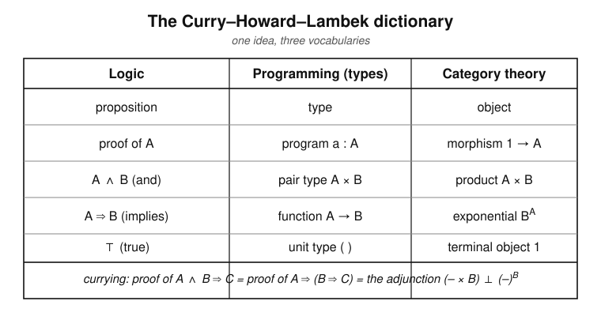
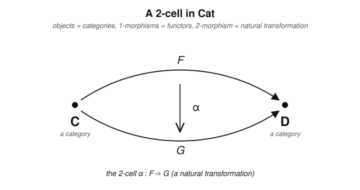

# Category Theory · Lesson 4.3: Applications & a Taste of Higher Categories

> ⏱ ~15 min · Module 4: Monads & Applications (a taste) · Builds on: [adjunctions 3.4](03-04-adjoint-functors.md), [monads 4.1](04-01-monads.md), [functor categories 1.5](01-05-natural-transformations.md) · Unlocks: nothing — this is the final lesson; the course is complete.

## Why this matters

You have spent this course learning to see *structure*: an object is its web of maps, the right definition is a universal property, and the deepest pattern is an adjunction. This last lesson collects the payoff. First, a startling fact — **logic, programming, and category theory are literally the same subject in three dialects** (the Curry–Howard–Lambek correspondence): a proposition is a type is an object, a proof is a program is a morphism. Second, the monads of [Lesson 4.1](04-01-monads.md) turn out to be the abstraction working programmers use every day to tame side effects. Third, a glimpse upward: everything in Module 1 was secretly happening one storey higher, inside a **2-category**. The lesson closes the "structural view of mathematics" arc the whole course has been building.

## The idea

Three separate-looking activities line up rung for rung:

- A **logician** proves the proposition "$A$ and $B$ implies $C$."
- A **programmer** writes a function that takes a pair `(a, b)` of type $A \times B$ and returns a `c` of type $C$.
- A **category theorist** exhibits a morphism $A \times B \to C$.

These are not analogies — they are the *same thing*, translated. Conjunction is the product, implication is the function type (an exponential object), truth is the terminal object, and a proof is just a morphism you can actually build. A category with enough structure to host this translation — finite products and exponentials — is called **cartesian closed**, and it is exactly a *model of typed lambda calculus*, the core of every functional programming language.

Then the view widens. In Module 1 you compared two functors with a natural transformation. But functors are themselves the *arrows* of a category $\mathbf{Cat}$ (objects = categories). So a natural transformation is an arrow *between two arrows* — a **2-morphism**. Ordinary categories have objects and morphisms; a 2-category has objects, morphisms, and morphisms-between-morphisms. All of Module 1 lived in one.

## The formal version

**The Curry–Howard–Lambek correspondence.** There is a three-way dictionary:

| Logic | Programming | Category theory |
|---|---|---|
| proposition $A$ | type $A$ | object $A$ |
| proof of $A$ | program $a : A$ | morphism $1 \to A$ |
| conjunction $A \wedge B$ | pair type $A \times B$ | product $A \times B$ |
| implication $A \Rightarrow B$ | function type $A \to B$ | exponential $B^A$ |
| truth $\top$ | unit type | terminal object $1$ |

*In words:* to prove a proposition is to build a program is to construct a morphism; the logical connectives are precisely the universal constructions you already know.

**Definition (cartesian closed category, CCC).** A category $\mathcal{C}$ is **cartesian closed** if it has a terminal object $1$, all binary products $A \times B$, and for every object $A$ an **exponential** $B^A$ together with an evaluation morphism $\operatorname{ev}: B^A \times A \to B$, such that the functor $(-\times A)$ is left adjoint to $(-)^A$:
$$\operatorname{Hom}(X \times A,\, B) \;\cong\; \operatorname{Hom}(X,\, B^A), \qquad (-\times A) \dashv (-)^A.$$

*In words:* a CCC is a category where you can form pairs and function-objects, and **currying** — trading a two-input map for a one-input map returning a function — is a natural bijection. That bijection is an *adjunction*, the very one from [Lesson 3.4](03-04-adjoint-functors.md). Every CCC is a model of simply-typed lambda calculus; $\mathbf{Set}$ is the prototype ($B^A$ is the set of functions $A\to B$), and so is the category of types-and-programs of any functional language.

Logically, that same adjunction is the deduction rule "$(C \wedge A) \Rightarrow B$ is interchangeable with $C \Rightarrow (A \Rightarrow B)$" — discharging a hypothesis $A$ into the conclusion. Currying, evaluation, and implication-introduction are one arrow wearing three hats.

**Monads in programming.** Recall a monad on $\mathcal{C}$ from [Lesson 4.1](04-01-monads.md): an endofunctor $T$ with a unit $\eta: \operatorname{id} \Rightarrow T$ and a multiplication $\mu: TT \Rightarrow T$ obeying the associativity and unit laws. On $\mathbf{Set}$ these are the tools a programmer uses to structure *effects*:

- **List / nondeterminism:** $TX = \coprod_{n\ge 0} X^n$ (finite lists). Here $\eta_X(x) = [x]$ (`return`) and $\mu_X$ is `concat`, flattening a list of lists. This is the **same** free-monoid monad from Boss problem 4 — now read as "a computation that may return many answers."
- **Maybe / partiality:** $TX = X \sqcup \{\ast\}$ (a value or *nothing*). $\eta_X(x)=x$; $\mu$ collapses two failures into one. It models computations that can fail.
- **State:** $TX = (S \to X \times S)$ for a fixed state set $S$. It threads a mutable state through a pure computation.

In each case, monadic composition (`bind`, the composition in the Kleisli category of [Lesson 4.2](04-02-algebras-monoidal-categories.md)) is what lets you *sequence* effectful steps while $\mu$ silently handles the bookkeeping — flattening lists, short-circuiting failures, passing state along. The monad laws are exactly what guarantees this sequencing is associative and unital.

**Definition (2-category, informally).** A **2-category** has

- **objects** (0-cells),
- **1-morphisms** $f: A \to B$ between objects, composed as usual, and
- **2-morphisms** $\alpha: f \Rightarrow g$ between *parallel* 1-morphisms $f, g: A \to B$,

with two ways to compose 2-cells — *vertically* ($f \Rightarrow g \Rightarrow h$) and *horizontally* (along a shared object) — satisfying an interchange law.

*In words:* a 2-category is a category whose hom-sets are themselves categories. The leading example is $\mathbf{Cat}$: objects are categories, 1-morphisms are functors, and **2-morphisms are natural transformations**. Vertical composition of 2-cells is the componentwise composition of natural transformations from [Lesson 1.5](01-05-natural-transformations.md). So the functor category $[\mathcal{C}, \mathcal{D}]$ is nothing but a *hom-category* of $\mathbf{Cat}$ — Module 1 was 2-categorical all along.

## Picture

The dictionary, then a 2-cell:

## Worked examples

**Example 1 (matching logic to categorical constructions).** Take the three basic connectives and read off their universal properties in a cartesian closed category.

- **Truth $\top$ = terminal object $1$.** A proof of $\top$ should be trivially available and unique. The terminal object delivers exactly this: there is a *unique* morphism $A \to 1$ from every object, so "proving $\top$ from any hypothesis $A$" has one canonical proof. And a proof of $A$ *outright* (no hypotheses) is a morphism $1 \to A$.
- **Conjunction $A \wedge B$ = product $A \times B$.** To prove $A \wedge B$ you must prove $A$ *and* prove $B$. The product's universal property says a morphism $X \to A \times B$ is precisely a *pair* of morphisms $X \to A$ and $X \to B$ — a proof of $A$ paired with a proof of $B$. And-introduction *is* the pairing map $\langle -, - \rangle$; the projections $\pi_1, \pi_2$ are and-elimination.
- **Implication $A \Rightarrow B$ = exponential $B^A$.** Modus ponens — from $A \Rightarrow B$ and $A$, conclude $B$ — is the evaluation morphism
$$\operatorname{ev}: B^A \times A \longrightarrow B.$$
A proof of $A \Rightarrow B$ from a context $C$ is a morphism $C \to B^A$, which by the adjunction is the same as a morphism $C \times A \to B$: "assume $A$, and under that assumption derive $B$." That is implication-introduction, and it is *literally* currying.

So the entire propositional calculus of $\{\top, \wedge, \Rightarrow\}$ is the universal-property toolkit of a cartesian closed category. (Disjunction $\vee$ is the coproduct, falsity $\bot$ the initial object — filling out the dictionary.)

**Example 2 (identifying the 2-cells in $\mathbf{Cat}$).** Fix the objects $\mathcal{C} = \mathcal{D} = \mathbf{Set}$. Two 1-morphisms (functors) $\mathbf{Set} \to \mathbf{Set}$:
$$F = \operatorname{id}_{\mathbf{Set}} \qquad\text{and}\qquad G = L, \text{ the list functor } LX = \coprod_{n\ge 0} X^n.$$
A 2-morphism $\alpha: F \Rightarrow G$ is a natural transformation with components $\alpha_X: X \to LX$. Take
$$\alpha_X(x) = [x] \quad(\text{the singleton list}).$$
This is the unit $\eta$ of the list monad. Check it is a genuine 2-cell — i.e. natural: for any function $h: X \to Y$ we need $L(h) \circ \alpha_X = \alpha_Y \circ h$. Chasing an element $x \in X$:
$$L(h)\big([x]\big) = [h(x)] = \alpha_Y\big(h(x)\big). \;\checkmark$$
So $\eta$ is an arrow *between two arrows* $\operatorname{id} \Rightarrow L$ in $\mathbf{Cat}$ — a textbook 2-cell. Every natural transformation you wrote in Module 1 was one of these; the monad unit and multiplication of Module 4 are 2-cells $\operatorname{id} \Rightarrow T$ and $TT \Rightarrow T$ living in $\mathbf{Cat}$.

## Watch out

- You might think Curry–Howard is a loose slogan, but it is a *theorem*: the syntax of typed lambda calculus and the language of cartesian closed categories are equivalent, so a program **is** a proof and type-checking **is** proof-checking. This is why proof assistants (Coq, Lean, Agda) are programming languages.
- You might think "2-morphism" needs new machinery, but you already own it — a 2-cell in $\mathbf{Cat}$ is just a natural transformation. What's new is only the *viewpoint*: functors are arrows, so transformations sit one level up. Do not confuse the two compositions: *vertical* stacks $F \Rightarrow G \Rightarrow H$ between fixed endpoints; *horizontal* composes along a shared category.
- You might think the programming monads are a different species from Lesson 4.1's, but the list monad here is *identical* to the free-monoid monad whose algebras are monoids (Boss problem 4). One monad, two readings: "free structure" and "effectful computation."

## One-liner

> A proof is a program is a morphism; the connectives are universal constructions; and a natural transformation was a 2-cell all along — the same few patterns, retold across logic, programming, algebra, topology, and geometry.

## Problems

**P1 (🟢)** Using the Curry–Howard–Lambek dictionary, translate each into categorical language and name the universal property that realizes it:
(a) the proof rule "from $\top$, and from a proof of $A$, we always have $A$" (identify the relevant objects/morphisms);
(b) and-elimination "from $A \wedge B$, conclude $A$";
(c) modus ponens "from $A \Rightarrow B$ and $A$, conclude $B$." Give the morphism realizing (c).

**P2 (🟡)** The **Maybe monad** on $\mathbf{Set}$ is $TX = X \sqcup \{\ast\}$ (an $X$-value, or the failure token $\ast$).
(a) Write the unit $\eta_X: X \to TX$ and the multiplication $\mu_X: TTX \to TX$. (Note $TTX = X \sqcup \{\ast\} \sqcup \{\ast'\}$ — two distinct failure tokens.)
(b) Verify the left unit law $\mu_X \circ \eta_{TX} = \operatorname{id}_{TX}$.
(c) In one sentence, explain what monadic sequencing (`bind`) does to a chain of computations when one of them returns $\ast$.

**P3 (🔴, optional)** Show that $\mathbf{Cat}$ really is a 2-category *at the level of one hom-category*: fix categories $\mathcal{C}, \mathcal{D}$ and prove that natural transformations $\mathcal{C} \to \mathcal{D}$ compose vertically to give a category — i.e. that the vertical composite $(\beta \bullet \alpha)_X := \beta_X \circ \alpha_X$ of $\alpha: F \Rightarrow G$ and $\beta: G \Rightarrow H$ is again natural, composition is associative, and each $F$ has an identity 2-cell. (This category is exactly the functor category $[\mathcal{C}, \mathcal{D}]$ of Lesson 1.5 — the hom-category of $\mathbf{Cat}$.)

Solutions

**P1** (a) $\top$ is the **terminal object** $1$; a proof of $A$ is a morphism $1 \to A$ (equivalently $C \to A$ from a context $C$). "From $A$ we have $A$" is the **identity morphism** $\operatorname{id}_A$. The universal property in play is terminality: every object admits a unique map to $1$, so $\top$ adds no content and $A \wedge \top \cong A$ (product with the terminal object). 
(b) $A \wedge B$ is the **product** $A \times B$; and-elimination is the **projection** $\pi_1: A \times B \to A$ (and $\pi_2$ for $B$). The universal property is that of the product: a map into $A\times B$ is a pair of maps, and the projections extract the components. 
(c) $A \Rightarrow B$ is the **exponential** $B^A$; modus ponens is the **evaluation** morphism
$$\operatorname{ev}: B^A \times A \longrightarrow B, \qquad \operatorname{ev}(f, a) = f(a).$$
Given a proof $p: C \to B^A$ of the implication and a proof $q: C \to A$ of the hypothesis, the conclusion $B$ is proved by $\operatorname{ev} \circ \langle p, q\rangle : C \to B$. This is the counit of the $(-\times A)\dashv(-)^A$ adjunction — the categorical form of modus ponens.

**P2** (a) Unit: $\eta_X(x) = x$ (include a value as a successful computation). Multiplication $\mu_X: TTX \to TX$ collapses the nested failure: writing the two failure tokens of $TTX$ as $\ast$ (outer) and $\ast'$ (inner-lifted),
$$\mu_X(x) = x, \qquad \mu_X(\ast') = \ast, \qquad \mu_X(\ast) = \ast.$$
That is: a genuine value stays; either kind of failure becomes the single failure $\ast$. 
(b) $\eta_{TX}: TX \to TTX$ includes $TX$ as successful outputs, so for $y \in TX$ it lands in the "value" copy. Then $\mu_X(\eta_{TX}(y)) = y$ for every $y \in TX$: if $y = x$ a value, $\eta$ sends it to the value $x$ and $\mu$ returns $x$; if $y = \ast$, $\eta$ sends it to the value-copy of $\ast$ and $\mu$ returns $\ast$. Either way $\mu_X \circ \eta_{TX} = \operatorname{id}_{TX}$. $\blacksquare$ (The right unit law $\mu_X \circ T\eta_X = \operatorname{id}$ checks the same way; associativity $\mu \circ \mu T = \mu \circ T\mu$ holds because both routes send any nesting of failures to the single $\ast$.) 
(c) `bind` runs the steps in order, but the first step that returns $\ast$ short-circuits the whole chain to $\ast$ — no later step runs — which is exactly $\mu$ collapsing nested failures.

**P3** *Vertical composite is natural.* Let $\alpha: F \Rightarrow G$ and $\beta: G \Rightarrow H$ be natural, with $F, G, H: \mathcal{C} \to \mathcal{D}$. Define $(\beta \bullet \alpha)_X = \beta_X \circ \alpha_X$. For a morphism $f: X \to Y$ in $\mathcal{C}$ we must show
$$Hf \circ (\beta\bullet\alpha)_X = (\beta\bullet\alpha)_Y \circ Ff.$$
Compute the left side and slide the two given naturality squares across, one at a time:
$$Hf \circ \beta_X \circ \alpha_X \;=\; \beta_Y \circ Gf \circ \alpha_X \quad(\beta\text{ natural}) \;=\; \beta_Y \circ \alpha_Y \circ Ff \quad(\alpha\text{ natural}) \;=\; (\beta\bullet\alpha)_Y \circ Ff. \;\checkmark$$
So $\beta \bullet \alpha$ is a natural transformation $F \Rightarrow H$. 
*Associativity.* $((\gamma\bullet\beta)\bullet\alpha)_X = (\gamma_X \circ \beta_X)\circ\alpha_X = \gamma_X\circ(\beta_X\circ\alpha_X) = (\gamma\bullet(\beta\bullet\alpha))_X$, inherited from associativity of composition in $\mathcal{D}$ componentwise. 
*Identities.* The identity 2-cell $1_F: F \Rightarrow F$ has components $(1_F)_X = \operatorname{id}_{FX}$; it is natural (the naturality square is $Ff\circ\operatorname{id} = \operatorname{id}\circ Ff$) and is a two-sided unit for $\bullet$ since $\operatorname{id}_{FX}$ is a unit in $\mathcal{D}$. 
Thus functors $\mathcal{C}\to\mathcal{D}$ and natural transformations form a category — the functor category $[\mathcal{C},\mathcal{D}]$ — which is precisely the hom-category $\mathbf{Cat}(\mathcal{C},\mathcal{D})$. $\blacksquare$

## Flashback

**From Lesson 4.1 (Monads):** For the **list monad** $T$ on $\mathbf{Set}$, $TX = \coprod_{n\ge 0} X^n$, recall the unit $\eta_X(x) = [x]$ and the multiplication $\mu_X = \text{concat}$ (flatten a list of lists). Verify the right unit law $\mu_X \circ (T\eta_X) = \operatorname{id}_{TX}$ on the element $[a, b] \in TX$ (a two-element list).

Solution

$T\eta_X = L\eta_X$ applies $\eta_X$ to each entry of the list, wrapping each element as a singleton:
$$(T\eta_X)\big([a,b]\big) = \big[\,[a],\,[b]\,\big] \in TTX.$$
Now apply $\mu_X = \text{concat}$, which flattens the outer list by concatenating its entries:
$$\mu_X\big(\,[\,[a],[b]\,]\,\big) = [a] \mathbin{+\!\!+} [b] = [a, b].$$
So $\mu_X \circ (T\eta_X)$ returns $[a,b]$ unchanged — the right unit law holds. (Compare the *left* unit law $\mu_X\circ\eta_{TX}$, which wraps the whole list once, $[a,b]\mapsto \big[[a,b]\big] \mapsto [a,b]$: both wrappings are undone by flattening, which is the content of the unit laws.) $\blacksquare$

## Connections

- **Backward:** this lesson is the capstone of the whole arc — products/coproducts and exponentials ([3.1](03-01-products-coproducts.md)), the adjunction as a hom-set bijection ([3.4](03-04-adjoint-functors.md)), monads ([4.1](04-01-monads.md)), and natural transformations/functor categories ([1.5](01-05-natural-transformations.md)) all reappear as *logic and computation*. The **Dangerous Checklist is now fully covered**: you can recognize categories, translate familiar structures, distinguish special arrows and objects, build and check functors, write naturality squares, wield universal properties and Yoneda, compute all the (co)limits, exhibit adjunctions three ways, assemble monads from adjunctions and describe their algebras, and — this lesson — name the categorical bridge between fields.
- **Sideways (programming languages):** Curry–Howard–Lambek, cartesian closed categories as models of typed lambda calculus, and monads-as-effects are the categorical backbone of [programming-languages](../../programming-languages/syllabus.md) — types are objects, programs are morphisms, `return`/`bind` are a monad's $\eta$/$\mu$, and proof assistants exploit the equivalence directly.
- **Sideways (algebraic topology):** viewing $\mathbf{Cat}$ as a 2-category — with natural transformations as 2-cells — is the first step up the ladder of *higher structure* that [algebraic-topology](../../algebraic-topology/syllabus.md) climbs; homotopies between maps behave like 2-cells, and the fundamental group(oid) and homology functors from that course are objects and 1-morphisms in this 2-categorical world.
- **Sideways (algebra & topology):** the unifying payoff — free⊣forgetful adjunctions in [abstract-algebra](../../abstract-algebra/syllabus.md), products and quotient topologies as (co)limits in [topology](../../topology/syllabus.md), and implication-as-exponential in logic are, provably, the *same* universal patterns. That is the entire thesis of the course, and where it ends: **the structural view of mathematics, complete.**
