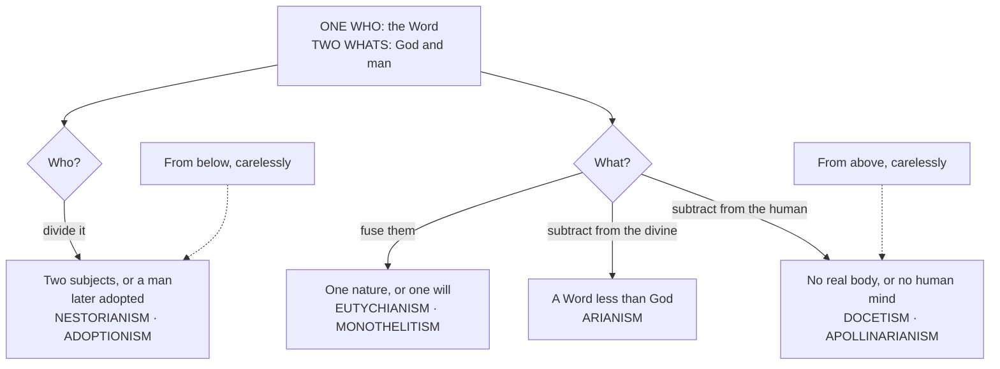

# Christology · Lesson 1.1: What Christology asks

> ⏱ ~15 min · Module 1: The Word made flesh · Builds on: [`trinity-and-god` 6.1 The missions of the Son and the Spirit](../../trinity-and-god/lessons/06-01-the-missions-of-the-son-and-the-spirit.md), [`fundamental-theology` 4.4 The ladder of doctrinal authority](../../fundamental-theology/lessons/04-04-the-ladder-of-doctrinal-authority.md) · Unlocks: [1.2 True God and true man](01-02-true-god-and-true-man.md)

## Why this matters

Christology is usually taught as a museum of heresies: Arius, Apollinaris, Nestorius, Eutyches, each with a label and a date. Learned that way it is useless. The labels don't tell you why a clever bishop held each view, or why a carol written last year can land in the same place. This lesson gives you the one instrument the course runs on, two questions called **who** and **what**, and the discipline that keeps it honest: saying how much weight each claim carries.

## The idea

Every sentence about Jesus Christ answers one of two questions.

- **Who?** Who is born, weeps, teaches, dies, rises? The Church's answer never varies and is singular: one subject, the eternal Word, the Son of the Father.
- **What?** In virtue of what does he do it? What is he, such that he can? Here the answer is double: he is God and he is man, each completely.

So the grammar of the dogma is **one *who*, two *whats***. The technical name is the [hypostatic union](../reference.md#hypostatic-union): a union in the *hypostasis* (here, "the concrete subject who acts"), not in the natures. [3.1](03-01-person-and-nature-the-hypostatic-union.md) unpacks the term.

Try it on a verse. At the tomb of Lazarus, *who* wept? The Word. *As what?* As man, because the divine nature has no tears. Both answers are needed, and neither can stand in for the other.

Now the payoff. [Nearly every Christological error](../reference.md#the-map-of-christological-errors) is a mistake about one of the two questions, and there are only four ways to make it:

1. **Divide the *who***: two subjects, the Word and a man, joined by favour or cooperation. This is Nestorianism as the councils defined it; whether Nestorius held it is [2.2](02-02-nestorius-cyril-and-ephesus.md)'s question.
2. **Fuse the *whats***: the natures blended, or one swallowing the other. This is Eutychianism, and its seventh-century cousin, one will in Christ, is monothelitism.
3. **Subtract from the divine *what***: the one who became man was less than fully God. This is Arianism.
4. **Subtract from the human *what***: a humanity that only seemed real (Docetism), or one missing its highest part, the mind (Apollinarianism).

Notice the asymmetry. You can only go wrong about the *who* by multiplying it. You can go wrong about the *whats* by merging them or by shaving one. Each move was made by someone protecting something true (Christ's unity, God's transcendence, his sinlessness), which is why they took centuries to answer.

## Source

Matthew 16:13–16 (Douay–Rheims):

> 13 And Jesus came into the quarters of Caesarea Philippi: and he asked his disciples, saying: Whom do men say that the Son of man is? 14 But they said: Some John the Baptist, and other some Elias, and others Jeremias, or one of the prophets. 15 Jesus saith to them: But whom do you say that I am? 16 Simon Peter answered and said: Thou art Christ, the Son of the living God.

Three things to see.

**The question is *whom*** (Greek *tina*, in this lesson's translation "who?"), not "what are you like?" Christ asks the identity question himself, and asks it twice. This course takes its order from him: the *who* first, and everything else as the answer's unfolding.

**The wrong answers all name a category that already exists.** A prophet returned, John raised: each is a known kind of human messenger, and each answers the question by fitting him into it. Peter's answer puts him in a class of one.

**Be honest about what the verse proves.** The Fathers often read "Son of man" and "Son of the living God" as the two natures side by side. Modern exegesis mostly reads "Son of man" from Daniel 7:13, as a title of heavenly authority, and grants that Peter's confession in its first setting need not carry everything Nicaea later said. The exegesis belongs to [`new-testament`](../../new-testament/syllabus.md). The verse poses the question, and the councils answer it. The councils knew that was what they were doing: Chalcedon's Definition receives Leo's Tome as "agreeable to the confession of the great Peter" (Percival, *NPNF* 2.14).

## The argument

1. **Scripture predicates divine things and human things of one and the same subject.** He was in the beginning with God (John 1:1–2), and he is the carpenter of Nazareth (Mark 6:3). *In words:* the New Testament's sentences about Jesus have one grammatical subject and two very different kinds of predicate.
2. **Predicates that look contradictory can be true of one subject only in different respects.** *In words:* "eternal" and "born under Augustus" can both be true of him only if he is eternal in one respect and born in another.
3. **The respects are natures.** A nature is what a thing is: the source of what it can do and undergo. *In words:* he is born in virtue of his humanity and eternal in virtue of his divinity.
4. **Therefore: one subject, two natures.** This is Chalcedon's "one and the same" Christ, confessed "in two natures" (Percival).
5. **Each classic error keeps the data and breaks one step.** Read P1 as two subjects and you have Nestorius. Collapse P3's two respects into one and you have Eutyches. Deny that P1's divine predicates are literally true and you have Arius. Deny that the human ones are fully true and you have the Docetists and Apollinaris. *In words:* the four-way map is what you get by knocking out each step in turn.

### From above and from below

These are two **approaches**, not two parties. **From above** starts where John starts, with the Word who was with God and "was made flesh" (John 1:14), and asks how the eternal Son can be a man. **From below** starts where Mark starts, with the carpenter of Nazareth, and asks how this man is the Son of God. The classical tradition mostly works from above. Many twentieth-century theologians began from below. Wolfhart Pannenberg, in *Jesus — God and Man* (German 1964), argued for starting from the history of Jesus and his resurrection. Karl Rahner wrote of ascending and descending Christologies and argued that each needs the other.

**Both routes are orthodox if, and only if, they end at the same confession.** Each has a characteristic drift. Working from above tends to thin the human *what* toward Docetism. Working from below tends to double the *who*, into a good man whom God later adopts. [6.4](06-04-christology-today.md) returns to the question.

### Citation conventions

A citation here is a lookup you can follow.

- **Councils** are cited by name and document: "Chalcedon, Definition"; "Constantinople III, definition of the two wills". Canon or anathema numbers appear only once verified.
- **Aquinas** is cited as part, question, article: ST III q.16 a.1.
- **Scripture** is cited as book, chapter and verse, in the Douay–Rheims, with the lesson's own translation where a Greek word decides the reading.
- **The Catechism** is cited by paragraph only when the number has been checked. Otherwise the lesson names the article's subject.
- **Denzinger (DH)** numbers are refused unless checked. A DH number fixes a text's location, not its weight ([`fundamental-theology` 1.1](../../fundamental-theology/lessons/01-01-what-fundamental-theology-asks.md)), and a wrong number is a dead lookup.

### What this course takes from elsewhere

[`trinity-and-god` 6.1](../../trinity-and-god/lessons/06-01-the-missions-of-the-son-and-the-spirit.md) stopped at a door. It owned the *sending* of the Son, which is the eternal generation plus a new presence in a creature, and it handed on "what was sent into": the assumed humanity and the union that makes it his. This course starts at that door. It assumes the eternal generation and the Son's personal properties ([`trinity-and-god` 4.3](../../trinity-and-god/lessons/04-03-the-two-processions.md)–[4.5](../../trinity-and-god/lessons/04-05-common-proper-appropriated.md)). It leaves the councils as events to [`church-history` 2.2](../../church-history/lessons/02-02-ephesus-chalcedon-and-leos-rome.md), the Fathers as authors to [`patristics`](../../patristics/syllabus.md), and the metaphysics of *esse* to [`thomistic-synthesis` 2.2](../../thomistic-synthesis/lessons/02-02-esse-and-essence-the-real-distinction.md).

**Mark the levels.** Use the [ladder](../../fundamental-theology/lessons/04-04-the-ladder-of-doctrinal-authority.md) and ask which act proposed the claim, and as what. Here is [the ladder applied](../reference.md#the-levels-in-christology) to four Christological claims:

- *One person in two natures* is **defined dogma**, fixed by Chalcedon's Definition (451).
- *Two natural wills* is also **defined dogma**, fixed by Constantinople III (681). It is not in the Creed, and it doesn't need to be.
- *The beatific vision in the earthly Christ's soul* is **not defined**. It is the common teaching of the schools, and papal teaching asserts it: Pius XII, *Mystici Corporis* (1943) §75, says Christ enjoyed the vision from his conception. Catholic theologians in good standing now dispute it, which is [4.3](04-03-the-beatific-vision-in-christ.md)'s subject.
- *Whether the Word would have come had Adam not sinned* is **freely disputed**, between Thomists and Scotists ([1.3](01-03-why-the-incarnation.md)).

Overstating a level is an error, and so is understating one.

## The map

The dashed edges are the two approaches' characteristic drifts, not their destinations.

## Worked examples

**Example 1: the machinery on a clean case, Chalcedon's own list of errors.** Before its Definition, the council says what the received letters oppose (Percival, *NPNF* 2.14). Sort each item:

- Those who would rend the mystery into "a Duad of Sons" have divided the ***who***.
- Those who make the Godhead capable of suffering have **fused the *whats***, lending the divine nature a human property.
- Those who imagine a mixture or confusion of the natures have **fused the *whats***.
- Those who say the form of a servant was of a heavenly substance, not taken from us, have **subtracted from the human *what***.
- Those who say "two natures before the union, one after" have **fused the *whats***: this is Eutyches.

Arius is missing because Nicaea was already received. The council drew this lesson's map itself, and what it defined against these errors is **defined dogma**.

**Example 2: where it strains, "the Word was made flesh" (John 1:14).** The verse is the charter of Christology from above, and at the surface it can be read two heretical ways at once. Read "was made" as *change*, and the Word turns into something else, with the *whats* fused or the divine one given up. Read "flesh" as *body only*, and you have the Word plus a body with no human mind, which is Apollinaris exactly ([2.1](02-01-apollinaris-a-complete-humanity.md)).

The grammar closes both doors. The *who* is fixed: the Word is the subject of the verb. The *what* must stay whole. "Flesh" in biblical idiom means a whole human being in its frailty (Luke 3:6). The so-called Athanasian Creed (not by Athanasius) puts the rule in one line: Christ is one "not by conversion of the Godhead into flesh: but by taking of the Manhood into God" (Schaff's numbering, v. 35).

The strain is this. The grammar tells you which readings are closed. It doesn't tell you what "became" positively means, when the Word loses nothing and gains a humanity. That needs the metaphysics of assumption in [3.1](03-01-person-and-nature-the-hypostatic-union.md) and the [communication of idioms](../reference.md#communication-of-idioms) in [3.2](03-02-the-communication-of-idioms.md).

## Watch out

- **You might answer a *what* question with a *who*.** "The Word cannot suffer, so it was only Jesus who died" protects impassibility by splitting the subject. That is **Nestorianism**. The right move keeps the *who* and qualifies the *what*: the Son of God died, *as man*.
- **You might think "from below" means "merely human".** It names where you start, not where you land. A from-below account that never arrives at the Word as the subject of the birth is **adoptionism**. The fault is its destination, not its route.
- **You might think "not in the Creed" means "not dogma".** Two wills, *Theotokos* and the rational soul are defined by councils, not recited on Sundays. Understating them is as much an error as calling the beatific vision in Christ a dogma.

## One-liner

> Ask "who?" and the answer is always one, the Word; ask "what?" and the answer is always two, each whole. Every heresy divides the one, fuses the two, or shaves one of them.

## Problems

**P1 (🟢)** *(Exegetical)* Five sentences from an **invented** catechist's handout, written for this problem:

> (i) "The Son of God dwelt in the son of Mary as in a temple, and the two were so joined in honour and will that we worship them together."
> (ii) "The Word took flesh, but took the place of a human mind himself, so that no human reason could waver."
> (iii) "Once united, the manhood was taken up into the Godhead like a drop of vinegar lost in the sea."
> (iv) "Christ's body only seemed to hang on the cross, for the Word cannot be touched by pain."
> (v) "The Son is the first and highest of God's works, and through him the rest were made."

For each, in one line: does it err about the *who* or the *what*, which of the four moves does it make, and what is the error called?

**P2 (🟡)** *(Exegetical)* Assign a level to each claim and name the act that fixes it, or say that no act does. One line each.
(a) Christ has a rational human soul.
(b) Christ has two natural wills. A student has marked this "common teaching, since it is not in the Creed."
(c) Christ's human soul enjoyed the beatific vision from his conception.
(d) Christ has a single act of existence (*esse*), not two.

**P3 (🔴)** *(Exegetical)* An **invented** parish talk, written for this problem:

> "Christology from below starts where the disciples did, with a good man from Nazareth. Only at his baptism did God come to dwell in this man, and from then on God and Jesus worked together as partners. And since the Word cannot suffer, it was only Jesus who died on the cross, never the Son of God."

(a) Name each error in the talk, and say whether it concerns the *who* or the *what*. (b) Say what is legitimate in "from below" and what the speaker did with it. 120 words total.

Solutions

**P1** *(Exegetical)*

**Must hit, strict:**
- (i) *Who*, divided. Two subjects joined in honour and will: **Nestorianism**.
- (ii) *What*, the human one subtracted, since the Word replaces the human mind: **Apollinarianism**.
- (iii) *What*, fused, since the humanity is absorbed into the divinity: **Eutychianism**.
- (iv) *What*, the human one subtracted, since the body is only apparent: **Docetism**.
- (v) *What*, the divine one subtracted, since the Son is a creature, however exalted: **Arianism**.

**Wrong turns:** calling (ii) Nestorian because it talks about the mind. It has one subject and too little humanity, not two subjects. Calling (iv) an error about the *who* because it mentions the Word. It gets the *who* right and denies that the humanity was real. Calling (v) "subordinationism" alone. That is acceptable only if you add that it places the Son on the creature side, which is the Arian step.

**Model answer:** (i) who, divided: Nestorianism. (ii) what, human subtracted: Apollinarianism. (iii) what, fused: Eutychianism. (iv) what, human subtracted: Docetism. (v) what, divine subtracted: Arianism.

**P2** *(Exegetical)*

**Must hit, strict:**
- (a) **Defined dogma**, fixed by Chalcedon's Definition, "of a reasonable soul and [human] body" (Percival); Constantinople III repeats it.
- (b) **Defined dogma**, fixed by Constantinople III's definition (681) of two natural wills and two natural operations. The student has **understated** it. Dogma is fixed by a defining act, not by inclusion in the Creed.
- (c) **Not defined.** It is common teaching, asserted in non-definitive papal teaching (*Mystici Corporis*, 1943, §75), and disputed today by Catholic theologians in good standing. Calling it dogma overstates it.
- (d) **Freely disputed.** No magisterial act touches it. It is a school question among Thomists and with Scotus ([3.1](03-01-person-and-nature-the-hypostatic-union.md)).

**Wrong turns:** marking (c) "defined because a pope taught it". An encyclical assertion is not a definition, and the [ladder](../../fundamental-theology/lessons/04-04-the-ladder-of-doctrinal-authority.md)'s default-down rule applies. Marking (d) "heresy to deny" because it sounds metaphysical and central: no act, no rung above the seam.

**Model answer:** (a) Defined, by Chalcedon's Definition. (b) Defined, by Constantinople III; the student understates it. (c) Common teaching, asserted by *Mystici Corporis* §75, not defined. (d) Freely disputed; no act.

**P3** *(Exegetical)*

**Must hit, strict (a):**
- "Only at his baptism did God come to dwell in this man" is **adoptionism**. It divides the *who*: the subject born of Mary is a human person, and the Word arrives later.
- "God and Jesus worked together as partners" is **Nestorianism**. Two subjects cooperating is the *who* divided again.
- "Only Jesus died, never the Son of God" splits the *who* a third time to protect a truth about the *what*.

**Must hit, strict (b):** starting from the man of Nazareth is a legitimate approach. The speaker turned the starting point into the conclusion. From below is orthodox only if it arrives at the Word as the one subject from conception.

**Wrong turns:** calling the third sentence right "because God is impassible". The divine *nature* cannot suffer, but the *who* who died is the Son, as man ([3.2](03-02-the-communication-of-idioms.md)). Calling "from below" itself the error.

**Model answer:** (a) The baptism sentence is adoptionism: a human subject whom God later indwells, so the *who* is divided. "Partners" is Nestorianism, two subjects cooperating, again the *who* divided. The last sentence divides the *who* to protect a *what* truth. The Word does not suffer as God, but the Son of God died as man, and there is no one else who died. (b) Beginning from the man Jesus is a legitimate route. The speaker stopped at the starting point and called it the destination. An account from below is orthodox only if it ends where one from above does, with the Word as the subject of everything Jesus did from his conception.

## Connections

- **Backward:** [`trinity-and-god` 6.1](../../trinity-and-god/lessons/06-01-the-missions-of-the-son-and-the-spirit.md) hands over the term of the Son's visible mission, which this course takes up. [`fundamental-theology` 4.4](../../fundamental-theology/lessons/04-04-the-ladder-of-doctrinal-authority.md) supplies every level, and its [1.1](../../fundamental-theology/lessons/01-01-what-fundamental-theology-asks.md) supplies the citation forms.
- **Forward:** [1.2](01-02-true-god-and-true-man.md) states the dogmatic core clause by clause, with each error on the map as its negative image. Module 2 walks the map one box at a time, from [2.1](02-01-apollinaris-a-complete-humanity.md) to [2.5](02-05-monothelitism-and-constantinople-iii.md). [3.2](03-02-the-communication-of-idioms.md) turns the two questions into rules for true and false sentences.
- **Sideways:** [`metaphysics` 6.5](../../metaphysics/lessons/06-05-what-a-person-is.md) asks what a person is, which is the philosophical question beneath the *who*. [`church-history` 2.2](../../church-history/lessons/02-02-ephesus-chalcedon-and-leos-rome.md) tells the story of the councils that drew the map. See the course [syllabus](../syllabus.md) for every cession.
