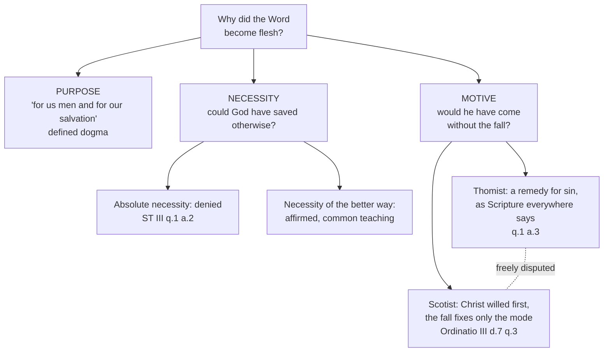

# Christology · Lesson 1.3: Why the Incarnation?

> ⏱ ~15 min · Module 1: The Word made flesh · Builds on: [1.2 True God and true man](01-02-true-god-and-true-man.md), [`trinity-and-god` 6.1 The missions](../../trinity-and-god/lessons/06-01-the-missions-of-the-son-and-the-spirit.md) · Unlocks: [1.4 Arius and the divinity of the Son](01-04-arius-and-the-divinity-of-the-son.md), [5.3 Satisfaction](05-03-satisfaction-anselm-and-aquinas.md)

## Why this matters

[1.2](01-02-true-god-and-true-man.md) said *what* the Incarnation is. Christology inherits three "why" questions: what the Incarnation accomplishes, whether God had to do it this way, and whether he would have done it had Adam not sinned. The first has a dogmatic answer; the others do not, and this lesson trains keeping them apart — and a form of argument, *convenientia*, that modern readers mistake for either proof or decoration.

## The idea

Ask a composer why the symphony ends on the tonic. She will not say "it had to"; plenty of great music ends elsewhere. Nor will she say "no reason." She will show you why, given everything before it, that ending is *right*. That is an argument from [fittingness](../reference.md#fittingness): it starts from something freely done and exposes its intelligibility, without claiming the doer was forced.

Theology needs this form because its central facts are free acts of God. A proof that God *must* become incarnate would make the gift a necessity of his nature; saying "no reason" would make it arbitrary. Fittingness runs between them, and it runs in one direction only: **from the revealed fact to its reasons, never from the reasons to the fact.** Nobody could have deduced the Incarnation from the goodness of God; once it is revealed, the goodness of God explains it.

So the lesson has three layers:

- **Purpose.** What the Incarnation is *for*. The Creed answers: "for us men and for our salvation" (Percival's translation of the Creed of Nicaea).
- **Necessity.** Was it the only way? Aquinas answers with a distinction between two kinds of necessity.
- **Motive.** Would the Word have come without the fall? A question the Church has left open, and two great schools answer differently.

## Source

*Summa Theologiae* III q.1 a.2, "Whether it was necessary for the restoration of the human race that the Word of God should become incarnate?" — the *respondeo*'s opening (English Dominican Province):

> I answer that, A thing is said to be necessary for a certain end in two ways. First, when the end cannot be without it; as food is necessary for the preservation of human life. Secondly, when the end is attained better and more conveniently, as a horse is necessary for a journey. In the first way it was not necessary that God should become incarnate for the restoration of human nature. For God with His omnipotent power could have restored human nature in many other ways. But in the second way it was necessary that God should become incarnate for the restoration of human nature.

Two phrases decide it. **"The end cannot be without it"** names absolute necessity relative to an end, and Aquinas denies it outright: God's power had other ways. **"Better and more conveniently"** — *convenientius*, the root of *convenientia* — names the horse-necessity: you could walk, but a sane traveller takes the horse. The article then lists what the horse buys: surer faith, raised hope, kindled charity, a visible example, full participation in the divinity — and, among the goods of withdrawal from evil, a satisfaction only one who is God and man could make.

## The argument

1. **The fact and its purpose are confessed.** The Word "for us men and for our salvation came down and was incarnate and was made man" (Creed of Nicaea, Percival). *In words:* the Incarnation is never stated in the Creed without its "for us."
2. **The Catechism gathers four purposes** under the heading "Why did the Word become flesh?" (CCC 456–460): to save us by [reconciling us with God](../reference.md#why-the-word-became-flesh) (457); so that we might know God's love (458, citing 1 John 4:9 and John 3:16); to be our model of holiness (459, citing Matthew 11:29 and John 14:6); and to make us "partakers of the divine nature" (460, citing 2 Peter 1:4). Paragraph 460 backs the last with Irenaeus, Aquinas, and Athanasius, whose line reads in Robertson's translation: "For He was made man that we might be made God" (*On the Incarnation* 54.3). *In words:* the Word came to rescue us, to show us, to lead us, and to lift us — and the last is the deepest, because the first three serve it. [Deification](../reference.md#deification) means sharing by grace what the Son is by nature, which is why [`patristics` 3.1](../../patristics/lessons/03-01-athanasius.md) insists it is not pantheism.
3. **It was fitting (q.1 a.1).** God's nature is goodness; goodness communicates itself (Aquinas follows Dionysius); so the highest good fittingly communicates itself in the highest way — by joining a created nature to itself in one person. *In words:* the Incarnation is what boundless generosity looks like when it goes all the way. The reply to the first objection adds that nothing changed in God; the creature was united to him in a new way, the same asymmetry as the missions in [`trinity-and-god` 6.1](../../trinity-and-god/lessons/06-01-the-missions-of-the-son-and-the-spirit.md).
4. **It was necessary only in the second sense (q.1 a.2).** Not "the end cannot be without it," but "better and more fitting," with Augustine cited: other ways were not wanting to God, but none more fitting for healing our misery. *In words:* God could have saved us otherwise; he chose the way that heals the most at once. This is [two kinds of necessity](../reference.md#two-kinds-of-necessity), and it is the distinction every problem below turns on.
5. **The motive: the Thomist answer (q.1 a.3).** Aquinas begins by reporting "different opinions" and says assent should "seemingly" go to the view that without sin there would have been no Incarnation. His reason is about evidence: what God freely wills beyond the creature's due we know only from Scripture, and

   > everywhere in the Sacred Scripture the sin of the first man is assigned as the reason of Incarnation, it is more in accordance with this to say that the work of Incarnation was ordained by God as a remedy for sin ... And yet the power of God is not limited to this

   *In words:* since the only record of God's decree ties the coming to sin, say it was for sin — while granting that God *could* have come regardless.
6. **The motive: the Scotist answer.** John Duns Scotus (*Ordinatio* III d.7 q.3, the standard locus) argues from the order of a wise will: one who wills rationally wills the end before the means, and the greater good before the lesser. The glory of Christ — a created nature united to God and loving him more than any creature could — is the summit of God's works, so it cannot have been willed merely on the occasion of a lesser thing, the repair of sin. Christ is therefore predestined first, prior to any foreseen fall; the fall determines only *how* he came — in passible flesh, as redeemer. The texts: Colossians 1:15–20 (firstborn of every creature, all things created in him and for him, primacy in all things) and Ephesians 1:9–10 (God's purpose to re-establish all things in Christ), with Ephesians 1:4's election in him before the foundation of the world. *In words:* Christ is not Plan B; creation was for him from the start. The position is often called the **absolute primacy of Christ**.

**Mark the levels.** That the Word became man for our salvation is confessed in the Creed: **defined dogma**. The four purposes keep the weight of their sources, not of the Catechism, which is a compendium that grades nothing ([`fundamental-theology` 4.5](../../fundamental-theology/lessons/04-05-reading-a-documents-weight.md)); reconciliation and our sharing in the divine nature are scriptural and confessed, while how deification is to be explained belongs to the schools. The fittingness analysis of aa.1–2 is **common teaching**, never defined. That God acted without compulsion is secured by analogy with Vatican I, which defined that God created by a will "free from all necessity" (*Dei Filius*, canons on God the Creator, 5) — applying this to the Incarnation is a theological conclusion no school denies. Whether redemption strictly required a God-man's satisfaction (Anselm yes, Aquinas no) is **freely disputed**, and belongs to [5.3](05-03-satisfaction-anselm-and-aquinas.md). The [motive of the Incarnation](../reference.md#the-motive-of-the-incarnation) is **freely disputed**: no council, pope or Catechism paragraph has settled it, and Aquinas's own "seemingly" marks his answer as an opinion. See [the levels in Christology](../reference.md#the-levels-in-christology).

## Map of positions

## Worked examples

**Example 1 — the machinery on a clean case: "Couldn't God just have forgiven us?"** Run a.2. *First-kind necessity?* Aquinas says no: God's omnipotence had "many other ways," and nothing forced him to require anything. So the sceptic's premise — God could have forgiven by decree — is one Aquinas *grants*. *Second-kind necessity?* Yes: a decree would have left us forgiven but not taught, not shown how far God's love goes, not given an example we could see and follow, not raised our nature into union with God. Fittingness answers not by denying the alternative but by showing what the chosen way gives that it lacks — reading what God did, never telling him what he had to do. Anselm, who argued that a God-man was strictly required, takes the other route, and [5.3](05-03-satisfaction-anselm-and-aquinas.md) sets the two side by side.

**Example 2 — where it strains: "O happy fault."** Aquinas closes a.3 ad 3 by quoting the Exsultet of the Easter Vigil: "O happy fault, that merited such and so great a Redeemer!" For him the verse fits his view exactly: God permits evils to draw a greater good from them, and nothing prevents human nature having been raised higher *after* sin (Romans 5:20). The fall is the occasion of the greatest gift.

A Scotist sings the same verse without flinching, and the way he does it is instructive. The fault is happy because it merited a *Redeemer* — the Word come in suffering flesh, dying and rising. That mode, the Scotist says, is conditioned by sin; the Incarnation itself is not. And he presses his own text: the hymn of Colossians 1:15–20 opens with all things created in Christ. The Thomist presses back with its close at 1:20, peace made "through the blood of his cross": even the primacy hymn arrives at redemption.

Where exactly they part is the module's boss problem. The lesson here: a liturgical text both schools can sing settles nothing between them, and neither may claim it as a proof.

## Watch out

- **You might think "fitting" means "probably true."** Fittingness presupposes the revealed fact and displays its wisdom; using it to *discover* what God must do inverts it.
- **You might think the Incarnation was necessary for God**, since goodness must share itself. That turns a.1's "fitting" into compulsion and contradicts a.2's first-kind denial; pushed to the end, a God who must pour himself out into the world is the self-unfolding divine essence that Vatican I condemns as **pantheism** (*Dei Filius*, canons on God the Creator, 4).
- **You might think deification makes us God by nature.** That is the same **pantheism**, and the tradition blocks it with one word: we share *by grace* what the Son is by nature.
- **You might think the Incarnation was mainly an example.** The model of holiness is one of four purposes, not the whole. A Christ who only shows the way leaves us to walk it by our own power, which is the shape of **Pelagianism** ([`patristics` 4.5](../../patristics/lessons/04-05-augustine-against-the-pelagians.md)).
- **You might think the Scotist view is suspect**, or the Thomist view "sin-centred." Aquinas is a Doctor of the Church, Scotus was beatified in 1993, and neither view has ever been censured. Calling either a heresy, or either a dogma, is a level error graded strictly.

## One-liner

> The Word came for our salvation — that much is dogma; that no other way was so fitting is Aquinas's reading of it; whether he would have come without the fall is a question the Church leaves open.

## Problems

**P1 (🟢)** *(Exegetical)* For each sentence, say which kind of necessity from ST III q.1 a.2 it asserts (the end cannot be without it / better and more fitting / neither), and whether Aquinas would accept it as stated. One sentence each.

(i) "Faith is surest when God himself is the one speaking, so it was necessary that the Truth take flesh and teach."
(ii) "Without the Incarnation, God had no way to restore fallen human nature."
(iii) "God is the highest good, so he was bound to unite a creature to himself in person."

**P2 (🟡)** *(Exegetical)* An invented Christmas homily, written for this problem and not the words of any real person:

> "Why did God become man? Because he had to. Love cannot hold itself back, and once Adam fell, God had no other way to save us — the Incarnation was the only possible rescue. Some medieval theologians, following Scotus, said Christ would have come even without sin, but the Church rejected that, because Scripture says he came to save sinners. Tonight we celebrate the one thing God could not help doing."

(a) Name the two claims about necessity the homily makes, and correct each from q.1 aa.1–2. (b) Identify the level error in the sentence about Scotus, and state the question's actual level with the evidence for it. **Two sentences per part.**

**P3 (🔴)** *(Exegetical)* ST III q.1 a.2, reply to objection 2 (English Dominican Province), abridged:

> Satisfaction may be said to be sufficient in two ways—first, perfectly, inasmuch as it is condign, being adequate to make good the fault committed, and in this way the satisfaction of a mere man cannot be sufficient for sin ... Hence for condign satisfaction it was necessary that the act of the one satisfying should have an infinite efficiency, as being of God and man. Secondly, man's satisfaction may be termed sufficient, imperfectly—i.e. in the acceptation of him who is content with it, even though it is not condign, and in this way the satisfaction of a mere man is sufficient.

A reader objects: "The respondeo says the Incarnation was *not* necessary in the first way; this reply says it *was* necessary. Aquinas contradicts himself." In 120 words or fewer, show that he does not, naming the end relative to which each necessity holds.

Solutions

**P1** *(Exegetical)*

**Must hit, strict:** (i) **Better and more fitting** — it is a.2's first "furtherance in good," faith made more certain by believing God himself who speaks; Aquinas accepts it *only* read as second-kind necessity, and the word "necessary" in the sentence should be heard as the horse, not the food. (ii) **The end cannot be without it** — and Aquinas **rejects** it: God "could have restored human nature in many other ways." (iii) **Neither kind as a.2 defines them** — it asserts a necessity binding God himself, not a means to an end; Aquinas rejects it, since a.1 concludes only that the Incarnation was *fitting* to God's goodness.

**Wrong turns:** marking (i) as first-kind because it contains "necessary"; the test is the relation to the end, not the vocabulary. Marking (iii) as a.1's own conclusion — a.1 argues fittingness, and its whole shape is from the fact to the reason. Answering (ii) "Aquinas accepts it, since only a God-man could make condign satisfaction" — that confuses the end of *restoration* with the narrower end of *condign satisfaction*, which is P3.

**Model answer:** (i) Second kind; accepted in that sense, since faith is surer when God himself speaks. (ii) First kind; rejected, because God's omnipotence had many other ways. (iii) Neither — it binds God himself rather than naming a means to an end; rejected, since a.1 argues only that the Incarnation was fitting.

**P2** *(Exegetical)*

**Must hit, strict (a):** claim one, **God had to because love cannot hold back** — a necessity in God himself; a.1 concludes only that the Incarnation *befits* the divine goodness, and God's free will stands behind it (by analogy with Vatican I's definition that God created by a will free from all necessity). Claim two, **no other way to save us** — first-kind necessity; a.2 denies it outright: God could have restored us in many other ways, and the Incarnation is necessary only as the better and more fitting way.

**Must hit, strict (b):** the error is **overstatement to the point of fabrication** — the Church has *not* rejected the Scotist view; the motive of the Incarnation is **freely disputed**. Evidence: no council or pope has decided it; Scotist and Thomist schools both hold their positions without censure; Aquinas himself calls the question one of "different opinions" and gives his answer with "seemingly," and even grants that God could have become incarnate without sin.

**Wrong turns:** correcting claim one by saying the Incarnation had no reasons at all — the fix is fittingness, not arbitrariness. Treating Aquinas's citation of 1 Timothy 1:15 (in a.3's *sed contra*) as a definition. Correcting (b) by asserting the Scotist view is the Church's teaching, which commits the same error in the other direction.

**Model answer:** (a) The homily makes the Incarnation necessary *to God* — love "had to" — whereas q.1 a.1 argues only that it befits God's goodness, freely given. It also makes it the only possible way, which a.2 denies: God could have restored us otherwise, and the Incarnation was necessary only as the better and more fitting way. (b) "The Church rejected that" is false: no council or pope has settled the motive, both Thomist and Scotist schools hold their views uncensured, and the question is freely disputed. Aquinas's own article reports "different opinions," answers only with "seemingly," and grants that God could have become incarnate even had there been no sin.

**P3** *(Exegetical)*

**Must hit, strict:** the two necessities are relative to **different ends**. The respondeo's end is *the restoration of human nature*: that end could be reached without the Incarnation — God could, for instance, accept a satisfaction that is not condign, as the reply's second sense allows — so no first-kind necessity. The reply's end is *condign satisfaction*, satisfaction equal to the offence: that end cannot be reached without an act of infinite worth, which only a God-man can give — first-kind necessity, conditional on God's choosing that end. Credit for "necessity on a supposition" or "conditional necessity."

**Wrong turns:** saying the reply means second-kind necessity — its words are "cannot be sufficient," which is the food, not the horse. Saying Aquinas simply changed his mind. Drifting into whether God *should* have required condign satisfaction; that is the Anselm–Aquinas question owned by [5.3](05-03-satisfaction-anselm-and-aquinas.md) and not asked here.

**Model answer:** The respondeo asks whether the Incarnation was necessary for the restoration of human nature and answers no, since God could restore us in other ways — including, as this reply's second sense shows, by accepting a satisfaction that is not condign. The reply asks what condign satisfaction requires, and answers that a satisfaction equal to an offence against infinite majesty needs an act of infinite worth, which only one who is God and man can perform. That is first-kind necessity, but relative to a narrower end, and only on the supposition that God wills condign satisfaction. Different ends, no contradiction.

## Flashback

**From Lesson [1.1](01-01-what-christology-asks.md) (What Christology asks):** *(Exegetical.)* Close reading. Romans 1:1–4 (Douay–Rheims):

> 1 Paul, a servant of Jesus Christ, called to be an apostle, separated unto the gospel of God, 2 Which he had promised before, by his prophets, in the holy scriptures, 3 Concerning his Son, who was made to him of the seed of David, according to the flesh, 4 Who was predestinated the Son of God in power, according to the spirit of sanctification, by the resurrection of our Lord Jesus Christ from the dead;

"Predestinated" follows the Latin; the Greek *horisthentos* means, in this problem's translation, "marked out" or "designated."

(a) Who is the one subject of verses 3–4, and what job does "according to the flesh" do in the who/what grammar? (b) A reader working from below says verse 4 means that Jesus *became* God's Son at the resurrection. Which box of the map does that land in, and which words of verse 3 block it? **Two sentences per part.**

Solution

**Must hit, strict (a):** the one subject is **"his Son"** (v.3). Both clauses hang on him: he is the one made of David's seed, and he is the one marked out in power. "According to the flesh" answers a ***what*** question. It names the respect in which the Son is David's descendant, as "as man" does, and it adds no second subject.

**Must hit, strict (b):** **adoptionism**, which **divides the *who***: a man whom God later makes his Son. This is the characteristic drift of an approach from below that stops at its starting point. Verse 3 blocks it: "concerning **his Son**, who was made ... of the seed of David." The Son is already the one who is born. So whatever the resurrection changes ("in power"), it is not who he is. Credit the Douay's own note, which reads "predestinated" of Christ *as man*.

**Wrong turns:** treating "flesh" and "spirit of sanctification" as two subjects. Claiming the pairing proves Chalcedon's two natures by itself: whether "spirit of sanctification" names his divinity or the Holy Spirit is an exegetical question for [`new-testament`](../../new-testament/syllabus.md), and the verse poses the question without answering it the way the councils did. Calling the reading Arian, when Arius's Son pre-exists as a creature and is not adopted at Easter. Calling "from below" itself the error.

**Model answer:** (a) The subject is "his Son," and both the Davidic birth and the marking-out in power are said of him. "According to the flesh" qualifies the *what*: he is David's son as man, and he is still the same one. (b) That reading is adoptionism, in which the *who* is divided into a man first and a Son later. Verse 3 has already made the Son the one born of David's seed, so the resurrection marks him out in power but does not make him Son.

## Connections

- **Backward:** [1.2](01-02-true-god-and-true-man.md) gives the fact whose reasons this lesson reads. [`trinity-and-god` 6.1](../../trinity-and-god/lessons/06-01-the-missions-of-the-son-and-the-spirit.md) supplies the Incarnation as the term of the Son's visible mission, with nothing new in God, which is also a.1 ad 1. [`fundamental-theology` 4.4](../../fundamental-theology/lessons/04-04-the-ladder-of-doctrinal-authority.md) supplies the rungs, and [`philosophical-method` 4.4](../../philosophical-method/lessons/04-04-arguing-within-a-tradition-the-disputed-question.md) the form of a disputed question, which is how a.3 is built.
- **Forward:** [1.4](01-04-arius-and-the-divinity-of-the-son.md) turns "for our salvation" into Athanasius's argument that only the Word himself could save; [5.3](05-03-satisfaction-anselm-and-aquinas.md) sets Anselm's necessity against Aquinas's fittingness; the Thomist–Scotist dispute returns as the module's boss problem.
- **Sideways:** deification is taught as the life of grace in `creation-grace-last-things` ([syllabus](../../creation-grace-last-things/syllabus.md)); fittingness is the same argument form Aquinas uses for the sacraments, which `sacraments-and-liturgy` ([syllabus](../../sacraments-and-liturgy/syllabus.md)) inherits.
