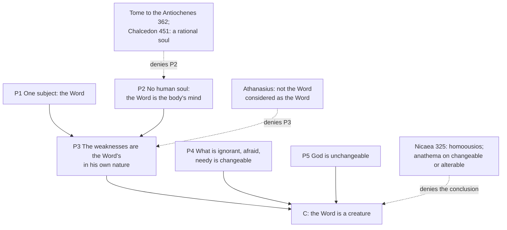

# Christology · Lesson 1.4: Arius and the divinity of the Son

> ⏱ ~15 min · Module 1: The Word made flesh · Builds on: [1.2 True God and true man](01-02-true-god-and-true-man.md), [`trinity-and-god` 3.1 Nicaea](../../trinity-and-god/lessons/03-01-nicaea.md) · Unlocks: [2.1 Apollinaris: a complete humanity](02-01-apollinaris-a-complete-humanity.md)

## Why this matters

Arius is usually filed under the Trinity: a presbyter who said the Son was a creature, answered by *homoousios* at Nicaea. That filing is correct and incomplete. Half of the Arian case was built out of the Gospels' picture of Jesus — the one who hungers, weeps, asks questions, grows, is afraid, and does not know the day. Read that way, Arianism is a **Christology** first, and its conclusion about the Son's rank follows from a claim about who it is that hungers. This lesson reconstructs that argument at full strength, shows that Nicaea's answer needed two moves and made only one, and hands the missing move to Module 2.

## The idea

Start with a premise Arius and Athanasius shared: there is **one subject** in the Gospels. The one who claims to exist before Abraham is the one who asks where Lazarus has been laid. Nobody in the fourth-century quarrel wanted two Christs.

Now add one more premise, which was widespread and seemed harmless: the Word took **flesh** — a body — and was himself the life and mind of that body. On that picture, often called [Logos–sarx Christology](../reference.md#logos-sarx-christology) ("Word and flesh"), there is no human mind in Christ to be ignorant or afraid. So when the Gospels say he did not know, or was troubled, those predicates land on the only mind there: the Word's own.

Then the conclusion is forced. Whatever can be ignorant, afraid and growing is changeable and needy. God is neither. So the Word is not God in the Father's sense — a magnificent creature, the first and best of things made, but on our side of the line. [Trinity-and-god 2.2](../../trinity-and-god/lessons/02-02-the-father-and-the-son-in-the-new-testament.md) reads the Arian proof texts one by one (Proverbs 8:22, John 14:28, Mark 13:32); what matters here is the **engine** that turns every human weakness in the Gospels into a proof text.

It was not only polemic. Athanasius reports the *Thalia* as saying the Word is alterable by nature and stays good by his own choice (*Orations against the Arians* I.5), and modern readers take that seriously: Gregg and Groh (*Early Arianism: A View of Salvation*, 1981) read the Arian Christ as a creature who **earns** his sonship by steadfast obedience, and so saves as a model we can actually follow. R. P. C. Hanson (*The Search for the Christian Doctrine of God*, 1988) read the movement as wanting a God who could genuinely suffer. On either reading the Arian Christ is *more* like us, not less, and that was its appeal.

## Source

Athanasius, *Orations against the Arians* III.26, reporting the Arian argument (Newman–Robertson, NPNF second series, vol. 4). They have just listed Christ's prayers, his troubled soul, his asking questions, his growth in wisdom, and Mark 13:32:

> Upon this again say the miserable men, "If the Son were, according to your interpretation, eternally existent with God, He had not been ignorant of the Day, but had known as Word; nor had been forsaken as being coexistent; nor had asked to receive glory, as having it in the Father; nor would have prayed at all; for, being the Word, He had needed nothing; but since He is a creature and one of things originate, therefore He thus spoke, and needed what He had not; for it is proper to creatures to require and to need what they have not."

Read the conditional carefully. It is a *modus tollens*: if eternal, then not ignorant; but ignorant; therefore not eternal. And look at the phrase "had known **as Word**." The Arians assume that if the Son is ignorant at all, he is ignorant as Word — because there is nothing else in him to be ignorant with.

## The argument

The [Arian argument from weakness](../reference.md#the-arian-argument-from-weakness), reconstructed:

1. **One subject.** Everything the Gospels say of Christ is said of one subject, the Word. *In words:* the one who wept is the one through whom all things were made.
2. **No second mind.** The Word united himself to a body and was its soul; there is no human soul in Christ. *In words:* the Word is the only "I" inside the story.
3. **So the weaknesses are the Word's in his own nature.** Ignorance, fear, growth in wisdom, the need to pray belong to him by the very nature by which he is Word. *In words:* there is nowhere else for them to land.
4. **Whatever is ignorant, afraid, growing or needy is changeable and in want.** *In words:* III.26's own last clause — "it is proper to creatures to require and to need."
5. **God is unchangeable and wants nothing.** *In words:* the premise everyone in the argument held (see [`trinity-and-god` 1.4](../../trinity-and-god/lessons/01-04-immutability-eternity-immensity.md)).
∴ **The Word is changeable, and so a creature — not God as the Father is God.**

The argument is **valid**. Nicenes accept 1, 4 and 5. So an orthodox reply must deny 2 or 3.

**Premise 2 is attested, with a hedge.** Theodoret, writing in the 440s, calls "a body only" the "view of Arius and Eunomius" (*Eranistes*, Dialogue II, NPNF second series, vol. 3). Whether Arius himself said it in so many words is debated among historians. The argument needs it either way, and the Arian party was reported as holding it.

**Nicaea's move.** The creed of 325 says the Son is *homoousios* with the Father ([homoousios](../reference.md#homoousios)), and its anathemas condemn anyone who says the Son is *trepton ē alloiōton* — in this lesson's translation, "changeable or alterable" — or that [there was when he was not](../reference.md#there-was-when-he-was-not). Schaff renders the first anathema "there was a time when he was not"; the Greek has no word for time (see [`trinity-and-god` 3.1](../../trinity-and-god/lessons/03-01-nicaea.md)). *In words:* the council strikes the argument's **conclusion**. That is decisive as a verdict and silent as a diagnosis — it does not say which premise was false.

**Athanasius's move.** He denies premise 3 with a qualifier. Of Gethsemane:

> If then He wept and was troubled, it was not the Word, considered as the Word, who wept and was troubled, but it was proper to the flesh (*Orations* III.56)

*In words:* same subject, but the weakness is his **as man**, not as Word. That is [reduplication](../reference.md#reduplication) — "considered as" picks out the nature in virtue of which a predicate is true — and it is the seed of the [communication of idioms](03-02-the-communication-of-idioms.md). His positive argument is soteriological: a creature cannot join creatures to God, and man had not been deified unless the Son were true God (*Orations* II.69–70). [Only God can deify](../reference.md#only-god-can-deify); `patristics` [3.1](../../patristics/lessons/03-01-athanasius.md) reads it as a text.

**Mark the levels.** That the Son is consubstantial with the Father and is not changeable or alterable is **defined dogma** (rung 1), fixed by the solemn definition and anathemas of Nicaea, received by the whole Church and reaffirmed at Chalcedon. That Christ has a rational human soul is also defined dogma — but by **Chalcedon's** Definition, which confesses him perfect in manhood, of a rational soul and body — not by Nicaea, which says nothing on the point. The attribution of premise 2 to Arius personally is a **historical** claim and sits on no rung at all. The modern readings of Arius (Gregg and Groh, Hanson) are scholarship, not doctrine.

## The two exits

## Worked examples

**Example 1 — the clean case: Lazarus.** John 11 has Jesus ask where Lazarus is laid, weep, and then raise him. Run the Arian engine: asking and weeping belong to the Word as such, so the Word is ignorant and grieving, so changeable. Run Athanasius's reply: one subject throughout — the Tome to the Antiochenes (362) says it was not one who raised Lazarus and another who asked about him, but the same one, asking as man and raising as God (*Tome* 7). The divine act and the human act have one agent; the reduplication assigns each to its nature. Nothing about the Word's own nature is predicated here, so premise 3 fails and the argument stops.

**Example 2 — where it strains: "Now is my soul troubled."** Athanasius's reply to Gethsemane says the fear was "proper to the flesh." But the text he is answering (John 12:27 in the Douay) says:

> Now is my soul troubled.

Flesh does not fear. Fear, like ignorance, needs a mind — a subject of experience that apprehends a threat. So "as man" only works if the manhood includes a human soul in which fear and ignorance can sit. With premise 2 still standing, "proper to the flesh" is a promissory note: the Arian will ask *which* faculty in the flesh was ignorant of the day.

This is where historians divide. Aloys Grillmeier (*Christ in Christian Tradition*, vol. 1) argued that Athanasius's Christology is itself of the Word–flesh type, with Christ's human soul playing no theological role in his replies. Others read the *Tome* of 362 — which records the parties at Antioch confessing that the Saviour's body was not without soul, sense or intelligence — as Athanasius closing the gap; exactly what that phrase meant in 362 is itself debated. Either way the lesson is structural. **The Nicene answer needs two moves**: *homoousios*, so the weaknesses cannot be the Word's *as God*; and a complete human nature, including a mind, so that they can be the Word's *as man*. Nicaea made the first. The second is [2.1](02-01-apollinaris-a-complete-humanity.md) — and its engine, "what is not assumed is not healed," is Athanasius's own soteriology pointed at the soul ([`patristics` 3.3](../../patristics/lessons/03-03-the-two-gregories.md)).

## Watch out

- **You might think Arius was a rationalist who shrank Christ to a mere man.** He did the opposite: his Son is pre-cosmic, the maker of all else, and the subject of the Passion. Call it **adoptionism** and you have named a different heresy. The error is **subordinationism** of a sharp kind — a divine being who is not *the* God, and who can suffer because he is less.
- **You might think "the Word, as God, was troubled and grew" is a pious way of honouring the Passion.** It is premise 3, and it hands the Arian his conclusion: a Word who changes is **Arianism**'s changeable Word, anathematized at Nicaea. The same move returns as modern kenoticism, which is [3.3](03-03-kenosis.md)'s.
- **You might think *homoousios* settled Christology.** It settled who the subject *is*. It says nothing about whether he has a human mind — which is why Apollinaris, a staunch Nicene, could deny one ([2.1](02-01-apollinaris-a-complete-humanity.md)).
- **You might cite Nicaea for Christ's rational soul.** Overstatement of the act: that is Chalcedon's.

## One-liner

> Arius's creature-Son was built from Christ's weaknesses plus a missing soul; Nicaea struck the conclusion, and the rest of Christology is finding the premise.

## Problems

**P1 (🟢)** *(Exegetical.)* Mark each sentence **true**, **false**, or **true only with a distinction**, and name in one sentence the rule or text that decides it.
(i) The Word wept at the tomb of Lazarus.
(ii) The Word, considered as the Word, was troubled in Gethsemane.
(iii) The Son is by nature alterable, and stays good by choosing to.
(iv) The Son received glory from the Father.

**P2 (🟡)** *(Exegetical.)* Close reading. Athanasius, *Tome to the Antiochenes* 7 (NPNF second series, vol. 4), reporting what the two Antiochene parties confessed in 362:

> For they confessed also that the Saviour had not a body without a soul, nor without sense or intelligence; for it was not possible, when the Lord had become man for us, that His body should be without intelligence: nor was the salvation effected in the Word Himself a salvation of body only, but of soul also. ... Wherefore neither was there one Son of God before Abraham, another after Abraham: nor was there one that raised up Lazarus, another that asked concerning him; but the same it was that said as man, Where does Lazarus lie; and as God raised him up.

(a) Which premise of the lesson's reconstruction does the first sentence deny, and which does the last sentence deny? (b) The clause "nor was the salvation ... of body only, but of soul also" argues from what, to what? (c) The last sentence also excludes an error that is *not* Arian. Name it. Two sentences per part.

**P3 (🔴)** *(Exegetical (a) · Exegetical (b).)* An **invented** Good Friday homily, not the words of any real person:

> "Don't imagine Jesus was play-acting in the garden. The eternal Word himself, in his very godhead, trembled and did not know what the next hour would bring. That is how far God came down: he laid aside his changelessness to become one of us."

(a) Name the premise of the Arian argument the homily asserts, and say in two sentences why an Arian would welcome it. (b) Level assignment, strict — give the rung and name the act that fixes it: (i) the Son is not changeable or alterable; (ii) Christ has a rational human soul; (iii) Arius himself denied Christ a human soul. One sentence each.

Solutions

**P1** *(Exegetical.)*

**Must hit, strict:**
(i) **True.** The Word is the one subject of everything Christ does and suffers; weeping is his as man. Decided by the one-subject premise that both sides held, and by *Tome* 7's "the same" who asked and raised.
(ii) **False.** The reduplication "considered as the Word" picks out the divine nature, and the weakness is not true in virtue of that nature; Athanasius denies this sentence almost verbatim (*Orations* III.56).
(iii) **False.** This is the *Thalia* as Athanasius reports it (*Orations* I.5), and it is struck by Nicaea's anathema on calling the Son changeable or alterable.
(iv) **True only with a distinction.** As man, he received glory in time as gift (John 17:5 was one of the texts the Arians cited in III.26). As God, he has everything from the Father by eternal generation — not as a reward, and not as something he once lacked. The Arian reading makes the glory a reward for foreseen virtue, which is the reading excluded.

**Wrong turns:** marking (i) false because "the Word cannot weep" — that denies the one subject and lands in dividing Christ (Module 2's Nestorian problem); marking (iv) plain false, which denies John 17:5; marking (iv) plain true without the distinction, which lets the Arian reward reading through.

**Model answer:** (i) True: one subject, weeping as man. (ii) False: "as the Word" names the divine nature, in which he is not troubled (III.56). (iii) False: anathematized at Nicaea as "changeable or alterable." (iv) True only with a distinction: received as man in time; possessed as God by generation, not earned.

**P2** *(Exegetical.)*

**Must hit, strict (a):** the first sentence denies **premise 2** — there *is* a human soul, with sense and intelligence, in Christ. The last sentence denies **premise 3** — the asking is said "as man," so the ignorance is not the Word's in his own nature — while keeping **premise 1**: "the same it was."
**Must hit, strict (b):** it argues **from salvation to the completeness of what was assumed**: salvation reaches the soul, so the Word must have taken a soul. This is the soteriological argument Gregory of Nazianzus will state as "what is not assumed is not healed" against Apollinaris ([2.1](02-01-apollinaris-a-complete-humanity.md)).
**Must hit, strict (c):** **dividing Christ into two subjects** — one Son who raises, another who asks. That is the error later charged against Nestorius (2.2). Credit "two Sons."

**Wrong turns:** reading (a)'s first sentence as denying premise 3 — it says nothing yet about how predicates are assigned, only what the manhood contains; reading (b) as an argument from scripture; naming modalism or Apollinarianism for (c) — the sentence insists on *one* against *two*.

**Model answer:** (a) The first sentence denies premise 2: Christ's body was not without soul or intelligence. The last denies premise 3 while keeping premise 1: one and the same asks as man and raises as God. (b) From what salvation reaches to what the Word must have assumed: the soul is saved, so the soul was taken. It is the soteriological rule in embryo. (c) Two Sons, one who acts divinely and another who suffers humanly. That is the division later laid at Nestorius's door.

**P3** *(Exegetical (a) · Exegetical (b).)*

**Must hit, strict (a):** the homily asserts **premise 3** — the ignorance and fear belong to the Word "in his very godhead," in his own nature. An Arian welcomes it because, with premises 4 and 5, it yields his conclusion: what trembles and does not know is changeable, so the Word is not God as the Father is. "He laid aside his changelessness" concedes the very predicate Nicaea anathematized. Credit for noting the true thing reached for: the Passion was real, and the one who suffered was God — true of the person, as man.
**Must hit, strict (b):** (i) **Defined dogma, rung 1**, by the solemn definition and anathemas of Nicaea (325), received by the Church and reaffirmed at Chalcedon. (ii) **Defined dogma, rung 1**, by Chalcedon's Definition (451), which confesses a rational soul and body; *not* Nicaea's act. (iii) **No rung**: a historical claim about a person, attested by opponents such as Theodoret and debated by historians; no magisterial act touches it.

**Wrong turns:** calling the homily Apollinarian — it denies nothing about Christ's humanity; its fault is the nature it assigns the weakness to. Citing Nicaea for (ii). Putting (iii) at rung 4 as "common teaching" — it is not a doctrinal proposition at all.

**Model answer:** (a) It asserts premise 3: the trembling and not knowing are the Word's in his divine nature. An Arian needs nothing more, because what trembles and is ignorant is changeable, and a changeable Word is a creature — the homily has conceded the conclusion Nicaea condemned. (b) (i) Rung 1, by Nicaea's definition and anathemas. (ii) Rung 1, by Chalcedon's Definition, not Nicaea. (iii) No rung: a disputed historical claim, not a doctrine.

## Flashback

**From Lesson [1.2](01-02-true-god-and-true-man.md) (True God and true man):** *(Exegetical.)* Level assignment. An **invented** revision crib sheet, written for this problem, gives each piece of the dogmatic core a level and a source. Each line contains exactly one error. Correct it: give the rung and name the act that fixes it. **One sentence each.**

> (i) "Mary is Mother of God (*Theotokos*): first defined at Chalcedon in 451."
> (ii) "Two natural wills in Christ: only implied by Chalcedon's 'perfect in manhood', so common teaching."
> (iii) "A true body: never defined, because the apostles already taught it (1 John 4:2–3)."
> (iv) "'Sin only excepted': a pious gloss added by later commentators, not part of what the Definition confesses."

Solution

**Must hit, strict:**
- (i) **Rung 1, but the act is Ephesus (431).** Ephesus judged Cyril's Second Letter to Nestorius, which calls the holy Virgin Mother of God, consonant with Nicaea, and deposed Nestorius. Chalcedon **repeats** the title.
- (ii) **Rung 1, defined dogma**, fixed by **Constantinople III (681)**: two natural wills and two natural operations. Being implied by an earlier text does not keep a truth at a lower rung once a council defines it.
- (iii) **Rung 1.** Apostolic faith is defined all the same when a council confesses it: the creed's "was made man" and Chalcedon's "consubstantial with us as touching his manhood."
- (iv) **Rung 1.** The words are in Chalcedon's Definition itself: "made in all things like unto us, sin only excepted."

**Wrong turns:** moving (i) to Nicaea, or saying Ephesus issued a separate *Theotokos* decree (its act was a judgment that Cyril's letter agrees with Nicaea). Assigning (ii) to Chalcedon. Treating (iii) as defined "only" because of 1 John. Reading (iv) as making Christ less than fully human: sin is a wound in human nature, not a part of it.

**Model answer:** (i) Rung 1, by Ephesus, which approved Cyril's letter calling Mary Mother of God; Chalcedon repeats it. (ii) Rung 1, by Constantinople III's definition of two natural wills. (iii) Rung 1, by the creed's "made man" and Chalcedon's "consubstantial with us." (iv) Rung 1: the phrase is in Chalcedon's Definition.

## Connections

- **Backward:** [1.2](01-02-true-god-and-true-man.md) named Arianism as the error that subtracts from the divine nature; this lesson shows it did so by way of a claim about the human one. The creed's text and the Trinitarian stakes are [`trinity-and-god` 3.1](../../trinity-and-god/lessons/03-01-nicaea.md); the proof texts are [2.2](../../trinity-and-god/lessons/02-02-the-father-and-the-son-in-the-new-testament.md); the council as an event is [`church-history` 2.1](../../church-history/lessons/02-01-nicaea-and-the-imperial-church.md); Athanasius as an author is [`patristics` 3.1](../../patristics/lessons/03-01-athanasius.md).
- **Forward:** [2.1](02-01-apollinaris-a-complete-humanity.md) takes premise 2 head on. [3.2](03-02-the-communication-of-idioms.md) turns "considered as the Word" into rules. [4.2](04-02-christs-human-knowledge-the-classical-account.md) answers Mark 13:32 with a human mind in view.
- **Sideways:** the same shape — denying a conclusion before diagnosing the premise — is the pattern of conciliar definitions generally ([`fundamental-theology` 4.4](../../fundamental-theology/lessons/04-04-the-ladder-of-doctrinal-authority.md) on what a definition fixes). Levels in this course: [the levels in Christology](../reference.md#the-levels-in-christology).
