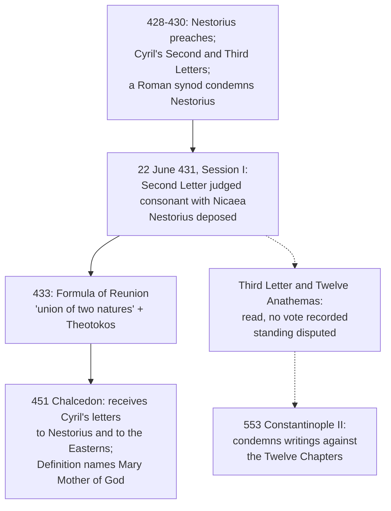

# Christology · Lesson 2.2: Nestorius, Cyril, and Ephesus (431)

> ⏱ ~15 min · Module 2: From Apollinaris to the two wills · Builds on: [2.1 Apollinaris: a complete humanity](02-01-apollinaris-a-complete-humanity.md), [`trinity-and-god` 3.2](../../trinity-and-god/lessons/03-02-one-ousia-three-hypostaseis.md), [`patristics` 5.1](../../patristics/lessons/05-01-cyril-of-alexandria.md) · Unlocks: [2.3 Eutyches, Leo, and Chalcedon](02-03-eutyches-leo-and-chalcedon.md)

## Why this matters

[2.1](02-01-apollinaris-a-complete-humanity.md) won a complete humanity: a rational soul, a true body, nothing subtracted. That raised the next question at once. If the humanity is complete, is it *someone*? If it is, there are two sons and a partnership. If it is not, you owe an account of how a whole human life belongs to the Word. Ephesus is where the Church answered the **who** question. It did so without writing a definition, and that is why you need to know exactly what it did.

## The idea

**Nestorius first, at the strength his best readers would recognize.** He was bishop of Constantinople from 428, formed in Antioch, and he feared two things, both legitimately. The first was a God who is born, nursed and killed. The divine nature cannot suffer ([`trinity-and-god` 1.5](../../trinity-and-god/lessons/01-05-impassibility-and-the-god-who-suffers.md)), and a deity with a birthday belongs to the pagans. The second was a humanity that is only a costume. Arians had made the Word the subject of the human weakness in order to make him less than God, and Apollinaris had let the Word stand in for a human mind. So Nestorius preferred [*Christotokos*](../reference.md#christotokos), Christ-bearer: Mary bore Christ, who is God and man. He would allow *Theotokos* only with a gloss. The two natures, each whole, come together in one ***prosōpon***. The word means a face or presentation (lesson's gloss). The natures are joined by a *synapheia*, a conjunction of honour, will and worship. On this account there is one Christ, one Son, one object of worship. Nestorius never said "two persons"; he denied saying it.

**Cyril's reply is about grammar, not about Mary.** Take the creed's sentence: the only-begotten, *very God of very God*, came down, was incarnate, suffered. It has one subject all the way through. If the subject of "was born of Mary" is a man whom the Word then joined, the sentence has changed subjects halfway. Then "Son" is said once by nature and once by honour, and that is two sons however warmly they are joined. Cyril's alternative is a union *kath' hypostasin*, "according to the hypostasis" (lesson's gloss: the Word himself is the concrete subject who has become man). Then the one born of Mary simply is the Word, in the flesh, and [*Theotokos*](../reference.md#theotokos) follows. It is not a claim that Godhead began in her; Cyril denies that in so many words. It is a claim about **who** her son is.

The texts themselves are read in [`patristics` 5.1](../../patristics/lessons/05-01-cyril-of-alexandria.md). This lesson takes as its subject what the council did with them.

## Source

The Acts of Ephesus, Session I (22 June 431), in Percival, *NPNF* second series, vol. 14. The creed of Nicaea has been recited and Cyril's Second Letter to Nestorius read aloud:

> And after the letter was read, Cyril, the bishop of Alexandria, said: This holy and great Synod has heard what I wrote to the most religious Nestorius, defending the right faith. I think that I have in no respect departed from the true statement of the faith, that is from the creed set forth by the holy and great synod formerly assembled at Nice. Wherefore I desire your holiness [i.e. the Council] to say whether rightly and blamelessly and in accordance with that holy synod I have written these things or no.
>
> [...] And all the rest of the bishops in the order of their rank deposed to the same things, and so believed, according as the Fathers had set forth, and as the Epistle of the most holy Archbishop Cyril to Nestorius the bishop declared.

Read the shape of the act. The question put is not "shall we define something?" It is **"does this letter agree with Nicaea?"** The bishops answer one by one, and the same test is then run on Nestorius's reply, which fails. Ephesus's doctrinal act is a **judgment of consonance**. It says that Nicaea's single subject, read correctly, is Cyril's. Canon 7, passed later in the council, confirms the posture: no one may compose a *heteran pistin*, a different faith, as a rival to Nicaea's.

## The argument

What Ephesus did, and what it did not do:

1. **It judged Cyril's Second Letter consonant with Nicaea**, bishop by bishop, and Nestorius's answering letter not consonant. *In words:* the council's doctrine is Cyril's letter as a reading of the creed, not a new formula.
2. **It deposed Nestorius.** The sentence, as Percival prints it, cites the canons and Pope Celestine's letter, and removes Nestorius from the episcopate and from priestly communion. *In words:* the one conciliar decree against him is a sentence against a person for his teaching.
3. **It issued no separate definition of *Theotokos*.** It confirmed a title already in use by approving the letter that defends it. Percival cites Pearson's word for this: "confirmed". Percival also shows the title in Alexander of Alexandria's synodal letter of about 320, more than a century earlier. The first *definition text* to name Mary "Mother of God" is Chalcedon's, in 451 ([2.3](02-03-eutyches-leo-and-chalcedon.md)).
4. **The Twelve Anathemas have a disputed standing.** Cyril's Third Letter, with [the Twelve Anathemas](../reference.md#the-twelve-anathemas) attached, is recorded as read at Session I. The Acts record no vote on it. Percival notes that something seems to have dropped out of the record at the point of deposition. Petavius, Tillemont and the later Hefele held that the council approved it. The plain silence of the Acts is the other side. The received standing comes later. Chalcedon received Cyril's synodical letters "addressed to Nestorius and the Easterns". The two read aloud there were the Second Letter and the letter to John of Antioch, and whether that reception covers the Third is argued. [Constantinople II](02-04-the-three-chapters-and-constantinople-ii.md) then condemned Theodoret's writings against "St. Cyril and his XII. Anathemas".
5. **The crux is where the oneness lies.** Cyril's Second Letter puts it in one line:

   > Neither will it at all avail to a sound faith to hold, as some do, an union of persons; for the Scripture has not said that the Word united to himself the person of man, but that he was made flesh.

   Percival's "persons" renders *prosōpa*. *In words:* a union of *prosōpon* joins two things that are each already someone. John 1:14 says the Word *became* flesh, not that he *adopted a man*.
6. **Two years later, the [Formula of Reunion](../reference.md#formula-of-reunion) (433).** It was drafted on the Antiochene side and sent by John of Antioch. Cyril accepted it and set it verbatim in his letter to John, which opens "Let the heavens rejoice". The Formula says "perfect God, and perfect Man", "of the same substance with us according to his humanity", and then:

   > for there became a union of two natures. Wherefore we confess one Christ, one Son, one Lord.

   It affirms *Theotokos* in the next sentence. *In words:* Antioch got two complete natures, and Cyril got one subject and the title. This is the first sentence a Chalcedonian could sign as it stands.

**Mark the levels** (the ladder of [`fundamental-theology` 4.4](../../fundamental-theology/lessons/04-04-the-ladder-of-doctrinal-authority.md); [levels in christology](../reference.md#the-levels-in-christology)). That one and the same Word is the subject of the human birth, and so that Mary is *Theotokos*, is **defined dogma**. The act that fixes it is Ephesus's conciliar judgment as the Church received it, restated in Chalcedon's Definition. That the union is not one of *prosōpon* by honour or will is part of the same judgment. Each phrase of the Second Letter is *not* thereby defined; what was approved is its faith, measured against Nicaea. Each of the Twelve Anathemas taken one by one as an Ephesine definition is an **overstatement**, because the record does not show that act. Whether Nestorius himself held what was condemned is a **historical question**, argued freely. It does not reach the doctrine.

## What each act settled

## Worked examples

**Ex 1: the crux on a clean case, "Mary gave birth to God."** Parse it both ways. *Cyril:* the subject born is the Word; "gave birth" is a human predicate true of him because the flesh born is his own flesh. So the sentence is true, and it says nothing about Mary originating the Godhead. This is the [communication of idioms](../reference.md#communication-of-idioms), which gets its full rules in [3.2](03-02-the-communication-of-idioms.md). *Nestorius:* the one born is the man who is the Word's temple. "God" names the divine nature, which cannot be born, so the sentence is false unless it is loosened into "gave birth to the one in whom God dwells." Now find the premise Nestorius must deny. It is not the impassibility of the divine nature, since Cyril affirms that too ("the Divine nature is incapable of suffering", Second Letter). It is the **identity of subject**: the claim that the one begotten of the Father and the one born of Mary are the *same one*. What would move him is [2.1's rule](../reference.md#the-soteriological-rule) run from the other end. If the one who died is not the Word, then death was undergone by a man God honoured, and it was not undone from within by God.

**Ex 2: where it strains. Was Nestorius a Nestorian?** In 1895 American missionaries found a Syriac manuscript in the patriarchal library at Qudshanis, in the Hakkari mountains. It held Nestorius's late apology, the *Bazaar of Heracleides*. Bedjan published it in 1910, and Driver and Hodgson translated it into English in 1925. Nestorius, writing in exile near the end of his life, welcomes Leo's Tome as his own faith. Friedrich Loofs (*Nestoriana*, 1905, and later lectures) and J. F. Bethune-Baker (*Nestorius and His Teaching*, 1908) argued that he meant one Christ and was condemned for a caricature. The case against them, made from Grillmeier onward, grants his good intention but says his tools could not deliver it. Each nature has its own *prosōpon*, and the *prosōpon* of union is where two meet and are presented as one. A unity built that way sits on top of two subjects instead of being one subject. It is therefore still a partnership, only better expressed. Notice what the revisionist case can and cannot touch. It can revise a verdict on a man. It cannot revise the doctrine, because Ephesus judged a *position*: a union of *prosōpon* instead of *hypostasis*. That position is excluded whoever held it. The churches of the Syriac East who honour Nestorius, and the 1994 declaration signed with them, are [6.3](06-03-the-churches-that-did-not-receive-chalcedon.md)'s business.

## Watch out

- **"God took up a man at his conception" lands in Nestorianism**, however pious it sounds. Cyril's letter excludes it directly: the Word was not first born a common man into whom he then entered. Say instead that the Word *became* man and made a humanity his own. The [hypostatic union](../reference.md#hypostatic-union) is his becoming, not his hosting.
- **The over-correction is also an error.** "Mary is the mother of the divinity" or "the Godhead was born" moves the predicate from the person to the nature. Cyril denies it, and it drifts toward the confusion of natures that [2.3](02-03-eutyches-leo-and-chalcedon.md) meets in Eutyches.
- **"Ephesus defined the Twelve Anathemas"** states a disputed historical claim as a certain act. "Ephesus defined *Theotokos* in a decree" is looser than the record. Say it approved Cyril's Second Letter and deposed Nestorius.
- ***Theotokos* is a statement about Christ.** What it implies for Mary's dignity, and the Marian dogmas, belong to `ecclesiology-and-mariology` ([syllabus](../../ecclesiology-and-mariology/syllabus.md)).

## One-liner

> Ephesus defined nothing new: it ruled that Nicaea's one Son is the one Mary bore, and Theotokos is that ruling stated as a title.

## Problems

**P1 (🟢)** *(Exegetical)* Mark each sentence **true**, **false**, or **true only with a stated distinction**, and name the rule that decides it (identity of subject; predicates of a nature are said of the person, not traded between natures). One line each.
(a) "Mary is the mother of Christ's human nature, not of the Word."
(b) "The one who was nursed at Bethlehem existed before Abraham."
(c) "God was two months old."
(d) "*Christotokos* is a true title of Mary."

**P2 (🟡)** *(Exegetical)* An **invented** handout from a parish adult-formation evening, written for this problem:

> "In 431 the Council of Ephesus solemnly defined Mary as Mother of God and approved Cyril's twelve anathemas as dogma. It did this to honour Mary above all creatures. We now know from the *Bazaar of Heracleides* that Nestorius actually agreed with Cyril, which means Ephesus condemned an error nobody held and its decision no longer binds."

Find **four** errors. For each, give the correction and, where a level is involved, name the act that fixes the level. 150 words or fewer.

**P3 (🔴)** *(Exegetical)* Nestorius and Cyril both confess "one Christ, one Son." (a) Name the single premise Nestorius must deny, and say why the impassibility of the divine nature is *not* the crux. (b) Say which clause of the Formula of Reunion Cyril could accept only because the crux had been settled his way, and why. Three sentences per part.

Solutions

**P1** *(Exegetical)*

**Must hit, strict:** (a) **False.** Mothers bear someone, not a nature; the one Mary bore is the Word in his flesh, so she is mother of the Word *according to the flesh*. Splitting "the nature" from "the Word" as the child is the Nestorian two-subject move. Credit for adding that she is not mother of the Godhead, which is the true thing the sentence reaches for. (b) **True.** The subject is concrete and one; the eternal predicate and the infant predicate are both said of the same person. (c) **True only with a distinction:** according to the flesh. The subject is right, and the predicate belongs to his humanity. Without the qualifier a hearer attaches it to the divine nature. (d) **True only with a distinction.** Mary did bear Christ. As a *replacement* for *Theotokos*, though, meant to avoid saying the one born is God, it is the position Ephesus judged. The Formula of Reunion keeps "one Christ" *and* "Mother of God".

**Wrong turns:** marking (c) false because God cannot age, which is Nestorius's premise; marking (d) simply false, which forgets that it is literally true; marking (a) true because "the divinity did not come from her", which confuses the nature's origin with the child's identity.

**Model answer:** as above, one line each.

**P2** *(Exegetical)*

**Must hit, strict (any four):** (1) Ephesus issued **no separate definition** of *Theotokos*. It judged Cyril's Second Letter consonant with Nicaea and deposed Nestorius. The title is **defined dogma**, and the acts fixing it are that received judgment and Chalcedon's Definition. (2) The Twelve Anathemas were **read, with no approval recorded**. Whether Ephesus adopted them is disputed. Calling each one "dogma" by an Ephesine act **overstates** what the record shows. (3) The **motive** is wrong: the title asserts who Christ is, and Mary's honour is a consequence. (4) The ***Bazaar*** bears on a **historical verdict about a man**. It cannot unmake the doctrine, which excludes a union of *prosōpon* whoever held it. (5) The revisionist reading is **contested**, not "now known". Grillmeier's line grants Nestorius's intention and denies that his concepts delivered one subject.

**Wrong turns:** treating (4) as an evaluative question and "taking a side"; the doctrine is not at issue, so the correction is exegetical. Replying that the Anathemas are "only opinion", which **understates**: Constantinople II condemned writings against them.

**Model answer:** Ephesus did not define *Theotokos* in a decree. It approved Cyril's Second Letter as consonant with Nicaea and deposed Nestorius, and that judgment, restated in Chalcedon's Definition, makes the title defined dogma. The Twelve Anathemas were read with no vote recorded, so calling them Ephesine dogma overstates the record. The title honours Mary only because it says her son is God; it is about Christ. The *Bazaar* reopens whether Nestorius meant a single subject, and scholars still dispute that. Even if he did, the doctrine Ephesus excluded, a union by *prosōpon* and not by hypostasis, stays excluded.

**P3** *(Exegetical)*

**Must hit, strict (a):** the premise is the **identity of subject**: the one begotten of the Father is the same one born of Mary. Impassibility is not the crux because both affirm it. Cyril's Second Letter says the divine nature cannot suffer, and he places suffering in the Word's own flesh.
**Must hit, strict (b):** "a union of two natures". Cyril could sign a plural count of natures because the same text says "one Christ, one Son, one Lord" and confesses *Theotokos*, which fixes the subject as one. With the who settled, counting the what as two no longer divides him.

**Wrong turns:** naming "whether Mary may be honoured" as the crux; naming "the divine nature suffers" as Cyril's premise; discussing "one incarnate nature", which is not asked here.

**Model answer:** (a) Nestorius must deny that the one eternally begotten and the one born of Mary are numerically the same subject. That is the premise *Theotokos* compresses. Impassibility cannot be the crux, since Cyril holds it as firmly and predicates the suffering of the Word only through his own flesh. (b) "There became a union of two natures." Alone, it could describe a Nestorian partnership. Framed by "one Christ, one Son, one Lord" and the title Mother of God, it can only count the natures of a subject already fixed as one.

## Flashback

**From Lesson [1.4](01-04-arius-and-the-divinity-of-the-son.md) (Arius and the divinity of the Son):** *(Exegetical.)* Find the crux. Hebrews 5:8 (Douay–Rheims): "And whereas indeed he was the Son of God, he learned obedience by the things which he suffered." Two fourth-century readers, both **invented** for this problem:

> A: "Whatever learns once lacked what it learned. The Son learned. So the Son is changeable, and a creature."
>
> B: "The same Son learned, but not as Word; the learning was his as man."

Here is 1.4's reconstruction of the Arian argument from weakness: P1 everything is said of one subject, the Word; P2 there is no human soul in Christ; P3 the weaknesses are the Word's in his own nature; P4 whatever lacks or grows is changeable; P5 God is unchangeable.

(a) Name the premise on which A and B split, and the premise they share. (b) Why can B not finish the reply by saying the learning was "proper to the flesh," and which act defines what B needs? **Two sentences per part.**

Solution

**Must hit, strict (a):** they split on **P3**. A takes the learning to be the Word's in his own nature. B denies this with a [reduplication](../reference.md#reduplication), "not as Word ... as man." They share **P1**: B's "the same Son" keeps one subject, so neither reader divides Christ. Credit noting that A's P3 leans on P2.

**Must hit, strict (b):** learning obedience is an act of **mind and will**, and flesh does not learn. So "as man" needs a manhood with a **rational soul** in which the learning can sit. That means denying P2, which is the second of the two moves Nicaea did not make. It is defined by **Chalcedon's Definition** ("of a reasonable soul and [human] body"), rung 1. Nicaea struck only A's conclusion, with *homoousios* and the anathema on calling the Son changeable or alterable.

**Wrong turns:** saying they split on P1. B's reply keeps one subject, and giving the learning to a second subject is the two-Sons error this lesson takes up. Citing Nicaea for the rational soul. Having B deny that the Son really learned, which denies the text. Locating the crux in P4 or P5, which Nicenes accept.

**Model answer:** (a) They split on P3: A makes the learning the Word's in his divine nature, and B says it was his as man. Both keep P1, one and the same Son. (b) Flesh cannot learn obedience; only a mind and will can. So B must also deny P2 and affirm a rational human soul, which is defined by Chalcedon's Definition, not by Nicaea, which only condemned the conclusion.

## Connections

- **Backward:** [2.1](02-01-apollinaris-a-complete-humanity.md) secured a complete humanity. This lesson asks whose it is, and answers with the same [soteriological rule](../reference.md#the-soteriological-rule) run on the subject. The vocabulary of *hypostasis* and *prosōpon* comes from [`trinity-and-god` 3.2](../../trinity-and-god/lessons/03-02-one-ousia-three-hypostaseis.md). Cyril's letters as texts are [`patristics` 5.1](../../patristics/lessons/05-01-cyril-of-alexandria.md). The two rival assemblies and the politics are [`church-history` 2.2](../../church-history/lessons/02-02-ephesus-chalcedon-and-leos-rome.md).
- **Forward:** [2.3](02-03-eutyches-leo-and-chalcedon.md) meets the opposite error and writes the definition Ephesus did not. [2.4](02-04-the-three-chapters-and-constantinople-ii.md) defends the Twelve Chapters against Theodoret. [3.1](03-01-person-and-nature-the-hypostatic-union.md) states the hypostatic union exactly. [3.2](03-02-the-communication-of-idioms.md) turns Ex 1's parsing into rules. [6.3](06-03-the-churches-that-did-not-receive-chalcedon.md) takes up the Church of the East and the 1994 declaration.
- **Sideways:** `ecclesiology-and-mariology` ([syllabus](../../ecclesiology-and-mariology/syllabus.md)) takes *Theotokos* as a Marian title. The canon-7 ban on a "different faith" returns in the filioque dispute ([`trinity-and-god` 5.2](../../trinity-and-god/lessons/05-02-the-greek-doctrine-and-the-addition.md)).
