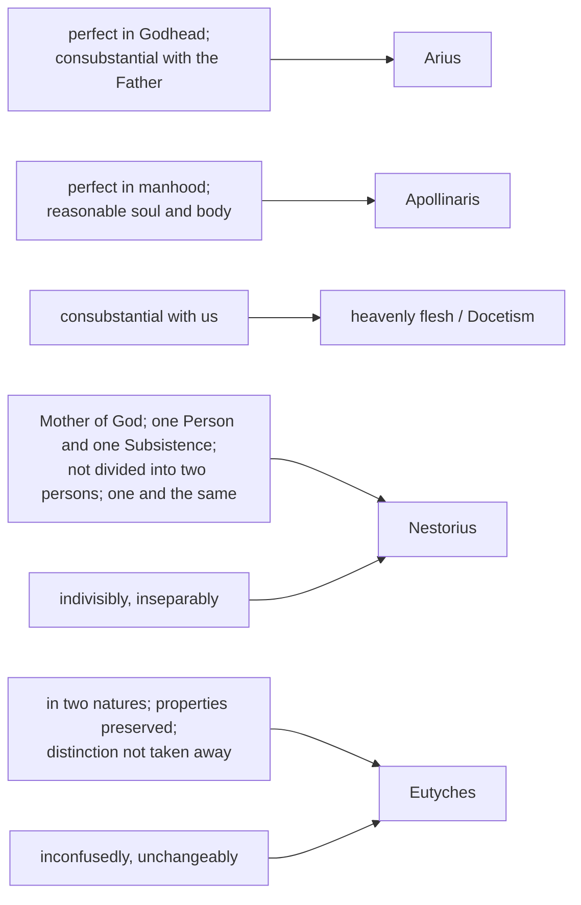

# Christology · Lesson 2.3: Eutyches, Leo, and Chalcedon (451)

> ⏱ ~15 min · Module 2: From Apollinaris to the two wills · Builds on: [2.1 Apollinaris](02-01-apollinaris-a-complete-humanity.md), [2.2 Nestorius, Cyril, and Ephesus](02-02-nestorius-cyril-and-ephesus.md) · Unlocks: [2.4 After Chalcedon](02-04-the-three-chapters-and-constantinople-ii.md)

## Why this matters

Ephesus settled the *who*: one subject, the Word, so Mary is *Theotokos* ([2.2](02-02-nestorius-cyril-and-ephesus.md)). Twenty years later a monk pressed that victory one step too far and lost the *what*. The council that answered him produced the most-quoted sentence in Christology, the one every later lesson in this course measures against. It also produced the Church's most lasting division. Egypt and much of Syria never received it, and the churches it lost have never been shown to hold a different faith in substance. You need the text itself, phrase by phrase: what each clause says, what it was written against, and what it chose not to say.

## The idea

Put Eutyches's position in one line and it sounds almost pious: *before the union, two natures; after the union, one.* The divine and the human met in Mary's womb, and the meeting produced a single nature, as a drop of something dissolves into the sea.

Now count. The Definition's answer is the reverse of Eutyches's count on both sides of the union. **Before** the Incarnation there is only one nature, because the Word's humanity did not exist yet. **After** it there are two, because neither nature is lost in the union. What stays fixed is the *who*: one and the same Son throughout. The *what* goes from one to two.

That is the whole doctrine in one picture. The Definition's many phrases are there to guard it: some keep the natures from merging, some keep the subject from splitting, and the repetitions nail the subject down.

## Source

The Definition of Chalcedon (22 October 451), core paragraph, in Schaff's *Creeds of Christendom* vol. 2 (public domain; Schaff's bracketed glosses and note numbers omitted):

> We, then, following the holy Fathers, all with one consent, teach men to confess one and the same Son, our Lord Jesus Christ, the same perfect in Godhead and also perfect in manhood; truly God and truly man, of a reasonable soul and body; consubstantial with the Father according to the Godhead, and consubstantial with us according to the Manhood; in all things like unto us, without sin; ... born of the Virgin Mary, the Mother of God, according to the Manhood; one and the same Christ, Son, Lord, Only-begotten, to be acknowledged in two natures, inconfusedly, unchangeably, indivisibly, inseparably; the distinction of natures being by no means taken away by the union, but rather the property of each nature being preserved, and concurring in one Person and one Subsistence, not parted or divided into two persons, but one and the same Son ...

Count the subject. In the Greek text Schaff prints, *ton auton*, "the same", occurs **eight** times in this one sentence, and the Latin *eundem* matches it eight times. Three of those are the full "one and the same". English translations flatten the repetition. The original keeps putting the same grammatical subject back in front of each pair of predicates, so that the Godhead and the manhood are always said of **one** subject. "Subsistence" renders *hypostasis*, the word Ephesus's generation fought over ([`trinity-and-god` 3.2](../../trinity-and-god/lessons/03-02-one-ousia-three-hypostaseis.md)); "Person" renders *prosōpon*. The Definition puts them side by side: "one *prosōpon* and one *hypostasis*". Nestorius's union of *prosōpon* alone is no longer enough.

## The argument

1. **Eutyches's claim.** An archimandrite (abbot) at Constantinople, examined by Flavian's synod in 448, he confessed, in the words Leo quotes back to Flavian: "I confess that our Lord was of two natures before the union, but after the union I confess one nature" (Tome, ch. 6, Bright's translation in Percival). *In words:* the humanity came into the union and did not come out of it.
2. **Leo's answer: both halves are wrong.** The Tome calls it as impious to say the Son was of two natures before the Incarnation as to say he has one nature after it. The reading of the Tome belongs to [`patristics` 5.2](../../patristics/lessons/05-02-leo-the-great.md). Its working sentence is that each form "does the acts which belong to it, in communion with the other" (Tome, ch. 4, Bright). *In words:* two natures, each fully itself, acting as one agent.
3. **The reversal of 449 and the reception of the Tome.** A second council at Ephesus under Dioscorus restored Eutyches and deposed Flavian; Leo called it a gathering of robbers ([`church-history` 2.2](../../church-history/lessons/02-02-ephesus-chalcedon-and-leos-rome.md) owns the events). At Chalcedon's second session the Tome was read and the bishops cried out "Peter has spoken thus through Leo", and in the same acclamation that "Leo and Cyril taught the same thing" (Percival, Session II). *In words:* the Tome was received as agreeing with Cyril, not against him.
4. **The bishops wanted no new text; the commissioners insisted on one.** A draft presented at the fifth session was fought over, and a committee of twenty-two was imposed to redraft it (Percival's summary of Session V). The imperial judges put the issue plainly: Dioscorus accepted "of two natures" but not that there *were* two natures, so the text must say what Leo said. *In words:* the redraft exists to shut the door Dioscorus had left open.
5. **The Definition, clause by clause.** Against a subtracted Godhead and a subtracted manhood: *perfect in Godhead, perfect in manhood*, and the two **consubstantials**, one with the Father and one with us. Against Apollinaris ([2.1](02-01-apollinaris-a-complete-humanity.md)): *a reasonable soul and body*. Against Nestorius: *Mother of God*, *one Person and one Subsistence*, *not parted or divided into two persons*, and the repeated *the same*. Against Eutyches: *in two natures*, *the distinction of natures by no means taken away*, *the property of each nature preserved*. Then the [four adverbs](../reference.md#the-four-adverbs) come in two pairs. *Inconfusedly* and *unchangeably* rule out the natures merging or one being turned into the other (Eutyches). *Indivisibly* and *inseparably* rule out their being held apart as two subjects (Nestorius) (so Schaff's notes 70–71). *In words:* every phrase blocks one road, and the adverbs block both ditches at once.
6. **What the Definition did not say.** All four adverbs are negatives. The council says how the union is **not** to be conceived and gives no positive model of how two natures belong to one hypostasis. Three questions are left open and fought over later. The first is whether the human nature, lacking its own hypostasis, is impersonal ([2.4](02-04-the-three-chapters-and-constantinople-ii.md)). The second is whether two natures mean two wills ([2.5](02-05-monothelitism-and-constantinople-iii.md)). The third is what "person" means metaphysically ([3.1](03-01-person-and-nature-the-hypostatic-union.md)). The council received Cyril's synodical letters to Nestorius and to the Easterns and Leo's Tome, but it did not adopt Cyril's formula "one incarnate nature of God the Word". *In words:* Chalcedon fenced the mystery; it did not map the inside of the fence.

**Mark the levels.** The [Chalcedonian Definition](../reference.md#the-chalcedonian-definition) is **defined dogma**, rung 1 of [the ladder](../../fundamental-theology/lessons/04-04-the-ladder-of-doctrinal-authority.md). The act is the council's own *horos*: the synod "defines" that no other faith may be taught. One person, two complete natures, a rational soul, *Theotokos*: all *de fide*. The **Tome** carries weight because the council received it as a "common pillar". Not every sentence of it is thereby defined, and the council wrote its own text instead of adopting it. The **acclamation** is not a doctrinal act at all. Whether the original Greek read "in" or "out of" two natures is a **textual** question, settled by evidence and not by faith (Example 2). Whether the non-Chalcedonian difference was ever more than verbal is **freely disputed** and belongs to [6.3](06-03-the-churches-that-did-not-receive-chalcedon.md).

## What each clause excludes

## Worked examples

**Example 1 (clean): Eutyches's sentence run through the Definition.** Take the two halves separately. *"Two natures before the union"*: before the conception there was the Word, begotten "before all ages of the Father according to the Godhead", and no humanity at all. The Definition dates the manhood "in these latter days". So there was one nature, not two. *"One after"*: this contradicts "in two natures" and "the property of each nature being preserved". Since what is preserved is the property of *each* nature, the "consubstantial with us" goes too. A humanity absorbed into the Godhead is no longer of one substance with ours. Result: Eutyches has the count backwards on both sides. The correct form is *one nature before, two after, one subject throughout*. Notice what never changes in that line: the *who*.

**Example 2 (hard): ["in two natures" or "out of two natures"](../reference.md#in-two-natures-and-of-two-natures)?** The judges' remark in Session V puts it sharply: "Dioscorus acknowledged that he accepted the expression 'of two natures,' but not that there were two natures" (Percival). *Ek dyo physeōn*, "out of" or "from" two natures, names where Christ came *from*. It is compatible with a single nature afterwards, as bread is made out of flour and water. *En dyo physesin*, "in two natures", says what he *is* now. Cyril had used "of two"; it is not heretical, but it does not exclude Eutyches, and that is why the council needed "in".

Here it strains: the Greek text as transmitted reads **ek**. The old Latin reads *in duabus naturis*. Hefele, followed by Schaff, argues that *en* is original. The evidence is the Session V debate itself; the contemporary abbot Euthymius, who quotes *en*; Severus of Antioch, who reproached the council for having written *en*; Evagrius and Leontius of Byzantium; and every Latin version. Baur and Dorner held *ek* original. Dorner added that the two readings mean the same thing anyway. The majority view is *en*. But this is a scholarly judgment, and it should be stated as one. What does not hang on it is the doctrine. "The distinction of natures being by no means taken away" and "the property of each nature being preserved" exclude one nature after the union whichever preposition stood in the text. [Constantinople II](02-04-the-three-chapters-and-constantinople-ii.md) would later accept both expressions, each rightly understood.

## Watch out

- **"Christ is a blend of God and man"**, "a new kind of being, part divine and part human", "the humanity was taken up into the divinity like a drop in the ocean". That is **[Eutychianism](../reference.md#eutychianism)**: a third thing, or a swallowed humanity. It is exactly what *inconfusedly* and "the property of each nature being preserved" forbid.
- **Overcorrecting.** "Two natures" does not mean two someones. Reading the Tome's "each form does" as two agents cooperating lands in **Nestorianism**, which is why the adverbs come in a pair of pairs and "the same" is said eight times.
- **"Monophysite" is not a name for the Oriental Orthodox.** They condemn Eutyches too. Their difference with Chalcedon is over the formula, and whether it was more than verbal is [6.3](06-03-the-churches-that-did-not-receive-chalcedon.md)'s disputed question. Do not settle it by a label.
- **Level errors.** Quoting the Tome or "Peter has spoken through Leo" as though it were the Definition overstates both. Calling the Greek text's *ek* a heresy of the council turns a textual variant into a doctrinal fact.

## One-liner

> Eutyches counted two natures before and one after; Chalcedon counted one before and two after, and one and the same Son throughout.

## Problems

**P1 (🟢)** *(Exegetical)* Each of these invented sentences, from an invented catechist's handout, contradicts a phrase of the Definition as quoted in the Source. For each, quote the phrase it contradicts. **Do not use any of the four adverbs.** Then name the error in one word. One line per sentence.

1. "Jesus had a human body, but the Word did his thinking in place of a human mind."
2. "Mary bore the man Jesus, to whom the Son of God then joined himself."
3. "Christ's flesh was of a heavenly substance, not taken from Mary."
4. "In the union the humanity took on the divine attributes, so his flesh could not really suffer."

**P2 (🟡)** *(Exegetical)* Mark each sentence true, false, or true-only-with-a-distinction, and give in one sentence the rule or phrase that decides it.

1. "Christ was of two natures before the union and is one nature after it."
2. "Christ is of two natures."
3. "Christ is two natures."
4. "Before the Incarnation the Word existed in one nature; since then he exists in two."

**P3 (🔴)** *(Exegetical)* An **invented** Christmas homily:

> "Tonight heaven and earth are poured together like wine into water: in this Child the divine and the human blend into one new nature, and from now on there is no telling where God ends and man begins. That is why his tears at Lazarus's tomb were God's own divine grief."

(a) Name the error, and the one word in the first sentence that commits it. (b) Rewrite the second sentence so that a Chalcedonian could preach it, keeping both "tears" and "God". (c) State the level of the doctrine the homily breaks, and the act that fixes that level. **Two sentences per part.**

Solutions

**P1** *(Exegetical)*

**Must hit, strict:** (1) "of a reasonable soul and body" (or "perfect in manhood"); **Apollinarianism**. (2) "not parted or divided into two persons, but one and the same Son", or "born of the Virgin Mary, the Mother of God"; **Nestorianism**. The error is the "then joined": the one born is already the Son. (3) "consubstantial with us according to the Manhood"; **Docetism**, the heavenly-flesh error that the Definition's preamble names ("some substance other than that which was taken of us"). (4) "the property of each nature being preserved" (or "the distinction of natures being by no means taken away by the union"); **Eutychianism**.

**Wrong turns:** answering with an adverb ("inconfusedly"), which the problem forbids and which is less exact than the phrase. Calling (2) Adoptionism alone: the "joined himself" marks a union of two subjects, and that is Nestorius's position in the form Ephesus condemned. Calling (4) Monothelitism: nothing is said about wills.

**Model answer:** (1) "of a reasonable soul and body": Apollinarianism. (2) "one and the same Son ... born of the Virgin Mary, the Mother of God": Nestorianism. (3) "consubstantial with us according to the Manhood": Docetism. (4) "the property of each nature being preserved": Eutychianism.

**P2** *(Exegetical)*

**Must hit, strict:** (1) **False**, both halves: before the Incarnation there was no humanity, so one nature, not two (Leo, Tome ch. 6); after it, "in two natures", with the property of each preserved. (2) **True only with a distinction.** True if it means the natures from which he is and which *remain* (Cyril used it; Constantinople II accepts it so understood). Insufficient alone, because Dioscorus accepted "of two natures" while denying there *were* two, so it does not exclude Eutyches. (3) **False.** Christ is the one subject, the *who*; the natures are *what* he is. He is *in* two natures, not identical with them, and "two natures" as a subject counts two subjects. (4) **True.** One subject throughout ("one and the same"); one nature before, two after.

**Wrong turns:** marking (2) false, as though "of two" were Eutychian by itself; the council objected to its insufficiency, not its falsehood. Marking (3) true as loose shorthand for (4); the grammar of subject and nature is the whole point. Marking (4) false on the ground that it makes God change; the Word gains a nature and loses nothing, which is the point of "unchangeably" (and of [`trinity-and-god` 6.1](../../trinity-and-god/lessons/06-01-the-missions-of-the-son-and-the-spirit.md): everything new is on the creature's side).

**Model answer:** (1) False: one nature before, since there was no humanity yet, and two after, in which "the property of each nature being preserved". (2) True with a distinction: true of the natures that remain, but too weak on its own, since Dioscorus could say it while denying two natures. (3) False: Christ is the one subject who *has* two natures, not the natures themselves. (4) True: the same Son, one nature before the Incarnation and two since.

**P3** *(Exegetical)*

**Must hit, strict (a):** **Eutychianism**, the confusion of natures. The word is **"blend"** (credit "poured together" as the image for it), yielding "one new nature", a third thing. "No telling where God ends and man begins" compounds it, against "the distinction of natures being by no means taken away".

**Must hit, strict (b):** the tears must be **God's**, because the subject is the Word ("one and the same"), and **human**, because weeping belongs to the manhood (the property of each nature preserved). Any version with God the Word as subject and the grief assigned to his human nature passes. "Divine grief" fails, and so does "the man Jesus wept, not God".

**Must hit, strict (c):** **defined dogma** (rung 1), fixed by the **Council of Chalcedon's Definition of Faith** of 451, a solemn conciliar definition ("the holy Ecumenical Synod defines").

**Wrong turns:** calling (a) Monophysitism, the label for the Oriental Orthodox, who also condemn Eutyches. Fixing (b) by removing God from the sentence, which is Nestorian. For (c), citing the Tome or the acclamation as the act that defines.

**Model answer:** (a) This is Eutychianism: "blend" makes the divine and the human into one new nature, and the next clause abolishes the distinction Chalcedon says the union does not take away. (b) "That is why his tears at Lazarus's tomb were the tears of God: the eternal Son wept, and wept with human eyes and a human heart." (c) It is defined dogma. The act is the Definition of the Council of Chalcedon (451), which confesses Christ in two natures whose properties are preserved.

## Flashback

**From Lesson [2.1](02-01-apollinaris-a-complete-humanity.md) (Apollinaris: a complete humanity):** *(Exegetical.)* Assign a level to each claim, and name the act that fixes it, or say plainly that no act does. **One line each.**

(i) "Christ has a rational human soul."
(ii) "What the Word did not assume, he did not heal."
(iii) "A human being is body, animal soul and rational mind."
(iv) "Christ could not sin, because the unchangeable Word stood where a changeable human mind would have been."

Solution

**Must hit, strict:**
- (i) **Defined dogma (rung 1).** The act is the Chalcedonian Definition: "perfect in manhood ... of a reasonable soul and body". Credit for adding Constantinople I, canon 1, which names the Apollinarians among the anathematized.
- (ii) **Common teaching (rung 4): the shared axiom of the Fathers.** No magisterial act defines it. The dogma it served does not depend on accepting every use made of it.
- (iii) **No doctrinal level at all.** It is the trichotomy of 1 Thessalonians 5:23, an anthropology Apollinaris used. No act defines it or condemns it.
- (iv) **Contrary to defined dogma.** Its conclusion is defined: Chalcedon's "in all things like unto us, without sin". The reason it gives is the Apollinarian substitution, which the same Definition's "reasonable soul" excludes and Constantinople I condemned by name.

**Wrong turns:** promoting (ii) to dogma because the conclusion it supports is dogma. Treating (iii) as condemned, when what was condemned was using it to remove Christ's mind. Grading (iv) as dogma because "Christ could not sin" is true, which ignores the "because" clause. That clause is where the error is.

**Model answer:** (i) Defined dogma, by Chalcedon's "reasonable soul". (ii) Common teaching of the Fathers, with no defining act. (iii) No level: an anthropology, never defined or condemned. (iv) The sinlessness is defined, but the explanation is Apollinarianism, so the sentence as a whole contradicts defined dogma.

## Connections

- **Backward:** [2.1](02-01-apollinaris-a-complete-humanity.md) supplies "reasonable soul"; [2.2](02-02-nestorius-cyril-and-ephesus.md) supplies *Theotokos* and the one subject that Eutyches over-read. The texts of Cyril and Leo are read as texts in [`patristics` 5.1](../../patristics/lessons/05-01-cyril-of-alexandria.md) and [5.2](../../patristics/lessons/05-02-leo-the-great.md). The events of 449–451 are in [`church-history` 2.2](../../church-history/lessons/02-02-ephesus-chalcedon-and-leos-rome.md).
- **Forward:** [2.4](02-04-the-three-chapters-and-constantinople-ii.md) takes the first open question, how a nature without its own hypostasis is not impersonal, and shows Chalcedon read in Cyril's sense. [2.5](02-05-monothelitism-and-constantinople-iii.md) takes the second, two natures and so two wills. [3.1](03-01-person-and-nature-the-hypostatic-union.md) turns the Definition's negatives into the positive doctrine of the [hypostatic union](../reference.md#hypostatic-union).
- **Sideways:** the churches that did not receive the Definition, and the modern common declarations signed with them, are [6.3](06-03-the-churches-that-did-not-receive-chalcedon.md). The Definition's refusal to let the Godhead be "capable of suffering" by mixture is the conciliar edge of [`trinity-and-god` 1.5](../../trinity-and-god/lessons/01-05-impassibility-and-the-god-who-suffers.md). The levels used here are gathered on the card under [the levels in Christology](../reference.md#the-levels-in-christology).
