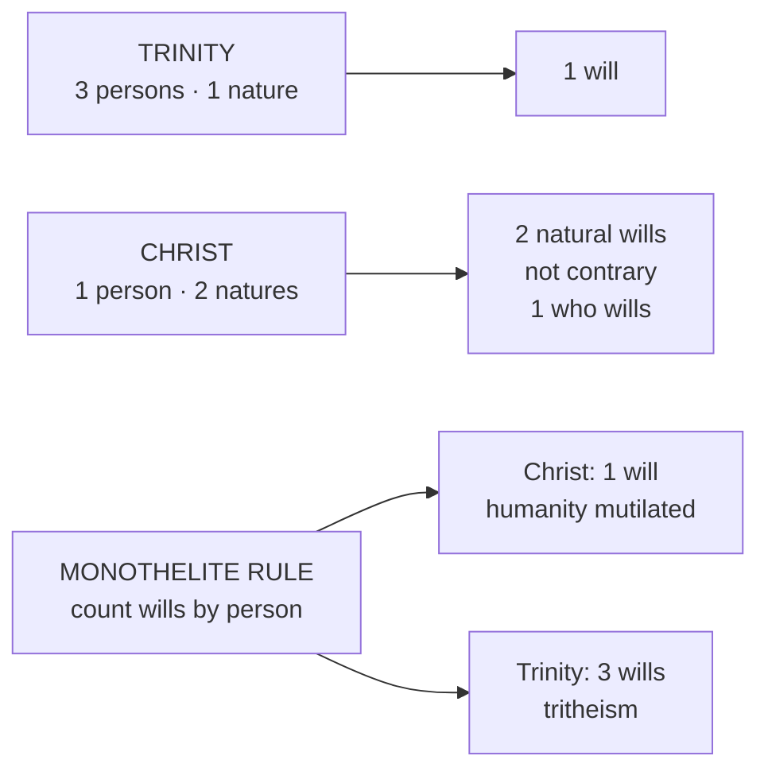

# Christology · Lesson 2.5: Monothelitism and Constantinople III (681)

> ⏱ ~15 min · Module 2: From Apollinaris to the two wills · Builds on: [2.1 Apollinaris](02-01-apollinaris-a-complete-humanity.md), [2.3 Chalcedon](02-03-eutyches-leo-and-chalcedon.md), [2.4 Constantinople II](02-04-the-three-chapters-and-constantinople-ii.md) · Unlocks: [3.1 The hypostatic union](03-01-person-and-nature-the-hypostatic-union.md), [4.1 Christ's human will in act](04-01-christs-human-will-in-act.md)

## Why this matters

Chalcedon said two natures in one person. It did not say which of the two a will belongs to. For fifty years an emperor's peace plan ran on that silence: grant the two natures, confess one will, and the churches that refused Chalcedon might come back. The answer the Church finally gave cost a pope his exile and a monk his tongue. It also produced the most precise sentence in the Christological tradition. And the council that wrote it anathematized a Roman pope by name. This lesson reads the sentence and states the anathema plainly.

## The idea

The question has a counting shape. **Do you count wills by persons or by natures?** Count by persons, and Christ, one person, has one will. Count by natures, and he has two.

The one-will answer looked like the pious one. It seemed to secure the unity of the subject, and it seemed to guarantee sinlessness: no human will, so nothing that could turn against God. It was also a working political formula. The minimum narrative, since [`church-history`](../../church-history/syllabus.md) has no lesson on 681:

- **633.** Under the emperor Heraclius and the patriarch Sergius of Constantinople, Cyrus of Alexandria wins back many anti-Chalcedonians with a **Pact of Union** confessing one "theandric" operation in Christ. Sophronius, soon patriarch of Jerusalem, protests. Sergius writes to Pope **Honorius**, whose reply, in the mid-630s, confesses "one will."
- **638.** Heraclius's ***Ecthesis*** forbids talk of one or two operations and imposes **one will** ([monothelitism](../reference.md#monothelitism)).
- **648.** Constans II's ***Typos*** forbids discussing the question at all.
- **649.** A synod at the Lateran under **Martin I** condemns both edicts. Martin is arrested in 653 and dies in exile at Cherson in 655. **Maximus the Confessor**, the argument's author, has his tongue and right hand cut off in 662 and dies in exile that year.
- **680–681.** Constantine IV summons the council. Pope Agatho sends a letter together with the letter of a Roman synod of 125 bishops. **Constantinople III** meets from 7 November 680 to 16 September 681 and defines two wills (Percival's introduction).

## Source

The Definition of Constantinople III, Session XVIII, in Percival's translation (*Nicene and Post-Nicene Fathers*, second series, vol. 14). It first repeats Chalcedon almost word for word, then adds:

> defining all this we likewise declare that in him are two natural wills and two natural operations indivisibly, inconvertibly, inseparably, inconfusedly, according to the teaching of the holy Fathers. And these two natural wills are not contrary the one to the other (God forbid!) as the impious heretics assert, but his human will follows and that not as resisting and reluctant, but rather as subject to his divine and omnipotent will. … so also his human will, although deified, was not suppressed, but was rather preserved …

Four phrases carry it. **"Natural"**: the wills are counted by nature, and nothing else in the sentence would settle the count. **Chalcedon's four adverbs**, now applied to wills: whatever held for the natures holds for their powers. **"Not contrary"**: two wills do not mean two wills in conflict. **"Follows … subject … preserved"**: the human will is really there and really active, and it is ordered to the divine without being absorbed into it.

The same Definition names the ancestor of the error. The monothelites, it says, revived something close to Apollinaris by making Christ's flesh, "endowed with a rational soul," empty of will or operation. That is [2.1](02-01-apollinaris-a-complete-humanity.md)'s heresy moved from the mind to the will.

## The argument

Maximus's case, as John of Damascus later sets it out (*Exposition of the Orthodox Faith* III.14, Salmond's translation in NPNF 2.9):

1. **In the Trinity there are three persons and one will** ([`trinity-and-god` 6.4](../../trinity-and-god/lessons/06-04-social-trinitarianism-and-its-critics.md)). *In words:* the Father, Son and Spirit do not each have a will of their own that happens to agree.
2. **So will belongs to nature, not to person.** John: "we hold that wills and energies are faculties belonging to nature, not to subsistence … if we allow that they belong to subsistence, we will be forced to say that the three subsistences of the Holy Trinity have different wills." *In words:* count wills by persons and you get three gods.
3. **Christ has two complete natures** (Chalcedon, [2.3](02-03-eutyches-leo-and-chalcedon.md)).
4. **So Christ has two natural wills, a divine and a human.** *In words:* the rule that gave the Trinity one will gives Christ two.
5. **What is not assumed is not healed** ([the soteriological rule](../reference.md#the-soteriological-rule)). The will is where the fall began. John again: if Adam fell by his own will, "in us the will is the first part to suffer," and if the Word did not assume it, "we have not been freed from sin." *In words:* a Christ without a human will saves everything in us except the part that sinned.
6. **One person wills in both natures**: it is one and the same person who wills naturally in each (III.14). *In words:* two ways of willing, one who wills.

That answers the first monothelite worry, about unity. The second, that two wills must clash, is answered by a distinction ([natural will and gnomic will](../reference.md#natural-will-and-gnomic-will)). The **natural will** (*thelēma physikon*) is the faculty itself: a rational nature's built-in drive toward its own good. John compares it to sight: every human has it by nature. ***Gnōmē*** (the lesson's translation: *opinion*, or deliberating disposition) is a mode of using that faculty. It is the hesitant weighing of a creature who does not know the good and must choose among options, sometimes against God. John denies Christ *gnōmē* in this sense: "knowing all things, [he] had no need of inquiry" (III.14). So the two wills cannot collide, because the only kind of will that sets itself against God is gnomic, and that is not in him. The Definition's "not contrary … but subject" is this distinction in conciliar form.

**Mark the levels.** Two natural wills and two natural operations in Christ, not contrary, the human following and subject to the divine, is **defined dogma**. It was defined by an ecumenical council and confirmed by Pope Leo II. The Lateran synod of 649 was a Roman synod, not an ecumenical council. Its condemnation carries papal authority, but the defined status comes from 681. Maximus's analysis of will and *gnōmē* is **common teaching**: the tradition's standard explanation, received and never itself defined. Only the word "natural" entered the Definition. How far *gnōmē* can be denied of Christ, and what his human choosing then looks like, is [4.1](04-01-christs-human-will-in-act.md)'s question, not this lesson's.

## Count by nature

The monothelite rule gives the right answer for neither case. Counting by nature gives the right answer for both.

## Worked examples

**Example 1: a clean case, "he could not be hid."** Mark 7:24, as John quotes it: Christ entered a house "and would have no man know it; but He could not be hid." John runs the argument on this verse (III.14). If the will here were divine, an omnipotent will would have failed, which is absurd. So it was as man that he wished and could not have his wish. The one who willed is the one person, the Word. The willing was human, and so was its frustration. Nothing in the verse sets the human will against the divine: a human wish went unmet, that is all. Every clause of the Definition applies here without strain. The harder case, where the human will shrinks from death, is Gethsemane, and it belongs to [4.1](04-01-christs-human-will-in-act.md).

**Example 2: where it strains, Honorius.** At the first session the monothelite party claimed Honorius as their authority. At Session XIII the council examined his letter to Sergius. It judged Sergius's letters and Honorius's reply foreign to the apostolic dogmas, and it ordered **Honorius, sometime Pope of Old Rome,** expelled and anathematized with Sergius, Cyrus, Pyrrhus, Paul, Peter and Theodore of Pharan. The ground it gave was that he had followed Sergius's view and confirmed it. His letters were ordered burned. At Session XVI the bishops acclaimed the anathema, and the Definition itself names him among the devil's instruments. **Leo II** confirmed the council. In the Latin that Percival prints, Leo condemns Honorius for having tried to subvert the faith by profane betrayal. A variant tradition of the same letter reads, more mildly, that he *permitted* it to be stained. Which reading is original is disputed, and the lesson does not settle it.

Now the strain. Honorius's defenders, including his successor John IV and Maximus himself, read "one will" as a claim about harmony. Christ assumed no fallen will warring against the good. In the language of this lesson, he had no contrary gnomic will. On that reading Honorius affirmed a true thing with a false count. The council still condemned the formula, because the count *was* the question. "One will" was the imperial reunion formula, and in 681 a sentence counts what it counts. Whether that makes Honorius a formal heretic, a negligent pastor, or a man condemned for someone else's reading of his words is a historian's question. What the case does to papal infallibility is [`fundamental-theology` 4.2](../../fundamental-theology/lessons/04-02-infallibility-and-its-conditions.md)'s, and its conditions for an *ex cathedra* act are the tool for the job. The fact itself is not in doubt: an ecumenical council anathematized a pope, and a pope confirmed it.

## Watch out

- **"Two wills, so two willers."** That is **Nestorianism** by way of psychology. Wills are counted by nature and willers by person. Christ has two ways of willing and is one who wills ([hypostatic union](../reference.md#hypostatic-union)).
- **"One person, so one will."** That is **monothelitism**, and the rule behind it proves three wills in the Trinity. It also subtracts from the humanity, which is the Apollinarian move, and so it fails [the soteriological rule](../reference.md#the-soteriological-rule).
- **"Subject to the divine will" read as "switched off by it."** The Definition says "preserved," "not suppressed." A human will that never acts is the monothelite position under another name.
- **Level errors in both directions.** Calling Maximus's theory of *gnōmē* defined is an overstatement: the defined words are "two natural wills." Calling the two wills a Greek school opinion understates it. And the Lateran synod of 649 is not the Sixth Ecumenical Council ([the levels in Christology](../reference.md#the-levels-in-christology)).

## One-liner

> Count wills by natures and willers by persons: two wills, one who wills, the human one following, never fighting, and never erased.

## Problems

**P1 (🟢)** *(Exegetical)* Mark each sentence **true**, **false**, or **true only with a stated distinction**, and give the rule or clause that decides it. One line each.

1. "Christ had only one will because he was only one person."
2. "The Son of God willed to eat and drink."
3. "Christ's divine will is the Father's will."
4. "In Christ there were two who willed, God and a man."
5. "Christ's two wills sometimes pulled against each other, and the divine always won."
6. "Christ's human will was deified."

**P2 (🟡)** *(Exegetical)* An **invented** catechist's handout, not the words of any real person:

> "Jesus was one person, so he had one will, God's. He had human feelings, of course, but every decision was made by the divine will, and that is why he could never sin: there was no human will in him to go wrong. The Church settled this for good at Chalcedon."

(a) Name the heresy and the argument that refutes its first sentence. (b) Name the rule the third sentence breaks, and the earlier heresy it repeats. (c) Correct the history and the level in the last sentence. 120 words total.

**P3 (🔴)** *(Exegetical)* Here is a monothelite case as its best defender might put it (a paraphrase built for this problem, not a quotation): *"Willing belongs to the one who wills. Christ is one who wills, so he has one will. A second will could only be a will capable of opposing God, and Christ is sinless. So a second will is both unnecessary and dangerous."* (a) Name the single premise Maximus denies, and the evidence that forces the denial. (b) The second worry does not depend on that premise. Name the distinction that answers it, and quote the words of the 681 Definition that write the answer in. 120 words total.

Solutions

**P1** *(Exegetical)*

**Must hit, strict:**
1. **False.** It counts will by person. Will belongs to nature (John, *Exposition* III.14), and the same rule would give three wills in the Trinity. Constantinople III defines "two natural wills."
2. **True.** The subject names the person, and the predicate comes from his human will. The one person wills in both natures, by the [communication of idioms](../reference.md#communication-of-idioms) ([3.2](03-02-the-communication-of-idioms.md)). It would be false with "as God": John says it is no part of Godhead to will to eat or drink (III.14).
3. **True.** In the Trinity there is one will because there is one nature. Christ's divine will is numerically the one divine will.
4. **False.** This is Nestorian: two willers means two subjects. One person wills in both natures.
5. **False.** The Definition says "not contrary the one to the other … not as resisting and reluctant." There is no contest to win.
6. **True with a distinction.** The Definition says it: the will was "deified" and yet "not suppressed, but … preserved." Deified means wholly moved by and conformed to the divine will. It does not mean changed into the divine nature or absorbed into it.

**Wrong turns:** marking 2 false because God does not eat. That turns the communication of idioms into a ban on predicating anything human of the Son. Marking 6 simply false because it "sounds monothelite," when the phrase is the council's own. Marking 3 "true with a distinction" by inventing a second divine will for the Son.

**P2** *(Exegetical)*

**Must hit, strict:** (a) **Monothelitism.** Will belongs to nature, not person, or the Trinity would have three wills. Two complete natures therefore give two natural wills. (b) **What is not assumed is not healed.** The will is where sin began, so a Christ without a human will does not heal ours. It repeats **Apollinarianism**, now subtracting the will instead of the mind, which the 681 Definition itself says. (c) Chalcedon did not address the wills. They were defined at **Constantinople III (680–681)**, and it is defined dogma. Full credit also notes that sinlessness comes from the human will's being subject to the divine, not from its absence.

**Wrong turns:** calling the handout Eutychian without naming the will. Crediting Lateran 649 as the definition; it was a Roman synod.

**Model answer:** (a) The first sentence is monothelitism. It counts will by person, and that rule would give the Trinity three wills. Will follows nature, so two natures give two wills. (b) The third sentence breaks "what is not assumed is not healed," because the will is the first part of us to fall. It is Apollinarianism relocated from mind to will. (c) Chalcedon never addressed the wills. Constantinople III defined two natural wills in 681, and that definition is dogma.

**P3** *(Exegetical)*

**Must hit, strict:** (a) Maximus denies **"willing belongs to the one who wills"** in the sense that wills are counted by person. The evidence is the Trinity: three persons, one will. Counting by person would give three wills and three gods, so will must follow nature. (b) The distinction is between the **natural will and *gnōmē***. Only a deliberating, gnomic will, weighing options in ignorance, can set itself against God. The natural will of a sinless nature is simply its drive to its own good, and Christ has no gnomic will. The Definition's words: "not contrary the one to the other," and "follows … not as resisting and reluctant, but rather as subject to his divine and omnipotent will."

**Wrong turns:** denying sinlessness to make room for the second will. Answering (a) with the soteriological rule, which is a reason to want two wills, not the refutation of the premise. Quoting "indivisibly, inseparably," which rules out division, not conflict.

**Model answer:** (a) He denies that wills are counted by the willer. In God there are three persons and one will, so will belongs to nature. The monothelite premise would give the Trinity three wills. (b) A natural will is a nature's drive toward its good. *Gnōmē* is the deliberating choice of one who does not know the good, and only that can oppose God. Christ has the first without the second, which is why the Definition says the wills are "not contrary" and that the human will follows "as subject to his divine and omnipotent will."

## Flashback

**From Lesson [2.3](02-03-eutyches-leo-and-chalcedon.md) (Eutyches, Leo, and Chalcedon (451)):** *(Exegetical.)* An **invented** paragraph from a parish talk, written for this problem and not the words of any real person:

> "At Chalcedon the bishops simply adopted Pope Leo's Tome as the Church's definition, and their cry 'Peter has spoken through Leo!' was the solemn act that made it dogma. Leo was answering Eutyches, who taught that Christ had one nature before the Incarnation and two after it. The council's Greek text has always read 'in two natures', so there was never any doubt. And the Copts and Armenians who refused the council are Eutychians to this day."

Find **four** errors and correct each. Where a level is involved, name the act that fixes it. **120 words or fewer.**

Solution

**Must hit, strict (any four):**
1. **The Tome was not adopted as the definition.** The bishops at first wanted no new text. The imperial commissioners insisted on one, and a committee redrafted it, so the council wrote its own Definition. The Tome was received as agreeing with Cyril, but not every sentence of it is thereby defined.
2. **The acclamation is not a doctrinal act.** The act that fixes the dogma (rung 1) is the council's own Definition, its *horos*.
3. **Eutyches's count is reversed.** He said two natures before the union and one after. The orthodox count is one before and two after, with one and the same Son throughout.
4. **The Greek as transmitted reads *ek*, "out of" two natures.** *En* ("in") is the majority scholarly reconstruction, supported by the Latin *in duabus naturis*, the Session V debate and Severus's complaint. That is a textual judgment, not a matter of faith, and the doctrine does not hang on it.
5. **The Oriental Orthodox condemn Eutyches too.** Whether their difference with Chalcedon was more than verbal is freely disputed.

**Wrong turns:** "correcting" error 3 to "one nature throughout", which is still Eutyches. Correcting error 4 by calling *ek* heretical, when Cyril used "of two natures". Correcting error 5 with the label "monophysite", which repeats the error. Using the four adverbs as the correction for error 3; the Definition's "in two natures" and "the property of each nature being preserved" are what answer it.

**Model answer:** The council wrote its own Definition after the commissioners forced a redraft. It received the Tome as agreeing with Cyril but did not make it the definition. The acclamation is applause; the Definition is the act, and it is defined dogma. Eutyches said two natures before the union and one after, which is the reverse of the orthodox count. The transmitted Greek reads "out of", and "in" is scholars' majority reconstruction. The Copts and Armenians anathematize Eutyches, and whether their quarrel with Chalcedon was only verbal is still disputed.

## Connections

- **Backward:** the count-by-nature rule is [2.3](02-03-eutyches-leo-and-chalcedon.md)'s "the properties of each nature being preserved," extended to wills. The Definition itself repeats Chalcedon before it adds anything, and it applies Chalcedon's four adverbs to the wills. The soteriological rule comes from [2.1](02-01-apollinaris-a-complete-humanity.md). The texts and the life of Maximus are [`patristics` 5.4](../../patristics/lessons/05-04-maximus-and-john-of-damascus.md). The one will of the Trinity is [`trinity-and-god` 6.4](../../trinity-and-god/lessons/06-04-social-trinitarianism-and-its-critics.md).
- **Forward:** [3.1](03-01-person-and-nature-the-hypostatic-union.md) gives the person-nature grammar this lesson used. [4.1](04-01-christs-human-will-in-act.md) takes the two wills into a concrete act, Gethsemane, and asks what freedom means for a will without *gnōmē*.
- **Sideways:** the Honorius question belongs to [`fundamental-theology` 4.2](../../fundamental-theology/lessons/04-02-infallibility-and-its-conditions.md) and [`apologetics-catholic-claims`](../../apologetics-catholic-claims/syllabus.md). Whether a will can be free without alternatives is the philosophers' dispute in [`metaphysics` 6.3](../../metaphysics/lessons/06-03-frankfurt-cases-and-alternate-possibilities.md).
