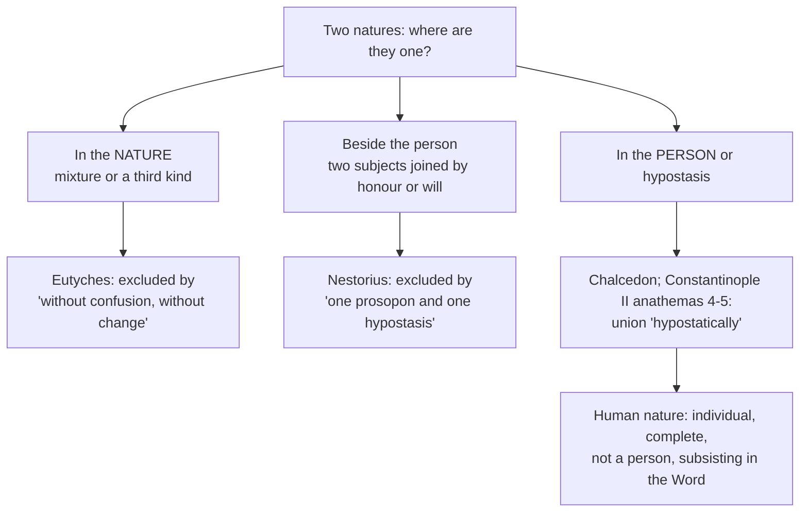

# Christology · Lesson 3.1: Person and nature: the hypostatic union

> ⏱ ~15 min · Module 3: The grammar of the union · Builds on: [2.3 Eutyches, Leo, and Chalcedon (451)](02-03-eutyches-leo-and-chalcedon.md), [2.4 After Chalcedon: the Three Chapters and Constantinople II (553)](02-04-the-three-chapters-and-constantinople-ii.md), [`thomistic-synthesis` 2.2](../../thomistic-synthesis/lessons/02-02-esse-and-essence-the-real-distinction.md) · Unlocks: [3.2 The communication of idioms](03-02-the-communication-of-idioms.md)

## Why this matters

Module 2 won the definitions: one Christ, "to be acknowledged in two natures," in one person and one hypostasis. It did not say what kind of *one* that is. A heap of stones is one, so is watered wine, so is a man of soul and body; each model has been proposed for Christ, and each lands in a heresy. This lesson names the kind of union the councils defined, says why the human nature can be complete and individual and still not a person, and ends on the one metaphysical question the definitions leave open: how many acts of existing Christ has.

## The idea

Every Christological sentence answers **who** or **what**. The [hypostatic union](../reference.md#hypostatic-union) is the claim that the two natures meet in the **who** and nowhere else. Not in the *what*: divinity and humanity are not blended into a third kind of thing. Not beside the *who*: the natures are not two somebodies linked by love or honour. There is one somebody, the eternal Word, and he now exists in two ways of being, each complete.

Aquinas runs through every way two things can make one (ST III q.2 a.1). **Juxtaposition**, like stones in a heap or beams in a house, gives only an accidental unity. **Mixture**, like elements in a compound, changes both ingredients, and the divine cannot change; besides, the infinite would swallow the finite, as wine swallows a drop of water. **Composition of parts**, as soul and body make one man, would yield a *tertium quid*, a third species that is neither God nor man. Every way of making one *nature* out of two fails. What is left is one *subject* possessing two.

The words for this took 125 years to settle, and their drift is half the history of Module 2. (The Trinitarian side of *ousia* and *hypostasis* is [`trinity-and-god` 3.2](../../trinity-and-god/lessons/03-02-one-ousia-three-hypostaseis.md); here is the Christological side.)

| Greek | Latin | How it drifted | Where it lands in 451 |
|---|---|---|---|
| *ousia* | *essentia*, *substantia* | At Nicaea a synonym of *hypostasis*: the final anathema pairs the two as one term | The common "what": consubstantial with the Father, consubstantial with us |
| *hypostasis* | *substantia*, later *subsistentia* | "Real being" in 325; the Cappadocians make it "which one" | The one concrete subject: "one hypostasis" |
| *physis* | *natura* | For Cyril it can name the concrete individual, so "one incarnate nature of the Word" and a "natural union" can mean one real subject | Aligned with *ousia*: "two natures" |
| *prosōpon* | *persona* | Face, mask, role; the Antiochene "one *prosōpon*" sounded to Cyril like two subjects sharing one appearance | Welded to *hypostasis*: "one *prosōpon* and one *hypostasis*" |

In words: by 451 the vocabulary splits cleanly into two columns, a *what* column (*ousia*, *physis*, nature) and a *who* column (*hypostasis*, *prosōpon*, person). Cyril's "one nature" formula, which reached him under Athanasius's name from an Apollinarian forgery ([`patristics` 5.1](../../patristics/lessons/05-01-cyril-of-alexandria.md)), belongs to the older usage, and that mismatch is the long root of the non-Chalcedonian schism ([6.3](06-03-the-churches-that-did-not-receive-chalcedon.md)). One Latin wrinkle: Boethius's own table (*Contra Eutychen* III, Stewart and Rand) pairs *hypostasis* with *substantia* and keeps *subsistentia* for a different Greek word, *ousiōsis*. The Latin conciliar tradition and Aquinas render *hypostasis* as *subsistentia*, which is why Schaff's English Chalcedon says "one Person and one Subsistence."

## Source

*Summa Theologiae* III q.2 a.2, reply to the third objection (English Dominican Province). The objection: Boethius defines a person as "an individual substance of rational nature"; the Word assumed an *individual* human nature; so that nature is a person.

> Yet we must bear in mind that not every individual in the genus of substance, even in rational nature, is a person, but that alone which exists by itself, and not that which exists in some more perfect thing. Hence the hand of Socrates, although it is a kind of individual, is not a person, because it does not exist by itself, but in something more perfect, viz. in the whole. ... Therefore, although this human nature is a kind of individual in the genus of substance, it has not its own personality, because it does not exist separately, but in something more perfect, viz. in the Person of the Word.

Aquinas grants every premise. The human nature *is* individual (not humanity in general, or every man would be the Word). It *is* rational, since it has a rational soul. What decides the case is one word Boethius's definition already contained, **substance**, read as *that which exists by itself*. The hand is real, individual, and human, and still not a person, because it is not the whole that exists. Christ's human nature is not a hand, but it stands the same way: it exists *in* a more perfect subject.

## The argument

1. **[Nature answers "what", person answers "who."](../reference.md#person-and-nature)** A nature is the essence the definition signifies; a person is an individual subsisting in a rational nature (q.2 a.2). *In words:* you can list everything human about Socrates and still not have said *which one* he is.
2. **Whatever belongs to a person is united to it in the person**, whether it belongs to his nature or not (q.2 a.2). *In words:* the person is the place where everything that is his meets.
3. **The human nature is not the Word's by nature**, since the divine nature is simple and cannot receive it (q.2 a.1). So if it is united to him at all, **it is united in the person.**
4. **What is assumed is a nature, not a person.** A person in human nature is not presupposed to the assumption; it is the term of it. A pre-existing human person would either be destroyed, and the assumption pointless, or remain, and there would be two persons (q.4 a.2). *In words:* there was never a man called Jesus whom the Word then adopted.
5. **So the human nature lacks its own personality by addition, not by subtraction.** Nothing belonging to the perfection of human nature is missing; what it has instead is union with a divine person (q.4 a.2 ad 2). This is [enhypostasia](../reference.md#enhypostasia) ([2.4](02-04-the-three-chapters-and-constantinople-ii.md)): not a hypostasis of its own, but subsisting in the Word's.
6. **The union changes the creature and not the Word.** The union is a relation, and a relation between God and a creature is real in the creature and of reason only in God ([`thomistic-synthesis` 4.3](../../thomistic-synthesis/lessons/04-03-the-names-of-god.md)). Hence the union, taken as a relation, is something created, really in the human nature (q.2 a.7). *In words:* "the Word became flesh" is true because of what happened to the flesh.
7. **The union is a grace, but not habitual grace.** No merit preceded it (q.2 a.11), and it was not effected through any created habit: the [grace of union](../reference.md#grace-of-union) "is the personal being that is given gratis from above to the human nature in the Person of the Word" (q.6 a.6). Habitual grace follows the union as its effect ([3.4](03-04-the-grace-of-the-head.md)).

**Mark the levels.** One person in two complete natures, a rational soul and a true body, is **defined dogma** (Chalcedon), and so is the denial of a second, human hypostasis: Constantinople II's fifth anathema requires the union to be confessed "hypostatically" and adds that the Trinity received no additional person or hypostasis. The *analysis* in steps 1–7, meaning Boethius's definition, "exists by itself," the relation of reason and the grace of union, is **common teaching** of the Latin schools, never defined; Scotus accepts the dogma with a different account of what personality is. [Whether Christ has one *esse* or two](../reference.md#one-esse-or-two) is **freely disputed**. Calling that last question a matter of faith is the overstatement the [levels](../reference.md#the-levels-in-christology) exist to catch.

## What each clause excludes

## Worked examples

**Example 1: the machinery on a clean case. Is "Christ is a composite person" true?** Run the distinction between person and nature. Taken in itself the Word's person is utterly simple, as simple as the divine nature. Taken as the one who subsists *in* natures, he now subsists in two. So Aquinas allows "composite person" in the sense that one subject subsists in two natures (q.2 a.4), and denies that anything is added to the Word as a part. True with a distinction: composition on the side of the natures possessed, none in the one who possesses them.

**Example 2: where it strains. One *esse* or two?** In every creature, the nature is a potency that receives an act of existing ([`thomistic-synthesis` 2.2](../../thomistic-synthesis/lessons/02-02-esse-and-essence-the-real-distinction.md)). Does the assumed human nature bring its own?

*The Summa says one.* ST III q.17 a.2 ("Whether there is only one being in Christ?"): *esse* belongs to the hypostasis as "that which has being" and to the nature only as "that whereby" it has being; one hypostasis, one *esse*. By the assumption no new personal *esse* accrued to the Son, "but only a new relation of the pre-existing personal being to the human nature." Two acts of existing would make two beings.

*Another text of Aquinas seems to say two.* The disputed question *De unione Verbi incarnati* a.4 teaches that Christ has one *esse* simply, the eternal *esse* of the eternal subject, and then adds that there is also another *esse* of that subject "insofar as it is made man in time," which is not accidental yet is "not the principal *esse* of its subject, but secondary" (the lesson's translation of the Latin, checked against the Corpus Thomisticum text). Whether this contradicts q.17, refines it, or is an earlier or later position is argued in the literature, and the relative dating of the two texts is itself disputed. This lesson does not settle it.

*The schools.* Cajetan, commenting on the *Tertia Pars*, held the one *esse* and explained personhood as a substantial mode that terminates a nature and fits it to exist, a mode that Christ's humanity lacks. Other Thomists, of whom Billot is the usual example, tied personhood to *esse* itself. Some modern Thomists defend a created, secondary *esse* of the humanity from the *De unione*. Scotus, who denied the real distinction of essence and *esse*, gave the human nature its own existence and made personality a negation: a nature is a person when it is not dependent on another subsisting subject. Each side has a real worry. One *esse* seems to make an uncreated act the actuality of a creature, which strains "without confusion." Two seems to give the humanity a standing of its own, which strains "one hypostasis." Both schools affirm every word of Chalcedon.

## Watch out

- **You might think "the Word united himself to a man."** Said of a pre-existing man, it puts two subjects in Christ, which is **Nestorianism**, or its cousin **adoptionism**. Aquinas lets the Fathers' *homo assumptus* stand only when "loyally explained" as a man's *nature* assumed (q.4 a.3 ad 1).
- **You might think the union makes one "divine-human nature."** That is the *tertium quid*, **Eutychian** confusion, and it abolishes both consubstantialities at once: Christ would be of the same nature neither as his Father nor as his mother (q.2 a.1). This is not the miaphysite position either, whose "one nature" means one subject ([6.3](06-03-the-churches-that-did-not-receive-chalcedon.md)).
- **You might think a nature without its own person is a lesser humanity.** Its personality is lacking by addition, not loss (q.4 a.2 ad 2). Reading it as a subtraction leads toward **Apollinarianism**, a human nature missing a part.
- **You might think "the Word changed by becoming man."** The change is real, and it is in the creature (q.2 a.7).

## One-liner

> Two natures, each whole, meet in one who: the humanity is not a person because it exists in the Word, which it gains by addition and loses nothing by.

## Problems

**P1 (🟢)** *(Exegetical)* Mark each sentence **true**, **false**, or **true only with a distinction**, and give the deciding rule or article in one line each.

(a) "The Son of God assumed a human person."
(b) "Christ's humanity lacks something every other human nature has."
(c) "At the Incarnation the Word entered a relation to a creature that he did not have before."
(d) "Divinity and humanity combined in Christ into one nature, as soul and body combine into one man."

**P2 (🟡)** *(Exegetical)* This is an **invented** paragraph from a parish Advent handout, written for this problem and not the words of any real person:

> "At the Annunciation the eternal Son looked down, chose the holiest man who would ever live, Jesus of Nazareth, and joined himself to him. From that moment the two became a single new being, half God and half man, the way a drop of water disappears into a cup of wine."

Name the two opposite errors in the paragraph, the heresy each lands in, and the conciliar phrase or *Summa* article that corrects each. Then say in one sentence what is odd about committing both at once. **120 words total.**

**P3 (🔴)** (a) *(Exegetical)* Assign a level to each claim and name the act, or the absence of one, that fixes it: (i) Christ's human nature is not a human person; (ii) a person is an individual substance of a rational nature; (iii) Christ has only one act of existing. **One line each.** (b) *(Evaluative)* One *esse* or two? State the strongest reason for each side, give your verdict, and say what it commits you to about whether the actuality of Christ's humanity is created. **150 words or fewer.**

Solutions

**P1** *(Exegetical)*

**Must hit, strict:** (a) **False.** A person is the term of the assumption, not something presupposed to it; a pre-existing human person would either perish or remain as a second person (q.4 a.2). (b) **True only with a distinction.** It lacks its own personality, but by addition (union with a divine person), not by the loss of anything belonging to human nature's perfection (q.4 a.2 ad 2; q.2 a.2 ad 2). As a claim that it is less than fully human, false: Chalcedon's "perfect in manhood." (c) **True only with a distinction.** The relation is real in the creature and of reason only in the Word, so nothing new is *in* the Word (q.2 a.7). As a claim of real change in the Word, false. (d) **False.** That would be a union in the nature, a *tertium quid* (q.2 a.1). The soul-body comparison holds only for unity of *person*, not of nature (q.2 a.1 ad 2).

**Wrong turns:** marking (b) plain true, which invites the Apollinarian reading, or plain false, which ignores that it really has no personality of its own. Marking (c) plain false, which is the right instinct badly expressed, since the Incarnation is a genuinely new fact. Marking (d) true-with-distinction because the Athanasian Creed uses the soul-body image: the Creed and Aquinas use it for one *Christ*, never for one nature.

**P2** *(Exegetical)*

**Must hit, strict:** (1) "Chose the holiest man ... and joined himself to him": a pre-existing human subject united to the Word makes **two subjects**. That is **Nestorianism** (adoptionist in flavour). It is corrected by Chalcedon's "one Person and one Subsistence, not parted or divided into two persons," by Constantinople II's anathema 5, and by q.4 a.2: what is assumed is a nature, not a person. (2) "A single new being, half God and half man," like water in wine: a **union in the nature**, a *tertium quid* in which each nature is diminished. That is **Eutychian confusion**, corrected by "inconfusedly, unchangeably" and Chalcedon's "perfect in Godhead and also perfect in manhood." Aquinas uses the drop-in-wine image *against* mixture (q.2 a.1): the infinite would absorb the finite. **The oddity:** the paragraph divides the *who* and then fuses the *what*, the Nestorian and Eutychian errors together, so it is wrong in both directions at once.

**Wrong turns:** calling error (2) "miaphysite," since the miaphysite "one nature" means one subject, not a blend. Calling "half God and half man" merely imprecise: "half" denies the completeness of each nature, which is defined. Naming only one error.

**Model answer:** The first sentence has the Son choose an existing man and join himself to him: two subjects, which is Nestorianism, excluded by Chalcedon's "not parted or divided into two persons" and by q.4 a.2 (a nature is assumed, never a person). The second fuses the natures into a new half-and-half being, which is the Eutychian *tertium quid*, excluded by "inconfusedly, unchangeably" and "perfect in Godhead, perfect in manhood"; Aquinas uses the very image of wine and water to show that mixture would annihilate the humanity. The oddity is that it divides the person and confuses the natures in the same breath.

**P3** *(Exegetical (a) · Evaluative (b))*

**Must hit, strict (a):** (i) **Defined dogma**, fixed by Chalcedon's "one Person and one Subsistence" and Constantinople II's anathema 5 (no additional person or hypostasis). (ii) **No magisterial act.** It is a philosophical definition the Latin schools adopted: common teaching at most, and not itself dogma. Credit for noting that the schools hold rival accounts of what personality is (Scotus's is one), and no act forbids them. (iii) **Freely disputed.** No act defines it. Chalcedon defines one hypostasis, not one *esse*, and the Thomists themselves divide over *De unione* a.4.

**Must hit, any verdict (b):** the one-*esse* case at strength: *esse* belongs to the subject as "that which has being," so one subject has one *esse*, and two acts of existing look like two beings (q.17 a.2). The two-*esse* case at strength: a created, finite essence needs a proportionate act, and making the uncreated *esse* the act of a creature seems to confuse the natures (*De unione* a.4's secondary *esse*; Scotus). Then a verdict and its cost: one *esse* means the humanity's actuality is the Word's uncreated *esse* communicated to it (q.17 a.2 ad 2), and you owe an account of how that avoids confusion. Two means a created secondary *esse*, and you owe an account of why it does not make a second subsistent.

**Wrong turns:** treating either verdict as heresy. Claiming that Chalcedon settles it. Reporting the *De unione* as a known late retraction, when its dating and relation to q.17 are disputed.

**Model answer (b), one of several:** For one *esse*: *esse* is had by the subject, and the subject is one; a second act of existing would be the existing of something, and in Christ there is no second something. For two: every created essence is a potency proportioned to a created act, and an infinite act cannot be the proper actuality of a finite nature without collapsing "without confusion." My verdict is one *esse*, with the humanity drawn into the Word's personal existence by a created relation (q.17 a.2 ad 2; q.2 a.7). That commits me to saying the humanity's actuality is not a created *esse*, although its essence, its operations and its union-relation are all created, and so the thing to be protected, "without confusion," is protected at the level of nature and operation, not of existence.

## Flashback

**From Lesson [2.4](02-04-the-three-chapters-and-constantinople-ii.md) (After Chalcedon: the Three Chapters and Constantinople II (553)):** *(Exegetical.)* The second capitulum of Constantinople II (Percival, *NPNF* 2.14):

> If anyone shall not confess that the Word of God has two nativities, the one from all eternity of the Father, without time and without body; the other in these last days, coming down from heaven and being made flesh of the holy and glorious Mary, Mother of God and always a virgin, and born of her: let him be anathema.

(a) Name the single grammatical subject of both nativities, and say which position the capitulum closes off by making that subject the one "born of her". (b) Two births might seem to mean two sons. Say why they do not, using the rule capitulum 7 lays down for counting the natures. **Two sentences per part.**

Solution

**Must hit, strict (a):** the subject is **"the Word of God"**. The same one is born eternally of the Father and in time of Mary, so the one she bore is the Word, and she is "Mother of God". This closes off the Nestorian and Theodoran position: a man born of Mary, whom the Word then joined or indwelt, whose mother could be called only *Christotokos* or *anthropotokos*.

**Must hit, strict (b):** births belong to the person but are distinguished by the nature in which he is born: "without body" from the Father, "made flesh" from Mary. Capitulum 7 allows "two" as a real **difference** of natures but forbids using the number **to divide them or to make persons** of them. Count the births as two and the one born as one, exactly as with the natures.

**Wrong turns:** reading "coming down from heaven" as flesh brought from heaven. The capitulum says he was "made flesh of" Mary, and "coming down" is the creed's language for the Word's own descent. Naming Eutyches as the target of (a); nothing here concerns mixture. Answering (b) by making the eternal birth a mere metaphor, which removes one of the two. Turning to "always a virgin", whose weight is `ecclesiology-and-mariology`'s question, not this one.

**Model answer:** (a) Both births are said of "the Word of God", so the one born of Mary is the one born of the Father before all time, and Mary is Mother of God. That excludes Theodore's and Nestorius's man born of Mary and then joined to the Word. (b) The births differ as the natures do, one without body and one in the flesh, but they belong to one person. Capitulum 7 allows the number two for the difference of natures and forbids it for persons, and two births of one Word follow the same rule.

## Connections

- **Backward:** [2.3](02-03-eutyches-leo-and-chalcedon.md) gave the Definition's words and [2.4](02-04-the-three-chapters-and-constantinople-ii.md) gave enhypostasia and the "hypostatic" anathemas; this lesson says what they mean. [`thomistic-synthesis` 2.1](../../thomistic-synthesis/lessons/02-01-act-and-potency-extended.md) and [2.2](../../thomistic-synthesis/lessons/02-02-esse-and-essence-the-real-distinction.md) supply act, potency and *esse*; that course's 2.2 raised the one-*esse* question and handed it here. [`thomistic-synthesis` 6.1](../../thomistic-synthesis/lessons/06-01-the-commentators.md) introduces Cajetan.
- **Forward:** [3.2](03-02-the-communication-of-idioms.md) cashes out one subject in two natures as rules for which sentences about Christ are true. [3.4](03-04-the-grace-of-the-head.md) sets the grace of union beside habitual grace. Damascene's rule that whatever follows the nature is doubled (cited at q.17 a.2) gave [2.5](02-05-monothelitism-and-constantinople-iii.md) its two wills; whether *esse* is doubled too is this lesson's open question.
- **Sideways:** [`metaphysics` 6.5](../../metaphysics/lessons/06-05-what-a-person-is.md) reads Boethius's definition as an answer to what a person is in general. Christology is the case that forced the definition into existence, and it is the one case where a complete, individual, rational nature is not a person. The same asymmetry, a relation real in the creature and of reason in God, makes a mission add nothing to God in [`trinity-and-god` 6.1](../../trinity-and-god/lessons/06-01-the-missions-of-the-son-and-the-spirit.md).
