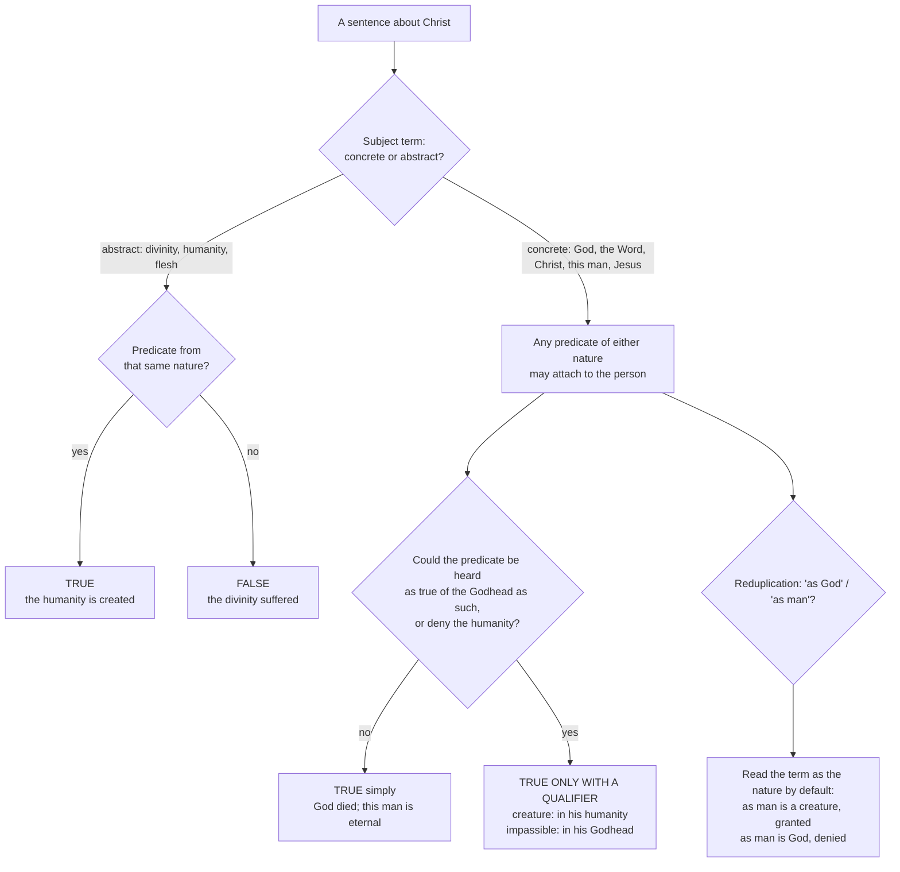

# Christology · Lesson 3.2: The communication of idioms

> ⏱ ~15 min · Module 3: The grammar of the union · Builds on: [3.1 Person and nature](03-01-person-and-nature-the-hypostatic-union.md), [2.2 Nestorius, Cyril, and Ephesus](02-02-nestorius-cyril-and-ephesus.md), [2.4 The Three Chapters and Constantinople II](02-04-the-three-chapters-and-constantinople-ii.md) · Unlocks: [3.3 Kenosis](03-03-kenosis.md), [4.2 Christ's human knowledge](04-02-christs-human-knowledge-the-classical-account.md)

## Why this matters

The councils settled *that* one and the same is God and man. They did not hand you a rulebook for the sentences that follow — and the sentences are where the faith is actually spoken, in hymns, homilies and catechisms. "God died" is orthodox; "the divinity died" is heresy; "Christ is a creature" is true and must not be said without a qualifier. Those three verdicts come from one rule and two refinements. Learn them and you can grade any sentence about Christ, and say *why*.

## The idea

A name can point at a **someone** or at a **what**. "Socrates," "this man," "the philosopher" point at someone; "humanity," "wisdom" point at a what. "This man is snub-nosed" works; "humanity is snub-nosed" does not. Properties belong to someones, *by reason of* their whats.

Now apply that to Christ, who is one someone with two whats ([3.1](03-01-person-and-nature-the-hypostatic-union.md)). Every property of either nature belongs to the one person, so any name that points at the person can carry any property — "God was hungry," "this man is eternal." But the natures do not trade properties with each other, so a name that points at a nature can carry only its own: "the divinity was hungry" is false, and so is "the humanity is eternal."

That is the [communication of idioms](../reference.md#communication-of-idioms) (*idiomata*, "properties"): the properties are exchanged at the level of the person, never between the natures. [`patristics` 5.1](../../patristics/lessons/05-01-cyril-of-alexandria.md) found the rule already working in Cyril's letters. Here we take the systematic form it reached in John of Damascus and Aquinas, with the two refinements Cyril never needed to state.

## Source

John of Damascus, *Exposition of the Orthodox Faith* III.4, "Concerning the manner of the Mutual Communication" (NPNF second series, vol. 9, Salmond):

> When, then, we speak of His divinity we do not ascribe to it the properties of humanity. For we do not say that His divinity is subject to passion or created. Nor, again, do we predicate of His flesh or of His humanity the properties of divinity: for we do not say that His flesh or His humanity is uncreated. But when we speak of His subsistence, whether we give it a name implying both natures, or one that refers to only one of them, we still attribute to it the properties of both natures. ... being spoken of as God who suffers, and as the Lord of Glory crucified, not in respect of His being God but in respect of His being at the same time man.

Three moves carry the passage. **The ban**: nature-names ("divinity," "humanity," "flesh") take only their own nature's properties. **The licence**: any name for the *subsistence* — the hypostasis — takes both sets, *even a name drawn from one nature only*: "God" can take "suffers." And **the rider**, "not in respect of His being God but … man": the predicate goes to the person, but it goes *by reason of* one nature. The Lord of glory crucified is Paul's phrase at 1 Corinthians 2:8 — the princes of this world "would never have crucified the Lord of glory" (Douay-Rheims).

## The argument

Aquinas gives the rule its logic in ST III q.16 (English Dominican Province), twelve articles each testing one sentence.

1. **Concrete terms stand for the hypostasis; abstract terms signify the nature** (a.5). The one sentence to remember: "concrete words stand for the hypostasis of the nature; and hence of concrete words we may predicate indifferently what belongs to either nature." *In words:* "God," "the Son of God," "man," "Jesus," "Christ" all point at the one person — whichever nature the name comes from.
2. **The person is one; the natures are two and unconfused** ([hypostatic union](../reference.md#hypostatic-union), defined at Chalcedon). *In words:* there is one someone to receive every predicate and two whats that never merge.
3. **So human properties are truly said of God, and divine ones of this man** (a.4). "God suffered" is not a figure of speech: the one who suffered *is* God. Aquinas reports Nestorius anathematizing anyone who attributed sufferings to the Word — the divided grammar is exactly what the Nestorian position looked like on the page.
4. **But never of the other nature in the abstract** (a.5). "The Son of God suffered" is true; "the divine nature suffered" is false (a.5 ad 1). Damascene's ban, with its reason: the natures are not the same thing, only the hypostasis is. That is the core of [concrete and abstract terms](../reference.md#concrete-and-abstract-terms).
5. **Every predicate carries its "by reason of"** (a.4). We do not divide the things said of Christ between two subjects; we do distinguish the nature by which each is said. *In words:* one subject, two reasons.
6. **Refinement one — the qualification rule** (a.8). Where a predicate could be heard as belonging to the divine person *in himself*, say it only with its qualifier. Because Arius called the Son a creature, "Christ is a creature" is not said absolutely but "in his human nature"; conversely "Christ is impassible" needs "in his Godhead," or the Manichees' phantom body walks back in (a.8 ad 2). "Christ suffered, died and was buried" can be said flatly, since nobody could hear it as a claim about the Godhead as such. Aquinas cites Jerome: careless words lead to heresy, so we do not share the heretics' vocabulary. *In words:* truth is necessary; unambiguity is also required. This is [the qualification rule](../reference.md#the-qualification-rule).
7. **Refinement two — [reduplication](../reference.md#reduplication)** (aa.10–12). In "Christ *as man* is X," the reduplicated term "man" can refer to the nature or to the person. Because a reduplicated term functions like a predicate, it signifies the nature by default. So "Christ as man is a creature" is "to be granted rather than denied" (a.10), and "Christ as man is God" is to be denied rather than granted (a.11). *In words:* "as man" normally means "in his humanity."
8. **Finally, "God was made man" involves no change in God** (a.6). "Man" is newly true of God by a relation — the union — whose change is entirely in the assumed nature. *In words:* the same asymmetry [`trinity-and-god` 6.1](../../trinity-and-god/lessons/06-01-the-missions-of-the-son-and-the-spirit.md) used for the missions.

**The constraint underneath.** Premise 4 bites hardest on suffering, because the divine nature is unchangeable, and [`trinity-and-god` 1.5](../../trinity-and-god/lessons/01-05-impassibility-and-the-god-who-suffers.md) owns impassibility and its level. The councils kept that constraint by putting the suffering *in the flesh*. Cyril's twelfth anathematism confesses that the Word of God suffered in the flesh (its conciliar standing is [2.2](02-02-nestorius-cyril-and-ephesus.md)'s question). Constantinople II's tenth capitulum anathematizes whoever will not confess the one crucified in the flesh as true God and one of the Holy Trinity — the [theopaschite formula](../reference.md#the-theopaschite-formula) of [2.4](02-04-the-three-chapters-and-constantinople-ii.md). Both are the communication of idioms made binding.

**Mark the levels.** That one and the same divine person is the subject of both sets of predicates — born of Mary, crucified, dead — is **defined dogma**: Ephesus's *Theotokos*, Chalcedon's "one and the same," and the tenth capitulum of Constantinople II. So is the other half: the natures are unconfused and each keeps its properties (Chalcedon). The logical machinery — supposition of concrete terms, the qualification rule, the two readings of reduplication and Thomas's "rather granted than denied" — is the schools' analysis: **common teaching**, theologically certain, never defined. Denying that God died in the flesh sets you against a council; preferring another grammar for "Christ as man" sets you against Aquinas. See [the levels in Christology](../reference.md#the-levels-in-christology).

## The rule

## Worked examples

**Example 1 — the machinery on a clean case: "They crucified the Lord of glory."** Subject: "the Lord of glory," concrete, and a name drawn from the *divine* nature. Predicate: "was crucified," a property of the human nature. Step 1: the concrete term stands for the person, so the predicate may attach. Step 2: by reason of which nature? The human — Damascene's "not in respect of His being God." Step 3: could "crucified" be heard as a claim about the Godhead as such? No; Paul says it simply. Verdict: **true**. Now swap the subject for its abstract twin — "the glory of the Lord was crucified," read as the divine glory itself — and it fails at step 1: a nature-name has taken a property of the other nature.

**Example 2 — where it strains: "Christ is a creature."** Run the licence alone and it passes: "Christ" is concrete, and being created is a property of his human nature. Aquinas still refuses to say it flatly (a.8). The sentence is *true* of the person by reason of the humanity, and it is also the exact sentence Arius used of the Word *as Word*. So the qualification rule takes over: say "Christ is a creature *in his human nature*," or say nothing.

Reduplication then makes it sharper. "Christ *as man* is a creature" is granted, because "as man" reads as "in his humanity" (a.10). Add a demonstrative — "Christ as *this* man is a creature" — and Aquinas denies it: "this" pulls the term back onto the person, and the person is uncreated (a.10). One more step in the same direction: "*This man* began to be" is simply false (a.9), because a subject term stands for the eternal person; but "Christ began to be man" is true (a.9 ad 3). The same truth survives or dies depending on where "man" sits — which is what one subject in two natures sounds like in a language built for one-nature subjects.

**Where the modern debate meets the rule.** Twentieth-century "suffering God" theologies — Moltmann's *The Crucified God* (1972) is the landmark — argue that a God who cannot suffer cannot love, and so place suffering, freely undertaken, within God's own being. The grammar shows what that costs: it must make "the divinity suffered" true, the sentence Damascene and a.5 forbid. Weinandy's *Does God Suffer?* (2000) replies, in paraphrase, that the Son of God truly suffers *as man* — God is the one who suffers, humanly — and that this is the whole of what the gospel needs. The positions and their levels are [`trinity-and-god` 1.5](../../trinity-and-god/lessons/01-05-impassibility-and-the-god-who-suffers.md)'s; this lesson adds only that "God suffered" was never at risk — the concrete rule already delivers it.

## Watch out

- **You might think "the divinity suffered" is just a pious way of saying "God suffered."** It is a different sentence. Predicating the passion of the divine *nature* confuses the natures — the **Eutychian** error at the level of grammar, and a.4 ad 2 calls it blasphemy.
- **You might think the safe course is to avoid "God died" altogether** and say "the man Jesus died." That is **Nestorianism**, and it is not merely unsafe: Aquinas identifies the Nestorian position precisely as the refusal to say human things of God. The corrective is to add "in the flesh," not to change the subject.
- **You might think a true sentence may always be said.** The qualification rule (a.8) exists because "Christ is a creature" is true in one sense and **Arian** in the sense its hearers once meant by it. Grading a sentence means grading how it will be heard.
- **Overstating the level.** The concrete/abstract apparatus and the reduplication verdicts are common teaching, not dogma. The *dogma* is that one person is the subject of both.

## One-liner

> Properties go to the person under any name for the person, by reason of one nature — never from nature to nature.

## Problems

**P1 (🟢)** *(Exegetical)* Mark each sentence **true**, **false**, or **true only with a stated qualifier**, and name the rule (concrete/abstract, a.5 ad 3 on participation, the qualification rule, or reduplication) that decides it. One line each.
(a) "The Son of God was hungry." (b) "The humanity of Christ is omnipotent." (c) "The man Jesus created the stars." (d) "Christ, as God, began to be." (e) "Christ is incorporeal." (f) "The immortal died."

**P2 (🟡)** *(Exegetical)* ST III q.16 a.11 (English Dominican Province), the *respondeo* and the third reply:

> I answer that, This term "man" when placed in the reduplication may be taken in two ways. First as referring to the nature; and in this way it is not true that Christ as Man is God, because the human nature is distinct from the Divine by a difference of nature. Secondly it may be taken as referring to the suppositum; and in this way, since the suppositum of the human nature in Christ is the Person of the Son of God, ... it is true that Christ, as Man, is God. Nevertheless because the term placed in the reduplication signifies the nature rather than the suppositum, ... this is to be denied rather than granted: "Christ as Man is God."
>
> Reply to Objection 3. When we say "this man," the demonstrative pronoun "this" attracts "man" to the suppositum; and hence "Christ as this Man, is God, is a truer proposition than Christ as Man is God."

(a) Article 10 grants "Christ as man is a creature" while this article denies "Christ as man is God." Show that one principle in the passage produces both verdicts. (b) Say what "this" does here, and what it does to the article 10 sentence. Two sentences per part.

**P3 (🔴)** *(Exegetical)* Two **invented** texts, written for this problem:

> *Carol verse:* "The Godhead bled on Calvary's tree, / Divinity was slain for me."
>
> *Catechist's handout:* "Careful: never say 'God died.' God cannot die. The man Jesus died, while the Son of God dwelling in him remained untouched."

(a) Name the error each lands in and the rule each breaks. (b) Rewrite each as one correct sentence that keeps what its author was reaching for. (c) At what level is the proposition the handout's first sentence forbids, and which act fixes that level? 150 words total.

Solutions

**P1** *(Exegetical)*

**Must hit, strict:** (a) **True** — concrete subject (a name from the divine nature), human predicate; said of the person by reason of the humanity (a.4). (b) **False** — abstract subject; and omnipotence is among the divine properties the human nature cannot participate, so it is "nowise predicated" of it (a.5 ad 3). (c) **True** — "the man Jesus" is concrete and stands for the person, who created the stars by reason of his divinity (a.4; Damascene's "this man is uncreated"). (d) **False** on either reading of the reduplication: "as God" read for the nature names what is eternal, and read for the person names the eternal Son. Contrast "Christ began to be man," which is true (a.9 ad 3). (e) **True only with a qualifier** — "in his Godhead"; said flatly it denies his true body, the Manichaean error (a.8 ad 2). (f) **True** — "the immortal" is a concrete term for the person, immortal in divinity; death is predicated of him by reason of the flesh, and death can be said of Christ simply (a.8).

**Wrong turns:** (c) marked false because "Jesus" is a "human" name — a.5 lists "man" and "Jesus" among the concrete words that stand for the hypostasis. (f) marked false as a contradiction — contraries are said of one subject in different natures (a.4 ad 1). (b) marked "true by participation": a.5 ad 3 allows participated gifts such as knowledge of the future, and names omnipotence as the one that cannot be participated.

**P2** *(Exegetical)*

**Must hit, strict (a):** the principle is **"the term placed in the reduplication signifies the nature rather than the suppositum."** So "as man" defaults to "in his human nature": being a creature belongs to that nature, so a.10 grants its sentence, and being God does not (the natures differ by nature), so a.11 denies its sentence. Both are *default* verdicts — "rather granted / rather denied" — because the other reading remains possible.

**Must hit, strict (b):** "this" **pulls the term onto the suppositum**, the eternal person. That makes "Christ as this man is God" truer, and flips a.10: "Christ as this man is a creature" is to be denied, since the person is uncreated.

**Wrong turns:** saying a.11 calls the sentence *false* — it says denied rather than granted, and explicitly allows a true reading. Explaining the asymmetry by a different rule for divine and human predicates; the rule is the same, the predicates differ.

**Model answer:** (a) Aquinas's principle is that a reduplicated term signifies the nature rather than the person, so "as man" means "in his humanity." Creaturehood belongs to the humanity, so a.10 grants its sentence; Godhead does not, so a.11 denies its sentence — in both cases by default, since the person-reading is still available. (b) "This" attracts "man" to the suppositum, the eternal Son. So "Christ as this man is God" improves, and "Christ as this man is a creature" becomes one to deny.

**P3** *(Exegetical)*

**Must hit, strict (a):** the **carol** predicates bleeding and death of abstract nature-names ("Godhead," "divinity") — the concrete/abstract ban (a.5), and a confusion of natures in the **Eutychian** direction. The **handout** refuses a human predicate to a concrete divine name and gives it to a second subject "dwelling in" the first: **Nestorian** — two subjects, union by indwelling (a.1, a.4).

**Must hit, strict (b):** e.g. "God the Son bled on Calvary's tree, in the flesh he made his own" / "God died — in his human nature; his divinity did not die." Credit any version that keeps a concrete divine subject and adds the qualifier to the predicate.

**Must hit, strict (c):** that God — the Word, one of the Trinity — died in the flesh is **defined dogma**. It is fixed by the tenth capitulum of **Constantinople II**, which anathematizes anyone not confessing the one crucified in the flesh as true God and one of the Holy Trinity (with Ephesus's *Theotokos* and Chalcedon's "one and the same" behind it).

**Wrong turns:** calling the carol patripassianism — no Father is named; its fault is the abstract subject. "Fixing" the handout by deleting "God cannot die," when that clause is true of the divine nature. Resting (c) on Cyril's twelfth anathematism alone, whose conciliar standing is disputed; Constantinople II is the secure act.

## Flashback

**From Lesson [2.5](02-05-monothelitism-and-constantinople-iii.md) (Monothelitism and Constantinople III (681)):** *(Exegetical.)* The Definition of Constantinople III goes on from the wills to the *operations* (Session XVIII, Percival, NPNF 2.14; the bracket is Percival's):

> We glorify two natural operations indivisibly, immutably, inconfusedly, inseparably in the same our Lord Jesus Christ our true God, that is to say a divine operation and a human operation ... For we will not admit one natural operation in God and in the creature, as we will not exalt into the divine essence what is created, nor will we bring down the glory of the divine nature to the place suited to the creature. We recognize the miracles and the sufferings as of one and the same [Person], but of one or of the other nature of which he is and in which he exists

(a) The Pact of Union of 633 confessed one "theandric" operation. By what rule does the council count operations, and what two things would one natural operation "in God and in the creature" do? (b) Which sentence stops two operations from meaning two agents, and how does it divide the *who* from the *what*? **Two sentences per part.**

Solution

**Must hit, strict (a):** operations are counted **by nature**, like wills: "two natural operations ... a divine operation and a human operation." One natural operation shared by God and a creature would either **raise the created into the divine essence** or **lower the divine to the creature's level**. Either way the natures are confused, which is the Eutychian error at the level of acting. Credit for adding that the first direction swallows the human operation, the Apollinarian subtraction the Definition names elsewhere, and that the second makes the divine nature changeable.

**Must hit, strict (b):** "the miracles and the sufferings as of one and the same [Person], but of one or of the other nature." The *who* of every act, miracle and suffering alike, is the one person. The *what* by which each act is done is one nature or the other. Two operations, one who operates: this is 2.5's "one person wills in both natures," extended from willing to acting.

**Wrong turns:** citing the four adverbs as the answer to (b). They rule out division and confusion, but the sentence that names the single subject is the "one and the same" clause. Reading "theandric" as condemned in every sense: the council condemns *one natural* operation. Answering (a) with the soteriological rule, which is a reason to want a human operation, not the counting rule.

**Model answer:** (a) The council counts operations by nature, as it counts wills, so two natures give a divine and a human operation. A single operation common to God and creature would deify the creature by essence or bring God down to the creature, and both are confusion of the natures. (b) The last sentence gives both the miracles and the sufferings to "one and the same" person, and gives each to the nature it comes from. So there are two operations and one agent, just as there are two wills and one who wills.

## Connections

- **Backward:** [3.1](03-01-person-and-nature-the-hypostatic-union.md) supplied one hypostasis in two natures; this lesson is its grammar. [2.2](02-02-nestorius-cyril-and-ephesus.md) and [2.4](02-04-the-three-chapters-and-constantinople-ii.md) are where the rule became binding, and [`patristics` 5.1](../../patristics/lessons/05-01-cyril-of-alexandria.md) reads it in Cyril's own letters. [`trinity-and-god` 1.5](../../trinity-and-god/lessons/01-05-impassibility-and-the-god-who-suffers.md) owns the impassibility that keeps "the divinity suffered" false.
- **Forward:** [3.3](03-03-kenosis.md) tests nineteenth-century kenotic theories against these rules: a Word who lays aside a divine attribute posits a change in the divine nature, which the constraint under premise 4 forbids. [4.2](04-02-christs-human-knowledge-the-classical-account.md) needs the "by reason of" rider to read Mark 13:32.
- **Sideways:** the concrete/abstract distinction and the supposition of terms are medieval logic applied to a mystery; [`thomistic-synthesis` 4.3](../../thomistic-synthesis/lessons/04-03-the-names-of-god.md) supplies the relation that is real in the creature and of reason in God, which premise 8 runs on. See the course [syllabus](../syllabus.md).
