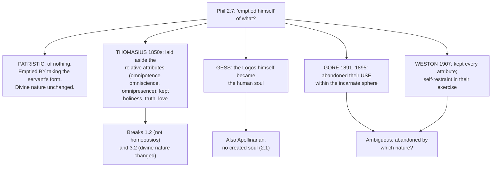

# Christology · Lesson 3.3: Kenosis

> ⏱ ~15 min · Module 3: The grammar of the union · Builds on: [3.1 Person and nature](03-01-person-and-nature-the-hypostatic-union.md), [3.2 The communication of idioms](03-02-the-communication-of-idioms.md), [1.2 True God and true man](01-02-true-god-and-true-man.md) · Unlocks: [3.4 The grace of the Head](03-04-the-grace-of-the-head.md), [4.2 Christ's human knowledge](04-02-christs-human-knowledge-the-classical-account.md)

## Why this matters

"He emptied himself" is the most quoted Christological sentence in Paul, and the most abused. Read one way, it is the whole of Chalcedon in a verb. Read another, it says the Son put down his divinity at the manger and picked it up again at Easter. The nineteenth century built a school on the second reading, and every Christmas homily that says the Word "set aside his power" repeats it in miniature. This lesson answers one question: when the Word emptied himself, what did he lay down, and what did he keep?

## The idea

Think of a king who becomes a servant in his own house. There are two ways to tell it. In the first, he abdicates: crown off, powers surrendered, and for a while he is simply not king. In the second, he stays king and *also* puts on the servant's clothes and does the servant's work. He is humbled not by losing anything but by taking something on. Nothing of his royalty is subtracted; all of the servant's lowliness is added.

The Fathers read Philippians 2 the second way. The emptying is **not a subtraction from the divine nature but the assumption of a human one**. The Word "empties himself" *by taking* the form of a servant. That is the patristic rule: [kenosis](../reference.md#kenosis) is an assuming.

The first reading is **kenoticism**: the Son really divests himself of some divine attributes to become man. It is honest about the Gospels, and it breaks the grammar of the last two lessons.

## Source

Philippians 2:6–8 (Douay–Rheims):

> Who being in the form of God, thought it not robbery to be equal with God: But emptied himself, taking the form of a servant, being made in the likeness of men, and in habit found as a man. He humbled himself, becoming obedient unto death, even to the death of the cross.

Three Greek words carry it. The translations are the lesson's own.

- ***en morphē theou hyparchōn*** — "being in the form of God." *Morphē* is the form a thing actually has, not a mask over it. *Hyparchōn* is a present participle: he *is* in that form, not merely was.
- ***harpagmos*** — Douay's "robbery." Roughly, "a thing to be grasped or used for gain." Which kind of grasping is meant is the exegetes' dispute, and it belongs to [`new-testament`](../../new-testament/syllabus.md) 4.3.
- ***heauton ekenōsen*** — "he emptied himself." The Vulgate has *exinanivit*, "made himself as nothing." Notice what is missing: the verb takes no genitive. Paul never says *what* the Son emptied himself *of*.

That silence decides the reading. The next words are ***morphēn doulou labōn***, "taking the form of a servant." On the patristic reading, that participle says *how* he emptied himself: by taking. The kenotic reading has to supply an "of" that the text does not contain.

## The argument

1. **The subject of "emptied" is the person, and the manner is an assumption.** Leo's Tome (Letter 28, ch. 3; NPNF 2.12) says it directly:

   > ... that emptying of Himself whereby the Invisible made Himself visible and, Creator and Lord of all things though He be, wished to be a mortal, was the bending down of pity, not the failing of power.

   *In words:* the emptying is condescension, a love that stoops. It is not a deficit in God.

2. **The Word stays what he was.** Augustine glosses the verse: the Son emptied himself by taking on our changeableness, not by changing his divinity (*De Trinitate* VII.3.5). Cyril's Third Letter to Nestorius makes the same point. It uses Paul's own word (*kenōsis*) and confesses in the same sentence that the Word took flesh without casting off what he was, remaining God in essence and unchangeable (Percival, NPNF 2.14). *In words:* East and West agree that the emptying adds the humanity and changes nothing in the Godhead.

3. **Chalcedon writes this into the definition.** The two natures are united "immutably," and the property of each nature is preserved (Percival). Nicaea had already anathematized anyone calling the Son changeable ([1.4](01-04-arius-and-the-divinity-of-the-son.md)). *In words:* a Son who changes as God is condemned twice over.

4. **So a real divestment breaks 1.2.** Omniscience, omnipotence and omnipresence are not the Son's personal property. They belong to the one divine nature he shares with the Father ([`trinity-and-god` 1.4](../../trinity-and-god/lessons/01-04-immutability-eternity-immensity.md)). If the Son gave them up, then for thirty-three years he would not be what the Father is. *Homoousios* would lapse, and "true God" in [1.2](01-02-true-god-and-true-man.md)'s sense would be false of him.

5. **And it breaks 3.2.** Under the [communication of idioms](../reference.md#communication-of-idioms), limitation, weakness and death are said of the Word *by reason of his humanity*. Kenoticism makes them true of him by reason of his *divinity*: the divine nature itself shrank. That is predicating a human property of the divine nature in the abstract, exactly the move [3.2](03-02-the-communication-of-idioms.md)'s premise 4 forbids.

**Mark the levels.** That the Word became man without change or loss of his divinity is **defined dogma**. It rests on Nicaea's anathema, Chalcedon's "immutably" and properties preserved, and the unchangeable God of Lateran IV and Vatican I. The patristic reading of Philippians 2 as assumption is the Fathers' consensus and the Church's constant use of the text. The *exegesis of harpagmos* is **freely disputed** among exegetes. Pius XII's *Sempiternus Rex Christus* (8 September 1951, §29) calls the kenotic doctrine a wicked invention, as much to be condemned as the Docetism opposite it. An encyclical is **authentic ordinary magisterium**, not a definition. Its judgment has force because the doctrine it defends is defined. See [the levels in Christology](../reference.md#the-levels-in-christology).

## Map of positions

The [kenotic theories](../reference.md#kenotic-christology) come in a gradient. **Gottfried Thomasius** (*Christi Person und Werk*, 1850s) split the attributes. He said the Son laid aside the "relative" ones, which concern God's relation to the world, and kept the "immanent" moral ones. **W. F. Gess** went further. As A. B. Bruce read him (reported in Percival's excursus to Constantinople I), the Logos himself *became* the human soul, so no created soul was needed. That is Apollinaris by another road ([2.1](02-01-apollinaris-a-complete-humanity.md)).

In England, **Charles Gore** (Bampton Lectures 1891; *Dissertations*, 1895) proposed a narrower abandonment. On his view, the Son gave up the use of divine powers within the sphere of the Incarnation and kept his cosmic functions outside it. **Frank Weston** (*The One Christ*, 1907) criticized Gore's language of abandonment and put self-restraint in its place: every attribute retained, their exercise limited to what the manhood could bear.

## Worked examples

**Example 1 — the clean case: "He took the form of a servant without losing the form of God."** Run it through the rule. The subject is the Word, a concrete term for the person. "Took" names a new relation whose change is entirely in the assumed nature (3.2, premise 8). "Without losing" affirms that the divine nature is untouched. True simply, and it is Augustine's canonical rule: equal to the Father in the form of God, less than the Father in the form of a servant which he took, and "by taking the form of a servant, He did not lose the form of God" (*De Trinitate* II.1.2). This is the patristic reading in one line. Every "lowly" predicate of Christ is said by reason of what he took, never by reason of what he lost.

**Example 2 — where it strains: Weston, and a hymn.** Weston is the hard case, because he denies divestment outright. Is "self-restraint" orthodox? Ask the 3.2 question: *restrained in which nature?* If the divine nature holds back its own act, then the divine nature is doing less than it did. That is a change in God, and the unchangeable God has no gears to downshift. If instead the restraint means that the *human* nature receives only what a human nature can receive, then the claim is orthodox. On that reading the classical account already says it: the finite is limited, and the infinite is not. A friendly Catholic reading of Weston takes the second option. Weston's own words often sound like the first, which is why the case strains.

The same test settles Charles Wesley's line "Emptied Himself of all but love" (1738). Taken as divestment, it supplies the missing genitive and empties the Word of every attribute except one. Taken as hyperbole for the self-gift Leo called "the bending down of pity," it is devotion saying loudly what the Tome says carefully. The words cannot settle it; the grammar they are read under does.

**Kenosis as analogy.** Twentieth-century Catholic theology uses the word freely. Balthasar (*Mysterium Paschale*) grounds the Son's earthly self-emptying in the Father's eternal, total self-gift in begetting the Son. It is a speculative, freely disputed thesis. It is not offered as a claim that the Son shed attributes at the Incarnation, though whether it fully escapes change in God is itself disputed ([6.1](06-01-he-descended-into-hell.md)). John Paul II calls understanding "God's kenosis" a prime task of theology (*Fides et Ratio*, 1998, §93). Neither usage claims the divine nature lost anything. Each uses "self-emptying" analogically, for self-gift, a love that holds nothing back. **An analogy is a doctrine only if the predicate is said properly of the divine nature.** Neither does that. Kenoticism does, and that is where it fails.

## Watch out

- **You might think "he laid aside his divine power at Bethlehem" is a devout way of honouring the humility.** It is **kenoticism**: a Son who changes as God. That lands exactly in the changeable Word Nicaea anathematized against **Arianism** ([1.4](01-04-arius-and-the-divinity-of-the-son.md)).
- **You might think the patristic reading makes the emptying unreal.** It does not. The Word really comes to hunger, to be ignorant of nothing *as God* yet to learn *as man* (4.2 asks what that learning was), and to die. What is denied is only that these come by subtraction from the Godhead. Swinging to "nothing changed at all, the humanity is a costume" is **Docetism**, which *Sempiternus Rex* names as the kenotic error's twin.
- **You might think "hidden" and "laid aside" say the same thing.** They do not. [1.2](01-02-true-god-and-true-man.md) left this for here. The divinity was *hidden* in a real humanity: its glory was not manifested in the flesh, except at moments like the Transfiguration. Hidden is true. Laid aside is false.

## One-liner

> The Word emptied himself by taking, not by losing: all the lowliness was added, none of the Godhead subtracted.

## Problems

**P1 (🟢)** *(Exegetical)* Mark each **true**, **false**, or **true only with a stated distinction**, and name the rule or text that decides it. One line each.
(a) "The Son of God emptied himself." (b) "The divine nature emptied itself." (c) "In becoming man, the Word gave up his omnipresence." (d) "The Lord of glory hid his glory."

**P2 (🟡)** *(Exegetical)* An **invented** carol verse, written for this problem:

> He laid aside his glory and his power, / and left his Godhead at the stable door; / a helpless child, no more than child that hour, / he took it up at Easter as before.

(a) Name the error, the earlier heresy it reproduces, and the text or definition that corrects it. (b) Name the true thing the writer was reaching for, and rewrite line 2 so that it says it. (c) Assign a level to the doctrine your correction relies on, naming the act that fixes it. 150 words or fewer in total.

**P3 (🔴)** *(Exegetical)* An **invented** book-review paragraph, written for this problem:

> "The old scholastic resistance to kenosis is over. Balthasar grounded it in the Trinity itself, and a pope has called God's kenosis the heart of theology. The Church now holds, in effect, that the Son really gave up his divine attributes in becoming man; *Sempiternus Rex* has quietly been superseded."

(a) Distinguish the analogical use of "kenosis" from kenotic doctrine, and say which the reviewer's two pieces of evidence are. (b) Assign levels to Pius XII's judgment, the doctrine it guards, and Balthasar's thesis, and name the reviewer's level error. Two sentences per part.

Solutions

**P1** *(Exegetical)*

**Must hit, strict:** (a) **True**: Phil 2:7. The subject is a concrete term for the person, and the emptying is his taking the servant's form. (b) **False**: an abstract term for the divine nature is given a predicate of change, which is forbidden (3.2 premise 4). The emptying is predicated of the person, and the divine nature is unchangeable (Chalcedon's "immutably"). (c) **False**: divestment. Omnipresence belongs to the divine nature, which the Son shares with the Father undiminished (Cyril's Third Letter: he remained what he was). (d) **True only with a distinction**: the divine glory was not lessened but not manifested in the flesh. It was hidden, not laid aside, as the Transfiguration shows.

**Wrong turns:** marking (a) "true only with a distinction" because it *sounds* kenotic. Scripture's own sentence is true simply, and the distinction attaches to how it is *read*. Marking (d) simply true without the distinction: "hid" could be heard as "put away." Rescuing (c) as "true as man." Omnipresence was never a property of the humanity to be given up.

**Model answer:** (a) True: Paul's subject is the person, who emptied himself by taking. (b) False: change said of the divine nature in the abstract. (c) False: kenotic divestment of a property of the nature he shares with the Father. (d) True with a distinction: glory unmanifested in the flesh, not surrendered.

---

**P2** *(Exegetical)*

**Must hit, strict (a):** **kenoticism**, a real divestment of divinity for a period. It reproduces the **Arian** changeable Son whom Nicaea anathematized. Credit also "the Word not *homoousios* while on earth" as the consequence. Corrective: Chalcedon ("immutably," properties of each nature preserved), Leo's Tome ("the bending down of pity, not the failing of power"), or Cyril's Third Letter. Credit citing *Sempiternus Rex* §29 as a text that names this error.

**Must hit, strict (b):** the true thing is the real lowliness and hiddenness of the infant: he really is a helpless child. Rewrite: something like "and veiled his Godhead in a stable poor." Hidden, not left.

**Must hit, strict (c):** **defined dogma** that the Word became man without change or loss of his divinity (Chalcedon 451; Nicaea's anathema on a changeable Son). *Sempiternus Rex* is authentic ordinary magisterium applying it, not the defining act.

**Wrong turns:** calling it Docetism. Docetism subtracts from the humanity, and this verse subtracts from the divinity. Calling it Apollinarianism (that fits Gess, not this verse). Treating the encyclical as the defining act.

---

**P3** *(Exegetical)*

**Must hit, strict (a):** the analogical use says "self-emptying" of God for total self-gift. It predicates no loss of any attribute of the divine nature. Kenotic doctrine says the Son really divested divine attributes. Both of the reviewer's exhibits (Balthasar's Trinitarian ground of kenosis; *Fides et Ratio* §93) are analogical, so they cannot support the conclusion.

**Must hit, strict (b):** *Sempiternus Rex* §29 is **authentic ordinary magisterium**. The doctrine it guards, the Word unchanged in his divinity, is **defined dogma** and cannot be "superseded" by any later usage. Balthasar's thesis is **freely disputed** theology. The reviewer's error is to treat a speculative theologian's analogy plus an encyclical's usage as though they overturned a definition. Rung 5 and a word cannot outrank rung 1.

**Wrong turns:** treating the verdict on Balthasar as settled either way. Whether his thesis introduces change in God is disputed ([6.1](06-01-he-descended-into-hell.md)), and it is not the reviewer's claim. Accepting that an encyclical *could* be quietly superseded on this point, when the point is dogma. Inventing a condemnation of Balthasar.

**Model answer:** (a) "Kenosis" said analogically names God's self-giving love and removes nothing from the divine nature. Kenoticism asserts a real loss of attributes, and both of the reviewer's exhibits are the first kind. (b) Pius XII's judgment is authentic ordinary magisterium guarding a defined dogma, that the Word became man without change, while Balthasar's thesis is freely disputed. The reviewer lets a disputed analogy overturn a definition, which no lower rung can do.

## Flashback

**From Lesson [3.1](03-01-person-and-nature-the-hypostatic-union.md) (Person and nature: the hypostatic union):** *(Exegetical.)* A catechist's worksheet (**invented** for this problem) offers four analogies for how God and man are one in Christ:

1. "Like two planks glued side by side into one shelf."
2. "Like copper and tin melted together into bronze."
3. "Like a centaur: neither horse nor man, but a new kind of creature."
4. "Like one actor wearing two masks."

For each, say **where it puts the unity** (in the nature, beside the person, or in the person), the heresy it lands in, and the conciliar phrase that excludes it. Then say which analogy puts the unity in the right place, and what it still gets wrong. **One line per analogy, one sentence for the last part.**

Solution

**Must hit, strict:**
1. **Beside the person.** Two complete things made one only by arrangement is Aquinas's juxtaposition, an accidental unity (q.2 a.1). Applied to Christ it gives two subjects: **Nestorianism**. Excluded by "one Person and one Subsistence, not parted or divided into two persons."
2. **In the nature, by mixture.** Both ingredients change into a new stuff. That is **Eutychian** confusion, excluded by "inconfusedly, unchangeably."
3. **In the nature, by composition** into a *tertium quid*, a third species. Also **Eutychian**. It abolishes both consubstantialities, since a centaur is of one nature neither with horses nor with men. Excluded by "perfect in Godhead and also perfect in manhood."
4. **In the person**, which is the right place: one actor. But masks are not what the actor is, so the natures become roles or appearances, and the humanity becomes a costume. That is **Docetism**, excluded by "truly God and truly man, of a reasonable soul and body."

**Last part:** the mask analogy locates the unity correctly in one *who*, but it makes the *whats* unreal, when each nature must be complete and real.

**Wrong turns:** calling 2 or 3 "miaphysite," when the miaphysite "one nature" means one subject, not a blend. Calling 1 harmless because the shelf is "one": an accidental unity is exactly the unity of honour or will that Ephesus rejected. Passing 4 as orthodox because it has one actor. Answering "the soul-body union" for the last part: it is not on the list, and 3.1 allows it only as an image of one *person*, never of one nature.

**Model answer:** (1) Beside the person, an accidental unity of two things: Nestorian, excluded by "not parted or divided into two persons." (2) In the nature by mixture: Eutychian, excluded by "inconfusedly, unchangeably." (3) In the nature by composition into a third kind: Eutychian, excluded by "perfect in Godhead, perfect in manhood." (4) In the person, but with unreal natures: Docetic, excluded by "truly God and truly man." Only the actor puts the unity in one *who*, and it fails because a mask is not a nature the actor really has.

## Connections

- **Backward:** [3.2](03-02-the-communication-of-idioms.md) supplies the test every kenotic sentence fails: a human property said of the divine nature in the abstract. [3.1](03-01-person-and-nature-the-hypostatic-union.md) supplies the assumption that changes the creature and not the Word. [2.1](02-01-apollinaris-a-complete-humanity.md) is where Gess's version was already condemned. [`patristics` 5.2](../../patristics/lessons/05-02-leo-the-great.md) reads the Tome as a text, and [`patristics` 5.1](../../patristics/lessons/05-01-cyril-of-alexandria.md) reads Cyril.
- **Forward:** [4.2](04-02-christs-human-knowledge-the-classical-account.md) asks the question kenoticism was trying to answer: what the human mind of Christ knew and how it grew. The answer there comes without subtracting from the Word. [6.1](06-01-he-descended-into-hell.md) meets Balthasar's kenosis again on Holy Saturday. [3.4](03-04-the-grace-of-the-head.md) turns from what was not lost to what the humanity received.
- **Sideways:** the exegesis of Philippians 2, including the readings of *harpagmos*, is [`new-testament`](../../new-testament/syllabus.md) 4.3's. The level vocabulary is [`fundamental-theology` 4.4](../../fundamental-theology/lessons/04-04-the-ladder-of-doctrinal-authority.md). The unchangeable God whose immutability the whole lesson leans on is [`trinity-and-god` 1.4](../../trinity-and-god/lessons/01-04-immutability-eternity-immensity.md).
