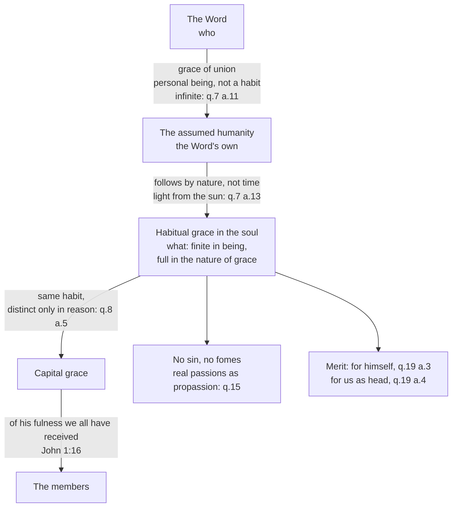

# Christology · Lesson 3.4: The grace of the Head

> ⏱ ~15 min · Module 3: The grammar of the union · Builds on: [3.1 Person and nature](03-01-person-and-nature-the-hypostatic-union.md), [3.2 The communication of idioms](03-02-the-communication-of-idioms.md), [`trinity-and-god` 6.1](../../trinity-and-god/lessons/06-01-the-missions-of-the-son-and-the-spirit.md) · Unlocks: [4.1 Christ's human will in act](04-01-christs-human-will-in-act.md), [5.3 Satisfaction](05-03-satisfaction-anselm-and-aquinas.md)

## Why this matters

If Jesus is God, what could grace possibly add to him? The question sounds pious and hides a mistake. It lets the divinity do the human soul's work for it, and that quietly subtracts from the humanity. The tradition's answer is that Christ's soul was *more* graced than any creature's, not less in need of grace. It is graced in three distinct senses, and confusing them produces the old errors in new clothes. This lesson also fixes what "sinless" and "merit" mean in him, and [5.3](05-03-satisfaction-anselm-and-aquinas.md) cannot run without that.

## The idea

A creature can be lifted up to God in two ways. The saints are lifted **by operation**: grace perfects their powers so that they know and love God. Christ's human nature is lifted in a way no saint's is, **by personal being**: it exists as the humanity *of* the Son of God. The first is a quality in the soul. The second is not a quality at all. It is the fact of *whose* nature this is.

That gives the course's two questions, *who* and *what*, a twin in the doctrine of grace:

- **The [grace of union](../reference.md#grace-of-union)** answers *who*: the human nature is the Word's own, the [hypostatic union](../reference.md#hypostatic-union) of [3.1](03-01-person-and-nature-the-hypostatic-union.md). It is called grace only because nothing earned it.
- **[Habitual grace](../reference.md#habitual-grace-of-christ)** answers *what*: a created perfection in Christ's human soul, which is not divine by essence and so must be divine by participation.
- **[Capital grace](../reference.md#capital-grace)** (from *caput*, head) is that same habitual grace considered as overflowing into others. It is one gift seen from two sides, not a third gift.

Aquinas's image: the Word's presence in the humanity is the sun, and habitual grace follows it the way light follows the sun (ST III q.7 a.13).

## Source

*Summa Theologiae* III q.2 a.10, "Whether the union of Incarnation took place by grace?" (English Dominican Province), from the *respondeo*:

> Now human nature stands in need of the gratuitous will of God in order to be lifted up to God, since this is above its natural capability. Moreover, human nature is lifted up to God in two ways: first, by operation, as the saints know and love God; secondly, by personal being, and this mode belongs exclusively to Christ, in Whom human nature is assumed so as to be in the Person of the Son of God. But it is plain that for the perfection of operation the power needs to be perfected by a habit, whereas that a nature has being in its own suppositum does not take place by means of a habit.

The last sentence decides everything. Habits perfect *powers* for *acting*. The union is not an act and not a power; it is a nature's having its being in a person. So the grace of union **cannot be a habit**, however large. The article concludes that the union is called a grace only because no merit preceded it, not because some habitual grace brought it about.

## The argument

1. **The grace of union is not habitual grace.** It is the personal being of the Word communicated to a human nature, and it is infinite, because the divine person is infinite (q.7 a.11). Aquinas marks the difference in kind exactly: personal and capital grace are ordained to an act, "but the grace of union is not ordained to an act, but to the personal being" (q.8 a.5 ad 3). *In words:* union is who he is; habitual grace is how his soul acts.
2. **Christ's soul still needs habitual grace.** The soul is not divine by essence, so it must be divine by participation, which is grace (q.7 a.1 ad 1). The humanity is an instrument of the Godhead, but a living one that acts when it is moved (ad 3). A human operation distinct from the divine one requires its own perfection. *In words:* two complete natures mean two complete sets of operations, and the human set is perfected the human way.
3. **It follows the union, by nature but not in time** (q.7 a.13). There are three reasons. The union answers to the Son's mission and habitual grace to the Spirit's, and the Son's is prior in the order of nature. Grace is caused by God's presence, as light by the sun. And grace is for acting, and acting presupposes the acting *hypostasis*. The first reason is [`trinity-and-god` 6.1](../../trinity-and-god/lessons/06-01-the-missions-of-the-son-and-the-spirit.md)'s invisible mission, now found in Christ's own soul.
4. **It is full.** As a created being it is finite, since it cannot exceed its subject. In the nature of grace it lacks nothing, and it is given as to the universal source of grace for the whole human race (q.7 a.11). Fullness *of grace itself* is proper to Christ. Mary and Stephen are "full of grace" in the other sense, with all the grace their office requires (q.7 a.10 and ad 1).
5. **Capital grace is the same habit, distinct only in reason** (q.8 a.5). A thing acts by the act it is in, as fire heats by the same heat that makes it hot. A head has order, perfection and power over the members (q.8 a.1), and John 1:14 and 1:16 map onto the second and third: "full of grace and truth"; "of his fulness we all have received" (Douay–Rheims). Christ gives grace *authoritatively* as God and *instrumentally* as man (q.8 a.1 ad 1). *In words:* what makes his soul holy is exactly what makes others holy through him.
6. **He is [sinless, and more than sinless](../reference.md#sinlessness-and-impeccability).** Chalcedon's Definition confesses him "made in all things like unto us, sin only excepted" (Percival), echoing Hebrews 4:15, where he is "tempted in all things like as we are, without sin". Constantinople II's twelfth capitulum (Percival's numbering) condemns Theodore of Mopsuestia's Christ, who was vexed by the passions of the soul and the desires of the flesh, improved by degrees, and became altogether without sin only after the resurrection ([2.4](02-04-the-three-chapters-and-constantinople-ii.md)). Beyond sinlessness comes **impeccability**: he *could not* sin. The classical ground is the *who*. A sin would be an act of the person, and the person is the Word. Aquinas adds that there was no *fomes*, no tinder of disordered desire, in Christ (q.15 a.2).
7. **His affections were real.** Christ's soul was passible, and sorrow, fear and anger were in him (q.15 a.4–9). These passions differed from ours in three ways: they never tended to the unlawful, never forestalled reason, and never dragged reason along. Aquinas takes the word **[propassion](../reference.md#propassion)** from Jerome on Matthew 26:37: Christ was sorrowful "in very deed", yet a passion is perfect "when it dominates the soul" and a propassion when it begins in the sense appetite and "goes no further" (q.15 a.4).
8. **He [merited, for himself and for us](../reference.md#merit-of-christ).** Merit is only for what one does not yet have. So he did not merit grace, knowledge, the beatitude of his soul or the Godhead, because lacking them even for a time would diminish him more than meriting them could add. He did merit the glory of his body and his outward excellence, including his exaltation (q.19 a.3, from Philippians 2:8–9). For others, his merit reaches the members because head and members make one mystical person (a.4).

**[Mark the levels](../reference.md#the-levels-in-christology).** Several points are defined dogma: the rational soul, the complete humanity, and sinlessness (Chalcedon's Definition). So is the condemnation of a Christ who grew into sinlessness (Constantinople II), and so is the one adoration of the Word *together with his flesh* (its ninth capitulum). That Christ merited our justification is taught by Trent, Session VI chapter 7, and guarded by an anathema in canon 10, so it too is **defined**. Headship is scriptural (Ephesians 1:22). The *analysis*, meaning the three graces, habitual grace following union, fullness "in the nature of grace", no *fomes*, and the list of what he merited for himself, is Thomist theology: common teaching, at most rung 4, and nowhere defined. **Impeccability** is not the direct object of any definition this lesson has found. The manuals rate it well above opinion and differ on its exact note, so do not call it defined. *Haurietis Aquas* (Pius XII, 15 May 1956) is authentic ordinary magisterium. Whether impeccability leaves room for real temptation is **freely disputed**, and it is Boss 3's question.

## Map of the three graces

## Worked examples

**Example 1: the clean case, John 1:14–16.** Sort the prologue's grace-sentences. "The Word was made flesh" is the grace of union: the event by which this humanity is the Word's, preceded by no merit (q.2 a.11). "Full of grace and truth" is habitual grace in its fullness, and Aquinas reads it so at q.8 a.1, citing q.7 a.9. "Of his fulness we all have received, and grace for grace" is capital grace, the same fullness seen as a source. Now test the incommunicable one. Can we receive the grace of union? No. It *is* being the Son by nature, and it is not ordained to any act that could be shared. What we receive is a share of the habit: some particular grace, never the fount itself (q.19 a.4 ad 2).

**Example 2: the hard case, "for which cause God also hath exalted him."** Philippians 2:9 seems to say Christ was rewarded, and Theodore read it as a man growing into dignity. Here the q.19 a.3 rule does its work. What was exalted was his *name and body*, which he could lack for a time without loss of dignity: the passible body before Easter, the unconfessed name before the cross. What he never merited is his divine sonship, which was his from the first instant (q.2 a.11 rules out any merit before the union), and the grace and vision of his soul. So the verse is true of the outward glory and false of the person. The line falls exactly where Constantinople II drew it against Theodore, who taught that Christ was made worthy of sonship through baptism and progress. The strain is honest. Aquinas has to argue that having something by merit is itself a perfection, better than having it without merit, or else Philippians 2:9 would sit oddly with fullness from conception.

## Watch out

- **You might think the grace of union is a very great habitual grace**, so that Jesus is the saint God graced most. That makes the union a matter of degree, a man indwelt more fully than the prophets, and it is **Nestorianism** by way of Theodore. The union is not on the scale of habits at all (q.2 a.10).
- **You might think God needs no grace, so Christ's soul needed none.** That lets the divinity stand in for the soul's own perfection. It is the **Apollinarian** subtraction again ([2.1](02-01-apollinaris-a-complete-humanity.md)): the *who* doing the *what*'s job.
- **You might think sinless means passionless.** That gives you a Stoic sage or a **Docetic** phantom. Aquinas answers that the Stoics called only *disordered* movements passions (q.15 a.4 ad 2). Jesus wept, was troubled, feared, and was angry. "Propassion" limits where a passion goes. It does not deny that the passion is there.
- **You might overstate the Sacred Heart.** The adoration of his heart rests on a defined principle, one adoration of the Word with his flesh, which *Haurietis Aquas* §21 invokes. The encyclical's account of the heart as symbol of a threefold love (divine; the infused love of his human will; sensible love, §§54–57) is rung 3. The revelations to Margaret Mary, it says, brought nothing new into doctrine (§97).

## One-liner

> Union makes the humanity *his*; habitual grace makes it holy; capital grace is that holiness overflowing. Sin never touched it, passion did, and merit won him only what he could lack without loss.

## Problems

**P1 (🟢) *(Exegetical.)*** Mark each sentence **true**, **false**, or **true only with a distinction**, and name the article or rule that decides it. One line each.

1. "Christ's grace of union and his habitual grace are the same gift."
2. "Christ had faith in the Father."
3. "The soul of Christ is holy by participation."
4. "Mary was full of grace as Christ was full of grace."
5. "Christ merited his exaltation."
6. "Christ merited the beatific vision of his soul."

**P2 (🟡) *(Exegetical.)*** *Summa Theologiae* III q.15 a.2 ad 3 (English Dominican Province):

> The spirit gives evidence of fortitude to some extent by resisting that concupiscence of the flesh which is opposed to it; yet a greater fortitude of spirit is shown, if by its strength the flesh is thoroughly overcome, so as to be incapable of lusting against the spirit. And hence this belonged to Christ, whose spirit reached the highest degree of fortitude. And although He suffered no internal assault on the part of the "fomes" of sin, He sustained an external assault on the part of the world and the devil, and won the crown of victory by overcoming them.

(a) The objection argued that a warrior with no enemy wins no crown. Which words concede part of it, and which reverse it? (b) Say exactly what kind of temptation this reply excludes in Christ, what kind it keeps, and at what level the reply stands. **Two sentences per part.** (Do not argue whether the result is enough for Hebrews 4:15. That is Boss 3.)

**P3 (🔴) *(Exegetical.)*** An **invented** Sacred Heart homily from an invented parish:

> "Jesus had a human heart, which means he had to grow in grace like the rest of us. Every year he got a little holier, until at the resurrection he finally became incapable of sin. That is why we adore his heart: because it is the most perfect human heart ever. And the Church defined all of this when Our Lord revealed his heart to St Margaret Mary."

Find **four** errors. For each, name the error (with the heresy, where there is one) and the text that corrects it. **150 words or fewer.**

Solutions

**P1** *(Exegetical.)*

**Must hit, strict:**
1. **False.** The grace of union is ordained to personal being, habitual grace to act. They differ in kind (q.2 a.10; q.8 a.5 ad 3). Credit for noting the reply's own nuance: habitual grace can be called grace of union "in a manner", as fitting the soul for it.
2. **False** (on the classical account). Faith is of the unseen, and Christ's soul saw. Whatever is *perfect* in faith was in him, but not faith's defect (q.7 a.3, restated at a.9 ad 1). Whether the earthly Christ had the vision is [4.3](04-03-the-beatific-vision-in-christ.md)'s disputed question, so full credit flags that the answer depends on it.
3. **True.** It is not essentially divine, so it is divine by participation, which is by grace (q.7 a.1 ad 1).
4. **True only with a distinction.** Christ has fullness on the part of grace itself. Mary has it on the part of the subject, enough for the state God chose her for (q.7 a.10 and ad 1).
5. **True only with a distinction.** He merited the exaltation of his name and the glory of his body, not his sonship or his divinity (q.19 a.3; q.2 a.11).
6. **False.** Merit concerns what is not yet possessed, and lacking beatitude would have diminished him more than meriting it would add (q.19 a.3).

**Wrong turns:** marking 3 false because "Christ is God", which confuses the *who* with the soul's *what*. Marking 5 plainly true and so drifting toward Theodore's adoptionism. Marking 4 plainly false, which ignores Luke 1:28 and the distinction that saves it.

**Model answer:** as above, one line each.

---

**P2** *(Exegetical.)*

**Must hit, strict (a):** the concession is "gives evidence of fortitude **to some extent**". Resisting concupiscence does show strength. The reversal is "a **greater** fortitude... if by its strength the flesh is thoroughly overcome, so as to be incapable of lusting against the spirit". Having no inner enemy is the higher victory, not the absence of one.

**Must hit, strict (b):** it excludes **internal** temptation arising from the *fomes*, a disordered desire of the sense appetite against reason (a.2). It keeps **external** assault "on the part of the world and the devil", which is really undergone and really overcome, so the crown is really won. **Level:** Aquinas's theology, common teaching (rung 4). The defined point beneath it is only sinlessness (Chalcedon).

**Wrong turns:** reading "no internal assault" as "no passions", when q.15 a.4 affirms real sorrow and fear. Calling the reply defined. Treating the reply as proof that Christ was not tempted at all, when "sustained an external assault" says the opposite.

**Model answer:** (a) "To some extent" grants that resisting the flesh shows strength. "A greater fortitude... incapable of lusting against the spirit" reverses the objection, because a flesh wholly subdued is the higher victory. (b) The reply excludes temptation from within, the pull of disordered desire, and keeps real assault from the world and the devil, which Christ overcame. It is Thomist theology at the level of common teaching, and only the sinlessness beneath it is defined.

---

**P3** *(Exegetical.)*

**Must hit, strict (any four):**
- **"Grow in grace... a little holier."** Christ's habitual grace was full from conception and could not increase in itself, only in its works (q.7 a.12 and ad 3). This is the **Nestorian**-adoptionist picture of a man advancing by *prokopē*, "progress".
- **"At the resurrection he finally became incapable of sin."** This is Theodore's thesis, condemned by Constantinople II's twelfth capitulum.
- **"We adore his heart because it is the most perfect human heart."** Wrong ground, and **Nestorian** in drift, since it adores a creature for its excellence. The heart is adored because it is hypostatically united to the Word: one adoration of the Word with his flesh (Constantinople II, ninth capitulum; *Haurietis Aquas* §21).
- **"The Church defined all of this... Margaret Mary."** A level error twice over. Private revelation defines nothing (*Haurietis Aquas* §97), and the encyclical is rung 3.
- Credit also: "like the rest of us" read as denying **sinlessness** (Chalcedon: "sin only excepted").

**Wrong turns:** "correcting" the first line by denying Christ a human heart or real growth, which is **Docetism** (Luke 2:52 is true of his works). Naming only the heresies without the correcting texts.

**Model answer:** One: his grace was full from conception and grew only in its effects (q.7 a.12), and "getting holier" is Theodore's adoptionist *prokopē*. Two: "incapable of sin only after the resurrection" is exactly what Constantinople II's twelfth capitulum condemns. Three: we adore the heart because it is the Word's own, one adoration with his flesh (Constantinople II, ninth capitulum; *Haurietis Aquas* §21), not as a supremely fine creature. That would be adoring a creature, in Nestorian fashion. Four: nothing here was defined by a private revelation, which adds nothing to doctrine (*Haurietis Aquas* §97), and the encyclical itself is authentic ordinary magisterium.

## Flashback

**From Lesson [3.2](03-02-the-communication-of-idioms.md) (The communication of idioms):** *(Exegetical.)* A student puts this argument (a paraphrase built for this problem, close to the first objection of ST III q.16 a.5):

1. "The Son of God was buried" is true.
2. The Son of God is God, and in God there is no distinction between God and his nature: God *is* the divine nature.
3. So "the divine nature was buried" is true.

(a) Find the crux: which step fails, and what does it wrongly assume about how the two terms work? (b) Restate what *is* true about the burial as one correct sentence that shows the subject and the "by reason of." **100 words total.**

Solution

**Must hit, strict (a):** premise 2 is true. The failure is the **step from 2 to 3**, which assumes that because person and nature are really identical in God, whatever is said of the one may be said of the other. But a **concrete** term ("the Son of God") stands for the hypostasis, and an **abstract** term ("the divine nature") signifies the nature (a.5). The hypostasis subsists in two natures and the divine nature does not, so a predicate that attaches to the person *by reason of the human nature* cannot pass to the divine nature (a.5 ad 1). Credit for Aquinas's own Trinitarian parallel in that reply: the Son is born, yet the divine nature is not born.

**Must hit, strict (b):** something like "The Son of God was buried in his flesh" or "The Son of God was buried by reason of his human nature." The subject is concrete and the qualifier sits on the predicate.

**Wrong turns:** denying premise 2 and so giving up divine simplicity to save the grammar. Denying premise 1, which is the **Nestorian** refusal to say human things of God. Answering "the divinity was buried, but only metaphorically": an abstract nature-name with the other nature's predicate is false, not figurative.

**Model answer:** (a) Premise 2 is true, but step 3 assumes that real identity licenses swapping the terms. It does not: "the Son of God" stands for the person, who subsists in two natures, while "the divine nature" signifies only one, and burial belongs to the person by reason of the other. (b) The Son of God was buried in the flesh he made his own.

## Connections

- **Backward:** [3.1](03-01-person-and-nature-the-hypostatic-union.md) introduced the grace of union, and this lesson places it against the other two graces. [`trinity-and-god` 6.1](../../trinity-and-god/lessons/06-01-the-missions-of-the-son-and-the-spirit.md) supplies the invisible mission by sanctifying grace, which q.7 a.13 finds in Christ's own soul. [`thomistic-synthesis` 2.3](../../thomistic-synthesis/lessons/02-03-participation.md) supplies "divine by participation". [2.4](02-04-the-three-chapters-and-constantinople-ii.md) holds Theodore's condemnation.
- **Forward:** [4.1](04-01-christs-human-will-in-act.md) takes the sinless human will into Gethsemane, with Maximus's denial of a gnomic will ([`patristics` 5.4](../../patristics/lessons/05-04-maximus-and-john-of-damascus.md)) as the Greek form of impeccability. [4.2](04-02-christs-human-knowledge-the-classical-account.md) and [4.3](04-03-the-beatific-vision-in-christ.md) pick up the "comprehensor" premise that q.7 a.12 and q.19 a.3 lean on. [5.3](05-03-satisfaction-anselm-and-aquinas.md) runs satisfaction through q.19 a.4's "one mystical person".
- **Sideways:** how Christ's grace and merit reach the individual belongs to [`creation-grace-last-things`](../../creation-grace-last-things/syllabus.md). The Head and his Body worked out as a doctrine of the Church belong to [`ecclesiology-and-mariology`](../../ecclesiology-and-mariology/syllabus.md), which also owns Mary's fullness of grace. Private revelation as a category is [`fundamental-theology` 1.4](../../fundamental-theology/lessons/01-04-public-and-private-revelation.md).
