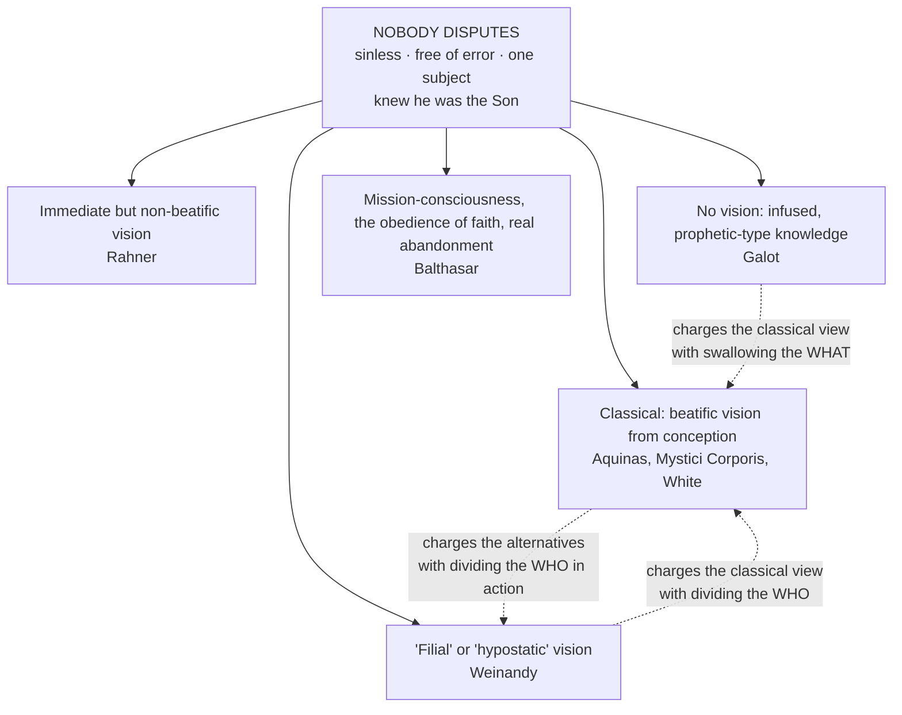

# Christology · Lesson 4.3: The beatific vision in Christ: a disputed question

> ⏱ ~15 min · Module 4: The human mind of Christ · Builds on: [4.1 Christ's human will in act](04-01-christs-human-will-in-act.md), [4.2 Christ's human knowledge: the classical account](04-02-christs-human-knowledge-the-classical-account.md), [3.4 The grace of the Head](03-04-the-grace-of-the-head.md) · Unlocks: [5.1 The Paschal Mystery and the threefold office](05-01-the-paschal-mystery-and-the-threefold-office.md), [6.1 He descended into hell](06-01-he-descended-into-hell.md), [6.4 Christology today](06-04-christology-today.md)

## Why this matters

[4.2](04-02-christs-human-knowledge-the-classical-account.md) laid out the classical account: from conception, Christ's human soul saw God as the blessed see him. It was the schools' common teaching for seven centuries; since the 1960s it has been challenged, and defended anew, by Catholic theologians in good standing. It is the one place in the course where a papal teaching is argued against in print by serious Catholic theologians, so you need two skills at once: state each side at the strength its best readers would recognize, and say exactly how much weight the Church has put behind which sentence.

## The idea

Start with what nobody in this dispute denies. Christ was **sinless**. He taught **no error**. He is **one subject**, the Word, and he knew himself to be the Son. Every position below keeps all of that. The argument is about one narrower thing: *how* Christ's human mind was immediately in touch with the Father during his earthly life.

The dispute turns on the course's two questions. Keep the [*who*](../reference.md#hypostatic-union) (one subject, the Word) and the *what* (a complete human nature, with a mind that grows). Then watch each party accuse the other of breaking one of them:

- **Critics of the vision** say it breaks the *what*. If a human mind already has heaven, its growth, faith, anguish and dereliction are only on the surface. White sums up Galot's charge as a latent monophysitism: the humanity swallowed by the glory.
- **One reviser** says the classical vision breaks the *who*. Weinandy argues that a created intellect gazing at the divine essence as an object makes a second knower standing over against God, which is Nestorian.
- **The defender** says abandoning the vision breaks the *who in action*. White argues that without immediate knowledge of the divine will, Christ's human acts could not be the Son's own acts.

Nobody here argues for an incomplete humanity or a divided Christ; each side says the other has one of those errors.

## Source

*Summa Theologiae* III q.9 a.2, "Whether Christ had the knowledge which the blessed or comprehensors have?" — the *respondeo* (English Dominican Province):

> What is in potentiality is reduced to act by what is in act; for that whereby things are heated must itself be hot. Now man is in potentiality to the knowledge of the blessed, which consists in the vision of God; and is ordained to it as to an end ... Now men are brought to this end of beatitude by the humanity of Christ, according to Hebrews 2:10 ... And hence it was necessary that the beatific knowledge, which consists in the vision of God, should belong to Christ pre-eminently, since the cause ought always to be more efficacious than the effect.

Three phrases carry the article. **"Reduced to act by what is in act"**: a cause cannot give what it does not have (the axiom of [act and potency](../../thomistic-synthesis/lessons/02-01-act-and-potency-extended.md)). **"By the humanity of Christ"**: the causal work is done by the humanity, so the vision must be in the human soul. It is not enough that the Word, as God, knows himself. **"Pre-eminently"**: Christ does not merely share in the goal he leads others to. He has it as its source. Reply 2 seals it: the union gives this man *uncreated* beatitude, but a *created* beatitude was still needed in his soul.

## The argument

**The classical case, at full strength.**

1. **The head must possess what he communicates.** This is the Source argument, and it is [capital grace](../reference.md#capital-grace) ([3.4](03-04-the-grace-of-the-head.md)) applied to knowledge. *In words:* the one who brings us to the vision of God must already have it.
2. **The revealer must see what he reveals.** In the Douay-Rheims, the Son "who is in the bosom of the Father, he hath declared him" (John 1:18), and "we testify what we have seen" (John 3:11). *In words:* testimony at first hand needs sight at first hand.
3. **The mediator's will is confirmed in the good.** This is White's argument (*The Thomist* 69, 2005; developed in *The Incarnate Lord*, 2015). [4.1](04-01-christs-human-will-in-act.md) established two wills in one agent, with the human will subject to the divine will. A will is moved by what its intellect knows. So for every human act of Jesus to express the Son's own divine will immediately, his human intellect must know that will immediately, not by inference or report. *In words:* the vision is what makes the man's actions the Son's actions, not merely actions in line with the Son.

**The modern objections, at full strength.**

4. **One cannot be both at the goal and on the way.** A [*comprehensor*](../reference.md#comprehensor-and-viator) has arrived; a *viator* is still travelling. Christ learned obedience "by the things which he suffered" (Hebrews 5:8). Aquinas grants that Christ was both (III q.15 a.10), but in different respects: the soul had arrived, while the passible body and the rest of the soul had not. His reply 1 states the principle: "there is nothing against this under a different respect." Critics answer that a journey whose only uncertainty is bodily is not a human journey.
5. **Faith and hope.** Aquinas denies Christ the theological virtue of faith, because its object is what is unseen (III q.7 a.3), and the theological virtue of hope for the same reason (a.4). Yet Hebrews 12:2 calls Jesus "the author and finisher of faith."
6. **The cry of dereliction.** "My God, my God, why hast thou forsaken me?" (Mark 15:34, quoting Psalm 21:2 in the Douay numbering). Galot's objection, as White reports it ("Le Christ terrestre et la vision," *Gregorianum* 67, 1986): a Saviour full of heavenly beatitude cannot truly say this, so the vision puts both the Incarnation and the sacrifice at risk.

**The alternatives.** **Rahner** ("Dogmatic Reflections on the Knowledge and Self-Consciousness of Christ," *Theological Investigations* 5) keeps an *immediate* vision but denies that it is *beatific*. On his account it is the soul's unthematic self-presence to the Word, at the root of consciousness. It is not a store of propositions, and it is compatible with growth and nescience. **Galot** denies the vision entirely. In its place he puts an infused, prophetic-type knowledge that gives Jesus a genuinely human, developing consciousness of being the Son. **Weinandy** ("Jesus' Filial Vision of the Father," *Pro Ecclesia* 13, 2004) proposes a "filial" or "hypostatic" vision: the Son, as man, knows his Father as a son knows, not as a creature beholding an essence. **Balthasar**, in *Mysterium Paschale* and the essay "Fides Christi," reads Christ's consciousness as consciousness of his mission. It includes the obedience and self-surrender that faith involves, and the cross is real abandonment. **White** replies that the vision is not conceptual. It is translated into Christ's teaching through infused and acquired knowledge ([4.2](04-02-christs-human-knowledge-the-classical-account.md)), so it does not compete with ordinary human knowing.

**Mark the levels.** [The levels in Christology](../reference.md#the-levels-in-christology), checked act by act ([`fundamental-theology` 4.4](../../fundamental-theology/lessons/04-04-the-ladder-of-doctrinal-authority.md)):

- **No council has defined [the vision](../reference.md#the-beatific-vision-in-christ).** Denying it is not heresy.
- ***Mystici Corporis*** (Pius XII, 1943, §75) asserts that Christ enjoyed the beatific vision from the moment of his conception. This is **authentic ordinary papal teaching (rung 3)**, and it asks religious submission.
- **The Holy Office's 1918 response** judged that the proposition doubting the vision could not safely be taught. That is a **safety judgment**, not a definition ([4.2](04-02-christs-human-knowledge-the-classical-account.md)).
- **Among theologians**, the vision is **common teaching (rung 4)**.
- **Later texts avoid the phrase.** The Catechism (§§472–474) speaks of the Son's intimate and immediate human knowledge of his Father but never says "beatific vision." The International Theological Commission's *The Consciousness of Christ Concerning Himself and His Mission* (1985) sets out four propositions that it places at the level of what the faith has always believed, and expressly declines to say how Christ's consciousness was articulated. It never uses the term. It is also a commission's study, not an act of the Magisterium.
- ***Novo Millennio Ineunte*** (John Paul II, 2001, §§25–27) holds Christ's joy in the Father and his agony together, and roots their coexistence in the depths of the hypostatic union.
- **The level is itself in dispute.** Critics read the silence of the later texts as permission to dispute. Defenders read §26 of *Novo Millennio Ineunte* and *Mystici Corporis* as continuing papal teaching. Calling the vision dogma is an error, and so is calling it a discarded opinion.

## Map of positions

## Worked examples

**Example 1: the machinery on a clean case. Did Christ have faith?** On the classical account, he did not have the theological virtue of faith, because faith is of the unseen and he saw (q.7 a.3). Two qualifications keep this from sounding cold. First, reply 2 says the merit of faith lies in obedient assent, and Christ's obedience was perfect. What faith is *for* was present in him in a higher mode. Second, Aquinas allows Christ hope for what he did not yet possess, such as the glory of his body (a.4). Hebrews 12:2 then reads naturally: Christ is the *author and finisher* of faith, its source and its completion, not a fellow believer in it. Balthasar's reading keeps the posture of faith (trust, self-surrender) and drops the classical ground for excluding it. On either reading, no one has Jesus *believing* he is the Son on someone else's testimony.

**Example 2: where it strains. The cry from the cross.** The classical answer is III q.46 a.8. The higher reason enjoyed fruition while the soul, as the form of a suffering body, grieved. There was no "overflow" from one to the other, which is the special condition of the earthly Christ. Reply 1: "nothing prevents contraries from being in the same subject, but not according to the same." John Paul II adds the Psalm. Psalm 21 moves from "why hast thou forsaken me" to "in thee have our fathers hoped," so the cry is the prayer of the Son abandoning himself to the Father, not despair (*Novo Millennio Ineunte* §26). It is a strong reply, and it strains in one place. It needs a soul divided into levels, with no traffic between them. Galot and Balthasar ask whether a grief that never reaches the summit of the soul is the total self-emptying Philippians 2 describes. The classical side answers that on their account the grief has no one who knows *whom* he is offering it to. The crux is whether beatitude in the highest part of the soul makes suffering less real, or makes it possible to offer that suffering knowingly.

## Watch out

- **"The Church has defined that Jesus saw God on earth."** That overstates the level. It rests on rung-3 papal teaching and rung-4 common teaching, and no definition exists. The mirror error is "Vatican II dropped it." No act dropped it, and John Paul II reaffirmed Christ's joy in the Father during the passion.
- **"Jesus had to find out he was God."** Every party denies this. Without a human consciousness of *who* he is, you have a man who later learns he is joined to the Word: two subjects, which is **Nestorianism**. The live question is how he knew, never whether he knew.
- **"Denying the vision is Arian."** Arius put ignorance in the *Word* ([1.4](01-04-arius-and-the-divinity-of-the-son.md)). The modern critics put limits in the *human mind* of one divine subject.
- **Vision is not an encyclopedia.** On the classical account, what the soul saw in the Word did not come as a list of propositions, and the "economic" reading of Mark 13:32 ([4.2](04-02-christs-human-knowledge-the-classical-account.md)) depends on that.

## One-liner

> Everyone keeps one knowing subject and a complete human mind; the fight is over whether heaven in that mind secures the first or smothers the second.

## Problems

**P1 (🟢)** *(Exegetical.)* Mark each sentence **true**, **false**, or **true only with a distinction**, and give in one line the act or text that decides it:

1. "The International Theological Commission's 1985 document teaches that the earthly Christ enjoyed the beatific vision."
2. "Aquinas held that Christ had the theological virtue of faith."
3. "A Catholic theologian who denies that the earthly Christ had the beatific vision is a heretic."
4. "Christ was at once *comprehensor* and *viator*."
5. "Every position in the modern dispute holds that Jesus knew he was the Son."

**P2 (🟡)** *(Exegetical.)* **Weinandy:** the classical question makes Christ's created intellect behold the divine essence as an object over against itself, which posits a second knower beside the Son. **White:** without immediate knowledge of the divine will, the man Jesus's acts are not the Son's own acts. Name the single premise about *who* is the subject of the vision that the two sides treat differently, and say what argument would move a reader on it. 120 words.

**P3 (🔴)** *(Exegetical (a) · Evaluative (b).)* An **invented** Good Friday homily, not the words of any real person:

> "On the cross Jesus lost his faith. For that dark hour he no longer knew he was the Son of God — that is what 'why hast thou forsaken me' means. The old theology said he saw God the whole time, but Vatican II quietly dropped all that."

(a) Name three errors, including the Christological error the second sentence lands in and the level error in the third. Two sentences each. (b) Does the cry of dereliction, *by itself*, refute the claim that the earthly Christ had the beatific vision? Any verdict. 150 words.

Solutions

**P1** *(Exegetical.)*

**Must hit, strict:**
1. **False.** The document places its four propositions at the level of what the faith has always believed. It expressly declines to explain how Christ's consciousness was articulated, and it never uses the term.
2. **False.** III q.7 a.3: faith is of the unseen, and Christ saw. Credit for adding that he had the perfect obedience that faith's merit consists in (ad 2), and hope for what he did not yet possess (a.4).
3. **False.** No definition exists, so denial is not heresy. The claim is asserted in *Mystici Corporis* §75 (rung 3, religious submission) and is common teaching (rung 4). Extra credit for noting that the 1918 safety judgment is not a definition.
4. **True only with a distinction.** Aquinas holds this in different respects: *comprehensor* in the beatitude proper to the soul, *viator* in his passible soul and mortal body (III q.15 a.10 and ad 1).
5. **True.** The dispute is over the *mode* of his knowledge, not the fact. The ITC's first proposition states the fact, and every author in the lesson affirms it.

**Wrong turns:** marking 3 "true" because *Mystici Corporis* is papal. That confuses rung 3 with rung 1. Marking 4 simply "true" or "false" without the "different respects," which is the whole point of the article.

**P2** *(Exegetical.)*

**Must hit, strict:** the crux is **whether a created intellect's immediate vision of God must posit a knowing subject distinct from the Son.** Weinandy says yes: to behold the essence as an object is to be a creaturely "who" facing God. White, with Aquinas, says no. The *intellect* is created, but the one who knows through it is the Son, just as the one who suffers in the flesh is the Son ([communication of idioms](../reference.md#communication-of-idioms)). What would move a reader is an account of whether knowing *through* a nature can be predicated of the person, as suffering *in* a nature is.

**Wrong turns:** making the crux "did Christ know he was the Son?" Both affirm it. Calling either side Nestorian or Monophysite as a verdict, when the problem asks for the premise.

**Model answer:** They differ on whether immediate vision in a created intellect sets up a second subject. Weinandy holds that seeing the divine essence "as object" is what creatures do, so ascribing it to Christ's mind imports a creaturely knower beside the Son. White holds that the knowing intellect is human but the knower is the Son, so no second subject arises, any more than when the Son suffers in his flesh. The question that decides it is whether the rule that lets us say "the Son suffered" also lets us say "the Son, as man, saw."

**P3** *(Exegetical (a) · Evaluative (b).)*

**Must hit, strict (a):**
- **"Lost his faith."** On the classical account he had no theological faith to lose (q.7 a.3). On Balthasar's reading, trust and self-surrender are what the cry expresses, not what it loses. Either way the sentence misdescribes both sides.
- **"No longer knew he was the Son."** Every position denies this. A human subject ignorant of being the Word is a second *who*, which is **Nestorianism**. The ITC's first proposition affirms the consciousness.
- **"Vatican II dropped it."** This is a level error. No act abandoned the teaching; it was never defined, and it remains asserted at rung 3. John Paul II (*Novo Millennio Ineunte* §26) speaks of the Son seeing and rejoicing in the Father during the passion itself.

**Must hit, any verdict (b):** state the classical reply at strength: joy in the higher reason and grief in the soul as form of the body, "not according to the same" (q.46 a.8 and ad 1), plus the Psalm-as-prayer reading. State the critic's objection at strength: a summit untouched by anguish makes the dereliction partial. Then say whether "by itself" can carry the weight, as opposed to needing a further premise about the unity of the soul.

**Wrong turns:** treating (b) as settled by the level. Rung-3 teaching does not decide an exegetical question for you, and a critic's verdict does not lower the level. Arguing the whole Boss question, whether the tradition requires the vision, instead of the narrower one asked.

**Model answer (b), one of several:** Not by itself. The cry quotes the opening of Psalm 21, which ends in trust, and Aquinas has a coherent account of joy and grief in one soul under different respects. That account is not ad hoc: the same distinction lets any martyr grieve and rejoice at once. What the cry does is force a further premise into the open. Anyone who thinks it refutes the vision must hold that genuine dereliction has to reach the summit of the soul, so that a divided soul with no traffic between its levels is not a fully human sufferer. That premise may be true, but it is doing the work, not the verse.

## Flashback

**From Lesson [4.1](04-01-christs-human-will-in-act.md) (Christ's human will in act):** *(Exegetical.)* *Summa Theologiae* III q.18 a.4 asks whether Christ had free will. The body of the article has already said that choice is the act of free will and belongs to the will as reason, which Christ has. Two objections remain: choice implies doubt, and choice needs counsel, but Christ was certain of everything. The replies (English Dominican Province):

> **Reply to Objection 1.** ... doubt is not necessary to choice, since it belongs even to God Himself to choose, according to Ephesians 1:4: "He chose us in Him before the foundation of the world," although in God there is no doubt. Yet doubt is accidental to choice when it is in an ignorant nature.
>
> **Reply to Objection 2.** Choice presupposes counsel; yet it follows counsel only as determined by judgment. For what we judge to be done, we choose, after the inquiry of counsel ... Hence if anything is judged necessary to be done, without any preceding doubt or inquiry, this suffices for choice.

(a) Reconstruct the replies as numbered premises ending in the conclusion that Christ's human will chose freely. **Four or five premises.** (b) Name the premise that someone who holds freedom means being able to do otherwise at the moment of choice must deny, and say what the article's next reply (ad 3) leaves undetermined in Christ's will. **Two sentences.**

Solution

**Must hit, strict (a):** a premise that God chooses without doubt (Ephesians 1:4), so doubt is not essential to choice and attends it only in an ignorant nature. A premise that choice follows counsel only as counsel ends in judgment, so a judgment of what is to be done suffices even without prior doubt or inquiry. A premise that Christ's human reason judged what was to be done without doubt. A premise that choice is the act of free will, in the will as reason. The conclusion must be about the **human** will.
**Must hit, strict (b):** the premise that a judgment of what is to be done *suffices* for choice. The leeway theorist says choice also needs open alternatives. Ad 3 answers that Christ's will is "determined to good" but not "to this or that good", so he chooses as the blessed do, with free will confirmed in good ([freedom confirmed in good](../reference.md#freedom-confirmed-in-good)).
**Wrong turns:** a conclusion that Christ *could have sinned*, which the argument neither needs nor gives. Reading ad 2 as "Christ had no counsel", when it says only that doubt and inquiry are not essential to counsel's outcome. Putting the choosing in the divine will: then the free obedience is not human, which is monothelitism. Calling this analysis defined. Christ's free human obedience is presupposed by Trent's teaching on his merit, but the Thomist account of choice is common teaching.
**Model answer:** (a) P1. God chooses (Ephesians 1:4), and there is no doubt in God. P2. So doubt is not essential to choice; it belongs to choice only in an ignorant nature. P3. Choice follows counsel only as counsel ends in judgment, so a judgment of what is to be done suffices for choice, even without doubt or inquiry. P4. Christ's human reason judged what was to be done, without doubt. P5. Choice is the act of free will, in the will as reason. ∴ C. Christ's human will chose, and was free, though it never deliberated in doubt. (b) The leeway theorist denies P3's "suffices", because for him freedom needs alternatives open at the moment of choice. Ad 3 leaves Christ's will undetermined as to *which* good it chooses, though never undetermined between good and evil.

## Connections

- **Backward:** [4.2](04-02-christs-human-knowledge-the-classical-account.md) gave the three knowledges and the 1918 response. This lesson puts the first of them under pressure. [4.1](04-01-christs-human-will-in-act.md) supplied the two wills in one agent that White's argument runs on. [3.4](03-04-the-grace-of-the-head.md) supplied the capital grace behind the Source's "cause more efficacious than the effect." Rahner's position rests on the transcendental Thomism of [`thomistic-synthesis` 6.4](../../thomistic-synthesis/lessons/06-04-transcendental-thomism-and-the-ressourcement-quarrel.md).
- **Forward:** [6.1](06-01-he-descended-into-hell.md) meets Balthasar's reading of abandonment again on Holy Saturday. [6.4](06-04-christology-today.md) places Rahner and Balthasar in the wider map of modern Christology. [5.1](05-01-the-paschal-mystery-and-the-threefold-office.md) needs a Christ who knows what he is offering.
- **Sideways:** the "find the crux" move in P2 is [`philosophical-method` 4.3](../../philosophical-method/lessons/04-03-finding-the-crux.md), and the whole lesson is a live instance of [the disputed question](../../philosophical-method/lessons/04-04-arguing-within-a-tradition-the-disputed-question.md) argued within a tradition. The beatific vision itself, as the goal of every human life, belongs to `creation-grace-last-things` ([syllabus](../../creation-grace-last-things/syllabus.md)).
