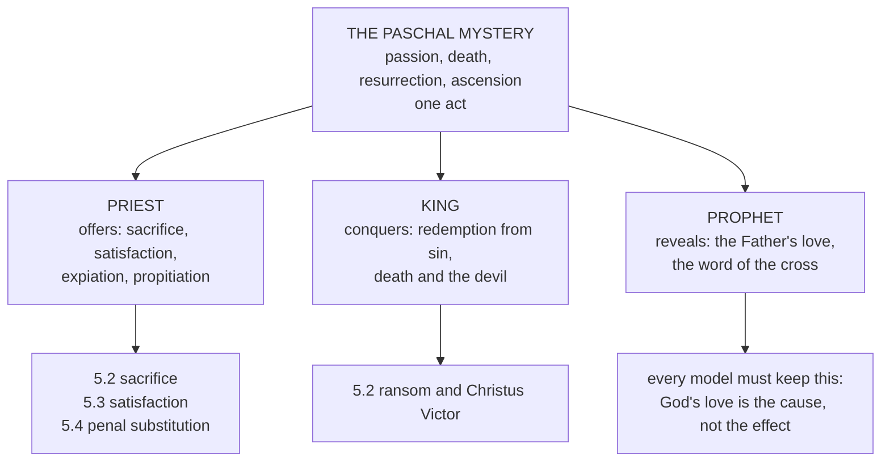

# Christology · Lesson 5.1: The Paschal Mystery and the threefold office

> ⏱ ~15 min · Module 5: The work of Christ · Builds on: [3.4 The grace of the Head](03-04-the-grace-of-the-head.md), [4.1 Christ's human will in act](04-01-christs-human-will-in-act.md) · Unlocks: [5.2 Ransom, Christus Victor, and sacrifice](05-02-ransom-christus-victor-and-sacrifice.md), [5.3 Satisfaction: Anselm and Aquinas](05-03-satisfaction-anselm-and-aquinas.md), [5.4 Penal substitution and the Catholic assessment](05-04-penal-substitution-and-the-catholic-assessment.md)

## Why this matters

Four modules answered *who* Christ is. Module 5 asks *what he did*, and the first obstacle is vocabulary. Redemption, reconciliation, expiation, propitiation, satisfaction, merit, sacrifice: preachers use them as synonyms, and each swap produces its own error — a God whose love is bought, a devil who gets paid, a Father at odds with his Son. This lesson fixes the words and the map; the next three argue about the models.

## The idea

**One event, many names.** The Church does not say Christ saved us by his death *and also* by some separate satisfaction and some further sacrifice. There is one act — the [Paschal Mystery](../reference.md#the-paschal-mystery), Christ's passover through death to life — and the words name different *aspects* of it.

First, the unit is not the death alone. *Sacrosanctum Concilium* 5 says Christ achieved the work of redemption chiefly by the paschal mystery of his passion, resurrection and ascension, and the Catechism quotes the passage to open its treatment of the liturgy (CCC 1067) and puts the cross and Resurrection together at the centre of the Good News (CCC 571). Paul had already joined them: "delivered up for our sins, and rose again for our justification" (Romans 4:25). A soteriology that finishes on Good Friday has cut the event in half.

Second, each word has a **direction** — what it acts on. Sin is removed; God is honoured; we are freed; the enmity is ended. Most confusions in this module are a word pointed the wrong way.

## Source

*Summa Theologiae* III q.48 a.6 ad 3 (English Dominican Province). Question 48 has asked in five articles whether the Passion saves by merit, satisfaction, sacrifice, redemption and efficiently. Here Aquinas fits the five together:

> Christ's Passion, according as it is compared with His Godhead, operates in an efficient manner: but in so far as it is compared with the will of Christ's soul it acts in a meritorious manner: considered as being within Christ's very flesh, it acts by way of satisfaction, inasmuch as we are liberated by it from the debt of punishment; while inasmuch as we are freed from the servitude of guilt, it acts by way of redemption: but in so far as we are reconciled with God it acts by way of sacrifice.

Read the grammar, not just the list. Every clause has the same form: *in so far as it is compared with X, it acts as Y.* There is one subject, "Christ's Passion", and five reduplicative clauses. That is the course's method from [3.2](03-02-the-communication-of-idioms.md) applied to an act instead of a person: the "in so far as" picks out an aspect without multiplying the thing.

Three words decide it. **Godhead**: the Passion saves *efficiently* only because the humanity is the instrument of the divinity (q.48 a.6) — a mere man's death, however holy, would merit but not cause grace. **Will of Christ's soul**: merit belongs to the human will, which is why [4.1](04-01-christs-human-will-in-act.md) had to secure a real human will first. **Reconciled**: sacrifice is paired with reconciliation, not with punishment. (In a.2 the translators render *satisfactio* as "atonement".)

## The argument

**1. The vocabulary, kept apart.** See [the vocabulary of redemption](../reference.md#the-vocabulary-of-redemption).

| Word | What it says | Acts on | Anchor | Confused, it yields |
|---|---|---|---|---|
| Redemption | buying back out of bondage — to sin and to the debt of punishment (q.48 a.4) | us | 1 Peter 1:18–19 | a transaction with a payee; "paid to whom?" is 5.2's question |
| Reconciliation | the enmity ended, the relation restored | the relation; God is the agent | 2 Corinthians 5:18–20 | a God who changes his mind |
| Expiation | sin removed or covered | sin | Hebrews 9:26 | fused with propitiation: see the next row |
| Propitiation | God rendered favourable | God | Romans 3:25; 1 John 2:2 | fused with expiation: a love that is purchased |
| Satisfaction | making good an offence by offering what the offended loves more than he hated the offence (q.48 a.2) | God's honour and justice | Trent, Session VI ch. 7 | satisfaction read as punishment (5.3, 5.4) |
| Merit | a free act of charity that earns its reward — for Christ and, as Head, for his members (q.48 a.1) | the members through the Head | Trent, Session VI canon 10 | a sum transferred to us with no union with him |
| Sacrifice | an offering to God as homage, in love (q.48 a.3) | God | Ephesians 5:2 | the executioners made priests (a.3 ad 3 denies it) |

In words: seven lenses on one act, each with its own object.

**2. Reconciliation runs one way in Paul.** The Douay–Rheims:

> But all things are of God, who hath reconciled us to himself by Christ ... For God indeed was in Christ, reconciling the world to himself, not imputing to them their sins. (2 Corinthians 5:18–19)

God is the subject; the world is the object; the next verse is the appeal, "be reconciled to God." In words: God does the reconciling; *we* are the ones reconciled.

**3. [Expiation and propitiation](../reference.md#expiation-and-propitiation).** The Greek *hilastērion* (Romans 3:25) — in this lesson's translation, "place or means of atonement" — is the Septuagint's word for the lid of the ark, which the Douay renders "propitiatory" at Hebrews 9:5. C. H. Dodd (*The Bible and the Greeks*, 1935) argued that in the Septuagint this word-family, with God as its subject, means cleansing sin, not placating God, so "expiation" is the right English. Leon Morris (*The Apostolic Preaching of the Cross*, 1955) replied that the ordinary sense of averting wrath survives, and that Romans 1:18's "wrath of God" is the context 3:25 answers. At 1 John 4:10 the Douay says "propitiation" and the Catechism's English "expiation" (CCC 604). The exegesis is [`new-testament`](../../new-testament/syllabus.md) 5.2's; the doctrine does not wait on it, because Romans 3:25 itself makes God the one who "hath proposed" the propitiation. God provides it; it is not offered to change him.

**4. [The threefold office](../reference.md#the-threefold-office).** "Christ" means "anointed" (CCC 436), and Israel anointed kings, priests and, occasionally, prophets. Eusebius drew the conclusion early in the fourth century (*Church History* I.3.8, McGiffert's translation):

> the true Christ, the divinely inspired and heavenly Word, who is the only high priest of all, and the only King of every creature, and the Father's only supreme prophet of prophets.

Aquinas used a different three, joining lawgiver to priest and king: in others these graces are distributed, "but all these concur in Christ, as the fount of all grace" (III q.22 a.1 ad 3). Calvin made the scheme systematic, devoting *Institutes* II.15 to Christ's offices of Prophet, King and Priest. Vatican II built on it: the people of God shares Christ's priestly and prophetic office (*Lumen Gentium* 10, 12), and the laity share his priestly, prophetic and kingly functions (31, 34–36). The Catechism states it plainly (CCC 783).

In words: one person holds all three offices, and his people share them.

**5. The offices are the person's, exercised in the humanity.** Eusebius names the right *who*: the Word. The *what* has to be added: Christ is mediator **as man** (III q.26 a.2), because a mediator must stand between the parties, and as God the Son stands on one side only. So "the Word is our high priest" is true; "the divinity offered sacrifice" is false.

**6. The hand-off.** How Christ's merit reaches a given person belongs to `creation-grace-last-things` ([syllabus](../../creation-grace-last-things/syllabus.md)); the debt logic to [`theology-of-debt`](../../theology-of-debt/syllabus.md); the Mass to `sacraments-and-liturgy` ([syllabus](../../sacraments-and-liturgy/syllabus.md)).

**Mark the levels.** ([The levels in Christology](../reference.md#the-levels-in-christology); ladder from [`fundamental-theology` 4.4](../../fundamental-theology/lessons/04-04-the-ladder-of-doctrinal-authority.md).) **Defined:** that original sin is taken away only by the merit of the one mediator, who "reconciled us to God in his own blood" (Trent, Session V, decree on original sin, third canon), and that we are justified by the justice by which Christ merited our justification (Session VI, canon 10). **Taught by Trent** in a doctrinal chapter: that Christ made satisfaction for us to the Father (Session VI ch. 7), and Session VI ch. 2 calls him "propitiator". **Not defined:** any *model* of how the cross saves. The fact is dogma; no mechanism is — see [models of redemption](../reference.md#models-of-redemption) and [satisfaction](../reference.md#satisfaction), which remains one model among others. **The threefold office** is scriptural in its titles and taught in authentic magisterium (Vatican II, the Catechism) as an organizing scheme; it is not defined, and nothing binds you to exactly three.

## The map

A rough map, not a doctrine: each office gathers several words and points to the lesson that argues about them.

## Worked examples

**Example 1 — the machinery on a clean case: Good Friday under three offices.** Priest: he "delivered himself for us, an oblation and a sacrifice to God" (Ephesians 5:2); the offerer is Christ, not the soldiers (q.48 a.3 ad 3). King: the title over the cross (John 19:19), and Christ's kingship coming through obedience unto death and exaltation (*Lumen Gentium* 36, paraphrased). Prophet: the cross is the word that shows what God is like — "the word of the cross" (1 Corinthians 1:18). One act, three offices: aspects, not shifts.

**Example 2 — where it strains: "God was reconciled to us by the cross."** Paul says the opposite direction (point 2). But Aquinas himself writes that the Passion prevailed more in "reconciling God to the whole human race" than in provoking him (q.49 a.4 ad 3), and says sacrifice appeases God. Is he contradicting Paul? No: he tells you how to read him one reply earlier. Christ is not said to reconcile us with God as though God had started loving us anew, since God's love is everlasting (Jeremiah 31:3). What the Passion removes is the *cause* of hostility, sin, by washing it away and by offering something more pleasing than the offence was displeasing (q.49 a.4 ad 2). So the change is entirely on our side, and "God was appeased" names a real change *in the relation* read from God's end. It is the same asymmetry as "God became Lord" in [`thomistic-synthesis` 4.3](../../thomistic-synthesis/lessons/04-03-the-names-of-god.md): real in the creature, of reason in God.

Verdict: **true only with a distinction.** True if it means sin, the obstacle, was removed and the relation restored. False if it means God's attitude changed or the cross caused his love: 1 John 4:10 puts love first.

## Watch out

- **You might think propitiation means the Son changed the Father's mind.** That makes God's love the effect of the cross instead of its cause, and God's will changeable, against his defined unchangeableness ([`trinity-and-god` 1.5](../../trinity-and-god/lessons/01-05-impassibility-and-the-god-who-suffers.md)). A Son who wins over a reluctant Father also splits the one divine will, against [the undivided outward works](../../trinity-and-god/lessons/04-05-common-proper-appropriated.md): **tritheism** in narrative form.
- **You might think "the divine nature paid the price" is just a pious way of saying "God paid the price."** The second is true under a concrete term: the Church "which he hath purchased with his own blood" (Acts 20:28). The first is false, because paying the price belongs immediately to Christ **as man**, and to the Trinity only as first cause (q.48 a.5). Make the divine nature the one that bleeds and pays and you have fused the natures, the error of **Eutychianism**.
- **You might think the resurrection is only the proof and the cross the payment.** The Paschal Mystery is one saving event (Romans 4:25; SC 5).
- **You might think the threefold office is a dogma with three compartments.** It is an organizing scheme, and one act can exercise all three.

## One-liner

> One Paschal act, many names: each word has an object, and not one of them makes God begin to love us.

## Problems

**P1 (🟢)** *(Exegetical)* Four Gospel scenes (Douay–Rheims). For each, name the office or offices it shows and quote the words that decide it, in one line each: **(i)** the end of the Sermon on the Mount — "he was teaching them as one having power, and not as the scribes and Pharisees" (Matthew 7:29); **(ii)** the entry into Jerusalem — "Behold thy king cometh to thee, meek, and sitting upon an ass" (Matthew 21:5); **(iii)** the prayer of the Last Supper — "for them do I sanctify myself, that they also may be sanctified in truth" (John 17:19); **(iv)** the cleansing of the Temple — "make not the house of my Father a house of traffic" and "Destroy this temple, and in three days I will raise it up" (John 2:16, 19). Then one sentence: what does (iv) show about the offices? **100 words total.**

**P2 (🟡)** *(Exegetical)* An **invented** catechist's handout for a Lenten adult-education evening, written for this problem and not the words of any real person:

> **What happened on the cross?** (1) *Expiation* and *propitiation* are two words for the same thing: God's anger was calmed. (2) On Good Friday the Father, who had been angry with the world, was reconciled to it — the cross changed his mind, and he could love us again. (3) So the work of redemption was finished at three o'clock on Friday; Easter is the proof that it worked.

For each numbered sentence: name what is wrong, cite the text that corrects it, and say in one clause what true thing the author was reaching for. **150 words total.**

**P3 (🔴)** *(Exegetical)* Assign a level to each claim and **name the act that fixes it**, one line each: **(a)** we are reconciled to God by the merit of Christ in his blood; **(b)** Christ made satisfaction for us to the Father; **(c)** Christ's work is rightly summarized as exactly three offices, priest, prophet and king; **(d)** satisfaction is the Church's defined account of how the cross saves.

Solutions

**P1** *(Exegetical)*

**Must hit, strict:** **(i) Prophet.** Deciding words: "as one having power, and not as the scribes." He teaches in his own name, not by citing authorities. **(ii) King.** "Behold thy king," fulfilling Zechariah 9:9. The deciding word is "meek": a king without an army, which is Eusebius's own point that he was not raised to a kingdom by military guards (*Church History* I.3.11). **(iii) Priest.** "Sanctify myself": he consecrates himself as the offering, so that others may be sanctified. The offerer and the offering are the same. **(iv) All three.** The act against the Temple trade is a prophet's sign; "my Father's house" claims a Son's authority over the Temple; and "this temple" is his body, destroyed and raised (John 2:21), which is the priestly offering and the Paschal Mystery in one sentence. **The sentence:** the offices are aspects of one person's acts, not separate compartments, and one act can exercise all three.

**Wrong turns:** forcing (iv) into a single office. Reading (ii) as a claim to political rule, when "meek" and the ass are the text's own correction. Calling (iii) prophetic because it is spoken: the verb *sanctify* decides it.

**P2** *(Exegetical)*

**Must hit, strict (1):** the two words have different objects: expiation acts on **sin** (it is removed), propitiation on **God** (he is rendered favourable). Fusing them turns every text about cleansing sin into a text about calming God. Corrector: the vocabulary table, and Romans 3:25, where God himself "hath proposed" the propitiation. Reaching for: Scripture does speak of wrath and of propitiation (1 John 2:2).

**Must hit, strict (2):** reverses the **direction** of 2 Corinthians 5:18–19 (God reconciling the world to himself, "be reconciled to God"). It makes God's love the effect of the cross, not its cause (1 John 4:10; q.49 a.4 ad 2). It makes God mutable, and it sets the Father's will against the Son's. Reaching for: something really changed, namely sin, the cause of the enmity, was taken away, and Aquinas can even say God was "appeased" in that sense.

**Must hit, strict (3):** cuts the **Paschal Mystery** in half. Romans 4:25 ("rose again for our justification") and *Sacrosanctum Concilium* 5 (passion, resurrection and ascension) make Easter part of the saving act. Reaching for: the cross is the decisive offering ("It is consummated").

**Wrong turns:** calling sentence 2 simply "penal substitution." It is a confusion that some accounts of it avoid, and 5.4 states that doctrine from its own confessions. Correcting (1) by denying that "propitiation" is a legitimate word, when the Douay uses it and Trent calls Christ "propitiator" (Session VI ch. 2).

**Model answer:** (1) Expiation acts on sin, propitiation on God. Fusing them makes every text about removing sin a text about calming God, yet in Romans 3:25 God himself provides the propitiation. The author was reaching for the fact that Scripture does name wrath and propitiation. (2) The sentence reverses 2 Corinthians 5:19: God reconciles the world to himself. His love is the cause of the cross, not its effect (1 John 4:10; q.49 a.4 ad 2). A God who changes his mind, won over by the Son, is mutable and divided in will. What was reaching for truth: sin, the cause of the enmity, really was removed. (3) Romans 4:25 and *Sacrosanctum Concilium* 5 make the resurrection part of the saving act, not proof of it. The author rightly saw the cross as the decisive offering.

**P3** *(Exegetical)*

**Must hit, strict:** **(a) Defined.** Trent, Session V, decree on original sin, third canon: original sin is taken away only by the merit of the one mediator, "who hath reconciled us to God in his own blood". The Creed's "for us" and "for our salvation" confess the same fact. **(b) Not open: taught by an ecumenical council.** Trent, Session VI ch. 7, as part of its doctrine of justification. Credit "*de fide*" or "taught by Trent, not open to denial". What fails is "freely disputed": that label belongs to whether satisfaction was *necessary* (5.3). **(c) A theological scheme adopted in authentic magisterium.** Vatican II (*Lumen Gentium* 10–12, 31, 34–36) and the Catechism use it, but no act proposes it definitively. "Exactly three" is not taught, and Aquinas's own triad in III q.22 a.1 ad 3 differs. **(d) False as stated, an overstatement.** No model of redemption has been defined. The fact is dogma; the mechanism is not.

**Wrong turns:** promoting (b) or (d) to "the Church's definition of the atonement". Demoting (a) to common teaching because it appears in a canon on original sin rather than a decree "on redemption". Treating (c) as either dogma or mere private opinion.

## Flashback

**From Lesson [4.2](04-02-christs-human-knowledge-the-classical-account.md) (Christ's human knowledge: the classical account):** *(Exegetical.)* On Aquinas's account in ST III qq.9–12, mark each sentence **true**, **false**, or **true only with a distinction**, and name the article or rule that decides it. **One line each.**

1. "Christ's human soul comprehended the divine essence."
2. "In the Word, Christ's soul knew everything God could make."
3. "Christ's infused knowledge grew as he got older."
4. "The divine knowledge served as the knowing act of Christ's human soul."
5. "The Word learned things."

Solution

**Must hit, strict:**
1. **False.** The soul *sees* the divine essence but does not *comprehend* it, because a finite mind cannot exhaust the infinite (q.10 a.1).
2. **False.** In the Word it knows every actual thing, past, present and future, but not everything God *could* do (q.10 a.2).
3. **True only with a distinction.** It advanced *in effect*, as he showed more of what he had, but not *in essence*, because it was given whole from the start. Only the acquired knowledge grew in essence (q.12 a.2).
4. **False.** God's understanding is his substance, so it cannot be the act of a created soul. Using it that way leaves the human intellect idle, which is **Apollinarianism** for the intellect (q.9 a.1 ad 1).
5. **True only with a distinction.** True of the Word *as man*: the one subject learned through his acquired knowledge (q.12 a.2), and concrete terms name the person ([3.2](03-02-the-communication-of-idioms.md)). False of the Word as God, who made all things and is ignorant of none.

**Wrong turns:** marking 5 simply false because "God cannot learn". That hands the learning to a second subject, which is **Nestorianism** (Gregory: whoever is not a Nestorian cannot be an Agnoete). Marking 3 simply false, which throws away the growth in effect that Aquinas grants to all three knowledges. Marking 2 true by confusing "all actual things" with "all possible things".

**Model answer:** 1 F, sees without comprehending (q.10 a.1). 2 F, all actual things but not all possibles (q.10 a.2). 3 Distinction: in effect yes, in essence no (q.12 a.2). 4 F, God's knowing is his essence and cannot be a soul's act (q.9 a.1 ad 1). 5 Distinction: true of the Word as man, false of the Word as God.

## Connections

- **Backward:** [3.4](03-04-the-grace-of-the-head.md) gave Christ the capital grace that lets his merit be his members' (q.48 a.1). [4.1](04-01-christs-human-will-in-act.md) secured the human will whose charity is the merit and the sacrifice. [3.2](03-02-the-communication-of-idioms.md) supplied the reduplication the Source runs on.
- **Forward:** [5.2](05-02-ransom-christus-victor-and-sacrifice.md) takes redemption and sacrifice and asks "paid to whom?". [5.3](05-03-satisfaction-anselm-and-aquinas.md) takes satisfaction. [5.4](05-04-penal-substitution-and-the-catholic-assessment.md) asks whether the Reformed account points propitiation the wrong way. [6.2](06-02-resurrection-and-ascension-as-doctrine.md) completes the Paschal Mystery with the resurrection and ascension as doctrine.
- **Sideways:** the reconciliation asymmetry is [`thomistic-synthesis` 4.3](../../thomistic-synthesis/lessons/04-03-the-names-of-god.md)'s relation of reason and [`trinity-and-god` 6.1](../../trinity-and-god/lessons/06-01-the-missions-of-the-son-and-the-spirit.md)'s "nothing new in God, everything new in the creature" applied to the cross. The faithful's share in the three offices goes on to `ecclesiology-and-mariology` ([syllabus](../../ecclesiology-and-mariology/syllabus.md)) and, for the priesthood, to `sacraments-and-liturgy`.
