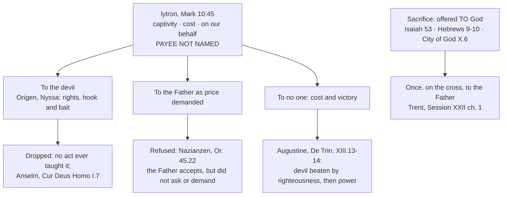

# Christology · Lesson 5.2: Ransom, Christus Victor, and sacrifice

> ⏱ ~15 min · Module 5: The work of Christ · Builds on: [5.1 The Paschal Mystery and the threefold office](05-01-the-paschal-mystery-and-the-threefold-office.md), [`patristics` 3.3 The two Gregories](../../patristics/lessons/03-03-the-two-gregories.md) · Unlocks: [5.3 Satisfaction: Anselm and Aquinas](05-03-satisfaction-anselm-and-aquinas.md)

## Why this matters

[5.1](05-01-the-paschal-mystery-and-the-threefold-office.md) set out the vocabulary. This lesson reads the two oldest pictures the vocabulary grew from: Christ as the **price** that frees captives, and Christ as the **victim** offered to God. Both come from the New Testament and both run through the Fathers. One of them also gave the Church its most embarrassing piece of theology, a deal struck with the devil. Knowing why the tradition kept the ransom and dropped the deal is the skill 5.3 and 5.4 depend on. The skill is to ask of every model of redemption what it *explains*, and which questions it was never built to answer.

## The idea

A metaphor carries some of its logic across and leaves the rest behind. "She paid dearly for that decision" tells you the cost was real. It does not invite you to ask who got the money.

The Gospel's word is *lytron*. Mark 10:45 (Douay–Rheims):

> For the Son of man also is not come to be ministered unto, but to minister, and to give his life a redemption for many.

*Lytron* (lesson's gloss: **the price of release**) was the ordinary word for the money that freed a prisoner of war or a slave. "For many" renders *anti pollōn*, "in place of many". The same word returns in 1 Timothy 2:6, where he "gave himself a redemption for all". The picture is exact about three things. We were held captive. Our release cost something. The cost was his life, given on our behalf. It says nothing about a fourth thing, the thing every ransom in real life has: **the one who receives the money.** The New Testament never names a payee, not once.

So one question sorts every early reading of the cross: **[paid to whom?](../reference.md#ransom)** There are only three answers, to the captor, to God, or to no one, and the Fathers tried all three.

## Source

Gregory of Nyssa, *The Great Catechism* (the *Catechetical Oration*), chs. 24 and 26 in the NPNF numbering; NPNF second series, vol. 5 (Moore and Wilson):

> ... therefore, in order to secure that the ransom in our behalf might be easily accepted by him who required it, the Deity was hidden under the veil of our nature, that so, as with ravenous fish, the hook of the Deity might be gulped down along with the bait of flesh, and thus, life being introduced into the house of death, and light shining in darkness, that which is diametrically opposed to light and life might vanish ...
>
> He who first deceived man by the bait of sensual pleasure is himself deceived by the presentment of the human form.

Here is the whole [devil's-rights](../reference.md#the-devils-rights) theory in two sentences. Look first at **"him who required it."** The payee is the devil, and chapter 22 has already said why he is owed something. We *sold* ourselves into his power through sin. A just God does not seize legally purchased slaves by force, and paying the owner is the one lawful way to free them. Next, **"hook" and "bait."** The devil sees a man more wonderful than any before him and takes him as a better prize than the captives he holds (ch. 23). He swallows the flesh and is caught on the Godhead hidden inside it. Last, **"deceived."** Nyssa knows how bad this sounds and faces it himself (ch. 26). The deceiver is justly deceived, he argues, and the purpose is healing, even of the deceiver.

Give the image its due. It keeps God's justice in view even toward an enemy. It explains why the Godhead came hidden in flesh. It makes the Resurrection the moment the trap springs. Its cost is just as plain. The devil holds rights against God, and God wins by a trick.

## The argument

The tradition's handling of the three answers, in order:

1. **To the captor: the devil's rights.** Origen is usually named as the source (the NPNF editor names him, with Ambrose), and Nyssa is its most careful defender. *In words:* sin gave the devil a real legal claim, and God paid it off in a currency the devil could not keep.
2. **To God: refused.** Gregory of Nazianzus, *Oration* 45.22, puts the question outright: to whom was the blood offered? Paying the devil is an outrage. If the payee is the Father, Gregory asks how, since it was not the Father who held us, and why a Father who would not accept even Isaac's blood would want his own Son's. His answer is that the Father **accepts** the offering but neither asked for it nor demanded it. *In words:* the language of cost is kept, and both payees are sent away.
3. **To no one, and the devil beaten fairly.** Augustine keeps something of the devil's hold. By God's justice "in some sense" the race was handed over to him (*De Trinitate* XIII.12.16, Haddan). But he moves the victory from a trade to a verdict. The devil was to be conquered "not by power, but by righteousness" (XIII.13.17). He killed a man in whom he found nothing worthy of death, and by killing the innocent he lost his hold on the guilty (XIII.14.18). *In words:* the devil is not paid. He overreaches, and justice goes against him. Only then does power act, in the Resurrection.
4. **Anselm closes the file.** *Cur Deus Homo* I.7 argues that the devil had no justice on his side against man at all. That clears the ground for satisfaction offered to God ([5.3](05-03-satisfaction-anselm-and-aquinas.md)).
5. **Meanwhile, sacrifice.** A sacrifice has an addressee, and the addressee is God. Isaiah 53 gives the Servant who "was offered because it was his own will" and on whom "the Lord hath laid ... the iniquity of us all" (53:6–7). Hebrews argues from the failure of repeated offerings to one offering that finishes: "once" (9:12, 26–28), "one sacrifice for sins" (10:12). *In words:* sacrifice answers "to whom?" directly, to God. It does not have to answer "who was owed?"

Augustine's definition keeps sacrifice from turning into payment (*City of God* X.6, Dods):

> Thus a true sacrifice is every work which is done that we may be united to God in holy fellowship ...

On this definition a sacrifice aims at *union*, not compensation. The chapter ends where Hebrews does. Christ offered himself in the form of a servant, so he is at once priest and victim, and the whole redeemed city is offered with him. The exegesis of Isaiah 53 and Hebrews belongs to [`new-testament`](../../new-testament/syllabus.md) 6.2. The one sacrifice made present in the Mass belongs to `sacraments-and-liturgy` ([syllabus](../../sacraments-and-liturgy/syllabus.md)). This lesson needs only the claim that the offering is one and is made to God.

**Mark the levels** ([ladder](../../fundamental-theology/lessons/04-04-the-ladder-of-doctrinal-authority.md); [the levels here](../reference.md#the-levels-in-christology)). That Christ redeemed us by his death is of faith, confessed in the Creed, which says he was crucified "for us". That he offered himself once on the cross to God the Father is taught by Trent (Session XXII, ch. 1) as the premise of its decree on the Mass, and it is the plain claim of Hebrews. That his death defeats the devil, sin and death is scriptural (Hebrews 2:14–15; Colossians 2:15) and belongs to the faith as a *fact*. The **devil's rights** and a ransom **paid to the devil** were theological opinions held by orthodox Fathers, never taught by any magisterial act, and dropped by the tradition. Treating them as doctrine is overstatement, and so is calling Nyssa a heretic for holding them. **No model is defined as *the* model** ([syllabus](../syllabus.md), Authority discipline (3)).

## Map of positions

## Worked examples

**Example 1: the machinery on a clean case, Aulén.** Gustaf Aulén's Uppsala lectures of 1930 became *Christus Victor* in A. G. Hebert's English translation (1931). Aulén sorted atonement theories into three types. The **"classic"** type is a divine drama: God in Christ fights the tyrants, sin, death and the devil, and wins. The **"Latin"** type is an offering made by Christ as man to God, the Anselmian line. The **"subjective"** type is a change worked in us by the example of love. His thesis was historical. The classic type was the Fathers' main view, the Latin a medieval deviation from it, and Luther a recovery of it. Now ask the lesson's question. [*Christus Victor*](../reference.md#christus-victor) answers "paid to whom?" by declining it. Nobody is paid, the tyrant is beaten, and God is the agent from start to finish. What it explains is real. It fits Hebrews 2:14–15 and Colossians 2:15, the Easter liturgy, and the joy of the Fathers' paschal preaching. What it leaves open is why a *death* is how the battle is won. Nyssa's hook and Augustine's verdict were two attempts to answer that. Drop both and the victory comes with no account of how it was won.

**Example 2: where it strains, Aulén's history.** His critics, including many who gladly took up the motif, say the historical thesis flattens the evidence. Read *Oration* 45.22 again and you find blood, High Priest, Sacrifice, ransom, tyrant, and the Father who accepts, all in one paragraph. The Fathers did not choose among "types". They piled images up. The critics make three charges. Aulén set Anselm's honour-and-satisfaction scheme against a patristic tradition that already spoke of offering to God. He read the Latin tradition as colder and more legal than its texts are. His picture of Luther is contested. So there are two claims to keep apart. *Christus Victor* as a biblical and patristic **motif** is sound and belongs in any Catholic account. *Christus Victor* as the thesis that **it was the Fathers' model and the others are later distortions** is a historian's claim, and a weak one. The Church has settled neither.

## Watch out

- **You might think "ransom" requires a payee.** Push the metaphor that far and you have two choices, and both are bad. If the devil is paid, he becomes a rival party with rights against God, a **practical dualism** of two powers bargaining. If the Father is paid, you have a God who has to be bought off, and Nazianzen's Isaac objection lands. The fix is to hold the metaphor to what it asserts: captivity, cost, on our behalf.
- **You might think the Fathers taught one theory.** They did not. The same sermon ransoms, sacrifices and conquers. Reading any one Father as "the ransom theorist" repeats Aulén's error in miniature.
- **You might think "sacrifice" means God needed a death.** The addressee of a sacrifice is God. Its *point*, on Augustine's definition, is union. "Offered to the Father" does not mean "demanded by the Father", and that distinction becomes the whole battleground of [5.4](05-04-penal-substitution-and-the-catholic-assessment.md).

## One-liner

> The New Testament names the captivity, the price and the victim, and never the payee. The Fathers who supplied one had to be corrected, and those who left the blank, like Nazianzen, did not.

## Problems

**P1 (🟢)** *(Exegetical)* Mark each sentence **true**, **false**, or **true only with a distinction**, and give in one line the text or rule that decides it.

1. "Christ gave his life as a ransom for many."
2. "The ransom was paid to the devil, who held a just claim on us."
3. "Christ offered himself to the Father as a sacrifice."
4. "At the cross the devil was defeated by God's power."
5. "The Father demanded the Son's blood as the price of our release."

**P2 (🟡)** *(Exegetical)* An **invented** verse, written for this problem and not taken from any real hymnal:

> Our captor held a rightful deed
> And named the price that he would need;
> So heaven paid it, blood for blood,
> And Satan took the Son of God.

(a) Name the two claims the verse makes that the tradition dropped, and cite one Father or Anselm against each. (b) Name what the verse leaves out that every patristic version, Nyssa's included, insisted on. (c) In one sentence, say what true thing the author was reaching for, with a New Testament text. **Two sentences per part.**

**P3 (🔴)** *(Exegetical)* Gregory of Nazianzus, *Oration* 45.22 (NPNF second series, vol. 7, Browne and Swallow):

> We were detained in bondage by the Evil One, sold under sin. Now, since a ransom belongs only to him who holds in bondage, I ask to whom was this offered, and for what cause? If to the Evil One, fie upon the outrage! ... But if to the Father, I ask first, how? For it was not by Him that we were being oppressed; and next, On what principle did the Blood of His Only begotten Son delight the Father, Who would not receive even Isaac, when he was being offered by his Father, but changed the sacrifice, putting a ram in the place of the human victim? Is it not evident that the Father accepts Him, but neither asked for Him nor demanded Him; but on account of the Incarnation, and because Humanity must be sanctified by the Humanity of God ...

(a) Which premise generates the dilemma, and what are the two separate reasons Gregory gives against the Father as payee? (b) What exactly does "accepts Him, but neither asked for Him nor demanded Him" affirm, and what does it deny? What does Gregory put where a payee would stand? **Two sentences per part.**

Solutions

**P1** *(Exegetical)*

**Must hit, strict:**
1. **True.** Mark 10:45 (Matthew 20:28 has the same saying). The sentence asserts captivity, cost and "on behalf of" and names no payee, so no distinction is needed.
2. **False.** No New Testament text names a payee. Nazianzen refuses the devil outright (*Or.* 45.22), and Anselm denies the devil any just claim (*Cur Deus Homo* I.7). It was a patristic opinion, never taught by any magisterial act. Credit a student who adds that Augustine grants a hold "by the justice of God in some sense" but never a payment. That is exactly why the sentence as written is false.
3. **True.** Hebrews 9:14 has Christ offering himself unspotted unto God. Trent, Session XXII ch. 1, has him offering himself once on the altar of the cross unto God the Father.
4. **True only with a distinction.** On Augustine's account the devil was conquered *first by righteousness*, in the unjust killing of the sinless one, and *afterwards by power*, in the Resurrection (*De Trinitate* XIII.14.18). "By power at the cross" puts the two in the wrong order.
5. **False as stated.** Nazianzen: the Father accepts the offering but neither asked for it nor demanded it. Whether any sense of "the penalty due to sin" can be rescued is 5.4's question, not this one.

**Wrong turns:** marking 1 "true with a distinction" because "a ransom needs a payee". That is the category error the lesson is about. Marking 3 false for fear of penal substitution; an offering *to* God is not a price *demanded by* God. Calling 2 a heresy. Orthodox Fathers held it, and it was dropped, not condemned.

**P2** *(Exegetical)*

**Must hit, strict (a):** (1) **The devil's rights**, "a rightful deed". Anselm, *Cur Deus Homo* I.7: the devil had no justice on his side against man. (2) **The devil as payee**, "named the price … heaven paid it". Nazianzen, *Or.* 45.22: if to the Evil One, fie upon the outrage. Credit Augustine for either one, since his devil loses his hold by killing the innocent and is not paid.

**Must hit, strict (b):** **the defeat.** In the verse Satan *takes* the Son of God and keeps his prize. Every patristic version, the fishhook most of all, makes the transaction the devil's undoing: the hook inside the bait (Nyssa, ch. 24), or the devil beaten by righteousness and then by power (Augustine). A ransom model with no victory is not the Fathers' model.

**Must hit, strict (c):** the captivity was real and the release was costly. Hebrews 2:14–15 (to destroy him who had the empire of death and deliver those held in servitude) or Mark 10:45. Credit Colossians 2:15.

**Wrong turns:** calling the verse Nestorian or any other Christological heresy, when the fault lies in soteriology and not in the grammar of the union. Saying Nyssa taught what the verse says. He gave the devil a claim, but his devil is tricked and ruined, not enriched. Fixing the verse by making the Father the payee, which moves the problem instead of solving it.

**Model answer:** (a) "A rightful deed" gives the devil a just claim, which Anselm denies (*Cur Deus Homo* I.7). "Heaven paid it" makes him the payee, which Nazianzen calls an outrage (*Or.* 45.22). (b) It leaves out the defeat. For Nyssa the devil swallows the bait and is caught on the hook, and for Augustine he loses his captives by killing the innocent, but here Satan simply collects. (c) The author was reaching for the real captivity and the real price of release, which Hebrews 2:14–15 states without any payee.

**P3** *(Exegetical)*

**Must hit, strict (a):** the generating premise is **"a ransom belongs only to him who holds in bondage."** Take the metaphor at full strength and the only candidate payees are the captor or God. Against the Father there are two distinct reasons. First, **he was not the oppressor**, so the premise itself does not point to him. Second, **the Isaac argument**: a Father who refused even Abraham's offering of his son and put a ram in his place cannot be pictured as *delighting* in his own Son's blood as a price.

**Must hit, strict (b):** it **affirms** that the offering is truly received by the Father, so the language of sacrifice and offering stands. It **denies** that the Father required or exacted it, which is the one feature that would make him a payee. In the payee's place Gregory puts a **purpose**: "on account of the Incarnation", so that humanity might be sanctified by the humanity of God. The same sentence goes on to name the tyrant overcome and our being drawn to the Father. Credit either.

**Wrong turns:** treating the Isaac argument as a repeat of the first reason. The first is about who held us, the second is about the Father's character. Reading "accepts" as a quiet concession that the Father was paid after all; the three verbs are set against one another on purpose. Answering (b) with "to no one" alone and missing the positive replacement Gregory supplies.

**Model answer:** (a) The dilemma is generated by the premise that a ransom belongs only to him who holds in bondage, which leaves only the captor or God as payee. Against the Father, Gregory argues first that it was not he who held us, and second that a Father who would not take Isaac's life, and put a ram in his place, cannot be imagined delighting in his Son's blood. (b) The Father truly receives the offering, but he did not ask for it or require it, so he is its addressee and not its creditor. Where a payee would stand, Gregory puts the Incarnation's purpose: humanity sanctified by the humanity of God, the tyrant overcome, and us drawn to the Father through the Son.

## Flashback

**From Lesson [4.3](04-03-the-beatific-vision-in-christ.md) (The beatific vision in Christ):** *(Exegetical.)* An **invented** seminar handout, written for this problem and not the words of any real person, summarizes the modern dispute over Christ's knowledge:

> (1) **Rahner** denies that Christ's soul had any immediate contact with God; Jesus knew the Father only through faith, as we do. (2) **Weinandy** defends the classical beatific vision against its modern critics. (3) **Galot** holds that Jesus worked out that he was the Son by reading the Scriptures. (4) **Balthasar** reads Christ's consciousness as consciousness of his mission, and the cross as real abandonment. (5) **White** defends the vision as a store of propositions that Jesus consulted when he taught.

One line is accurate and four misreport the position. Say which is accurate, and correct each of the other four in **one sentence**.

Solution

**Must hit, strict:** **(4) is accurate.**
- **(1)** Rahner *keeps* an immediate vision and denies only that it is *beatific*. On his account it is the soul's unthematic self-presence to the Word, compatible with growth and nescience.
- **(2)** Weinandy *revises* the classical view. He proposes a "filial" or "hypostatic" vision and charges the classical one with dividing the *who*, because it makes a second knower who beholds the divine essence as an object.
- **(3)** Galot denies the beatific vision but puts in its place an infused, prophetic-type knowledge that gives Jesus a developing human consciousness of being the Son, not a conclusion drawn from reading. Nobody in the dispute has Jesus *find out* he is the Son. That would be a second subject, which is **Nestorianism**.
- **(5)** White holds the vision is **not** conceptual. It reaches Christ's teaching through the infused and acquired knowledges.

**Wrong turns:** "correcting" (1) by making Rahner a defender of the beatific vision. Listing Weinandy among the critics who charge the classical view with swallowing the *what*. That is Galot's charge; Weinandy's is about the *who*. Marking (4) wrong because Balthasar denies the vision. The line does not say he affirms it, and what it says is his view.

**Model answer:** (4) is accurate. (1) Rahner keeps an immediate, unthematic vision of the Word and denies only that it is beatific. (2) Weinandy replaces the classical vision with a filial one, because he thinks the classical vision makes a second, creaturely knower. (3) Galot substitutes infused, prophetic-type knowledge for the vision, so Jesus's human consciousness of sonship is given, not deduced. (5) White calls the vision non-conceptual, reaching speech through the infused and acquired knowledges.

## Connections

- **Backward:** [5.1](05-01-the-paschal-mystery-and-the-threefold-office.md) kept *redemption* and *sacrifice* apart as words, and this lesson shows each at work. Irenaeus's [recapitulation](../../patristics/lessons/02-02-irenaeus-recapitulation.md) is the older picture of Christ undoing Adam's defeat, the soil *Christus Victor* grows in. [`patristics` 3.3](../../patristics/lessons/03-03-the-two-gregories.md) introduces both Gregories as authors.
- **Forward:** [5.3](05-03-satisfaction-anselm-and-aquinas.md) starts where Anselm cleared the devil off the field (I.7) and asks what an offering *to God* achieves. That is [satisfaction](../reference.md#satisfaction), taught by Trent as a fact and never defined as a mechanism. [5.4](05-04-penal-substitution-and-the-catholic-assessment.md) takes up the question P1's fifth sentence left open, whether the Father *exacts* the penalty.
- **Sideways:** the debt and manumission reading of *lytron*, Colossians 2:14's bond, and the Fathers' "paid to whom?" as a question about debt belong to [`theology-of-debt`](../../theology-of-debt/syllabus.md) 2.4 and 3.1–3.2. This lesson reads the same texts for what they claim about Christ's work. Hebrews as exegesis is [`new-testament`](../../new-testament/syllabus.md) 6.2. The one sacrifice made present in the Mass is `sacraments-and-liturgy`'s ([syllabus](../../sacraments-and-liturgy/syllabus.md)). The whole map is at [models of redemption](../reference.md#models-of-redemption).
