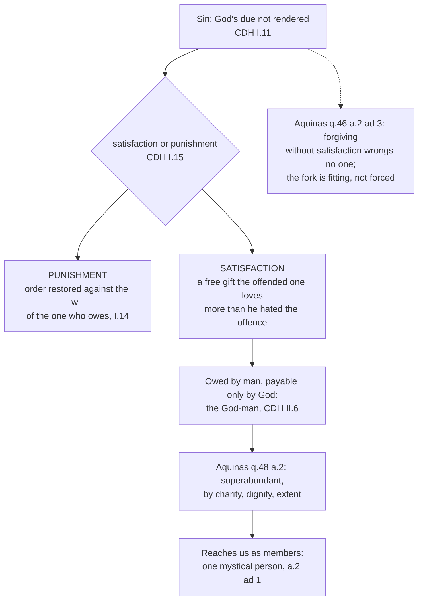

# Christology · Lesson 5.3: Satisfaction: Anselm and Aquinas

> ⏱ ~15 min · Module 5: The work of Christ · Builds on: [5.1 The Paschal Mystery and the threefold office](05-01-the-paschal-mystery-and-the-threefold-office.md), [5.2 Ransom, Christus Victor, and sacrifice](05-02-ransom-christus-victor-and-sacrifice.md), [3.4 The grace of the Head](03-04-the-grace-of-the-head.md) · Unlocks: [5.4 Penal substitution and the Catholic assessment](05-04-penal-substitution-and-the-catholic-assessment.md)

## Why this matters

[5.2](05-02-ransom-christus-victor-and-sacrifice.md) left a question the New Testament never answers: if Christ's life was a ransom, paid to whom? Anselm answered it in *Cur Deus Homo* ("Why God became man", finished in exile around 1098): not to the devil, and not as a price, but as *satisfaction* rendered to God. Aquinas rebuilt it, keeping the word and changing the logic. You need both precisely, because [penal substitution](../reference.md#penal-substitution) uses much of the same vocabulary, and the Catholic assessment in [5.4](05-04-penal-substitution-and-the-catholic-assessment.md) turns on one difference this lesson establishes: **satisfaction is not punishment.**

## The idea

Suppose you wreck a friend's reputation in public. The wrong can be put right two ways. He can have you *punished*: a court takes something from you against your will, and order is restored whether you like it or not. Or you can make *satisfaction*: you freely offer something he values — a costly public retraction, made out of real regret — that he loves more than he hated the insult. Both restore order. Only the second is a gift, done by the one who owes it.

Anselm's whole argument lives in that fork. Sin leaves God's due unrendered; either the sinner restores it freely, or it is taken back by force. Humanity cannot restore it; God will not simply ignore it; so the one who restores it must be a man (the debt is man's) and must be God (nothing less is enough).

Aquinas keeps the fork and changes two things. What makes satisfaction work is not a precise equality of price but **love**: Christ offers God something God loves more than he hated all the sin of the world, and so the offering *overflows*. And the fork is not forced on God. He could have forgiven freely; he chose the way that shows more mercy, not the only way available.

Neither author ever says the Father took his anger out on the Son. That picture belongs to the punishment branch; satisfaction is the *other* branch.

## Source

*Summa Theologiae* III q.48 a.2, "Whether Christ's Passion brought about our salvation by way of atonement?", the *respondeo* (English Dominican Province):

> He properly atones for an offense who offers something which the offended one loves equally, or even more than he detested the offense. But by suffering out of love and obedience, Christ gave more to God than was required to compensate for the offense of the whole human race. First of all, because of the exceeding charity from which He suffered; secondly, on account of the dignity of His life which He laid down in atonement, for it was the life of one who was God and man; thirdly, on account of the extent of the Passion, and the greatness of the grief endured ... And therefore Christ's Passion was not only a sufficient but a superabundant atonement for the sins of the human race.

**"Atones"** renders Aquinas's *satisfacit* (lesson's gloss: *makes satisfaction*); the translators' "atonement" throughout this article is *satisfactio*. Read the passage with that swap and three things stand out. The measure is **love**: what the offended one *loves*, set against what he *detested*. There is no scale of pain. The first of three grounds is **charity**; suffering enters only third, and as the extent of what was freely borne, not as a quantity owed. And the second ground — "one who was God and man" — is Christology doing soteriology's work: the worth of the offering is fixed by *who* offers it. The first reply adds how it reaches us: head and members are as [one mystical person](../reference.md#one-mystical-person) (*quasi una persona mystica*), so Christ's satisfaction belongs to his members ([3.4](03-04-the-grace-of-the-head.md)).

## The argument

**Anselm, in outline** (*Cur Deus Homo*, Deane's translation; chapter numbers checked against it):

1. **The devil has no rights over man** (I.7). Both belong to God, and the devil tormented man unjustly. *In words:* the cross is not a transaction with Satan.
2. **To sin is not to render God his due** (I.11): the due is a will wholly subject to God's, and whoever withholds it must restore *more* than he took, in view of the contempt.
3. **God may not simply pass it over** (I.12–13). Remitting sin by compassion alone would leave it undischarged and make injustice freer than justice.
4. **So either [satisfaction or punishment](../reference.md#satisfaction-or-punishment)**: in Deane's words, "satisfaction or punishment must needs follow every sin" (I.15). Punishment is honour taken back from the unwilling (I.14); satisfaction is honour restored by the willing.
5. **Only the God-man can satisfy** (II.6). The payment must outweigh everything besides God, so only God can make it; the debt is humanity's, so only a man ought to.
6. **Christ's death was not owed** (II.11) — he was sinless — so it is a free gift, and its reward, which he cannot need, passes to his brethren as remission of their debt (II.19).

*In words:* the God-man owes nothing, gives everything, and the surplus is ours. Anselm himself excludes two misreadings: the Father did not *prefer* the Son's death, but would reconcile the world no other way than by a man doing so great a thing, and the Son freely willed it (I.9); and the necessity is not compulsion but the immutability of God's own goodness, which Anselm says is not properly called necessity at all (II.5).

**Aquinas's reworking**:

7. **Necessity becomes fittingness.** Simply speaking, God could have saved us another way; the Passion is necessary only on the supposition of his decree (q.46 a.2). He could even have forgiven without any satisfaction: a judge cannot waive an offence against another, but God has no one above him, so "if He forgive sin ... He wrongs no one" (q.46 a.2 ad 3). The Passion was chosen as the *more fitting* way — it shows God's love, gives an example, merits grace, lets a man overthrow the devil (a.3) — and as a more abundant mercy than forgiveness without satisfaction (a.1 ad 3). *In words:* the cross was fitting, not forced.
8. **Equality becomes superabundance**, by charity, dignity and extent (q.48 a.2, above).
9. **Transfer becomes membership**: head and members as one mystical person (a.2 ad 1). The price is paid to God, not the devil (a.4 ad 3).
10. **The Father "delivered him up"** in three senses — by eternally ordaining the Passion, by inspiring him with charity to will it, and by not shielding him from his persecutors (q.47 a.3). Handing an innocent over *against his will* would be cruel, and the Father did not do that (ad 1).

**Trent.** Session VI (1547), chapter 7, naming the causes of justification: the *meritorious* cause is Christ, who "merited Justification for us by His most holy Passion on the wood of the cross, and made satisfaction for us unto God the Father" (Waterworth).

**[Mark the levels](../reference.md#the-levels-in-christology).** That Christ redeemed us by his death is creedal and at the top of the [ladder](../../fundamental-theology/lessons/04-04-the-ladder-of-doctrinal-authority.md). *That* he merited for us and made satisfaction to the Father is taught by an ecumenical council in a doctrinal chapter, and the manuals commonly rank it as of faith; notice, though, that canon 10's anathema mentions Christ's *merit*, while *satisfaction* stands only in the chapter — the distinction between a chapter that teaches and a canon that bites ([`fundamental-theology` 1.1](../../fundamental-theology/lessons/01-01-what-fundamental-theology-asks.md)). The **mechanism** — Anselm's honour-and-debt, Aquinas's superabundance — has no magisterial weight of its own; it is the tradition's leading theology. **Whether satisfaction was necessary** is freely disputed: Anselm held it, Aquinas denied it. And no [model of redemption](../reference.md#models-of-redemption) is defined as *the* model: Trent teaches the fact of satisfaction and does not canonize a theory of it.

## The rule

Christ stays on the satisfaction branch throughout. Any sentence that has the Father punishing him in the place of the guilty has left this model for another.

## Worked examples

**Example 1 — a clean case: "Christ paid the price of our sins."** Three questions. *Paid to whom?* To God, not the devil (Anselm I.7; Aquinas q.48 a.4 ad 3). *Paid what?* Not a sum of pain matched to a sum of guilt, but an offering of love and obedience that God loves more than he hated the offence (q.48 a.2). *Why does it count for us?* Because head and members are one mystical person (a.2 ad 1). So the sentence is true, with "price" read as *satisfaction*, not *fine*; Aquinas uses the price language himself (a.4 ad 3), and it is safe once the three answers are fixed.

**Example 2 — where it strains: Aquinas sounds penal.** Two replies read, at first glance, like the other branch. In q.47 a.3 ad 1 the Passion shows God's severity (Romans 11:22), because he would not remit sin without penalty. In q.46 a.4 ad 3 Christ is "made sin" (2 Corinthians 5:21) on account of the penalty of sin, and bears the curse of Galatians 3:13.

Three moves keep this inside satisfaction. **First,** *would* not is not *could* not: q.46 a.2 ad 3 has already said God could forgive without penalty and wrong no one. The severity is a chosen way of showing sin's gravity, not a debt of wrath God was bound to collect. **Second,** Christ really does undergo the penalty of sin — death, and the curse attached to mortality — but *undergoes* it, freely and out of charity, as the matter of his offering. What is valuable to God is not the pain but the love in which it is borne (a.2's first ground). **Third,** the Father's part is named in the body of q.47 a.3 as ordaining, inspiring and not shielding; nowhere is it *punishing*. So the strain is real and it is exactly where [5.4](05-04-penal-substitution-and-the-catholic-assessment.md) begins: Catholic theology affirms that Christ bore the penalty of sin, and denies that the Father inflicted it on him as punishment.

The course's grammar is at work here too. The life laid down is of infinite worth because of the **person** — q.48 a.2 ad 3 measures the flesh's dignity by the Person assuming it — not because the flesh became divine. The offering is human; the one who offers is the Word: the [communication of idioms](../reference.md#communication-of-idioms) carrying the weight of the atonement.

## Watch out

- **You might think satisfaction and punishment are two words for one thing.** They are Anselm's two *alternatives* (I.15). Collapsing them turns the satisfaction model into penal substitution before [5.4](05-04-penal-substitution-and-the-catholic-assessment.md) has stated either.
- **You might think "the Father punished the Son" is simply vivid preaching.** It sets a Father who wills punishment against a Son who suffers it — two opposed wills in God, which is **tritheism** in effect, since the three have one will ([`trinity-and-god` 4.3](../../trinity-and-god/lessons/04-03-the-two-processions.md)). Aquinas: Christ as God delivered himself up by the same will and action as the Father (q.47 a.3 ad 2).
- **You might think the value comes from the man's heroism.** Then the offering is a finite man's, God merely accepting it, and the *who* has been split: **Nestorianism** in soteriological dress. Fuse the natures instead ("his divine flesh") and you land in **Eutychianism**. The worth is from the person.
- **You might think [satisfaction](../reference.md#satisfaction) theory is dogma.** Trent teaches *that* Christ satisfied; it defines no mechanism, and Aquinas denied Anselm's necessity.
- **You might think Anselm's God is a feudal lord guarding his pride.** Anselm says nothing can be added to or taken from God's honour in itself (I.15); sin disturbs the creature's order. The feudal-honour debate belongs to [`theology-of-debt`](../../theology-of-debt/syllabus.md) 3.3.

## One-liner

> Satisfaction is the gift, not the sentence: the God-man freely gives the Father what he loves more than he hated our sin, and Aquinas adds that God did not have to ask.

## Problems

**P1 (🟢)** *(Exegetical.)* Mark each sentence **true**, **false**, or **true only with a distinction**, and name in one sentence the text of this lesson that decides it.

1. "Christ's blood was the price paid to the devil to buy back his captives."
2. "On the cross the Father punished the Son in our place."
3. "Christ's satisfaction was of infinite worth because it was God's flesh that suffered."
4. "God could not have forgiven sin without satisfaction."
5. "Since Christ never sinned, his satisfaction can count for others only as a legal fiction."

**P2 (🟡)** *(Exegetical.)* An **invented** Good Friday homily, written for this problem and not the words of any real person:

> "Sin made the Father angry, and that anger had to go somewhere. It was either going to fall on us or on someone else. On Calvary it fell on Jesus: the Father poured out on his Son all the punishment we deserved, until his anger was paid off. That is what the Church means by satisfaction, and it is a dogma of faith."

(a) Name the branch of Anselm's fork the homily has put Christ on, and the two texts from this lesson that move him to the other branch. (b) Name the Trinitarian error in "the Father poured out on his Son." (c) Correct the last sentence's level claim. **150 words or fewer in total.**

**P3 (🔴)** *(Exegetical.)* Assign each claim its level on the [ladder](../../fundamental-theology/lessons/04-04-the-ladder-of-doctrinal-authority.md), and **name the act** that fixes it (or say that none does). (a) Christ merited our justification. (b) Christ made satisfaction for us to the Father. (c) Satisfaction was the only way God could have redeemed us. (d) Christ's satisfaction reaches us because head and members are one mystical person. **Two sentences per claim.**

Solutions

**P1** *(Exegetical.)*

**Must hit, strict:** **1. False.** Anselm I.7 denies the devil any right over man; Aquinas q.48 a.4 ad 3 says the price was paid to God, not to the devil. **2. False.** The Father delivered him up by ordaining, inspiring charity and not shielding (q.47 a.3), and ad 1 denies he handed over an innocent against his will; the *true* sentence nearby is that Christ freely underwent the penalty of sin (q.46 a.4 ad 3). **3. True only with a distinction.** Infinite worth, yes (q.48 a.2 ad 3) — but from *the Person assuming* the flesh, not because the flesh became divine in nature; said of the person, true; of a divinized nature, false. **4. True only with a distinction** — Aquinas's own (q.46 a.2): false *simply speaking* (ad 3: forgiving without satisfaction wrongs no one), true *on the supposition* of God's decree. Anselm would mark it true without distinction; that is the freely disputed point, and the answer names it as disputed. **5. False.** Head and members are as one mystical person, so Christ's satisfaction belongs to the faithful as his members (q.48 a.2 ad 1).

**Wrong turns:** marking 1 "true with a distinction" because *lytron* is scriptural — the metaphor is true, the payee is false. Marking 2 "true with a distinction" without saying the *punishing* is what falls away. Marking 4 simply false and calling it settled: Aquinas's view is the more common, not a definition.

**Model answer:** 1 false — paid to God, not the devil (Anselm I.7; q.48 a.4 ad 3). 2 false — the Father ordained, inspired and did not shield, and punished no innocent against his will (q.47 a.3 and ad 1). 3 true only with a distinction — infinitely worthy from the Person assuming the flesh, not from a divinized flesh (q.48 a.2 ad 3). 4 true only with a distinction — impossible only on the supposition of God's decree, possible simply (q.46 a.2 and ad 3); Anselm's unqualified "true" remains a disputed position. 5 false — head and members are as one mystical person (q.48 a.2 ad 1).

**P2** *(Exegetical.)*

**Must hit, strict (a):** the **punishment** branch — order restored by force against the one who owes (Anselm I.14–15). Moved by q.48 a.2 (a free offering God *loves*, measured by charity, not by penalty collected) and q.47 a.3 with ad 1 (the Father delivers by ordaining, inspiring charity and not shielding, never against the Son's will). Anselm I.9 also serves: the Father did not prefer the Son's death. **(b):** opposed wills in the Trinity — the Father's wrath against the Son — which divides the one divine will: **tritheism** in effect (q.47 a.3 ad 2: same will and action). **(c):** *that* Christ made satisfaction is taught by Trent, Session VI ch. 7; *this* mechanism — anger discharged on a substitute — is neither Anselm's nor Aquinas's and is taught nowhere as dogma.

**Wrong turns:** answering "Nestorianism" for (b) — the error is in God, not in Christ. Correcting (c) by saying satisfaction is "just a theory": the fact is conciliar teaching.

**Model answer:** (a) It puts Christ on the punishment branch: order taken back by force. Q.48 a.2 moves him to satisfaction — a free offering God loves more than he hated sin — and q.47 a.3 says the Father delivered him by inspiring charity, not by punishing. (b) A Father willing wrath against the Son sets two wills in God against each other, which is tritheism in effect; q.47 a.3 ad 2 gives them one will and action. (c) Trent teaches *that* Christ made satisfaction to the Father; no mechanism is defined, and this one is not even the tradition's theology.

**P3** *(Exegetical.)*

**Must hit, strict:** **(a)** Top of the ladder by the usual reckoning: taught in Trent, Session VI ch. 7, and carried inside canon 10, which anathematizes saying that men are just without the justice of Christ by which he merited our justification. The act is a conciliar canon. **(b)** Taught by an ecumenical council in a doctrinal chapter (Session VI ch. 7), and commonly ranked by the manuals as of faith; the canon's anathema falls on merit, so an answer should say satisfaction's warrant is the chapter. **(c)** **Freely disputed**: Anselm held the necessity, Aquinas denied it (q.46 a.2 and ad 3); no act fixes it. **(d)** Aquinas's theology (q.48 a.2 ad 1), the common teaching of the schools, with no magisterial act defining it — theologically standard, not a matter of faith.

**Wrong turns:** calling (c) heretical because Trent teaches satisfaction — Trent teaches that it happened, not that it had to. Ranking (d) as dogma because Aquinas is the Common Doctor: his authority is not a magisterial act. Flattening (a) and (b) into "both in the canon."

**Model answer:** (a) Top rung: Trent, Session VI, canon 10 anathematizes holding that we are just without the justice by which Christ merited our justification, so his merit is in the defined text. (b) Conciliar teaching in chapter 7 of the same decree, usually ranked as of faith, though the canon's anathema names merit rather than satisfaction. (c) Freely disputed: Anselm affirms, Aquinas denies, and no act of the Church decides it. (d) Common theological teaching from Aquinas, not defined by any act.

## Flashback

**From Lesson [5.1](05-01-the-paschal-mystery-and-the-threefold-office.md) (The Paschal Mystery and the threefold office):** *(Exegetical.)* *Summa Theologiae* III q.26 a.2, "Whether Christ, as Man, is the Mediator of God and men?" (English Dominican Province), from the body and the reply to the third objection. The objection had argued that Christ reconciles us by taking away sin, which only God can do, so he must be Mediator as God.

> We may consider two things in a mediator: first, that he is a mean; secondly, that he unites others. Now it is of the nature of a mean to be distant from each extreme: while it unites by communicating to one that which belongs to the other. Now neither of these can be applied to Christ as God, but only as man. ... Because, as man, He is distant both from God, by nature, and from man by dignity of both grace and glory. Again, it belongs to Him, as man, to unite men to God, by communicating to men both precepts and gifts, and by offering satisfaction and prayers to God for men.
>
> Reply to Objection 3. Although it belongs to Christ as God to take away sin authoritatively, yet it belongs to Him, as man, to satisfy for the sin of the human race.

(a) Why can neither mark of a mediator belong to Christ *as God*, and how does each belong to him as man? (b) How does the reply divide the work on sin between the natures, and what error does "the divine nature made satisfaction" fall into? (c) Does "as man" make the man a second subject beside the Word? Name the word in the passage that answers. **Two sentences per part.**

Solution

**Must hit, strict (a):** as God the Son is **not distant** from the Father and the Spirit (the same nature and power), and has nothing of theirs to pass on as if it belonged to someone else, so he is not a mean and cannot unite. As man he is **distant on both sides**: below God by nature, above other men by grace and glory. He **unites** by bringing precepts and gifts down to us and offering satisfaction and prayers up to God.

**Must hit, strict (b):** taking away sin **authoritatively**, as its principal cause, belongs to him as God. **Satisfying** for sin belongs to him as man. Credit the link to 5.1's Source: the Passion acts efficiently as compared with the Godhead and by way of satisfaction as it is in his flesh. "The divine nature made satisfaction" gives the divine nature a human act, which fuses the natures: **Eutychianism** (5.1's Watch out).

**Must hit, strict (c):** **no.** Every clause has one subject, **"He"** (or "Christ", or "Him"), and "as man" names the nature through which that one subject acts. This is the reduplication of [3.2](03-02-the-communication-of-idioms.md). Reading it as "the man mediates and the Word does not" divides the *who*: **Nestorianism**. Credit an answer that adds the reply to Objection 1: remove the divinity and the fulness of grace that sets him above all men goes with it.

**Wrong turns:** concluding that he is Mediator as God "because only God saves". That is the objection, and the reply answers it. Reading "distant from God" as a claim that the Word is less than the Father; the distance is by the **human** nature. Forcing precepts, gifts and prayers onto the three offices one-to-one. Only "offering satisfaction and prayers" is plainly priestly, and the question did not ask for the mapping.

**Model answer:** (a) As God the Son shares one nature and power with the Father and the Spirit, so he stands at no distance from them and has nothing of theirs to hand on as another's. As man he is below God by nature and above men by grace and glory, and he unites the two by bringing precepts and gifts to men and offering satisfaction and prayers to God. (b) The divinity takes sin away as its principal cause; the humanity makes satisfaction for it. To say the divine nature satisfied is to give it a human act and so fuse the natures, which is Eutychianism. (c) No: the subject of every clause is the one "He", and "as man" names the nature he acts through. Making the man a second agent would divide the *who*, which is Nestorianism.

## Connections

- **Backward:** [5.2](05-02-ransom-christus-victor-and-sacrifice.md) asked "paid to whom?" and this lesson answers it; [5.1](05-01-the-paschal-mystery-and-the-threefold-office.md) separated satisfaction from merit, expiation and propitiation, and Trent's chapter 7 uses two of those words side by side. [3.4](03-04-the-grace-of-the-head.md) supplies the capital grace that makes "one mystical person" more than a metaphor.
- **Forward:** [5.4](05-04-penal-substitution-and-the-catholic-assessment.md) states the Reformed doctrine from its confessions and gives the Catholic assessment, which turns on this lesson's fork. How Christ's merit and satisfaction reach an individual belongs to [`creation-grace-last-things`](../../creation-grace-last-things/syllabus.md).
- **Sideways:** [`theology-of-debt`](../../theology-of-debt/syllabus.md) 3.3–3.4 reads the same two texts for their debt logic — the reconstruction of Anselm in premises, the Anselm–Aquinas crux on necessity, and the feudal-honour debate are done there, not here. Anselm the philosopher is in [`ancient-medieval-philosophy` 6.1](../../ancient-medieval-philosophy/lessons/06-01-anselm-and-the-proslogion-as-history.md).
