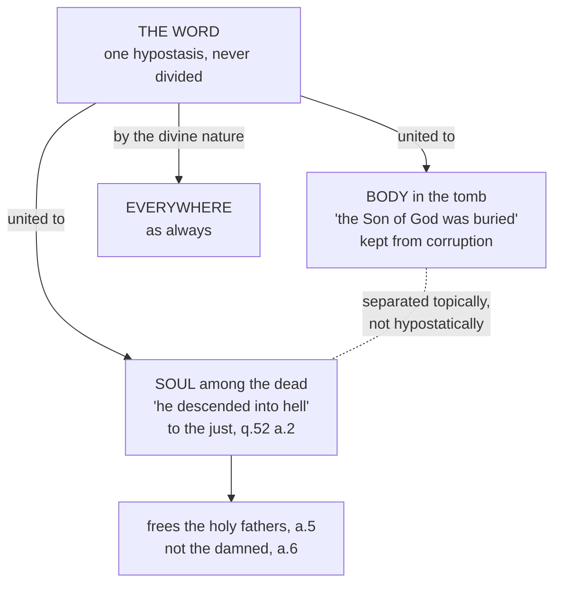

# Christology · Lesson 6.1: He descended into hell

> ⏱ ~15 min · Module 6: Descended, risen, ascended, confessed · Builds on: [3.2 The communication of idioms](03-02-the-communication-of-idioms.md), [5.2 Ransom, Christus Victor, and sacrifice](05-02-ransom-christus-victor-and-sacrifice.md), [5.4 Penal substitution and the Catholic assessment](05-04-penal-substitution-and-the-catholic-assessment.md) · Unlocks: [6.2 Resurrection and ascension as doctrine](06-02-resurrection-and-ascension-as-doctrine.md), [6.4 Christology today](06-04-christology-today.md)

## Why this matters

Between "buried" and "rose again" the Creed gives Christ one more act: he descended into hell. That is a whole day, Holy Saturday, when Christ is dead. His soul and body are apart, and the grammar of the course is tested where it seems weakest. Who lies in the tomb? Who goes down to the dead? And is anyone left to be the one subject? The clause also hosts the sharpest modern Catholic dispute in this course. Hans Urs von Balthasar read the descent as the Son's share in the abandonment of the lost. Alyssa Pitstick says that contradicts what the Church teaches. You can only judge that fight if you know exactly what the Church teaches, and at what level.

## The idea

"Hell" here is not the hell of the damned. The Latin of the Apostles' Creed is *descendit ad inferna* ("to the lower places"). Some copies, and the Athanasian Creed, read *ad inferos* ("to those below"). The Greek is *katelthonta eis ta katōtata* ("descended into the lowest parts"), which echoes Ephesians 4:9. Behind all three stand Hebrew *Sheol* and Greek *Hades*: the realm of the dead, where the righteous and the wicked alike went, and not *Gehenna*. Schaff notes that the King James renders *Hades* "hell" almost everywhere, and the Douay–Rheims does the same: Acts 2:27, quoting Psalm 15, reads "thou wilt not leave my soul in hell."

The article is a late arrival that says something early. Rufinus (c. 400) reports that neither the Roman creed nor the Eastern creeds contained it. He adds that its force already seems to lie in "buried". It first appears among Latin creeds at Aquileia, and in the East in Arian-era creeds around 360 (Schaff, *Creeds of Christendom* II, notes to the Apostles' Creed).

So the article carries three layers, and the lesson keeps them apart:

1. **He was really dead.** He went where the dead go, and was not merely unconscious or hidden.
2. **He went there as Saviour.** He freed the just who had gone before him.
3. **What he underwent or did there beyond that.** This is where the tradition says little and the modern dispute says a great deal.

## Source

John of Damascus, *Exposition of the Orthodox Faith* III.27 (Salmond, *Nicene and Post-Nicene Fathers*, second series, vol. 9). The Catechism cites this chapter for its own teaching on Christ in the tomb.

> Wherefore, although He died as man and His Holy Spirit was severed from His immaculate body, yet His divinity remained inseparable from both, I mean, from His soul and His body, and so even thus His one hypostasis was not divided into two hypostases. For body and soul received simultaneously in the beginning their being in the subsistence of the Word ... For, although the soul was separated from the body topically, yet hypostatically they were united through the Word.

Three readings decide the passage. **"His Holy Spirit"** is Christ's human spirit, his soul, not the third person. Aquinas quotes the same sentence as "His holy soul was separated" (ST III q.50 a.3, *sed contra*). **"Topically"** means in place (*topos*): death puts the soul in one place and the body in another. **"Hypostatically"** means in the subject: both remain the Word's. So death divides the *what*, and it cannot divide the *who*, because body and soul never had any subject but the Word ([hypostatic union](../reference.md#hypostatic-union)).

## The argument

Aquinas builds the article in two questions, III q.50 (Christ's death) and q.52 (the descent).

1. **Christ truly died, and death is the separation of soul from body.** Aquinas calls the truth of Christ's death "an article of faith" (q.50 a.4). *In words:* Holy Saturday is not a coma.
2. **The union was not dissolved.** A gift of grace is withdrawn only for fault, and the grace of union is greater than the grace of adoption, which is itself lost only by sin. Christ had no sin, so the Word stayed united to the flesh (q.50 a.2) and, all the more, to the soul (a.3). *In words:* death takes the soul out of the body. It does not take either of them out of the Word ([the union in death](../reference.md#the-union-in-death)).
3. **So both halves of Holy Saturday are said of the Son.** What belongs to the body is predicated of the Son of God, "was buried". In the same way what belongs to the separated soul is predicated of him, "he descended into hell" (q.50 a.3). *In words:* this is the [communication of idioms](../reference.md#communication-of-idioms) at work in death. The Creed's subject for "descended" is the same as its subject for "was born".
4. **Concrete and abstract terms keep their rules.** The *whole Christ* was in the tomb and in hell, because the whole person was there through the body and through the soul. He was also everywhere by his divinity. But not *the whole of* Christ was in either place (q.52 a.3: masculine for the person, neuter for the nature). And Christ was not "a man" during the three days "simply and without qualification", since that would deny his death. He was "a dead man" (q.50 a.4). *In words:* the person is whole wherever any part of him is. The nature, soul plus body, is not whole anywhere until Easter.
5. **Where the soul went, and why.** By his effect, Christ reached every region of the dead. He shamed the unbelieving and gave hope to those being purified. In his essence his soul went only to the just, the "limbo of the fathers" (q.52 a.2). He delivered the holy fathers by the power of his Passion (a.5) and delivered none of the damned (a.6). The [Catechism](../reference.md#the-descent-into-hell) teaches the same (CCC 632–633, quoting the Roman Catechism). Christ descended as Saviour, not to deliver the damned or destroy the hell of damnation, but to free the just who had gone before him. The scriptural texts are Acts 2:24–31, Ephesians 4:8–10, and 1 Peter 3:18–20 and 4:6. The Petrine texts have borne rival readings, and Aquinas records one, Augustine's, which puts the preaching in Noah's day (q.52 a.2 ad 3).

**Mark the levels.** That Christ descended to the dead is **in the Creed**, the Apostles' and the Athanasian, and belongs to rung 1: it confesses that he really died ([`fundamental-theology` 4.4](../../fundamental-theology/lessons/04-04-the-ladder-of-doctrinal-authority.md)). That the Word stayed united to body and soul in death is **taught by the Catechism** (CCC 626, 630) and follows so closely from the defined union that denying it divides the subject. No council defines it in these terms, so rate it **theologically certain / common teaching**. That he went to free the just, and not to free the damned or abolish hell, is **authentic ordinary magisterium** (the Roman Catechism; CCC 633). The Catechism's footnote for the negative cites a Council of Rome (745), the Fourth Council of Toledo, and letters of Benedict XII (1341) and Clement VI (1351). These are local councils and papal letters, not definitions. Beyond that, what Christ *underwent* there is a question the Church has never judged. The course therefore treats Balthasar's thesis as **freely disputed**, and Pitstick's case is that it should not be ([the levels in Christology](../reference.md#the-levels-in-christology)).

## The picture: Holy Saturday

## Worked examples

**Example 1: the machinery on a clean case.** Sort four Holy Saturday sentences.

- *"The Son of God lay in the tomb."* **True.** The concrete term names the person, and the body in the tomb is his (q.50 a.2; [concrete and abstract terms](../reference.md#concrete-and-abstract-terms)).
- *"The divinity lay in the tomb."* **False.** The abstract term names the nature, and lying in a grave belongs to a body.
- *"On Holy Saturday Christ was a man."* **True only with a distinction.** Said simply, it is false: it denies his death (q.50 a.4). Said as "a dead man", or of the assumption that never lapsed, it is true (a.4 ad 1).
- *"The whole Christ was in hell."* **True** of the person, *totus*. "The whole of Christ was in hell" is **false** of the nature, *totum*, since his body was in Joseph's tomb (q.52 a.3).

**Example 2: where it strains. Balthasar's Holy Saturday.** Here is the thesis at its strength, paraphrased from *Mysterium Paschale* (1969, in *Mysterium Salutis* III/2; English 1990). The descent is not a victory parade. It is the last stage of the Son's obedience: he is "dead with the dead", utterly passive, in solidarity with every human being in the state that sin earns. There he sees sin as it is in itself and undergoes the forsakenness of the one cut off from God. What keeps this from being tragedy is Trinitarian. The distance between the forsaken Son and the Father falls *within* their love, so no human abandonment lies outside God's reach. Balthasar drew much of it from the Holy Saturday experiences of Adrienne von Speyr, and said their work could not be separated. His motive is scriptural: to take seriously "made sin for us" (2 Corinthians 5:21) and the cry of dereliction ([4.3](04-03-the-beatific-vision-in-christ.md)).

Pitstick, in *Light in Darkness* (2007), argues that on this point the tradition is unified and precise. Christ's soul, already glorious, went only to the limbo of the fathers and freed them. He did not suffer there. Balthasar keeps the Creed's words, she says, while reversing each element: suffering for glory, passivity for power, the lost for the just. Edward Oakes replied in *First Things* (December 2006, with rejoinders into 2007). The traditional details, he argued, were never defined. Development is possible. Joseph Ratzinger had written of Christ entering the abyss of abandonment, and John Paul II named Balthasar a cardinal in 1988. Pitstick answered that the same pope promulgated a Catechism teaching the traditional account, and that a red hat is not a doctrinal judgment. The liturgy's own picture, the ancient Holy Saturday homily quoted at CCC 635, is of the Lord going down to take Adam by the hand. It is a rescue, and it favours her (paraphrase). No magisterial act has ruled on Balthasar's thesis.

## Watch out

- **"In the tomb lay Jesus's body; the Son of God had gone elsewhere."** This splits the subject. It is **Nestorianism** by way of the calendar: the Creed says the *Son* was buried, and the body stayed the Word's (q.50 a.2).
- **"Christ was still simply a man in the tomb, just resting."** Aquinas calls this erroneous because it destroys the truth of his death (q.50 a.4). A death that is not real is **Docetism** moved to the far end of the Passion.
- **"He descended into the hell of the damned and emptied it."** This reads *inferna* as *Gehenna*, and the Catechism excludes it (CCC 633). The Heidelberg Catechism's reading is a different error: it makes the article Christ's "inexpressible anguish, pains, and terrors" suffered in his soul "on the cross and before" (Q.44, Schaff). That moves the descent back onto Good Friday, as [5.4](05-04-penal-substitution-and-the-catholic-assessment.md) noted.
- **Level errors in both directions.** "Balthasar is a heretic" overstates, because no act of the Church says so. "The descent is a medieval picture" understates, because it is in the Creed.

## One-liner

> On Holy Saturday death parted Christ's soul from his body, but not either from the Word: the Son lay in the tomb and the Son went down to free the just, and everything beyond that is theology, not Creed.

## Problems

**P1 (🟢)** *(Exegetical)* Place each claim on the ladder ([`fundamental-theology` 4.4](../../fundamental-theology/lessons/04-04-the-ladder-of-doctrinal-authority.md)) and name the act or source that fixes it. **One line each.**
(i) Christ went down to the realm of the dead. (ii) He freed the just who had gone before him. (iii) He did not descend to free the damned. (iv) During the three days the Word remained united to the body in the tomb. (v) In the descent Christ underwent the forsakenness due to sinners, in solidarity with the lost.

**P2 (🟡)** *(Exegetical)* Two positions:

> **A (Balthasar, paraphrased).** The descent is the Son's passive solidarity with the dead, in which he experiences sin's God-forsakenness. The Creed and Catechism teach that he descended and that he freed the just; they do not rule out this account of what he underwent.
>
> **B (Pitstick, paraphrased).** The tradition — Fathers, catechisms, liturgy — teaches unanimously that the descent was glorious, to the just only, and without suffering. An account that reverses each of these contradicts the doctrine while keeping its words.

Name the single premise on which they divide, and say what kind of evidence would move a reader one way or the other. **100 words or fewer.**

**P3 (🔴)** *(Exegetical)* An **invented** parish-bulletin reflection, not the words of any real person:

> "On Holy Saturday Jesus's body lay cold in the tomb, but the Son of God had returned to the Father; only his human spirit went down among the dead. There he smashed the gates of hell and set every soul free, the damned included. The descent is thus the Church's dogmatic proof that hell is empty — though of course it is only a medieval picture, and no Catholic is bound to it."

Name three errors: one about the subject, one about the "hell" of the article, and one about levels. For each, give the correction and its source. **150 words or fewer.**

Solutions

**P1** *(Exegetical)*

**Must hit, strict:** (i) **Rung 1**: the Apostles' and Athanasian Creeds ("descended into hell"). (ii) **Rung 3**, authentic ordinary magisterium: the Roman Catechism, quoted in CCC 633. Accept "common teaching" if the Catechism is named as the source, but not rung 1 or 2. (iii) **Rung 3**: CCC 633. Its footnote rests on local councils (Rome 745, Toledo IV) and papal letters (Benedict XII, Clement VI), none of them definitions. (iv) **Theologically certain / common teaching**, also taught in CCC 626 and 630 (so rung 3 is acceptable), with John of Damascus and ST III q.50 a.2 behind it. It is not defined in these terms. (v) **Freely disputed** (Balthasar), because no magisterial act has judged it. Credit for adding that Pitstick holds it contrary to doctrine.

**Wrong turns:** rating (ii) or (iii) de fide because "every catechism says so", which confuses universal repetition with a definition. Rating (v) as condemned. Rating (i) as a pious opinion.

**P2** *(Exegetical)*

**Must hit, strict:** the divide is **whether the tradition's account of the *manner* of the descent (glorious, to the just only, without suffering) belongs to the content of the doctrine, or is theological explanation that the doctrine does not fix.** B must affirm that it belongs. A must deny it. What would move a reader: evidence about how the Fathers, the Roman Catechism and the CCC *propose* those details, as held of faith or as explanation (Vincent's universality and antiquity), and any magisterial statement on the manner itself. Credit for a secondary crux: whether Christ could suffer after death, given "It is consummated" and the end of merit at death.

**Wrong turns:** naming a verdict ("A is a development") instead of a premise. Making the crux whether Christ descended at all, which both affirm.

**Model answer:** They divide on whether the unanimous traditional account of *how* Christ descended is itself doctrine or is the tradition's explanation of a doctrine that fixes only *that* he descended and freed the just. Evidence that would move a reader: whether the Fathers and catechisms propose those details as of faith, and whether any magisterial act has spoken to the manner.

**P3** *(Exegetical)*

**Must hit, strict:** (1) **Subject:** "the Son had returned; only his human spirit went down" divides the *who*, which is Nestorian in shape. The Word stayed united to body and soul, and it is the *Son* who was buried and descended (Damascene, *Exposition* III.27; ST III q.50 a.2–3; CCC 626, 630). (2) **"Hell":** *inferna* is Sheol or Hades, the abode of the dead, not the hell of the damned. Christ freed the just and neither released the damned nor destroyed hell (CCC 633; ST III q.52 a.6). (3) **Levels:** the paragraph both overstates and understates. The descent is in the Creed (rung 1), so it is not an optional medieval picture. An empty hell is taught at no level, so it is not "dogmatic".

**Wrong turns:** calling (1) Apollinarian; the problem is two subjects, not a missing mind. Answering (3) with a verdict on Balthasar, who did not teach that the descent proves hell empty.

**Model answer:** The Son did not leave his body behind. Body and soul were separated in place but not from the Word, so the Son lay in the tomb and the Son descended (Damascene III.27; CCC 626). The "hell" of the Creed is the realm of the dead, and Christ went there to free the just, not the damned (CCC 633). The descent is a creedal article, not a medieval picture, and nothing in it teaches that hell is empty.

## Flashback

**From Lesson [5.3](05-03-satisfaction-anselm-and-aquinas.md) (Satisfaction: Anselm and Aquinas):** *(Exegetical.)* *Summa Theologiae* III q.49 a.4, "Whether we were reconciled to God through Christ's Passion?" (English Dominican Province), from the second half of the body and the reply to the second objection. The body has just given the first way the Passion reconciles us: it takes away sin. The objection had argued that God's love caused the Passion, so the Passion cannot have made God begin to love us.

> In another way, inasmuch as it is a most acceptable sacrifice to God. Now it is the proper effect of sacrifice to appease God: just as man likewise overlooks an offense committed against him on account of some pleasing act of homage shown him. ... And in like fashion Christ's voluntary suffering was such a good act that, because of its being found in human nature, God was appeased for every offense of the human race with regard to those who are made one with the crucified Christ ...
>
> Reply to Objection 2. Christ is not said to have reconciled us with God, as if God had begun anew to love us ... but because the source of hatred was taken away by Christ's Passion, both through sin being washed away and through compensation being made in the shape of a more pleasing offering.

(a) "Appease" and "compensation" can sound like punishment. On which branch of Anselm's fork, satisfaction or punishment, does Aquinas's comparison from human life put Christ, and which words show it? (b) Does "God was appeased" mean that God turned from anger to love? Say what the reply claims the Passion changed. (c) Why does it matter that the good act was "found in human nature", and whom does the appeasing reach? **Two sentences per part.**

Solution

**Must hit, strict (a):** **satisfaction.** The comparison is an offended man who overlooks the offence because of a *pleasing act of homage*. That is a gift the offended one values, freely offered by the offender's side, and nothing is exacted against anyone's will. The deciding words are "most acceptable sacrifice", "voluntary suffering was such a good act" and "a more pleasing offering". What appeases is the goodness of a voluntary act, which is q.48 a.2's measure: what the offended one *loves*, not a quantity of pain.

**Must hit, strict (b):** **no.** The reply denies that God "had begun anew to love us". God's love is the cause of the Passion, not its effect. What the Passion removes is "the source of hatred", which is sin, in two ways: sin is washed away, and a more pleasing offering is made. God's love does not change; the sin he hated is taken away.

**Must hit, strict (c):** the offence is humanity's, so the offering has to be made in the nature that offended. This is Anselm's "only a man ought to" (II.6). Its worth still comes from the person who offers it, the Word (q.48 a.2, the second ground). It reaches "those who are made one with the crucified Christ": the members of the head, who are as one mystical person with him (q.48 a.2 ad 1). It does not reach every human being automatically. Credit an answer that adds that this union is applied through faith and the sacraments (q.49 a.1 ad 4).

**Wrong turns:** reading "appeased" as wrath poured out on a substitute. That is the punishment branch, and it sets the Father's will against the Son's (5.3's Watch out). Saying in (b) that God hates nothing. The reply to the first objection says God loves men's nature and hates them "with respect to the crimes they commit." Reading "found in human nature" as saying the worth comes from a man's heroism. That splits the *who*, which is Nestorianism in soteriological dress.

**Model answer:** (a) Satisfaction: Aquinas compares Christ's act to homage that moves an offended man to overlook the offence, a free gift the offended one values. "Voluntary", "good act" and "more pleasing offering" place the value in love freely offered, not in penalty exacted. (b) No: the reply denies that God began anew to love us, since his love caused the Passion. What changed is the thing God hated: sin is washed away and a more pleasing offering is made in its place. (c) The debt is humanity's, so the offering must be human, though its worth comes from the Word who makes it. It reaches those made one with the crucified Christ, his members, who are as one mystical person with their head.

## Connections

- **Backward:** [3.2](03-02-the-communication-of-idioms.md) supplies the rule that lets "buried" and "descended" both have the Son as subject. [5.2](05-02-ransom-christus-victor-and-sacrifice.md) supplies the victory motif of Hebrews 2:14–15, which CCC 635 applies to the descent. [5.4](05-04-penal-substitution-and-the-catholic-assessment.md) handed over Heidelberg Q.44. [4.3](04-03-the-beatific-vision-in-christ.md) and [3.3](03-03-kenosis.md) met Balthasar's abandonment and kenosis first.
- **Forward:** [6.2](06-02-resurrection-and-ascension-as-doctrine.md) takes the other half of the same creedal article: the Catechism joins descent and resurrection because life came "out of the depths of death" (CCC 631, paraphrased). [6.4](06-04-christology-today.md) places Balthasar's whole Christology.
- **Sideways:** whether Balthasar's Holy Saturday is development or corruption is a test for Newman's notes ([`fundamental-theology` 5.2](../../fundamental-theology/lessons/05-02-newmans-theory-of-development.md)). The exegesis of 1 Peter 3–4 belongs to [`new-testament`](../../new-testament/syllabus.md). The limbo of the fathers, the intermediate state and the eternity of hell belong to [`creation-grace-last-things`](../../creation-grace-last-things/syllabus.md). John of Damascus as a writer is in [`patristics` 5.4](../../patristics/lessons/05-04-maximus-and-john-of-damascus.md).
