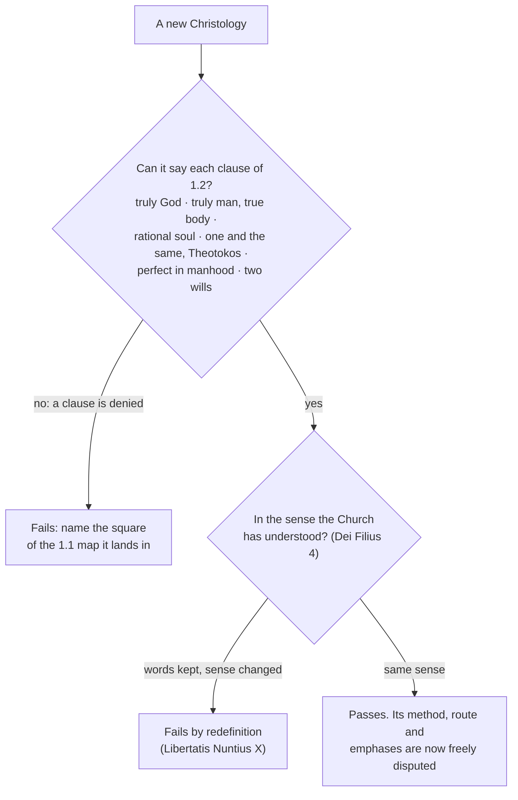

# Christology · Lesson 6.4: Christology today

> ⏱ ~15 min · Module 6: Descended, risen, ascended, confessed · Builds on: [1.2 True God and true man](01-02-true-god-and-true-man.md), [6.3 The churches that did not receive Chalcedon](06-03-the-churches-that-did-not-receive-chalcedon.md), [4.3 The beatific vision in Christ](04-03-the-beatific-vision-in-christ.md) · Unlocks: the course's boss problems ([syllabus](../syllabus.md))

## Why this matters

Everything so far was settled by 681. Christology did not stop there. Modern Catholic theologians have rebuilt it from the historical Jesus, from human self-transcendence, from drama and from the poor, and the Congregation for the Doctrine of the Faith (CDF) has answered some of them in public. You need a map of those positions. You also need one test for any Christology you meet later, and the course ends by stating it.

## The idea

**Route versus arrival.** A Christology "from above" starts with the Word and follows him down into the flesh, as John 1 does. A [Christology "from below"](../reference.md#christology-from-below) starts with the Jew from Nazareth: what he said and did, how he died, what his followers claimed about him afterwards. It then asks what must be true of him for all that to hold. The labels became standard through Wolfhart Pannenberg's *Jesus — God and Man* (1964), a Lutheran book.

Chalcedon does not tell you where to start. It tells you where you have to end up. One that reaches "one and the same, perfect in Godhead and perfect in manhood" is orthodox, and the route may even have taught it something the manuals missed. One that stops at a man uniquely open to God has not arrived. It lands in the *who* error from [1.1](01-01-what-christology-asks.md), a human someone with God beside him.

Karl Rahner put the modern situation in one question in an essay written for Chalcedon's fifteen-hundredth anniversary: is the Definition an end or a beginning? ("Chalkedon — Ende oder Anfang?", published 1954; in English, "Current Problems in Christology", *Theological Investigations* 1.) His answer, paraphrased, was *both*. The formula is an end because it truly settles something and can never be given up. It is a beginning because every formula opens onto a mystery bigger than itself, and each age has to go beyond the formula by returning to it. The rest of this lesson asks how you tell a going-beyond from a going-away.

## Source

The First Vatican Council, *Dei Filius* (1870), chapter 4 (Schaff's translation):

> For the doctrine of faith which God hath revealed has not been proposed, like a philosophical invention, to be perfected by human ingenuity, but has been delivered as a divine deposit to the Spouse of Christ, to be faithfully kept and infallibly declared. Hence, also, that meaning of the sacred dogmas is perpetually to be retained which our holy mother the Church has once declared; nor is that meaning ever to be departed from, under the pretense or pretext of a deeper comprehension of them.

The chapter goes straight on to Vincent of Lérins' growth clause ([`fundamental-theology` 5.1](../../fundamental-theology/lessons/05-01-vincent-of-lerins.md)): understanding should increase greatly, but in the same doctrine, the same sense, the same judgment. The chapter's third canon puts the passage in negative form. It anathematizes anyone who says that scientific progress may someday require giving a defined doctrine a sense different from the one the Church has understood.

The word that decides the passage is **meaning** (*sensus*). Words may change; the meaning may not. And the danger the council names is not open denial. It is **"a deeper comprehension"** used as cover. *Mysterium Ecclesiae* (CDF, 1973) later added the other half ([`fundamental-theology` 5.2](../../fundamental-theology/lessons/05-02-newmans-theory-of-development.md)). Dogmatic formulas carry the marks of their era's language, and the meaning they carry stays true.

## The argument

The main positions, each stated at the strength its best readers would recognize.

1. **Rahner: transcendental Christology.** The human person is an unlimited openness to absolute mystery, the *Vorgriff* of [`thomistic-synthesis` 6.4](../../thomistic-synthesis/lessons/06-04-transcendental-thomism-and-the-ressourcement-quarrel.md). The Incarnation is the one unsurpassable case of what human nature is for: God's self-communication fully given and fully accepted in one man. Rahner held a principle to steady this. Closeness to God and a creature's genuine autonomy grow in direct, not inverse, proportion. So the humanity most completely the Word's own is the most completely human humanity there is. *In words:* the union makes Jesus more human, not less, and that is an anti-Apollinarian result ([2.1](02-01-apollinaris-a-complete-humanity.md)). Rahner affirmed Chalcedon throughout. His aim was to make it believable, not to replace it.
2. **Schillebeeckx: the historical Jesus in dogmatics.** *Jesus: An Experiment in Christology* (Dutch 1974; English 1979) builds from critical exegesis toward confession. It reconstructs how the first disciples came to faith in Jesus as the eschatological prophet whom God vindicated. The CDF raised objections in 1976 and questioned him in Rome in December 1979. As usually reported, the case closed in 1980 with no condemnation of the book, and contested points, the resurrection among them, were left unresolved. *In words:* a Catholic theologian may start from the historical Jesus. The questions come at the arrival point.
3. **Balthasar: theodramatic Christology.** In *Theo-Drama* III, the volume on the persons of the drama, the answer to "who is Jesus?" is given by what he is sent to do. In Christ alone, person and mission coincide. He does not *have* a mission the way a prophet does. He *is* the Father's sending, lived out in time. *In words:* an old truth told as drama. The mission is the eternal procession with a temporal term ([`trinity-and-god` 6.1](../../trinity-and-god/lessons/06-01-the-missions-of-the-son-and-the-spirit.md)), so the one sent is the eternal Son. His Holy Saturday thesis belongs to [6.1](06-01-he-descended-into-hell.md).
4. **Liberation Christologies.** Jon Sobrino and Leonardo Boff read Jesus from the side of the poor, with the Kingdom and the cross at the center. The CDF answered in two steps. *Libertatis Nuntius* (6 August 1984) warned against forms that borrow Marxist concepts uncritically. Its chapter X names the Christological danger exactly: Chalcedon's words are kept literally while a new meaning is given to them. *Libertatis Conscientia* (22 March 1986) set out the positive doctrine of Christian freedom and liberation. The Notification on Sobrino (26 November 2006) calls his concern for the poor admirable. It then finds his books out of conformity with Church doctrine under six heads: method (the "Church of the poor" as the setting of Christology in place of the apostolic faith), Christ's divinity, the Incarnation, the Kingdom, Jesus' self-consciousness, and the saving value of his death.
5. **The International Theological Commission's studies:** *Select Questions on Christology* (1979), *Theology, Christology, Anthropology* (1981), and *The Consciousness of Christ concerning Himself and His Mission* (1985). They show theologians disputing inside the tradition. The 1985 study is the model. Its four propositions stay at the level of what the faith has always held, and each is argued from the New Testament witness: first the apostolic preaching, then what the Synoptic strands allow, then John. The first proposition arrives at a Jesus conscious of being the only Son, and in that sense God. It deliberately leaves open *how* that consciousness was articulated in his humanity ([4.3](04-03-the-beatific-vision-in-christ.md)).
6. **Dominus Iesus (CDF, 6 August 2000).** Its own statement of purpose is to set forth again the Catholic faith on the unicity and universality of Christ, not to settle free questions (section 3). The core, paraphrased: the Word who was in the beginning is the very one who became flesh. Jesus of Nazareth, and he alone, is the Son and Word, and a saving work of the Logos apart from his humanity is incompatible with the faith (10). The universal saving will of God is accomplished once for all in Christ's incarnation, death and resurrection (14). The same section invites theologians to explore how other religions may share in his one mediation. The notifications on Jacques Dupuis (24 January 2001) and Roger Haight (13 December 2004) apply the declaration to particular books.

**Mark the levels.** Everything these theologians say is at the level of the arguments they give. Rahner, Schillebeeckx, Balthasar and Sobrino are theologians, and taking a side among their methods is **freely disputed**. CDF instructions, declarations and notifications approved by the pope are **authentic ordinary magisterium** as acts ([`fundamental-theology` 4.5](../../fundamental-theology/lessons/04-05-reading-a-documents-weight.md)). Where *Dominus Iesus* says a truth "must be firmly believed", it is restating a doctrine whose rung was fixed elsewhere. That Jesus and the Word are one subject is **defined dogma** from Ephesus and Chalcedon, and the declaration does not create it. A notification judges *books*. It defines nothing new, and it is not a verdict on the author's soul, which the Sobrino text expressly declines to give. ITC documents are **not magisterial**. *Dei Filius*'s canon against changing a dogma's sense is **defined dogma** ([the levels in Christology](../reference.md#the-levels-in-christology)).

## The closing rule

Put the whole course into one test. A new Christology is judged by whether it can still say, **without redefinition**, everything [1.2](01-02-true-god-and-true-man.md) says:

The [closing rule](../reference.md#the-closing-rule) is a floor, not a grade. Passing it tells you the theology is Catholic. It doesn't tell you the theology is good.

## Worked examples

**Example 1 — the machinery on a clean case: Haight as the notification reads him.** Roger Haight's *Jesus Symbol of God* (1999) set out to keep the tradition believable to a pluralist, postmodern culture while staying faithful to its originating revelation. He does say "Jesus must be considered divine" and calls him true God. Run the rule. Q1: the words are all there. Q2: the notification finds that "true God" means that the man Jesus, as a concrete symbol, mediates God's saving presence. It finds that Jesus is called "a human person", and that the hypostatic union becomes the union of God as Word with that human person. Clause 4, [one and the same](../reference.md#hypostatic-union), has been kept as a phrase and emptied as a claim. There is a human someone, and God is present to him. That is the *divided who*, however high the language rises. Verdict: fails by redefinition. The notification barred him from teaching Catholic theology until his positions were corrected. Note what decided it. It was not his starting point. It was the arrival.

**Example 2 — where it strains: Rahner's "self-transcending anthropology."** Rahner calls Christology the point where anthropology goes beyond itself. Read carelessly, the phrase sounds like Q2 failing: the Incarnation as the peak of a human capacity, God as the name for our depth. Run the rule slowly. Q1: Rahner affirms every clause of 1.2. Q2: does "self-transcendence" change the sense of "one and the same"? Rahner says it does not. The union is God's free self-communication, not something human nature achieves, and the subject is the Word. On his own terms he passes. The strain is real all the same. His critics ask whether a framework in which the Incarnation fulfils what every human being is can still say that it is *unique* and *unowed*. That is a question inside the floor, freely disputed, and it is what P3 is about. The rule tells you the question is legitimate. It does not answer it.

## Watch out

- **You might think "from below" means adoptionism.** It is a method, not a thesis. But a from-below account that *stops* below lands in **Nestorianism** or **adoptionism**: a man joined to God, with two *who*s.
- **You might think keeping the creed's words settles orthodoxy.** *Libertatis Nuntius* and the Haight notification both diagnose words kept and meaning changed. The reverse also holds: new words are not redefinition, as *homoousios* shows.
- **You might inflate the documents.** A notification is not a definition. An ITC study is not magisterium, even when the Commission approved it *in forma specifica*: that approval is the Commission's own vote, not the pope's. And *Dominus Iesus* does not raise the unicity of Christ to rung 1. It restates what was already there.

## One-liner

> Start wherever you like, from the manger, the poor, the drama, or the open human spirit; you must arrive at "one and the same, truly God and truly man", meant as the Church means it.

## Problems

**P1 (🟢)** *(Exegetical)* Three **invented** summaries of a Christology, written for this problem and attributed to no one:

> (i) "Jesus is the man in whom human openness to God reached its unsurpassable fulfilment, because God's self-gift to him was total: this man is God's own Word in the flesh, the one subject of a human mind and will."
>
> (ii) "Jesus was a human person so transparent to God that the Church rightly calls him divine and consubstantial with the Father; these words say that in him we meet God's saving presence without remainder."
>
> (iii) "The Son is his mission: he is nothing other than the one sent by the Father for us."

Run [the closing rule](../reference.md#the-closing-rule) on each: passes, fails, or passes only with a distinction. For each, name the 1.2 clause that decides it and the question (Q1 or Q2) at which it is decided. **Two sentences per item.**

**P2 (🟡)** *(Exegetical)* Assign each item a rung and name the act that fixes it. **One or two sentences each.**
(a) "Jesus of Nazareth, and he alone, is the Son and Word of the Father", as *Dominus Iesus* 10 states it.
(b) The Sobrino notification's judgment that specified propositions in two named books do not conform to Church doctrine.
(c) A proposition of the ITC's *The Consciousness of Christ* (1985), approved by the Commission *in forma specifica*.
(d) *Dei Filius*'s canon against giving a dogma a sense different from the Church's.

**P3 (🔴)** *(Exegetical)* Two positions, both paraphrased:

> **A** (Rahner's approach): Christology should begin from the human being as the hearer, an openness to God with no limit. The Incarnation is the unsurpassable case of what human nature is for, so showing that Christ answers the question the human being *is* makes faith in him credible.
>
> **B** (Balthasar's approach): Christ is not the answer to a question we could have asked. His figure interprets itself, and no analysis of the hearer can measure it in advance, so Christology starts from the concrete form of his mission.

(a) Name the single premise B must deny. (b) Say what would move a defender of that premise. (c) Say why the closing rule cannot settle the dispute. **120 words total.**

Solutions

**P1** *(Exegetical)*

**Must hit, strict:** **(i) Passes.** The Word is the one subject (clause 4), and the humanity includes a mind and a will (clauses 3 and 6). "Fulfilment" does not change what "one and the same" means, because the union is credited to God's self-gift, so it passes at Q2. **(ii) Fails at Q2, by redefinition.** "Consubstantial" and "divine" are kept, but it has "a human person" in whom God is present, so clause 4 is emptied and clause 1 is turned into "God's presence". The divided *who* ([hypostatic union](../reference.md#hypostatic-union)). **(iii) Passes only with a distinction.** It is true if the mission is the eternal procession with a temporal term, so the one sent is the eternal Son. It is false if "nothing other than" means he is Son only in being sent, which denies clause 1 at Q1: truly God, consubstantial with the Father before any sending.

**Wrong turns:** failing (i) because of the vocabulary of openness and fulfilment. That grades the route, not the arrival. Passing (ii) because every creedal word is present, which is exactly what *Libertatis Nuntius* X warns against. Naming Eutychianism for (ii): nothing is fused, and the subject is divided.

**Model answer:** (i) Passes: the Word is the single subject of a complete humanity (clauses 3, 4, 6), and "fulfilment" is credited to God's gift without changing the sense of "one and the same". (ii) Fails at Q2: the creedal words are kept, but "a human person" in whom God is present empties clause 4 and turns clause 1 into a claim about God's presence, which is the divided *who*. (iii) True with a distinction: if the mission is the eternal procession with a temporal term, the one sent is the eternal Son and it passes. If he is Son *only* as sent, it denies clause 1 at Q1.

**P2** *(Exegetical)*

**Must hit, strict:** **(a) Rung 1, defined dogma.** It is fixed by Ephesus and Chalcedon's "one and the same" (the Word who is the Son is the one born of Mary), not by *Dominus Iesus*, which by its own account (section 3) sets forth again what the faith holds. The declaration as an act is authentic ordinary magisterium. **(b) Rung 3.** It is a CDF notification approved by the pope in an audience, and it judges books, not persons or new doctrine. The doctrines it measures them by keep their own rungs. **(c) No rung.** The ITC is advisory. "*In forma specifica*" here records the Commission's own approval of its text, not a papal act, so the weight is the weight of the argument. **(d) Rung 1.** It is a canon with anathema of an ecumenical council's dogmatic constitution.

**Wrong turns:** rating (a) as rung 3 because a congregation said it. The act and the proposition have different levels. Reading "*in forma specifica*" in (c) as papal adoption, which confuses it with dicastery acts ([`fundamental-theology` 4.5](../../fundamental-theology/lessons/04-05-reading-a-documents-weight.md)). Calling (b) a declaration of heresy against Sobrino. The text expressly declines to judge the author's intentions.

**Model answer:** (a) Rung 1, fixed by Ephesus and Chalcedon's single subject. *Dominus Iesus* restates it as authentic magisterium. (b) Rung 3: a papally approved CDF notification judging two books against doctrine that holds its own rank. (c) No magisterial rung. The approval is the Commission's own, and the ITC's studies weigh what their arguments weigh. (d) Rung 1: a conciliar canon with anathema, Vatican I.

**P3** *(Exegetical)*

**Must hit, strict:** (a) The premise B denies is **that an analysis of the human hearer can set in advance the terms on which revelation is recognized**, that is, that the question fixes what counts as the answer. B denies it because then the question measures the revelation. (b) What would move a defender: a case where the transcendental frame fails to predict something central about Christ, such as the cross as scandal or the utterly unowed character of the union. Or, from the other side, a showing that the frame only makes hearing possible and fixes no content. (c) Both positions affirm every clause of 1.2 in the Church's sense, so both pass. The dispute is about method, below the floor, and it is freely disputed.

**Wrong turns:** making the crux "Chalcedon true or false". Neither denies it. Calling A "from below" in the historical-Jesus sense. Its starting point is the human spirit, not the Gospels' history.

**Model answer:** B must deny A's premise that an analysis of the human being as hearer can set, in advance, the conditions under which Christ is recognized. For B that lets the question measure the answer. A defender would be moved by a central feature of Christ the frame could not have anticipated, such as the scandal of the cross or the unowed union. Or B would be moved by a showing that the frame fixes only the possibility of hearing and none of the content. The closing rule cannot decide it, because both affirm all of 1.2 in the Church's sense: this is a freely disputed question of method.

## Flashback

**From Lesson [6.2](06-02-resurrection-and-ascension-as-doctrine.md) (Resurrection and ascension as doctrine):** *(Exegetical.)* An **invented** Ascension Day homily, written for this problem and attributed to no one:

> "Today Jesus went up to take his seat on a throne beside the Father's, somewhere far above the stars. On the way his wounds were healed away, because heaven has no room for scars. And now that his work for us is finished, he rests."

(a) Name the three errors and the text that corrects each. (b) In one sentence, say what in "went up ... to take his seat" is defined dogma and what is not. **100 words or fewer.**

Solution

**Must hit, strict (a):** *Throne beside the Father's, above the stars:* the right hand is not a place. John of Damascus (*Exposition* IV.2) denies that the Uncircumscribed has a right hand limited by place, so the session is the human body sharing divine glory and rule. *Wounds healed away:* the risen body keeps its scars (ST III q.54 a.4, following Bede). It is the same body with its history, and the scars are a trophy, not a defect. *Work finished, he rests:* the sacrifice is once for all, but the risen humanity is "always living to make intercession for us" (Heb 7:25, DR), and Aquinas ties the scars to that pleading.
**Must hit, strict (b):** defined dogma (the Creeds): he truly ascended in his body and sits at the Father's right hand. Not dogma: any location, since the Catechism calls the cloud and heaven symbols of the humanity's entry into divine glory (659), and where heaven is remains freely disputed.

**Wrong turns:** overcorrecting to "the ascension is only a metaphor", which drops "ascended in both" (Lateran IV). Calling the throne error Nestorian or Eutychian: it confuses neither the *who* nor the *what*, only the meaning of "right hand". Answering the third error by denying that the passion's work is finished, instead of naming the ongoing intercession. Marking the retention of the scars as defined dogma.

**Model answer:** (a) The right hand is no place (Damascene, *Exposition* IV.2): the session is his body sharing the Godhead's glory and rule. The scars remain (q.54 a.4, after Bede), because the risen body is the same body. His work of sacrifice is done, but he lives always to intercede for us (Heb 7:25), and he shows the Father the wounds as he does. (b) That he truly ascended in the body and sits at the right hand is defined dogma (the Creeds); the geography is not, since heaven and the cloud are symbols of divine glory (CCC 659).

## Connections

- **Backward:** [1.2](01-02-true-god-and-true-man.md) is the checklist the closing rule runs, and [1.1](01-01-what-christology-asks.md)'s map names where a failure lands. [`fundamental-theology` 5.1–5.2](../../fundamental-theology/lessons/05-02-newmans-theory-of-development.md) supply the theory of development behind "same sense". [4.3](04-03-the-beatific-vision-in-christ.md) holds Rahner's and the ITC's accounts of Christ's consciousness in detail.
- **Forward:** the boss problems ([syllabus](../syllabus.md)) test the whole course. `creation-grace-last-things` ([syllabus](../../creation-grace-last-things/syllabus.md)) takes up grace and the supernatural existential, and `ecclesiology-and-mariology` ([syllabus](../../ecclesiology-and-mariology/syllabus.md)) takes up *Dominus Iesus*'s second half, on the Church.
- **Sideways:** [`trinity-and-god` 6.3](../../trinity-and-god/lessons/06-03-rahners-rule-and-the-immanent-trinity.md) sets Rahner and Balthasar side by side on the Trinity. [`thomistic-synthesis` 6.4](../../thomistic-synthesis/lessons/06-04-transcendental-thomism-and-the-ressourcement-quarrel.md) gives the philosophy under Rahner's anthropology. [`philosophical-method` 4.3](../../philosophical-method/lessons/04-03-finding-the-crux.md) owns the move P3 asks for.
