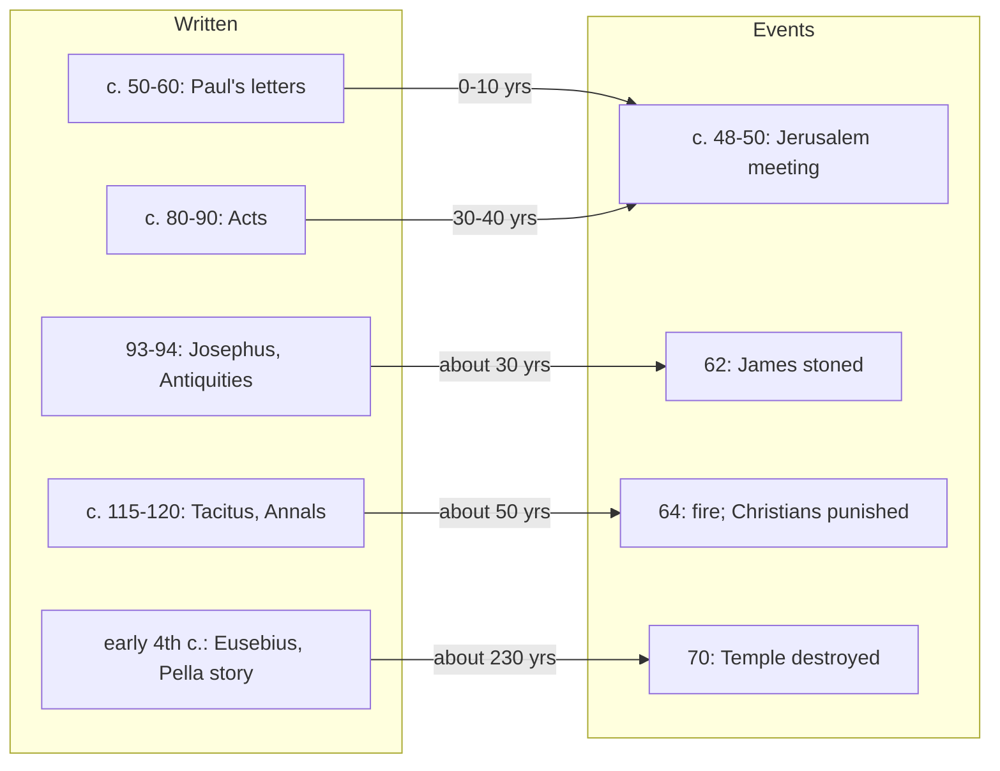

# Church History · Lesson 1.1: The first generation and its sources

> ⏱ ~15 min · Module 1: The apostolic Church to Constantine · Builds on: nothing (course start) · Unlocks: [1.2 Bishops, canon, and the parting of the ways](01-02-bishops-canon-and-the-parting-of-the-ways.md), [1.3 Persecution and martyrdom](01-03-persecution-and-martyrdom.md)

## Why this matters

Between about 30 and 70 a group of Jews in Jerusalem who believed their executed teacher was the Messiah became a network of communities stretching to Rome, with Gentile members, a first martyr among its leaders, and a first Roman persecution behind it. Almost everything later in this course (bishops, Rome's standing, the break with the synagogue) is argued from what happened in those forty years. And almost everything we know about them comes from a handful of texts, most written after the fact by people with a case to make.

This course is written from within the Catholic tradition and held to the standards of professional history. In practice that means one thing: the Church's own sources get the same questions as a Roman senator's. Faith may tell you what the Church *is*; it does not tell you when Paul went up to Jerusalem, or who Nero actually punished. The sources do, and only as far as they can.

## The idea

A source is a witness, and every witness has a position. Ask four questions of any text before you use it:

1. **Author:** who wrote it, and how did they know?
2. **Date:** when was it written, and how long after the events?
3. **Audience:** who was meant to read it?
4. **Purpose:** what was it trying to do to them?

Then the fifth, which is the payoff: **what can it establish, and what can't it?** A hostile witness is good evidence for what his side believed and poor evidence for motives on the other side. A later witness can preserve an early fact, but you need a reason to think it did. These [four questions for a source](../reference.md#four-questions-for-a-source) recur in every lesson.

The first generation is the hardest case because the gap between event and writing is so uneven. Paul writes *during* the story. Acts retells it thirty or more years on. The two Roman historians who mention Christians write fifty years after Nero. The single most useful habit this lesson can give you is to hold two dates for every claim: when it happened, and when someone wrote it down.

## Source

Tacitus, *Annals* 15.44, on the aftermath of the fire of Rome in July 64. Translated by A. J. Church and W. J. Brodribb (1876):

> Consequently, to get rid of the report, Nero fastened the guilt and inflicted the most exquisite tortures on a class hated for their abominations, called Christians by the populace. Christus, from whom the name had its origin, suffered the extreme penalty during the reign of Tiberius at the hands of one of our procurators, Pontius Pilatus, and a most mischievous superstition, thus checked for the moment, again broke out not only in Judaea, the first source of the evil, but even in Rome, where all things hideous and shameful from every part of the world find their centre and become popular. Accordingly, an arrest was first made of all who pleaded guilty; then, upon their information, an immense multitude was convicted, not so much of the crime of firing the city, as of hatred against mankind.

Tacitus goes on to describe the executions, which were staged as public spectacle in Nero's gardens (by beasts, crucifixion and burning), and notes that they stirred pity even among people who despised the victims.

Run the four questions. **Author:** a senator, born about 56, contemptuous of Christians and of Nero alike. **Date:** about 115–120, half a century after the fire. **Audience:** the Roman elite. **Purpose:** in part, to indict Nero. So the passage is strong evidence that an educated Roman of Trajan's time thought of Christians as a despised foreign cult with a founder executed under Pilate, and that he believed Nero had used them as scapegoats. It is weaker evidence for the exact charge in 64: Tacitus himself says the convictions rested less on arson than on "hatred against mankind." One slip shows how his own time shaped the telling: he calls Pilate a *procurator*, the title of his own day; an inscription found at Caesarea in 1961 shows Pilate as *prefect* of Judaea. And notice what he does not give: no number, only "an immense multitude," and no Christian's name.

## The record

The sources, set out with their dates (for Paul's chronology in detail, see [`new-testament`](../../new-testament/syllabus.md) 4.2):

1. **The Jerusalem community (from c. 30).** Acts puts the first community in Jerusalem under the Twelve, with Peter as spokesman. Paul, writing in the 50s, confirms the main figures: he met Peter and "James the brother of the Lord" in Jerusalem about three years after his call (Galatians 1:18–19). Acts 12 has Herod Agrippa I (died 44) execute James son of Zebedee, and Peter leave the city; by the late 40s Paul names James first among the "pillars" (Galatians 2:9). *In words:* the earliest church is a Jewish community in Jerusalem, and its leadership passes from Peter to James, the brother of Jesus, well before 50.
2. **Paul's mission (c. 35–c. 58).** Paul founds mostly Gentile communities across Syria, Asia Minor and Greece. His seven undisputed letters (1 Thessalonians, Galatians, 1–2 Corinthians, Philippians, Philemon, Romans) date between about 50 and 60 and are the earliest Christian documents. One outside anchor fixes the chronology: an inscription at Delphi dates Gallio's governorship of Achaia to about 51–52, and Acts 18 puts Paul before Gallio in Corinth.
3. **The [Jerusalem meeting](../reference.md#jerusalem-meeting) (c. 48–50, disputed).** A dispute over whether Gentile converts must be circumcised and keep the Law of Moses is taken to Jerusalem. Two accounts survive: Paul's own (Galatians 2:1–10) and Luke's (Acts 15). They agree that Gentiles were not required to be circumcised. They differ on almost everything else: whether the meeting was private or public, and whether anything was imposed on Gentile converts (P2 sets the two side by side). The date is reckoned from Paul's "fourteen years" (Galatians 2:1), and it shifts with what he counted from, so give it as a range.
4. **James's death (62).** Josephus, a Jewish historian writing in Rome, reports in the *Antiquities* (completed 93–94) that the high priest Ananus used the gap between two Roman governors to have James, "the brother of Jesus, who was called Christ," stoned; the city's more moderate citizens protested and Ananus was deposed. *In words:* a non-Christian source a generation later confirms James's leadership and his death at the hands of the Temple authorities.
5. **Nero and the Christians of Rome (64).** The fire of July 64 and Tacitus's account (Source). Suetonius, writing about the same time as Tacitus, lists the punishment of Christians among Nero's measures but does not connect it with the fire. The tradition that Peter and Paul died in Rome under Nero is Christian and later; neither Roman historian names them.
6. **The fall of the Temple (70).** The Jewish revolt began in 66; Titus took Jerusalem and the Temple burned in August 70. Sacrifice ended. The Jewish leadership that survived rebuilt Judaism around Torah and synagogue. Vespasian diverted the Temple tax to Jupiter's temple in Rome. For Christians, the mother church lost its city. Eusebius, writing in the early fourth century, reports that the Jerusalem Christians had been warned by an oracle to leave for Pella across the Jordan before the war. Historians divide on whether this [flight to Pella](../reference.md#flight-to-pella) is memory or later legend.

## The gap between event and writing

Read the arrow lengths. Only Paul writes inside the period. Acts is usually dated 80–90 (some scholars place it earlier, some as late as 110). It closes with Paul under house arrest in Rome around 60–62 and says nothing of his death. That silence is itself a dating argument, and scholars read it both ways.

## Worked examples

**Example 1 (clean: what Tacitus establishes).** Question: did Christians exist as a recognizable group in Rome by 64? Tacitus writes fifty years later, but he is hostile, so he has no motive to invent Christians. His details (the founder's name, Pilate, Tiberius, Judaea) match the Christian sources without depending on them in any obvious way. Paul's letter to the Romans, written about 57, confirms independently that a Christian community in Rome was well enough established for Paul to write to it before he had ever visited. Suetonius, writing independently, also puts a punishment of Christians under Nero. Verdict: a Roman Christian community before 64 is secure, and so is some punishment of it under Nero. The size of the community, the numbers killed, and whether "Christian" was already the Roman label for them in 64 are not secured by any of these texts.

**Example 2 (hard: how solid is the Neronian persecution?).** Brent Shaw ("The Myth of the Neronian Persecution," *Journal of Roman Studies*, 2015) pushed the questions of Example 1 as far as they go. Tacitus is the only source connecting Christians with the fire. The passage is probably genuine Tacitus, but it reflects the ideas of Tacitus's own time, when governors like his friend Pliny were trying Christians and the name was familiar, and not the realities of the 60s. On this reading, a mass execution of Christians by Nero is not established. Christopher Jones replied in *New Testament Studies* (2017). He argued that the name "Christian" is attested in the first century, that Romans shows a sizeable community in the city, and that Tacitus had good access to earlier information. There is no ground, Jones argued, to doubt the report.

The [crux](../reference.md#neronian-persecution) is not whether Tacitus is hostile (both agree) but whether a detail found in only one source, written fifty years later, can be trusted when it fits the writer's own world so well. Suetonius cuts both ways. He confirms punishment under Nero, independently of Tacitus, but his silence about the fire is exactly the gap Shaw points to. Most historians still accept a Neronian persecution confined to Rome. The course takes that as its working account and carries Shaw's objection with it.

## Watch out

- **Acts 15 is not "the first ecumenical council."** The later name "Council of Jerusalem" invites reading Nicaea back into it. It was a meeting of one community's leaders with delegates from Antioch, and the two surviving accounts do not even agree on what it decided.
- **Nero's persecution was local.** Every early source puts it in Rome. There was no empire-wide law against Christians in 64. How persecution actually worked, city by city and governor by governor, is [1.3](01-03-persecution-and-martyrdom.md).
- **"Later" is not "false," and "early" is not "true."** Paul is early but a party to the dispute he narrates ("I withstood him to the face," Galatians 2:11). Josephus is late but has no stake in James. Weigh proximity and interest separately.
- **Reading Acts as a source is not a doctrinal problem.** Inspiration, as the Church teaches it, works through true human authors writing in a genre ([`fundamental-theology` 3.1](../../fundamental-theology/lessons/03-01-inspiration.md)). What that means for discrepancies that remain once genre is accounted for is disputed among Catholic theologians ([`fundamental-theology` 3.2](../../fundamental-theology/lessons/03-02-inerrancy.md)). The historian's task here is narrower: what each text can establish.

## One-liner

> For the first Christian generation, hold two dates for every claim: when it happened and when someone wrote it down. Only Paul closes the gap, and Paul is a party to every quarrel he reports.

## Problems

**P1 (🟢) *(Exegetical.)*** Suetonius, *Nero* 16.2 (trans. J. C. Rolfe, 1914), in a list of Nero's regulations:

> Punishment was inflicted on the Christians, a class of men given to a new and mischievous superstition.

(a) Name one thing this sentence corroborates in Tacitus's account (Source) and one thing it does not. (b) Suetonius wrote around 120. Does his sentence count as an early, independent witness to the events of 64? Two sentences or fewer per part.

**P2 (🟡) *(Exegetical (a) · Evaluative (b).)*** Two accounts of what was asked of Gentile converts, both in the Douay–Rheims:

> Acts 15:28–29: "For it hath seemed good to the Holy Ghost and to us, to lay no further burden upon you than these necessary things: That you abstain from things sacrificed to idols, and from blood, and from things strangled, and from fornication."

> Galatians 2:9–10: "James and Cephas and John, who seemed to be pillars, gave to me and Barnabas the right hands of fellowship: that we should go unto the Gentiles, and they unto the circumcision: Only that we should be mindful of the poor."

(a) State exactly what each passage says was required of Gentile converts, and name the word in each that marks it as the *whole* requirement. (b) A textbook says: "In 49 the Council of Jerusalem settled the Gentile question for the whole Church." Evaluate the sentence against the evidence of this lesson, including what Paul reports next (Galatians 2:11–14). Any verdict. 150 words or fewer.

**P3 (🔴, optional) *(Exegetical.)*** An invented museum placard:

> "In 64 AD Emperor Nero, blaming Christians for the Great Fire, launched the first empire-wide persecution, in which the apostles Peter and Paul were martyred. The historian Tacitus, who witnessed these events, describes crowds of Christians executed as arsonists."

Identify four distinct errors or unsupported claims and correct each from the lesson. 150 words or fewer.

Solutions

**P1** *(Exegetical.)*

**Must hit, strict (a):** corroborates: Christians were punished under Nero, and a Roman writer saw them as a new and mischievous superstition (compare Tacitus's "most mischievous superstition"). Does not corroborate: any link to the fire. Suetonius places the punishment among Nero's regulations, not in his account of the fire. He also gives no number, no method, and no connection to Pilate or Judaea.
**Must hit, strict (b):** it is not early: it was written some fifty-five years after the events, at the same time as Tacitus. It is probably independent of Tacitus, because it does not share his framing. So it is a second late witness, not an early one. Two late witnesses that agree on a bare fact (punishment under Nero) strengthen that fact. They do nothing for details only one of them reports.
**Wrong turns:** treating the shared word "superstition" as proof that one copied the other (it was the ordinary Roman word for a foreign cult); treating Suetonius as confirming the fire charge.
**Model answer:** (a) It corroborates that Nero punished Christians and that Romans regarded them as a new, pernicious superstition. It does not corroborate the fire: Suetonius lists the punishment as one of Nero's police measures and never connects it to the blaze. (b) No. It is late, written about 120 like Tacitus. It is probably independent of him, so it confirms the bare punishment under Nero, but not the scapegoating or the scale.

---

**P2** *(Exegetical (a) · Evaluative (b).)*

**Must hit, strict (a):** Acts: abstaining from four things (food sacrificed to idols, blood, strangled meat, fornication), with no circumcision. Its limiting words are "no further burden … than these necessary things." Galatians: nothing but remembering the poor, and a division of mission (Gentiles to Paul and Barnabas, the circumcised to the pillars). Its limiting word is "Only." Both deny that circumcision was required. They differ on whether food and purity rules were imposed.
**Must hit, any verdict (b):** (i) The date "49" is too exact. The meeting is c. 48–50, and the date is disputed. (ii) Galatians 2:11–14 shows that shared meals between Jewish and Gentile believers at Antioch were unsettled *after* the meeting: Peter withdrew when "some came from James." (iii) A meeting of one community's leaders is not "the whole Church" in any institutional sense. (iv) Say what *was* settled, on both accounts: circumcision was not required of Gentiles. A defensible verdict either way distinguishes the circumcision question, which was settled, from table fellowship, which was not.
**Wrong turns:** harmonizing the texts by assuming Paul simply left the decree out, without saying so as a hypothesis; treating Galatians as neutral because it is earlier; calling the meeting an ecumenical council.
**Model answer (b), one of several:** Half right. Both accounts agree that the meeting freed Gentile converts from circumcision. But "49" should be "c. 48–50," and "settled" overstates it. By Paul's own account, the meeting settled circumcision and nothing about shared meals. Soon after, at Antioch, Peter stopped eating with Gentiles when men came from James, and Barnabas followed him. Whether Gentiles had to keep any food laws depends on which account you trust: Acts has the four abstentions and Galatians says "only" the poor. "The whole Church" also reads a later institution back into what was a meeting between Jerusalem and Antioch.

---

**P3** *(Exegetical.)*

**Must hit, strict:** any four of: (1) **Tacitus was not a witness.** He was born about 56, a small child in 64, and wrote around 115–120. (2) **It was not empire-wide.** All the early evidence puts the punishment in Rome, and there was no general law in 64 (1.3). (3) **Peter and Paul are not in Tacitus** or Suetonius. Their deaths in Rome under Nero rest on later Christian tradition. (4) **"Executed as arsonists" misreads Tacitus.** He says they were convicted "not so much" of arson as of "hatred against mankind." (5) **"Blaming Christians for the fire" rests on Tacitus alone.** Suetonius does not make the link, and Shaw doubts it (Jones replies). A placard should say "according to Tacitus."
**Wrong turns:** "correcting" the placard by saying the persecution never happened, which states Shaw's minority view as fact; counting "64 AD" as an error (the fire is July 64).
**Model answer:** Tacitus was not an eyewitness: he was born about 56 and wrote around 115–120. The persecution was confined to Rome, and no empire-wide measure existed in 64. Neither Tacitus nor Suetonius names Peter or Paul; their martyrdom under Nero is later Christian tradition. Tacitus says the victims were condemned less for arson than for "hatred against mankind," so "executed as arsonists" is wrong. And the fire connection comes from Tacitus alone, since Suetonius records the punishment without it, so the placard should attribute that claim to him.

## Connections

- **Backward:** none inside this course. The historical Jesus and the formation of the canon belong to [`new-testament`](../../new-testament/syllabus.md). That course reads Acts as ancient historiography (4.1) and rebuilds Paul's chronology from the Gallio anchor (4.2); here both are only sources for community history.
- **Forward:** [1.2](01-02-bishops-canon-and-the-parting-of-the-ways.md) picks up the Jerusalem church's loss of its centre after 70 and the slow parting of church and synagogue. It also reads 1 Clement, the first text to allude to Peter's and Paul's deaths. [1.3](01-03-persecution-and-martyrdom.md) asks why Rome punished Christians at all, beginning where Tacitus's "hatred against mankind" leaves off.
- **Sideways:** the move in Example 2 of naming the single premise two scholars disagree on is taught as a method in [`philosophical-method` 4.3](../../philosophical-method/lessons/04-03-finding-the-crux.md). The Fathers as historians, Eusebius first among them, are read in [`patristics`](../../patristics/syllabus.md).
