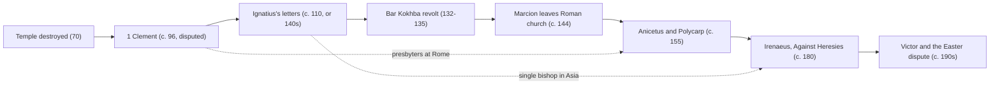

# Church History · Lesson 1.2: Bishops, canon, and the parting of the ways

> ⏱ ~15 min · Module 1: The apostolic Church to Constantine · Builds on: [1.1 The first generation and its sources](01-01-the-first-generation-and-its-sources.md) · Unlocks: [1.3 Persecution and martyrdom](01-03-persecution-and-martyrdom.md), and the primacy thread in [2.2](02-02-ephesus-chalcedon-and-leos-rome.md)

## Why this matters

In 70 the Temple fell. The Christians who survived had apostles' memories, some letters, and house meetings in a few dozen cities. By about 200 they had a single bishop in each city, lists of those bishops running back to the apostles, a working sense of which books were scripture, and an identity that was no longer a branch of Judaism. Every later argument about the Church's structure goes back to these 130 years. That includes the argument about what the bishop of Rome is. The sources are few, and most of them were written by people who needed the answer to come out a particular way.

## The idea

Think of the second century as a Church responding to crises. Structure grew to meet them. It was not rolled out according to a plan.

- **A quarrel at Corinth** (the letter called 1 Clement): who may remove a church's leaders?
- **Rival teachers** (Marcion, the Gnostics): whose teaching is the apostles' teaching? Irenaeus's answer was a *public* chain of teachers, one after another in each city, open to anyone to check. That is the origin of the **succession list**.
- **A calendar dispute** (the date of Easter): can one church cut off another over a custom?
- **Separation from the synagogue**, which was not one crisis but many, at different speeds in different places.

The single bishop, the succession list and the canon were answers to these crises. That is why the evidence is uneven: we see the structure where it was contested, and not elsewhere. Rome is the hard case. It is the church with the most later weight resting on it, and the evidence suggests it came *late* to having a single bishop.

## Source

Irenaeus of Lyons, *Against Heresies* III.3.2, written about 180. The Greek original of this passage is lost. What survives is an early Latin translation, whose key clause reads *Ad hanc enim ecclesiam propter potiorem principalitatem necesse est omnem convenire ecclesiam*. Here are two public-domain English renderings. The first is the *Ante-Nicene Fathers* translation (1885):

> "For it is a matter of necessity that every Church should agree with this Church, on account of its pre-eminent authority, that is, the faithful everywhere, inasmuch as the apostolical tradition has been preserved continuously by those [faithful men] who exist everywhere."

The second is the rendering by the Catholic writers Berington and Kirk, which the same edition prints in a footnote:

> "For to this Church, on account of more potent principality, it is necessary that every Church (that is, those who are on every side faithful) resort; in which Church ever, by those who are on every side, has been preserved that tradition which is from the apostles."

Three choices decide how you read it:

1. ***Convenire*** can mean "agree with" or "come together at, resort to."
2. ***Potiorem principalitatem***: whose "more powerful origin" or "pre-eminent authority" is this? Rome's as a church, or the apostles Peter and Paul who founded it?
3. **"In qua"** ("in which"): is the tradition preserved in Rome, or in "every church"?

The ANF translators admitted in a footnote that they were far from sure their rendering was right. The volume's Episcopalian editor, A. Cleveland Coxe, added a bracketed note reading the passage his way: Rome as a mirror that gathered everyone's faith, not a sun that gave out its own. The same Latin supports a claim about Roman authority or a claim about Rome as a meeting-point of witnesses. The words themselves do not settle which.

## The record

1. **1 Clement** (conventionally c. 96, late in Domitian's reign). The date is disputed. Thomas Herron argued for about 70, and L. L. Welborn allows anywhere from 80 to 140. The letter is sent from "the church of God which sojourns at Rome" to Corinth, where some presbyters had been removed. It carries no author's name. Dionysius of Corinth, about 170, is the first to connect it with Clement (Eusebius, *HE* 4.23.11). It uses "bishops" and "presbyters" for the same office (chs. 42–44). Its tone is firm: it warns that anyone who disobeys what God has said through the Roman church is in danger (ch. 59). *In words:* one church admonishes another with confidence, and no single bishop of Rome appears.
2. **Ignatius of Antioch's letters** are traditionally placed under Trajan (98–117), usually about 110. T. D. Barnes (2008) argued for the 140s. On his way to martyrdom in Rome, Ignatius wrote to churches in Asia Minor that each had one bishop over presbyters and deacons: "Wherever the bishop shall appear, there let the multitude [of the people] also be" (*Smyrnaeans* 8). His letter to Rome names no bishop there. It greets a church that "presides over love." Which letters are genuine is a question for [`patristics`](../../patristics/syllabus.md) 1.3.
3. **The Shepherd of Hermas** is Roman and from the first half of the century, though its date is uncertain. It speaks of presbyters who preside over the church and gives a certain Clement the job of sending writings to foreign churches (*Vision* 2.4). *In words:* a college of presbyters, one of whom handles letters abroad.
4. **Marcion**, a shipowner from Sinope, broke with the Roman church about 144. The church returned his large gift; Tertullian says 200,000 sesterces. He rejected the Jewish scriptures and the God they describe, and kept an edited Luke and ten letters of Paul. His churches spread widely. How far he pushed others toward a canon belongs to [`new-testament`](../../new-testament/syllabus.md) 6.6. Here he matters as an event: a rival church with its own scripture.
5. **Anicetus and Polycarp**, about 155. The bishop of Smyrna visited Rome. The two men disagreed about when to keep Easter, did not persuade each other, and stayed in communion (Eusebius, *HE* 5.24.16–17).
6. **Irenaeus's list**, about 180. Against Gnostics who claimed a secret tradition, Irenaeus points to the public [succession lists](../reference.md#succession-lists) and gives Rome's: Linus, Anacletus, Clement, down to Eleutherius, the twelfth from the apostles (III.3.3).
7. **Victor I** (c. 189–198). Churches in Asia ended the paschal fast on the 14th of the Jewish month Nisan, whatever the day of the week. Synods from Palestine to Gaul backed Sunday. Polycrates of Ephesus refused, though he had convened his bishops "at your desire," that is, at Victor's request. Victor then tried to cut the Asian churches off from communion. Several bishops rebuked him, Irenaeus among them (*HE* 5.23–24). We do not know how the [Quartodeciman controversy](../reference.md#quartodeciman-controversy) ended in Asia.

## Timeline

The dotted edges mark the lesson's main problem. In Asia the [monepiscopate](../reference.md#monepiscopate) (one bishop per city) is attested early. At Rome the evidence points to a college of presbyters until around the time of Anicetus.

## Worked examples

**Example 1 (clean: what Irenaeus's list can prove).** Ask of the list what [1.1](01-01-the-first-generation-and-its-sources.md) taught you to ask of any source: who wrote it, when, and for what purpose? Irenaeus writes about 180, against opponents who claimed secret teaching. His argument needs a *public* line of teachers in a known church, and the list supplies one. That much it proves: by 180, Rome had a remembered, ordered line of leaders that it could name and that outsiders could check. It does not prove that Linus or Clement governed as single bishops. Peter Lampe (*From Paul to Valentinus*; German 1987, English 2003) read the Roman evidence of 1 Clement and Hermas as showing a city of scattered house churches, each led by presbyters, loosely coordinated. On his reading, a single bishop emerged only in the second half of the century, and Victor was the first to act decisively as one. Earlier names on the list would then be leading presbyters, or the college's secretaries for foreign letters, which is Clement's role in Hermas. Irenaeus himself gives some support to this reading. In his letter to Victor he calls Anicetus, Pius, Hyginus, Telesphorus and Xystus "the presbyters before Soter, who presided over the church which you now rule" (*HE* 5.24.14). Lampe's is not only a Protestant reading. The Jesuit Francis Sullivan (*From Apostles to Bishops*, 2001) accepts that presbyters led Rome for at least part of the century. He then argues that the episcopate's emergence was a development Catholics can still call apostolic. Whether it is is the theological question, and [`fundamental-theology` 5.2](../../fundamental-theology/lessons/05-02-newmans-theory-of-development.md) supplies the tool for it.

**Example 2 (hard: Easter as a border).** The Quartodeciman dispute is usually told as a story about primacy. It is also a story about the [partings of the ways](../reference.md#partings-of-the-ways). Polycrates kept Easter "the day when the people put away the leaven." He meant by the Jewish reckoning of Passover, and he claimed John and Philip as authorities for it. Victor's Sunday rule cut Easter loose from the Jewish calendar. Two readings follow, and they point in different directions. James Dunn (*The Partings of the Ways*, 1991) used the plural deliberately. On his account the break came pillar by pillar, over Temple, Torah, election and above all Christology, and for most purposes it was complete after the Bar Kokhba revolt (132–135). For Dunn, Victor is tidying up the calendar of a church that had already separated. Daniel Boyarin (*Border Lines*, 2004) argues that the border was *drawn*, not discovered. Heresiologists such as Justin and Irenaeus, and the rabbis on their side, created two religions out of a spectrum of practice, and ordinary believers mixed well into the fourth century. For Boyarin, Victor's campaign is border-drawing from above, and it shows the border still needed drawing in the 190s. The same episode is evidence for both readings. What decides between them is the evidence about ordinary believers, which the bishops' letters do not give us.

**Primacy: what this era shows, what it doesn't.** The evidence: Rome admonishes Corinth, possibly unasked; Ignatius honours a church "presiding over love"; Irenaeus's clause; an Asian synod convened at Victor's request, and his attempt to excommunicate a whole region. The limits: no named single bishop at Rome until the mid-century; the letters come from a *church*, not from a person; Victor was resisted and rebuked. Readings differ. Catholic historians such as Klaus Schatz (*Papal Primacy*, 1990; English 1996) grant that no Christian in 100 or 200 would have called Rome's bishop head of all Christians. They still read a Roman sense of responsibility for other churches, and other churches' sense that Roman communion mattered, as the seed of the later office. The Orthodox theologian Nicholas Afanasiev ("The Church Which Presides in Love," 1960) read Ignatius as describing a primacy of witness and love among equal eucharistic churches, not one of jurisdiction. Many Protestant historians explain Rome's standing by its size, its wealth, its capital-city position and the graves of Peter and Paul. On that view, the rebukes of Victor are the telling evidence. What the record proves theologically is argued in [`ecclesiology-and-mariology`](../../ecclesiology-and-mariology/syllabus.md) 4.2 and [`apologetics-catholic-claims`](../../apologetics-catholic-claims/syllabus.md) 4.2, not here.

## Watch out

- **"Pope Clement" is a later office projected backwards.** Irenaeus's list is a document of 180. Treating its early names as monarchical bishops assumes the thing Lampe disputes.
- **One word, two offices.** In 1 Clement, "bishop" (*episkopos*) and "presbyter" name the same people. When you see "bishop" before about 150, check what it means in that text before assuming it means the office of a single bishop.
- **The parting did not happen in one year.** 70 is not the date, and neither is 135. Dunn's plural and Boyarin's late date agree on one thing: there is no single moment.
- **"Attempted" is not "accomplished."** Eusebius says Victor *attempted* to cut Asia off. The sources do not say the excommunication took effect.

## One-liner

> By 200 the Church had bishops, lists and a scripture, and it had them because it was fighting over them; Rome's pre-eminence is visible in the fights, and so is the resistance to it.

## Problems

**P1 (🟢) *(Exegetical.)*** An invented museum placard:

> "ROME, AD 67–100. After St Peter's martyrdom, Linus, Anacletus and Clement governed the Roman Church in turn, each as sole bishop, as the Pope does today. The churches of the whole world obeyed their letters: Clement's letter to Corinth, signed with his name in AD 96, proves it. By then the Christians had long since left the synagogue; the break came when the Temple fell in AD 70."

Identify **three** claims on the placard that the evidence in this lesson does not support. For each, name the evidence that counts against it. Two sentences per claim.

**P2 (🟡) *(Exegetical (a) · Evaluative (b).)*** Eusebius, *Church History* 5.24.9–10 and 5.24.14 (NPNF translation, 1890). The second paragraph quotes Irenaeus's letter to Victor:

> "Thereupon Victor, who presided over the church at Rome, immediately attempted to cut off from the common unity the parishes of all Asia, with the churches that agreed with them, as heterodox; and he wrote letters and declared all the brethren there wholly excommunicate. But this did not please all the bishops. And they besought him to consider the things of peace, and of neighborly unity and love. Words of theirs are extant, sharply rebuking Victor."
>
> "Among these were the presbyters before Soter, who presided over the church which you now rule. We mean Anicetus, and Pius, and Hyginus, and Telesphorus, and Xystus. They neither observed it themselves, nor did they permit those after them to do so. And yet though not observing it, they were none the less at peace with those who came to them from the parishes in which it was observed..."

(a) What does the first paragraph establish that Victor did, and what does it leave open? Name the words that decide each. What does Irenaeus call Victor's predecessors, and why does that matter for Lampe's thesis? Four sentences or fewer.
(b) Does the episode better support the reading that other churches recognized a special Roman authority, or the reading that they did not? Any verdict. 150 words or fewer.

**P3 (🔴, optional) *(Exegetical.)*** (a) Name the crux between Dunn and Boyarin on the partings of the ways: the premise about the sources that one side must deny. (b) Name one kind of evidence from *outside* bishops' and rabbis' writings about identity that would move the question, and say which way a given finding would push it. 150 words or fewer in total.

Solutions

**P1** *(Exegetical.)*

**Must hit, strict:** any three of these five, each with its evidence.
(i) **"Each as sole bishop."** 1 Clement names no bishop of Rome and uses "bishops" and "presbyters" for the same office. Hermas has presbyters presiding. Irenaeus calls even Anicetus and his predecessors "presbyters." Lampe, and the Catholic Sullivan, hold that Rome was led by presbyters for at least part of the second century. The list itself dates from about 180.
(ii) **"Signed with his name."** The letter is sent from "the church of God which sojourns at Rome" and names no author. The link to Clement first appears with Dionysius of Corinth about 170, and then in Irenaeus.
(iii) **"In AD 96."** The date is conventional and disputed: Herron argues about 70, and Welborn allows 80 to 140.
(iv) **"The whole world obeyed."** We have one letter to one church. Its later reading at Corinth (Dionysius) shows esteem there, not obedience everywhere. When Victor later tried to impose a Roman ruling, bishops rebuked him.
(v) **"The break came in AD 70."** Dunn's partings run to at least 135 and play out issue by issue. Boyarin puts the settled border in the fourth century. Neither gives a single date.
**Wrong turns:** objecting to "St Peter's martyrdom" at Rome, which the lesson does not dispute; calling the whole list "invented," when the lesson says it shows a remembered order, not that the names were fictions; answering "Pope is anachronistic" with no evidence.
**Model answer:** (1) The claim that each man was sole bishop outruns the evidence. 1 Clement names no bishop and treats bishops and presbyters as one office, and Hermas and even Irenaeus speak of Roman presbyters presiding; Lampe dates a single bishop at Rome to after about 150. (2) The letter is not signed. It comes from "the church ... at Rome," its link to Clement is first attested around 170, and 96 is a disputed conventional date. (3) The Temple's fall did not end the relationship. Dunn traces partings to at least 135 and Boyarin to the fourth century, so no single year marks the break.

---

**P2** *(Exegetical (a) · Evaluative (b).)*

**Must hit, strict (a):** Victor *issued* a declaration: "he wrote letters and declared all the brethren there wholly excommunicate." Whether it took effect is left open. The words that decide this are "attempted" and "this did not please all the bishops," and the text reports no withdrawal and no enforcement. Irenaeus calls the earlier Roman leaders **"presbyters"** who "presided." That fits Lampe's college of presbyters. It does not prove it, because in *Against Heresies* III.3.3 Irenaeus places the same men in "the episcopate," so his terms are fluid.
**Must hit, any verdict (b):** (1) Weigh evidence on both sides. For recognition: Polycrates convened his bishops "at your desire," and synods across the Church sided with Rome's practice; Victor assumed that exclusion from Roman communion was a serious sanction; Irenaeus argues from Roman precedent rather than denying Victor any standing. Against: Polycrates defied him openly, bishops "sharply" rebuked him, and there is no evidence the ruling was enforced. (2) Separate *claiming* authority from its being *acknowledged*. (3) Note the source problem: Eusebius writes more than a century later, and the letters he summarizes are lost. (4) Say what would move the verdict, for example evidence of how the Asian churches were treated afterwards.
**Wrong turns:** treating "declared ... excommunicate" as proof that Asia *was* excommunicated; reading Irenaeus's rebuke as a denial that Rome had any role, when his argument is about the wisdom of the act, and he still pleads with Victor; settling the theological meaning of primacy, which belongs to other courses.
**Model answer (a):** Eusebius establishes that Victor wrote letters declaring the Asian churches excommunicate. With "attempted" and "this did not please all the bishops," he leaves open whether anyone treated the sentence as binding. Irenaeus calls Anicetus and the others "presbyters" who presided. That fits Lampe's picture of a presbyteral college, though Irenaeus elsewhere puts the same men in the episcopate.
**Model answer (b), one of several:** The episode shows a Roman *claim* more clearly than its *acceptance*. Synods from Palestine to Gaul took up the question, and even the defiant Polycrates convened his bishops "at your desire." So Rome could set a wider agenda, and its communion was worth threatening. But the decisive act, cutting off a whole region, was openly resisted and sharply rebuked, including by Irenaeus, who appealed to earlier Roman practice against it. Nothing shows the sentence was enforced. I read it as Rome having recognized leadership in initiative but not an accepted power to exclude. The lost letters, or any evidence of later relations between Rome and Asia, could change that.

---

**P3** *(Exegetical.)*

**Must hit, strict (a):** The crux is whether the separating texts **describe** a social separation that had already happened (Dunn), or **try to create** one that ordinary practice had not yet made (Boyarin). Boyarin must deny that heresiologists' and rabbis' boundary statements are reliable evidence of what ordinary communities did. Dunn must hold that, read with care, they largely are.
**Must hit, strict (b):** evidence of ordinary practice. Examples: sermons or canons that complain about Christians keeping Jewish feasts or attending synagogue (such complaints still appear in fourth-century Antioch); inscriptions or burials that mix Jewish and Christian markers; Christians still reckoning Easter by the Jewish calendar. Plenty of such evidence late in time pushes toward Boyarin. Its absence after the mid-second century pushes toward Dunn.
**Wrong turns:** making the crux the date alone (135 versus the fourth century), which is a consequence of the disagreement, not its premise; proposing more bishops' letters as the deciding evidence, which is the very kind of source in dispute.
**Model answer:** (a) Dunn reads the separating texts as reports: Christians and Jews really did divide over Christology, Torah and Temple, mostly by 135. Boyarin reads them as programmes: border-drawers like Justin, Irenaeus and the rabbis were trying to produce a separation that everyday practice had not made. The premise at issue is whether those texts describe practice or prescribe it. (b) Evidence of ordinary practice would move it: complaints in sermons and canons about Christians keeping Jewish feasts, or mixed burial inscriptions. If such evidence is common in the fourth century, the border was still being drawn, as Boyarin says. If it has thinned out by the late second century, Dunn's earlier parting stands.

## Connections

- **Backward:** [1.1](01-01-the-first-generation-and-its-sources.md) introduced source criticism and the fall of the Temple. This lesson applies them to the first texts the Church wrote about itself.
- **Forward:** [1.3](01-03-persecution-and-martyrdom.md) sets this organizing Church against Roman persecution. Ignatius was travelling to his death when he wrote. The primacy thread continues in [2.2](02-02-ephesus-chalcedon-and-leos-rome.md) with Leo I and canon 28, and the East–West side of it in [4.2](04-02-east-and-west-the-long-estrangement.md).
- **Sideways:** 1 Clement, Ignatius and Irenaeus read as theologians belong to [`patristics`](../../patristics/syllabus.md) (1.2, 1.3, 2.1), whose Boss 2 does the full textual work on Irenaeus III.3.2. Marcion and the canon belong to [`new-testament`](../../new-testament/syllabus.md) 6.6. Whether the second-century record supports Catholic primacy is argued in [`ecclesiology-and-mariology`](../../ecclesiology-and-mariology/syllabus.md) 4.2 and [`apologetics-catholic-claims`](../../apologetics-catholic-claims/syllabus.md) 4.2. Justin's *Dialogue with Trypho*, a border-drawing text in Boyarin's sense, is read in [`apologetics-foundations`](../../apologetics-foundations/syllabus.md) 6.1.
