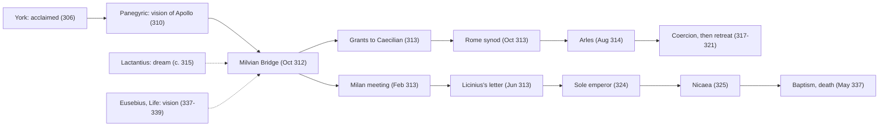

# Church History · Lesson 1.4: Constantine

> ⏱ ~15 min · Module 1: The apostolic Church to Constantine · Builds on: [1.3 Persecution and martyrdom](01-03-persecution-and-martyrdom.md) · Unlocks: [2.1 Nicaea and the imperial Church](02-01-nicaea-and-the-imperial-church.md)

## Why this matters

In 303 the Roman state began its most systematic attempt to destroy the Church ([1.3](01-03-persecution-and-martyrdom.md)). Ten years later an emperor was returning its confiscated buildings, paying its clergy and asking its bishops to settle its quarrels. Everything in Module 2, from imperial councils to a Church that could call on the state against its dissenters, starts here. So two questions matter. What did Constantine actually do for the Church? And did he believe, or did he calculate? The second has divided historians for 170 years, and it is a model case of what sources can and cannot settle.

## The idea

Constantine (born c. 272; the year is disputed) was acclaimed emperor by his father's army at York on 25 July 306. Six years of civil war followed among rival emperors. On 28 October 312 he defeated Maxentius at the Milvian Bridge outside Rome, and from then on he openly favoured the Christians.

Three things came out of that favour, and they are easier to establish than his inner life:

1. **Legal security and restitution (313).** Toleration itself was not new: the dying Galerius had already ended the persecution by edict on 30 April 311. What 313 added was the return of confiscated property and an explicit grant of free worship to everyone.
2. **Money and privilege.** Grants to clergy, and exemption from the costly civic duties that fell on town notables.
3. **The emperor as referee.** Once the state hands out privileges to "the catholic Church", it has to decide who that is. That question reached Constantine within months, from Africa.

The conversion itself survives in two Christian accounts that disagree. Reading them against each other is the core skill of this lesson.

## Source

Two public-domain translations (ANF 7 and NPNF II/1). First, **Lactantius**, *On the Deaths of the Persecutors* 44, written c. 314–315 by a Christian rhetorician close to the court (he later tutored Constantine's son Crispus):

> Constantine was directed in a dream to cause the heavenly sign to be delineated on the shields of his soldiers, and so to proceed to battle. He did as he had been commanded, and he marked on their shields the letter Χ, with a perpendicular line drawn through it and turned round thus at the top, being the cipher of Christ.

Second, **Eusebius of Caesarea**, *Life of Constantine* 1.28, written between the emperor's death in 337 and Eusebius's own c. 339:

> the victorious emperor himself long afterwards declared it to the writer of this history ... and confirmed his statement by an oath ... He said that about noon, when the day was already beginning to decline, he saw with his own eyes the trophy of a cross of light in the heavens, above the sun, and bearing the inscription, Conquer by this.

Read them as a historian does. Lactantius wrote within about three years of the battle and reports a **dream** and a **sign on shields**. Eusebius wrote a quarter-century later and reports a **daylight vision** seen by the whole army. In 1.29 he adds a dream in which Christ appeared with the sign and told him to copy it, and in 1.30–31 a jewelled standard, the [labarum](../reference.md#labarum). His source was Constantine's own memory, told "long afterwards". Most tellingly, Eusebius's *Church History* 9.9, written much earlier, narrates the same battle with Constantine praying to God and Christ but with **no vision at all**.

## What happened

The events, in order:

1. **312, 28 October: the Milvian Bridge.** Maxentius's army is broken and he drowns in the Tiber. Both Christian sources say Constantine fought under a Christian sign. *In words:* the victory is real; its religious framing comes from sources written later.
2. **313, February: Milan.** Constantine meets his fellow emperor Licinius. **13 June 313:** Licinius posts at Nicomedia a letter to provincial governors. It grants Christians "and all others" free worship and orders the restitution of Church property. Lactantius (*Deaths* 48) and Eusebius (*Church History* 10.5) preserve it in slightly different forms.
3. **Why "the [Edict of Milan](../reference.md#edict-of-milan)" is a misnomer.** No edict was issued at Milan. The surviving text is Licinius's instruction to his eastern governors, which put into effect a policy agreed at Milan and already in force in Constantine's West. *In words:* a policy, a meeting and a letter, later given the name of a law.
4. **313: the grants, and the African question.** Constantine sends money to Caecilian, bishop of Carthage, and exempts from civic duties the clergy "in the catholic Church, over which Cæcilianus presides" (*Church History* 10.6–7). But Caecilian's consecration (c. 311–312; the date is disputed) was contested. His opponents said a consecrating bishop, Felix of Aptunga, had been a [traditor](../reference.md#traditor), one who handed over scriptures in the persecution. They set up a rival bishop, Majorinus, soon succeeded by Donatus. This is the [Donatist schism](../reference.md#donatist-schism).
5. **313–316: bishops judge, the emperor enforces.** The Donatists appeal to Constantine. He refers the case to a synod at Rome under Bishop Miltiades (October 313), which finds for Caecilian. On a second appeal he summons the Council of Arles (opened 1 August 314), which also rules against them, and then decides the case himself for Caecilian (316). *In words:* Constantine's instinct was to have bishops decide, and his own judgment followed theirs.
6. **317–321: coercion, then retreat.** Donatist churches are confiscated and there is bloodshed. By 321 Constantine gives up and urges Catholics to patience. The schism outlives the Western empire in Africa.
7. **324–337: sole emperor.** He defeats Licinius (324), summons Nicaea (325, the subject of [2.1](02-01-nicaea-and-the-imperial-church.md)), dedicates Constantinople (330), and is **baptized on his deathbed** near Nicomedia by its bishop, Eusebius of Nicomedia, dying on 22 May 337. Eusebius of Caesarea does not name the baptizer; Jerome's *Chronicle* does.

## Timeline

Solid arrows are the order of events; dashed arrows are sources reporting on the battle. Note how far the Eusebian account sits from the event.

## The rival reconstructions

The [sincerity debate](../reference.md#burckhardt-vs-barnes-on-constantine), set out as positions:

1. **Burckhardt**, *Die Zeit Constantins des Grossen* (1853): Constantine was essentially unreligious, a genius of power who backed the Church because it was organized and useful. Evidence his side points to: the Sol Invictus coinage that runs into the 320s, a law of March 321 honouring the day of the Sun, the executions of his son Crispus and his wife Fausta (326), and the late baptism. He dismissed Eusebius as a panegyrist. *In words:* judge him by his acts, and the acts are a politician's.
2. **Barnes**, *Constantine and Eusebius* (1981): from 312 Constantine considered himself a Christian and pursued a consistently Christian policy. Barnes even argued for a ban on pagan sacrifice after 324, a reading many historians reject. *In words:* the conversion was real and early, and the policy followed it.
3. **Middle positions.** Alföldi, *The Conversion of Constantine and Pagan Rome* (1948): a sincere convert in 312, but a superstitious one, whose understanding of his new God grew only slowly. Drake, *Constantine and the Bishops* (2000): whatever his private faith, his *policy* sought consensus, a broad monotheism that pagans could live with, and he tried to hold back militant Christians as well as persecutors. *In words:* sincerity and calculation are not rivals, and the belief can be real while the policy is cautious.

Modern scholarship has largely abandoned Burckhardt's cynic, but not his question. What divides the positions is less the evidence than how to read it. Is political usefulness evidence *against* belief? Does solar imagery mean paganism, or a Christ imagined as the true Sun?

## Worked examples

**Example 1 (clean): what the Donatist affair shows about Constantine's Church.**

Follow the chain. The grant of 313 named a beneficiary: the church "over which Cæcilianus presides". A rival party now had a material reason, not only a theological one, to dispute who the true Church was. And the only authority able to decide a question of state privilege was the state. Constantine did not invent the dispute; his patronage made it his problem. His response set the pattern for the century. He referred the question to bishops (Rome, then Arles), accepted their verdict, and enforced it with state power when persuasion failed. Enforcement did not end the schism. The Donatists concluded that a persecuting emperor proved they were the true Church of the martyrs. That argument is taken up in [`patristics`](../../patristics/syllabus.md), whose syllabus reads Augustine's letters on coercing them. Whatever Constantine believed, the institutional result is clear: an emperor who funds the Church will be asked to define it.

**Example 2 (hard): one vision or two?**

A Latin panegyric delivered in Gaul in 310, two years *before* the Milvian Bridge, says Constantine saw Apollo, with Victory, offering him laurel wreaths promising a long reign, at a temple of Apollo, a god closely tied to the sun. Peter Weiss ("The Vision of Constantine", 2003) proposed that this and Eusebius's cross "above the sun" are **the same event**: a solar halo, a real atmospheric phenomenon that can show rings and cross-like bars of light, seen by the army in 310. A pagan orator read it as Apollo in 310. Constantine, looking back as a Christian decades later, read it as Christ. Barnes, in *Constantine: Dynasty, Religion and Power in the Later Roman Empire* (2011), accepted this. It fits awkward details well. Eusebius says the whole army saw the sign, which suits an event on campaign rather than a private dream. It also explains the solar framing.

The evidence strains in both directions. Lactantius, the nearest witness, has no sky vision at all, only a dream on the eve of battle. Weiss has to treat his account as independent of Eusebius's. And identifying the event does not settle its meaning: a man can see a halo in 310 and be converted by his reading of it in 312. The hypothesis moves the question of *what happened in the sky*. It leaves the question of *what happened in Constantine* where it was.

## Watch out

- **Constantine did not make Christianity the state religion.** The 313 letter grants freedom to all religions. The Theodosian edict of 380 (*Cunctos populos*) is the landmark usually meant.
- **Nor did he "legalize" it first.** Galerius's edict of 311 had already done that. The 313 letter restored property and made the freedom explicit and general.
- **"In hoc signo vinces" is not Eusebius's wording.** He wrote in Greek, "conquer by this"; the Latin phrase is a later rendering.
- **The deathbed baptism is weak evidence either way.** Delaying baptism was common among fourth-century adults, because it washed away all prior sin. Ambrose was still unbaptized when chosen bishop in 374. The later legend that Pope Silvester baptized Constantine in Rome is not history; it resurfaces in the Donation of Constantine ([3.3](03-03-popes-franks-and-emperors.md)).
- **Eusebius's baptizer matters for 2.1.** Eusebius of Nicomedia was an ally of Arius. Constantine died baptized by the leader of the party his own council had condemned.

## One-liner

> Constantine's faith can be argued but not proven; what he did is plain: he freed and funded the Church, and in doing so made the emperor the court of last appeal in its quarrels.

## Problems

**P1 (🟢) *(Formal.)*** Rodney Stark's [growth model](../reference.md#stark-growth-model) (*The Rise of Christianity*, 1996) has Christian numbers growing at 40 percent per decade from 1,000 in the year 40. (a) Convert this to an annual growth rate, to two decimal places of a percent. (b) In what year does the model first pass 1 million Christians (compound continuously between decades; give the year)? (c) What is the doubling time in years, to one decimal place?

**P2 (🟡) *(Exegetical.)*** From the letter of Licinius, as preserved by Lactantius (*On the Deaths of the Persecutors* 48, ANF 7):

> When we, Constantine and Licinius, emperors, had an interview at Milan, and conferred together with respect to the good and security of the commonweal, it seemed to us that ... it was proper that the Christians and all others should have liberty to follow that mode of religion which to each of them appeared best ... that you might understand that the indulgence which we have granted in matters of religion to the Christians is ample and unconditional; and perceive at the same time that the open and free exercise of their respective religions is granted to all others, as well as to the Christians.

(a) What religious status does this passage give Christians, and which words decide it? (b) A tour guide in Milan says: "Here in 313 Constantine issued his famous edict making Christianity the official religion of Rome." Name three separate errors, each with its correction. 150 words or fewer in total.

**P3 (🔴) *(Exegetical (a) · Evaluative (b).)*** (a) Burckhardt and Barnes read much of the same evidence. Name the premise about *how to read Constantine's acts* that Burckhardt needs and Barnes denies, in two sentences or fewer. (b) Take one piece of evidence from the lesson that each side must explain: the Sol Invictus coinage after 312. Say how each side accounts for it, and which account you find stronger and why. 150 words or fewer, any verdict.

Solutions

**P1** *(Formal.)*

(a) Annual factor $= 1.4^{1/10}$. $\ln 1.4 = 0.33647$, divided by 10 gives $0.033647$, and $e^{0.033647} = 1.034220$. So the rate is **3.42 percent a year**, the figure Stark himself gives.

(b) Solve $1000 \times 1.4^{n} = 1{,}000{,}000$, so $1.4^{n} = 1000$ and $n = \ln 1000 / \ln 1.4 = 6.9078 / 0.33647 = 20.53$ decades, or 205.3 years after the year 40. That gives the year 245.3, so the model first passes 1 million **during the year 245**. Check: $1000 \times 1.4^{20} = 836{,}683$ in the year 240 and $1000 \times 1.4^{21} = 1{,}171{,}356$ in 250, which is Stark's own table entry.

(c) Doubling time $= \ln 2 / (\ln 1.4 / 10) = 0.69315 / 0.033647 =$ **20.6 years**. (Computed in Python.)

**Wrong turns:** dividing 40 percent by 10 to get 4 percent a year, which ignores compounding and overstates the rate; answering "250" by reading off the decade table without solving; using $\log_{10}$ for one term and $\ln$ for the other.

---

**P2** *(Exegetical.)*

**Must hit, strict (a):** liberty of worship for Christians, *and the same for everyone else*. Christianity is not given precedence. The deciding words are "the Christians and all others", "that mode of religion which to each of them appeared best", and "granted to all others, as well as to the Christians". "Ample and unconditional" removes the conditions of earlier orders; it does not establish anything.
**Must hit, strict (b):** (1) Not an edict: a letter from Licinius to governors, posted at Nicomedia in June 313. (2) Not issued by Constantine at Milan: the emperors met there, and the text was Licinius's. (3) Not an official religion: the letter grants freedom to all; the establishment landmark is Theodosius's edict of 380. Also acceptable as a third error: toleration itself was not new, since Galerius's edict of 311 had already granted it.
**Wrong turns:** reading "ample and unconditional" as privileged status; listing "not issued at Milan" and "not by Constantine" as two errors when you mean one; saying the letter "legalized Christianity for the first time".
**Model answer:** (a) Full legal freedom of worship, but no privilege: the text gives the same liberty to "the Christians and all others", each following the religion "which to each of them appeared best". (b) First, it was not an edict but a letter to governors. Second, it was not issued at Milan: Licinius posted it at Nicomedia, putting into effect what the two emperors agreed at Milan. Third, it did not make Christianity the official religion, since it freed all cults alike; that came with Theodosius in 380.

---

**P3** *(Exegetical (a) · Evaluative (b).)*

**Must hit, strict (a):** Burckhardt needs the premise that acts which were politically useful (or morally ruthless) count as evidence *against* sincere belief, so that a policy explained by interest needs no religious explanation. Barnes denies it. He holds that a ruler can believe and calculate at once, and reads the acts inside a Christian self-understanding attested by Constantine's own letters.
**Must hit, any verdict (b):** give each side's account fairly. For Burckhardt, continuing Sol shows public religion was still hedged or pagan, or at least that Constantine was keeping every option open. For Barnes and those near him, it shows political caution towards a pagan majority, or a solar image Christians themselves could read as Christ the Sun. Then say what would decide between them, such as the timing of Sol's disappearance or evidence of how contemporaries read the coins, and give a verdict with its reason.
**Wrong turns:** treating the coinage as proof either way without addressing the rival reading; making (a) a verdict ("Burckhardt assumes Constantine was cynical"), which restates the conclusion rather than the premise; forgetting that coin types were chosen by mint officials as well as the emperor.
**Model answer (b), one of several:** Burckhardt reads Sol on the coins as Constantine hedging his bets: no sincere convert keeps a pagan god on his money for a decade. Barnes's side answers that coinage is public messaging to a mostly pagan empire, designed partly by mint officials, and that a solar image was ambiguous enough for Christians to read as Christ, the Sun of justice of Malachi 4:2. I find the second account stronger, but only modestly. Sol's gradual disappearance in the 320s, as Constantine's power grew, fits caution better than indifference. A true indifferentist had no reason to drop Sol at all. What would move me back is evidence that Sol was dropped for reasons unrelated to religion.

## Flashback

**From Lesson [1.2](01-02-bishops-canon-and-the-parting-of-the-ways.md) (Bishops, canon, and the parting of the ways):** *(Exegetical (a) · Evaluative (b).)* Ignatius of Antioch, travelling under guard to his death in Rome, writes to churches in Asia Minor that each have one bishop over presbyters and deacons: "Wherever the bishop shall appear, there let the multitude [of the people] also be" (*Smyrnaeans* 8). His letter to the Romans honours a church that "presides over love" but names no bishop there. (a) What does the contrast suggest about how the Roman church was led, and which two other Roman texts from 1.2 point the same way? (b) How much weight can this argument from silence bear? Give one alternative explanation for the silence, and say how T. D. Barnes's dating of the letters to the 140s (rather than c. 110) changes the argument. Any verdict. 150 words or fewer in total.

Solution

**Must hit, strict (a):** it suggests Rome had no single bishop for Ignatius to name, and was led by a college of presbyters (Lampe's reading). The two other texts: 1 Clement, which is sent in the name of "the church of God which sojourns at Rome," names no bishop, and uses "bishops" and "presbyters" for one office; and the Shepherd of Hermas, where presbyters preside and a Clement handles letters to foreign churches.
**Must hit, any verdict (b):** (1) One alternative explanation, e.g. Roman letters were written and received in the name of the church, as 1 Clement shows, so Ignatius may be following that convention; or he simply had no occasion to name anyone. (2) Barnes's date cuts two ways: it moves the Asian evidence for single bishops later, weakening "attested early in Asia"; and it puts the Roman silence in the 140s, close to Anicetus (c. 155), which fits a mid-century emergence at Rome. (3) A verdict on how much the silence carries alone versus alongside 1 Clement and Hermas.
**Wrong turns:** treating the silence as proof on its own; reading "presides over love" as a statement about a bishop (it is said of the church); noticing only one of Barnes's two effects.
**Model answer (b), one of several:** On its own the silence is weak. Ignatius may have followed the Roman habit, seen in 1 Clement, of letters passing between churches rather than leaders. But it does not stand alone: 1 Clement and Hermas also show presbyters, not a single bishop, at Rome. A 140s date cuts both ways. It makes the Asian single bishop less early, and it brings the Roman silence close to Anicetus, which fits Lampe's mid-century emergence. I think the silence is modest corroboration, not evidence that carries weight alone.

## Connections

- **Backward:** [1.3](01-03-persecution-and-martyrdom.md) ends with Galerius's edict of 311, the toleration that 313 extended. The *traditor* question at the root of Donatism comes straight out of the Great Persecution told there. [1.2](01-02-bishops-canon-and-the-parting-of-the-ways.md) built the bishops whose synods Constantine now asked to judge.
- **Forward:** [2.1](02-01-nicaea-and-the-imperial-church.md) repeats the Donatist pattern on the scale of the whole empire: a dispute among bishops, an emperor who convenes them, and state enforcement of the verdict. [2.2](02-02-ephesus-chalcedon-and-leos-rome.md) shows how Rome's bishops handled emperors who had learned that role. The Silvester legend and the forged Donation of Constantine return in [3.3](03-03-popes-franks-and-emperors.md).
- **Sideways:** Augustine's letters on coercing the Donatists are read as ecclesiology in [`patristics`](../../patristics/syllabus.md), and his political theory of the two cities is in [`history-of-political-thought` 2.2](../../history-of-political-thought/lessons/02-02-augustine-the-two-cities.md). What Nicaea defined belongs to [`trinity-and-god`](../../trinity-and-god/syllabus.md).
